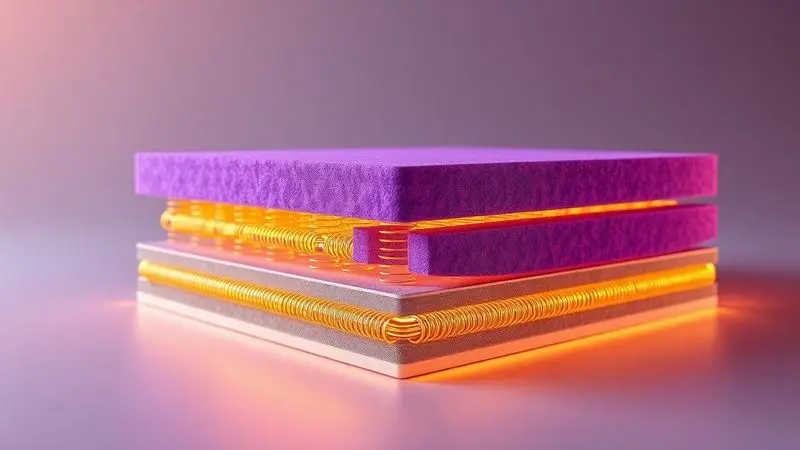
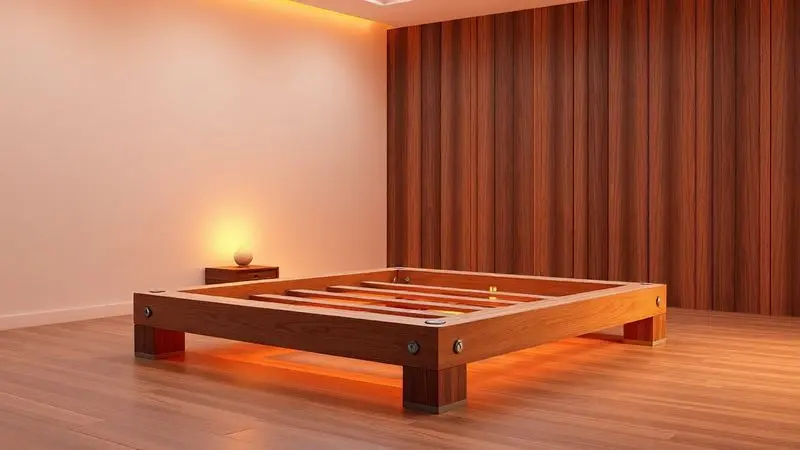
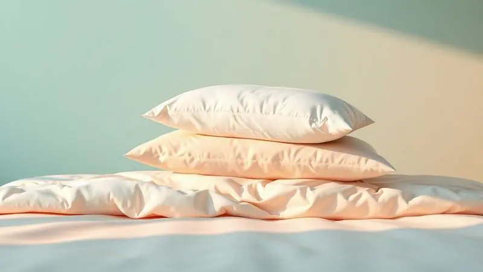

Escolher um colchão que suporte 200kg por pessoa sem deformar ou causar dores nas costas em poucos meses parece um desafio impossível para muitos.

Você provavelmente já passou pela frustração de comprar um modelo que prometia durabilidade, mas acabou "afundando" precocemente.

A boa notícia é que a engenharia de sono evoluiu e existem tecnologias específicas, como as molas Maxspring e espumas compactadas D60, projetadas exatamente para biotipos pesados.

Neste guia completo, você vai descobrir como identificar um colchão de alta performance e conhecer os melhores modelos do mercado para garantir um descanso revigorante e duradouro.

<SummaryList products={frontmatter.top_products} />

## O que realmente significa o suporte de 200kg por pessoa?

Quando um colchão promete suporte para 200kg por pessoa, ele está oferecendo mais do que apenas um número.

Está garantindo que sua coluna vai encontrar alinhamento perfeito durante todas as fases do sono, eliminando aquela sensação de afundamento que transforma a cama em uma rede.

Pense nisso como um abraço firme que não aperta: o colchão distribui seu peso de forma inteligente, mantendo a postura natural do corpo enquanto afasta a possibilidade de deformações prematuras.

Essa característica vai além do conforto imediato, protegendo seu investimento ao longo dos anos, porque um colchão que não cede mantém suas propriedades terapêuticas intactas.

## Espuma vs. Molas: Qual a melhor tecnologia para biotipos maiores?

Imagine dois amigos oferecendo apoio: um se molda perfeitamente ao seu corpo (espuma), enquanto outro oferece uma estrutura sólida com respiração natural (molas). Para biotipos maiores, essa escolha define a qualidade do seu descanso.

A espuma oferece uma conformidade que elimina pontos de pressão, como se estivesse dormindo em uma nuvem personalizada. Já as molas criam um sistema de sustentação inteligente que ventila enquanto suporta, ideal para quem transpira mais ou busca firmeza sem rigidez.

A decisão final fica entre a sensação de abraço perfeito da espuma e o suporte aerado das molas.

### Espuma D45 e D60 Compactada: O segredo da firmeza absoluta

Aqui está onde a magia acontece: as espumas D45 e D60 não são apenas números em uma especificação técnica. A D45 é como um parceiro de dança experiente, oferecendo firmeza suficiente para guiar seu corpo sem perder a suavidade do movimento.

Já a D60 é a base de um edifício, a firmeza absoluta que diz "eu te seguro" a cada noite.

Essa densidade extra transforma o simples ato de deitar em uma experiência de sustentação que mantém sua coluna em perfeita harmonia, garantindo que você acorde renovado, não dolorido. É a diferença entre dormir em um colchão e descansar em uma plataforma terapêutica.

### Molas Maxspring e Miracoil: Por que elas são superiores às ensacadas comuns?

Enquanto as molas ensacadas comuns trabalham como indivíduos em uma multidão, as Maxspring e Miracoil atuam como uma equipe sincronizada.

As Maxspring criam uma rede de apoio inteligente que distribui seu peso de forma tão eficiente que você esquece que está em um colchão, sentindo apenas o conforto.

As Miracoil, com sua estrutura contínua, são como raízes de uma árvore centenária, oferecendo estabilidade que resiste até aos mais inquietos durante a noite. Ambas tecnologias entendem que suportar peso não significa ser rígido, mas sim ser resiliente.

## Top Colchões Recomendados com Alto Suporte de Peso

Agora que você compreende a ciência por trás do suporte perfeito, vamos conhecer os alunos mais aplicados da classe. Esses modelos transformaram teoria em prática, oferecendo noites de sono que realmente reparam o corpo.

### 1. Colchão Herval Multi Support - O Campeão de Resistência

<ProductBox 
  title={frontmatter.top_products[0].title} 
  image={frontmatter.top_products[0].image} 
  link={frontmatter.top_products[0].link} 
/>

Pense no Multi Support como o atleta olímpico dos colchões.

Suas molas ensacadas individualmente são como dedos experientes que encontram exatamente onde seu corpo precisa de apoio, eliminando completamente aquela sensação de rolar para o centro que destrói noites de sono.

Para casais, essa tecnologia é um presente divino: você pode se virar para encontrar a posição perfeita sem despertar quem está ao lado.

A camada de viscoelástica funciona como um climatizador pessoal, regulando sua temperatura corporal enquanto oferece aquele afundamento suave que alivia tensões acumuladas.

Embora cada modelo tenha seu limite específico (variando entre 110kg e 250kg), a experiência da maioria dos usuários confirma: este é o colchão que mantém sua promessa ano após ano, transformando investimento em descanso garantido.

### 2. Colchão Herval Black D60 - Firmeza Extra e Suporte Superior

<ProductBox 
  title={frontmatter.top_products[1].title} 
  image={frontmatter.top_products[1].image} 
  link={frontmatter.top_products[1].link} 
/>

Se você já se sentiu como se estivesse afundando em areia movediça ao deitar, o Black D60 chega como terreno firme. Sua densidade de 60kg/m³ é mais do que um número: é a garantia de que cada noite começará e terminará com o mesmo apoio perfeito.

A espuma compactada de poliuretano não apenas suporta seu peso, mas o faz com consciência ecológica, livre dos químicos que preocupam tantos dorminhocos conscientes.

O segredo da longevidade está no Pillow Top Double Side, uma inovação simplesmente brilhante que dobra a vida útil do colchão ao permitir que você utilize ambos os lados. O tecido Jacquard não é apenas elegante, mas convida seu corpo para descansar com suavidade.

Sim, ele é firme, mas essa firmeza é terapêutica, projetada para quem entende que apoio verdadeiro vem da estrutura, não da maciez excessiva.

### 3. Colchão Castor Silver Star Air - Durabilidade com Certificação Pró-Espuma

<ProductBox 
  title={frontmatter.top_products[2].title} 
  image={frontmatter.top_products[2].image} 
  link={frontmatter.top_products[2].link} 
/>

O Silver Star Air é como ter ar condicionado interno para seu colchão. Seu sistema Air garante que o ar circule livremente, criando um ambiente onde a umidade nunca se acumula e os ácaros não encontram lar.

Combine isso com as molas ensacadas Pocket System, que se comportam como pequenos amortecedores personalizados para seu corpo, e você tem uma receita para noites frescas e apoiadas.

A altura generosa (entre 32cm e 59cm) pode parecer exagerada até você experimentar como essa dimensão extra se traduz em camadas de conforto que envolvem seu corpo completamente.

A malha 3D não é apenas um tecido, é um sistema respiratório que mantém seu microclima de sono perfeito, enquanto os tratamentos antiácaro trabalham silenciosamente para proteger sua saúde enquanto você sonha.

### 4. Colchão Ortobom Freedom - Conforto Premium com Tecnologia SuperPocket

<ProductBox 
  title={frontmatter.top_products[3].title} 
  image={frontmatter.top_products[3].image} 
  link={frontmatter.top_products[3].link} 
/>

O Freedom entende que suporte não precisa ser austero. Suas molas SuperPocket criam uma dança de apoio tão sincronizada que seu parceiro pode praticar acrobacias sem que você perceba.

A verdadeira magia, porém, está na camada pillow top com viscoelástica, que age como uma memória muscular que lembra exatamente como seu corpo prefere ser apoiado.

Os tratamentos com íons de prata e Aloe Vera transformam o colchão em um spa noturno, onde antibacteriano encontra hidratante natural.

Com limite de 150kg por pessoa, ele é o anfitrião perfeito para quem busca luxo inteligente, onde cada elemento serve tanto ao conforto quanto à saúde.

### 5. Herval Imperatore Eco Bamboo - Luxo e Sustentabilidade para Grandes Pesos

<ProductBox 
  title={frontmatter.top_products[4].title} 
  image={frontmatter.top_products[4].image} 
  link={frontmatter.top_products[4].link} 
/>

O Imperatore Eco Bamboo prova que sustentabilidade e suporte robusto podem dormir na mesma cama. Suas molas ensacadas individualmente são sábias: entendem que distribuir peso uniformemente é uma arte, não apenas uma função.

A espuma viscoelástica, com sua herança NASA, faz mais do que conformar: ela dialoga com seu corpo, aliviando pressões que você nem sabia que existiam.

O tecido de bambu é a cereja do bolo, oferecendo aquele frescor natural que faz você esquecer de ligar o ar condicionado.

É importante verificar as especificações exatas de peso (que variam entre fontes), mas quando você encontra o modelo certo, ele se torna mais do que um colchão: é um compromisso com noites frescas, apoiadas e conscientes.

### 6. Colchão Inducol Enjoy - Praticidade e Suporte Inteligente na Caixa

<ProductBox 
  title={frontmatter.top_products[5].title} 
  image={frontmatter.top_products[5].image} 
  link={frontmatter.top_products[5].link} 
/>

O Enjoy é o amigo que chega prontinho para a festa (literalmente, na caixa). Sua tecnologia SmartMax é como ter um fisioterapeuta embutido, ajustando-se milimetricamente aos seus contornos para dizer adeus aos pontos de pressão.

A espuma Memory Foam não apenas lembra seu formato preferido, mas o abraça com precisão cirúrgica.

Esse conforto intermediário é a zona perfeita para quem rejeita extremos: nem tão firme que parece uma tábua, nem tão macio que vira um pântano.

Com suporte para até 120kg por pessoa, ele é o especialista em equilíbrio, provando que praticidade (chegar em uma caixa) e performance podem ser melhores amigos.

## Como escolher a base box ideal para suportar 200kg?

Um colchão extraordinário merece uma base à altura. Pense na base como os alicerces de uma casa: invisíveis, mas essenciais para que tudo permaneça firme.

Para suportar 200kg por pessoa, você precisa de mais do que madeira: precisa de inteligência estrutural que transforme peso em estabilidade.

### A importância da estrutura de Eucalipto e bases bipartidas

<ProductBox 
  title={frontmatter.top_products[6].title} 
  image={frontmatter.top_products[6].image} 
  link={frontmatter.top_products[6].link} 
/>

O eucalipto não é apenas madeira: é um material que respira resistência. Naturalmente resistente a pragas e umidade, ele oferece aquele apoio silencioso que não geme sob pressão, mantendo seu colchão plano como a superfície de um lago calmo.

Sua densidade é a promessa de que amanhã será igual a hoje, sem surpresas deformantes.

As bases bipartidas são o golpe de gênio para espaços reais. Elas entendem que portas têm medidas e escadas existem, oferecendo a praticidade do transporte sem sacrificar a solidez da montagem.

Quando as partes se unem corretamente, criam uma continuidade tão perfeita que você esquece que há uma divisão. É a combinação perfeita: a força ancestral do eucalipto com a inteligência moderna da modularidade.

## Acessórios essenciais para preservar seu colchão de alto suporte

Investir em um colchão de alta performance é como comprar um carro esportivo: precisa dos acessórios certos para manter o brilho. Esses itens não são extras, são extensões da proteção que seu colchão merece.

### Protetor de Colchão Impermeável: Higiene e conservação das fibras

<ProductBox 
  title={frontmatter.top_products[7].title} 
  image={frontmatter.top_products[7].image} 
  link={frontmatter.top_products[7].link} 
/>

Imagine uma capa de chuva invisível que protege seu colchão de acidentes noturnos, suor e a própria passagem do tempo. O protetor impermeável é essa barreira silenciosa que permite que líquidos sejam apenas visitantes passageiros, não residentes permanentes.

Em lares com crianças ou pets, ele se torna o guardião noturno que evita histórias de manchas que viram lembranças indesejadas.

Sim, ele custa um pouco mais, mas esse investimento multiplica a vida do seu colchão, adiando a necessidade de limpezas profundas e mantendo o ambiente de sono livre de ácaros que adoram umidade.

É a diferença entre um colchão que envelhece e um que amadurece com dignidade.

### Travesseiros de Alta Densidade: Alinhamento cervical para ombros largos

<ProductBox 
  title={frontmatter.top_products[8].title} 
  image={frontmatter.top_products[8].image} 
  link={frontmatter.top_products[8].link} 
/>

Para ombros largos, um travesseiro comum é como calçar sapatos apertados: funciona, mas machuca. Os travesseiros de alta densidade são os sapatos sob medida do mundo do sono.

A espuma viscoelástica ou látex não apenas suporta, mas cria uma cama personalizada para sua cabeça, distribuindo o peso como um massagista experiente espalha pressão.

Formatos especiais (borboleta, contornos) são mais do que design: são engenharia ortopédica que cria espaço para seus ombros respirarem enquanto sua coluna cervical encontra seu eixo perfeito.

Encontrar o modelo certo pode ser uma jornada, mas quando você encontra, o alívio é imediato: é como finalmente ajustar os espelhos retrovisores após dirigir o carro de outra pessoa.

## Dicas de Manutenção: Como evitar o afundamento precoce do colchão

Seu colchão é como um vinho fino: precisa de cuidados específicos para revelar seu melhor potencial. Girá-lo a cada três meses não é uma tarefa doméstica, é um ritual de rejuvenescimento que distribui o desgaste como um jardineiro poda galhos, mantendo tudo equilibrado.

A base adequada é o parceiro essencial: imagine dançar tango com alguém que não sabe os passos, o resultado será desastroso.

Mantê-lo limpo e arejado vai além da higiene: é permitir que o colchão respire, expirando o dia acumulado. E evite aqueles pulos ou sentadas na borda: cada ação repetida no mesmo ponto é como martelar o mesmo prego, eventualmente ele cede.

Seguir essas práticas transforma seu colchão de um item para uma relação duradoura.

## Conclusão

Encontrar o colchão perfeito para suportar 200kg não é mais uma busca por uma agulha no palheiro, mas sim uma jornada guiada pela tecnologia inteligente.

Das espumas D60 que oferecem firmeza terapêutica às molas Maxspring que distribuem peso com precisão cirúrgica, cada inovação existe para transformar noites de sono em verdadeiras sessões de recuperação corporal.

Os seis modelos apresentados não são apenas produtos, são soluções personalizadas para quem entende que qualidade de vida começa na qualidade do descanso.

Lembre-se que o colchão é apenas o centro de um ecossistema: bases de eucalipto, protetores impermeáveis e travesseiros de alta densidade são os aliados essenciais que multiplicam a vida útil do seu investimento.

A manutenção regular não é obrigação, é carinho com algo que cuida de você todas as noites. Agora que você tem o mapa completo, desde as tecnologias fundamentais até os modelos específicos, sua decisão será baseada não em esperança, mas em conhecimento sólido.

Seu próximo colchão não será uma compra, será uma parceria de anos de descanso reparador. Qual será o primeiro modelo que você vai experimentar?