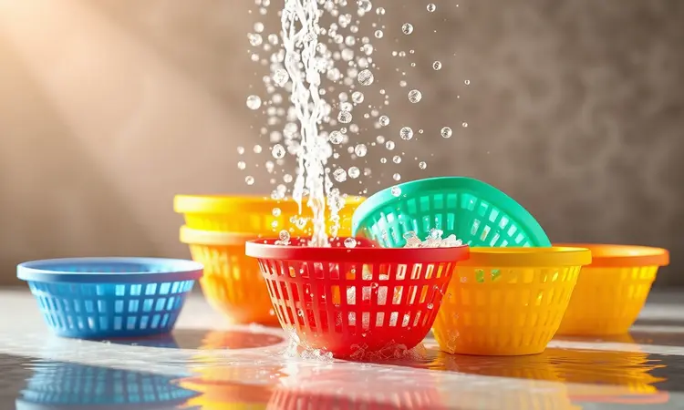
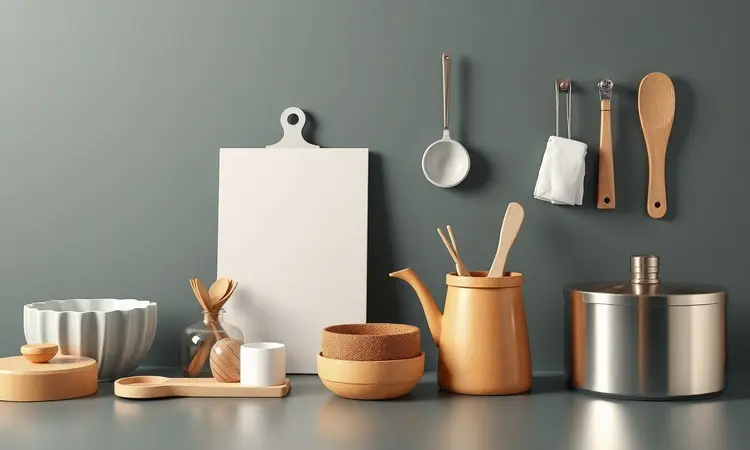
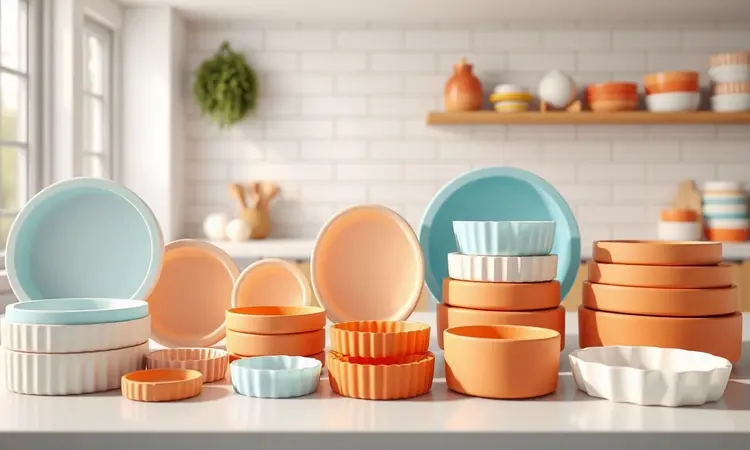
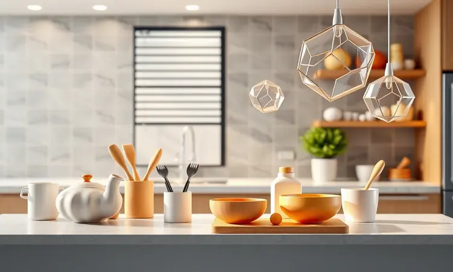

Aquelas bolinhas de gordura grudadas no cesto da airfryer são um verdadeiro desafio, não é mesmo? É justamente por isso que as formas de silicone se tornaram quase uma extensão da própria fritadeira.

Mas, entre uma receita e outra, bate aquela dúvida: será que esse material realmente pode entrar no seu aparelho sem riscos? Mais do que isso, será que não vai acabar deixando seus alimentos molengos em vez de crocantes?

Descobrir como usar esses acessórios da forma correta é o que transforma uma rotina culinária em uma experiência prática e segura.

Você vai aprender não apenas sobre a segurança, mas também sobre como escolher o material ideal para cada tipo de receita, garantindo que cada refeição seja uma celebração, não uma limpeza interminável.

<SummaryList products={frontmatter.top_products} />

## Pode usar forma de silicone na airfryer? Entenda a segurança por trás do acessório

Sim, você pode usar com tranquilidade. O segredo está em escolher formas de qualidade, feitas especificamente para suportar altas temperaturas.

Elas são a solução perfeita para quem busca praticidade: desenformar pães, bolos e tortas se torna um gesto suave, e a lavagem depois do uso não exige esfregões agressivos. É como ter um ajudante na cozinha que cuida dos detalhes chatos.

### Resistência térmica: Até quantos graus o silicone suporta?

<ProductBox 
  title={frontmatter.top_products[0].title} 
  image={frontmatter.top_products[0].image} 
  link={frontmatter.top_products[0].link} 
/>

Imagine poder assar, gratinar e fritar sem nunca se preocupar se o material vai derreter ou soltar cheiro. É isso que o silicone de boa qualidade oferece.

Sua faixa de trabalho costuma ser impressionante, indo de -50°C a +230°C, com o ponto de conforto para uso diário girando em torno dos 200°C. Existem até versões especiais que chegam a suportar 300°C, perfeitas para receitas mais ousadas.

Claro, como tudo na cozinha, exageros podem comprometer a durabilidade. Expor qualquer material a temperaturas extremas por muito tempo não é uma boa ideia. Por isso, basta seguir a receita e as instruções do fabricante.

Com esse cuidado simples, você ganha um aliado duradouro para explorar um mundo de possibilidades culinárias, desde um bolo de domingo até um frango crocante de terça-feira.

## Vantagens de utilizar formas de silicone na sua fritadeira sem óleo

Essa resistência ao calor não é apenas um dado técnico, ela é a chave que abre uma série de benefícios que tornam sua vida na cozinha mais simples e agradável. Vamos além da teoria e mergulhamos na prática do dia a dia.

### 1. Facilidade de limpeza e proteção do antiaderente do cesto

<ProductBox 
  title={frontmatter.top_products[1].title} 
  image={frontmatter.top_products[1].image} 
  link={frontmatter.top_products[1].link} 
/>

O maior alívio vem depois que a comida vai para a mesa: a limpeza. Com uma forma de silicone, você não precisa mais se debater com aquela crosta de queijo ou massa que grudou no fundo do cesto.

A sujeira fica quase toda confinada na forma, que sai com um lava-louças ou com uma passada rápida de esponja macia, água morna e detergente neutro. Para os dias mais difíceis, um banho em água morna com um pouco de bicarbonato de sódio resolve.

E tem mais: ao servir de barreira entre o alimento e o cesto, a forma de silicone torna-se uma verdadeira guardiã do revestimento antiaderente da sua airfryer. Esse cuidado extra prolonga a vida útil do seu aparelho, adiando o desgaste natural.

É uma proteção que se traduz em economia a longo prazo.

### 2. Versatilidade: De bolos fofinhos a pratos salgados

<ProductBox 
  title={frontmatter.top_products[2].title} 
  image={frontmatter.top_products[2].image} 
  link={frontmatter.top_products[2].link} 
/>

Pense na sua airfryer como um forno compacto e superpoderoso. Com a forma de silicone certa, ela se transforma.

Essa mesma forma que segura uma massa de bolo fofinha e úmida também é perfeita para assar uma quiche cremosa ou até para dar aquele toque dourado em pedaços de frango.

O material é naturalmente antiaderente, então o desenforme é sempre limpo, preservando a integridade dos seus pratos.

A única atenção necessária é conferir se a forma cabe dentro da cesta do seu modelo específico. Mas isso é uma preocupação de um minuto.

Com a variedade de tamanhos e formatos disponíveis (redondos, retangulares, em forma de coração), você certamente encontrará a peça que se encaixa perfeitamente, ampliando seu cardápio sem limites.

## Silicone vs. Papel Descartável vs. Alumínio: Qual escolher?

Com tantas opções na prateleira, como decidir? Cada material tem sua personalidade e serve para um momento diferente na sua cozinha. Vamos destrinchar para você não errar na escolha.

### Formas de papel antiaderente: Praticidade total, mas com ressalvas

<ProductBox 
  title={frontmatter.top_products[3].title} 
  image={frontmatter.top_products[3].image} 
  link={frontmatter.top_products[3].link} 
/>

Para aquela correria do dia a dia, quando você quer zero trabalho de lavagem, o papel antiaderente é um salva-vidas. Ele impede que alimentos grudem e pode ser simplesmente descartado após o uso. É a definição de praticidade.

Entretanto, há dois detalhes cruciais. Primeiro, o papel não pode obstruir totalmente o fluxo de ar. Procure por modelos que já venham com perfurações, permitindo que o ar quente circule e atinja a comida por todos os lados.

Segundo, nunca pré-aqueça a airfryer com a forma de papel vazia lá dentro. O jato de ar pode levantá-la, fazendo com que toque na resistência e queime. Com esses cuidados, ele se torna um aliado eficiente.

### Recipientes de alumínio e vidro temperado: Quando usar?

<ProductBox 
  title={frontmatter.top_products[4].title} 
  image={frontmatter.top_products[4].image} 
  link={frontmatter.top_products[4].link} 
/>

Às vezes, o prato pede um material mais rígido. Para gratinados que precisam de uma casquinha dourada por cima, o vidro temperado é uma excelente escolha. Ele é inerte, não libera nenhuma substância, e aguenta bem o calor.

A regra de ouro aqui é nunca submetê-lo a choque térmico. Coloque o recipiente na airfryer ainda frio e deixe aquecer junto com o aparelho.

O alumínio, por sua vez, esquenta rápido e é ótimo para assar batatas ou legumes. A atenção vai para o peso. Recipientes muito leves e pouco cheios podem "voar" com a força do vento quente.

Além disso, prefira o alumínio liso, sem revestimentos antiaderentes suspeitos que podem não ser estáveis em altas temperaturas. Sempre vale uma olhada no manual da sua airfryer para confirmar a compatibilidade.

## O segredo da circulação de ar: Por que sua comida pode demorar mais para assar

O princípio de funcionamento da airfryer é simples: um potente ventilador circula ar quente em alta velocidade em torno dos alimentos. Quando você coloca uma forma de silicone, está introduzindo um novo elemento nesse ecossistema.

Se ela bloquear o caminho do ar, o cozimento fica desigual e leva mais tempo.

### Como posicionar a forma para não bloquear o fluxo de ar quente

<ProductBox 
  title={frontmatter.top_products[5].title} 
  image={frontmatter.top_products[5].image} 
  link={frontmatter.top_products[5].link} 
/>

A chave é pensar no espaço. Escolha uma forma que seja visivelmente menor que o diâmetro da cesta, deixando uma boa margem nas laterais para o ar passar. Se possível, coloque-a sobre uma das grelhas que vêm com o aparelho.

Isso cria uma câmara de ar por baixo, garantindo que o calor também chegue pela parte inferior dos alimentos.

Evite encher a forma até a borda. Deixe um espaço generoso entre os pedaços de comida (se for o caso) e nunca deixe a forma encostar nas paredes da cesta.

Outra dica valiosa é pré-aquecer a airfryer sem a forma e só inseri-la quando o aparelho já estiver na temperatura ideal. Isso garante um início de cozimento mais uniforme e eficiente.

## Guia de Tamanhos: Como escolher a forma ideal para sua Airfryer (3L, 4L ou 5L)

Assim como um sapato, a forma precisa calçar direito. Uma peça muito grande vai sufocar a circulação de ar, enquanto uma muito pequena pode tombar ou não render o suficiente. A capacidade da sua airfryer (3L, 4L ou 5L) é o seu principal guia.

### Tapetes de silicone furados: A alternativa para manter a crocância

<ProductBox 
  title={frontmatter.top_products[6].title} 
  image={frontmatter.top_products[6].image} 
  link={frontmatter.top_products[6].link} 
/>

Se você ama a praticidade de não lavar, mas teme perder a crocância icônica da airfryer, os tapetes de silicone furados são a resposta. Imagine uma versão mais sofisticada do papel manteiga: reutilizável, fácil de lavar e, o mais importante, cheio de pequenos furos.

Esses furos são a mágica.

Eles permitem que o ar quente agressivo da airfryer tenha acesso direto à parte de baixo da comida, garantindo aquela casquinha perfeita em batatas fritas, nuggets e coxinhas, enquanto toda a gordura escorre para baixo do tapete, mantendo o cesto muito mais limpo.

É o equilíbrio perfeito entre proteção e resultado profissional.

## 5 Erros comuns ao usar formas na airfryer que você deve evitar

1. Ignorar o tamanho da cesta: Usar uma forma que preencha todo o espaço interno é o caminho mais rápido para um alimento mal cozido e uma airfryer sobrecarregada.

2. Confiar em qualquer silicone: Nem todo material vendido como "silicone" é de grau alimentício ou resistente o suficiente. Investir em uma marca reconhecida é investir em segurança.

3. Pular o pré-aquecimento com a forma dentro: Colocar uma forma fria em um aparelho já quente pode distorcer o tempo de cozimento indicado nas receitas.

4. Esquecer de pesar a forma: Especialmente ao usar recipientes de alumínio mais leves, garantir que a comida dentro dele tenha peso suficiente evita "acidentes aéreos" dentro da cesta.

5. Não lavar imediatamente após o uso: O silicone pode reter odores se a gordura e os resíduos secarem. Lavar enquanto ainda está morno é a garantia de uma forma sempre neutra.

## Dicas de conservação: Como higienizar e tirar o cheiro do silicone

<ProductBox 
  title={frontmatter.top_products[7].title} 
  image={frontmatter.top_products[7].image} 
  link={frontmatter.top_products[7].link} 
/>

A longevidade das suas formas depende de cuidados simples. Após o uso, basta lavá-las com água morna, detergente neutro e uma esponja macia. Evite lado áspero das esponjas e produtos abrasivos, que podem criar micro-ranhuras.

Se, com o tempo, você perceber que a forma absorveu um cheio de alho ou queijo, não se preocupe. Faça uma pasta com bicarbonato de sódio e um pouco de água, espalhe por toda a superfície e deixe agir por 30 minutos. Enxágue bem.

Para um tratamento mais profundo, coloque um pouco de vinagre branco em uma tigela pequena dentro da airfryer e deixe aquecer por alguns minutos. O vapor de vinagre ajudará a neutralizar os odores.

Esses rituais mantêm suas formas como novas, prontas para a próxima aventura culinária.

## Perguntas Frequentes (FAQ) sobre Acessórios para Airfryer

Essas são as dúvidas que mais pipocam quando o assunto é acessórios. Ter as respostas na ponta da língua (ou da espatula) faz toda a diferença.

### Precisa untar a forma de silicone antes de usar?

Em geral, não. O próprio silicone já oferece uma superfície naturalmente antiaderente.

No entanto, para receitas especialmente delicadas ou com alto teor de açúcar que podem caramelizar e grudar, um leve borrifo de óleo em spray ou uma pincelada suave com azeite pode ser um seguro extra. Isso garante um desenforme impecável e uma limpeza ainda mais fácil.

### A forma de silicone pode liberar substâncias tóxicas? (BPA Free)

Esta é a questão que tira o sono de qualquer pessoa preocupada com a saúde da família. As formas de silicone de qualidade, especificamente as rotuladas como "Grau Alimentício" e "BPA Free", são seguras.

O BPA (Bisfenol A) é um composto associado a vários riscos à saúde que costuma estar presente em alguns plásticos. O silicone de boa fabricação não contém BPA e é estável mesmo em altas temperaturas, não liberando toxinas no seu alimento.

Procure sempre por esse selo de garantia ao comprar.

## Conclusão

Investir em uma boa forma de silicone para sua airfryer vai muito além de comprar mais um utensílio de cozinha. É um passo para transformar a rotina de preparo das refeições.

É a garantia de desenformar um bolo inteiro sem quebrá-lo, de servir um frango com a pele toda crocante sem ter que esfregar gordura ressecada depois, e de fazer tudo isso com a tranquilidade de saber que o material é seguro para sua família.

Essa peça versátil une praticidade, proteção para seu eletrodoméstico e resultados superiores. Ela preenche a lacuna entre a potência da airfryer e a delicadeza que algumas receitas exigem.

Ao escolher uma forma de qualidade, você não está apenas adquirindo um acessório, está conquistando um aliado que vai ampliar suas habilidades na cozinha e trazer mais prazer para cada refeição preparada.

Comece com uma forma básica, teste em suas receitas preferidas e descubra como ela pode se tornar indispensável na sua rotina culinária.