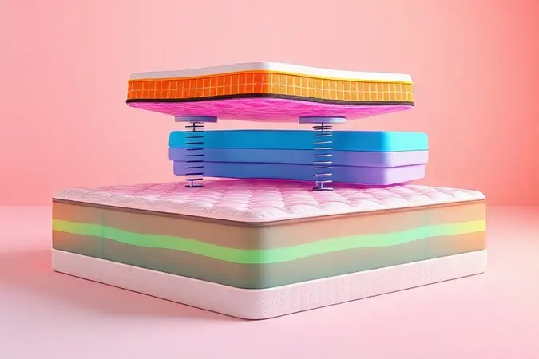
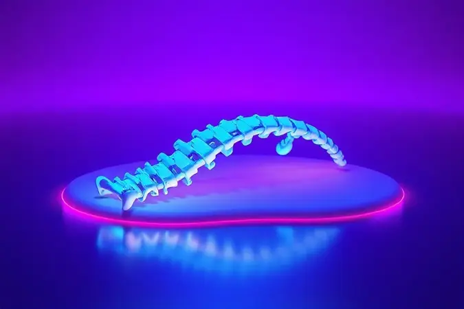
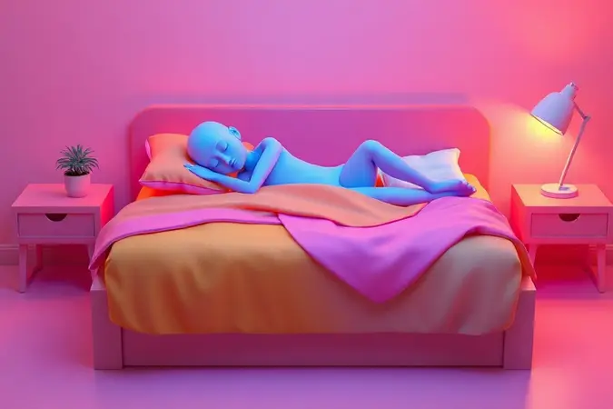

Acordar com dores nas costas pode transformar seu dia em um desafio constante. A escolha do colchão certo não é apenas uma questão de conforto, mas um investimento fundamental na sua saúde postural e qualidade de vida.

Neste guia, vamos explorar como escolher o melhor colchão para coluna, analisando densidade, suporte e as tecnologias mais recomendadas.

Se você busca alívio para dores lombares ou cervicais, acompanhe nossa análise detalhada das 13 melhores opções do mercado e entenda o que realmente importa na hora de decidir pelo colchão ideal para o seu perfil.

<SummaryList products={frontmatter.top_products} />

## Quais os 13 melhores colchões para coluna?

Imagine encontrar um colchão que parece feito sob medida para suas costas. A sensação de acordar renovado, sem aquela rigidez matinal que acompanha seu dia. Essa jornada começa com 13 opções cuidadosamente selecionadas para diferentes necessidades.

### 1. Colchão Ortopédico Wood Light Ortopillow Ortobom

<ProductBox 
  title={frontmatter.top_products[0].title} 
  image={frontmatter.top_products[0].image} 
  link={frontmatter.top_products[0].link} 
/>

Para quem busca o abraço firme da madeira, o Wood Light Ortopillow oferece uma estrutura que parece entender cada curva da sua coluna.

A espuma D38 do pillow top cria um acolhimento gentil sobre a firmeza ortopédica, como se você estivesse dormindo sobre nuvens organizadas.

O tratamento antiácaro no tecido significa que você pode respirar profundamente durante a noite toda, sem aquela irritação nasal que rouba o sono.

Embora o suporte de até 120kg por pessoa possa limitar casais com peso combinado maior, a praticidade do sistema One Side compensa. Você nunca mais precisará daquela luta semanal para virar o colchão.

<CaixaProsContras>

**Prós:**

- Estrutura firme que auxilia no alinhamento da coluna.

- Pillow top em espuma D28 para maior conforto.

- Revestimento com tratamento antiácaro e antifungo.

- Certificação de qualidade INMETRO, garantindo segurança.

**Contras:**

- Suporte limitado a até 120 kg por pessoa.

- Pode ser considerado mais rígido para quem prefere colchões macios.

</CaixaProsContras>

### 2. Colchão D33 Anatômico Iso 100 Ultra Firme Ortobom

<ProductBox 
  title={frontmatter.top_products[1].title} 
  image={frontmatter.top_products[1].image} 
  link={frontmatter.top_products[1].link} 
/>

Quando suas costas pedem estabilidade absoluta, o D33 Anatômico responde com uma firmeza quase cirúrgica. Ele não negocia com o alinhamento da sua coluna, especialmente se você pesa até 100kg.

O tecido com tratamento antiácaro funciona como um escudo invisível contra alergias, enquanto o poliéster expandido interno garante que o colchão mantenha sua promessa ano após ano.

Se você é daqueles que se afunda em colchões muito macios, encontrará aqui o chão firme que sua coluna precisa. A certificação INMETRO é o selo que tranquiliza seu investimento.

<CaixaProsContras>

**Prós:**

- Firmeza ideal para alinhamento da coluna

- Revestimento com tratamento antiácaro e antifungo

- Estrutura durável com certificação do INMETRO

- Disponível em várias dimensões

**Contras:**

- Pode ser muito firme para quem gosta de colchões mais macios

- Garantia variável dependendo do componente

</CaixaProsContras>

### 3. Colchão D45 Anatômico Iso 150 Mega Firme Ortobom

<ProductBox 
  title={frontmatter.top_products[2].title} 
  image={frontmatter.top_products[2].image} 
  link={frontmatter.top_products[2].link} 
/>

Para corpos acima de 100kg que merecem suporte sem concessões, o D45 é como uma fundação de concreto para seu sono. Sua densidade não é apenas um número, é a garantia de que você não afundará na madrugada.

Mesmo com tanta firmeza, as camadas de espuma de alta qualidade criam uma superfície surpreendentemente confortável, mostrando que rigidez não precisa ser sinônimo de desconforto.

A expectativa de vida de 7 a 10 anos significa que este colchão será seu companheiro por quase uma década de noites reparadoras. O tratamento antiácaro transforma cada respiração durante o sono em um ato de saúde.

<CaixaProsContras>

**Prós:**

- Alta firmeza, ótima para quem precisa de suporte ortopédico.

- Tratamento antiácaro e antifungo, promovendo um sono saudável.

- Durabilidade significativa devido à densidade da espuma.

- Conforto notável mesmo com a firmeza acentuada.

**Contras:**

- Pode ser considerado um pouco rígido para quem prefere colchões mais macios.

- O preço pode não ser acessível para todos os orçamentos.

</CaixaProsContras>

### 4. Colchão Herval de Espuma Ortopédica Firme Frontier Selado Inmetro

<ProductBox 
  title={frontmatter.top_products[3].title} 
  image={frontmatter.top_products[3].image} 
  link={frontmatter.top_products[3].link} 
/>

O Frontier Selado conversa com quem valoriza firmeza e consciência ambiental na mesma medida. Sua densidade 60 é a guardiã da sua coluna, enquanto a tecnologia EcoSpuma® permite dormir bem sabendo que parte do material vem de espumas recicladas.

O pillow top Double Side estende a vida útil do colchão, como se você tivesse dois produtos em um.

Suportar até 150kg por pessoa não é apenas um dado técnico, é a promessa de que mesmo corpos mais robustos encontrarão o suporte que precisam. A rigidez inicial pode surpreender quem está acostumado com superfícies mais acolhedoras, mas sua coluna agradecerá cada manhã.

<CaixaProsContras>

**Prós:**

- Alta densidade que oferece firmeza e suporte.

- Tecnologia EcoSpuma® com espuma reciclada.

- Pillow Top Double Side para maior durabilidade.

- Certificado pelo Inmetro, garantindo qualidade.

**Contras:**

- Pode ser considerado rígido para quem gosta de colchões mais macios.

- Algumas pessoas podem preferir opções com maior variedade de conforto.

</CaixaProsContras>

### 5. Colchão D45 Anatomico Guarda Costas Proextreme Plus Euro Pillow Gray Probel

<ProductBox 
  title={frontmatter.top_products[4].title} 
  image={frontmatter.top_products[4].image} 
  link={frontmatter.top_products[4].link} 
/>

O Guarda Costas não é apenas um nome, é uma declaração de intenções. Com densidade D45 e pillow top europeu, ele cria uma barreira protetora para sua coluna enquanto oferece um toque de sofisticação no conforto.

O tecido hipoalergênico funciona como segunda pele, impedindo que ácaros roubem seu sono.

Este colchão fala a linguagem da rigidez terapêutica. Se você acorda com a sensação de que sua cama cedeu durante a noite, encontrará aqui a resistência que sua postura precisa.

<CaixaProsContras>

**Prós:**

- Suporte ortopédico eficaz com densidade D45.

- Ideal para pessoas que necessitam de firmeza ao dormir.

- Tratamento antiácaro e antifungo, hipoalergênico.

- Pillow Top Europeu que aumenta o conforto.

**Contras:**

- Superfície mais rígida, pode não agradar a todos.

- Apenas um lado utilizável, limitando a durabilidade do uso.

</CaixaProsContras>

### 6. Colchão Ortopédico Wood Exclusive Ortopillow Ortobom

<ProductBox 
  title={frontmatter.top_products[5].title} 
  image={frontmatter.top_products[5].image} 
  link={frontmatter.top_products[5].link} 
/>

A tecnologia Ortopillow transforma a firmeza da madeira tratada em uma experiência que lembra dormir sobre um travesseiro gigante. A espuma D33 de Poliol Vegetal não apenas suporta, mas parece entender cada movimento do seu corpo durante a noite.

O tratamento antiácaro no tecido significa menos espirros matinais e mais sono ininterrupto.

Para quem acha que colchões ortopédicos precisam sacrificar o aconchego, este modelo apresenta um argumento convincente: é possível ter suporte e conforto no mesmo espaço.

<CaixaProsContras>

**Prós:**

- Estrutura durável em madeira tratada

- Camada de espuma que oferece excelente suporte

- Tecido antiácaro e antifungo

- Tecnologia Ortopillow para maior conforto

**Contras:**

- Firmeza pode não agradar quem prefere colchões mais macios

- Peso máximo suportado é de até 150 kg por pessoa

</CaixaProsContras>

### 7. BF Colchões Premium

<ProductBox 
  title={frontmatter.top_products[6].title} 
  image={frontmatter.top_products[6].image} 
  link={frontmatter.top_products[6].link} 
/>

Mais de 55 anos de mercado ensinaram à BF Colchões que tecnologia e tradição podem dormir na mesma cama. A espuma da NASA combinada com molas ensacadas cria uma experiência que parece desafiar a gravidade.

O Premium Sleep minimiza a transferência de movimento tão eficientemente que você quase esquece que há alguém ao seu lado.

Para noites quentes, o BF Premium Ice oferece o frescor que seu corpo busca durante o verão. Sim, o investimento é significativo, mas quando você divide o preço pelos anos de sono reparador, cada centavo encontra seu valor.

<CaixaProsContras>

**Prós:**

- Conforto excepcional com materiais de alta tecnologia.

- Suporte ortopédico eficaz para aliviar pontos de pressão.

- Tratamento hipoalergênico, ideal para alérgicos.

- Variedade de modelos para diferentes preferências e necessidades.

**Contras:**

- Alguns modelos podem ter preço elevado.

- Pode não ser acessível para todos os orçamentos.

</CaixaProsContras>

### 8. Colchão Emma Original

<ProductBox 
  title={frontmatter.top_products[7].title} 
  image={frontmatter.top_products[7].image} 
  link={frontmatter.top_products[7].link} 
/>

A Emma Original apresenta um equilíbrio tão perfeito entre firmeza e adaptabilidade que parece ler seus movimentos durante a noite. Sua espuma de memória não apenas molda ao corpo, mas faz isso com uma inteligência que alivia pontos de pressão específicos.

A circulação de ar mantém a temperatura estável, evitando aquela sensação abafada que interrompe o sono profundo.

A capa removível e lavável é a solução para quem já perdeu um colchão para acidentes domésticos. Se você é mais leve e dorme de lado, poderá sentir a firmeza mais intensamente, mas para a maioria, este colchão encontra o ponto ideal.

<CaixaProsContras>

**Prós:**

- Conforto excepcional com alívio de pressão.

- Boa circulação de ar para controle da temperatura.

- Ideal para vários tipos de dorminhocos.

- Cobertura lavável e fácil de manter.

**Contras:**

- Pode ser muito firme para dorminhocos mais leves.

- Dorminhocos mais pesados podem preferir um colchão mais firme.

</CaixaProsContras>

### 9. Luuna Original Firme

<ProductBox 
  title={frontmatter.top_products[8].title} 
  image={frontmatter.top_products[8].image} 
  link={frontmatter.top_products[8].link} 
/>

A LuunaGel dentro do Luuna Original Firme funciona como um sistema de climatização pessoal para seu sono. Enquanto as camadas de espuma trabalham para aliviar pontos de pressão, o gel dissipa o calor, mantendo a superfície na temperatura ideal.

O bloqueio de movimento é tão eficiente que você pode trocar de posição sem medo de despertar seu parceiro.

A firmeza 7/10 é como um aperto de mão confiável para sua coluna, nem muito solto nem muito apertado. A capa de viscose de bambu não apenas é lavável, mas respira com seu corpo durante a noite.

<CaixaProsContras>

**Prós:**

- Combinação de firmeza e conforto

- Camadas de espuma que aliviam pontos de pressão

- Bloqueio de movimento para casais

- Capa removível e fácil de lavar

**Contras:**

- Alguns usuários relatam entrega demorada

- Firmeza pode não agradar quem prefere colchões muito duros

</CaixaProsContras>

### 10. Castor Silver Star Air

<ProductBox 
  title={frontmatter.top_products[9].title} 
  image={frontmatter.top_products[9].image} 
  link={frontmatter.top_products[9].link} 
/>

Quando molas pocket encontram pillow top, o resultado é o Silver Star Air. Sua tecnologia Air promove uma circulação que parece ventilar seu sono da dentro para fora.

O design Double Face não apenas prolonga a vida útil, mas oferece duas experiências diferentes em um único produto.

O cheiro inicial que alguns relatam é o preço temporário por materiais novos de qualidade. O toque do pillow top pode não ser o mais sedoso do mercado, mas o conforto geral compensa qualquer pequena concessão.

<CaixaProsContras>

**Prós:**

- Conforto excepcional com a combinação de molas pocket e pillow top.

- Firmeza média adequada para diferentes perfis corporais.

- Tecnologia Air que mantém o colchão fresco e higiênico.

- Design Double Face que prolonga a vida útil do produto.

**Contras:**

- Relatos de cheiro persistente após a compra.

- Material do pillow top poderia ser mais macio ao toque.

</CaixaProsContras>

### 11. Guldi firme

<ProductBox 
  title={frontmatter.top_products[10].title} 
  image={frontmatter.top_products[10].image} 
  link={frontmatter.top_products[10].link} 
/>

A garantia de 100 noites da Guldi é um voto de confiança na firmeza do seu colchão. Você pode testar em casa, acordar 100 manhãs diferentes, e só então decidir se este é o suporte que sua coluna merece.

As molas ensacadas trabalham independentemente, como dedos cuidadosos sustentando cada parte do seu corpo.

Se você sempre sentiu que colchões macios traem sua postura durante a noite, encontrará na Guldi firme a lealdade que procura.

<CaixaProsContras>

**Prós:**

- Ótimo suporte para a coluna

- Tecnologia de molas ensacadas

- Garantia de 100 noites para avaliação

- Disponível em várias dimensões

**Contras:**

- A firmeza pode não agradar a todos

- Pode ser considerado menos confortável por quem prefere colchões macios

</CaixaProsContras>

### 12. Emma Duo Comfort

<ProductBox 
  title={frontmatter.top_products[11].title} 
  image={frontmatter.top_products[11].image} 
  link={frontmatter.top_products[11].link} 
/>

Duas personalidades em um único colchão: de um lado o aconchego que abraça, do outro a firmeza que sustenta. O Emma Duo Comfort é para quem não consegue decidir entre maciez e suporte, ou para casais com preferências opostas.

A capa hipoalergênica protege seu sono contra alérgenos enquanto mantém a limpeza como uma tarefa simples.

Com 100 noites de teste e 10 anos de garantia, este colchão pede apenas uma coisa: que você dê a ele uma chance de provar sua versatilidade.

<CaixaProsContras>

**Prós:**

- Duas opções de firmeza em um único colchão.

- Capa hipoalergênica, removível e lavável.

- Suporta até 130 kg por pessoa.

- Garantia de 10 anos e 100 noites de teste.

**Contras:**

- A firmeza do lado mais duro pode não agradar todos os perfis de peso.

- Pode ser considerado um investimento acima da média por algumas pessoas.

</CaixaProsContras>

### 13. Cama Box King Molas Pocket San Francisco Moderate Simmons

<ProductBox 
  title={frontmatter.top_products[12].title} 
  image={frontmatter.top_products[12].image} 
  link={frontmatter.top_products[12].link} 
/>

A tradição da Simmons encontra inovação tecnológica nesta cama box que transforma o apoio personalizado em arte. Cada mola ensacada age como um sensor individual, ajustando-se ao contorno exato do seu corpo.

A combinação com espuma viscoelástica e látex natural cria uma experiência tridimensional de conforto.

A possibilidade de afundamento precoce em alguns modelos é um lembrete de que mesmo as melhores tecnologias têm seu ritmo de adaptação. Mas a reputação da marca e a qualidade dos materiais transformam este produto em uma herança para seu sono.

<CaixaProsContras>

**Prós:**

- Tecnologia de molas ensacadas para suporte personalizado.

- Reduz a transferência de movimento entre parceiros.

- Camadas de espuma viscoelástica para maior conforto.

- Marca com longa tradição e reputação no mercado.

**Contras:**

- Possibilidade de afundamento precoce em alguns modelos.

- A escolha da firmeza pode não agradar a todos os usuários.

</CaixaProsContras>

## 1. Por que o Colchão Influencia nas Dores nas Costas?

Seu colchão é mais do que um lugar para dormir, é o terapeuta noturno da sua coluna. Durante 8 horas por noite, ele decide se suas vértebras ficarão alinhadas como pérolas em um colar, ou se serão pressionadas como botões em um teclado desalinhado.

Um colchão muito rígido força tensão muscular, como se você estivesse dormindo sobre uma tábua. Já um excessivamente macio afunda seu corpo em um vale que distorce sua postura natural.

O segredo está no equilíbrio que permite afundamento suficiente para aliviar pontos de pressão, mas firmeza adequada para manter a coluna em sua curva natural. É essa dança entre conforto e suporte que transforma um simples objeto do quarto em um instrumento de saúde.

## Como um bom colchão para coluna tem que ser?

Imagine um colchão que conversa com sua coluna em sua linguagem nativa. Ele reconhece se você dorme de costas pedindo firmeza, ou de lado pedindo maciez para os ombros.

Materiais como espuma viscoelástica são poliglotas do conforto, adaptando-se ao seu corpo com uma inteligência quase orgânica.

A ventilação não é apenas um detalhe técnico, é o sistema respiratório do seu sono, evitando que o calor acumulado interrompa seus ciclos profundos.

A densidade ideal não é um número em uma etiqueta, é a sensação de acordar com energia, sem aquela rigidez que parece grudar em suas articulações.

## 2. Tipos de Colchões Indicados para Dores nas Costas

Cada tipo de colchão oferece uma filosofia diferente de suporte. Entender essas diferenças é como escolher o terapeuta certo para suas costas.

### Colchões de espuma de alta densidade

Estas espumas são as guardiãs da durabilidade, oferecendo resistência que se mede em anos de sono reparador.

Sua adaptação ao corpo não é imediata como a memória, mas progressiva e consistente, aliviando pressões em ombros e quadris com uma firmeza que não cede ao tempo.

A ventilação moderna nestes modelos transforma o que antes era um material quente em uma superfície respirável.

### Colchões de molas ensacadas

Cada mola em seu envoltório individual é como um terapeuta dedicado a uma pequena área do seu corpo. A redução da transferência de movimento não é apenas uma conveniência para casais, é a garantia de que seus movimentos noturnos não serão punidos com interrupções.

A ventilação natural que as molas proporcionam mantém seu sono em uma temperatura constante, como se houvesse uma brisa suave sob seus lençóis.

### Colchões híbridos

Os híbridos são os diplomatas do mundo dos colchões, negociando um tratado entre firmeza e adaptabilidade. Eles combinam a resistência estrutural das molas com o conforto personalizado das espumas, criando uma superfície que parece entender equilíbrios invisíveis.

Sua ventilação híbrida funciona em duas frentes, garantindo que nenhum dos materiais monopolize a temperatura do seu sono.

## 3. Aspectos Técnicos a Considerar na Escolha do Colchão

Escolher um colchão é como fazer uma cirurgia não invasiva na sua rotina de sono. Cada aspecto técnico é um instrumento que pode curar ou ferir sua coluna.

### Colchão firme ou macio: qual é o ideal?

Esta não é uma questão de gosto, mas de fisiologia. Seu corpo sabe a resposta antes mesmo de sua mente formulá-la. Pessoas que dormem de costas geralmente encontram na firmeza o chão que sua coluna lombar precisa para manter sua curva natural.

Quem dorme de lado descobre na maciez o vale que acomoda ombros e quadris sem pressionar a coluna vertebral.

O teste é simples: deite-se e pergunte às suas costas se elas se sentem suspensas ou comprimidas. A resposta virá na primeira manhã após dormir.

### Considere sua posição de dormir

Sua posição de sono é seu DNA noturno, e o colchão ideal precisa falar essa linguagem genética. Dorminhocos laterais precisam de maciez que crie espaço para o ombro, como um ninho esculpido em espuma.

Os dorsais exigem firmeza que sustente como um espelho refletindo sua postura. Já os que dormem de barriga para baixo necessitam de uma superfície tão plana quanto um lago congelado, prevenindo a torção cervical.

Seu colchão não deve apenas permitir sua posição preferida, mas otimizá-la para a saúde da sua coluna.

## Como saber se o colchão é ortopedico?

Um colchão ortopédico verdadeiro não anuncia, demonstra. Ele distribui seu peso como um mestre de balé distribui dançarinos no palco, nenhuma área sobrecarregada. Mantém a curvatura natural da sua coluna não como uma imposição, mas como um convite à postura correta.

Os materiais não apenas suportam, mas educam seu corpo durante a noite, ensinando-o a descansar sem prejudicar-se.

Procure por tecidos que respirem e materiais que tenham memória não apenas do seu corpo, mas da ciência por trás da saúde postural.

### Certificações e padrões de qualidade

CertiPUR e OEKO-TEX não são apenas selos em uma etiqueta, são juramentos de que seus materiais não trairão sua saúde durante a noite. ABNT é a assinatura que garante que a durabilidade prometida não é apenas marketing, mas engenharia testada.

Estes certificados são os advogados do seu sono, garantindo que cada componente cumpra seu papel na sinfonia do repouso.

### Colchão ortopédico é indicado para todo mundo?

A verdade sobre colchões ortopédicos é como remédios fortes: funcionam maravilhosamente para quem precisa, mas podem ser desconfortáveis para quem não tem a condição que tratam.

Pessoas com dores específicas ou problemas posturais encontram neles o suporte cirúrgico que suas colunas pedem. Já dorminhocos sem questões específicas podem sentir a firmeza como rigidez desnecessária.

Seu peso, altura e padrões de movimento noturno são os três juízes que decidem se um colchão ortopédico é sua sentença para noites melhores ou apenas uma punição desnecessária.

## 4. Cuidados Extras para Potencializar o Alívio da Dor nas Costas

Um bom colchão é o maestro, mas outros instrumentos precisam estar afinados na orquestra do seu bem-estar. Exercícios regulares são os ensaios diários que fortalecem os músicos (seus músculos) para a apresentação noturna.

A ergonomia no trabalho é a partitura que guia sua postura durante o dia, preparando-a para o descanso noturno.

Técnicas de relaxamento como yoga são os solos que aliviam tensões acumuladas, permitindo que seu corpo entre no sono como uma orquestra que encontrou sua harmonia perfeita.

Levantar objetos corretamente não é apenas uma técnica, é o respeito que seu corpo merece a cada movimento.

## Conclusão

Escolher o colchão certo para sua coluna é mais do que uma compra, é um pacto noturno com sua saúde.

Cada um dos 13 modelos que analisamos oferece uma filosofia diferente de suporte, desde a firmeza cirúrgica dos ortopédicos tradicionais até a adaptabilidade inteligente das tecnologias modernas.

O segredo não está em encontrar o melhor colchão do mercado, mas o melhor colchão para o seu corpo específico, seus padrões de sono únicos, suas dores particulares.

Lembre-se: sua coluna não pede luxo, pede entendimento. Não precisa da tecnologia mais cara, precisa do suporte mais adequado.

Ao experimentar diferentes opções, ouça não apenas sua preferência imediata de conforto, mas a resposta que suas costas darão na manhã seguinte.

Porque o verdadeiro teste de um colchão não acontece na loja, mas nos primeiros 30 segundos após abrir os olhos, quando seu corpo revela como foi tratado durante a noite.

Comece observando suas dores, entendendo sua posição de sono, considerando seu peso. Depois, dê ao seu corpo a chance de experimentar diferentes superfícies.

Seja paciente, porque encontrar o parceiro perfeito para seu sono pode levar tempo, mas cada noite reparadora que você conquistar será um investimento que retorna em energia, saúde e bem-estar.

Sua coluna merece esse cuidado, e sua qualidade de vida agradecerá todas as manhãs.