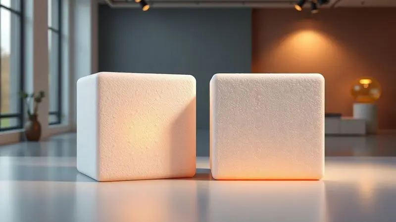
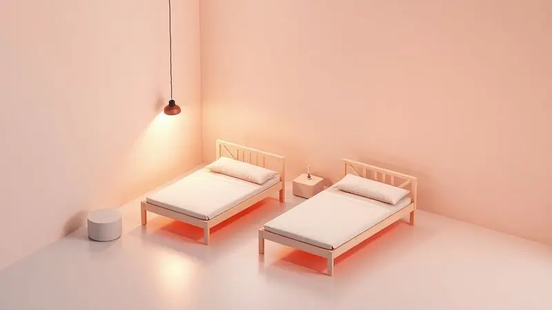
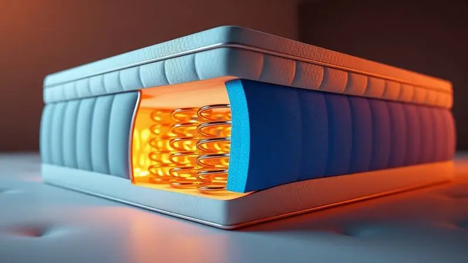

Escolher o colchão certo é fundamental para garantir não só uma boa noite de sono, mas também a saúde da sua coluna em longo prazo.

E quando surge aquela dúvida clássica, qual o melhor colchão para cama de solteiro: D20 ou D33?, você está diante de mais do que uma simples escolha entre números.

Essas siglas representam a densidade da espuma e ditam como seu corpo será acolhido todas as noites, influenciando diretamente na qualidade do seu descanso.

Neste guia, vamos descomplicar essas diferenças técnicas e transformá-las em linguagem que faz sentido para o seu dia a dia.

Você vai entender como cada densidade afeta seu conforto, descobrir quais modelos realmente valem seu investimento e, principalmente, encontrar a opção perfeita para o seu biotipo. Prepare-se para dormir como nunca imaginou possível.

<SummaryList products={frontmatter.top_products} />

## Análise Completa: Os 9 Melhores Colchões de Solteiro

Selecionar um colchão de solteiro vai muito além do preço ou da marca. É sobre encontrar a combinação perfeita entre suporte, conforto e durabilidade que se adapte ao seu corpo e ao seu estilo de vida.

A seguir, apresentamos nove modelos que se destacam no mercado, cada um com sua proposta única para transformar suas noites.

### 1. Ortobom Misto ISO 100 D33 Solteiro

<ProductBox 
  title={frontmatter.top_products[0].title} 
  image={frontmatter.top_products[0].image} 
  link={frontmatter.top_products[0].link} 
/>

Imagine acordar sem aquela rigidez nas costas que parece acompanhá-lo o dia todo. O Ortobom Misto ISO 100 D33 consegue exatamente isso, equilibrando firmeza e conforto de forma inteligente.

Com 18 cm de espessura, ele combina uma base de EPS com espuma D33 Pró Aditivada de Alta Performance, oferecendo suporte adequado para pessoas de até 100 kg.

O segredo está no detalhe do tampo em matelassê bordado, que cria uma camada extra de aconchego sem comprometer a sustentação.

E enquanto você descansa, o revestimento em Viscopoli ou Poliéster com tratamento antialérgico e antiácaro trabalha silenciosamente para garantir um ambiente mais saudável, livre de irritações que possam interromper seu sono.

A firmeza média deste colchão pode ser justamente sua maior virtude, não é tão dura a ponto de sentir-se em uma tábua, nem tão macia que seu corpo afunde.

É o ponto ideal para quem busca versatilidade, adaptando-se a diferentes posições de dormir sem exigir um período longo de adaptação.

<CaixaProsContras>

**Prós:**

- Conforto proporcionado pelo tampo em matelassê.

- Material antialérgico e antiácaro.

- Estrutura robusta adequada para até 100kg.

- Boa combinação de firmeza para variados perfis de usuários.

**Contras:**

- Firmeza média pode não agradar a todos.

- Necessidade de rotação periódica para manter a qualidade.

</CaixaProsContras>

### 2. Hellen New Millennium D33 com Pillow Top

Para quem busca a sensação de dormir em um hotel todas as noites, o Hellen New Millenium D33 com Pillow Top é uma experiência à parte.

A camada extra Pillow Top não é apenas um detalhe estético, é um convite ao descanso profundo, envolvendo seu corpo em suavidade desde o primeiro contato.

Com densidade D33 e capacidade para suportar até 120 kg por pessoa, este colchão oferece algo raro: a combinação de acolhimento macio com estrutura firme.

Seus 19 cm de altura e classificação ortopédica garantem que sua coluna permaneça alinhada, mesmo durante horas de sono, enquanto o revestimento em tecidos como Granite ou Jacquard adiciona não apenas beleza, mas também proteção com tratamentos antiácaro.

Sim, ele tende a ser mais firme do que colchões convencionais, mas é justamente essa firmeza que trabalha a seu favor durante a noite, prevenindo aquela sensação de afundamento que tanto incomoda ao mudar de posição.

<CaixaProsContras>

**Prós:**

- Excelente suporte com densidade D33.

- Camada Pillow Top para maior conforto.

- Disponível em vários tamanhos.

- Possui tratamentos antiácaro e antialérgico.

**Contras:**

- Pode ser um pouco firme para quem prefere colchões macios.

- Altura pode não agradar a todos os gostos.

</CaixaProsContras>

### 3. Sensor Espuma D33 (88x188x14cm)

<ProductBox 
  title={frontmatter.top_products[2].title} 
  image={frontmatter.top_products[2].image} 
  link={frontmatter.top_products[2].link} 
/>

Algumas vezes, a simplicidade é a maior sofisticação. O Sensor Espuma D33 prova isso com suas medidas padrão (88x188x14cm) que se adaptam perfeitamente à maioria das camas de solteiro, eliminando a complicação na hora da compra.

Com densidade de 33 kg/m³, ele oferece um suporte firme que é especialmente apreciado por quem dorme de costas ou de lado.

Imagine não precisar se preocupar com crises alérgicas no meio da noite. Muitos modelos desta linha contam com tratamentos antialérgicos, antiácaros e antimofo que funcionam como uma barreira invisível contra irritações.

E graças ao design de dupla face, você praticamente ganha dois colchões em um, basta virar quando necessário, aumentando significativamente a vida útil do produto.

Para quem sempre sentiu que os colchões comuns eram insuficientes, a firmeza do D33 pode ser a revelação que faltava para noites verdadeiramente reparadoras.

<CaixaProsContras>

**Prós:**

- Densidade firme que oferece bom suporte.

- Tratamentos antialérgicos e antiácaros disponíveis.

- Durabilidade aumentada com design de dupla face.

- Tamanho padrão que se adapta a diversas camas.

**Contras:**

- Pode ser considerado muito firme para algumas preferências pessoais.

- Limitação em suportar pesos superiores a 120 kg em alguns modelos.

</CaixaProsContras>

### 4. Hellen Malibu Espuma D20 (88x188x12cm)

<ProductBox 
  title={frontmatter.top_products[3].title} 
  image={frontmatter.top_products[3].image} 
  link={frontmatter.top_products[3].link} 
/>

Procurando um colchão que combine praticidade, higiene e custo-benefício para o quarto das crianças? O Hellen Malibu Espuma D20 é como encontrar a peça que faltava no quebra-cabeça da organização familiar.

Com densidade D20 indicada para pessoas de até 60 kg, ele oferece exatamente o equilíbrio certo de maciez e suporte que crianças e adolescentes necessitam.

O revestimento em tecido granite 100% poliéster é uma dádiva para pais, fácil de limpar, resiste ao acúmulo de poeira e ajuda a manter o ambiente saudável.

E quando combinado com propriedades antiácaros, transforma-se em um aliado silencioso na proteção da saúde dos pequenos.

É importante entender seu propósito: não foi feito para adultos que excedam a faixa de peso indicada, mas para camas infantis e auxiliares, onde sua leveza (apenas 12cm de altura) e praticidade se tornam vantagens inquestionáveis.

<CaixaProsContras>

**Prós:**

- Ideal para crianças e adolescentes com peso até 60 kg.

- Tecido fácil de limpar e higiênico.

- Propriedades antiácaros para uma melhor saúde.

- Bom custo-benefício para quem busca um colchão básico.

**Contras:**

- Não recomendado para pessoas acima de 60 kg.

- Altura de 12cm pode ser considerada baixa para alguns usuários.

</CaixaProsContras>

### 5. Sensor Espuma D33 Estreito (78x188x14cm)

<ProductBox 
  title={frontmatter.top_products[4].title} 
  image={frontmatter.top_products[4].image} 
  link={frontmatter.top_products[4].link} 
/>

Quem mora em apartamentos ou quartos compactos sabe que cada centímetro conta. O Sensor Espuma D33 Estreito (78x188x14cm) é a solução inteligente que não sacrifica qualidade por espaço.

Com 10cm a menos na largura, ele se encaixa perfeitamente em ambientes menores enquanto mantém toda a firmeza da densidade D33.

Para pessoas entre 71kg e 100kg, esta densidade faz toda a diferença na alinhamento da coluna. A espuma molda-se aos seus contornos de forma inteligente, aliviando pontos de pressão nos ombros e quadris que costumam causar aquela sensação de dormir mal.

E a durabilidade é outro ponto forte, colchões de alta densidade como este mantêm sua forma por anos, tornando-se um investimento que realmente compensa a longo prazo.

Se você sofre com alergias, os tratamentos hipoalergênicos disponíveis em muitos modelos são como um suspiro de alívio literalmente todas as noites.

<CaixaProsContras>

**Prós:**

- Suporte firme ideal para alinhamento da coluna.

- Boa durabilidade e resistência ao desgaste.

- Proporciona conforto ao moldar-se ao corpo.

- Tratamentos hipoalergênicos, benéficos para alérgicos.

**Contras:**

- Pode ser considerado um pouco rígido para quem prefere colchões mais macios.

- Requer verificação da certificação do INMETRO para garantir qualidade.

</CaixaProsContras>

### 6. Hellen Malibu Espuma D20 Estreito (78x188x12cm)

<ProductBox 
  title={frontmatter.top_products[5].title} 
  image={frontmatter.top_products[5].image} 
  link={frontmatter.top_products[5].link} 
/>

Às vezes, a simplicidade é tudo que precisamos. O Hellen Malibu Espuma D20 Estreito é o colega de quarto discreto que cumpre sua função sem complicações.

Com medidas de 78x188x12cm, ele é perfeito para camas auxiliares, quartos de hóspedes ou qualquer situação onde você precise de um colchão prático e funcional.

Seu revestimento em tecido granite 100% poliéster é a definição de praticidade, uma passada de pano e está pronto para o próximo uso, sem preocupações com manchas ou acúmulo de poeira.

Com apenas 4,40 kg, movê-lo é tão fácil quanto trocar os lençóis, uma vantagem que pais de crianças pequenas ou quem recebe visitas com frequência sabem valorizar.

A garantia de 12 meses oferece aquela tranquilidade adicional, enquanto o peso máximo suportado (50-60kg) define claramente seu público: não é para todos, mas para quem se encaixa nesse perfil, é a escolha certa.

<CaixaProsContras>

**Prós:**

- Revestimento resistente e fácil de limpar.

- Conforto adequado para noites tranquilas.

- Garantia de 12 meses, garantindo um suporte ao cliente.

- Leve e prático para manuseio.

**Contras:**

- Peso máximo suportado pode ser limitante para algumas pessoas.

- Altura relativamente baixa pode não agradar a todos.

</CaixaProsContras>

### 7. Sensor Espuma D20 (88x188x12cm)

<ProductBox 
  title={frontmatter.top_products[6].title} 
  image={frontmatter.top_products[6].image} 
  link={frontmatter.top_products[6].link} 
/>

Para crianças ou adultos de estrutura mais leve, encontrar um colchão que ofereça conforto sem ser excessivamente firme pode ser um desafio.

O Sensor Espuma D20 resolve essa equação com elegância, proporcionando a maciez ideal para quem não precisa do suporte robusto das densidades mais altas.

Feito de espuma de poliuretano com densidade D20, este colchão é acessível sem parecer barato. Muitos modelos vêm com tratamento antialérgico e até impermeável, uma combinação poderosa para quartos infantis onde acidentes acontecem.

A versão dupla face é particularmente inteligente, basicamente dobra a vida útil do produto, permitindo que você o vire periodicamente para um desgaste mais uniforme.

É essencial entender suas limitações: não é o colchão ideal para pessoas mais pesadas, mas para seu público-alvo específico, ele cumpre exatamente o que promete, conforto simples e eficaz.

<CaixaProsContras>

**Prós:**

- Confortável e acessível.

- Tratamentos antialérgicos e impermeáveis disponíveis.

- Opção dupla face para maior durabilidade.

- Bom para crianças e pessoas leves.

**Contras:**

- Pode não suportar bem o peso de adultos mais pesados.

- Estampas e cores podem variar conforme o lote.

</CaixaProsContras>

### 8. Colchão Solteiro Macio D20 (88cm)

<ProductBox 
  title={frontmatter.top_products[7].title} 
  image={frontmatter.top_products[7].image} 
  link={frontmatter.top_products[7].link} 
/>

Imagine chegar em casa depois de um dia cansativo e simplesmente afundar em um abraço macio e reconfortante. É exatamente essa sensação que o colchão solteiro macio D20 com 88cm de largura oferece.

Com densidade D20, ele é a escolha perfeita para crianças, adolescentes ou até para aquela cama de hóspedes que quer fazer seus visitantes se sentirem realmente acolhidos.

Sua leveza é uma vantagem subestimada, movê-lo para limpar ou reorganizar o quarto torna-se uma tarefa simples, não uma maratona.

E para quem convive com alergias, os tratamentos antiácaros e antifúngicos presentes em muitos modelos funcionam como uma barreira protetora invisível, permitindo noites de sono sem espirros ou coceiras.

Sim, ele é mais macio e pode não oferecer o suporte necessário para pessoas acima de 60kg a longo prazo, mas para uso esporádico ou por usuários leves, essa maciez é justamente o que transforma o dormir em descansar de verdade.

<CaixaProsContras>

**Prós:**

- Conforto macio ideal para usuários leves.

- Leveza que facilita o transporte e a movimentação.

- Opções com tratamento antiácaro e antifúngico.

- Boa escolha para camas de hóspedes e uso esporádico.

**Contras:**

- Suporte limitado para pessoas mais pesadas.

- Durabilidade pode ser inferior em comparação com densidades mais altas.

</CaixaProsContras>

### 9. Sensor Espuma D20 Estreito (78x188x12cm)

<ProductBox 
  title={frontmatter.top_products[8].title} 
  image={frontmatter.top_products[8].image} 
  link={frontmatter.top_products[8].link} 
/>

Quando o orçamento é apertado mas o conforto básico é essencial, o Sensor Espuma D20 Estreito mostra que é possível ter qualidade sem gastar fortunas.

Com medidas de 78x188x12cm, ele é a solução econômica para camas auxiliares, quartos de estudantes ou qualquer situação onde você precise de um colchão funcional por um preço acessível.

A espuma D20 oferece uma maciez que, embora não seja luxuosa, é suficiente para noites tranquilas de sono.

O revestimento em poliéster traz um toque suave à pele e, quando combinado com tratamentos antiácaro e antifungo, torna-se uma opção higiênica para ambientes que precisam de cuidado extra.

É importante manter expectativas realistas: sua durabilidade não compete com modelos de densidades mais altas, e alguns usuários relataram descosturas no forro com o tempo.

Mas considerando o custo-benefício, ele cumpre sua função principal, oferecer um lugar confortável para dormir quando as opções são limitadas.

<CaixaProsContras>

**Prós:**

- Maciez ideal para conforto básico.

- Revestimento suave e fácil de limpar.

- Econômico, sendo uma opção viável para orçamentos limitados.

- Tratamentos antiácaro disponíveis em alguns modelos.

**Contras:**

- Durabilidade pode ser limitada devido à densidade D20.

- Relatos de descostura em forros com pouco uso.

</CaixaProsContras>

## D20 vs. D33: Como Escolher a Densidade Certa?

A escolha entre D20 e D33 não é apenas uma questão técnica, é sobre entender como seu corpo responde diferentes níveis de suporte durante o sono.

Enquanto o D20 convida com seu abraço macio e imediato, perfeito para quem busca conforto acima de tudo, o D33 oferece a segurança de uma estrutura que mantém sua coluna alinhada noite após noite.

Pense no D20 como aquele sofá acolhedor onde você afunda após um dia difícil: perfeito para momentos de relaxamento, mas talvez não ideal para passar oito horas seguidas.

Já o D33 é como uma cadeira ergonômica de alta qualidade, projetado para suporte a longo prazo, mantendo sua postura correta mesmo durante o sono profundo.

A diferença fundamental está justamente nesse equilíbrio entre conforto imediato e suporte durável. O D20 utiliza uma densidade mais baixa (20 kg/m³) que proporciona uma sensação mais suave e acolhedora ao primeiro contato.

É a escolha ideal para quem pesa até 70kg, crianças, ou qualquer pessoa que priorize a maciez acima da estrutura rígida.

Já o D33, com seus 33 kg/m³ de densidade, apresenta-se mais firme desde o início.

Essa firmeza não é sinônimo de desconforto, mas sim de inteligência postural, ela distribui o peso do corpo de forma mais uniforme, evitando que quadril e ombros afundem desproporcionalmente.

É especialmente indicado para pessoas entre 70kg e 100kg, ou para quem lida com dores nas costas e busca alívio através de um suporte mais consistente.

Em termos de durabilidade, o D33 leva vantagem naturalmente. Maior densidade significa maior resistência à compressão e ao desgaste com o tempo.

Enquanto um colchão D20 pode começar a mostrar sinais de afundamento após alguns anos de uso, o D33 mantém sua integridade estrutural por muito mais tempo, tornando-se um investimento que realmente compensa a longo prazo.

## Entendendo a Densidade de Colchões

Quando você vê as siglas D20 ou D33 nas especificações de um colchão, está diante da informação mais importante para prever como ele vai se comportar com seu corpo ao longo dos anos.

Esses números representam a densidade do material em quilogramas por metro cúbico, quanto maior o número, mais matéria-prima foi compactada na mesma quantidade de espaço.

Um colchão D20, com seus 20 kg/m³, é como uma nuvem que se adapta rapidamente ao seu corpo.

Oferece aquela sensação acolchoada que muitas pessoas associam ao conforto imediato, sendo especialmente indicado para usuários mais leves ou para quem simplesmente prefere afundar levemente no colchão.

O D33, por sua vez, com 33 kg/m³, opera em outra lógica. Aqui, a densidade maior cria uma estrutura mais resistente que responde ao peso do corpo de forma mais controlada.

Em vez de simplesmente ceder, ele oferece uma resistência progressiva que mantém sua coluna alinhada mesmo durante horas de sono.

Essa característica não é apenas sobre firmeza, é sobre criar um suporte inteligente que previne problemas posturais antes mesmo que eles comecem.

## Qual a Melhor Densidade para Colchão Segundo o seu Biotipo

Escolher a densidade ideal do colchão é como encontrar o par de sapatos perfeito, precisa se ajustar perfeitamente às suas características físicas para funcionar a longo prazo.

Se você pesa até 70 kg, o D20 geralmente oferece o equilíbrio perfeito entre conforto e suporte. Sua maciez acolhe seu corpo sem excesso de resistência, criando um ambiente de sono naturalmente relaxante.

Para a faixa entre 70 kg e 90 kg, o D33 torna-se quase obrigatório. A densidade extra garante que seu peso seja distribuído uniformemente, prevenindo que áreas específicas (como os quadris ou ombros) afundem mais do que deveriam.

É essa distribuição inteligente que evita aquela dor matinal nas costas que tantas pessoas aceitam como normal.

Quando ultrapassamos os 90 kg, a matemática muda novamente. Embora o D33 ainda funcione bem para muitos nessa faixa, algumas pessoas podem se beneficiar de densidades ainda maiores (como D40 ou D45) que oferecem suporte adicional.

O segredo está em observar como seu corpo responde durante a noite, se você acorda frequentemente para mudar de posição ou sente dores localizadas, pode ser sinal de que precisa de mais densidade.

## Tabela de Densidade vs. Peso: Encontre Seu Par Ideal

Transformar teoria em ação prática é mais simples do que parece quando entendemos a relação direta entre densidade e peso corporal:

- **Até 70 kg:** D20 oferece conforto ideal sem excesso de firmeza

- **70 kg a 90 kg:** D33 proporciona suporte necessário para alinhamento postural

- **Acima de 90 kg:** Considere D33 ou densidades superiores (D40+) conforme conforto pessoal

Esta tabela não é uma regra rígida, mas um ponto de partida inteligente. Lembre-se que preferências pessoais, posições de dormir (de lado, costas ou barriga) e condições de saúde específicas podem ajustar essas recomendações.

O mais importante é testar sempre que possível, seu corpo sabe melhor do que qualquer tabela o que realmente funciona para ele.

## Padrão (88cm) ou Estreito (78cm): Qual Tamanho Usar?

A escolha entre 88cm (padrão) e 78cm (estreito) vai além das medidas, é sobre como você se move durante o sono e como utiliza o espaço disponível.

O modelo padrão de 88cm oferece uma generosidade de espaço que permite mudar de posição naturalmente, sem sentir-se confinado. É ideal para adultos que se movimentam durante a noite, ou para quem simplesmente aprecia a sensação de liberdade no próprio leito.

Já o estreito de 78cm é a solução inteligente para quartos compactos, camas de solteiro em espaços reduzidos ou para situações onde o colchão precisa ser acessório, não protagonista.

Em camas de hóspedes ou quartos secundários, essa economia de 10cm na largura pode fazer diferença significativa na circulação do ambiente.

Considere também a questão do conforto psicológico: algumas pessoas se sentem mais seguras e aconchegadas em camas mais estreitas, enquanto outras precisam do espaço extra para relaxar completamente.

Avalie não apenas as dimensões do seu quarto, mas também suas necessidades pessoais de conforto e movimentação.

## Colchão de Espuma: Vantagens e Cuidados Essenciais

Os colchões de espuma, especialmente os modelos D20 e D33, representam uma evolução significativa em como pensamos o descanso noturno.

Sua capacidade de aliviar pontos de pressão é quase mágica, em vez de forçar seu corpo a se adaptar a uma superfície rígida, eles se moldam inteligentemente aos seus contornos, distribuindo o peso de forma que ombros e quadris não sofram carga excessiva.

Essa adaptabilidade vem com vantagens práticas impressionantes. A leveza desses colchões transforma tarefas como trocar lençóis ou movê-los para limpeza em atividades simples, não em exercícios físicos extenuantes.

E os tratamentos modernos antialérgicos, antiácaros e antifúngicos funcionam como um sistema de defesa silencioso, protegendo sua saúde enquanto você descansa.

Mas essa tecnologia exige alguns cuidados específicos. A ventilação é crucial, colchões de espuma precisam respirar para evitar acúmulo de umidade que pode levar a odores ou degradação prematura.

Girar o colchão periodicamente (a cada 3 meses para modelos como o Ortobom) garante um desgaste uniforme, prolongando significativamente sua vida útil.

E evitar exposição direta ao sol por longos períodos previne que a espuma resseque e perca suas propriedades originais.

## Comparativo Entre Colchões de Espuma e Molas

A eterna disputa entre espuma e molas não tem um vencedor absoluto, tem a opção certa para cada necessidade específica. Os colchões de espuma, como os D20 e D33 que analisamos, brilham na adaptabilidade.

Eles literalmente abraçam seu corpo, eliminando pontos de pressão e criando uma sensação de conforto personalizado que é difícil de replicar.

Se você costuma acordar com dores localizadas ou se move muito durante a noite, a capacidade da espuma de se moldar dinamicamente pode ser reveladora.

Os colchões de molas, por outro lado, oferecem duas vantagens principais: ventilação superior e suporte mais consistente ao longo de toda a superfície.

Em climas quentes ou para pessoas que transpiram bastante durante o sono, a circulação de ar proporcionada pelas molas pode fazer diferença noturna.

E a estrutura de suporte distribuída uniformemente é particularmente eficaz para pesos mais elevados ou para quem prefere uma sensação mais firme e reativa.

A escolha final depende de como você prioriza diferentes aspectos do descanso. Se conforto adaptativo e alívio de pressão são suas prioridades máximas, a espuma (especialmente nas densidades adequadas ao seu peso) provavelmente será sua melhor escolha.

Se ventilação e firmeza consistente são mais importantes para você, as molas podem oferecer exatamente o que busca.

## Perguntas Frequentes

É natural que dúvidas surjam ao escolher entre D20 e D33 para sua cama de solteiro. A diferença fundamental está na experiência de sono que cada um proporciona.

Enquanto o D20 oferece aquela sensação acolhedora e macia que muitas pessoas associam ao conforto imediato, o D33 apresenta-se como o parceiro mais estruturado, focado em manter sua coluna alinhada e prevenir dores futuras.

Se você pesa até 70 kg e prefere dormir de lado ou de bruços, o D20 geralmente oferece o equilíbrio ideal.

Já se está acima desse peso ou tende a dormir de costas, o suporte adicional do D33 pode significar a diferença entre acordar renovado ou com aquela rigidez matinal nas costas.

Quanto à durabilidade, o D33 naturalmente leva vantagem, maior densidade significa maior resistência à compressão e ao desgaste com o tempo.

Mas isso não significa que o D20 seja frágil; dentro das faixas de peso recomendadas e com os cuidados adequados, ambos oferecem vida útil satisfatória.

## Conclusão

Escolher entre um colchão D20 ou D33 para sua cama de solteiro é muito mais do que selecionar um número, é entender como diferentes níveis de densidade conversam com seu corpo todas as noites.

O D20 convida com sua maciez acolhedora, perfeita para quem pesa até 70kg ou simplesmente prioriza o conforto imediato acima de tudo.

Já o D33 apresenta-se como o guardião silencioso da sua postura, oferecendo a estrutura firme que mantém sua coluna alinhada durante horas de sono, especialmente indicado para quem está entre 70kg e 100kg.

Ao longo deste guia, você conheceu nove modelos que exemplificam como essas densidades se materializam em produtos reais, desde o Ortobom Misto ISO 100 D33 com seu equilíbrio quase perfeito entre firmeza e conforto, até opções mais acessíveis como o Sensor Espuma D20 que cumprem sua função com eficiência dentro de suas limitações.

Lembre-se que a escolha ideal considera três fatores em harmonia: seu peso corporal, suas preferências pessoais de conforto e as condições específicas de uso (cama principal, infantil ou de hóspedes).

Quando esses elementos se alinham com a densidade correta, o resultado são noites de sono que realmente reparam seu corpo e mente.

Agora que você possui todas as informações necessárias, chegou o momento de tomar a decisão que transformará suas próximas mil noites. Qual densidade conversa melhor com seu corpo?

A resposta está na combinação entre o que você leu aqui e o que seu instinto já sabe sobre seu próprio conforto. Boa escolha, e melhores noites de sono.