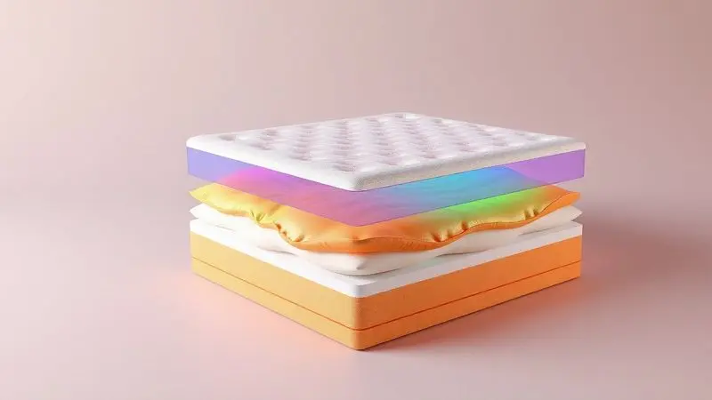
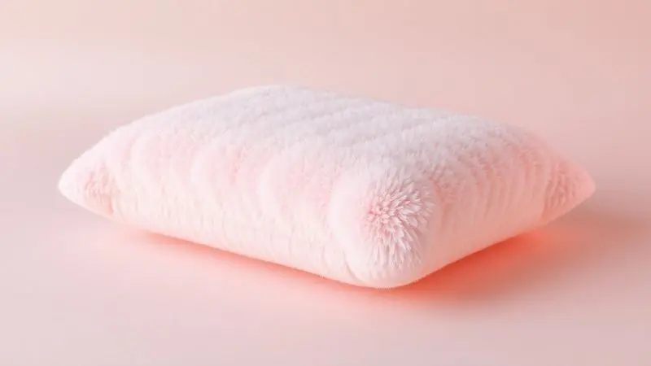
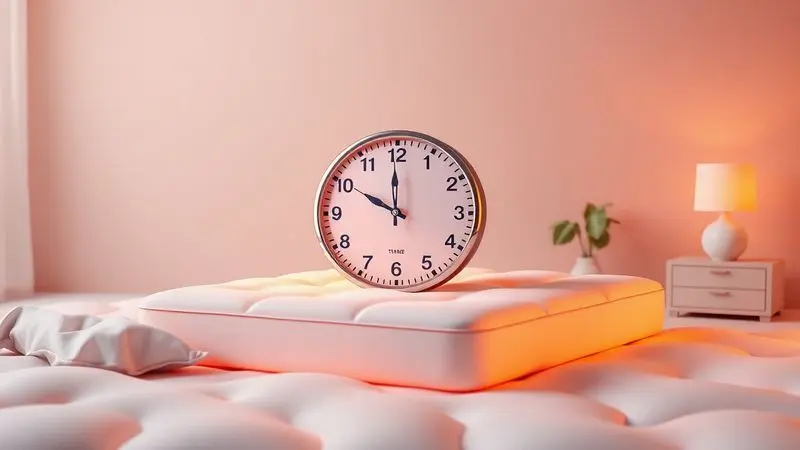

Escolher o colchão ideal é uma decisão que impacta diretamente a sua qualidade de vida e produtividade. Entre as marcas que revolucionaram o mercado "bed-in-a-box" no Brasil, a disputa entre Colchão Emma vs Luuna é uma das mais acirradas.

Ambas oferecem tecnologias de ponta, períodos de teste estendidos e garantias robustas, mas possuem diferenças cruciais em termos de firmeza, suporte e materiais.

Neste artigo, realizamos um comparativo detalhado entre os principais modelos das duas gigantes, ajudando você a entender qual tecnologia se adapta melhor ao seu corpo e ao seu bolso para garantir noites de sono verdadeiramente reparadoras.

<SummaryList products={frontmatter.top_products} />

## Os Melhores Colchões Emma e Luuna para Comprar Hoje

Os colchões Emma e Luuna se destacam no mercado por suas características de conforto e suporte. Ambos oferecem diferentes opções para atender às necessidades de cada tipo de dorminhoco, garantindo uma boa noite de sono.

### 1. Luuna Original Plus

<ProductBox 
  title={frontmatter.top_products[0].title} 
  image={frontmatter.top_products[0].image} 
  link={frontmatter.top_products[0].link} 
/>

Imagine um colchão que entende que você precisa tanto do aconchego que alivia seus pontos de pressão quanto da estrutura firme que mantém sua coluna alinhada.

O Colchão Luuna Original Plus entrega exatamente isso através de sua tecnologia híbrida que combina molas ensacadas com camadas de espuma.

Com 28 cm de altura, ele se adapta ao contorno do seu corpo como uma segunda pele, enquanto a espuma viscoelástica isola completamente os movimentos. Pense na tranquilidade de virar durante a noite sem acordar seu parceiro.

E quando falamos em frescor, a capa de viscose de bambu não é apenas hipoalergênica e lavável, ela realmente regula sua temperatura enquanto dorme, afastando aquela sensação abafada que pode arruinar seu descanso.

<CaixaProsContras>

**Prós:**

- Tecnologia híbrida que combina conforto e suporte.

- Isolamento de movimento ideal para casais.

- Capa hipoalergênica e lavável em viscose de bambu.

- Garantia de 10 anos e 100 noites de teste.

**Contras:**

- Firmeza pode ser maior do que alguns esperam.

- Pode não se adaptar rapidamente a gostos muito específicos de conforto.

</CaixaProsContras>

### 2. Emma Premium Hybrid

<ProductBox 
  title={frontmatter.top_products[1].title} 
  image={frontmatter.top_products[1].image} 
  link={frontmatter.top_products[1].link} 
/>

Se você está cansado de acordar com a sensação de que seu colchão está competindo com você, o Emma Premium Hybrid oferece uma trégua.

Sua construção híbrida combina molas ensacadas com camadas de espuma Airgocell e viscoelástica, criando uma superfície que não apenas alivia a pressão nos ombros e quadris, mas mantém sua coluna em perfeito alinhamento.

O que realmente diferencia este modelo é como ele respira. A circulação de ar acontece naturalmente, evitando que você precise jogar as cobertas fora no meio da noite por causa do calor.

E para os casais, o isolamento de movimento é tão eficiente que você poderia dançar em um lado do colchão sem que seu parceiro percebesse.

<CaixaProsContras>

**Prós:**

- Construção híbrida para conforto e suporte.

- Ótimo isolamento de movimento.

- Capa removível e lavável.

- Boa respirabilidade e controle de temperatura.

**Contras:**

- Pode ser mais firme do que alguns usuários esperam.

- Tempo de adaptação pode ser necessário.

</CaixaProsContras>

### 3. Luuna Blue

<ProductBox 
  title={frontmatter.top_products[2].title} 
  image={frontmatter.top_products[2].image} 
  link={frontmatter.top_products[2].link} 
/>

Você mora num lugar quente e já se cansou de acordar suado mesmo com o ar condicionado ligado? O Luuna Blue foi feito pensando nisso.

Sua tecnologia Air Flow garante que o ar circule livremente através das camadas, enquanto o Cloud Comfort oferece aquele toque macio de espuma de memória que você adora.

Com firmeza intermediária (classificada como 7/10), ele encontra o equilíbrio perfeito entre não afundar demais e não sentir que está deitado numa tábua.

E sim, existe um odor inicial ao abrir a caixa, mas pense nisso como o cheiro de algo novo e completamente seu, que desaparece em poucas horas, deixando apenas o conforto.

<CaixaProsContras>

**Prós:**

- Firmeza intermediária ideal para diversos perfis de dorminhocos.

- Tecnologia que garante conforto térmico mesmo em climas quentes.

- Capa removível e lavável para fácil manutenção.

- Garantia de 10 anos e 100 noites de teste.

**Contras:**

- Odor inicial forte que some após algumas horas.

- A firmeza pode ser percebida de forma diferente por usuários de diferentes pesos.

</CaixaProsContras>

### 4. Emma Original

<ProductBox 
  title={frontmatter.top_products[3].title} 
  image={frontmatter.top_products[3].image} 
  link={frontmatter.top_products[3].link} 
/>

Já imaginou ter um colchão que se molda ao seu corpo como se estivesse te dando um abraço? O Emma Original faz exatamente isso.

Com suas três camadas de espuma de alta densidade, incluindo espuma viscoelástica na superfície, ele alivia especialmente a pressão em quem dorme de lado. Os ombros e quadris finalmente encontram o alívio que merecem.

Com firmeza média (classificada como 5/10), ele é versátil o suficiente para acompanhar suas mudanças de posição durante a noite.

A capa removível e lavável significa que você pode lidar com pequenos acidentes sem trauma, embora alguns usuários notem que ele pode reter calor durante longos períodos de uso.

<CaixaProsContras>

**Prós:**

- Excelente adaptação ao corpo e alívio de pressão.

- Boa durabilidade com materiais de qualidade.

- Capa removível e lavável para fácil manutenção.

- Premiado por sua relação custo-benefício.

**Contras:**

- Pode reter calor em uso prolongado.

- Suporte nas bordas pode ser limitado.

</CaixaProsContras>

### 5. Emma Duo Comfort

<ProductBox 
  title={frontmatter.top_products[4].title} 
  image={frontmatter.top_products[4].image} 
  link={frontmatter.top_products[4].link} 
/>

E se você pudesse mudar de ideia sobre o que quer em um colchão sem precisar comprar um novo? O Emma Duo Comfort entrega essa flexibilidade com um lado macio e outro firme.

É como ter dois colchões em um, perfeito para quando seu corpo pede aconchego em uma noite e firmeza na outra.

Com 18 cm de altura e design ortopédico, ele oferece suporte adequado para diferentes pesos, sendo especialmente gentil com pessoas mais leves. A capa hipoalergênica e lavável significa praticidade no dia a dia.

A única ressalva é que, no lado firme, pessoas acima de 100 kg podem notar alguma perda de suporte ao longo do tempo.

<CaixaProsContras>

**Prós:**

- Possui duas opções de firmeza (lado macio e lado firme).

- Capa hipoalergênica e lavável.

- Garantia de 10 anos.

- Período de teste de 100 noites.

**Contras:**

- O lado firme pode não atender adequadamente usuários acima de 100kg ao longo do tempo.

- O material do lado firme pode ser menos confortável sem lençol.

</CaixaProsContras>

### 6. Luuna Support Casal

<ProductBox 
  title={frontmatter.top_products[5].title} 
  image={frontmatter.top_products[5].image} 
  link={frontmatter.top_products[5].link} 
/>

Para casais que têm necessidades diferentes mas querem dormir juntos em harmonia, o Luuna Support Casal oferece uma solução inteligente.

Sua combinação de camadas Air Flow e Active Support significa que um pode preferir mais respirabilidade enquanto o outro busca firmeza, e ambos encontram o que precisam.

Com 18 cm de altura, pode parecer mais baixo, mas isso não compromete o suporte à coluna que ele oferece. A capa removível e lavável é um detalhe que faz toda diferença quando você pensa em higiene a longo prazo.

E com 100 noites para testar, você pode descobrir se é o match perfeito sem pressão.

<CaixaProsContras>

**Prós:**

- Bom equilíbrio entre firmeza e conforto.

- Camadas de espuma que favorecem a respirabilidade.

- Capa removível e lavável na máquina.

- Garantia de 10 anos e 100 noites de teste.

**Contras:**

- Altura de 18 cm pode ser considerada baixa para alguns.

- Embalagem pode chegar danificada durante o transporte.

</CaixaProsContras>

## Como Escolher o Melhor Colchão de Casal

Escolher um colchão para duas pessoas vai além de medir o espaço no quarto. É sobre encontrar o equilíbrio entre dois corpos, duas rotinas de sono e, às vezes, dois gostos completamente diferentes de firmeza. Como navegar essas águas sem afundar em dúvidas?

### Colchões de Espuma São Mais Acessíveis; Colchões de Mola São Mais Confortáveis

Pense no seu orçamento como um aliado, não uma limitação. Os colchões de espuma oferecem uma relação custo-benefício excelente, adaptando-se ao seu corpo de maneira quase personalizada.

Já os colchões de mola entregam aquela sensação de "afundar suavemente" que muitas pessoas adoram, com ventilação superior que pode fazer a diferença em noites quentes.

A escolha entre eles reflete não apenas suas finanças, mas como você quer se sentir ao deitar na cama.

### Para Melhor Troca de Calor, Prefira Colchões com Revestimento de Tecido Inteligente

Nada pior do que acordar encharcado porque seu colchão não respira. Materiais inteligentes fazem mais do que apenas cobrir o colchão, eles trabalham ativamente para regular sua temperatura corporal.

Imagine um tecido que esfria quando você esquenta e aquece quando você esfria. Essa não é tecnologia do futuro, é o que você encontra em bons revestimentos hoje, garantindo que o clima debaixo das cobertas seja sempre perfeito.

### Se Está em Busca de um Colchão Ortopédico, Priorize Aqueles com Mais de 3 cm de Espuma

Quando sua coluna pede socorro, cada centímetro de espuma conta. Mais de 3 cm não é apenas um número, é o espaço necessário para que o material distribua seu peso de maneira inteligente, aliviando pontos de pressão em ombros e quadris.

É como ter um personal trainer para sua postura enquanto você dorme, trabalhando silenciosamente para que você acorde sem dores e mais disposto.

### Para Garantir Maior Suporte, Prefira Colchões de Espuma com Mais de 15 cm de Altura

Altura em colchões não é vaidade, é funcionalidade. Acima de 15 cm, as camadas trabalham juntas para oferecer um suporte consistente que mantém sua coluna alinhada independente da posição em que você dorme.

Para quem já convive com dores nas costas, essa altura extra pode significar a diferença entre uma noite de tormento e um sono verdadeiramente reparador.

### Quer Mais Conforto? Opte por Colchões de Casal com Pillow Top

Às vezes, você só quer aquele abraço extra antes de dormir. O pillow top é exatamente isso, uma camada adicional de aconchego que transforma um bom colchão em um ótimo colchão.

Para casais com preferências diferentes de firmeza, essa camada extra pode ser o elemento de união que faz ambos se sentirem acolhidos exatamente como precisam.

### Se Busca Maior Durabilidade, Escolha Colchões Dupla Face, que Podem Ser Rotacionados

Pense em um colchão dupla face como um investimento a longo prazo. A capacidade de rotacioná-lo não apenas distribui o desgaste de maneira uniforme, mas literalmente dobra sua vida útil.

É como comprar tempo extra de conforto, além de oferecer a flexibilidade de mudar de firmeza quando seu corpo pedir algo diferente.

## Emma Original: por que tanta gente escolhe esse colchão?

O segredo do Emma Original está na simplicidade inteligente. Ele não tenta ser tudo para todos, mas faz exatamente o que promete: adapta-se ao seu corpo como poucos.

A combinação das três camadas de espuma cria uma experiência de sono que alivia pontos de pressão sem sacrificar o suporte necessário. A respirabilidade mantém a temperatura equilibrada, evitando aqueles momentos de calor desconfortável no meio da noite.

O que realmente conquista as pessoas, porém, vai além das especificações técnicas. É a sensação de estar sendo cuidado enquanto dorme, de ter um parceiro de sono que entende as necessidades do seu corpo e responde a elas com consistência noite após noite.

## Luuna Original: para quem ele realmente é indicado?

O Luuna Original é para quem busca um equilíbrio prático entre qualidade e investimento. Se você não quer se aventurar em tecnologias extremamente complexas, mas também não aceita menos do que um bom suporte para sua coluna, este modelo acerta na medida certa.

A firmeza média acomoda tanto quem dorme de lado quanto de costas, e a tecnologia ventilada é uma bênção para quem naturalmente esquenta durante a noite.

Imagine acordar sem aquela sensação de peso nas articulações, com seu corpo perfeitamente alinhado após horas de descanso.

É essa experiência consistente e acessível que faz do Luuna Original uma escolha tão popular entre quem valoriza sono de qualidade sem complicações.

## Então, qual é melhor: Emma ou Luuna?

Esta pergunta tem a mesma resposta de "qual é melhor: café ou chá?" Depende completamente do seu paladar pessoal. O Emma brilha na adaptação corporal e no alívio de pressão, como um especialista em conforto personalizado.

O Luuna se destaca na versatilidade e no equilíbrio térmico, como um mestre em criar ambientes de sono ideais.

A verdadeira questão não é qual marca é superior, mas qual dialoga melhor com as necessidades específicas do seu corpo, do seu sono e do seu estilo de vida. É sobre encontrar a tecnologia que parece ter sido criada pensando em você.

## Perguntas Frequentes sobre Colchão de Casal

É natural que, após analisar tantas opções, algumas dúvidas persistam. Escolher um colchão para duas pessoas envolve considerar variáveis que nem sempre são óbvias quando dormimos sozinhos.

## Qual a Melhor Densidade para um Colchão de Casal?

Pense na densidade como a personalidade do colchão. Entre 28 e 33 kg/m³, você encontra o equilíbrio ideal que suporta diferentes pesos sem sacrificar o conforto. Acima disso, o colchão pode ser firme demais para quem dorme de lado.

Abaixo, pode não oferecer suporte suficiente para quem dorme de costas. A densidade certa é aquela que abraça seu corpo sem deixá-lo afundar, mantendo a coluna alinhada independentemente de como você se move durante a noite.

## De Quanto em Quanto Tempo se Deve Mudar de Colchão de Casal?

Seu colchão fala com você através de sinais sutis. A recomendção média de 8 a 10 anos é apenas um guia. O verdadeiro indicador é como você se sente ao acordar.

Desconforto matinal, afundamentos visíveis ou a sensação de que não está mais conseguindo a posição certa são todos avisos de que talvez seja hora de renovar o relacionamento com sua cama. Priorizar o sono é investir no seu bem-estar diário.

## O Que Fazer Quando o Colchão é Muito Duro?

Um colchão duro pode transformar seu santuário de descanso em uma arena de desconforto. Antes de desistir completamente, experimente adicionar um topper macio que suavize a superfície sem comprometer o suporte.

Observe também sua posição de sono, pois quem dorme de lado geralmente precisa de mais maciez nos pontos de pressão. Às vezes, pequenos ajustes podem transformar uma experiência rígida em algo muito mais acolhedor.

## Conclusão

Escolher entre Emma e Luuna é muito mais do que comparar especificações técnicas. É sobre encontrar o colchão que entende sua linguagem corporal, que responde aos seus movimentos durante a noite e que acorda com você renovado cada manhã.

Ambas as marcas oferecem soluções genuínas para noites de sono realmente reparadoras, cada uma com sua abordagem única para o mesmo objetivo: seu descanso.

A verdadeira vitória não está em escolher a marca "vencedora", mas em descobrir qual tecnologia ressoa com as necessidades do seu corpo e do seu estilo de vida.

Com períodos de teste de 100 noites, você tem a oportunidade rara de experimentar antes de comprometer-se definitivamente. Use esse tempo como um laboratório pessoal, observando como cada modelo se adapta ao seu ritmo natural de sono.

No final, o melhor colchão é aquele que você esquece que está lá, porque ele simplesmente funciona em perfeita harmonia com você. Seja qual for sua escolha, que ela te leve a noites mais tranquilas e manhãs mais energéticas. Seu corpo merece esse cuidado.