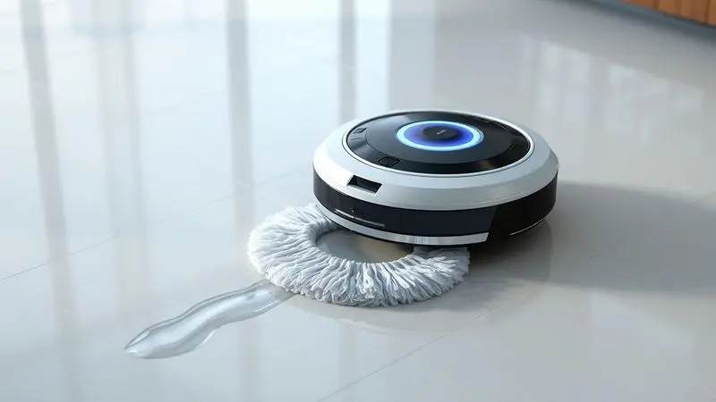
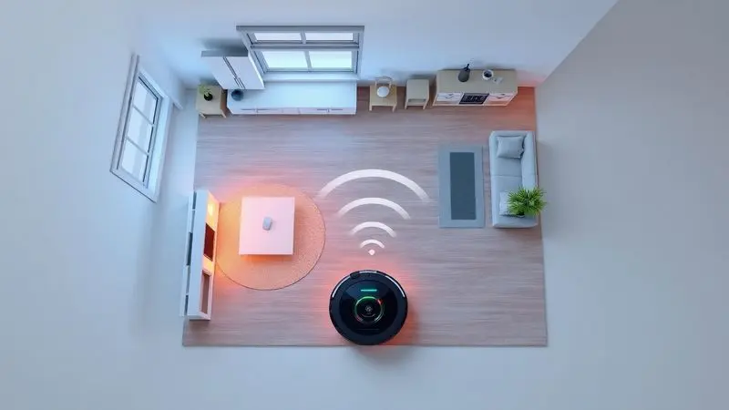
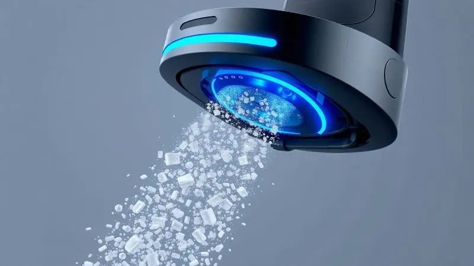

Imagine recuperar horas da sua semana que antes eram gastas empurrando um aspirador pela casa. Em vez de dedicar seu sábado à limpeza, você poderia estar aproveitando um café tranquilo enquanto um assistente silencioso cuida do trabalho.

Com tantas opções disponíveis - das mais acessíveis às superinteligentes - encontrar o robô certo pode parecer complicado. Mas não precisa ser.

Vamos explorar juntos os melhores modelos para transformar sua rotina e devolver a você o tempo mais valioso que existe: o seu.

<SummaryList products={frontmatter.top_products} />

## Melhores modelos de robô aspirador de pó para comprar

Cada casa tem necessidades únicas, e o robô perfeito é aquele que se adapta à sua realidade. Pense menos em especificações técnicas e mais no dia a dia que você quer viver.

Um robô para apartamento pequeno é diferente de um para casa com pets, que por sua vez é diferente de um para quem ama tecnologia e automação. A escolha certa não limpa apenas o chão, ela limpa sua agenda.

### 1. Robô aspirador de pó Multilaser HO410

<ProductBox 
  title={frontmatter.top_products[0].title} 
  image={frontmatter.top_products[0].image} 
  link={frontmatter.top_products[0].link} 
/>

Para quem está dando os primeiros passos no mundo da automação doméstica, o HO410 é como um assistente confiável que não exige manual de instruções. Ele faz exatamente o que promete: varre, aspira e passa pano com uma simplicidade que conquista.

Aquela sensação de pisar descalço em um piso recém-limpo após um dia cansativo? É isso que ele entrega regularmente.

Com quase uma hora e meia de autonomia, ele dá conta de apartamentos compactos ou da limpeza rápida de áreas específicas. O sistema anti-queda é um verdadeiro anjo da guarda, especialmente se você tem escadas ou desníveis em casa.

É verdade que ele não vai mapear sua sala em 3D nem conversar com sua Alexa, mas talvez você nem precise disso. Às vezes, o que mais desejamos é algo que simplesmente funcione.

<CaixaProsContras>

**Prós:**

- Funcionalidade 3 em 1: varre, aspira e passa pano.

- Sistema anti-queda para segurança em diferentes superfícies.

- Boa autonomia de bateria, ideal para limpezas rápidas.

- Design baixo que alcança áreas difíceis.

**Contras:**

- Falta recursos avançados como mapeamento inteligente.

- Ideal apenas para ambientes pequenos ou tarefas rápidas.

</CaixaProsContras>

### 2. Robô aspirador de pó Multilaser HO401

<ProductBox 
  title={frontmatter.top_products[1].title} 
  image={frontmatter.top_products[1].image} 
  link={frontmatter.top_products[1].link} 
/>

Conhecido carinhosamente como "Robô Lua", o HO401 é aquele companheiro que você programa pela manhã e encontra a casa arrumada ao voltar do trabalho. Suas duas horas de autonomia significam que ele pode circular por vários cômodos sem pedir ajuda.

Para quem convive com pets, essa versatilidade é um alívio, pois ele lida igualmente bem com pisos frios, madeira e até tapetes mais finos.

Só prepare-se para esvaziar o reservatório com certa frequência, já que seus 100ml se enchem rápido em ambientes maiores. A função de passar pano funciona mais como uma finalização, aquela camada extra de brilho, do que como uma lavagem profunda.

Mas pense assim: é melhor ter um pano leve passado regularmente do que nunca ter tempo para passar nenhum.

<CaixaProsContras>

**Prós:**

- Multifuncional: varre, aspira e passa pano.

- Adequado para diferentes tipos de superfícies.

- Boa autonomia de limpeza (cerca de 2 horas).

- Sensores anti-queda para maior segurança.

**Contras:**

- Capacidade do reservatório de pó pode ser pequena para casas grandes.

- A eficácia da função de passar pano pode deixar a desejar.

</CaixaProsContras>

### 3. Robô aspirador de pó Wap Robot W100

<ProductBox 
  title={frontmatter.top_products[2].title} 
  image={frontmatter.top_products[2].image} 
  link={frontmatter.top_products[2].link} 
/>

Com apenas 7,5cm de altura, o W100 é especialista em lugares que normalmente ignoramos. Ele desliza sob a cama, invade o espaço sob o sofá e alcança cantos onde a poeira adora se esconder.

Para apartamentos pequenos ou como segundo robô para áreas específicas, ele é um investimento inteligente que tira da sua lista mental aquela "limpeza profunda que nunca tenho tempo para fazer".

Os quase 100 minutos de bateria são suficientes para uma sessão completa, mas sem base de recarga automática, você precisará plugá-lo manualmente. Isso pode ser um pequeno inconveniente ou um lembrete gentil para interagir com seu assistente.

Ele não vai vencer uma batalha contra sujeira pesada, mas para a guerra diária contra poeira e pelos, ele é um soldado fiel.

<CaixaProsContras>

**Prós:**

- Funções de varrer, aspirar e passar pano.

- Design compacto que alcança áreas difíceis.

- Sensores que evitam quedas e colisões.

- Bom custo-benefício para casas pequenas.

**Contras:**

- Navegação aleatória sem mapeamento inteligente.

- Potência limitada para sujeiras mais pesadas.

</CaixaProsContras>

### 4. Robô aspirador de pó Electrolux ERB10

<ProductBox 
  title={frontmatter.top_products[3].title} 
  image={frontmatter.top_products[3].image} 
  link={frontmatter.top_products[3].link} 
/>

Quando você precisa de um aliado silencioso que trabalhe enquanto a família descansa, o ERB10 é sua escolha. Suas impressionantes 2h20 de autonomia significam que ele pode circular por uma casa inteira sem precisar de recarga intermediária.

O filtro HEPA Allergy Protect não é apenas um detalhe técnico, é um cuidado com a saúde de quem tem alergias, capturando partículas que nem percebemos no ar.

A navegação aleatória faz com que ele às vezes pareça estar "pensando" no que fazer a seguir, mas essa falta de padrão rígido tem seu charme, como um jardineiro que varre cada canto com atenção artesanal.

Se sua prioridade é ter um piso consistentemente limpo sem pensar em apps ou configurações complexas, ele entrega exatamente isso.

<CaixaProsContras>

**Prós:**

- Design ultra slim que alcança locais baixos

- Função 3 em 1: varre, aspira e passa pano

- Sensores que evitam quedas e colisões

- Filtro HEPA para reter impurezas do ar

**Contras:**

- Navegação aleatória sem padrão definido

- Sem funções smart ou controle remoto

</CaixaProsContras>

### 5. Robô aspirador de pó Electrolux ERB30

<ProductBox 
  title={frontmatter.top_products[4].title} 
  image={frontmatter.top_products[4].image} 
  link={frontmatter.top_products[4].link} 
/>

O ERB30 é para quem quer automação sem complicação. Ele sai sozinho, faz seu trabalho e, quando cansa, volta obedientemente para a base para recarregar. É como ter um funcionário dedicado que nunca tira férias.

A tecnologia "Autonomous" não é só um nome bonito, significa que ele se adapta ao seu espaço, aprendendo onde precisa passar mais tempo.

O controle remoto físico pode parecer pouco moderno em tempos de apps, mas há uma beleza prática nisso. Não precisa de senha Wi-Fi, não depende de atualizações, simplesmente funciona.

Para quem tem pais ou avós menos familiarizados com tecnologia, esse é um presente perfeito: dá independência sem criar novas dependências digitais.

<CaixaProsContras>

**Prós:**

- Função 3 em 1 (varre, aspira e passa pano).

- Autonomia de até 2h20min.

- Filtro HEPA que melhora a qualidade do ar.

- Sensores antiqueda para segurança durante a limpeza.

**Contras:**

- Não possui conectividade Wi-Fi ou controle por aplicativo.

- Tempo de recarga pode ser longo (cerca de 5 horas).

</CaixaProsContras>

### 6. Robô aspirador de pó Xiaomi E10 B112

<ProductBox 
  title={frontmatter.top_products[5].title} 
  image={frontmatter.top_products[5].image} 
  link={frontmatter.top_products[5].link} 
/>

Para quem já vive conectado, o E10 é uma extensão natural do smartphone. Programar a limpeza da sala enquanto está no trânsito ou checar se ele já terminou o quarto do escritório traz uma sensação de controle que vai além da praticidade.

Os 4000 Pa de sucção não são apenas um número, são a garantia de que aquele grão de areia que seu pet trouxe da rua não ficará como lembrança no piso.

O depósito de 400ml é generoso, permitindo que ele trabalhe por vários dias sem exigir sua atenção. E quando você precisa esvaziá-lo, é rápido e sem sujeira. É aquele equilíbrio raro entre tecnologia acessível e performance que realmente importa no dia a dia.

<CaixaProsContras>

**Prós:**

- Potência de sucção ajustável para diferentes tipos de sujeira.

- Controle via aplicativo para conveniência e programação.

- Sensores anti-queda e de obstáculos, aumentando a segurança.

- Boa autonomia da bateria, ideal para limpezas completas.

**Contras:**

- Não possui mapeamento avançado.

- O depósito pode ser pequeno para casas muito grandes.

</CaixaProsContras>

### 7. Robô aspirador WAP Robot W90

<ProductBox 
  title={frontmatter.top_products[6].title} 
  image={frontmatter.top_products[6].image} 
  link={frontmatter.top_products[6].link} 
/>

Às vezes, o que mais precisamos é de um ponto de partida acessível. O W90 é exatamente isso: uma introdução ao mundo dos robôs aspiradores sem comprometer o orçamento do mês. Sua função 3 em 1 significa que você experimenta todas as vantagens básicas de uma só vez.

Para quem tem dúvidas se realmente vai usar um robô ou se é só uma moda passageira, ele é a resposta prática.

Durante quase duas horas, ele cuida da sujeira superficial que se acumula diariamente. Não espere que ele substitua uma limpeza manual profunda, mas para manter a casa apresentável entre uma faxina e outra, ele é um aliado valioso.

É o tipo de compra que faz você pensar "por que não comprei antes?".

<CaixaProsContras>

**Prós:**

- Função 3 em 1 que aumenta a praticidade.

- Design compacto, ideal para locais difíceis.

- Boa autonomia da bateria.

- Custo-benefício atraente para um modelo de entrada.

**Contras:**

- Não possui mapeamento inteligente, exigindo recarga manual.

- A função de passar pano pode não ser suficiente para limpezas mais pesadas.

</CaixaProsContras>

### 8. Robô aspirador Philco PAS22P

<ProductBox 
  title={frontmatter.top_products[7].title} 
  image={frontmatter.top_products[7].image} 
  link={frontmatter.top_products[7].link} 
/>

Silêncio tem valor, especialmente em lares com crianças dormindo ou pessoas trabalhando em home office. O PAS22P opera com uma discrição que faz você esquecer que ele está trabalhando, até notar o piso impecável.

Seu filtro HEPA não é um acessório, é uma declaração de cuidado com a qualidade do ar que sua família respira.

Os 100 minutos de autonomia são mais que suficientes para a maioria dos apartamentos, e as duas horas de recarga significam que ele estará pronto para nova missão rapidamente.

Ele pode não alcançar cada milímetro como suas mãos fariam, mas quantas vezes você realmente tem tempo para essa perfeição?

<CaixaProsContras>

**Prós:**

- Filtro HEPA que melhora a qualidade do ar.

- Sensores antiqueda garantem segurança durante a operação.

- Silencioso, ideal para ambientes com crianças e pets.

- Bivolt, funcionando em diferentes voltagens.

**Contras:**

- Pode não alcançar todos os cantos tão eficazmente quanto uma limpeza manual.

- Potência relativamente baixa comparada a modelos mais robustos.

</CaixaProsContras>

### 9. Robô aspirador Samsung Powerbot-E

<ProductBox 
  title={frontmatter.top_products[8].title} 
  image={frontmatter.top_products[8].image} 
  link={frontmatter.top_products[8].link} 
/>

Quando sua casa já fala com a Alexa, controla as luzes pelo celular e a cafeteira programa sozinha, o Powerbot-E é o parceiro que faltava. Integrado ao ecossistema SmartThings, ele não é um eletrodoméstico isolado, mas parte de uma orquestra doméstica inteligente.

Ajustar a umidade do pano pelo app não é frescura, é personalização real.

A tecnologia Digital Inverter significa potência constante, não apenas picos. Ele enfrenta a transição entre piso frio e carpete sem hesitar, adaptando-se como um profissional experiente.

Sim, exige alguns cuidados com a base, mas qual relacionamento verdadeiro não exige atenção? Ele retribui com eficiência que transforma a manutenção da casa de tarefa para hábito.

<CaixaProsContras>

**Prós:**

- Funcionalidade 2 em 1: aspira e passa pano.

- Conectividade Wi-Fi com controle via aplicativo.

- Sensores avançados para evitar colisões.

- Compatível com diversos tipos de piso.

**Contras:**

- Exige atenção à manutenção da base carregadora.

- Necessita de cuidados regulares para funcionamento ideal.

</CaixaProsContras>

## Qual Comprar?

Antes de clicar em "comprar", feche os olhos e visualize sua rotina. Você acorda cedo e sai correndo? Um robô programável que limpa às 10h pode ser seu salvador. Tem pets que soltam pelos como se fosse confete? Potência e filtro HEPA são não-negociáveis.

Mora em um studio compacto? Talvez não precise de duas horas de autonomia. O segredo não está em comprar o mais caro, mas o que dialoga com sua vida real.

A altura certa para passar sob seus móveis, o nível de ruído que não perturba seu home office, a praticidade que se encaixa na sua falta de paciência para manuais complexos. Escolha com o coração prático, não apenas com a cabeça técnica.

## Robôs Aspiradores com Pano: Aliados na Limpeza Doméstica

Há uma diferença sutil entre um piso aspirado e um piso realmente limpo. É aquela sensação de frescor, o brilho discreto, a ausência daquela camada de poeira que gruda nos pés.

Os robôs com função de pano entregam essa camada extra de cuidado sem exigir que você troque de aparelho ou reserve tempo extra.

Eles são especialmente mágicos em casas com crianças pequenas, onde cada migalha parece se multiplicar, ou para quem simplesmente ama a sensação de ordem e limpeza. Não é sobre substituir a faxina tradicional, mas sobre elevar o padrão do dia a dia.

## Qual a diferença de um aspirador de pó robô?

Pense no aspirador tradicional como um convite para o trabalho: você precisa estar presente, segurar, mover, esforçar-se. O robô, por outro lado, é um convite para a liberdade.

Enquanto você lê um livro, assiste a um filme ou simplesmente respira, ele cuida do que antes roubava seu tempo e energia. Os sensores são seus olhos, evitando tombos e colisões. O app é sua extensão, permitindo controle à distância.

E a programação é sua memória, garantindo que mesmo nos dias mais corridos, a casa receba o cuidado merecido. Não é um eletrodoméstico, é um parceiro doméstico.

## Como escolher o melhor aspirador de pó robô

Escolher um robô é menos sobre comparar especificações e mais sobre entender como você quer viver. As perguntas certas não são "quantos Pa tem?", mas "como quero sentir-me ao chegar em casa?"

### Filtro

O filtro é o pulmão do seu robô, e a qualidade do ar da sua casa depende dele. Filtros HEPA não são luxo para alérgicos, são investimento em saúde respiratória para todos. Eles capturam partículas tão pequenas que nossos olhos não veem, mas nosso corpo sente.

Já os filtros mais simples podem ser suficientes se sua preocupação principal são pelos e sujeira visível.

O verdadeiro custo não está apenas no preço do filtro de reposição, mas no tempo que você economiza limpando-o com frequência versus a qualidade constante que ele entrega.

### Alcance

Alcance não é apenas sobre metros quadrados, é sobre inteligência de navegação. Um robô que anda em círculos aleatórios pode ter bateria para 100m², mas só limpará 60m² efetivamente.

Já um com mapeamento inteligente usa cada minuto de bateria com propósito, como um entregador que conhece o caminho mais rápido. Considere também sua capacidade de superar pequenos obstáculos: aquele degrau de 1cm entre a sala e a varanda, o tapete mais grosso da sala.

Esses detalhes definem se ele será um hóspede restrito ou um verdadeiro dono da casa.

### Potência

Potência se traduz em resultados visíveis. Não apenas na sujeira que desaparece, mas na frequência com que você precisa intervir.

Um robô com potência adequada pode lidar com aquela migalha do pão que caiu no café da manhã sem precisar que você passe depois com o aspirador manual. Em carpetes, a diferença é ainda mais dramática: é a distância entre "parece limpo" e "está limpo".

O segredo está no equilíbrio: potência suficiente para o seu tipo de sujeira, sem o ruído excessivo que transforma uma solução em novo problema.

### Ruído

O ruído mede não apenas decibéis, mas o impacto na sua paz. Um robô que opera a 70dB pode parecer apenas uma conversa, mas tente concentrar-se em uma reunião importante com alguém "conversando" no chão.

Modelos mais silenciosos (abaixo de 60dB) permitem que a limpeza aconteça em segundo plano, sem competir pela sua atenção.

Para quem trabalha em casa, tem bebês dormindo ou simplesmente valoriza o silêncio, essa característica pode ser mais importante que qualquer função extra. Às vezes, o melhor assistente é aquele que trabalha sem ser notado.

## Perguntas frequentes

A dúvida mais comum não é técnica, mas existencial: "realmente funciona?" A resposta é sim, mas com um asterisco. Funciona para manter, não para transformar. Se sua casa está acumulando sujeira há semanas, comece com uma limpeza manual profunda.

Depois, deixe o robô manter esse padrão. Outra pergunta frequente: "e os cantos?" Os modelos mais avançados têm escovas laterais que chegam mais perto, mas sim, alguns cantos podem precisar de uma ajudinha ocasional.

Por último: "precisa de supervisão?" Nos primeiros dias, sim, para você aprender seus padrões e ele aprender seu espaço. Depois, torna-se uma relação de confiança, onde você apenas recolhe os fios soltos e ele faz o resto.

## Conclusão

O melhor robô aspirador não é o que tem mais recursos, mas o que desaparece na sua rotina enquanto cumpre sua função perfeitamente. É aquele que você programa na segunda-feira e esquece até sexta, quando percebe que o piso continua impecável sem esforço seu.

Para alguns, será o simples e confiável Multilaser HO410. Para outros, o conectado Xiaomi E10 que dialoga com seu smartphone. Para famílias com alergias, o Philco com filtro HEPA.

Cada escolha certa é uma pequena revolução doméstica: menos tempo limpando, mais tempo vivendo.

Lembre-se que você não está comprando apenas um aparelho, está investindo em horas livres, em paz mental, naquele momento extra na cama pela manhã. Comece observando qual dos nossos nove candidatos mais conversa com sua realidade atual.

Em pouco tempo, você não conseguirá imaginar como vivia sem ele, assim como hoje não imagina viver sem máquina de lavar roupas. A automação que importa não é a que impressiona os visitantes, mas a que simplifica seus dias.