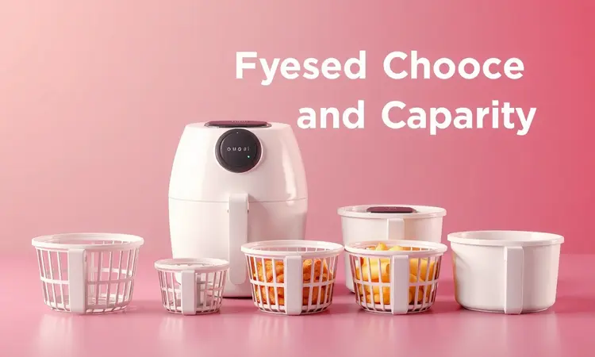
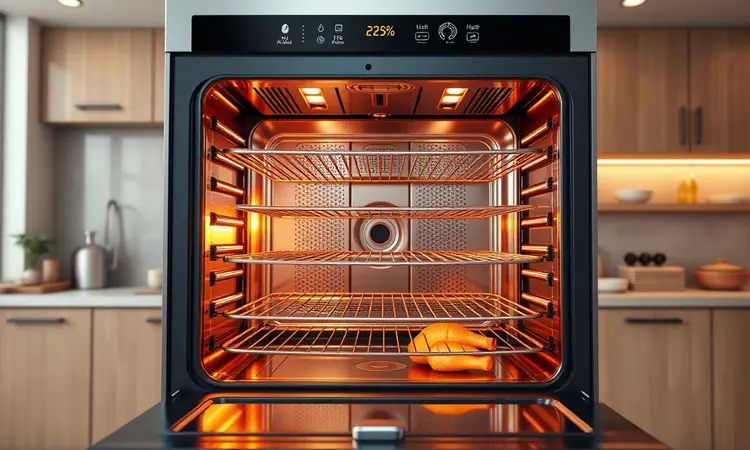
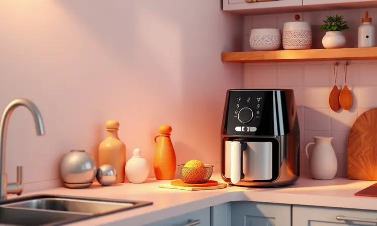

Escolher a fritadeira elétrica ideal vai muito além de comparar marcas ou admirar designs. O verdadeiro segredo para a satisfação a longo prazo está em acertar a capacidade.

Já imaginou a frustração de comprar um aparelho que não consegue preparar uma refeição completa para sua família, ou pior, que ocupa metade da bancada da cozinha para fazer um único lanche? Este guia foi pensado exatamente para você que quer evitar esses problemas.

Vamos desde os modelos compactos que cabem perfeitamente na vida de quem mora sozinho até as versões "tamanho família" que preparam um jantar inteiro de uma só vez.

Entender essa relação entre litros e quantidade de pessoas é o que separa uma compra inteligente de um gasto desnecessário.

<SummaryList products={frontmatter.top_products} />

## Seleção das melhores Air fryers para comprar em 2025

A escolha da sua air fryer ideal é uma equação que mistura suas necessidades diárias com as possibilidades do mercado. Não se trata apenas de potência ou funcionalidades, mas de encontrar um companheiro de cozinha que se encaixe no seu ritmo de vida.

Os modelos mais recentes trazem tecnologias que transformam o preparo dos alimentos em uma experiência quase mágica, onde o crocante perfeito surge sem uma gota de óleo. Vamos explorar opções que vão desde o básico eficiente até verdadeiras centrais culinárias.

### 1. Cadence Cook Fryer

<ProductBox 
  title={frontmatter.top_products[0].title} 
  image={frontmatter.top_products[0].image} 
  link={frontmatter.top_products[0].link} 
/>

Imagine uma fritadeira que chega à sua cozinha prometendo praticidade sem complicações. A Cadence Cook Fryer é exatamente isso, uma opção que entrega resultados consistentes sem exigir um curso avançado de culinária.

Com modelos como a Super Cook Fryer FRT410 e a Cook Fryer Plus, ela utiliza ar quente para transformar batatas em palitos dourados e crocantes, e frangos em refeições suculentas.

A versão de 3,8 litros, com seus 1300W de potência, oferece um controle de temperatura que vai dos 80°C aos 200°C, abrindo um leque de possibilidades que vai além da simples fritura.

O que você precisa considerar aqui é o tamanho da sua família.

Com opções que variam de 2,6 a 4 litros, pode ser que o modelo menor não atenda aquele jantar especial com amigos, mas para o dia a dia de um casal ou pequena família, é uma companheira perfeita que não vai dominar seu espaço na bancada.

<CaixaProsContras>

**Prós:**

- Diversas capacidades disponíveis, atendendo diferentes necessidades familiares.

- Uso saudável com menos óleo, promovendo refeições mais leves.

- Limpeza facilitada com cestos removíveis e superfícies antiaderentes.

- Potência eficiente para um desempenho ágil no cozimento.

**Contras:**

- Modelos com menor capacidade podem ser insuficientes para grandes refeições.

- O design pode ser considerado simples por alguns usuários.

</CaixaProsContras>

### 2. Oster Multifuncional CKSTAF631

<ProductBox 
  title={frontmatter.top_products[1].title} 
  image={frontmatter.top_products[1].image} 
  link={frontmatter.top_products[1].link} 
/>

Se você busca um equilíbrio quase perfeito entre funcionalidade e simplicidade, a Oster Multifuncional CKSTAF631 merece sua atenção.

Com 3,2 litros de capacidade, ela é o parceiro ideal para quem vive a correria do dia a dia, mas não abre mão de uma alimentação mais consciente.

A tecnologia de ar quente elimina a necessidade daquela banheira de óleo, transformando o ato de fritar em algo que não pesa na consciência.

O diferencial está nos detalhes que facilitam a vida: vem com acessórios como uma assadeira antiaderente e um livro de receitas que tira você do lugar comum. Seu design compacto em inox não só soma pontos estéticos como torna a limpeza uma tarefa de minutos.

Apenas lembre-se de não encher o cesto além de ¾ da capacidade, um pequeno ajuste que garante que cada pedaço de batata fique igualmente dourado.

<CaixaProsContras>

**Prós:**

- Cozinha alimentos de forma saudável sem óleo.

- Alta versatilidade: pode fritar, assar e grelhar.

- Design compacto que facilita o armazenamento.

- Acessórios inclusos que ampliam as opções de preparo.

**Contras:**

- Capacidade limitada para grandes porções.

- Pode gerar fumaça se alimentos gordurosos não forem preparados corretamente.

</CaixaProsContras>

### 3. Electrolux EAF30

<ProductBox 
  title={frontmatter.top_products[2].title} 
  image={frontmatter.top_products[2].image} 
  link={frontmatter.top_products[2].link} 
/>

Para quem busca a segurança da automação, a Electrolux EAF30 chega como uma solução inteligente. Com 4 litros de capacidade, ela é pensada para pequenas famílias ou solteiros que desejam comer bem sem depender de habilidades culinárias excepcionais.

Os 1400W de potência são comandados por um painel digital que oferece receitas pré-definidas, como se tivesse um chef particular sugerindo o próximo passo.

A promessa de cozinhar com até 90% menos gordura não é apenas um número, é a liberdade de saborear aquelas batatas fritas sem o peso calórico.

O design compacto se integra perfeitamente a cozinhas menores, e o cesto removível com revestimento antiaderente transforma a limpeza em algo quase trivial.

Alguns usuários notam que o formato redondo do cesto pode exigir um pouco mais de atenção na disposição dos alimentos, mas isso não rouba o brilho do desempenho consistente.

<CaixaProsContras>

**Prós:**

- Excelente para pequenas porções.

- Cozinha com até 90% menos gordura.

- Design compacto e moderno.

- Fácil de limpar e operar.

**Contras:**

- Cesto de formato redondo pode dificultar a organização.

- Timer limitado a 30 minutos.

</CaixaProsContras>

### 4. WAP Grand Family

<ProductBox 
  title={frontmatter.top_products[3].title} 
  image={frontmatter.top_products[3].image} 
  link={frontmatter.top_products[3].link} 
/>

Quando o assunto é atender uma família, a WAP Grand Family entra em cena com uma capacidade anunciada de 5,2 litros. É importante entender que a capacidade útil gira em torno de 3,7 a 4,1 litros, um detalhe que faz diferença se sua família é numerosa.

A tecnologia de circulação de ar 360° trabalha para garantir que cada pedaço de alimento receba o mesmo tratamento, resultando naquela combinação perfeita: crocante por fora, macio por dentro.

Com 1500W de potência e controle de temperatura entre 80°C e 200°C, ela oferece um timer generoso de até 60 minutos com desligamento automático. O design elegante, com seu acabamento em preto fosco e detalhes em cobre, é um convite para exibi-la na bancada.

Alguns usuários notam que o plástico externo pode ser sensível a riscos, mas a praticidade do sistema de limpeza compensa essa consideração.

<CaixaProsContras>

**Prós:**

- Capacidade adequada para famílias.

- Tecnologia de circulação de ar para cozimento uniforme.

- Fácil de limpar com cesta removível.

- Design elegante que combina com a cozinha.

**Contras:**

- Capacidade útil menor do que a anunciada.

- Exterior plástico suscetível a arranhões.

</CaixaProsContras>

### 5. Oster OFOR250

<ProductBox 
  title={frontmatter.top_products[4].title} 
  image={frontmatter.top_products[4].image} 
  link={frontmatter.top_products[4].link} 
/>

E se sua air fryer pudesse ser muito mais que uma fritadeira? O Oster OFOR250 é essa resposta transformada em eletrodoméstico.

Com 25 litros de capacidade, ele é um forno elétrico multifuncional que também atua como air fryer, criando um universo de possibilidades para famílias pequenas a médias.

São 10 funções manuais e 11 pré-programadas que permitem desde assar um pão até desidratar frutas para lanches saudáveis.

A capacidade de fritar com pouco ou nenhum óleo é apenas o começo. Com potência entre 1500W e 1700W, o aquecimento é rápido, e o display digital torna o controle intuitivo.

É verdade que o ruído do ventilador pode fazer sua presença ser notada, e o exterior pode aquecer consideravelmente, mas essas são pequenas concessões para a versatilidade que ele entrega.

<CaixaProsContras>

**Prós:**

- Ampla capacidade de 25 litros, adequada para refeições em família.

- Versatilidade com múltiplas funções culinárias.

- Cozinha alimentos de forma mais saudável com pouco óleo.

- Facilidade de limpeza com acessórios antiaderentes.

**Contras:**

- Pode gerar ruído perceptível durante o uso.

- O exterior do aparelho pode esquentar, exigindo cuidado.

</CaixaProsContras>

### 6. Electrolux EAF15 4,6 litros

<ProductBox 
  title={frontmatter.top_products[5].title} 
  image={frontmatter.top_products[5].image} 
  link={frontmatter.top_products[5].link} 
/>

Imagine reduzir em até 90% a gordura da sua fritura e cortar quase metade das calorias, sem abrir mão do sabor. A Electrolux EAF15 traz essa promessa com 4,6 litros de capacidade, dimensionada para famílias de até quatro pessoas.

Os 1400W de potência trabalham com um controle de temperatura que vai de 80°C a 200°C, dando a você o controle preciso sobre cada receita.

O timer sonoro com desligamento automático de até 60 minutos é aquele amigo que avisa quando a comida está pronta, enquanto você cuida de outras tarefas. O cesto removível e antiaderente transforma a limpeza em algo rápido e simples.

Se sua família é maior ou se você costuma receber com frequência, o tamanho pode pedir um pouco de planejamento, mas para o dia a dia de uma família pequena, é eficiência pura.

<CaixaProsContras>

**Prós:**

- Capacidade adequada para pequenas famílias.

- Controle de temperatura e timer automáticos.

- Cesto antiaderente e fácil de limpar.

- Redução significativa de gordura nos alimentos.

**Contras:**

- Tamanho pode não ser suficiente para grandes grupos.

- Falta de funções avançadas comparadas a modelos mais caros.

</CaixaProsContras>

### 7. Philips Walita Série 1000 NA150 7,1 litros

<ProductBox 
  title={frontmatter.top_products[6].title} 
  image={frontmatter.top_products[6].image} 
  link={frontmatter.top_products[6].link} 
/>

Para quem não tem tempo a perder e precisa de eficiência em larga escala, a Philips Walita Série 1000 NA150 é uma revelação. Com 7,1 litros de capacidade, ela foi feita para famílias maiores ou para quem gosta de preparar várias refeições simultaneamente.

A tecnologia RapidAir não é apenas um termo de marketing, é a garantia de que o ar quente circula de forma uniforme, entregando aquela crocância perfeita em cada centímetro.

O duplo cesto é o trunfo principal: imagine preparar frango no cesto superior e batatas no inferior, tudo ao mesmo tempo.

O display digital com modos pré-programados elimina as tentativas e erros, enquanto as peças removíveis com revestimento antiaderente e laváveis na máquina transformam a limpeza em algo quase automático.

Sim, ela tem presença marcante na bancada, mas a liberdade que oferece compensa cada centímetro ocupado.

<CaixaProsContras>

**Prós:**

- Tecnologia RapidAir para fritura saudável e uniforme.

- Duplo cesto que permite preparar dois pratos ao mesmo tempo.

- Display digital com funções pré-programadas.

- Fácil de limpar com peças removíveis antiaderentes.

**Contras:**

- Design pode ser grande para cozinhas menores.

- Preço pode ser mais elevado se comparado a modelos básicos.

</CaixaProsContras>

### 8. Philco 10 litros PAF10A

<ProductBox 
  title={frontmatter.top_products[7].title} 
  image={frontmatter.top_products[7].image} 
  link={frontmatter.top_products[7].link} 
/>

Quando a praticidade precisa dialogar com a capacidade, a Philco PAF10A levanta a mão. Com 10 litros totais divididos em dois cestos de 5 litros cada, ela é a solução para quem não quer fazer concessões.

A tecnologia Dual Zone permite que você controle tempo e temperatura individualmente em cada cesto, como se tivesse duas air fryers trabalhando em harmonia.

Os 2000W de potência garantem que tudo fique pronto rapidamente, enquanto o painel digital touch torna a operação intuitiva. As funções vão além da fritura, incluindo assar e desidratar.

Alguns usuários mencionam que a limpeza das grades internas pode exigir um pouco mais de atenção, mas quando você consegue preparar um jantar completo para a família e um lanche diferente para as crianças simultaneamente, esse esforço extra parece pequeno.

<CaixaProsContras>

**Prós:**

- Capacidade de 10 litros com dois cestos de 5 litros.

- Tecnologia Dual Zone que permite cozinhar pratos diferentes simultaneamente.

- Painel digital com várias funções pré-programadas.

- Design fácil de limpar com partes removíveis.

**Contras:**

- A limpeza interna das grades pode exigir mais atenção.

- Tamanho maior pode ocupar mais espaço na cozinha.

</CaixaProsContras>

### 9. Midea 6 litros Smart Chef Plus

<ProductBox 
  title={frontmatter.top_products[8].title} 
  image={frontmatter.top_products[8].image} 
  link={frontmatter.top_products[8].link} 
/>

E se sua air fryer pudesse ouvir seus comandos? A Midea Smart Chef Plus traz essa experiência com conectividade Smart Control, permitindo controle via aplicativo e comando por voz através da Alexa.

Com 6 litros de capacidade, ela atende famílias que precisam de porções generosas sem abrir mão da tecnologia.

Os 1700W de potência e controle de temperatura que alcança 200°C garantem agilidade, enquanto o timer programável de até 2 horas oferece flexibilidade para receitas mais demoradas.

O revestimento BlackStone é a segurança contra alimentos grudados e a promessa de uma limpeza facilitada, inclusive em lava-louças. Atenção apenas à voltagem, já que não é bivolt, mas isso é um detalhe que se resolve com planejamento na hora da compra.

<CaixaProsContras>

**Prós:**

- Capacidade generosa de 6 litros, perfeita para famílias.

- Conectividade com aplicativo e comando por voz via Alexa.

- Revestimento BlackStone que facilita a limpeza.

- Tecnologia X Cyclone para cozimento uniforme.

**Contras:**

- Não é bivolt, exigindo atenção na compra.

- Peso de 4,2 kg pode dificultar a movimentação.

</CaixaProsContras>

### 10. Arno Air Fry Mega Digital 7,5L

<ProductBox 
  title={frontmatter.top_products[9].title} 
  image={frontmatter.top_products[9].image} 
  link={frontmatter.top_products[9].link} 
/>

Para eventos familiares ou dias em que a cozinha vira o centro das atenções, a Arno Air Fry Mega Digital 7,5L se apresenta como a protagonista. Com capacidade para 7,5 litros, ela permite preparar refeições generosas de uma só vez, economizando tempo e energia.

A tecnologia Hot Air trabalha para que cada alimento fique com aquela textura ideal: crocante na outside, macio na inside.

O painel digital com 8 funções pré-definidas tira as dúvidas do preparo, enquanto o timer com desligamento automático traz segurança.

Os 1700W de potência podem solicitar uma atenção extra à fiação elétrica em residências mais antigas, mas quando comparado ao consumo de um forno tradicional, a economia se torna evidente.

É um investimento que ocupa espaço, mas também ocupa o centro das memórias gastronômicas da família.

<CaixaProsContras>

**Prós:**

- Grande capacidade ideal para famílias.

- Tecnologia que permite cozinhar com menos óleo.

- Painel digital intuitivo com várias funções.
  Design moderno e fácil de limpar.

**Contras:**

- Potência elevada que pode não ser compatível com algumas instalações elétricas.

- Pode ocupar bastante espaço na bancada da cozinha.

</CaixaProsContras>

## Por que escolher o tamanho certo de air fryer é importante?

A escolha do tamanho da sua air fryer vai muito além de números em uma ficha técnica. Pense nela como um companheiro de cozinha que precisa se adaptar ao seu ritmo de vida.

Um modelo muito pequeno se transforma em uma fonte de frustração quando você precisa preparar um jantar completo para a família, forçando várias rodadas de cozimento que consomem tempo e energia.

No extremo oposto, uma air fryer desproporcionalmente grande domina seu espaço na bancada, consome mais energia do que necessário e transforma a limpeza em uma tarefa hercúlea.

A medida certa é aquela que desaparece na rotina, atendendo suas necessidades sem chamar atenção para suas limitações.

## Quais são os tamanhos de air fryer disponíveis no mercado?

O mercado oferece uma variedade que atende desde o solteiro que mora sozinho até a família que adora receber. No extremo da praticidade, estão os modelos compactos de 1,5 a 3 litros, perfeitos para quem precisa de agilidade sem comprometer espaço.

No centro do espectro, as air fryers de 3 a 5 litros são as queridinhas das famílias pequenas que desejam versatilidade. No topo, os modelos acima de 5 litros atendem não apenas famílias numerosas, mas também quem transforma a cozinha em um ponto de encontro.

Escolher entre essas opções é menos sobre capacidade e mais sobre entender como você vive.

## Se você mora sozinho ou com mais uma pessoa: Air Fryers Compactas (de 2 a 3 litros)

Para quem divide o espaço com poucas pessoas ou vive a simplicidade da vida a dois, as air fryers compactas de 2 a 3 litros são como um atalho para refeições rápidas e saudáveis.

Elas transformam o preparo de petiscos em algo quase instantâneo, ocupando o mínimo possível da sua bancada.

A vantagem vai além do tamanho: muitas oferecem funcionalidades que desafiam suas dimensões reduzidas, permitindo grelhar, assar e até preparar pequenas sobremesas.

Se sua rotina valoriza a economia de espaço e a agilidade, essas compactas são a tradução perfeita da praticidade.

## Se você mora com mais de duas pessoas: Air Fryers Médias (de 3 a 3,5 litros)

Quando a família cresce, as necessidades se multiplicam. As air fryers de 3 a 3,5 litros surgem como a resposta para quem precisa alimentar de três a cinco pessoas sem recorrer a múltiplas etapas.

Essa capacidade permite que você prepare porções generosas de batatas fritas, carnes ou vegetais em uma única rodada, economizando tempo precioso.

A versatilidade desses modelos abre espaço para experimentação, desde assados mais elaborados até snacks rápidos para a tarde. Ao escolher uma dessas, você está optando por um equilíbrio entre capacidade e espaço, entre funcionalidade e praticidade.

## Caso more com mais três pessoas: Air Fryers de até 4 litros.

Para famílias de quatro pessoas, uma air fryer de até 4 litros é como encontrar a medida exata do seu dia a dia. Essa capacidade é o ponto ideal que permite desde preparar um frango inteiro até porções generosas que satisfazem todos à mesa.

A beleza está na versatilidade: você pode alternar entre receitas simples e preparos mais elaborados, tudo com a garantia de que a crocância será perfeita.

Ao considerar essa opção, observe não apenas os números, mas como o design se integra ao seu espaço disponível, transformando a bancada da cozinha em um território funcional e harmonioso.

## No caso de você que mora com mais quatro pessoas: Air fryer a partir de 5 litros ou air fryer oven

Quando a família ultrapassa as quatro pessoas, a air fryer precisa escalar suas ambições. Modelos a partir de 5 litros ou as air fryers oven são a resposta para quem não quer fazer concessões na hora das refeições.

Essas capacidades permitem preparar refeições completas de uma única vez, eliminando a necessidade de rodadas sucessivas que cansam até o mais entusiasmado cozinheiro.

As air fryers oven elevam ainda mais o jogo, oferecendo funcionalidades adicionais que transformam o eletrodoméstico em uma central culinária. É a garantia de que, independentemente do número de pessoas à mesa, todos serão atendidos com praticidade e qualidade.

## Tabela comparativa de tamanho da Air fryer x quantidade de pessoas

Transformar números em realidade é a chave para uma escolha acertada. Para uma ou duas pessoas, modelos de 1,5 a 3,5 litros são o equilíbrio perfeito entre capacidade e economia de espaço.

Quando a família cresce para 3 a 5 membros, a faixa de 4 a 5,8 litros oferece o necessário para refeições completas sem excessos. Para grupos acima de cinco pessoas, os modelos com mais de 6 litros garantem que ninguém fique esperando.

Essas faixas não são regras rígidas, mas guias que ajudam a traduzir suas necessidades diárias em especificações técnicas.

## Outros fatores a considerar na escolha do tamanho da Air fryer

Além da capacidade, alguns aspectos silenciosos influenciam sua experiência. O espaço disponível na sua cozinha é o primeiro deles; um modelo majestoso que não cabe na bancada é apenas um problema decorativo.

Considere também a frequência com que você cozinhará para grupos maiores; se receber visitas é parte da sua rotina, optar por uma capacidade extra é um ato de previsão.

O tipo de receitas que você imagina preparar também dita necessidades específicas; alguns pratos pedem mais espaço para que o ar circule adequadamente.

Por fim, a economia de energia muitas vezes passa despercebida, mas modelos menores tendem a ser mais econômicos, um detalhe que faz diferença a longo prazo.

## Qual o tamanho de air fryer ideal para uma família?

Encontrar o tamanho ideal para sua família é um exercício de autoconhecimento culinário. Para famílias de até quatro pessoas, a faixa de 4 a 6 litros geralmente oferece o equilíbrio perfeito entre capacidade e praticidade.

Quando a família ultrapassa cinco membros, considerar modelos acima de 6 litros é sábio, especialmente se você costuma preparar pratos que exigem espaço, como frangos inteiros ou grandes assados. A pergunta-chave é: quanto você realmente cozinha de uma só vez?

A resposta honesta a essa questão é o melhor guia para uma escolha que se encaixa não apenas na sua cozinha, mas no seu estilo de vida.

## É possível fazer um frango inteiro em uma air fryer?

Sim, essa possibilidade existe e é mais acessível do que muitos imaginam. O segredo está na harmonia entre o tamanho do frango e a capacidade da sua air fryer.

Modelos com espaço suficiente conseguem acomodar um frango médio de 1,2 a 1,5 quilos, desde que permitam uma circulação de ar adequada ao redor da ave.

Essa circulação é o que garante que a carne cozinhe uniformemente enquanto a pele atinge aquela crocância dourada que conquista qualquer paladar.

Verificar as especificações do fabricante é um passo simples que evita frustrações, transformando a possibilidade em uma realidade saborosa que une praticidade e tradição.

## Vai comprar air fryer? 6 dicas para não errar na escolha

Antes de tomar a decisão final, faça uma pausa para considerar seis pilares fundamentais: capacidade que realmente atenda sua família, espaço disponível na sua cozinha, frequência com que usará o aparelho, funções extras que farão diferença no seu dia a dia, facilidade de limpeza que não se torne um fardo e eficiência energética que respeite seu bolso a longo prazo.

Essa reflexão transforma uma compra impulsiva em uma escolha consciente.

### 🎥 Vídeo: Onde não colocar a Air Fryer na cozinha? Conheça os lugares proibidos

Posicionar sua air fryer corretamente é tão importante quanto escolhê-la. Evite a proximidade com áreas úmidas como pias, onde respingos de água podem comprometer a segurança do aparelho.

Superfícies inflamáveis como toalhas ou madeira são territórios proibidos, assim como locais sem ventilação adequada que favorecem o superaquecimento.

Manter um espaço livre ao redor não é um capricho, é uma necessidade que garante circulação de ar eficiente e prolonga a vida útil do eletrodoméstico. Esse cuidado simples transforma sua experiência de cozimento em algo seguro, eficiente e duradouro.

## Conclusão

Encontrar a air fryer perfeita é uma jornada que começa com números e termina com experiência. Não se trata apenas de litros ou watts, mas de como esse eletrodoméstico se encaixa na sua rotina, no seu espaço e nas suas memórias à mesa.

Dos modelos compactos que são a salvação para quem mora sozinho às gigantes que alimentam famílias inteiras, cada capacidade conta uma história diferente de praticidade.

Lembre-se que a escolha certa é aquela que desaparece no dia a dia, funcionando tão naturalmente que você quase esquece que ela está lá, até o momento em que entrega aquelas batatas crocantes que fazem todos sorrirem.

Agora, com essa compreensão mais profunda sobre como capacidade se traduz em qualidade de vida, você está preparado para escolher não apenas uma air fryer, mas um companheiro de cozinha que vai transformar suas refeições.

Que sua próxima refeição seja a primeira de muitas preparadas com confiança e sabor.