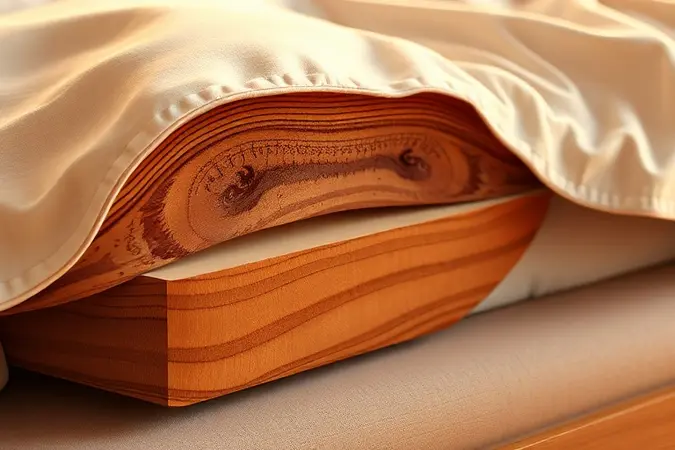
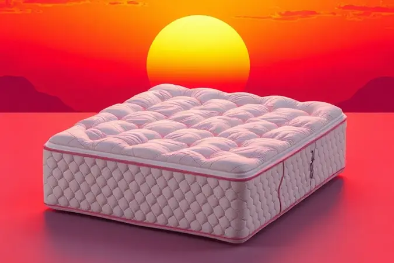

Escolher a cama certa é muito mais do que simplesmente comprar mobília para o quarto. É investir na qualidade do seu sono e, por consequência, no seu bem-estar diário.

Entre as opções que dominam o mercado, a cama box se destaca como uma solução inteligente que combina design moderno com praticidade e suporte ergonômico.

Mas com tantos tamanhos, materiais e tecnologias disponíveis, como navegar mar de escolhas para encontrar *a* cama box perfeita para o seu espaço, seu corpo e seu estilo de vida?

Este guia vai além de uma simples lista para te acompanhar em cada etapa da decisão, analisando profundamente 13 opções de destaque e respondendo todas as dúvidas que surgem nesse momento importante de investimento para 2025 e além.

<SummaryList products={frontmatter.top_products} />

## Melhores Camas Box para comprar em 2025

A cama box se consolidou como o equilíbrio ideal entre conforto e praticidade, uma escolha que otimiza espaço sem abrir mão de noites de sono revigorantes.

Em 2025, as opções evoluíram para atender desde o minimalista urbano até quem busca um centro de descanso luxuoso e tecnológico. O diferencial não está apenas nos materiais, mas em como cada modelo transforma a experiência de dormir.

Abaixo, apresentamos um ranking cuidadoso para você encontrar o parceiro perfeito para seu sono.

### 1. Colchão Castor de Molas Ensacadas Pocket Kingdom Skin Double Face

<ProductBox 
  title={frontmatter.top_products[0].title} 
  image={frontmatter.top_products[0].image} 
  link={frontmatter.top_products[0].link} 
/>

Imagine acordar no meio da noite para ir ao banheiro e voltar para a cama sem que seu parceiro sequer perceba o movimento. Esse é o tipo de tranquilidade que o Colchão Castor Pocket Kingdom Skin Double Face oferece.

Sua tecnologia de molas ensacadas trabalha de forma independente, isolando completamente a transferência de movimento. É como se cada lado da cama fosse um universo particular de conforto.

A grande inteligência deste modelo está na sua versatilidade dupla. Você não está comprando apenas um colchão, mas duas experiências distintas em um único produto.

O design double face significa que, quando um lado demonstrar sinais de uso (algo que levará anos), basta virá-lo para começar um novo ciclo com uma superfície de firmeza levemente diferente.

Camadas de espuma com densidades variadas se adaptam aos contornos do seu corpo, oferecendo aquele apoio firme que mantém sua coluna alinhada, enquanto o revestimento enriquecido com Aloe Vera cuida da sua pele durante todas as horas de repouso.

<CaixaProsContras>

**Prós:**

- Tecnologia de molas ensacadas que minimiza a transferência de movimento.

- Uso assíncrono com design double face para maior durabilidade.

- Camadas de espuma de diferentes densidades para conforto ajustável.

- Revestimento com Aloe Vera que beneficia a saúde da pele.

**Contras:**

- Pode ter um custo superior em comparação a colchões básicos.

- A firmeza alta pode não agradar quem prefere colchões mais macios.

</CaixaProsContras>

### 2. Conjunto Cama Box - Colchão Castor Molas Pocket Gold Star Vitagel Max

<ProductBox 
  title={frontmatter.top_products[1].title} 
  image={frontmatter.top_products[1].image} 
  link={frontmatter.top_products[1].link} 
/>

Durante uma noite de verão abafada, seu maior desejo é encontrar um refúgio fresco para dormir. O Conjunto Castor Molas Pocket Gold Star Vitagel Max entende esse pedido.

A tecnologia Vitagel Max age como um sistema de climatização integrado, dissipando o calor do corpo e mantendo a superfície em uma temperatura agradável durante toda a noite.

Esse controle térmico inteligente é a resposta para quem sofre com suor noturno ou simplesmente valoriza o frescor constante.

Além da regulação de temperatura, o conjunto oferece uma estabilidade que inspira confiança. A borda perimetral reforçada em espuma resistente significa que você pode sentar na beirada da cama para calçar os sapatos sem medo de "rolar" para fora.

Enquanto isso, a malha Aria 3D nas laterais garante que o ar circule livremente, prevenindo aquele abafamento desagradável que alguns colchões acumulam com o tempo.

<CaixaProsContras>

**Prós:**

- Sistema de molas Pocket® que oferece suporte anatômico.

- Tecnologia Vitagel que regula a temperatura do colchão.

- Opções de tamanhos variados para atender diferentes necessidades.

- Estrutura resistente e estável com bordas em espuma.

**Contras:**

- As características podem variar entre os modelos disponíveis.

- Não é o modelo mais barato do mercado.

</CaixaProsContras>

### 3. Conjunto Baú-Colchão Sealy Molas Posturepedic Royal Comfort

<ProductBox 
  title={frontmatter.top_products[2].title} 
  image={frontmatter.top_products[2].image} 
  link={frontmatter.top_products[2].link} 
/>

Para quem busca uma experiência de sono que pareça um abraço reconfortante, o conjunto Sealy Posturepedic Royal Comfort é uma carta de amor ao descanso.

Sua classificação como "extra macio" não é um acidente, mas uma escolha deliberada para proporcionar a sensação de afundar suavemente em uma nuvem.

As camadas de espuma de memória e gel trabalham em harmonia para aliviar a pressão em pontos estratégicos como ombros e quadris, onde nosso corpo mais tensiona durante o dia.

O verdadeiro diferencial deste modelo vai além do conforto. A base baú integrada transforma problemas de organização em solução elegante.

Em vez de caixas empilhadas no armário ou roupas de cama espalhadas, você ganha um compartimento discreto onde guardar edredons, cobertores e travesseiros extras.

É o espaço invisível que todo quarto moderno precisa, especialmente aquele que parece sempre ter menos armários do que o necessário.

<CaixaProsContras>

**Prós:**

- Suporte ortopédico com tecnologia de molas Posturepedic.

- Alívio de pressão com camadas de espuma de memória.

- Espaço interno amplo na base baú para armazenamento.

- Disponível em vários tamanhos para atender diferentes necessidades.

**Contras:**

- Firmeza extra macia pode não ser ideal para todos.

- Peso do colchão pode ser um pouco elevado para manuseio.

</CaixaProsContras>

### 4. Conjunto Cama Box Box - Colchão Sealy Molas Posturepedic Doux Confort

<ProductBox 
  title={frontmatter.top_products[3].title} 
  image={frontmatter.top_products[3].image} 
  link={frontmatter.top_products[3].link} 
/>

Se você já acordou com a sensação de que sua coluna não estava completamente alinhada, o Sealy Posturepedic Doux Confort foi projetado especificamente para resolver esse desconforto.

Ao contrário de colchões que oferecem suporte uniforme, este modelo concentra seu poder na região central, exatamente onde a maior parte do peso corporal se concentra.

O resultado é um alinhamento spinal que parece ter sido personalizado para suas curvas naturais, baseado em décadas de pesquisa ortopédica aplicada ao sono.

A adaptabilidade é outro trunfo. As espumas responsivas não apenas acolhem seu corpo, mas respondem aos seus movimentos durante a noite, ajustando-se continuamente.

E para quem lida com alergias ou simplesmente deseja um ambiente de sono mais puro, os tratamentos antiácaro e antifungo nos tecidos criam uma barreira invisível contra irritantes comuns, permitindo que você respire mais fácil, literalmente.

<CaixaProsContras>

**Prós:**

- Suporte direcionado na região central do colchão.

- Espumas adaptáveis que aliviam pressão.

- Tratamentos antiácaro e antifungo.

- Disponível em vários tamanhos.

**Contras:**

- O preço pode ser mais alto em comparação a outras opções.

- Pode ser pesado para movimentar devido às suas dimensões.

</CaixaProsContras>

### 5. Conjunto Cama Box Baú - Colchão Anjos Molas Ensacadas MasterPocket Impressione Visco Látex Euro Pillow

<ProductBox 
  title={frontmatter.top_products[4].title} 
  image={frontmatter.top_products[4].image} 
  link={frontmatter.top_products[4].link} 
/>

Ter um parceiro que se mexe muito durante a noite não precisa significar noites interrompidas. O colchão Anjos MasterPocket Impressione transforma essa convivência noturna em harmonia silenciosa.

Cada mola ensacada opera de forma independente, absorvendo movimentos antes que eles se propaguem para o outro lado da cama. É como ter duas camas distintas que compartilham o mesmo espaço, perfeito para casais com diferentes ritmos de sono.

A combinação de viscoelástico e látex cria uma experiência tátil sofisticada. Enquanto o viscoelástico molda-se aos seus contornos para alívio de pressão, o látex oferece uma resiliência suave que impede que você "afunde" demais.

A cereja do bolo é o pillow top, aquela camada extra de acolchoamento que parece um travesseiro integrado à superfície do colchão, elevando o conforto a outro patamar.

<CaixaProsContras>

**Prós:**

- Molas ensacadas que reduzem a transferência de movimento.

- Camada de espuma viscoelástica e látex para maior conforto.

- Baú que oferece espaço extra para armazenamento.

- Alta capacidade de peso suportando até 180 kg por pessoa.

**Contras:**

- O tamanho pode ser um pouco volumoso para quartos pequenos.

- Pode exigir cuidados especiais na manutenção do tecido.

</CaixaProsContras>

### 6. Conjunto Box Baú - Colchão Ortobom de Molas SuperPocket Gold Ultra Gel

<ProductBox 
  title={frontmatter.top_products[5].title} 
  image={frontmatter.top_products[5].image} 
  link={frontmatter.top_products[5].link} 
/>

Quando seu corpo esquenta durante a noite, nada é mais frustrante do tentar dormir em um colchão que retém calor como uma estufa. O Ortobom SuperPocket Gold Ultra Gel oferece uma solução elegante.

Sua camada de Viscogel não é apenas mais uma espuma, mas um material inteligente que regula ativamente a temperatura, dissipando o calor corporal para mantê-lo em uma zona de conforto térmico ideal durante todas as estações.

A robustez deste conjunto fala por si mesma. Enquanto alguns modelos mais leves podem dar a sensação de fragilidade, aqui cada elemento foi pensado para durar.

O sistema de molas SuperPocket adapta-se ponto a ponto ao seu corpo, oferecendo suporte individualizado que respeita suas formas únicas, enquanto a base baú em si é uma declaração de funcionalidade inteligente em um móvel que ocupa o mesmo espaço que uma cama comum.

<CaixaProsContras>

**Prós:**

- Molas SuperPocket para conforto individual.

- Camada de espuma de gel que regula a temperatura.

- Base baú que oferece armazenamento extra.

- Design sofisticado com revestimento de qualidade.

**Contras:**

- Pode ser mais pesado do que colchões convencionais.

- Preço pode ser considerado elevado para algumas pessoas.

</CaixaProsContras>

### 7. Conjunto Cama Box Baú - Colchão Herval de Molas Ensacadas Monte Carlo Visco HR

<ProductBox 
  title={frontmatter.top_products[6].title} 
  image={frontmatter.top_products[6].image} 
  link={frontmatter.top_products[6].link} 
/>

Há uma sensação de segurança que vem de saber que sua mobília foi construída para durar gerações. O conjunto Herval Monte Carlo transmite exatamente isso.

A base baú é feita de madeira de eucalipto, escolhida não apenas por sua resistência natural, mas pela estabilidade que proporciona. É a estrutura que não emite rangidos, não cede com o tempo e suporta com elegância o vai-e-vem da vida cotidiana.

O sistema de abertura com molas transforma o que poderia ser uma tarefa árdua em um gesto suave. Você levanta o colchão com facilidade para guardar ou retirar itens, sem precisar lutar contra tampas pesadas ou mecanismos travados.

Combinado com o conforto do viscoelástico HR, que equilibra suporte e adaptabilidade, este conjunto é para quem valoriza durabilidade tanto quanto a qualidade do sono.

<CaixaProsContras>

**Prós:**

- Molas ensacadas que oferecem suporte individualizado.

- Espuma viscoelástica que melhora o conforto e alivia pressão.

- Base baú que fornece grande capacidade de armazenamento.

- Sistema de abertura facilitado, que torna o uso cotidiano mais prático.

**Contras:**

- A variedade de revestimentos pode não agradar a todos os estilos.

- O tamanho do conjunto pode exigir um quarto espaçoso para melhor aproveitamento.

</CaixaProsContras>

### 8. Conjunto cama box - Colchão Herval Molas Maxspring Diplomat

<ProductBox 
  title={frontmatter.top_products[7].title} 
  image={frontmatter.top_products[7].image} 
  link={frontmatter.top_products[7].link} 
/>

Algumas inovações vêm do simples aperfeiçoamento do que já funciona bem. O sistema Maxspring do colchão Herval Diplomat é exatamente isso.

Desenvolvido com tecnologia europeia, essas molas contínuas oferecem uma resiliência que parece melhorar com o tempo, mantendo sua forma e capacidade de suporte ano após ano. É a solução para quem cansou de colchões que começam a afundar depois de alguns meses de uso.

O Pillow Top One Side é o tipo de detalhe que transforma uma boa noite de sono em uma experiência premium. Essa camada extra de acabamento na superfície proporciona um toque macio que recebe seu corpo sem ser excessivamente fofa.

E para aqueles que acordam com espirros ou olhos irritados, o tratamento triplo (antiácaro, antifungos e antialérgico) é mais do que um recurso técnico, é a garantia de acordar verdadeiramente revigorado.

<CaixaProsContras>

**Prós:**

- Conforto excepcional devido ao Pillow Top One Side.

- Sistema de molas Maxspring que garante resiliência.

- Revestimento antiderrapante que aumenta a durabilidade.

- Tratamento antiácaro e antialérgico.

**Contras:**

- Limitação de peso suportado (120 kg por pessoa).

- Pode não ser ideal para quem precisa de um colchão mais firme.

</CaixaProsContras>

### 9. Conjunto Cama Box 4 em 1 (Cama Box + Baú + Cama Auxiliar Courano Bianco Ortobom) + (Colchão Castor D45 SR Victory)

<ProductBox 
  title={frontmatter.top_products[8].title} 
  image={frontmatter.top_products[8].image} 
  link={frontmatter.top_products[8].link} 
/>

Em um espaço limitado, cada móvel precisa trabalhar o dobro. O conjunto 4 em 1 da Ortobom entende essa matemática do cotidiano. Ele não é apenas uma cama, mas um sistema de descanso e hospitalidade completo.

A cama auxiliar embutida significa que receber visitas não precisa mais significar desmontar o escritório ou dormir no sofá desconfortável da sala.

O revestimento em Courano Bianco é uma escolha de quem valoriza estética e praticidade na mesma medida. Além do visual sofisticado, esse material é notoriamente fácil de limpar. Um pano úmido remove a poeira do dia a dia, mantendo a aparência nova por muito mais tempo.

Com o colchão Castor D45 SR Victory oferecendo suporte firme e duradouro, este conjunto é a solução definitiva para apartamentos pequenos e casas que valorizam flexibilidade.

<CaixaProsContras>

**Prós:**

- Otimiza espaço com o baú integrado.

- Inclui uma cama auxiliar para visitas.

- Revestimento fácil de limpar.

- Colchão de alta qualidade com ótimo suporte.

**Contras:**

- Configuração da cama auxiliar pode variar entre os modelos.

- Pode requerer atenção nas especificações ao comprar.

</CaixaProsContras>

### 10. Conjunto Cama Box - Colchão Espuma D33 Castor Vitagel Space Vácuo

<ProductBox 
  title={frontmatter.top_products[9].title} 
  image={frontmatter.top_products[9].image} 
  link={frontmatter.top_products[9].link} 
/>

A portabilidade é um superpoder subestimado no mundo dos colchões. Quantas vezes você já desistiu de levar um colchão para outro ambiente porque era grande demais para passar pela porta? A embalagem a vácuo do Colchão Castor Vitagel Space muda completamente esse jogo.

Ele chega compactado, permitindo que você o transporte com facilidade e o instale no local desejado, onde então expande para seu tamanho original. É revolucionário para mudanças, reformas ou simplesmente para reorganização dos ambientes.

Mas a inteligência deste modelo não para na embalagem. O fato de ter duas faces (uma mais firme, outra mais macia) significa que você pode personalizar o conforto conforme suas necessidades mudam. Hoje prefere mais firmeza? Use um lado.

Daqui a alguns anos, sentir que precisa de mais maciez? Basta virar. Essa flexibilidade estende a vida útil do produto e adapta-o às diferentes fases da sua vida.

<CaixaProsContras>

**Prós:**

- Conforto com duas opções de firmeza

- Tecnologia de regulação de temperatura

- Tecido tratado contra ácaros e fungos

- Fácil transporte devido à embalagem a vácuo

**Contras:**

- Limitação de peso suportado (até 110 kg)

- Garantia do tecido menor em comparação ao colchão

</CaixaProsContras>

### 11. Cama Box Baú Queen Molas Ensacadas Maranello Fabrispuma

<ProductBox 
  title={frontmatter.top_products[10].title} 
  image={frontmatter.top_products[10].image} 
  link={frontmatter.top_products[10].link} 
/>

A manutenção do colchão costuma estar entre as tarefas que adiamos indefinidamente. Virar e girar um colchão pesado não é exatamente divertido. A tecnologia "One Side" e "Turn Free" da Maranello Fabrispuma liberta você dessa obrigação.

Este colchão foi projetado para não precisar ser virado, eliminando uma tarefa doméstica que poucos gostam de fazer.

A otimização do espaço continua com o mecanismo de pistão a gás no baú. Em vez de levantar uma tampa pesada com esforço, você aplica uma leve pressão e o compartimento se abre suavemente, revelando todo o espaço de armazenamento.

Essa atenção aos detalhes práticos, combinada com o tratamento contra ácaros e fungos, cria uma experiência de uso que parece ter sido pensada para simplificar sua vida, não complicá-la.

<CaixaProsContras>

**Prós:**

- Conforto superior com molas ensacadas.

- Tecnologia "One Side" e "Turn Free" para fácil manutenção.

- Ótima opção de armazenamento com baú.

- Tratamento antiácaro e antialérgico.

**Contras:**

- A instalação do mecanismo de pistão pode ser complexa.

- Pode não ser compatível com todos os estilos de decoração.

</CaixaProsContras>

### 12. Cama Box Baú Queen Molas Ensacadas White Horse Pillow Linha Horse Collection

<ProductBox 
  title={frontmatter.top_products[11].title} 
  image={frontmatter.top_products[11].image} 
  link={frontmatter.top_products[11].link} 
/>

Existe uma sensação única ao tocar um tecido que parece fresco mesmo em dias quentes. O tampo Sense Ice da White Horse Pillow promete e entrega exatamente isso.

Essa malha especial mantém uma superfície refrescante que não acumula calor, transformando sua cama em um oásis térmico durante noites abafadas de verão.

O visual também foi cuidadosamente considerado. O revestimento em bouclé, aquele tecido com textura delicada e aspecto aconchegante, adiciona uma camada de sofisticação tátil ao ambiente.

Não se trata apenas de conforto funcional, mas de criar um espaço que você sente prazer em habitar visualmente. A estrutura em madeira maciça completa a proposta, oferecendo uma solidez que transmite qualidade desde o primeiro olhar.

<CaixaProsContras>

**Prós:**

- Colchão com molas ensacadas para melhor suporte.

- Espuma Hypersoft e Comfort Sense para conforto superior.

- Amplo espaço de armazenamento no baú.

- Design sofisticado com revestimento em bouclé.

**Contras:**

- Algumas versões são bipartidas, o que pode não agradar todos.

- Pode ser mais pesada devido à estrutura de madeira maciça.

</CaixaProsContras>

### 13. Cama Box Queen Baú Molas Ensacadas Black Horse Linha Horse Collection

<ProductBox 
  title={frontmatter.top_products[12].title} 
  image={frontmatter.top_products[12].image} 
  link={frontmatter.top_products[12].link} 
/>

Quando o design encontra a funcionalidade sem compromissos, o resultado é algo como a Black Horse. Esta cama entende que estilo e praticidade não precisam competir.

As espumas de alta densidade trabalham em conjunto com o látex natural para criar uma experiência de sono que equilibra suporte duradouro com conforto adaptável.

A atenção aos materiais de qualidade se torna evidente não apenas na sensação ao deitar, mas na durabilidade ao longo dos anos.

Enquanto colchões com materiais menos nobres podem começar a ceder depois de alguns anos, esta combinação inteligente entre estrutura robusta e materiais premium foi projetada para manter suas propriedades originais por muito mais tempo.

É um investimento que continua a entregar retornos em qualidade de sono ano após ano.

<CaixaProsContras>

**Prós:**

- Molas ensacadas para suporte adaptável

- Amplo espaço de armazenamento no baú

- Espumas de alta densidade para conforto

- Tecido refrescante e agradável ao toque

**Contras:**

- Não é a opção mais acessível do mercado

- Pode ocupar mais espaço devido ao baú

</CaixaProsContras>

Agora que você explorou as melhores opções disponíveis, é natural perguntar: qual modelo realmente se adapta à sua realidade?

As camas box não são todas iguais, e entender essas diferenças é o que separa uma escolha satisfatória de uma verdadeira transformação no seu quarto.

## Qual a diferença entre as camas box?

Pensar nas camas box como um único produto é como considerar todos os carros como iguais. Na verdade, elas se diferenciam profundamente em seus materiais (madeira maciça, MDF, metal), altura do baú, sistema de suporte interno e, claro, nas dimensões finais.

Essas variações não são apenas estéticas, mas determinam como a cama se acomoda ao seu espaço, como suporta seu peso e, principalmente, como contribui para a qualidade do seu sono. Escolher entre essas diferenças é escolher como você quer experimentar o descanso.

### Conheça as dimensões de cada categoria:

Antes de se apaixonar por qualquer modelo, tenha uma conversa honesta com o espaço disponível no seu quarto.

As categorias padrão - solteiro (cerca de 88x188 cm), casal (138x188 cm), queen (158x198 cm) e king (193x203 cm) - servem como guia, mas o verdadeiro teste é fazer uma simulação.

Use fita crepe para marcar essas dimensões no chão, caminhe ao redor, visualize a circulação.

Uma cama queen em um quarto pequeno pode oferecer conforto de sobra para duas pessoas, mas se não sobrar espaço para abrir a porta do armário ou para uma mesa de cabeceira, o ganho em sono pode ser perdido em frustração diária.

As medidas não são apenas números, são a promessa de como você vai conviver com esse móvel pelos próximos anos.

## Para quem é indicada a cama box?

Se você já cansou de limpar embaixo da cama ou de lutar contra cantos escuros que acumulam poeira, a cama box oferece uma solução elegante.

Sua estrutura fechada transforma a limpeza em uma tarefa simples, enquanto a base rígida proporciona um suporte uniforme que muitos colchões modernos exigem para desempenharem seu melhor. Mas as indicações vão além da praticidade.

É para quem mora em espaços compactos e precisa otimizar cada centímetro, para quem valoriza design limpo e contemporâneo, e especialmente para quem busca uma fundação sólida que melhore a performance de seu colchão de qualidade.

### Entenda os prós e contras de comprar uma cama box

Toda escolha envolve equilíbrios. A cama box oferece uma base estável que pode elevar a qualidade do seu colchão, mas essa mesma estrutura fechada reduz a ventilação natural que algumas pessoas valorizam.

Seu design compacto e frequentemente mais leve facilita movimentações e limpeza, contrastando com modelos tradicionais que podem ser verdadeiras fortalezas difíceis de reposicionar.

O ponto crucial é entender como você vive: se prefere a praticidade de uma superfície limpa e funcional ou se a ventilação natural do colchão é uma prioridade não negociável para seu conforto térmico.

#### Vantagens

Imagine acordar e, em vez de passar o aspirador embaixo de uma estrutura complexa de ripas, simplesmente limpar uma superfície plana contínua. Essa é a praticidade que a cama box traz para sua rotina de limpeza.

Além da facilidade na manutenção, ela oferece um suporte uniforme que muitos colchões premium necessitam para distribuir o peso corretamente. Para os espaços que parecem sempre encolher, o baú integrado não é apenas um extra, mas uma solução real de organização.

E com a variedade de designs disponíveis, desde os mais sóbrios até opções com cabeceiras estofadas, você encontra não apenas um móvel funcional, mas uma peça que dialoga com a personalidade do seu quarto.

#### Desvantagens

É preciso considerar que algumas camas box, especialmente as com estruturas robustas e baús grandes, podem ser surpreendentemente pesadas, dificultando mudanças de posição no quarto ou limpezas mais profundas.

A ventilação limitada, característica da base fechada, significa que colchões mais sensíveis à umidade podem exigir um cuidado extra, com viradas periódicas para garantir circulação de ar.

E embora a maioria ofereça suporte adequado, modelos mais econômicos podem não ter a robustez necessária para colchões muito pesados ou para pessoas que, por necessidade, se sentam frequentemente nas bordas.

Esses pontos não são proibições, mas convites para uma escolha mais consciente.

## O que devo observar ao comprar uma cama box?

Comprar uma cama box é como escolher os alicerces da sua casa. Você não os vê todos os dias, mas sua qualidade determina a estabilidade de tudo que vem acima. Por isso, observe além do preço e da aparência.

Preste atenção na compatibilidade do tamanho com seu espaço real, na qualidade dos materiais da estrutura (que determinarão sua durabilidade), nas especificações do colchão que planeja usar e, crucialmente, nas garantias oferecidas pelo fabricante.

Uma garantia generosa geralmente reflete a confiança da empresa na longevidade de seu produto.

### Podemos citar cinco fatores essenciais na hora da compra

Cinco perguntas podem guiar sua decisão de forma mais segura. Primeiro, o espaço físico: além de medir o local, visualize como você vai circular ao redor, onde ficarão as mesas de cabeceira.

Segundo, sua relação pessoal com o conforto: você dorme de lado, de barriga para cima, precisa de firmeza extra ou prefere afundar suavemente? Terceiro, os materiais: a estrutura em MDF é mais acessível, a madeira maciça oferece robustez, o metal traz modernidade.

Quarto, a estética: esta cama será o centro do seu quarto por anos, então escolha um design que você não apenas tolere, mas ame.

Quinto e final, o suporte pós-compra: uma garantia sólida e uma assistência técnica acessível são seu seguro contra imprevistos na sua jornada de sono.

## Cuidados e Manutenção para Prolongar a Vida Útil da Cama Box

Sua nova cama box é um investimento que merece cuidados simples, mas consistentes. Comece protegendo-a da exposição direta ao sol, que pode não apenas desbotar tecidos, mas também comprometer a integridade de alguns materiais ao longo do tempo.

A rotação do colchão a cada três meses (mesmo em modelos que não precisam ser virados) ajuda a distribuir o desgaste de forma mais uniforme, prolongando sua vida útil significativamente.

Na limpeza, opte por um pano levemente umedecido com água e sabão neutro, evitando produtos químicos agressivos que podem danificar revestimentos e acabamentos.

E não subestime a inspeção periódica: dedique alguns minutos a cada seis meses para verificar as áreas de suporte, garantindo que não haja danos nas estruturas internas ou sinais de desgaste incomum.

Esses pequenos gestos preventivos podem adicionar anos de conforto à sua relação com sua cama.

## Como Escolher Cama Box: Considerações Sobre Tamanhos e Modelos

Escolher uma cama box é essencialmente contar uma história sobre como você quer viver no seu espaço privado. O tamanho não é apenas uma questão de encaixe físico, mas de conforto psicológico.

Uma cama king em um quarto espaçoso pode oferecer uma sensação de liberdade, enquanto uma cama queen em um ambiente compacto pode criar uma atmosfera acolhedora e protegida.

O tipo de colchão que você ama (mais firme, mais macio, com tecnologia específica) vai ditar o tipo de suporte que sua base precisa oferecer. E o material da cama não é apenas estética, mas uma declaração sobre durabilidade e manutenção.

### Tipos de Cama Box

Dentro do universo das camas box, existem perfis distintos para diferentes personalidades e necessidades. A cama box simples é para o minimalista que valoriza funcionalidade acima de tudo, sem elementos supérfluos.

A cama box baú é a aliada do organizador nato, daquele que encontra paz na possibilidade de ter tudo em seu devido lugar, mesmo em espaços reduzidos.

A cama box com cabeceira transforma o móvel em uma afirmação de estilo, adicionando conforto visual e físico (para ler, assistir TV).

E os modelos com colchões embutidos oferecem a conveniência de uma solução completa, eliminando a necessidade de compatibilizar componentes separados.

### Materiais e Estruturas

Os materiais da sua futura cama falam sobre valores além do orçamento. A madeira, especialmente a maciça, oferece uma robustez e uma presença que transmitem permanência.

O MDF, mais leve e acessível, permite designs criativos e é uma excelente opção quando a prioridade é equilibrar custo e funcionalidade. O metal, por sua vez, traz uma estética industrial e moderna, com excelente durabilidade e frequentemente menos peso.

Independentemente do material, a estrutura interna merece sua atenção. Procure por reforços nas áreas de maior tensão (centro e bordas), por sistemas de montagem que facilitem a instalação e, se optar por um modelo com baú, por mecanismos de abertura suaves e seguros.

A estrutura não é apenas o que esconde, é o que sustenta todas as suas noites de descanso.

## Escolhendo o Colchão Ideal

Se a cama box é o palco, o colchão é o protagonista do seu sono. Escolhê-lo considerando apenas preço ou aparência é como comprar sapatos apenas pelo número, sem experimentar.

A posição em que você dorme (de lado, de barriga para cima, de bruços) determina o tipo de suporte que suas curvas naturais precisam. Suas preferências pessoais por firmeza ou maciez não são caprichos, mas dados importantes sobre como seu corpo busca relaxamento.

E o material (espuma, molas, híbridos) define não apenas o toque, mas a forma como o colchão responde aos seus movimentos durante a noite.

### Molas Ensacadas ou Espuma

Esta escolha define a personalidade do seu descanso. As molas ensacadas são diplomáticas. Elas trabalham de forma independente, isolando movimentos e oferecendo suporte pontual.

São ideais para casais com diferentes horários ou padrões de movimento, criando dois espaços de conforto dentro de uma mesma superfície. Já os colchões de espuma, especialmente os de alta densidade, são abraçadores.

Eles envolvem seu corpo, aliviando pressão de forma uniforme, perfeitos para quem dorme de lado ou busca alívio para dores nos pontos de contato. Sua decisão depende de qual tipo de conversa seu corpo quer ter com a superfície onde repousa.

### Importância da Densidade e Tecnologias de Colchões

Densidade não é apenas um número técnico, é uma promessa de durabilidade e suporte. Um colchão com densidade mais alta oferece uma base firme que mantém sua forma por mais tempo, sendo ideal para quem precisa de apoio consistente para o alinhamento da coluna.

Densidades menores proporcionam aquela sensação acolhedora de "afundar" que muitas pessoas associam ao máximo conforto.

As tecnologias complementam esse cenário. A espuma viscoelástica, por exemplo, tem uma inteligência térmica que a torna mais macia com o calor do seu corpo, adaptando-se precisamente aos seus contornos.

O látex natural oferece uma resiliência suave e excelente ventilação. Essas inovações não são apenas recursos de marketing, mas soluções reais para necessidades específicas de conforto térmico, alívio de pressão e redução de movimentos.

### Colchão Separado ou Conjugado

Esta decisão final é sobre intimidade e individualidade. O colchão conjugado cria uma paisagem de sono contínua, uma superfície unificada que incentiva proximidade e compartilhamento do espaço.

É perfeito para casais que têm preferências de firmeza similares e valorizam a sensação de uma cama tradicional.

O colchão separado, por outro lado, é uma declaração de autonomia noturna. Ele permite que cada pessoa escolha exatamente o nível de firmeza que seu corpo precisa, sem compromissos.

Além da personalização, oferece vantagens práticas: é mais fácil de transportar em mudanças, virar durante a manutenção e, em alguns casos, substituir apenas um lado se necessário, embora essa opção dependa da estrutura da cama box.

A escolha reflete não apenas como você dorme, mas como você convive com seu parceiro durante o descanso.

## Conclusão

Escolher a cama box perfeita é muito mais do que selecionar um móvel para seu quarto. É uma decisão que investe diretamente na qualidade do seu repouso, no conforto do seu dia seguinte e na harmonia do seu espaço pessoal.

Este guia percorreu desde as sutilezas técnicas dos 13 melhores modelos de 2025 até os princípios fundamentais que devem guiar sua escolha, sempre traduzindo especificações em experiências reais.

Lembre-se que a cama ideal não é necessariamente a mais cara ou a mais tecnológica, mas aquela que dialoga com sua realidade física, suas preferências pessoais e seu estilo de vida.

Seja privilegiando o conforto térmico, a minimização de movimentos, o armazenamento inteligente ou a facilidade de manutenção, existe uma opção que se encaixa perfeitamente na sua jornela noturna.

Antes de finalizar sua decisão, retorne às cinco perguntas essenciais: o espaço disponível, seu perfil de conforto, os materiais que valoriza, o design que ama e o suporte pós-venda que te dá segurança.

Quando essas respostas se alinham com as características de um modelo específico, você não está apenas comprando uma cama. Está adotando um companheiro de descanso que vai contribuir para noites mais tranquilas e dias mais energizados pelos próximos anos.

Sua melhor cama box não é um produto genérico, mas a expressão material de como você escolhe cuidar de si mesmo através do sono. Agora é hora de aplicar esse conhecimento e transformar seu quarto em um verdadeiro santuário de descanso.