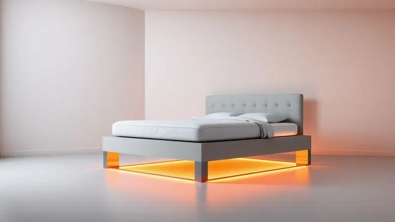
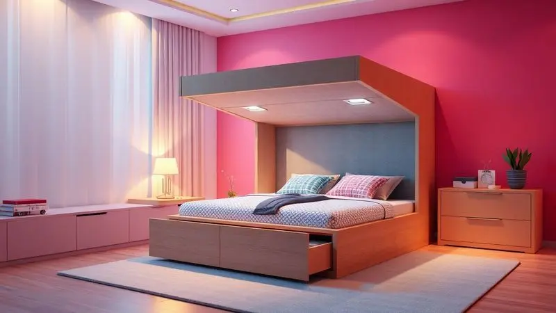
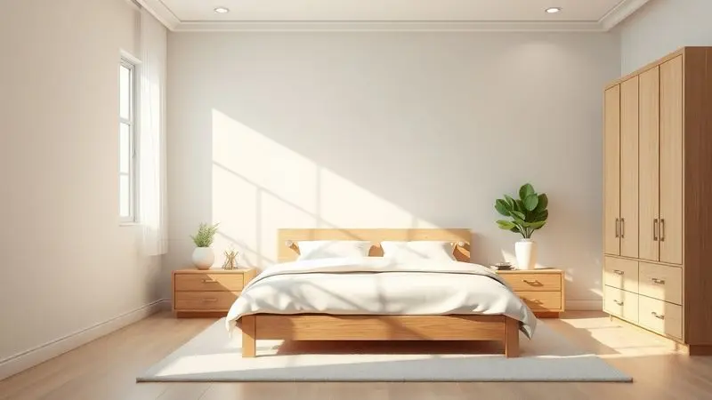
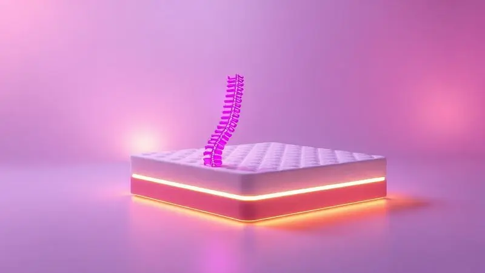

A decisão pela cama box perfeita vai além de um simples móvel para o quarto. É um investimento consciente naquilo que recupera suas energias, acalma sua mente e cuida do seu corpo.

Imagine acordar sem dores, sentir seu colchão se moldar ao seu corpo como um abraço, ou ainda ter um espaço extra para organizar sua vida sem abrir mão do estilo. Com tanta variedade de tecnologias, densidades e designs, a escolha pode parecer uma labirinto.

Por isso, reunimos as 13 melhores camas box do mercado, analisando cada uma como se fosse para nossa própria casa. Continue lendo e descubra qual conjunto vai transformar suas noites em verdadeiros retiros de descanso.

<SummaryList products={frontmatter.top_products} />

## As 13 Melhores Camas Box para Comprar Hoje

Cada pessoa dorme de um jeito, cada corpo tem suas necessidades. Essa seleção foi pensada para atender desde quem precisa de suporte extra para a coluna até quem busca um refúgio térmico nas noites quentes, sempre com um olhar atento ao custo-benefício.

### 1. Conjunto Box: Colchão Castor de Molas Pocket Viategel SLX + Cama Courino White

<ProductBox 
  title={frontmatter.top_products[0].title} 
  image={frontmatter.top_products[0].image} 
  link={frontmatter.top_products[0].link} 
/>

Pense em um suporte que se adapta exclusivamente a você, como uma segunda pele. É isso que as molas pocket do Colchão Castor oferecem, eliminando aqueles ruídos que quebram o silêncio da noite e garantindo que você não sinta o movimento de quem dorme ao lado.

A mágica do Viategel acontece na regulação da temperatura: você sente frescor no verão e aconchego no inverno, sem precisar trocar de colchão.

Já a Cama Courino White vai transformar o visual do seu quarto com sua elegância discreta, mas sua verdadeira magia está escondida.

O baú embutido é a solução para guardar aqueles edredons pesados, travesseiros extras ou roupas de cama de estação, liberando espaço no armário e deixando o ambiente mais limpo e arejado.

<CaixaProsContras>

**Prós:**

- Molas pocket que oferecem suporte individualizado.

- Tecnologia ViscoGel para conforto térmico.

- Cama baú com espaço extra de armazenamento.

- Revestimento elegante e fácil de limpar.

**Contras:**

- Pode ter um custo inicial elevado.

- Altura do colchão pode ser considerada alta para algumas pessoas.

</CaixaProsContras>

### 2. Conjunto Box: Colchão Castor Pocket Gold Star SLX Vitagel Max (88239) + Cama Nobuck Cinza

<ProductBox 
  title={frontmatter.top_products[1].title} 
  image={frontmatter.top_products[1].image} 
  link={frontmatter.top_products[1].link} 
/>

Se você acorda frequentemente com calor ou sua pele precisa respirar durante o sono, este conjunto foi feito para você. A espuma Fresh Comfort Gel age como um sistema de climatização pessoal, dissipando o calor do corpo e mantendo a superfície sempre agradável.

Enquanto isso, as molas do Pocket System trabalham em silêncio para contornar cada curva do seu corpo, aliviando a pressão nos ombros e quadris.

A Cama Nobuck Cinza é a base perfeita para essa experiência: um design sóbrio que se encaixa em qualquer decoração, feito com um material que resiste ao tempo e ao uso diário, mantendo sempre aquele aspecto de novo.

<CaixaProsContras>

**Prós:**

- Tecnologia Pocket System que adapta-se ao corpo.

- Espuma Fresh Comfort Gel para conforto térmico.

- Design elegante da Cama Nobuck Cinza.

- Alta capacidade de suporte, ideal para diferentes tipos de usuários.

**Contras:**

- O investimento inicial pode ser considerável.

- Não é tão fácil de transportar devido ao seu tamanho.

</CaixaProsContras>

### 3. Conjunto Box: Colchão Herval de Molas MasterPocket Eruditto c/ Massagem + Cama Nobuck Bege Crema

<ProductBox 
  title={frontmatter.top_products[2].title} 
  image={frontmatter.top_products[2].image} 
  link={frontmatter.top_products[2].link} 
/>

Imagine chegar em casa após um dia intenso e, em vez de apenas deitar, poder ativar uma sessão relaxante de massagem vibratória diretamente na sua cama. Esse é o diferencial que transforma o sono em um ritual de autocuidado.

As molas MasterPocket garantem que esse momento seja só seu, sem perturbar quem está ao lado, oferecendo um suporte cirúrgico para cada região do corpo.

A estrutura em madeira de eucalipto e o nobuck bege crema trazem uma sensação de sofisticação e durabilidade ao ambiente, como se seu quarto tivesse ganhado um upgrade de conforto e estilo.

<CaixaProsContras>

**Prós:**

- Molas ensacadas que evitam a transferência de movimento.

- Função de massagem vibratória para relaxamento.

- Design elegante com revestimento em nobuck.

- Tratamento antiácaro e antifungo para maior higiene.

**Contras:**

- Peso máximo indicado pode limitar o uso para algumas pessoas.

- Pode não ser ideal para quem prefere colchões mais firmes.

</CaixaProsContras>

### 4. Conjunto Box: Colchão Anjos Espuma Ortopédica Confort Magnético + Cama Courino White

<ProductBox 
  title={frontmatter.top_products[3].title} 
  image={frontmatter.top_products[3].image} 
  link={frontmatter.top_products[3].link} 
/>

Para quem busca alívio além do conforto, este conjunto apresenta uma proposta interessante.

A estrutura ortopédica com camadas de espuma de alta densidade oferece um suporte firme e consistente para a coluna, enquanto os ímãs incorporados prometem um auxílio extra na circulação sanguínea e no alívio de tensões musculares.

A estética prática entra em cama com a base Courino White, cuja superfície lisa não acumula poeira e pode ser limpa com um pano úmido, ideal para quem valoriza praticidade sem abrir mão de um visual clean e moderno.

<CaixaProsContras>

**Prós:**

- Conforto extra firme com estrutura ortopédica.

- Camadas de espuma de alta qualidade que se adaptam ao corpo.

- Cama em courino branco que é fácil de limpar.

- Potencial auxílio à circulação sanguínea através do magnetismo.

**Contras:**

- Benefícios terapêuticos do magnetismo não são amplamente comprovados.

- O revestimento em courino pode exigir cuidados específicos para manutenção.

</CaixaProsContras>

### 5. Conjunto Box: Colchão Orthocrin SuperPocket Bellagio + Cama Box Nobuck Bege Crema

<ProductBox 
  title={frontmatter.top_products[4].title} 
  image={frontmatter.top_products[4].image} 
  link={frontmatter.top_products[4].link} 
/>

Se sua prioridade é um suporte robusto que mantenha a coluna perfeitamente alinhada, esta combinação é uma forte candidata.

As 32 cm de altura não são apenas estética, elas abrigam camadas de espuma e molas que trabalham em conjunto para distribuir o peso de forma inteligente. A tecnologia de gel integrada age como um regulador térmico passivo, garantindo que o calor não se acumule.

O visual sofisticado do nobuck bege crema esconde uma estrutura sólida e, em algumas versões, a surpresa de um baú com pistão hidráulico que abre suavemente, revelando um espaço generoso para organização.

<CaixaProsContras>

**Prós:**

- Tecnologia de gel que mantém a temperatura agradável.

- Molas ensacadas oferecem suporte adequado ao corpo.

- Design elegante da cama box em nobuck.

- Possibilidade de modelo com baú para armazenamento.

**Contras:**

- O nível de conforto é firme, o que pode não agradar todos.

- Não é o modelo mais acessível do mercado.

</CaixaProsContras>

### 6. Conjunto Box: Colchão Herval MasterPocket Imperatore + Cama Box Nobuck Cinza

<ProductBox 
  title={frontmatter.top_products[5].title} 
  image={frontmatter.top_products[5].image} 
  link={frontmatter.top_products[5].link} 
/>

Aqui, o conforto se apresenta em camadas. Primeiro, as molas ensacadas oferecem uma base de suporte personalizada. Sobre elas, a espuma viscoelástica entra em ação, amolecendo nos pontos certos para abraçar seus contornos e aliviar a pressão.

A sensação é de estar deitado em uma nuvem que, paradoxalmente, não deixa sua coluna afundar.

O toque final vem das fibras de bambu no revestimento, que além de serem naturalmente frescas, criam uma barreira contra ácaros e fungos, contribuindo para um ambiente de sono mais puro e saudável.

Tudo isso repousa sobre a base Nobuck cinza, um clássico moderno que nunca sai de moda.

<CaixaProsContras>

**Prós:**

- Molas ensacadas proporcionam amortecimento individual.

- Camadas de espuma viscoelástica oferecem conforto adicional.

- Revestimento com fibras de bambu tem propriedades antiácaro.

- Design moderno da base em Nobuck cinza.

**Contras:**

- Limitação de peso máximo em alguns modelos.

- Variedade nas especificações pode gerar confusão.

</CaixaProsContras>

### 7. Conjunto Box: Colchão Sealy de Molas Posturepedic Doux Comfort + Cama Nobuck Rosolare Café

<ProductBox 
  title={frontmatter.top_products[6].title} 
  image={frontmatter.top_products[6].image} 
  link={frontmatter.top_products[6].link} 
/>

Desenvolvido com foco ergonômico, este colchão age como um personal trainer para sua postura durante o sono. A tecnologia Posturepedic foi pensada para oferecer suporte diferenciado nas zonas de maior peso, mantendo a coluna em uma posição neutra e natural.

Os tratamentos antiácaro e antifungo funcionam como um escudo invisível, protegendo seu santuário do sono.

A funcionalidade prática brilha na Cama Nobuck Rosolare Café. O baú não é um extra, é uma extensão do seu armário, perfeito para itens sazonais ou aquela bagunça que você quer manter fora de vista, mas sempre acessível.

<CaixaProsContras>

**Prós:**

- Excelente suporte ergonômico com tecnologia Posturepedic.

- Tratamentos antiácaro e antifungo.

- Cama baú que oferece espaço adicional de armazenamento.

- Estética elegante com revestimento em nobuck café.

**Contras:**

- O peso suportado pode ser limitado para usuários mais pesados em comparação a outras opções no mercado.

- Design da cama é mais básico, podendo não agradar a todos os estilos.

</CaixaProsContras>

### 8. Conjunto Box: Colchão Ortobom SuperPocket Freedom + Cama Courino White

<ProductBox 
  title={frontmatter.top_products[7].title} 
  image={frontmatter.top_products[7].image} 
  link={frontmatter.top_products[7].link} 
/>

A promessa deste conjunto é liberdade: liberdade de movimento sem perturbar seu parceiro, graças às molas Superpocket, e liberdade de dores, com o Pillow Top de viscoelástica que afunda justo nos pontos onde seu corpo mais precisa.

É como se o colchão antecipasse seus pontos de tensão e trabalhasse para dissolvê-los.

Os tratamentos antiácaros adicionam uma camada de proteção para sua saúde, enquanto a base courino branco entrega um visual que clareia o ambiente e combina com praticamente qualquer paleta de cores, oferecendo ainda a opção de armazenamento interno para completar o pacote de praticidade.

<CaixaProsContras>

**Prós:**

- Tecnologia de molas Superpocket para menor transferência de movimento.

- Pillow Top em espuma viscoelástica que se adapta ao corpo.

- Tratamentos antiácaros e cuidados com a pele.

- Design estético com base em courino branco.

**Contras:**

- Suporte de peso limitado a 150 kg por pessoa.

- Pode exigir cuidados específicos na limpeza da base.

</CaixaProsContras>

### 9. Conjunto Box: Colchão Castor Pocket Gold Star Green + Cama Courino White

<ProductBox 
  title={frontmatter.top_products[8].title} 
  image={frontmatter.top_products[8].image} 
  link={frontmatter.top_products[8].link} 
/>

Este conjunto é para quem não quer escolher entre conforto, tecnologia e organização. As molas ensacadas garantem o suporte de elite, enquanto a tecnologia Outlast® atua como um termostato embutido, ajustando a temperatura conforme seu corpo pede.

A cereja do bolo é a função Niponpedic®, que transforma seu colchão em uma zona de relaxamento com micro massagens.

Todo esse arsenal tecnológico repousa sobre uma base que é pura praticidade disfarçada de elegância. O baú com pistão a gás abre com um toque suave, revelando um espaço tão amplo que você vai se perguntar como viveu sem ele.

<CaixaProsContras>

**Prós:**

- Conforto excepcional graças às molas ensacadas.

- Tecnologia para controle de temperatura e relaxamento.

- Design moderno e elegante do courino branco.

- Amplo espaço de armazenamento no baú.

**Contras:**

- Pode ser pesado, dificultando a movimentação.

- Requer verificação das dimensões para transporte.

</CaixaProsContras>

### 10. Conjunto Box: Colchão Herval Molas Ensacadas MasterPocket Versatto+ Cama Nobuck Rosolare Café

<ProductBox 
  title={frontmatter.top_products[9].title} 
  image={frontmatter.top_products[9].image} 
  link={frontmatter.top_products[9].link} 
/>

O equilíbrio é a palavra de ordem aqui. Este colchão alcança o ponto ideal entre maciez e firmeza que muitos buscam: ele acolhe seu corpo sem deixá-lo afundar, oferece suporte sem ser rígido.

O sistema de molas ensacadas garante que essa experiência seja individual, e o Pillow Top adiciona aquele toque extra de aconchego que faz toda a diferença na hora de adormecer.

A preocupação com a higiene do sono aparece no tratamento antiácaro e antifungo, enquanto a Cama Nobuck Rosolare Café traz um tom terroso e aconchegante para o quarto, criando um ambiente convidativo ao descanso.

<CaixaProsContras>

**Prós:**

- Sistema de molas ensacadas que oferece suporte individualizado.

- Pillow Top para maior conforto.

- Tratamento antiácaro e antifungo para melhor higiene.

- Marca reconhecida pela qualidade e durabilidade.

**Contras:**

- Suporta até 110 kg por pessoa, pode ser limitante para usuários mais pesados.

- O preço pode ser mais elevado em comparação a opções mais básicas.

</CaixaProsContras>

### 11. Cama Box Baú Solteiro Espuma D45 Black e White Air Castor

<ProductBox 
  title={frontmatter.top_products[10].title} 
  image={frontmatter.top_products[10].image} 
  link={frontmatter.top_products[10].link} 
/>

Ideal para otimizar espaços compactos sem sacrificar o conforto, este conjunto solteiro é uma lição de inteligência espacial.

O colchão de espuma D45 oferece uma firmeza ortopédica confiável, enquanto a tecnologia Air Flow age como um sistema de respiração, impedindo que o calor e a umidade se acumulem no interior.

A dupla face do colchão dobra sua vida útil, e o baú com 28 cm de profundidade é dimensionado para guardar exatamente o que você precisa em um quarto pequeno: roupas de cama, travesseiros extras ou até alguns livros.

Tudo em um design moderno que aproveita o contraste preto e branco.

<CaixaProsContras>

**Prós:**

- Conforto firme ideal para suporte da coluna

- Tecnologia de ventilação que mantém o colchão fresco

- Baú espaçoso para armazenamento

- Design moderno e elegante

**Contras:**

- Altura total pode ser elevada para alguns espaços

- Limitado para quem prefere colchões mais macios

</CaixaProsContras>

### 12. CAMA INBOX Cama Box King Colchão OrtoFirm + Box Double Face Espuma D45 Cinza

<ProductBox 
  title={frontmatter.top_products[11].title} 
  image={frontmatter.top_products[11].image} 
  link={frontmatter.top_products[11].link} 
/>

Para quem não abre mão de espaço e busca um suporte extra firme, este conjunto king é uma fortaleza do sono.

A espuma D45 certificada forma uma base sólida e ortopédica, enquanto o sistema Double Face garante que você possa virar o colchão periodicamente, distribuindo o desgaste e prolongando significativamente sua vida útil.

O conforto não fica apenas na base. O Pillow Top Euro Duplo adiciona uma camada de maciez seletiva na superfície, criando um contraste perfeito: firmeza onde sua coluna precisa, suavidade onde seu corpo toca.

A estrutura em eucalipto 100% reflorestado dá a sustentação robusta que todo esse conjunto merece.

<CaixaProsContras>

**Prós:**

- Conforto extra com Pillow Top Euro Duplo.

- Suporte ortopédico ideal para a coluna.

- Tecnologia Double Face aumentando a durabilidade.

- Estrutura sustentável em madeira de Eucalipto.

**Contras:**

- Requer montagem após a entrega.

- Não é um modelo adaptável para quem prefere colchões macios.

</CaixaProsContras>

### 13. BF COLCHÕES Cama Box King Molas Ensacadas 193 x 203 Premium Sleep

<ProductBox 
  title={frontmatter.top_products[12].title} 
  image={frontmatter.top_products[12].image} 
  link={frontmatter.top_products[12].link} 
/>

Este é o conjunto que transforma o sono em uma experiência premium. As molas ensacadas funcionam como uma rede de suporte inteligente, onde cada ponto trabalha de forma independente, garantindo que você tenha sua própria ilha de conforto mesmo dividindo a cama.

O pillow top em espuma Max Flowing D28 completa a experiência, aliviando pontos de pressão de forma quase terapêutica.

O visual não fica atrás. O revestimento em suede e a base sólida em eucalipto de reflorestamento criam uma estética de boutique hoteleira, enquanto os tratamentos hipoalergênicos garantem que essa experiência seja segura até para quem tem sensibilidade respiratória.

<CaixaProsContras>

**Prós:**

- Molas ensacadas oferecem suporte e conforto individual.

- Pillow top em espuma que alivia pontos de pressão.

- Design elegante com base em madeira de eucalipto.

- Tratamentos hipoalergênicos e antimicrobianos.

**Contras:**

- Limitação de peso de até 140kg por pessoa.

- Preço pode ser considerado elevado para algumas faixas de renda.

</CaixaProsContras>

## Vantagens de Escolher uma Cama Box

Escolher uma cama box é como adquirir um aliado para sua qualidade de vida.

O benefício mais imediato é a revolução espacial: em vez de um vão inútil sob a cama, você ganha um compartimento estratégico para organizar sua vida, seja através de baús espaçosos ou gavetas discretas.

Essa otimização transforma visualmente o quarto, tornando-o mais arejado e funcional.

Além da estética, há uma engenharia do conforto em ação: a base plana e firme da box proporciona um suporte uniforme ao colchão, evitando que ele ceda em pontos específicos e garantindo que todas as suas tecnologias de conforto funcionem como foram projetadas.

A manutenção também se torna surpreendentemente simples, com fácil acesso para limpeza e ventilação. Em resumo, é uma escolha que entrega muito mais do que um lugar para dormir.

## Como Escolher o Modelo Ideal de Cama Box?

A jornada para a cama box perfeita começa com um olhar honesto para seu espaço e seus hábitos. Meça seu quarto não apenas no chão, mas também na altura disponível, especialmente se considerar modelos com baú que aumentam a altura total.

Em seguida, escute seu corpo: você acorda com dores? Sente calor à noite? Se mexe muito ou dorme como uma pedra? Essas respostas direcionam você para a firmeza ideal do colchão, para tecnologias de controle térmico e para sistemas de molas que isolem movimento.

O material da estrutura é seu seguro de durabilidade: madeiras como eucalipto tratado oferecem resistência, enquanto o revestimento (nobuck, courino) define o visual e a facilidade de limpeza. Por fim, nunca subestime o poder do teste pessoal.

Se possível, visite uma loja e deite. Sinta como o colchão recebe seu corpo. Essa experiência física é o guia mais confiável que você pode ter.

## Por que a combinação entre colchão e cama box importa tanto?

Pense no colchão e na cama box como um casal perfeito: quando bem combinados, eles potencializam um ao outro. Um colchão de alta tecnologia precisa de uma base que não trapaceie seu desempenho.

Uma base irregular ou mal ventilada pode comprometer a durabilidade da espuma, impedir a circulação de ar que controla a temperatura e até anular o efeito das molas ensacadas.

A compatibilidade garante que o suporte seja uniforme, que a coluna permaneça alinhada e que o investimento no colchão dure anos a mais.

Além da funcionalidade, há uma harmonia estética e prática. O conjunto pensado como um todo elimina aquelas sobras de espaço entre colchão e cama, facilita a montagem e cria uma linha visual limpa e integrada.

Em última análise, escolher a combinação certa não é um detalhe, é a fundação do seu santuário do sono.

## Decida Entre Molas Ensacadas, Verticoil e Bonnel Considerando a Questão do Conforto

A escolha do sistema de molas define a personalidade do seu sono. As molas ensacadas são as mais adaptáveis: cada uma trabalha de forma independente, contornando seu corpo com precisão e criando uma barreira quase física contra a transferência de movimento.

É a tecnologia do sono individual dentro de uma cama compartilhada.

O sistema Verticoil oferece um meio-termo interessante: combina a firmeza tradicional com um design aberto que favorece a ventilação, ideal para quem busca suporte firme mas em um clima tropical.

Já as molas Bonnel, o modelo mais tradicional, formam uma rede única e mais firme. Oferecem um suporte robusto, mas com menos adaptabilidade ao corpo. A decisão final vem do seu corpo: precisa de contorno personalizado? Prioriza firmeza absoluta?

Sua resposta revela o sistema ideal para você.

## Tratamentos Antiácaro e Antimofo São Essenciais para Quem Tem Problemas Respiratórios

Para quem convive com rinite, asma ou outras sensibilidades respiratórias, a cama box não é apenas mobília, é parte do tratamento.

Ácaros e mofos são habitantes invisíveis de colchões e travesseiros, e seus resíduos são potentes alérgenos que podem desencadear crises durante a noite.

Produtos com tratamentos específicos criam uma barreira química que inibe a proliferação desses microorganismos, purificando o ar que você respira por horas seguidas.

Essa proteção deve ser complementada por hábitos simples: manter o quarto ventilado, expor o colchão à luz solar ocasionalmente e usar capas protetoras laváveis.

Juntos, esses cuidados transformam seu quarto em uma zona de segurança respiratória, onde cada noite é uma oportunidade de descanso profundo e reparador, sem interrupções.

## Invista em uma Cama Box com Baú para Guardar Objetos e Otimizar o Espaço do Quarto

Em um mundo onde cada metro quadrado vale ouro, uma cama box com baú é mais do que uma cama: é um arquiteto de espaço.

Esse compartimento embutido resolve o dilema do armazenamento em quartos compactos, abrigando desde o conjunto completo de roupas de cama de inverno até aqueles itens de uso esporádico que ocupam prateleiras preciosas.

A organização resultante não é apenas visual, é psicológica: um quarto sem bagunça visível é um ambiente que convida ao relaxamento.

A funcionalidade não compromete o conforto. Essas camas são projetadas com estruturas reforçadas para suportar o peso extra do conteúdo e do colchão, garantindo que a experiência de sono permaneça estável e aconchegante.

Se sua rotina pede praticidade sem abrir mão de um refúgio confortável, esta é a sinergia perfeita.

## Cuidados e Manutenção para Prolongar a Vida Útil da Cama Box

Seu investimento em uma boa cama box merece proteção. Comece pela primeira linha de defesa: uma capa protetora impermeável. Ela age como um escudo contra derramamentos acidentais, suor e poeira, mantendo o núcleo do colchão intacto.

A ventilação é sua aliada contra a umidade: evite cobrir o colchão com plásticos ou colchas muito pesadas que impeçam a respiração do tecido.

A cada três meses, faça uma rotação do colchão (de cabeceira para os pés) para distribuir o desgaste de forma uniforme. Na limpeza, prefira sempre aspirar a superfície e, para manchas, usar um pano úmido com sabão neutro, sem encharcar.

Por fim, respeite a estrutura: evite saltos ou peso excessivo concentrado em um ponto. Esses pequenos rituais garantem que seu santuário do sono permaneça perfeito por muitos anos.

## Qual é o melhor colchão para a coluna?

O melhor colchão para sua coluna é aquele que entende sua postura durante o sono. Se você dorme de lado, precisa de uma superfície que ceda o suficiente para acomodar seus ombros e quadris, mantendo a coluna reta.

Neste caso, espumas viscoelásticas ou látex podem ser ideais, pois moldam-se com precisão. Se você é dos que dormem de costas ou barriga, a necessidade é de firmeza: um colchão que impeça que a região lombar afunde, mantendo o alinhamento natural.

Independentemente da tecnologia, o princípio é simples: seu corpo não deve formar um "U" ou um "V" na cama. As molas ensacadas são excelentes para esse equilíbrio, pois oferecem suporte pontual.

A verdadeira resposta, no entanto, está na interseção entre tecnologia e autoconhecimento. Ouvir seu corpo após uma noite de sono ainda é o teste mais valioso.

## Perguntas Frequentes sobre Cama Box King

A dimensão generosa de uma cama box king naturalmente gera dúvidas. A principal é sobre cabimento: antes de comprar, meça não só o quarto, mas a passagem de portas e corredores até ele.

Em espaços menores, a dica é optar por cabeceiras mais finas e priorizar a funcionalidade do baú para compensar a perda de espaço móvel.

A diferença para o tamanho queen está principalmente na largura, oferecendo alguns centímetros preciosos a mais para quem divide a cama ou simplesmente ama espaço.

Sobre durabilidade, o segredo está na manutenção preventiva: use protetores, rotacione o colchão e garanta que a base esteja sempre nivelada. Esses cuidados simples podem estender a vida útil do seu conjunto em anos.

## Conclusão

Escolher a cama box ideal é muito mais do que selecionar um móvel; é projetar o cenário onde um terço da sua vida acontece. É o lugar onde seu corpo se recupera, sua mente se acalma e o estresse do dia se dissolve.

Ao longo deste guia, você descobriu que existem tecnologias que abraçam seus contornos, sistemas que respeitam seu sono individual, designs que organizam seu espaço e tratamentos que protegem sua saúde.

Cada um dos 13 conjuntos apresentados oferece uma resposta diferente para necessidades específicas: seja o suporte terapêutico para sua coluna, o controle térmico para suas noites quentes ou a organização inteligente para seu espaço limitado.

Agora, com todas as informações em mãos, você tem o poder de transformar sua relação com o sono. Imagine acordar revigorado, sem dores, em um quarto que é verdadeiramente seu refúgio. Essa experiência começa com a decisão que você tomar hoje.

Qual será a cama box que vai transformar suas próximas mil noites?