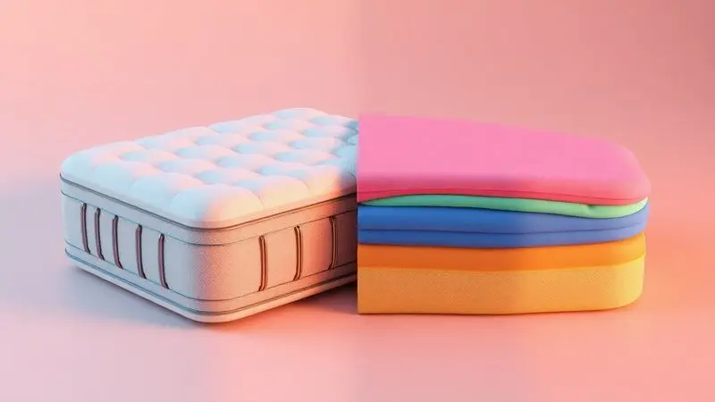
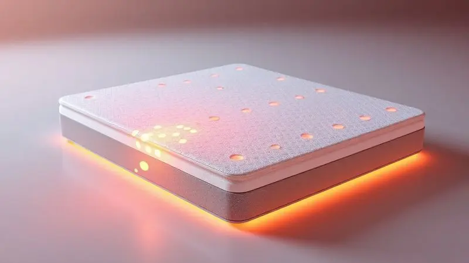
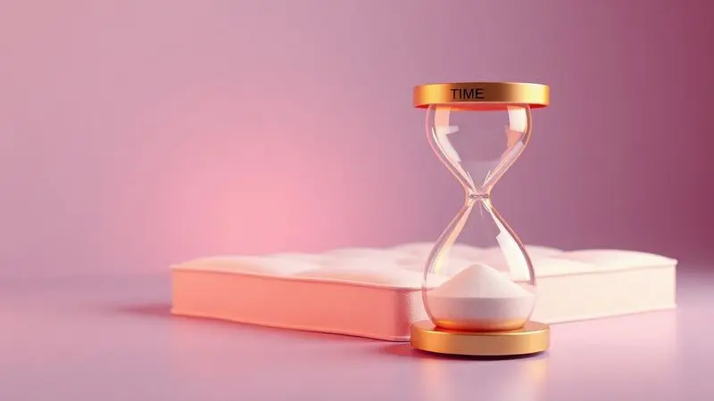

Escolher um colchão novo é muito mais que uma simples compra - é um investimento direto no seu bem-estar. Imagine acordar renovado, sem aquela dor nas costas que te acompanha desde segunda-feira.

Com tantas opções no mercado, encontrar o equilíbrio perfeito entre conforto duradouro, suporte adequado e um preço que não comprometa seu orçamento pode parecer missão impossível.

Este guia foi criado justamente para transformar essa busca em uma jornada tranquila, analisando os melhores colchões custo-benefício disponíveis hoje.

Não estamos falando apenas de produtos, mas de tecnologias que realmente fazem diferença na hora de dormir, desde espumas inteligentes até sistemas de molas que entendem seu corpo.

Selecionamos cuidadosamente as opções que mais se destacam em 2025 para que você tenha acesso a noites verdadeiramente reparadoras, onde cada hora de sono conta a seu favor.

<SummaryList products={frontmatter.top_products} />

## Melhores Colchões em Custo-Benefício para Investir Agora

Quando falamos em custo-benefício no mundo dos colchões, estamos buscando aquela combinação mágica: qualidade que dura anos, conforto que transforma seu sono e um preço que não exige um segundo empréstimo.

É sobre encontrar o ponto ideal onde a tecnologia encontra o bom senso, onde cada real investido retorna em bem-estar.

Esse equilíbrio é possível, e começa entendendo que um bom colchão não é um gasto, mas uma economia em consultas médicas, remédios para dor e dias de trabalho perdidos.

Vamos explorar opções que entendem isso, oferecendo soluções inteligentes para diferentes necessidades e orçamentos.

### 1. Colchão Tungsten da King Koil

<ProductBox 
  title={frontmatter.top_products[0].title} 
  image={frontmatter.top_products[0].image} 
  link={frontmatter.top_products[0].link} 
/>

Se você busca a sensação de luxo sem o preço exorbitante, o Tungsten é como descobrir um tesouro escondido. Seu segredo está nas molas Max Force Pro, que trabalham de forma progressiva - quanto mais pressão, mais suporte elas oferecem.

Isso significa que seu corpo encontra o alinhamento perfeito da coluna de forma natural, sem aquela firmeza excessiva que torna o sono desconfortável. Com capacidade para suportar até 200 kg por pessoa, ele é generoso com diferentes biotipos.

Mas o verdadeiro charme está nos detalhes que transformam a experiência. A camada de espuma com gel infusionado age como um termostato pessoal, regulando a temperatura exatamente onde você precisa.

Já o tecido Dry Fit faz aquela mágica discreta de afastar a umidade do corpo, mantendo você seco e confortável a noite toda.

Sim, ele pede um investimento acima da média, mas quando você calcula quantas noites de sono tranquilo ele proporcionará nos próximos anos, percebe que está comprando paz, não apenas um produto.

<CaixaProsContras>

**Prós:**

- Conforto firme e suporte progressivo

- Tecnologia de controle térmico

- Tecido antialérgico e antiácaro

- Estrutura durável com borda reforçada

**Contras:**

- Preço não é dos mais baixos

- Disponibilidade limitada em alguns tamanhos

</CaixaProsContras>

### 2. Colchão Rubi da King Koil

<ProductBox 
  title={frontmatter.top_products[1].title} 
  image={frontmatter.top_products[1].image} 
  link={frontmatter.top_products[1].link} 
/>

Algumas pessoas não querem escolher entre conforto e suporte - desejam os dois em perfeita harmonia. Para elas, o Rubi apresenta uma proposta encantadora: 27 cm de pura tecnologia pensada para abraçar seu corpo sem afundá-lo.

A combinação de Ultrasoft Foam com Natural Latex cria uma experiência tátil única - macia como um travesseiro de plumas, mas com a resiliência necessária para manter sua coluna alinhada.

O sistema inteligente não para por aí. Enquanto as molas ensacadas cuidam do suporte personalizado, com atenção especial para a zona central da coluna, o tecido Dry Fit trabalha silenciosamente no controle climático.

Esqueça aquela sensação pegajosa nas noites quentes - aqui, a umidade é dissipada antes que você perceba. E para quem sofre com alergias, os tratamentos antiácaro oferecem aquele alívio mental tão importante quanto o físico.

A única ressalva é o sistema Turn-Free - enquanto ele traz praticidade, limita a alternância de lados que alguns preferem para aumentar a longevidade.

<CaixaProsContras>

**Prós:**

- Ótima adaptação ao corpo com Ultrasoft Foam e Natural Latex.

- Tecido Dry Fit que controla a umidade e temperatura.

- Sistema de molas que proporciona suporte personalizado.

- Tratamentos que evitam ácaros e alergias.

**Contras:**

- Não pode ser virado, limitando opções de uso.

- Pode ser um pouco mais pesado para movimentar.

</CaixaProsContras>

### 3. Colchão Bold da Pikolin

<ProductBox 
  title={frontmatter.top_products[2].title} 
  image={frontmatter.top_products[2].image} 
  link={frontmatter.top_products[2].link} 
/>

Para quem acredita que firmeza não precisa ser sinônimo de desconforto, o Bold apresenta uma lição magistral. Integrado à linha Hard System da Pikolin, ele oferece aquele suporte robusto que muitos buscam para alívio de dores, mas com uma inteligência fascinante.

As molas ensacadas individualmente não apenas seguram seu peso - elas conversam entre si, adaptando-se aos seus contornos enquanto isolam os movimentos.

Imagine compartilhar a cama sem virar um alerta sísmico a cada mudança de posição do seu parceiro. Essa é a promessa cumprida pelo Bold, que ainda surpreende com sua capacidade de suportar até 250 kg por pessoa.

O tecido Copper Fabric entra como um aliado silencioso, regulando a temperatura como um climatizador embutido.

As espumas de alta resiliência garantem que, mesmo após anos de uso, o colchão mantenha sua personalidade firme - perfeita para quem precisa de um suporte que não ceda ao primeiro sinal de cansaço.

<CaixaProsContras>

**Prós:**

- Excelente adaptação ao corpo com molas ensacadas.

- Suporta até 250 kg por pessoa.

- Regula a temperatura com tecido Copper Fabric.

- Espumas de alta resiliência para conforto e suporte.

**Contras:**

- A firmeza pode não agradar a todos os perfis de sono.

- Custo pode ser um fator para alguns consumidores.

</CaixaProsContras>

### 4. Colchão Amethyst da King Koil

<ProductBox 
  title={frontmatter.top_products[3].title} 
  image={frontmatter.top_products[3].image} 
  link={frontmatter.top_products[3].link} 
/>

No mundo dos colchões, existe um ponto dourado entre firme e macio que parece feito sob medida para a maioria das pessoas. O Amethyst ocupa esse espaço com elegância, oferecendo 35 cm de conforto intermediário que abraça sem sufocar.

É como encontrar aquele café perfeito - nem muito forte, nem excessivamente suave, apenas equilibrado.

A magia acontece através da combinação estratégica de molas ensacadas que absorvem movimentos como amortecedores de luxo, perfeitos para casais com ritmos de sono diferentes.

Enquanto isso, as espumas de alta performance - incluindo a famosa Memory Foam - trabalham em pontos específicos de pressão, aliviando ombros e quadris como massagistas particulares.

Claro, essa sofisticação tem seu preço, mas quando você considera que está investindo em anos de acordar sem dores, o valor se justifica como um presente para seu futuro eu.

<CaixaProsContras>

**Prós:**

- Conforto intermediário que agrada a maioria dos usuários

- Molas ensacadas que absorvem movimento

- Espumas de alta performance para alívio de pressão

- Tecido de malha nobre que oferece frescor e resistência

**Contras:**

- Preço pode ser elevado em comparação com modelos básicos

- Pode não ser adequado para quem prefere colchões muito firmes

</CaixaProsContras>

### 5. Colchão Cure da Pikolin

<ProductBox 
  title={frontmatter.top_products[4].title} 
  image={frontmatter.top_products[4].image} 
  link={frontmatter.top_products[4].link} 
/>

Alguns produtos parecem entender exatamente o que os casais modernos precisam. O Cure é um desses casos, com seu sistema Cross System que redefiniu o conceito de adaptabilidade.

As molas não apenas suportam - elas dançam em harmonia com dois corpos diferentes, minimizando a transferência de movimento como um isolamento acústico para o sono.

Mas a verdadeira revolução está nos detalhes. A espuma viscoelástica com gel age como uma segunda pele inteligente, aliviando pontos críticos enquanto mantém a temperatura sob controle.

A tecnologia Triple Barrier® oferece aquela paz de espírito que só quem sofre com alergias compreende completamente, criando uma barreira invisível contra ácaros e bactérias.

Sim, seus 33 cm de altura podem desafiar algumas camas mais baixas, mas esse perfil generoso é justamente o que garante o conforto profundo que transforma noites comuns em verdadeiros retiros.

<CaixaProsContras>

**Prós:**

- Conforto ideal para diferentes perfis de sleeper

- Excelente adaptabilidade ao corpo

- Tecnologia que favorece a ventilação

- Tratamento antimicrobiano

**Contras:**

- Altura do colchão pode ser alta para alguns

- Pode não se adequar a todos os estilos de cama

</CaixaProsContras>

### 6. Colchão Espuma Diamante - Orthocrin

<ProductBox 
  title={frontmatter.top_products[5].title} 
  image={frontmatter.top_products[5].image} 
  link={frontmatter.top_products[5].link} 
/>

Às vezes, a simplicidade esconde uma sabedoria profunda. O Espuma Diamante da Orthocrin é a prova viva disso, apostando em uma espuma de alta densidade D33 que oferece a firmeza que muitas colunas pedem.

Não é sobre rigidez excessiva, mas sobre um suporte consistente que mantém sua postura alinhada hora após hora.

A beleza está na sua versatilidade inteligente. Com dupla face utilizável, ele dobra sua vida útil de forma prática, como ter dois colchões pelo preço de um.

O tecido que combina poliéster e algodão oferece aquele toque familiar e confortável, enquanto os tratamentos antiácaro e antifungo trabalham nos bastidores pela sua saúde. Para quem prefere algo ainda mais robusto, a versão D45 suporta até 150 kg.

Este não é o colchão da moda passageira - é a escolha sensata de quem valoriza firmeza que dura.

<CaixaProsContras>

**Prós:**

- Conforto firme e bom suporte para a coluna.

- Fabricado com espuma de alta densidade D33.

- Dupla face, aumentando a durabilidade.

- Tecido tratado contra ácaros e fungos.

**Contras:**

- Não é indicado para quem prefere supermaciez.

- Suporta até 100 kg por pessoa na versão D33.

</CaixaProsContras>

### 7. Colchão Espuma Sleep Max - Castor

<ProductBox 
  title={frontmatter.top_products[6].title} 
  image={frontmatter.top_products[6].image} 
  link={frontmatter.top_products[6].link} 
/>

Por que se contentar com uma opção quando você pode ter um cardápio de densidades?

O Sleep Max da Castor entende que cada corpo tem suas preferências, oferecendo variações D45, D33 e D26 que atendem desde quem busca firmeza terapêutica até quem deseja um aconchego mais generoso.

O modelo D45 é para aqueles dias (e noites) em que você precisa de uma base sólida, suportando até 150 kg com dignidade.

Já o D33 encontra o equilíbrio perfeito para quem não quer extremos, especialmente quando acompanhado do Pillow Top Double Face que prolonga a sensação de novidade. Os tratamentos antiácaros e a cobertura de malha 3D criam um ecossistema saudável onde seu sono floresce.

A variedade pode parecer confusa à primeira vista, mas é justamente essa personalização que permite encontrar exatamente o que seu corpo pede.

<CaixaProsContras>

**Prós:**

- Diversas opções de densidade que atendem a diferentes necessidades.

- Tratamento antiácaro e proteção contra fungos e bactérias.

- Boa durabilidade, especialmente com o uso de Pillow Top.

- Suporta pesos consideráveis, sendo ideal para diversas configurações de uso.

**Contras:**

- Modelos mais firmes podem não agradar a quem prefere colchões macios.

- A variedade de densidades pode confundir na hora da escolha.

</CaixaProsContras>

### 8. Colchão de Molas Spain Herval

<ProductBox 
  title={frontmatter.top_products[7].title} 
  image={frontmatter.top_products[7].image} 
  link={frontmatter.top_products[7].link} 
/>

Há uma beleza clássica nas soluções que funcionam há gerações, mas com um toque moderno. O Spain Herval mantém a tradição das molas de aço entrelaçadas do sistema Maxspring, mas com uma inteligência atualizada.

Em vez de molas isoladas, imagine um bloco único que se adapta como uma rede inteligente, contornando seu corpo com precisão.

O tecido Airmesh é o herói discreto dessa história, promovendo uma circulação de ar que previne aquele abafamento indesejado. A camada de espuma D20 acrescenta um toque de maciez sem comprometer a estrutura, criando uma sensação acolhedora desde o primeiro contato.

O Pillow Top One Side pode limitar a possibilidade de virar, mas para quem valoriza praticidade, essa característica se transforma em vantagem. Disponível em diversos tamanhos, ele se adapta não apenas ao seu corpo, mas ao seu espaço também.

<CaixaProsContras>

**Prós:**

- Sistema de molas que oferece ótima adaptação ao corpo.

- Tecido Airmesh que melhora a ventilação.

- Revestimento com espuma D20 para maior conforto.

- Versões em diversos tamanhos, aumentando as opções para o consumidor.

**Contras:**

- Não pode ser virado, apenas girado periodicamente.

- Pode não ser ideal para quem prefere colchões mais firmes.

</CaixaProsContras>

## ✅ Conclusão: Qual o melhor colchão entre 2 a 5 mil reais?

Ao navegar pela faixa dos 2 aos 5 mil reais, você está no território onde qualidade e inteligência financeira se encontram. É aqui que as tecnologias começam a fazer diferença real no seu sono, mas sem os exageros de preço dos modelos premium.

Dos oito colchões que exploramos, vários se encaixam perfeitamente nesse orçamento, oferecendo desde o conforto intermediário do Amethyst até a firmeza terapêutica do Espuma Diamante.

O segredo não está apenas no preço, mas em como cada real investido retorna em bem-estar.

Lembre-se: o melhor colchão é aquele que conversa com seu corpo. Antes de decidir, experimente. Sinta como cada modelo responde aos seus movimentos, como suporta seus pontos de pressão.

Procure por garantias generosas e políticas de devolução que ofereçam um colchão de segurança para sua compra. Afinal, você não está apenas escolhendo um produto - está escolhendo como passará um terço da sua vida nos próximos anos.

Que sejam horas de verdadeiro descanso, onde cada acordar seja uma renovação, não um desafio.

## Como escolher o melhor colchão casal de 2025

Escolher um colchão para casal é como encontrar o tom perfeito em uma música a duas vozes - precisa harmonizar necessidades diferentes.

Em 2025, esse equilíbrio se torna mais acessível graças a tecnologias que entendem que duas pessoas na mesma cama podem ter exigências opostas. Comece observando não apenas o material, mas como ele responde ao movimento.

Um parceiro que vira frequentemente à noite precisa de um sistema que isole esse movimento, enquanto quem sofre com dores nas costas busca suporte específico.

Avalie também as garantias e políticas de teste - muitas marcas agora entendem que 15 minutos na loja não substituem uma semana de sono real.

### Escolha um dos tipos de melhores colchões

Cada tipo de colchão tem sua personalidade, como diferentes estilos de música. Os de espuma viscoelástica são os jazz - adaptáveis, sensíveis aos seus contornos, perfeitos para quem busca alívio imediato de pressão.

Já os de látex têm o ritmo do blues: duráveis, com uma resiliência que perdura, oferecendo firmeza constante. Os modelos de molas são o rock'n'roll - energéticos no suporte, com uma ventilação que mantém tudo fresco.

E para alérgicos, os hipoalergênicos são a música clássica: refinados, seguros, criando um ambiente puro. Sua missão é descobrir qual melodia faz seu corpo relaxar completamente.

## Como escolher entre colchão de molas e de espuma?

Essa escolha lembra decidir entre dois bons amigos com personalidades distintas.

Os colchões de molas são como aquele amigo estruturado: oferecem suporte firme e uma ventilação natural que evita aquela sensação abafada, perfeitos para quem sente calor fácil ou prefere uma base mais definida.

Já os de espuma são o amigo acolhedor: adaptam-se aos seus contornos, aliviando pressões como um abraço personalizado, ideais para quem busca conforto imediato e isolamento de movimento.

Sua decisão deve partir de uma pergunta simples: o que seu corpo pede quando você deita? Se acorda com pontos doloridos que precisam de alívio, a espuma pode ser seu aliado.

Se busca frescor e uma sensação de "flutuar" sem afundar, as molas talvez conversem melhor com você. E lembre-se: tecnologias híbridas existem justamente para quem não quer escolher.

## Qual a desvantagem do colchão de mola?

Mesmo os melhores amigos têm seus momentos desafiadores. Com os colchões de mola, o principal ponto de atenção é a transferência de movimento - imagine que cada virada do seu parceiro se transforme em uma pequena onda que atravessa a cama.

Para quem tem sono leve, isso pode significar noites fragmentadas. Além disso, algumas versões tradicionais podem não oferecer o mesmo contorno personalizado das espumas modernas, criando pontos de pressão onde seu corpo precisa de alívio.

Mas aqui está o segredo: as tecnologias evoluíram. Molas ensacadas individualmente minimizam drasticamente essa transferência, enquanto sistemas zonados oferecem suporte específico para áreas críticas.

A chave está em escolher não qualquer colchão de mola, mas aquele que entende os desafios do sono compartilhado.

## O que significa a densidade da espuma?

Pense na densidade como a personalidade da espuma. Medida em quilos por metro cúbico (kg/m³), ela revela quanto material existe em determinado espaço.

Espumas de alta densidade (como D33 ou D45) são como pessoas de presença marcante: oferecem suporte consistente, mantêm sua forma por anos e criam uma base firme que respeita sua coluna.

Já as de densidade mais baixa são mais descontraídas: acolhem com maciez imediata, mas podem ceder ao charme do tempo mais rapidamente.

Escolher a densidade certa é como encontrar o parceiro de dança perfeito: precisa haver compatibilidade. Seu peso, sua posição de sono e suas necessidades específicas ditam qual número no final do "D" fará seu corpo agradecer todas as manhãs.

## Diferença entre o tamanho dos colchões

Os tamanhos dos colchões são como diferentes espaços de convivência. O solteiro (88x188 cm) é seu apartamento compacto - eficiente, pessoal, perfeito para quem dorme sozinho.

O casal (138x188 cm) é o apartamento de dois quartos - espaço suficiente para coexistir, mas onde um movimento noturno ainda pode ser percebido.

O queen e o king são as casas com jardim: espaço generoso para esticar-se, virar-se, encontrar sua posição perfeita sem negociar território.

A escolha vai além das medidas. Considere não apenas o espaço do quarto, mas o espaço que seu sono precisa. Casais que buscam independência noturna encontram no king a liberdade de dois solteiros que escolhem dormir juntos. Já o queen oferece proximidade sem sufoco.

Meça seu quarto, sim, mas meça também sua necessidade de liberdade.

## Qual é o melhor colchão para a coluna?

O melhor colchão para sua coluna é aquele que age como um terapeuta silencioso durante a noite. Não é sobre firmeza extrema ou maciez excessiva, mas sobre um equilíbrio inteligente que mantém suas curvaturas naturais alinhadas enquanto você descansa.

Colchões com memória, látex ou molas ensacadas são excelentes candidatos porque entendem que sua coluna lombar precisa de um suporte diferente da cervical.

Imagine sua coluna como uma corda delicada que precisa de apoio em pontos específicos. Um colchão muito mole deixa essa corda curvar-se indevidamente; um muito rígido a força contra uma superfície plana.

O ideal é o que se adapta, que oferece resistência onde necessário e cedência onde apropriado. Seu peso e posição de sono (de lado, barriga ou costas) ditam qual tecnologia conversará melhor com suas vértebras.

## Com que frequência devo trocar meu colchão?

Seu colchão tem uma linguagem silenciosa para dizer quando está cansado. A regra geral de 7 a 10 anos é um bom ponto de partida, mas como pessoas, os colchões envelhecem em ritmos diferentes.

Os de espuma e látex tendem a ser os sábios anciãos - mantêm sua sabedoria (e forma) por mais tempo. Já os de molas podem começar a mostrar desgaste mais cedo, especialmente se compartilhados.

Além do calendário, aprenda a ler os sinais: acorda com mais dores do que antes? O colchão parece ter vales onde antes era plano? Alergias que pareciam controladas voltaram a incomodar? Esses são os sussurros dizendo que talvez seja hora de renovar o convívio.

Trocar antes que o desconforto se torne crônico é um investimento em saúde que retorna em energia.

## Perguntas frequentes sobre o melhor colchão casal 2025

As dúvidas que surgem ao escolher um colchão casal são como faróis indicando o caminho para uma decisão acertada. Em 2025, com tantas inovações, é natural questionar-se sobre durabilidade, compatibilidade e tecnologias que realmente valem o investimento.

Cada pergunta é uma oportunidade de aproximar-se da escolha que transformará suas noites em verdadeiros santuários de descanso.

### Qual é a melhor marca de colchão casal?

Marcas são como famílias - cada uma tem sua personalidade e valores. A Ortobom é a família tradicional que nunca decepciona, com qualidade consistente e variedade que atende a diferentes gostos.

A Americanflex é a família inovadora, trazendo tecnologias como a espuma viscoelástica que se adapta como uma segunda pele. Já a King Koil é a família premium, onde cada detalhe é pensado para oferecer uma experiência de sono excepcional.

Mas a verdadeira resposta está em qual família conversa com sua maneira de dormir. Experimentar é o único jeito de descobrir se os valores da marca se traduzem em conforto real para seu corpo.

Afinal, o melhor colchão não é o mais caro ou o mais tecnológico - é aquele que faz você esquecer que está deitado em algo.

### Quanto custa um bom colchão de casal?

Um bom colchão de casal custa exatamente o valor que transforma seu sono de obrigatório em prazeroso. Na prática, isso varia como o preço de um bom jantar: depende do restaurante, do menu e da experiência que você busca.

Em termos mais concretos, espere encontrar qualidade real começando na faixa intermediária, onde as tecnologias deixam de ser acessórios e tornam-se essenciais.

Pense nisso como um investimento em saúde compartilhada. Um pouco mais investido pode significar anos de acordar sem dores, noites sem interrupções e manhãs mais produtivas para ambos.

O custo se dilui nas milhares de horas de descanso que você terá, transformando o preço em centavos por noite de sono tranquilo - provavelmente o melhor custo-benefício que você encontrará para sua qualidade de vida.