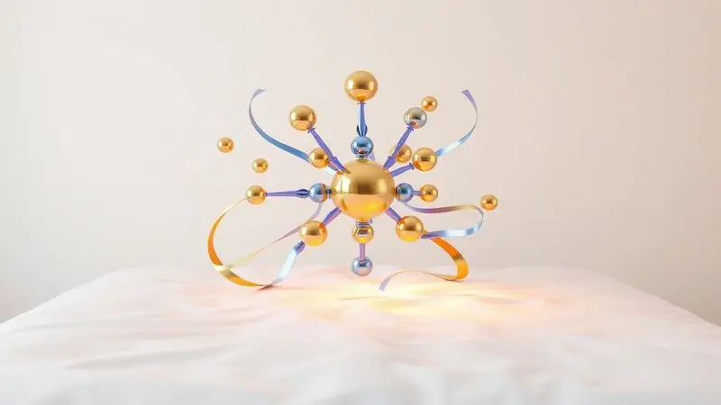
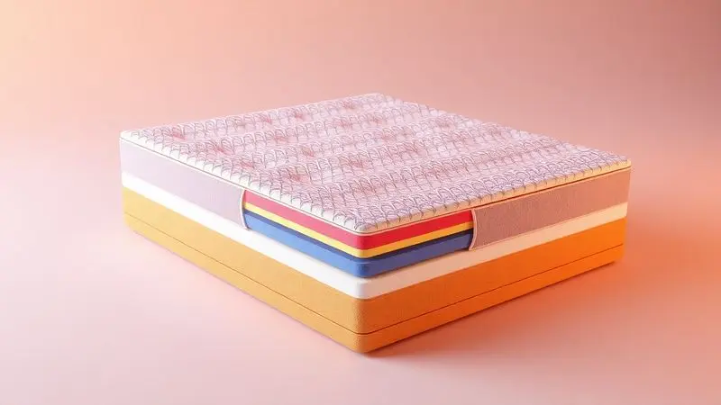
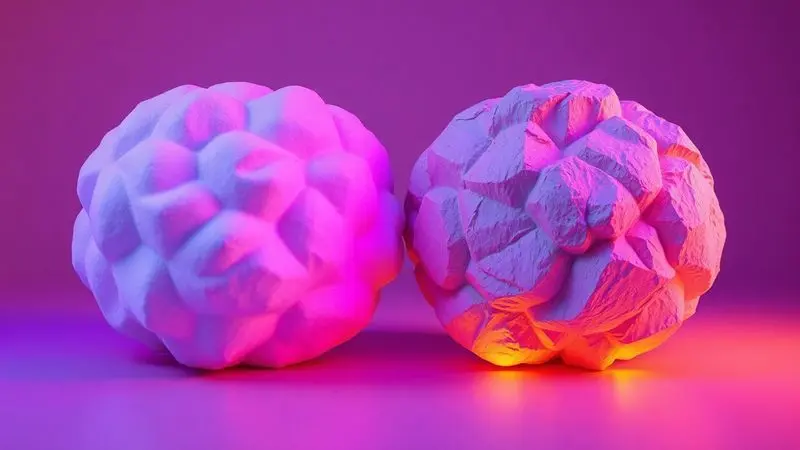

Imagine deitar-se à noite e sentir seu corpo se derreter em um abraço perfeito de conforto. Este não é um sonho distante, mas uma realidade que começa com a escolha certa do colchão.

Com tantas opções disponíveis no mercado brasileiro, desde os tradicionais com décadas de história até as inovações tecnológicas que chegam em caixas compactas, encontrar a marca que realmente entenda seu sono pode ser um desafio.

Para transformar essa procura em uma busca certeira, analisamos profundamente as melhores marcas de 2025. Preparado para encontrar sua paz noturna?

<SummaryList products={frontmatter.top_products} />

## Ranking das Melhores Marcas de Colchões para 2025

### 1. Castor

<ProductBox 
  title={frontmatter.top_products[0].title} 
  image={frontmatter.top_products[0].image} 
  link={frontmatter.top_products[0].link} 
/>

Quando seu avô escolhia um colchão nos anos 60, ele provavelmente já reconhecia a qualidade da Castor.

Hoje, com mais de seis décadas de experiência, a marca brasileira não apenas mantém essa tradição como a eleva ao ganhar o 1º lugar no Prêmio Reclame Aqui em Colchões para Grandes Operações.

Imagine um suporte que conhece cada curva do seu corpo: as molas Pocket® trabalham individualmente, como dedos cuidadosos que sustentam sem pressionar. Tecnologias como ventilação inteligente e tratamento antiácaro transformam seu repouso em um santuário de bem-estar.

O Casal Sleep Max oferece aquela firmeza reconfortante para quem precisa de estrutura, enquanto o Silver Star Híbrido Air equilibra suporte robusto com um toque mais generoso. Você investe não apenas em um produto, mas em seis gerações de expertise brasileira.

<CaixaProsContras>

**Prós:**

- Mais de 60 anos de experiência em colchões.

- Diversidade de modelos e tecnologias disponíveis.

- Alta reputação em atendimento ao cliente.

- Opções sustentáveis na linha Green Star®.

**Contras:**

- Algumas opções premium podem ser consideradas caras.

- A variedade de modelos pode ser confusa para novos compradores.

</CaixaProsContras>

### 2. Emma Colchões

<ProductBox 
  title={frontmatter.top_products[1].title} 
  image={frontmatter.top_products[1].image} 
  link={frontmatter.top_products[1].link} 
/>

Se a Castor representa tradição, a Emma personifica inovação inteligente. O Emma Original não acumula prêmios por acaso: suas três camadas de espuma conversam entre si para oferecer exatamente a combinação de firmeza e acolhimento que seu corpo procura.

Enquanto você dorme, a tecnologia Airgocell trabalha como um sistema de climatização pessoal, mantendo a temperatura ideal sem que você precise sequer pensar nisso. A verdadeira revolução, porém, está nos 100 dias de teste.

Você pode conhecer esse colchão como quem passa a morar em uma nova casa antes de comprá-la, sentindo como ele se adapta às suas noites.

Alguns encontram nele uma firmeza que surpreende, mas para muitos, essa estrutura se revela o suporte que faltava para dormir realmente renovado.

<CaixaProsContras>

**Prós:**

- Conforto e suporte adequados para diversas posições de dormir.

- Tecnologia de regulação térmica, que evita superaquecimento.

- Período de teste de 100 noites, com opções de devolução fácil.

- Garantia de 10 anos, proporcionando segurança na compra.

**Contras:**

- Pode ser um pouco firme demais para quem prefere colchões muito macios.

- Experiências variadas com o serviço de entrega e atendimento ao cliente.

</CaixaProsContras>

### 3. Ortobom

<ProductBox 
  title={frontmatter.top_products[2].title} 
  image={frontmatter.top_products[2].image} 
  link={frontmatter.top_products[2].link} 
/>

Mais de 56 anos ensinam que conforto não é uma receita única. A Ortobom domina essa sabedoria oferecendo desde modelos de molas ensacadas até espumas que parecem feitas sob medida.

Para casais, a tecnologia de suporte individualizado cria uma fronteira invisível de conforto: você movimenta-se livremente sem enviar ondas de perturbação para o outro lado da cama.

A Airtech transforma cada respiração do colchão em um sopro fresco, enquanto a praticidade da tecnologia One Face elimina aquela tarefa mensal de virar o colchão.

Entender que qualidade tem seu valor faz parte da equação, mas quando você experimenta o sono que eles proporcionam, o investimento se traduz em noites genuinamente revigorantes.

<CaixaProsContras>

**Prós:**

- Variedade de modelos ajustados para diferentes necessidades.

- Tecnologias inovadoras que melhoram o conforto e a durabilidade.

- Colchões com suporte individualizado para casais.

- Compromisso com sustentabilidade e responsabilidade social.

**Contras:**

- Algumas opções podem ser mais caras em comparação a concorrentes.

- Pode não atender todos os orçamentos disponíveis.

</CaixaProsContras>

### 4. Gazin

<ProductBox 
  title={frontmatter.top_products[3].title} 
  image={frontmatter.top_products[3].image} 
  link={frontmatter.top_products[3].link} 
/>

O que acontece quando uma marca decide que seu colchão deve ser um companheiro para todas as fases da vida? Você encontra a Gazin.

Dos modelos mais acessíveis aos que suportam solidamente 120 kg por pessoa, como o Queen Size Pérola Negra, há uma compreensão profunda de que corpos diferentes exigem apoios distintos.

A sustentabilidade deixa de ser um adicional para se tornar parte da essência, com materiais ecológicos que fazem você dormir bem consigo mesmo e com o planeta.

Essa consciência e qualidade vêm com uma fatura que reflete o valor oferecido, mas para quem busca um investimento de longo prazo em bem-estar, cada real se converte em tranquilidade noturna.

<CaixaProsContras>

**Prós:**

- Variedade de modelos para todos os perfis.

- Tecnologia avançada em conforto e suporte.

- Uso de materiais sustentáveis na fabricação.

- Opções para diferentes faixas de peso e necessidades.

**Contras:**

- Preços geralmente mais altos em comparação com outras marcas.

- Alguns modelos podem parecer pesados para manuseio.

</CaixaProsContras>

### 5. Orthocrin

<ProductBox 
  title={frontmatter.top_products[4].title} 
  image={frontmatter.top_products[4].image} 
  link={frontmatter.top_products[4].link} 
/>

Meio século fabricando colchões no Brasil ensina que certificações como Inmetro e Iner não são selos, são promessas cumpridas.

A Orthocrin transforma essa experiência em uma gama que vai desde as espumas mais familiares até as tecnologias de molas que parecem entender seu biótipo.

O Serenity Visco Euro Pillow e o Splendor não são apenas nomes, são convites para um repouso personalizado onde seu corpo encontra seu lugar perfeito.

A variedade de preços reflete essa amplitude de opções, mas quando você experimenta a durabilidade que resiste a anos de descanso, percebe que investiu não em um produto, mas em milhares de noites bem dormidas.

<CaixaProsContras>

**Prós:**

- Variedade de opções de colchões (espuma, molas, ortopédicos)

- Certificações que atestam a qualidade dos produtos

- Modelos específicos para crianças, promovendo saúde e conforto

- Boa reputação entre os consumidores quanto ao conforto e durabilidade

**Contras:**

- Preços que podem ser mais elevados em alguns modelos

- Alguns usuários relatam que a firmeza pode não agradar a todos

</CaixaProsContras>

### 6. Probel Colchões

<ProductBox 
  title={frontmatter.top_products[5].title} 
  image={frontmatter.top_products[5].image} 
  link={frontmatter.top_products[5].link} 
/>

Desde 1940, a Probel aprendeu que um colchão não é um móvel, é um parceiro de descanso.

Essa filosofia se materializa em opções que se adaptam não apenas a biotipos, mas a histórias de vida: desde o solteiro que acaba de ganhar independência até a família que compartilha momentos king size.

Os conjuntos completos com box, travesseiros e protetores revelam uma compreensão holística do que significa preparar um santuário do sono. A durabilidade de 8 a 10 anos não é uma especulação, é um compromisso testado pelo tempo.

Você pode encontrar opções mais econômicas, mas o conforto que se mantém ano após ano transforma essa escolha em uma parceria de longo prazo com seu bem-estar.

<CaixaProsContras>

**Prós:**

- Variedade de modelos para diferentes biotipos.

- Produtos com boa durabilidade.

- Presença em várias lojas e no comércio online.

- Certificação de qualidade pelo INMETRO.

**Contras:**

- Não é a opção mais barata do mercado.

- Algumas linhas podem ser mais básicas em termos de recursos.

</CaixaProsContras>

### 7. Luuna

<ProductBox 
  title={frontmatter.top_products[6].title} 
  image={frontmatter.top_products[6].image} 
  link={frontmatter.top_products[6].link} 
/>

Imagine um menu de restaurante estrelado, mas para o seu sono. A Luuna oferece essa experiência gourmet do repouso, onde cada modelo responde a uma necessidade específica com precisão cirúrgica.

O Original equilibra firmeza e frescor como um equilíbrista experiente, o Blue alivia pressões como massagem noturna, e o Support sustenta com a segurança de quem nunca vacila.

Para os momentos de luxo merecido, o Supreme envolve em suavidade, enquanto o One dissipa calor com tecnologia que parece saída de um filme de ficção científica.

Essa sofisticação tem seu preço, é verdade, mas quando você entende que está investindo em engenharia do descanso, cada real se justifica na primeira manhã em que acorda sem dores.

<CaixaProsContras>

**Prós:**

- Variedade de modelos para diferentes preferências e pesos
2- Tecnologias avançadas para conforto e suporte

- Boa regulação da temperatura em muitos modelos

- Disponibilidade de acessórios complementares

**Contras:**

- Preço pode ser mais alto do que concorrentes

- Alguns modelos podem ser mais suaves do que o esperado para quem prefere firmeza

</CaixaProsContras>

### 8. Anjos

<ProductBox 
  title={frontmatter.top_products[7].title} 
  image={frontmatter.top_products[7].image} 
  link={frontmatter.top_products[7].link} 
/>

Uma variedade tão generosa que parece um catálogo de possibilidades para o seu repouso.

A Anjos Colchões entrega desde o suporte extra firme do Star até o conforto maximizado do MasterPocket, sempre com a elegância de quem sabe que o toque importa tanto quanto a estrutura.

O Versalhes prova que sofisticação e conforto podem dançar juntos, oferecendo materiais que acariciam a pele enquanto sustentam a postura.

Essa abundância de opções pode, inicialmente, parecer um labirinto, mas quando você encontra seu modelo ideal, percebe que estava navegando não em confusão, mas em um oceano de possibilidades personalizadas para sua noite perfeita.

<CaixaProsContras>

**Prós:**

- Variedade de modelos e tamanhos para atender diferentes preferências

- Utiliza tecnologia de molas ensacadas para melhor suporte

- Acabamento de alta qualidade e materiais duráveis

 - Opções com diferentes níveis de firmeza para conforto personalizado

**Contras:**

- Pode haver confusão devido à grande variedade de modelos 

- Alguns modelos têm foco em conforto firme, que pode não agradar a todos

</CaixaProsContras>

### 9. Herval

<ProductBox 
  title={frontmatter.top_products[8].title} 
  image={frontmatter.top_products[8].image} 
  link={frontmatter.top_products[8].link} 
/>

Inovar não significa apenas criar algo novo, mas reinventar o próprio conceito de descanso. Na Movelsul 2025, a Herval apresentou essa filosofia com cerca de 10 novos modelos que parecem saídos do futuro próximo.

A linha Art suporta 250 kg com a leveza de quem carrega apenas confiança, enquanto o ecolátex oferece durabilidade que respeita o planeta. A Linha Idea traz o calmante do aloe vera para seu sono, e a Vivere combina firmeza com a frescura natural do bambu.

O compromisso com materiais como EcoSpuma e malha ecológica faz de cada noite um ato de consciência ambiental.

Alguns relatos de deformações lembram que perfeição é uma jornada, não um destino, mas os elogios à durabilidade mostram que a estrada está sendo bem pavimentada.

<CaixaProsContras>

**Prós:**

- Inovações tecnológicas em suporte e conforto.

- Variedade de modelos adaptados a diferentes necessidades.

- Compromisso com materiais sustentáveis.

- Boa reputação e durabilidade em muitos produtos.

**Contras:**

- Algumas reclamações sobre qualidade e deformações.

- Preço pode ser superior a opções básicas no mercado.

</CaixaProsContras>

## Quais critérios usamos para listar essas marcas?

Escolher as marcas que realmente merecem sua confiança foi um processo que misturou ciência e sensibilidade. A reputação não foi medida apenas em anos de mercado, mas na voz genuína dos usuários que compartilham suas noites transformadas.

A variedade de produtos passou pelo crivo da diversidade real: cada pessoa dorme de um jeito, e as marcas precisam entender essa individualidade. Os materiais foram avaliados não como componentes técnicos, mas como parceiros silenciosos do seu descanso.

Por fim, garantias e políticas de devolução foram enxergadas como promessas de segurança, aquela tranquilidade que permite experimentar um colchão sabendo que há um porto seguro se não for amor à primeira noite.

## Como Escolher o Colchão Adequado para o Seu Peso?

Seu corpo conversa com o colchão em uma linguagem de pressão e apoio. Para quem tem estrutura mais leve, colchões macios como os de espuma oferecem um abraço gentil que contorna sem sufocar.

Já corpos com mais presença encontram em modelos firmes de molas ou espumas densas a estabilidade que evita afundamentos, como se o colchão dissesse 'eu te seguro' com confiança.

A durabilidade do material é sua garantia de que esse diálogo continuará harmonioso por anos. O verdadeiro teste, porém, acontece quando você se deita e sente: essa conversa entre seu corpo e o colchão soa como poesia ou como ruído?

## Qual o Melhor Colchão para Dor nas Costas?

Acordar sem aquela sensação de que dormiu sobre pedras começa com um colchão que entende que suporte não é rigidez, é inteligência postural.

A espuma viscoelástica trabalha como um escultor noturno, moldando-se às suas curvas enquanto mantém a coluna em seu eixo natural. Os modelos híbridos oferecem o melhor dos dois mundos: a adaptabilidade da espuma com a resiliência das molas.

A firmeza média funciona como aquele amigo que sabe quando ser firme e quando ceder, criando o equilíbrio perfeito para aliviar pontos de pressão. Experimentar o colchão não é um formalidade, é ouvir seu corpo dizer 'sim' antes que sua mente racionalize a escolha.

## Qual o Colchão Mais Macio, D28 ou D33?

A densidade é a personalidade do colchão. O D28 é o amigo acolhedor que recebe você com um afundar suave como em uma nuvem pessoal, ideal para quem busca a sensação de ser envolvido.

O D33 é o parceiro estruturado que oferece apoio firme como um abraço que sustenta sem esmagar, perfeito para quem precisa de mais contenção ou carrega um peso maior.

Sua escolha não é sobre números, é sobre como você quer se sentir ao fechar os olhos: flutuando em maciez ou apoiado em segurança consistente.

## Perguntas Frequentes sobre Marcas de Colchão

As dúvidas que surgem quando você está prestes a escolher onde passará um terço da sua vida são mais do que perguntas, são portas de entrada para o descanso perfeito.

A diferença entre molas, espuma e látex não está nos materiais, mas nas sensações que criam: cada um toca seu corpo em um idioma diferente de conforto.

A durabilidade de 8 a 10 anos não é um número mágico, é um compromisso que depende tanto da qualidade do produto quanto do cuidado que você oferece.

Testar um colchão por 15 minutos não é um ritual burocrático, é dar tempo para seu corpo sussurrar sua preferência verdadeira, aquela que sua mente racional poderia ignorar.

## Conclusão

Escolher um colchão em 2025 deixou de ser uma compra para se transformar em uma jornada de autoconhecimento. Das tradições consagradas da Castor às inovações ousadas da Herval, cada marca oferece não apenas uma superfície para dormir, mas uma filosofia de descanso.

A diferença entre D28 e D33 não está na densidade, mas na pergunta: 'Como meu corpo quer ser recebido ao deitar?' As tecnologias antiácaro, as garantias estendidas, os períodos de teste generosos são mais que benefícios.

São convites para experimentar o conforto com a segurança de saber que há espaço para corrigir a rota.

Você não está escolhendo espumas, molas ou densidades. Está selecionando o cenário onde seus sonhos acontecerão, o palco onde seu corpo se recuperará, o santuário onde seu mental encontrará paz.

As melhores marcas entendem que vendem mais que produtos: oferecem transformação noturna. Agora, com essa compreensão em mãos, resta apenas permitir-se fechar os olhos confiante de que sua próxima noite será tão única quanto você merece.

Seu descanso perfeito começa quando você decide que merece mais do que apenas dormir, merece renascer a cada amanhecer.