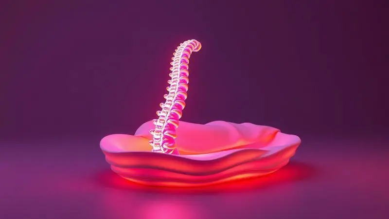

Acordar com aquela dor incômoda nas costas é algo que conhece bem quem convive com bico de papagaio ou hérnia de disco.

O simples ato de levantar da cama pode já começar o dia com desconforto, e muitas vezes a origem está justamente onde você menos espera: na superfície onde repousa todas as noites.

Escolher o colchão certo vai muito além do conforto momentâneo - é uma decisão que molda a qualidade do seu sono, a saúde da sua coluna e sua disposição para enfrentar o dia seguinte.

Não se trata apenas de encontrar uma cama macia ou firme, mas de descobrir qual tecnologia, material e densidade conversam diretamente com a anatomia da sua coluna.

Este artigo não é apenas uma lista de opções, mas um guia para transformar suas noites em momentos verdadeiramente reparadores, começando pela base que sustenta cada um dos seus movimentos durante o sono.

<SummaryList products={frontmatter.top_products} />

## Os Melhores Tipos de Colchão para Quem Tem Problemas na Coluna

Quando a coluna pede atenção especial, alguns materiais se destacam por entender essa necessidade.

Colchões ortopédicos e de espuma viscoelástica não são apenas tendências, mas soluções que oferecem suporte inteligente e alinhamento cuidadoso, transformando o sono em uma terapia silenciosa para suas vértebras.

### 1. Colchão de Molas Ensacadas

<ProductBox 
  title={frontmatter.top_products[0].title} 
  image={frontmatter.top_products[0].image} 
  link={frontmatter.top_products[0].link} 
/>

Imagine um sistema onde cada mola trabalha independentemente, respondendo apenas ao peso que recebe. É essa precisão que define os colchões de molas ensacadas em 2025, oferecendo um suporte que se adapta literalmente a cada curva do seu corpo.

Essa tecnologia individualizada significa que o movimento do seu parceiro não se transforma em pequenos terremotos no seu lado da cama, garantindo que ambos possam encontrar sua posição ideal sem interferências.

Modelos como o Gazin New York, com seu Euro Pillow Top que adiciona uma camada extra de conforto, e o Castor Pocket Silver Star Air, que une design elegante à funcionalidade, estão redefinindo o que esperamos de um suporte noturno.

A ventilação superior desses modelos age como um sistema de climatização natural, mantendo a temperatura equilibrada durante toda a noite - algo valioso quando as dores tendem a piorar com o excesso de calor.

<CaixaProsContras>

**Prós:**

- Suporte individualizado que se adapta ao corpo.

- Minimiza a transferência de movimento entre parceiros.

- Melhora a ventilação e regulação da temperatura.

- Geralmente mais duráveis do que colchões de espuma.

**Contras:**

- Tendem a ser mais caros.

- Pode não ser ideal para quem prefere um colchão bem firme.

</CaixaProsContras>

### 2. Colchão de Espuma de Alta Densidade

<ProductBox 
  title={frontmatter.top_products[1].title} 
  image={frontmatter.top_products[1].image} 
  link={frontmatter.top_products[1].link} 
/>

Para quem precisa de um abraço firme que não cede com o tempo, a espuma de alta densidade se apresenta como uma aliada da coluna.

Feita de poliuretano cuidadosamente desenvolvido, esse material não apenas se molda ao seu corpo, mas mantém essa memória noite após noite, oferecendo sempre o mesmo suporte consistente.

A magia está nos detalhes técnicos: quando falamos em densidades entre D20 e D45, estamos realmente falando sobre diferentes níveis de firmeza que abraçam sua anatomia.

Acima de D33, a espuma oferece aquele suporte mais estruturado que sua coluna agradece ao acordar, especialmente se você convive com bico de papagaio.

O investimento inicial pode ser maior, mas pense nisso como pagar antecipadamente por anos de acordar sem aquela rigidez matinal que parece grudada nas suas costas.

<CaixaProsContras>

**Prós:**

- Oferece excelente suporte e conforto.

- Aumenta a durabilidade do produto.

- Ideal para quem sofre de dores nas costas.

- Ajuda no alinhamento correto da coluna.

**Contras:**

- Pode ter um preço mais elevado em comparação a modelos de baixa densidade.

- A escolha errada da densidade pode afetar o conforto.

</CaixaProsContras>

### 3. Colchão Ortopédico

<ProductBox 
  title={frontmatter.top_products[2].title} 
  image={frontmatter.top_products[2].image} 
  link={frontmatter.top_products[2].link} 
/>

Existe uma diferença entre um colchão firme e um verdadeiramente ortopédico. Enquanto o primeiro pode apenas ser duro, o segundo entende que a coluna precisa de suporte estratégico, distribuindo o peso de forma inteligente para manter cada vértebra em seu lugar natural.

Para quem convive com bico de papagaio, essa precisão na distribuição de peso pode significar a diferença entre acordar renovado ou dolorido.

Em 2025, modelos como o Emma Original com sua espuma Airgocell transformam a respirabilidade em conforto, enquanto o Ortobom Physical Ultra Resistente prova que suporte de qualidade pode ser acessível.

A firmeza inicial pode surpreender quem está acostumado a colchões mais macios, mas é exatamente essa característica que permite à coluna descansar em sua posição neutra, sem forçar articulações já sensíveis.

<CaixaProsContras>

**Prós:**

- Oferece suporte adequado para a coluna.

- Ajuda a aliviar dores nas costas.

- Mantém o alinhamento natural da coluna.

- Disponível em diversos modelos e densidades.

**Contras:**

- Pode ser considerado duro por alguns usuários.

- Exige adaptação inicial à firmeza.

</CaixaProsContras>

### 4. Colchão de Látex

<ProductBox 
  title={frontmatter.top_products[3].title} 
  image={frontmatter.top_products[3].image} 
  link={frontmatter.top_products[3].link} 
/>

Há algo quase orgânico na forma como o látex acolhe o corpo. Esse material natural se adapta com uma gentileza que alivia pontos específicos de pressão - exatamente onde a coluna com bico de papagaio mais sofre.

A durabilidade impressionante de 10 a 15 anos significa que esse investimento acompanhará você por uma década e meia de noites mais tranquilas.

Se você é daqueles que acorda com alergias ou sensibilidade respiratória, o látex natural apresenta uma vantagem silenciosa: é hipoalergênico por natureza, resistindo a ácaros, fungos e bactérias sem necessidade de tratamentos químicos agressivos.

A recomendação de usar um estrado com ripas não é apenas uma formalidade, mas sim uma maneira de garantir que essa superfície respirante mantenha suas qualidades por todos esses anos.

<CaixaProsContras>

**Prós:**

- Se adapta ao contorno do corpo, aliviando a pressão.

- Muito durável, com expectativa de vida longa.

- Hipoalergênico, ideal para pessoas alérgicas.

- Excelente ventilação e regulação de temperatura.

**Contras:**

- Pode ser mais pesado e difícil de manusear.

- Exige uma base adequada para garantir a durabilidade.

</CaixaProsContras>

### 5. Colchão de Viscoelástico (Nasa)

<ProductBox 
  title={frontmatter.top_products[4].title} 
  image={frontmatter.top_products[4].image} 
  link={frontmatter.top_products[4].link} 
/>

Imagine um material que literalmente memoriza o formato do seu corpo, respondendo ao seu calor e peso para criar um molde personalizado a cada noite.

Essa é a promessa cumprida pela espuma viscoelástica, herança tecnológica da NASA que encontrou seu lar ideal nos quartos de quem precisa de suporte inteligente.

Para quem tem bico de papagaio, essa capacidade de distribuir peso uniformemente é como ter um fisioterapeuta silencioso trabalhando durante o sono, aliviando pontos de pressão que costumam gritar ao amanhecer.

A sensação é quase de flutuar enquanto seu corpo encontra seu equilíbrio perfeito. Os modelos modernos resolveram o desafio do calor com tecnologias de dissipação que mantêm o conforto sem o desconforto térmico.

<CaixaProsContras>

**Prós:**

- Molda-se perfeitamente ao corpo, aliviando pontos de pressão.

- Melhora o alinhamento da coluna vertebral.

- Reduz a necessidade de movimentação durante o sono.

- Aumenta o conforto geral do sono.

**Contras:**

- Pode reter calor, dependendo do modelo.

- Geralmente mais pesado e difícil de mover.

</CaixaProsContras>

### 6. Colchão Magnético

<ProductBox 
  title={frontmatter.top_products[5].title} 
  image={frontmatter.top_products[5].image} 
  link={frontmatter.top_products[5].link} 
/>

Quando a tecnologia encontra o bem-estar, nascem soluções como os colchões magnéticos.

Mais do que uma superfície para dormir, esses modelos integram ímãs que promovem uma circulação sanguínea mais fluida e um relaxamento muscular profundo - duas conquistas valiosas para quem convive com dores crônicas na coluna.

A versatilidade é impressionante: desde espumas macias que abraçam suavemente até opções firmes que oferecem suporte estrutural, sempre com a possibilidade de terapias complementares como infravermelho e até massagem integrada.

Para quem sofre com alergias, os tratamentos antiácaros e antibacterianos incorporados significam respirar melhor enquanto o corpo descansa melhor.

O investimento reflete não apenas a tecnologia, mas também a durabilidade que pode chegar a uma década, transformando seu espaço de descanso em um verdadeiro centro de recuperação noturna.

<CaixaProsContras>

**Prós:**

- Melhora a circulação sanguínea.

- Auxilia no relaxamento muscular.

- Opções com tratamentos antiácaros e antibacterianos.

- Diversidade de densidades para atender preferências pessoais.

**Contras:**

- Preço geralmente mais alto do que colchões tradicionais.

- Pode não ser necessário para todos os usuários, dependendo da necessidade.

</CaixaProsContras>

## Como saber se tenho bico de papagaio

Talvez você já tenha sentido aquela dor que parece grudar nas costas depois de um dia sentado na frente do computador, ou a rigidez que acompanha os primeiros passos matinais.

O bico de papagaio, ou osteofitose, muitas vezes se anuncia com esses sinais sutis que vão se intensificando com o tempo. Não é apenas uma questão de idade - atividades físicas intensas ou repetitivas podem acelerar esse desgaste natural das articulações.

O diagnóstico definitivo vem do olhar especializado de um médico e de exames como raios-X, mas os primeiros alertas estão em sintomas como dor que piora com posições mantidas por muito tempo, limitações de movimento e aquela sensação de que sua coluna perdeu parte da sua flexibilidade natural.

## O que é Hérnia de Disco?

Enquanto o bico de papagaio representa um crescimento ósseo, a hérnia de disco é um problema dos discos que atuam como amortecedores entre as vértebras.

Imagine esses discos como biscoitos recheados: quando o recheio vaza para fora, pode pressionar os nervos próximos, causando não apenas dor nas costas, mas também dormência ou fraqueza que viajam para pernas ou braços.

O diagnóstico e tratamento adequados variam desde fisioterapia e medicamentos até intervenções mais complexas, mas independentemente do caminho, tudo começa com entender exatamente com o que se está lidando.

Conhecer sua condição é o primeiro passo para escolher o colchão que oferecerá o suporte específico que sua coluna precisa.

## Nossa coluna e o colchão, a relação para uma boa noite de sono

Pense na sua coluna como a estrutura central de uma tenda, e no colchão como o terreno onde você a instala. Se o solo for irregular, toda a estrutura se deformará.

Da mesma forma, um colchão inadequado distorce o alinhamento natural da coluna durante as horas em que seu corpo deveria estar se regenerando.

Para quem tem bico de papagaio, essa relação é ainda mais íntima: cada ponto de pressão exagerado, cada curva não apoiada, pode se transformar em dor ao amanhecer.

Materiais como viscoelástica e látex não são apenas confortáveis, mas estrategicamente inteligentes, criando um suporte personalizado que conversa com as necessidades específicas da sua anatomia.

## Como um colchão afeta a coluna?

Durante cerca de oito horas por noite, sua coluna está entregue à superfície onde repousa. Um colchão muito duro é como deitar sobre uma tábua - o corpo não afunda, mas os pontos de pressão se intensificam.

Um muito macio, por outro lado, faz seu corpo afundar demais, deixando a coluna em uma posição curvada e forçada.

O equilíbrio ideal é aquele que oferece firmeza suficiente para manter o alinhamento, com flexibilidade para acomodar as curvas naturais do corpo.

Para portadores de bico de papagaio, esse equilíbrio pode significar a diferença entre acordar renovado ou começar o dia já combatendo a dor.

## Como escolher o colchão ideal?

Escolher um colchão não deve ser uma decisão apressada. É um compromisso com anos de sono reparador. Comece entendendo que firmeza não significa dureza, e que conforto não significa falta de apoio.

Experimente diferentes modelos, deite-se nas posições em que normalmente dorme e preste atenção à sensação nas horas seguintes - seu corpo dará as respostas mais honestas.

### Qual o melhor: colchão de espuma ou colchão de molas?

Essa escolha se resume a como seu corpo responde a diferentes tipos de apoio.

Os colchões de espuma têm essa capacidade quase terapêutica de envolver o corpo, aliviando pontos de pressão de forma inteligente - perfeito para quem sente que a dor se concentra em áreas específicas.

Já os de molas oferecem um suporte mais estruturado e uma respirabilidade natural que mantém o frescor durante a noite toda. Para quem tem bico de papagaio, vale considerar: você precisa mais do abraço personalizado da espuma ou da estrutura firme e arejada das molas?

Sua resposta está na forma como sua coluna reage a cada tipo de superfície.

## O que é o colchão ortopédico e quais seus benefícios?

Mais do que um simples colchão firme, o modelo ortopédico é projetado com a ciência da coluna em mente. Cada camada de material trabalha em conjunto para manter as vértebras em seu alinhamento natural, evitando que pontos de pressão se transformem em dor matinal.

Os benefícios vão além do alívio imediato: melhor qualidade de sono significando mais energia para o dia seguinte, redução da necessidade de analgésicos e aquela sensação de que sua coluna está finalmente recebendo o apoio que merece.

É como trocar sapatos apertados por um par que se ajusta perfeitamente aos seus pés - a diferença é sentida a cada passo, ou melhor, a cada noite.

## 7 dicas práticas para prevenir o bico de papagaio

Prevenir é sempre melhor que remediar, especialmente quando falamos de saúde da coluna. Comece mantendo um peso que não sobrecarregue suas articulações - cada quilo extra é um peso que suas vértebras sentem a cada movimento.

Incorpore alongamentos à sua rotina diária, mesmo que sejam apenas cinco minutos pela manhã.

Atividades como caminhada e natação são aliadas da coluna, fortalecendo músculos sem impacto agressivo. Observe seus calçados - eles devem oferecer suporte adequado. Na alimentação, invista em ômega-3 e antioxidantes que combatem inflamações.

Fique atento a movimentos repetitivos que podem desgastar articulações específicas, e nunca ignore dores persistentes - buscar orientação precoce pode evitar problemas maiores.

## Quais os cuidados que pessoas com problema na coluna devem ter na hora de dormir

Transformar seu ritual noturno em uma terapia para a coluna envolve detalhes que fazem toda diferença.

Além do colchão ortopédico adequado, a posição em que você dorme é crucial: de lado, com um travesseiro entre os joelhos, alinha quadris e reduz pressão na região lombar. Evite dormir de bruços - essa posição torce a coluna cervical.

Crie um ambiente que convide ao relaxamento: luzes suaves, temperatura amena e sem estímulos eletrônicos antes de dormir. Seu quarto não deve ser apenas um local para dormir, mas um santuário de recuperação onde cada elemento trabalha a favor da saúde da sua coluna.

## Mitos e verdades sobre colchões

Desmistificar é libertador. Não, colchões mais duros não são automaticamente melhores - o que sua colina precisa é de suporte adequado, não de rigidez excessiva.

Não, você não precisa trocar de colchão a cada cinco anos religiosamente - a durabilidade depende da qualidade do material e do uso que você faz.

A verdade é que o colchão ideal é aquele que conversa com seu corpo específico, com suas dores específicas, com seu modo específico de dormir. Informação personalizada sempre vence regras genéricas.

## Como criar uma rotina de sono saudável

Uma rotina de sono consistente é o alicerce sobre o qual seu colchão trabalha. Estabelecer horários regulares para dormir e acordar programa seu relógio biológico para um descanso mais eficiente.

Transforme seu quarto em um refúgio: escuro, silencioso, com temperatura que convida ao aconchego.

Desconecte-se dos eletrônicos pelo menos uma hora antes de dormir - a luz azul é inimiga da melatonina, o hormônio do sono. Substitua a tela por leitura, meditação ou simples relaxamento.

Observe sua alimentação noturna: refeições pesadas e cafeína podem transformar sua noite em uma guerra contra o desconforto.

## Conclusão

Escolher o colchão certo quando se convive com bico de papagaio ou hérnia de disco é mais que uma decisão de compra - é um investimento em qualidade de vida. Cada material, cada tecnologia, cada densidade oferece uma conversa diferente com a anatomia da sua colina.

Dos abraços personalizados da viscoelástica à firmeza estruturada das molas ensacadas, cada opção carrega a promessa de noites mais tranquilas e acordadas mais leves.

Lembre-se que sua coluna passa cerca de um terço da vida descansando sobre essa superfície. Tornar esse tempo uma terapia silenciosa, um momento de recuperação genuína, depende da escolha consciente que você faz hoje.

Experimente, converse com especialistas, ouça seu corpo - porque encontrar o colchão ideal não é apenas sobre dormir melhor, é sobre viver cada dia com mais qualidade e menos dor.

Comece transformando suas noites e descubra como sua coluna pode agradecer a cada amanhecer.