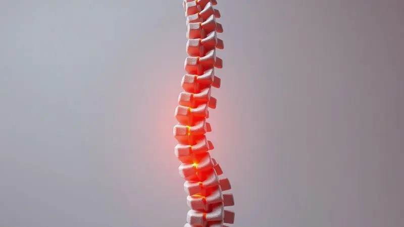

Imagine acordar depois de oito horas de sono e, em vez daquela rigidez familiar na lombar, sentir apenas leveza. Para quem convive com hérnia de disco, essa experiência não é luxo, mas necessidade.

A superfície onde você passa um terço da vida pode ser sua maior aliada na recuperação ou a vilã que agrava a compressão dos nervos. Mas como transformar essas horas de repouso em terapia?

Este guia traduz as tecnologias mais avançadas de 2025 em alívio palpável para sua coluna.

<SummaryList products={frontmatter.top_products} />

## Melhor colchão para Hérnia de Disco Lombar

Escolher o colchão certo vai além do conforto: é uma decisão terapêutica. Quando cada movimento ao acordar é calculado pela dor, a superfície certa pode significar a diferença entre um dia funcional e um dia perdido.

Vamos decifrar quais características realmente importam para quem precisa aliviar a pressão nos discos lombares.

### 1. Colchão de Espuma de Alta Densidade (D33 ou D45)

<ProductBox 
  title={frontmatter.top_products[0].title} 
  image={frontmatter.top_products[0].image} 
  link={frontmatter.top_products[0].link} 
/>

Pense na espuma de alta densidade como a fundação de um edifício: quanto maior a densidade, mais estável a estrutura. Para corpos que carregam entre 70kg e 100kg, o D33 funciona como um abraço firme que não cede nos momentos críticos.

Ele oferece resistência suficiente para manter sua coluna neutra sem a rigidez que pode criar novos pontos de tensão.

Já o D45 é para quem precisa de uma autoridade ortopédica: acima de 100kg, essa densidade age como um tutor invisível, impedindo que sua coluna se curve em posições que agravam a protrusão do disco.

Sim, você pode sentir inicialmente que está dormindo sobre uma superfície mais assertiva, mas acordará sem aquela sensação de ter sido traído pelo próprio descanso.

<CaixaProsContras>

**Prós:**

- Suporte firme que ajuda a manter a coluna alinhada.

- Ideal para diferentes faixas de peso, com opções tanto para quem pesa até 100 kg quanto acima.

- Menos pontos de pressão, resultando em maior conforto durante o sono.

- Recomendação frequentemente respaldada por especialistas em saúde ortopédica.

**Contras:**

- O D45 pode ser considerado muito rígido para alguns usuários que preferem um colchão mais macio.

- A escolha do modelo ideal deve levar em conta a recomendação médica, complicando a decisão para alguns.

</CaixaProsContras>

### 2. Colchão de Látex e as Vantagens do Material

<ProductBox 
  title={frontmatter.top_products[1].title} 
  image={frontmatter.top_products[1].image} 
  link={frontmatter.top_products[1].link} 
/>

E se o seu colchão respirasse junto com você? O látex natural faz exatamente isso: sua estrutura celular aberta permite que o ar circule enquanto o material se molda às suas curvas.

Imagine deitar e sentir que cada região da sua lombar encontra seu espaço perfeito, como se o colchão tivesse memória da sua forma ideal.

Essa adaptação inteligente é apenas o começo. O látex resiste naturalmente a ácaros e bactérias, criando um ambiente onde seu corpo pode se recuperar sem competir com alergias.

E enquanto outras espumas podem amassar como um pão velho após alguns anos, um colchão de látex de qualidade mantém sua resiliência por até 15 anos, tornando-se um investimento que acompanha sua jornada de recuperação.

### 3. Colchão de Molas Ensacadas Individualmente

<ProductBox 
  title={frontmatter.top_products[2].title} 
  image={frontmatter.top_products[2].image} 
  link={frontmatter.top_products[2].link} 
/>

Cada parte do seu corpo merece atenção personalizada.

As molas ensacadas individualmente entendem essa premissa ao trabalhar como uma equipe de suporte: quando seu quadril afunda um pouco mais, as molas dessa região respondem sem comprometer o alinhamento dos seus ombros. É a elegância da independência coordenada.

Essa tecnologia é particularmente gentil com quem muda de posição durante a noite. Em vez de rolar sobre uma superfície uniformemente rígida, seu corpo encontra microajustes que distribuem o peso como uma rede de segurança para suas vértebras.

A firmeza média-firme funciona como o ponto ideal onde suporte e acolhimento se convergem para proteger sua lombar.

<CaixaProsContras>

**Prós:**

- Suporte adaptável e alívio de pressão.

- Mantém a coluna em posição neutra.

- Reduz desconforto nas articulações.

- Eficaz em distribuir o peso uniformemente.

**Contras:**

- Não é uma solução definitiva para o problema da hérnia.

- Pode ser complicado escolher a firmeza ideal.

</CaixaProsContras>

### 4. Colchão de Espuma Viscoelástica (Memory Foam)

<ProductBox 
  title={frontmatter.top_products[3].title} 
  image={frontmatter.top_products[3].image} 
  link={frontmatter.top_products[3].link} 
/>

Há algo quase mágico na forma como a viscoelástica aceita o peso do seu corpo e depois lentamente retorna à sua forma original.

Essa paciência material é terapêutica: em vez de empurrar suas vértebras para uma posição pré-determinada, ela cria um molde personalizado que respeita suas curvaturas.

Para quem dorme acompanhado, essa tecnologia tem um benefício adicional quase poético: enquanto sua parceira ou parceiro vira durante a noite, você permanece em sua ilha de estabilidade.

A transferência mínima de movimento significa que seu sono não será interrompido justamente quando seu corpo finalmente encontrou a posição perfeita para aliviar a pressão lombar.

### 5. Colchão Híbrido com Suporte Reforçado

<ProductBox 
  title={frontmatter.top_products[4].title} 
  image={frontmatter.top_products[4].image} 
  link={frontmatter.top_products[4].link} 
/>

Por que escolher entre firmeza e conforto quando você pode ter os dois em camadas harmoniosas? O colchão híbrido é como uma orquestra onde as molas oferecem a estrutura principal e as espumas proporcionam os acentos de acolhimento.

Essa combinação é especialmente inteligente para a região lombar, onde muitas vezes precisamos de firmeza específica sem sacrificar o conforto geral.

Os modelos mais avançados elevam esse conceito com zonas especializadas: imagine uma faixa central mais robusta exatamente onde sua lombar precisa de apoio extra, enquanto os ombros e quadris desfrutam de uma adaptação mais suave.

É a personalização levada ao nível anatômico.

<CaixaProsContras>

**Prós:**

- Composição híbrida que oferece suporte e conforto.

- Zonas de suporte reforçado para alívio na região lombar.

- Melhor ventilação e regulação de temperatura.

- Ideal para diferentes posições de dormir.

**Contras:**

- Geralmente mais caro do que colchões convencionais.

- Pode ser um pouco pesado, dificultando a movimentação.

</CaixaProsContras>

## O que é Hérnia de Disco?

Para entender por que o colchão certo importa, visualize seus discos intervertebrais como amortecedores gelatinosos entre cada vértebra.

A hérnia ocorre quando parte desse material interno escapa através de uma fissura na camada externa, como o recheio de um donut que vaza pela massa.

Essa protrusão pode pressionar nervos próximos, desencadeando não apenas dor local, mas irradiações que viajam pelas pernas como choques intermitentes.

Essa condição raramente aparece de repente; geralmente é o resultado acumulado de anos de movimentos repetitivos, posturas inadequadas ou simplesmente do desgaste natural que acompanha o tempo.

Entender esse mecanismo ajuda a apreciar como uma superfície de sono adequada não é luxo, mas intervenção preventiva.

## Causas da Hérnia de Disco

Seu corpo conta histórias através da coluna. Cada levantamento incorreto, cada hora sentado em cadeira inadequada, cada movimento repetitivo sem atenção à biomecânica deixa seu registro nos discos.

O envelhecimento natural reduz a hidratação dessas estruturas, tornando-as menos flexíveis e mais suscetíveis a lesões.

Mas não são apenas fatores mecânicos. A genética pode predispor alguns de nós a discos menos resilientes, enquanto o excesso de peso cria uma carga constante que testa a resistência dessas estruturas.

Reconhecer essas causas não é sobre encontrar culpados, mas sobre identificar oportunidades onde pequenas mudanças, como a superfície onde você dorme, podem alterar significativamente a equação da dor.

## Como um colchão afeta a coluna?

Durante o sono, seu corpo entrega cerca de 8 horas de inércia à superfície que o sustenta.

Um colchão inadequado usa esse tempo contra você: muito mole e sua lombar afunda em um vale que estira os ligamentos; muito duro e seus pontos de pressão, quadris, ombros, ficam comprimidos como pedras contra concreto.

O colchão ideal, no entanto, transforma essas horas em terapia passiva. Ele mantém a curva natural da sua coluna em posição neutra, permitindo que seus músculos relaxem verdadeiramente em vez de trabalharem para compensar um suporte deficiente.

Essa diferença se traduz diretamente na maneira como você se movimenta ao acordar: com elasticidade em vez de rigidez.

## Por Que o Colchão é Tão Importante para a Coluna

Pense na sua coluna como uma cadeia de montanhas com curvas delicadas que absorvem impacto. Um colchão que respeita essas curvas age como a base perfeita para essa paisagem anatômica.

Durante o sono profundo, quando sua consciência não supervisiona a postura, é essa superfície que assume o papel de guardiã do seu alinhamento vertebral.

Essa proteção noturna tem efeitos diurnos: menos inflamação nos discos, melhor circulação nos nervos comprimidos e uma sensação geral de leveza que começa antes mesmo de você abrir os olhos.

Em um ciclo virtuoso, um sono mais reparador também melhora sua tolerância à dor e sua capacidade de seguir com os exercícios de reabilitação.

## Características Essenciais de um Bom Colchão para Coluna

Três pilares sustentam um colchão que realmente cuida da sua coluna: adaptação inteligente, suporte estratégico e comunicação com seu corpo ao longo do tempo.

Materiais como látex e viscoelástica excelem no primeiro, enquanto densidades adequadas e estruturas híbridas abordam o segundo. O terceiro pilar, durabilidade, garante que esse compromisso não seja rompido após alguns meses de uso.

### Suporte Adequado

Suporte não significa rigidez. Significa resposta inteligente ao peso: onde seu quadril precisa de acomodação, o material cede apenas o suficiente; onde sua lombar precisa de estabilidade, ele oferece resistência.

Esse balé entre cedência e firmeza é o que mantém suas vértebras em harmonia durante a noite.

Os melhores materiais para esse equilíbrio são aqueles que entendem diferenças regionais. A espuma viscoelástica, por exemplo, responde ao calor e à pressão, tornando-se mais maleável exatamente onde seu corpo mais precisa de adaptação.

Já as molas ensacadas oferecem pontos independentes de apoio que não transferem tensão de uma área para outra.

### Conforto Personalizado

Conforto para quem tem hérnia de disco tem um significado específico: é a ausência de dor ao encontrar uma posição. Essa experiência é profundamente pessoal.

Para alguns, significa sentir-se envolvido pelo material; para outros, significa flutuar sobre uma superfície que oferece resistência uniforme.

A chave está em testar não apenas com as costas, mas com o corpo inteiro. Deite-se na posição em que normalmente dorme e preste atenção: seus ombros estão comprimidos? Sua lombar está suspensa ou apoiada?

Essa observação atenta revela mais do que qualquer especificação técnica sobre qual tipo de conforto seu corpo realmente anseia.

### Durabilidade

Um colchão que perde sua resiliência após dois anos é como um médico que esquece seu diagnóstico: inútil quando você mais precisa. A durabilidade está intrinsicamente ligada à consistência do suporte.

Materiais como o látex natural mantêm suas propriedades por mais tempo porque sua estrutura celular é mais resistente ao colapso.

Mas a longevidade também depende de parceria: girar o colchão periodicamente, usar uma base adequada e proteger contra umidade são gestos que estendem a vida útil.

E quando um fabricante oferece garantia estendida, está essencialmente dizendo: "Acreditamos que nosso produto continuará cuidando da sua coluna pelos próximos anos."

## Considerações Sobre o Uso do Colchão para Quem tem Hérnia de Disco

Escolher o colchão perfeito é apenas metade da equação. A outra metade está em como você interage com ele diariamente.

Sua postura ao dormir, a relação entre firmeza e peso corporal, e o momento de reconhecer que é hora de substituir a superfície são decisões que transformam um objeto em terapia.

### Posição e Postura ao Dormir

Seu colchão pode ser perfeito, mas se você dorme em uma posição que torce sua coluna como um pano molhado, nenhuma tecnologia ajudará.

Dormir de lado com um travesseiro entre os joelhos é frequentemente a posição mais amigável para a lombar, pois mantém o alinhamento pélvico e reduz a rotação vertebral.

Para os que preferem dormir de costas, um pequeno travesseiro sob os joelhos faz uma diferença surpreendente: ele relaxa a tensão na parte inferior das costas, permitindo que seus discos se descomprimam.

Evitar dormir de bruços é geralmente aconselhável, pois essa posição força uma rotação cervical e lombar que pode exacerbar a compressão dos nervos.

### A Importância da Firmeza e Suporte

A busca pela firmeza ideal é um equilíbrio delicado entre dados objetivos e sensação subjetiva.

Uma regra útil: seu colchão deve ser firme o suficiente para impedir que seu quadril afunde abaixo do nível da sua cintura quando você está deitado de lado, mas suave o suficiente para não criar pontos de pressão visíveis.

Esse equilíbrio muda com o peso. Pessoas com mais massa corporal geralmente precisam de mais firmeza para evitar o afundamento excessivo, enquanto pessoas mais leves podem encontrar colchões muito firmes desconfortáveis.

A verdadeira medida é como você se sente ao acordar: se a dor diminuiu, você encontrou sua zona de firmeza.

## Quando Trocar o Colchão

Seu colchão envelhece junto com você, mas seus sinais de fadiga são mais silenciosos. Comece observando seu corpo: aquela dor matinal que desaparecia após alongamentos e agora persiste pode ser seu primeiro alerta.

No colchão em si, procure valas ou depressões visíveis, especialmente nas áreas onde você mais dorme.

O tempo médio de 7 a 10 anos é apenas uma referência. Colchões de alta qualidade podem durar mais, especialmente com cuidados adequados, enquanto modelos de baixa densidade podem mostrar desgaste em bem menos tempo.

O critério decisivo é simples: se você dorme melhor em hotéis ou na casa de amigos do que na sua própria cama, seu colchão já está se despedindo silenciosamente.

## FAQ – Perguntas Frequentes

As dúvidas sobre colchões e hérnia de disco geralmente giram em torno do mesmo medo: tomar a decisão errada e acordar com mais dor. Estas respuntas vão direto ao ponto, traduzendo conceitos técnicos em orientações práticas.

### Qual o melhor tipo de colchão para quem tem dor na coluna?

Não existe um "melhor tipo" universal, mas sim um melhor tipo para suas circunstâncias específicas. Se você tende a sentir calor durante a noite, colchões com núcleo de molas e camadas de látex podem oferecer melhor ventilação.

Se sua dor é acompanhada por formigamento nas pernas, a viscoelástica pode ajudar a distribuir a pressão de forma mais uniforme. A resposta começa com esta pergunta: "Onde e como minha dor se manifesta?"

### Colchão muito firme é sempre melhor?

Este é um dos maiores mitos sobre saúde da coluna. Colchões excessivamente firmes podem criar pontos de pressão que interrompem a circulação e forçam suas articulações a posições não naturais.

O que sua coluna realmente precisa é de firmeza seletiva: mais resistência onde há maior peso (quadris, ombros), e adaptação onde há curvas naturais (lombar, cervical). Uma firmeza uniforme e extrema raramente atende a essa necessidade complexa.

### Qual densidade ideal para problemas de coluna?

Densidade é sobre resiliência, não apenas sobre firmeza. Para a maioria dos adultos, densidades entre 20D e 30D oferecem o equilíbrio certo entre durabilidade e conforto.

Pessoas acima de 100kg geralmente se beneficiam de densidades mais altas (35D a 45D) para evitar o afundamento excessivo.

Lembre-se: densidade alta não significa necessariamente colchão duro; camadas superiores mais macias podem ser combinadas com núcleos densos para criar suporte progressivo.

### Como saber se meu colchão está prejudicando minha coluna?

Seu corpo oferece pistas claras quando o colchão se tornou parte do problema. Acordar com rigidez que melhora depois de se movimentar é um sinal clássico.

Outro indicador é a necessidade de constantemente mudar de posição durante a noite, como se estivesse procurando um lugar confortável que não existe mais. E o teste mais revelador: passar uma noite em outro colchão e perceber uma diferença significativa na dor matinal.

### Viscoelástico ou molas para quem tem hérnia de disco?

Essa escolha resume-se a duas filosofias diferentes de suporte. A viscoelástica oferece adaptação contínua, ela molda-se ao seu corpo como uma segunda pele, aliviando pontos de pressão específicos.

As molas ensacadas oferecem suporte pontual independente, cada área recebe apoio proporcional ao peso que carrega. Para quem sente dor específica em regiões localizadas (como apenas um lado da lombar), a viscoelástica pode ser mais eficaz.

Para quem precisa de maior ventilação ou prefere sensação de "flutuação", as molas podem ser mais adequadas.

## Conclusão

Escolher um colchão para hérnia de disco lombar não é sobre comprar um produto, mas sobre selecionar um aliado noturno para sua recuperação.

As especificações técnicas, densidade, materiais, tecnologias, são apenas a linguagem que esse aliado usa para prometer: "Vou cuidar da sua coluna enquanto você descansa."

Ao longo desta jornada de escolha, você descobrirá que o melhor colchão é aquele que desaparece na experiência. Não é a firmeza que você sente ao deitar, mas o conforto que você não pensa uma vez adormecido.

Não são os números da densidade, mas a leveza com que você se levanta. Não é a tecnologia de resfriamento, mas o sono ininterrupto que permite ao seu corpo fazer seu trabalho de reparação.

Lembre-se: sua coluna está contando as horas até a próxima noite de descanso. Dê a ela o parceiro que ela merece.

Comece hoje mesmo a transformar suas horas de sono de um período de vulnerabilidade em um ritual de recuperação, onde cada amanhecer traz menos dor e mais possibilidade.