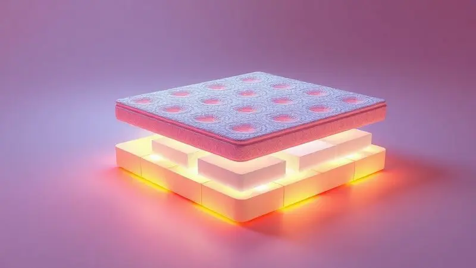
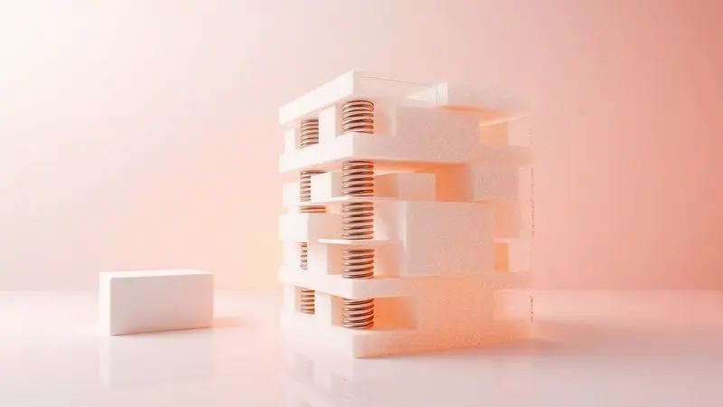
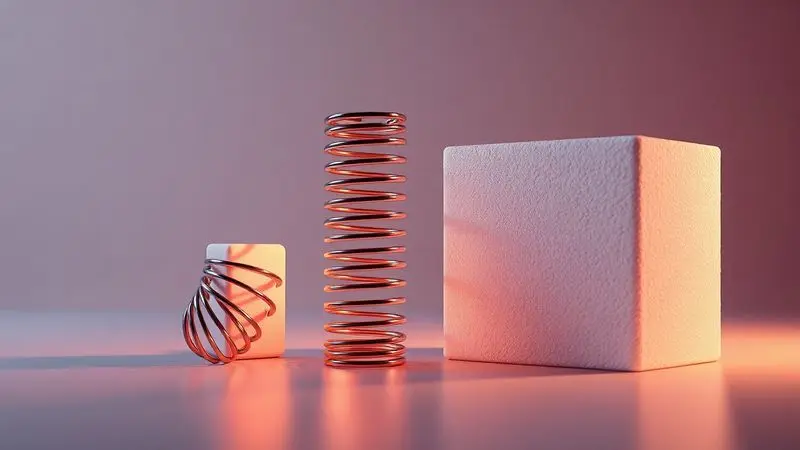

Acordar com dores no corpo e a sensação de estar 'afundando' no meio da cama é um sinal claro de que seu colchão perdeu a vida útil ou não possui a densidade adequada para o seu biotipo.

Escolher o modelo certo é fundamental para a saúde da coluna e para garantir um sono verdadeiramente reparador. Mas afinal, qual o melhor tipo de colchão que não afunda?

Neste guia completo, analisamos as melhores opções do mercado em 2025, desde tecnologias de molas ensacadas até espumas de alta densidade, explicando o que causa a deformação e como investir em um produto que mantenha sua firmeza por muito mais tempo.

<SummaryList products={frontmatter.top_products} />

## Melhores Colchões que não Afundam: O Ranking Definitivo

Ao escolher um colchão que não afunda, é crucial considerar fatores como suporte e material. Colchões de espuma de alta densidade e modelos híbridos são excelentes opções para garantir conforto sem comprometer a firmeza.

### 1. Colchão King Molas Ensacadas Beautyrest Maestro Simmons 193x203

<ProductBox 
  title={frontmatter.top_products[0].title} 
  image={frontmatter.top_products[0].image} 
  link={frontmatter.top_products[0].link} 
/>

Imagine acordar completamente renovado, sem aquela sensação de que dormiu em terreno irregular.

O Beautyrest Maestro Simmons transforma essa experiência com seu sistema de molas ensacadas que trabalham de forma independente, oferecendo isolamento de movimento tão eficaz que você praticamente não sente seu parceiro se mexendo ao lado.

E aqui está o segredo para noites frescas: tecnologias como AirCool e SurfaceCool não são apenas nomes bonitos, são sua garantia contra aquela sensação abafada que te faz jogar as cobertas fora no meio da madrugada.

A praticidade do giro de 180° faz toda diferença na manutenção, enquanto o tamanho king size oferece espaço para você esticar o corpo completamente. Sim, ele tem seu peso, mas pense nisso como um compromisso com a estabilidade que seu corpo merece.

<CaixaProsContras>

**Prós:**

- Isolamento de movimento eficaz para casais.

- Tecnologia de resfriamento para conforto térmico.

- Suporte adequado para a coluna.

- Facilidade de manutenção com giro de 180°.

**Contras:**

- Pode ser pesado e difícil de movimentar.

- Uso apenas de um lado limita opções de desgaste.

</CaixaProsContras>

### 2. Colchão Queen Emma Original

<ProductBox 
  title={frontmatter.top_products[1].title} 
  image={frontmatter.top_products[1].image} 
  link={frontmatter.top_products[1].link} 
/>

Você já se perguntou como seria dormir em tecnologia da NASA? O Emma Original traz essa experiência para sua casa com espuma viscoelástica que originalmente foi desenvolvida para absorver impactos em naves espaciais.

Aqui na Terra, essa mesma tecnologia se transforma em alívio de pressão para seus ombros e quadris, especialmente se você é daqueles que muda de posição várias vezes durante a noite.

As três camadas de espuma trabalham em harmonia para manter sua coluna perfeitamente alinhada, enquanto a capa respirável age como um sistema de climatização pessoal. A garantia de 10 anos?

Mais do que uma promessa, é o sossego de saber que seu investimento está protegido.

<CaixaProsContras>

**Prós:**

- Conforto e suporte para diferentes posições de dormir.

- Tecnologia que minimiza a transferência de movimento.

- Capa respirável que controla a temperatura.

- Garantia de 10 anos e 100 noites de teste.

**Contras:**

- Pode ser um pouco firme para quem prefere colchões muito macios.

- Avaliações variam dependendo do peso do usuário.

</CaixaProsContras>

### 3. Colchão Casal Emma Duo Comfort

<ProductBox 
  title={frontmatter.top_products[2].title} 
  image={frontmatter.top_products[2].image} 
  link={frontmatter.top_products[2].link} 
/>

E se você pudesse escolher a firmeza do seu colchão ao passar para o outro lado da cama?

O Emma Duo Comfort oferece exatamente essa liberdade: um lado firme que age como uma cinta postural durante seu sono, e outro mais macio que envolve seu corpo como um abraço aconchegante.

Essa versatilidade torna perfeito para casais com preferências diferentes ou para quando seu corpo pede mais suporte em dias de dor nas costas.

A capa removível e lavável transforma a limpeza em uma tarefa simples, enquanto as 100 noites de teste são seu período de adaptação para descobrir qual lado melhor combina com seu jeito de dormir.

<CaixaProsContras>

**Prós:**

- Tecnologia dupla face para maior versatilidade.

- Suporte ortopédico que ajuda na postura.

- Capa removível e lavável para fácil limpeza.

- 100 noites de teste para adaptação.

**Contras:**

- Pode não agradar quem busca colchões extremamente macios.

- O lado firme pode ser desconfortável se usado sem lençol.

</CaixaProsContras>

### 4. Colchão Casal Emma One Plus

<ProductBox 
  title={frontmatter.top_products[3].title} 
  image={frontmatter.top_products[3].image} 
  link={frontmatter.top_products[3].link} 
/>

Para quem busca um colchão que compreende cada curva e ângulo do seu corpo, o Emma One Plus é como ter um terapeuta do sono particular.

Suas três camadas de espuma trabalham em conjunto para distribuir seu peso com precisão matemática, aliviando pontos de pressão que você nem sabia que existiam.

A camada de viscoelástica é especialmente inteligente: ela se ajusta ao seu corpo durante a noite, garantindo que suas costas mantenham o alinhamento perfeito desde a primeira hora até o despertar.

Ser hipoalergênico significa respirar livremente durante toda a noite, especialmente importante para quem sofre com alergias. E com 10 anos de garantia, você investe em tranquilidade tanto quanto em conforto.

<CaixaProsContras>

**Prós:**

- Conforto com várias camadas de espuma.

- Hipoalergênico, ideal para alérgicos.

- 100 noites de teste e devolução gratuita.

- Boa firmeza e suporte ortopédico.

**Contras:**

- Não pode ser usado dos dois lados.

- Pode não ser a melhor opção para quem prefere um colchão mais macio.

</CaixaProsContras>

### 5. Colchão Queen Luuna Support

<ProductBox 
  title={frontmatter.top_products[4].title} 
  image={frontmatter.top_products[4].image} 
  link={frontmatter.top_products[4].link} 
/>

Procurando o ponto de equilíbrio perfeito entre firmeza e aconchego? O Luuna Support domina essa arte com sua classificação 8/10 de firmeza. Ele é como aquele amigo que sabe exatamente quando você precisa de apoio e quando pode relaxar.

Sua tecnologia Air Flow funciona como um sistema de ventilação interno que mantém o frescor mesmo nas noites mais quentes.

A capacidade de suportar até 150 kg por pessoa não é apenas um número técnico, é a confiança de que o colchão vai acompanhar você por anos, mantendo-se fiel à sua forma original. E a capa respirável e lavável?

É a combinação perfeita de praticidade e cuidado com a higiene.

<CaixaProsContras>

**Prós:**

- Firmeza equilibrada, adequada para diversas posições de sono.

- Suporta até 150 kg por pessoa, ideal para pessoas mais pesadas.

- Tecnologia Air Flow que garante ventilação.

- Capa lavável e respirável.

**Contras:**

- Alguns relatos sobre a questão hipoalergênica podem gerar dúvidas.

- Não possui pillow top, o que pode faltar para quem busca um toque extra de suavidade.

</CaixaProsContras>

### 6. Colchão Casal Luuna Blue

<ProductBox 
  title={frontmatter.top_products[5].title} 
  image={frontmatter.top_products[5].image} 
  link={frontmatter.top_products[5].link} 
/>

Já pensou em dormir em uma nuvem que não te deixa afundar? O Luuna Blue cria essa sensação com seu equilíbrio perfeito de 7/10 na escala de firmeza.

As três camadas de espuma trabalham como uma equipe sincronizada: enquanto a Open Cell Therma-Flow mantém a temperatura sob controle, a ErgoSupport proporciona aquele apoio que faz você acordar sem rigidez muscular.

A circulação de ar inteligente é seu aliado contra a umidade e o calor excessivo, especialmente para quem dorme com cobertas pesadas. Sim, pode haver um leve odor inicial, mas ele desaparece tão rápido quanto sua insônia depois de algumas noites de sono renovador.

<CaixaProsContras>

**Prós:**

- Ótimo equilíbrio entre conforto e firmeza.

- Suporta até 150 kg por pessoa.

- Tecnologia que promove boa circulação de ar.

- Capa removível e lavável.

**Contras:**

- Pode ter odor inicial após a abertura.

- Pode parecer mais macio para pessoas acima de 120 kg.

</CaixaProsContras>

### 7. Colchão Casal Espuma D33 Fort

<ProductBox 
  title={frontmatter.top_products[6].title} 
  image={frontmatter.top_products[6].image} 
  link={frontmatter.top_products[6].link} 
/>

Às vezes, simplicidade é sinônimo de eficiência. O D33 Fort prova isso com sua espuma de alta densidade que oferece a firmeza que sua coluna precisa para se manter em posição natural durante o sono.

Não estamos falando de rigidez desconfortável, mas de um suporte consciente que compreende que seu corpo precisa tanto de firmeza quanto de aconchego.

A capacidade de suportar até 150 kg por pessoa não é apenas uma especificação técnica, é uma promessa de que esse colchão vai estar firme ao seu lado, independentemente das mudanças da vida.

O revestimento em poliéster bordado é o toque final que transforma a funcionalidade em elegância.

<CaixaProsContras>

**Prós:**

- Confeccionado com espuma de alta qualidade.

- Suporte firme, promovendo boa postura.

- Capacidade de apoio robusta (até 150 kg por pessoa).

- Revestimento em poliéster bordado que proporciona conforto.

**Contras:**

- Firmeza que pode não ser adequada para todos os perfis.

- Pode não ter opções de personalização de conforto.

</CaixaProsContras>

### 8. Colchão Solteiro Espuma D33 Pillow Top New Millenium Hellen

<ProductBox 
  title={frontmatter.top_products[7].title} 
  image={frontmatter.top_products[7].image} 
  link={frontmatter.top_products[7].link} 
/>

Para quem quer começar o dia sentindo-se renovado, a camada Pillow Top do New Millenium Hellen é como acordar em uma suíte de hotel toda manhã.

Essa camada extra de maciez não é apenas um detalhe estético, é a responsável por distribuir a pressão de forma uniforme, especialmente nas áreas dos ombros e quadris.

A espuma D33 no interior trabalha silenciosamente para manter a estrutura intacta, enquanto o revestimento Granite é bonito o suficiente para dispensar a colcha. Os cuidados de manutenção?

São pequenos gestos de carinho que garantem que seu colchão retribua com anos de sono de qualidade.

<CaixaProsContras>

**Prós:**

- Conforto superior graças à camada de Pillow Top.

- Alta durabilidade com espuma de qualidade D33.

- Revestimento elegante e fácil de cuidar.

- Suporte robusto para até 120 kg.

**Contras:**

- Pode precisar de cuidados regulares para manter a integridade.

- A altura de 19 cm pode não ser ideal para todos os suportes.

</CaixaProsContras>

### 9. Colchão Solteiro Molas Ensacadas BF Colchões

<ProductBox 
  title={frontmatter.top_products[8].title} 
  image={frontmatter.top_products[8].image} 
  link={frontmatter.top_products[8].link} 
/>

Esportista ou não, seu corpo merece regeneração durante o sono. O modelo Sport PRO da BF Colchões entende isso profundamente, com suas molas ensacadas PHP que funcionam como pequenos terapeutas para seus músculos.

O tecido em malha belga com fios de carbono não é apenas um detalhe tecnológico, é a garantia de que você acorda com menos dores e mais disposição.

A variedade de modelos disponíveis significa que você encontra exatamente o suporte que seu corpo pede, da firmeza intermediária ao suporte mais robusto. E as certificações internacionais?

São o selo de qualidade que transforma um colchão em um investimento seguro para sua saúde.

<CaixaProsContras>

**Prós:**

- Suporte ótimo com molas ensacadas.

- Tecnologia que promove regeneração muscular.

- Boa variedade de modelos disponíveis.

- Alta capacidade de peso suportada.

**Contras:**

- Preço pode ser um pouco elevado.

- Algumas pessoas podem preferir opções mais macias.

</CaixaProsContras>

### 10. Colchão Solteiro Espuma D33 Marquês Umaflex

<ProductBox 
  title={frontmatter.top_products[9].title} 
  image={frontmatter.top_products[9].image} 
  link={frontmatter.top_products[9].link} 
/>

Para quem valoriza a clássica relação entre firmeza e durabilidade, o Marquês Umaflex é como aquele móvel sólido que passa de geração em geração.

Sua espuma D33 não é apenas um número, é a garantia de que o colchão vai manter sua forma ano após ano, como se tivesse uma memória da posição perfeita para seu corpo.

O revestimento em tecido Granite é inteligente em sua simplicidade: fácil de limpar, resistente ao acúmulo de poeira e elegante o suficiente para qualquer quarto. Os cuidados quinzenais de rotação?

São 5 minutos que fazem toda diferença para prolongar a vida útil do seu investimento.

<CaixaProsContras>

**Prós:**

- Conforto firme sem afundar.

- Boa durabilidade com materiais de qualidade.

- Revestimento fácil de limpar.

- Suporta até 90kg por pessoa.

**Contras:**

- Pode ser um pouco rígido para quem prefere colchões muito macios.

- A garantia de 12 meses é relativamente curta para colchões.

</CaixaProsContras>

### 11. Colchão Solteiro Espuma D33 Sensor Inova BR

<ProductBox 
  title={frontmatter.top_products[10].title} 
  image={frontmatter.top_products[10].image} 
  link={frontmatter.top_products[10].link} 
/>

Segurança começa onde você descansa. O Sensor Inova BR leva isso a sério com sua certificação INMETRO que vai além do selo no produto, representando o compromisso com sua saúde durante cada uma das oito horas de sono.

Os tratamentos contra ácaros, mofo e fungos não são apenas recursos de marketing, são sua barreira invisível contra alergias.

A espuma D33 oferece a firmeza ideal para quem precisa manter a coluna alinhada sem sacrificar completamente a maciez. Pode ser um pouco mais rígido para alguns? Sim, mas é essa mesma rigidez que garante que seu corpo não afunde em posições prejudiciais durante a noite.

<CaixaProsContras>

**Prós:**

- Boa densidade D33 proporciona firmeza e suporte adequados.

- Certificado pelo INMETRO, garantindo qualidade.

- Tratamentos contra ácaros, mofo e fungos.

- Ideal para uso diário e manutenção da saúde postural.

**Contras:**

- Pode ser considerado rígido por quem prefere colchões mais macios.

- Disponibilidade de tamanhos limitados em algumas regiões.

</CaixaProsContras>

Agora que você conheceu os principais candidatos a melhorar suas noites de sono, é natural questionar: será que existe realmente um colchão que nunca vai se deformar?

## Existe colchão que não deforma?

Sim, existem colchões que resistem bravamente ao tempo e ao uso, mantendo sua integridade como um bom vinho que melhora com os anos.

O segredo não está em um material mágico, mas na combinação inteligente de látex natural, espumas de alta densidade e molas ensacadas que trabalham em conjunto para distribuir seu peso de forma equilibrada.

Pense nisso como um time onde cada jogador conhece seu papel: enquanto algumas camadas oferecem suporte estrutural, outras garantem o conforto que faz você adormecer em minutos.

Por trás dessa durabilidade está a compreensão de que seu corpo é único. Por isso, a firmeza ideal varia conforme seu biotipo e posição preferida para dormir.

Quando você investe em um colchão que realmente compreende essa individualidade, está comprando mais do que um produto, está adquirindo o direito de acordar renovado todos os dias.

## Por que um colchão afunda?

Entender por que um colchão afunda é como desvendar os mistérios de uma amizade que se desgasta com o tempo. A resposta está em três fatores principais que trabalham silenciosamente para transformar seu apoio perfeito em um terreno irregular.

### Desgaste natural

Todos os materiais têm sua história de desgaste, e com os colchões não é diferente. Ao longo dos anos, mesmo os melhores componentes sofrem uma compressão gradual, especialmente nas áreas onde seu corpo exerce mais pressão: ombros, quadris e região lombar.

Colchões de espuma são mais suscetíveis a esse fenômeno, enquanto os de molas de qualidade mantêm sua resistência por mais tempo. A escolha certa do material para seu peso e hábitos de sono pode adiar significativamente essa deterioração natural.

### Uso inadequado

Um colchão é como um parceiro que precisa ser compreendido e respeitado. Usá-lo além de sua capacidade de suporte, ignorar as recomendações do fabricante ou até mesmo colocar em uma base inadequada são atos que aceleram o processo de afundamento.

Quando você dorme em um colchão que não foi projetado para suas necessidades específicas, está criando pontos de pressão que, com o tempo, se transformam em crateras que afetam sua postura e qualidade de sono.

### Defeito de fabricação

Às vezes, o problema começa na origem. Costuras mal feitas, materiais de qualidade inferior ou falhas no processo produtivo podem criar estruturas comprometidas desde o primeiro dia.

Por isso, a escolha de marcas reconhecidas e que oferecem garantias sólidas não é apenas uma questão de status, mas sim de segurança.

É sua proteção contra a surpresa desagradável de descobrir que seu investimento em sono reparador se transformou em mais uma fonte de insônia.

Com esses conhecimentos em mãos, você está preparado para fazer a escolha mais inteligente para suas noites.

## Como escolher um colchão que não afunda?

Escolher um colchão que não afunda é como encontrar o parceiro ideal para uma longa jornada de sono. Comece testando o produto pessoalmente, pressionando diferentes áreas para sentir como ele responde ao seu peso.

Materiais como espuma de memória e látex não apenas oferecem suporte firme, mas têm a inteligência de se adaptar às suas curvas.

A densidade é sua melhor amiga nessa busca: números como D33 e D45 não são apenas especificações técnicas, são promessas de que o colchão vai resistir ao teste do tempo.

Considere sua posição de dormir como um guia pessoal. Se você dorme de lado, precisa de mais maciez nos ombros e quadris. Dorme de barriga para cima? O suporte lombar se torna crucial.

E nunca subestime o poder do teste prático: seu corpo sabe melhor do que qualquer lista de especificações o que realmente precisa.

## Densidade e Estrutura: O Segredo da Durabilidade

Por trás de cada colchão que mantém sua forma por anos está um casamento perfeito entre densidade e estrutura.

As espumas D33 e D45 não são apenas números em uma ficha técnica, são a garantia de que sua superfície de sono não vai ceder como areia movediça depois de alguns meses.

Quando combinadas com estruturas inteligentes como molas ensacadas, que trabalham individualmente para distribuir seu peso, você tem a fórmula para evitar aquela sensação de afundamento que arruína noites inteiras de descanso.

Essa combinação não apenas prolonga a vida útil do colchão, mas também evita aquele ciclo frustrante de trocas frequentes.

Ao investir em densidade e estrutura adequadas, você está comprando tempo: tempo de sono de qualidade, tempo sem dores nas costas e tempo sem a preocupação de precisar trocar de colchão a cada dois anos.

## Importância do Peso Suportado na Escolha

Pensar no peso suportado pelo colchão é muito mais do que verificar uma especificação técnica. É compreender que seu corpo merece um apoio proporcional à sua estrutura.

Quando um colchão não consegue suportar adequadamente seu peso, ele começa a trabalhar contra você, cedendo em pontos específicos e criando um terreno irregular que prejudica sua coluna durante o sono.

Cada tipo de material responde de forma diferente ao peso. Espumas viscoelásticas se moldam como um abraço personalizado, enquanto as molas oferecem uma resistência mais uniforme.

Saber qual combinação funciona para suas características físicas específicas é o segredo para encontrar não apenas um colchão que não afunda, mas um que se torne um aliado na sua saúde postural por anos.

## Espuma vs Molas: Qual Deforma Menos?

Na eterna batalha entre espuma e molas, a questão da deformação tem um vencedor claro: depende do que seu corpo realmente precisa.

As espumas de memória e látex têm a sabedoria de se adaptar às suas formas, oferecendo conforto personalizado que minimiza pontos de pressão.

Já as molas ensacadas trazem a expertise da distribuição uniforme de peso, trabalhando como pequenas estações de apoio que mantêm sua firmeza de forma mais consistente ao longo do tempo.

A verdadeira resposta não está em escolher um campo, mas em entender qual tecnologia melhor atende suas necessidades específicas. Para quem muda muito de posição durante a noite, as molas podem ser mais eficientes.

Para quem busca alívio imediato em áreas específicas, a espuma oferece soluções personalizadas. Ambas têm seu lugar na busca pelo sono perfeito.

## Como prevenir o afundamento do colchão?

Prevenir o afundamento do colchão é cultivar um hábito diário de cuidado que retribui com anos de sono de qualidade. Comece com a base certa: um estrado ou suporte firme que distribua o peso igualmente, evitando pontos de pressão concentrados.

A rotação regular do colchão funciona como um alongamento preventivo, dando a cada lado a oportunidade de se recuperar do desgaste natural.

Mantenha seu quarto ventilado, porque a umidade é inimiga silenciosa dos materiais do colchão. E por mais tentador que seja, evite transformar sua cama em trampolim ou área de brincadeiras pesadas.

Esses cuidados simples são investimentos que garantem que seu colchão continue oferecendo o apoio perfeito, noite após noite.

## Perguntas Frequentes (FAQ)

Muitos se perguntam sobre a durabilidade e o suporte de colchões que não afundam. É importante considerar a densidade do material, o tipo de espuma e as recomendações do fabricante para garantir uma boa escolha.

### Quero um colchão que não afunda. Qual é a melhor opção?

Quando seu objetivo é um colchão que mantenha a firmeza, concentre-se em espumas de alta densidade (D33 ou superior) e modelos com molas ensacadas.

Os colchões ortopédicos são especialmente projetados para essa missão, pois oferecem o suporte estrutural que sua coluna precisa para manter-se alinhada.

Mas não deixe a teoria sobrepor sua experiência pessoal: testar o colchão antes da compra é sua oportunidade de sentir como seu corpo responde àquela combinação específica de firmeza e conforto.

### Colchões de casal tendem a afundar mais?

Colchões de casal carregam o duplo desafio de suportar dois corpos com características e movimentos diferentes, o que pode acelerar o processo de desgaste se não forem escolhidos com cuidado.

A chave está em materiais de alta densidade e tecnologias como molas ensacadas que trabalham independentemente para cada área.

A manutenção regular, incluindo a rotação do colchão, também se torna ainda mais importante para distribuir o desgaste uniformemente e prolongar significativamente a vida útil do produto.

### Colchões de mola ensacada afundam?

Os colchões de mola ensacada têm um sistema inteligente onde cada mola trabalha independentemente, o que reduz drasticamente a possibilidade de afundamento generalizado.

Essa tecnologia permite que o colchão se adapte às diferentes pressões do seu corpo sem que uma área afete as outras.

No entanto, a qualidade das molas e sua densidade são determinantes: escolher um modelo com materiais premium e construção robusta é sua garantia de que esse sistema vai funcionar perfeitamente por muitos anos.

### Garantia de 10 Anos: Emma e Luuna Valem a Pena?

Uma garantia de 10 anos não é apenas um número no papel, é a confiança da marca em seu próprio produto.

Tanto Emma quanto Luuna oferecem essa segurança porque seus colchões são construídos para durar, com tecnologias que compreendem a importância do suporte a longo prazo.

A Emma se destaca pela adaptação precisa ao corpo, enquanto a Luuna foca no equilíbrio ortopédico ideal. Com essa garantia, você dorme tranquilo sabendo que qualquer imprevisto estará coberto, transformando seu investimento em uma relação de confiança mútua.

## Conclusão

Encontrar um colchão que não afunda é mais do que uma busca por conforto, é uma jornada em direção ao respeito pelo seu corpo e pela qualidade do seu sono.

Cada especificação técnica que analisamos - da densidade D33 às molas ensacadas, do peso suportado às garantias de longo prazo - não são apenas números em uma ficha técnica.

São promessas de noites reparadoras, de acordar sem dores, de investir em um produto que compreende que dormir bem é um direito, não um luxo.

Os 11 colchões que apresentamos representam diferentes abordagens para um mesmo objetivo: oferecer a firmeza que sua colina precisa sem sacrificar o aconchego que sua mente deseja.

Seja você um casal que precisa de isolamento de movimento, uma pessoa com necessidades ortopédicas específicas ou alguém que simplesmente quer acordar renovado, existe um colchão neste guia que foi projetado pensando exatamente nas suas necessidades.

A escolha final, no entanto, sempre será sua. Use os 100 dias de teste como seu laboratório pessoal, sinta como seu corpo responde àquela combinação específica de materiais e, acima de tudo, lembre-se que você não está apenas comprando um produto.

Está investindo em anos de sono de qualidade, em saúde postural e na energia que vai precisar para enfrentar cada novo dia. Escolha com sabedoria, porque seu corpo vai agradecer todas as manhãs, pelos próximos anos.