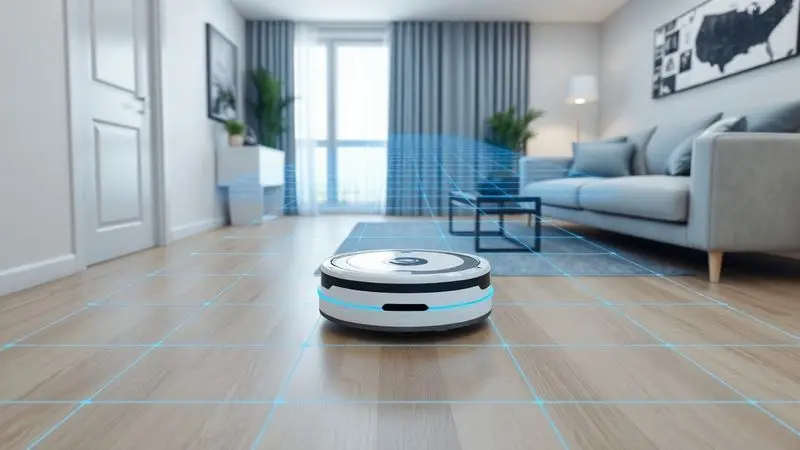
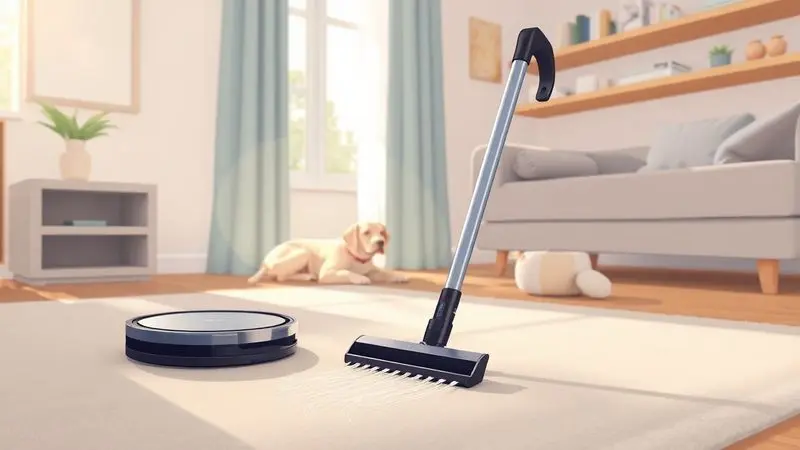
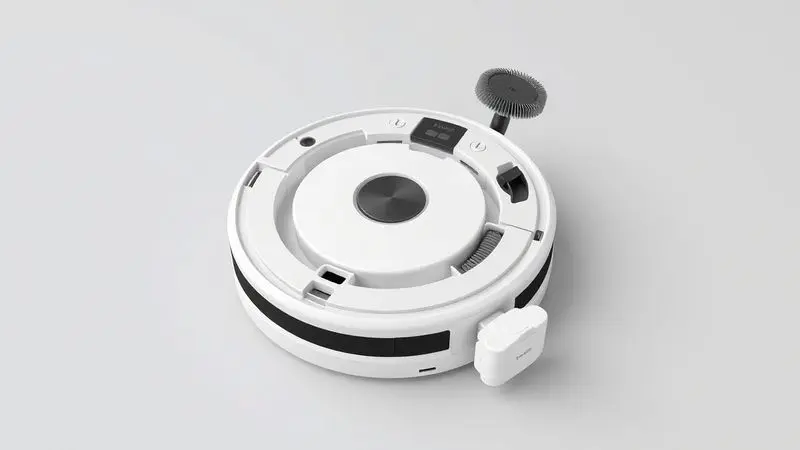

Manter a casa limpa não precisa mais ser uma tarefa exaustiva que consome todo o seu tempo livre. Você já se perguntou se um robô aspirador realmente funciona ou se é apenas um gadget caro que fica preso nos tapetes?

A tecnologia evoluiu drasticamente, e hoje existem modelos que mapeiam sua casa com precisão laser e até se limparam sozinhos.

Neste guia, apresentamos os melhores robôs aspiradores de 2025, desde opções acessíveis até máquinas premium, para que você encontre o parceiro ideal para sua faxina.

Imagine acordar com o chão já limpo, sem precisar arrastar um aspirador pesado ou gastar seu fim de semana com tarefas domésticas. É essa liberdade que os robôs aspiradores modernos oferecem, transformando uma obrigação cansativa em um simples hábito automático.

<SummaryList products={frontmatter.top_products} />

## Por que investir em um robô aspirador em 2025?

Em 2025, investir em um robô aspirador significa recuperar horas preciosas da sua semana.

Em vez de sacrificar seu tempo livre para varrer e passar pano, você pode delegar essa tarefa a um assistente silencioso que trabalha enquanto você se concentra no que realmente importa.

E não se trata apenas de conveniência, mas de consistência, mantendo seus ambientes sempre impecáveis, especialmente se você tem pets ou alergias.

### 1. Xiaomi Robot Vacuum S10 – Melhor Equilíbrio entre Performance e Preço

<ProductBox 
  title={frontmatter.top_products[0].title} 
  image={frontmatter.top_products[0].image} 
  link={frontmatter.top_products[0].link} 
/>

Para quem busca o ponto ideal entre tecnologia e investimento, o [Xiaomi Robot Vacuum S10](/como-instalar-robo-aspirador-xiaomi-s10/) é como encontrar o parceiro perfeito. Com 4000 Pa de potência, ele remove sujeira, poeira e pelos de animais com uma eficiência que surpreende para sua faixa de preço.

A navegação a laser LDS cria um mapeamento preciso, fazendo com que ele limpe de forma estratégica, não aleatória.

O diferencial está na função de passar pano simultaneamente, oferecendo uma limpeza mais completa em uma única passada. Controle tudo pelo aplicativo, programando horários e áreas específicas.

Embora os 130 minutos de autonomia possam ser insuficientes para mansões, sua capacidade de retornar sozinho à base para recarregar compensa essa limitação. Se você busca eficiência sem excessos, o S10 entrega exatamente isso.

### 2. WAP Robot W90 – O Melhor Custo-Benefício para Iniciantes

<ProductBox 
  title={frontmatter.top_products[1].title} 
  image={frontmatter.top_products[1].image} 
  link={frontmatter.top_products[1].link} 
/>

Se está começando sua jornada na automação doméstica, o WAP Robot W90 é como um professor paciente que te introduz ao mundo dos robôs limpadores. Ele varre, aspira e [passa pano](/aspirador-britania-robo-bas03v-e-bom/) em uma operação integrada, perfeito para apartamentos e casas de tamanho médio.

Os 100 minutos de trabalho contínuo são suficientes para a maioria dos ambientes, embora ele precise de ajuda manual para recarregar.

Seu design compacto alcança cantos que você mesmo teria dificuldade, enquanto os sensores anti-queda garantem que ele não se torne um aventureiro imprudente nas escadas. Embora não tenha o mapeamento inteligente dos modelos premium, sua simplicidade é seu maior trunfo.

Para quem tem pets ou busca manter o básico sempre em dia, o W90 é uma entrada acessível e eficiente.

### 3. Xiaomi Robot Vacuum X20+ – A Experiência Premium com Estação Autolimpante

<ProductBox 
  title={frontmatter.top_products[2].title} 
  image={frontmatter.top_products[2].image} 
  link={frontmatter.top_products[2].link} 
/>

Imagine um robô que não só limpa sua casa, mas também se limpa sozinho. O Xiaomi X20+ oferece essa experiência premium com sua estação autolimpante que revoluciona a manutenção.

Com impressionantes 6000 Pa de sucção, ele remove até os pelos mais teimosos de animais em qualquer superfície.

A base multifuncional é a estrela do show: ela esvazia o pó coletado, limpa e seca as mopas, basicamente eliminando sua interação com a sujeira. O mapeamento a laser permite que ele navegue com precisão cirúrgica, evitando obstáculos como um verdadeiro especialista.

No aplicativo Xiaomi Home, você agenda tudo ou usa comando por voz. Embora possa não ser tão agressivo em carpetes grossos, para quem busca o máximo em conveniência e tecnologia, o X20+ define um novo padrão.

### 4. Roborock Q7 Max – Potência de Sucção e Inteligência de Mapeamento

<ProductBox 
  title={frontmatter.top_products[3].title} 
  image={frontmatter.top_products[3].image} 
  link={frontmatter.top_products[3].link} 
/>

Quando potência e inteligência precisam andar juntas, o Roborock Q7 Max se apresenta como uma solução quase perfeita. Com 4200 Pa de força, ele enfrenta desde carpetes felpudos até pisos de porcelanato sem hesitar.

A combinação de aspiração e esfregação simultânea, com 30 níveis de água ajustáveis, permite uma limpeza personalizada para cada ambiente.

A tecnologia LiDAR cria mapas 3D detalhados, fazendo com que ele execute rotas otimizadas que economizam tempo e energia. A bateria de 5200 mAh garante até 3 horas de operação, suficiente para limpar grandes áreas sem pausas.

Embora possa deixar algum resíduo em cantos extremamente apertados, sua performance geral transforma a limpeza em uma experiência quase mágica.

Para quem valoriza tanto eficiência quanto sofisticação tecnológica, o Q7 Max é um investimento que se paga em tempo livre recuperado.

### 5. Liectroux XR500 – Precisão Laser para Grandes Ambientes

<ProductBox 
  title={frontmatter.top_products[4].title} 
  image={frontmatter.top_products[4].image} 
  link={frontmatter.top_products[4].link} 
/>

Casas amplas exigem um limpador com resistência e estratégia, e é aqui que o Liectroux XR500 brilha. Combinando varredura, aspiração e mopagem simultânea, ele otimiza seu tempo como poucos.

Com até 6500Pa de potência, lida tanto com sujeiras pesadas quanto com partículas microscópicas que passariam despercebidas.

Seu sistema de mapeamento inteligente permite criar mapas detalhados e definir áreas proibidas pelo aplicativo, como um verdadeiro planejador urbano da limpeza. Os 120 minutos de autonomia cobrem espaços generosos sem tropeços.

Sua altura de 9.7 cm pode ser um obstáculo para móveis muito baixos, mas para quem prioriza eficiência em grandes superfícies, o XR500 opera como um especialista dedicado.

### 6. Electrolux ERB10 – Compacto, Silencioso e Eficiente

<ProductBox 
  title={frontmatter.top_products[5].title} 
  image={frontmatter.top_products[5].image} 
  link={frontmatter.top_products[5].link} 
/>

Às vezes, a genialidade está na discrição, e o [Electrolux ERB10](/robo-aspirador-electrolux-erb10-como-usar/) prova isso com seu design slim de apenas 7 cm. Essa baixa estatura permite que ele alcance lugares que outros robôs nem sonham, como debaixo de sofás baixos e camas.

Suas três funções integradas (varrer, aspirar e passar pano) funcionam em harmonia, enquanto o filtro HEPA Allergy Protect retém 99,9% das impurezas, um alívio para quem sofre com alergias.

Sensores antiqueda e anticolisão protegem tanto o robô quanto seus móveis, como um guarda-costas atento. Com até 140 minutos de bateria, ele é ideal para ambientes menores ou médios.

Sim, ele não possui mapeamento avançado, mas sua combinação de silêncio, eficiência e acessibilidade faz dele um companheiro discreto e confiável para o dia a dia.

### 7. Ropo Glass 3 – Higienização Avançada com Lâmpada UV Esterilizadora

<ProductBox 
  title={frontmatter.top_products[6].title} 
  image={frontmatter.top_products[6].image} 
  link={frontmatter.top_products[6].link} 
/>

Em tempos onde a higiene ganhou nova importância, o Ropo Glass 3 vai além da limpeza convencional para oferecer esterilização completa. Ele não apenas varre, aspira e passa pano, mas também elimina vírus e bactérias com sua lâmpada UV integrada.

Com três níveis de sucção (até 2500 Pa), adapta-se a diferentes tipos de sujeira com versatiliade impressionante.

Para famílias com crianças ou animais, essa capacidade de esterilização traz uma paz de espírito adicional. Controlável por aplicativo e compatível com Google Home e Alexa, ele se integra perfeitamente ao ecossistema de casa inteligente.

Embora possa ser um pouco ruidoso no modo máximo, seus 180 minutos de autonomia garantem cobertura extensa. Se você busca não apenas limpeza, mas sanitização completa, o Glass 3 é um investimento na saúde do seu lar.

### 8. Samsung POWERbot-E – Conectividade Inteligente e Design Slim

<ProductBox 
  title={frontmatter.top_products[7].title} 
  image={frontmatter.top_products[7].image} 
  link={frontmatter.top_products[7].link} 
/>

A Samsung traz sua expertise em design e conectividade para o mundo dos robôs aspiradores com o POWERbot-E. Seu perfil esguio permite acesso a espaços restritos, enquanto os modos Zigzag e Spot atendem necessidades específicas de limpeza.

A função mopagem adiciona uma camada extra de limpeza, embora a falta de restrição por área possa fazer com que ele tente limpar tapetes indevidamente.

A conectividade Wi-Fi e integração com o app SmartThings prometem controle total, embora alguns usuários relatem desafios na configuração inicial. Onde ele realmente se destaca é no desempenho de limpeza em pisos duros e carpetes.

Se você valoriza design moderno e funcionalidades inteligentes, o POWERbot-E é um candidato forte que combina estética com eficiência prática.

### 9. Philco 3 em 1 PAS23 – A Opção Mais Barata que Passa Pano

<ProductBox 
  title={frontmatter.top_products[8].title} 
  image={frontmatter.top_products[8].image} 
  link={frontmatter.top_products[8].link} 
/>

Para orçamentos mais apertados que ainda desejam automação básica, o Philco PAS23 oferece uma porta de entrada honesta. Com seus três modos (automático, canto e espiral), ele se adapta a diferentes layouts e situações.

Os 90 minutos de autonomia são suficientes para limpezas rápidas, e as 4 horas de recarga não consomem sua rotina.

A ausência de filtro HEPA pode ser uma limitação para alérgicos ou donos de pets, mas para necessidades básicas de manutenção diária, ele cumpre seu papel sem complicações.

Se você busca testar as águas da automação doméstica sem comprometer muito do orçamento, o PAS23 é como um primeiro carro: simples, funcional e que te leva onde precisa ir.

### 10. Positivo Smart Robô – Integração Total com Casa Inteligente

<ProductBox 
  title={frontmatter.top_products[9].title} 
  image={frontmatter.top_products[9].image} 
  link={frontmatter.top_products[9].link} 
/>

Quando conectividade é prioridade, o Positivo Smart Robô se integra ao ecossistema da sua casa inteligente como poucos. Compatível com Wi-Fi, aplicativos e assistentes de voz (Alexa e Google Assistente), você controla tudo por comando vocal ou remotamente.

Suas três funções integradas mantêm a casa limpa com mínima intervenção.

Sensores inteligentes previnem quedas e colisões, embora a falta de mapeamento a laser possa limitar sua eficiência em ambientes complexos. A potência variável (1600-3000 Pa) lida bem com sujeira comum e pelos de animais.

A função mopagem pode exigir ajuste manual de umidade em alguns casos, mas sua integração fluida com outros dispositivos inteligentes faz dele o cérebro da limpeza na casa conectada.

Mas com tantas opções, como decidir qual é o certo para você? A escolha vai além de especificações técnicas. É sobre entender como cada modelo se encaixa no seu estilo de vida, no layout da sua casa e nas suas prioridades diárias.

## Como escolher o robô aspirador ideal: O Guia de Compra Definitivo

Escolher um [robô aspirador](/robo-aspirador-jets-j1-e-bom/) é como encontrar o parceiro de limpeza perfeito. Você precisa considerar não apenas números, mas como essas características se traduzem na sua rotina. Pense na relação entre potência, inteligência e adaptabilidade ao seu espaço específico.

### Mapeamento: Sensores de Impacto vs. Giroscópio vs. Navegação Laser (LiDAR)

A maneira como seu robô enxerga o mundo determina sua eficiência. Sensores de impacto são como braços estendidos que detectam obstáculos ao tocá-los, funcionais mas limitados.

O giroscópio adiciona consciência espacial, permitindo movimentos mais controlados e rotas metódicas.

Já a navegação a laser (LiDAR) é como dar ao robô um mapa 3D em tempo real, fazendo com que ele limpe com estratégia militar, evitando repetições e otimizando cada minuto de trabalho.

### Poder de Sucção (Pa) e Nível de Ruído: O que os números significam?

Os Pascals (Pa) medem a força com que seu robô puxa a sujeira para dentro. Pense nisso como a determinação do limpador, valores mais altos significam melhor performance em carpetes e contra pelos persistentes.

Já os decibéis (dB) representam o volume da conversa, modelos mais silenciosos permitem que ele trabalhe até enquanto você descansa ou participa de reuniões importantes.

O ideal é equilibrar determinação com discrição, encontrando um parceiro que faz o trabalho sem chamar atenção para si mesmo.

### Função MOP: A diferença entre 'passar pano' e 'esfregar'

Entender essa distinção evita frustrações. [Passar pano é como](/robo-aspirador-3-em-1-qual-o-melhor/) um carinho suave na superfície, removendo poeira e sujeiras leves, perfeito para manutenção diária.

Já esfregar envolve pressão e movimento mais vigoroso, ideal para enfrentar manchas teimosas ou áreas mais sujas. Alguns modelos oferecem ambas, adaptando-se às necessidades do momento.

A escolha depende se você busca principalmente brilho superficial ou limpeza profunda ocasional.

## Robô Aspirador para quem tem Pets: O que observar?

Para lares com animais, o robô aspirador precisa ser mais que um limpador, precisa ser um especialista em pelo. Potência de sucção robusta é fundamental para vencer aquelas bolas de pelo que se formam magicamente nos cantos.

Escovas específicas para animais e filtros HEPA são essenciais para capturar alérgenos e manter o ar respirável.

A navegação precisa garante que todos os esconderijos favoritos dos pets sejam alcançados, enquanto autonomia generosa permite limpezas completas mesmo em casas onde os animais têm liberdade total.

## Robô Aspirador vs. Aspirador Vertical: Qual substitui qual?

Essa não é uma competição, mas uma parceria em potencial. O robô aspirador é o mantenedor consistente, trabalhando silenciosamente no fundo para evitar o acúmulo de sujeira.

O aspirador vertical é o especialista em missões específicas, ideal para limpezas profundas, escadas e áreas difíceis.

Juntos, eles formam uma equipe completa, mas se você precisa escolher apenas um, considere: o robô oferece automação e consistência, enquanto o vertical oferece poder e precisão sob demanda.

Muitos lares modernos optam pelo robô para o dia a dia e mantêm um vertical para necessidades pontuais.

## Dicas de Manutenção para seu Robô Durar Mais de 5 Anos

Tratar bem seu robô aspirador é garantir que ele retribua com anos de serviço fiel. Comece pelos filtros, limpando-os regularmente e substituindo conforme recomendado, isso mantém a respiração do aparelho saudável.

As escovas merecem atenção especial, removendo fios e cabelos enrolados que podem prejudicar o movimento. Mantenha os sensores limpos para que ele nunca perca a orientação. E crie o hábito de preparar o terreno, retirando objetos pequenos que possam ser engolidos.

Com esses simples cuidados, seu investimento se transforma em uma parceria de longo prazo, não apenas em um gadget descartável.

## Perguntas Frequentes (FAQ) sobre Robôs Aspiradores

As dúvidas mais comuns revelam que muitas pessoas ainda veem os robôs aspiradores com certo ceticismo. Será que eles realmente entendem o layout da casa? Conseguem lidar com a bagunça real do dia a dia?

As respostas mostram como a tecnologia amadureceu para enfrentar os desafios domésticos reais.

### O robô aspirador cai da escada ou fica preso em tapetes?

Os robôs modernos são bem mais espertos que seus antecessores. Sensores infravermelhos e de pressão atuam como olhos digitais que detectam desníveis, fazendo com que eles parem literalmente na beirada da escada.

Quanto aos tapetes, a maioria enfrenta bem as versões convencionais, mas tapetes com franjas longas ou muito altos ainda podem representar desafios.

A chave está em escolher um modelo com sistema de elevação adequado e, se necessário, usar os limites virtuais disponíveis nos aplicativos mais avançados.

### Qual a melhor marca de robô aspirador vendida no Brasil?

O cenário brasileiro oferece opções para todos os perfis. A iRobot (Roomba) traz tradição e confiabilidade comprovada. A Roborock equilibra inovação com preço acessível. A [Xiaomi impressiona pela integração](/melhor-robo-aspirador-xiaomi/) com ecossistemas inteligentes.

Marcas como Ecovacs e Multilaser oferecem boas soluções para orçamentos variados. A melhor marca não é universal, depende do que você valoriza mais: tradição, tecnologia, integração ou relação custo-benefício.

## Conclusão

Escolher seu robô aspirador ideal é mais sobre autoconhecimento do que sobre especificações técnicas.

Comece entendendo seu próprio ritmo de vida: você precisa de um mantenedor silencioso para o dia a dia ou de um poder de fogo para enfrentar a bagunça de pets e crianças?

Considere o layout da sua casa, a presença de escadas, o tipo predominante de piso e, claro, seu orçamento.

Lembre-se que os números de sucção, autonomia e mapeamento não são meras estatísticas, são promessas de tempo livre recuperado, de consistência na limpeza e de um ambiente mais saudável para sua família.

O modelo certo não é necessariamente o mais caro, mas aquele que resolve seus problemas específicos com elegância e eficiência.

Imagine daqui a um mês: você chega em casa após um dia cansativo e encontra os pisos impecáveis, sem ter gasto um minuto da sua energia. Seu fim de semana começa sem a obrigação de varrer ou passar pano. [Pelos de pet](/melhor-robo-aspirador-para-quem-tem-pet/) não se acumulam mais nos cantos.

Essa é a transformação que um bom robô aspirador oferece, não como um luxo, mas como uma reivindicação legítima do seu tempo e bem-estar.

Qual modelo conversa com sua realidade? A resposta está na interseção entre suas necessidades domésticas e sua visão de uma vida menos sobrecarregada por tarefas.

O investimento retorna não em dinheiro, mas em momentos preciosos que você pode dedicar ao que realmente importa.