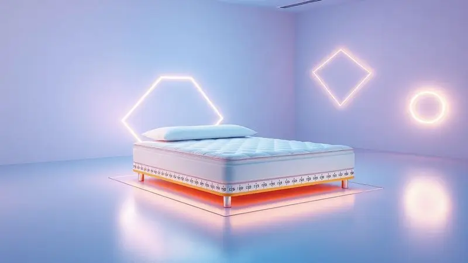
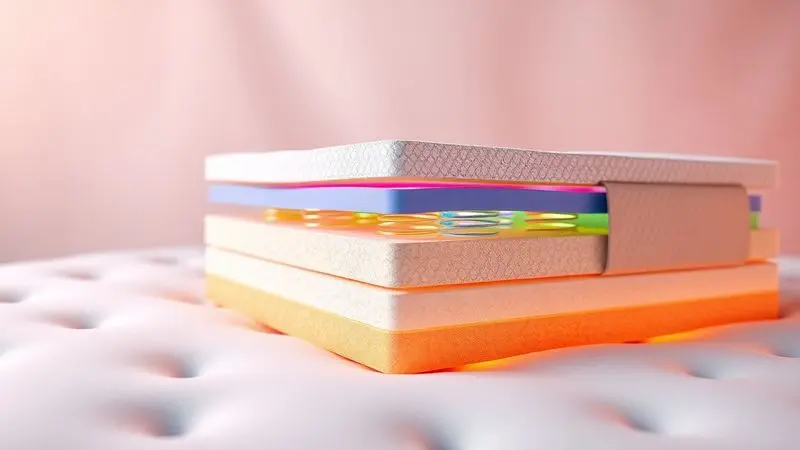

Escolher o colchão certo é o segredo para noites de sono restauradoras e saúde da coluna, mas a confusão sobre medidas e tipos é comum.

Se você está em dúvida se o colchão Queen é o ideal para o seu quarto ou se ele oferece o espaço necessário para o casal, você chegou ao lugar certo.

Neste guia definitivo, vamos revelar as medidas exatas, comparar com os tamanhos King e Casal Padrão, e ensinar você a identificar a densidade e o tipo de mola ideais para o seu biotipo. Prepare-se para transformar suas noites com a escolha perfeita.

<SummaryList products={frontmatter.top_products} />

## O que define um Colchão Queen Size?

Um colchão queen size é uma opção de cama que se destaca pelo seu tamanho, geralmente medindo 158 cm de largura por 198 cm de comprimento. Essa dimensão é ideal para casais que buscam mais espaço para dormir confortavelmente, sem abrir mão do aconchego.

Além do tamanho, a escolha do colchão também deve levar em conta o tipo de material, que pode variar entre espuma, molas ensacadas e látex, cada um oferecendo diferentes níveis de firmeza e suporte.

É importante considerar o perfil de sono e as preferências pessoais ao selecionar o colchão queen, garantindo assim uma boa noite de descanso.

## Qual a Medida do Colchão Queen? (Padrão Nacional e Variações)

No Brasil, a medida padrão é de 158 cm de largura por 198 cm de comprimento. Essa dimensão não é apenas um número, ela representa território pessoal suficiente para você se esticar naquela posição que só você entende, sem negociar com seu parceiro.

Além da medida padrão, existem variações, como colchões queen com profundidades diferentes, que podem afetar a sensação de conforto e suporte. A espessura pode influenciar diretamente na firmeza e no tipo de material utilizado.

Imagine uma cama que parece te abraçar, oferecendo suporte exatamente onde seu corpo mais precisa.

## Comparativo: Diferenças Reais entre Casal, Queen e King Size

Vamos direto ao ponto: o Casal padrão mede 138 cm de largura por 188 cm de comprimento. É a opção para quem precisa otimizar espaço ou prefere dormir bem juntinho.

O Queen salta para 158 cm x 198 cm, oferecendo aquele espaço extra que faz toda diferença quando você quer se virar sem acordar ninguém.

O King Size é o território soberano, com 193 cm x 203 cm, perfeito para quem não abre mão de espaço ou para famílias com pets e crianças que adoram invadir a cama. A escolha vai além do centímetro: é sobre como você quer se sentir ao deitar.

## Como Escolher o Colchão Queen Perfeito para seu Biotipo

Seu corpo fala, o colchão escuta. Para escolher o ideal, seu peso e altura são pistas importantes, mas suas preferências de firmeza são o verdadeiro segredo. É sobre encontrar o material que fala a mesma língua que suas costas e seus ombros.

O que você realmente precisa: um abraço macio que afunda ou um apoio firme que te mantém alinhado para acordar renovado?

### Colchões de Molas Ensacadas: Conforto Individual para Casais

Aqui está a mágica: cada mola ensacada se move de forma independente. Quando seu parceiro se vira durante a noite, você sente apenas uma suave ondulação, não um tremor que te acorda. Isso significa noites inteiras de sono, sem interrupções.

Além do conforto individual, essas molas oferecem um suporte inteligente à coluna, adaptando-se aos contornos do seu corpo. É como ter um conjunto de pequenos apoios que trabalham em equipe apenas para você.

### Colchões de Espuma: Como entender a Densidade (D33, D45)

Vamos traduzir esses números: D33 é o abraço acolhedor, mais macio e adaptável, perfeito para quem dorme de costas e busca a sensação de nuvem. D45 é o apoio firme, a estrutura que segura seu peso sem ceder, ideal para quem dorme de lado ou tem um biótipo mais robusto.

A densidade não é apenas um número técnico, ela define como seu corpo vai acordar: com dores ou com a sensação de ter descansado de verdade.

## Melhores Modelos de Colchão Queen do Mercado em 2024

Em 2024, temos opções que parecem ter lido sua mente. Desde espumas que se moldam ao seu corpo até tecnologias híbridas que combinam o melhor de dois mundos.

Cada modelo oferece uma promessa diferente: conforto que resfria, suporte que não cansa, ou uma combinação de ambos. Vamos conhecer os que realmente cumprem o que prometem.

### Colchão Queen Emma Original: Tecnologia Alemã no seu Quarto

<ProductBox 
  title={frontmatter.top_products[0].title} 
  image={frontmatter.top_products[0].image} 
  link={frontmatter.top_products[0].link} 
/>

O Emma Original traz a precisão alemã para suas noites. Suas três camadas de espuma, incluindo a inovadora Airgocell, criam uma experiência que mantém a temperatura fresca e isola movimentos como um silencioso diplomata entre casais.

Com 158x198 cm e 25 cm de altura, ele oferece espaço e suporte em firmeza média a firme, alinhando sua coluna com cuidado cirúrgico. Alguns podem encontrar essa firmeza um desafio inicial, especialmente quem busca uma sensação mais acolhedora.

Mas aqui está o segredo: a durabilidade e o suporte que ele oferece transformam seu investimento em anos de acordar sem dores. Com garantia de 10 anos e capa lavável, ele é o parceiro de sono que exige pouco e entrega muito.

### Colchão Queen Luuna Blue: Equilíbrio entre Firmeza e Maciez

<ProductBox 
  title={frontmatter.top_products[1].title} 
  image={frontmatter.top_products[1].image} 
  link={frontmatter.top_products[1].link} 
/>

O Luuna Blue é o mestre do equilíbrio. Sua construção em três camadas combina uma superfície macia que abraça seus contornos com uma base firme que diz "eu seguro você". Essa firmeza média-alva é a zona perfeita para quem não quer escolher entre conforto e suporte.

A tecnologia de resfriamento com tecido respirável funciona como um sistema de ar condicionado natural, mantendo a temperatura agradável mesmo nas noites mais quentes.

Sim, ele pode apresentar um leve odor inicial ao sair da embalagem a vácuo, como um livro novo que precisa arejar um pouco. Mas esse pequeno detalhe desaparece rápido, dando lugar a relatos reais de pessoas que acordam sem as dores que carregavam há anos.

Com 100 noites para testar e 10 anos de garantia, ele convida você a experimentar o equilíbrio.

### Colchão Queen Guldi Firm: O Melhor Custo-Benefício de Molas Ensacadas

<ProductBox 
  title={frontmatter.top_products[2].title} 
  image={frontmatter.top_products[2].image} 
  link={frontmatter.top_products[2].link} 
/>

O Guldi Firm é a prova de que qualidade não precisa custar uma fortuna. Suas molas ensacadas trabalham como um exército silencioso, oferecendo suporte firme e confortável que transforma noites agitadas em sono reparador.

Com as dimensões padrão queen (158x198x25cm), ele se encaixa perfeitamente no seu espaço e no seu orçamento.

O verdadeiro truque aqui é a tecnologia das molas ensacadas, que permite que o movimento de uma pessoa não transforme a experiência da outra em um passeio turbulento. Se você prefere um suporte mais rígido, essa firmeza será seu melhor aliado.

Para quem busca o ponto ideal entre investimento e retorno em qualidade de sono, o Guldi é o candidato que entrega mais do que promete.

## Espaço no Quarto: Como Medir e Garantir a Circulação Ideal

Antes de dizer "sim" ao Queen, vamos garantir que ele cabe não apenas na cama, mas na sua rotina. Comece medindo a área onde ele vai morar.

Lembre-se: 158 cm de largura por 198 cm de comprimento são mais do que números, são o espaço que vai definir sua liberdade de movimento. Para respirar e circular com conforto, deixe pelo menos 60 cm livres ao redor do colchão.

Isso evita aquela sensação claustrofóbica e permite que você se mova naturalmente ao acordar. Verifique também a altura do quarto e a posição das janelas e portas.

Um ambiente bem planejado não é apenas funcional, ele cria a atmosfera perfeita para o descanso que você merece.

## Acessórios Essenciais para o seu Novo Colchão Queen

Um colchão excelente merece companhias à altura. Protetores, capas e travesseiros adequados não são apenas complementos, são parceiros que prolongam a vida útil do seu investimento e transformam boas noites em noites excepcionais.

### Protetor de Colchão Queen Impermeável: Proteção contra Ácaros e Líquidos

<ProductBox 
  title={frontmatter.top_products[3].title} 
  image={frontmatter.top_products[3].image} 
  link={frontmatter.top_products[3].link} 
/>

Pense no protetor impermeável como o guardião do seu sono. Ele cria uma barreira invisível contra líquidos, ácaros, poeira e bactérias, mantendo seu colchão tão fresco quanto no primeiro dia.

Essa proteção é especialmente valiosa se você divide a cama com crianças que adoram histórias com copo de leite ou animais de estimação que consideram sua cama o território deles também.

Alguns modelos podem ser menos respiráveis, o que em climas mais quentes pode fazer diferença.

Mas a boa notícia é que os fabricantes já entenderam isso: hoje temos opções que equilibram impermeabilidade e respirabilidade, como um tecido inteligente que protege sem sufocar.

Escolha um que ofereça não apenas proteção, mas também o conforto que complementa seu colchão.

### Jogo de Cama Queen: Qualidade dos Fios e Conforto Térmico

<ProductBox 
  title={frontmatter.top_products[4].title} 
  image={frontmatter.top_products[4].image} 
  link={frontmatter.top_products[4].link} 
/>

O toque que acolhe sua pele ao deitar faz parte da magia do sono. A qualidade dos fios e o conforto térmico são os detalhes que transformam "dormir" em "ser acolhido".

A contagem de fios mede quantos fios estão entrelaçados em uma polegada quadrada, mas o segredo vai além dos números. Um jogo com 200 fios em algodão de fibra longa pode oferecer uma suavidade superior a outro com 400 fios em fibras mais curtas.

O material é tão importante quanto a contagem. Para o conforto térmico, o algodão em tramas de percal é o campeão da respirabilidade, mantendo a temperatura agradável naturalmente.

Se você busca aquecimento extra, lençóis térmicos são uma opção, mas vale pesquisar se essa necessidade faz parte da sua realidade. O que realmente importa é encontrar o tecido que conversa com sua pele e com as estações do seu ano.

## Dicas de Ouro para a Manutenção e Durabilidade do Colchão

Seu colchão é um investimento em sua saúde. Cuidar dele é cuidar de você mesmo. Comece com um protetor, seu primeiro escudo contra manchas e ácaros. A cada três meses, dê uma volta ao seu colchão girando-o, permitindo que o desgaste seja uniforme e justo.

A limpeza regular com aspirador remove a poeira invisível que se acumula, e produtos adequados cuidam das marcas do dia a dia. Evite sentar-se frequentemente nas bordas, pois essa pressão pontual pode comprometer a estrutura que tanto trabalha para te apoiar.

Com esses cuidados simples, você não está apenas prolongando a vida útil do colchão, está garantindo que ele continue oferecendo o mesmo conforto que conquistou seu coração na primeira noite.

## Conclusão: O Colchão Queen Vale a Pena para Você?

O colchão Queen não é apenas uma medida, é uma experiência. Ele representa o espaço para dormir sem negociar território, o conforto que acomoda dois corpos sem conflitos, e a tecnologia que transforma horas na cama em verdadeiro descanso.

Se seu quarto tem dimensões que abraçam essas medidas (158x198 cm com espaço para circular), e se você valoriza acordar sem dores após uma noite de movimentos livres, então sim, ele vale cada centímetro e cada investimento.

Os modelos atuais oferecem desde a precisão alemã do Emma até o equilíbrio perfeito do Luuna Blue e o custo-benefício inteligente do Guldi Firm. Mais do que escolher um colchão, você está escolhendo como vai recarregar suas energias todas as noites.

E quando o assunto é qualidade de vida, espaço para ser você mesmo e conforto genuíno, o Queen não é apenas uma opção, é uma declaração: seu sono merece o melhor.

## Perguntas Frequentes (FAQ) sobre Colchões Queen

Os colchões queen conquistaram seu lugar por oferecerem o equilíbrio perfeito entre espaço generoso e conforto acolhedor.

Com suas dimensões de 158 cm de largura por 198 cm de comprimento, eles são a resposta para casais que buscam intimidade sem aperto ou para quem simplesmente gosta de se esticar livremente.

Sobre firmeza, a variedade é ampla, desde os mais macios que parecem abraçar até os mais firmes que sustentam com precisão.

Quanto ao material, cada um tem sua personalidade: a espuma se molda ao seu corpo, o látex responde com elasticidade inteligente, e as molas ensacadas oferecem suporte individualizado.

A escolha final não é sobre especificações técnicas, mas sobre encontrar o parceiro de sono que conversa com seu corpo e com suas noites, transformando horas de descanso em verdadeira renovação.