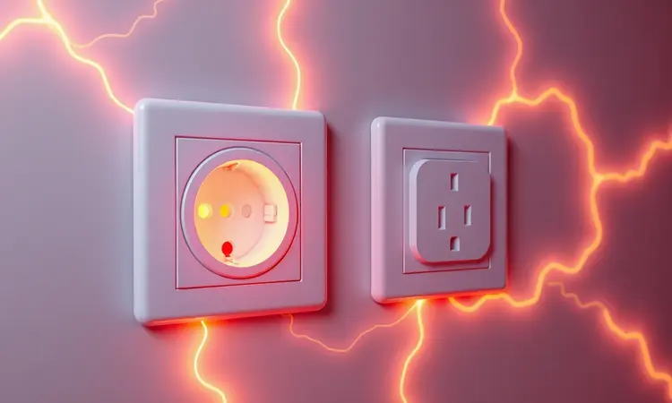
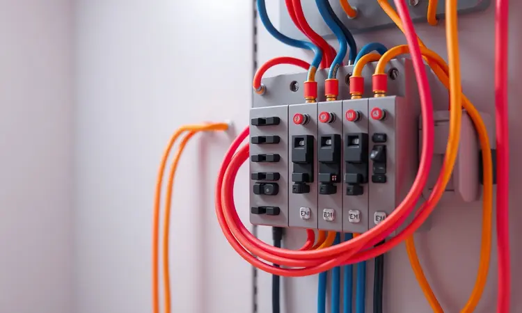

Imagine a frustração: você abre sua nova Air Fryer, quer preparar aquela receita especial, mas os pinos do plugue simplesmente não entram na tomada da parede. Não é apenas inconveniente, é um alerta de segurança.

Forçar o encaixe ou usar adaptadores comuns pode ser a porta para riscos graves em sua casa. Mas não precisa se desesperar, porque neste guia você vai descobrir exatamente o que fazer para resolver essa situação com segurança total.

Vamos transformar essa frustração inicial em tranquilidade permanente, com soluções passo a passo que garantem que você possa usar seu eletrodoméstico com total confiança.

<SummaryList products={frontmatter.top_products} />

## Por que a tomada da Air Fryer não entra no plug? O mistério dos 20A

Quando você tenta encaixar o plugue e ele resiste, isso não é um defeito do produto, mas uma proteção inteligente. Muitas Air Fryers possuem tomadas de 20 amperes (20A), projetadas especificamente para aparelhos de alta potência.

Se sua instalação tem apenas tomadas de 10A, o plugue não encaixa por uma diferença física: os pinos são maiores para evitar que você conecte um aparelho potente em uma tomada que não pode sustentar essa carga.

Essa incompatibilidade não é um problema, é um sistema de segurança que está tentando proteger você e sua família. A solução é entender essa diferença e preparar sua casa para receber o aparelho corretamente.

## Entendendo a diferença: Tomadas de 10A vs. Tomadas de 20A na prática

Agora que sabemos por que não encaixa, vamos entender na prática essa diferença que parece pequena, mas é enorme para sua segurança.

As tomadas de 10A são as mais comuns em nossas casas, perfeitas para aparelhos menores como carregadores de celular, lâmpadas ou televisores. Elas são desenhadas para uma corrente menor.

As tomadas de 20A, por outro lado, são especialistas em energia. Fritadeiras elétricas, ar-condicionados, máquinas de lavar e outras ferramentas domésticas que exigem mais força dependem desse padrão.

Quando você tenta usar um aparelho que precisa de 20A em uma tomada de 10A, o sistema não apenas não funciona, ele se torna um risco.

O superaquecimento que pode acontecer é o que transforma essa diferença técnica em um problema emocional: a ansiedade de saber que sua casa pode estar em risco.

## O perigo das 'Gambiarras': Por que nunca lixar os pinos ou usar adaptadores simples

E se você pensar em uma solução rápida? Lixar os pinos para que eles encaixem, ou usar aqueles adaptadores simples que parecem resolver tudo? Essa ideia é um caminho direto para problemas maiores.

Lixar os pinos remove a proteção física que existe entre você e um possível curto-circuito. Usar adaptadores inadequados apenas mascara o problema, permitindo que seu aparelho se conecte em uma tomada incapaz de sustentar sua potência.

### Riscos de curto-circuito e derretimento de fiação em aparelhos potentes

Quando você ignora essas proteções, o que realmente acontece? O aparelho continua exigindo sua alta potência, mas a fiação que está conectada não está preparada para isso. Fios sobrecarregados começam a se deteriorar, podendo derreter internamente sem que você perceba.

O curto-circuito que pode ocorrer não apenas danifica sua Air Fryer, ele pode iniciar uma situação mais grave dentro das paredes da sua casa. Esse risco é invisível até o momento em que se torna visível, e nesse ponto a solução será muito mais complexa e cara.

## Posso usar extensão ou 'T' na minha Air Fryer? Entenda a única opção segura

<ProductBox 
  title={frontmatter.top_products[0].title} 
  image={frontmatter.top_products[0].image} 
  link={frontmatter.top_products[0].link} 
/>

Agora que sabemos o risco das gambiarras, a próxima dúvida natural é sobre extensões ou aqueles adaptadores tipo 'T' que parecem oferecer mais flexibilidade. A resposta é clara: não é seguro utilizar extensões ou adaptadores desse tipo com sua Air Fryer.

A única opção verdadeiramente segura é conectar o aparelho diretamente em uma tomada adequada, especificamente de 20 amperes.

Extensões, mesmo aquelas que parecem robustas, introduzem um ponto extra de resistência e podem não estar dimensionadas para a corrente alta que sua fritadeira demanda.

Isso cria uma situação onde o superaquecimento pode acontecer não apenas na tomada, mas no cabo da extensão. O risco então se multiplica: danos ao eletrodoméstico, possíveis curtos-circuitos e, em casos extremos, incêndios.

Se sua residência não possui uma tomada apropriada, consultar um eletricista é a decisão mais inteligente que você pode tomar.

Esse investimento em infraestrutura elétrica não é apenas sobre funcionalidade, é sobre garantir que cada uso da sua Air Fryer acontece com tranquilidade, sabendo que sua família está protegida.

## Solução Definitiva: Como trocar a tomada comum de 10A por uma de 20A com segurança

<ProductBox 
  title={frontmatter.top_products[1].title} 
  image={frontmatter.top_products[1].image} 
  link={frontmatter.top_products[1].link} 
/>

Trocar uma tomada de 10A por uma de 20A é uma solução prática e definitiva que permite que você resolva o problema de forma permanente. Para realizar essa troca com segurança, comece sempre desligando o disjuntor correspondente à tomada que você vai trabalhar.

Teste com cuidado para confirmar que não há energia presente.

Remova a tomada antiga e examine a fiação. É crucial verificar se os fios suportam 20A, geralmente identificados pela espessura de 2,5mm². Se os fios são mais finos (1,5mm²), essa é uma etapa que não deve continuar sem apoio profissional.

A instalação da nova tomada não é complexa, mas toda segurança depende desse detalhe fundamental.

O disjuntor também precisa ser adequado. Se ele é de 20A mas a fiação não suporta essa corrente, você apenas cria uma situação onde o problema está mascarado.

Em caso de dúvida, especialmente sobre a capacidade da sua fiação, procurar um eletricista qualificado não é uma perda de tempo, é a garantia que você precisa para dormir tranquilo sabendo que sua casa está protegida.

## Fiação e Disjuntores: Como saber se sua rede elétrica suporta a carga da Air Fryer

Antes de comemorar o funcionamento da sua Air Fryer, verifique se toda a rede elétrica da sua casa está preparada para essa nova carga.

As Air Fryers geralmente variam entre 1200 e 1800 watts de potência, e isso não é apenas um número técnico, é uma exigência que sua instalação precisa sustentar.

Confira não apenas a tomada, mas o disjuntor destinado ao circuito onde o aparelho será conectado. Ele deve ser apropriado para essa carga adicional.

Se não tem certeza sobre a capacidade elétrica da sua casa, consultar um eletricista pode prevenir problemas que você nem imagina existir.

Dessa forma, você transforma uma dúvida técnica em uma certeza emocional: a segurança da sua família enquanto você prepara alimentos.

## Review: As Melhores Air Fryers do Mercado e os Requisitos Elétricos de Cada Uma

<ProductBox 
  title={frontmatter.top_products[2].title} 
  image={frontmatter.top_products[2].image} 
  link={frontmatter.top_products[2].link} 
/>

Ao escolher sua Air Fryer, além das funcionalidades e capacidades, atente-se aos requisitos elétricos como parte fundamental da decisão. As melhores opções no mercado variam em potência, geralmente entre 1400W e 2200W.

Modelos com maior potência oferecem resultados mais rápidos e consistentes, mas exigem que você tenha uma tomada exclusiva e adequada.

Idealmente, uma tomada de 20A e fiação de 2,5mm² é recomendada para evitar qualquer sobrecarga. Verifique também a voltagem da sua residência (127V ou 220V) para garantir compatibilidade total.

Alguns modelos oferecem funções adicionais como forno e desidratador, e essa versatilidade pode ser um grande diferencial para sua rotina na cozinha, mas vale lembrar que funções extras podem aumentar o consumo energético.

O manual do fabricante é seu guia mais seguro para informações detalhadas sobre seu modelo escolhido.

Consulte-o não apenas para entender as funções, mas para garantir que você está preparando sua casa para receber esse eletrodoméstico com toda a segurança que ele merece.

## Conclusão

A segurança da sua família começa antes do primeiro alimento que você prepara na Air Fryer.

Essa jornada que começou com uma frustração simples pode transformar-se em uma experiência de tranquilidade permanente quando você entende que cada detalhe técnico existe para proteger você.

Verificar a compatibilidade da tomada, garantir que sua fiação suporta a carga, evitar extensões inadequadas e consultar profissionais quando necessário são etapas que parecem pequenas, mas são enormes na construção da segurança doméstica.

Esses cuidados não apenas protegem sua família, eles prolongam a vida útil do seu eletrodoméstico, garantindo que ele funcione corretamente por muitos anos.

Agora você não apenas sabe por que os pinos não encaixavam, você sabe como resolver isso com segurança. A próxima vez que você usar sua Air Fryer, vai ser com a confiança de saber que tudo está preparado para funcionar perfeito, e que sua família está protegida.

Essa tranquilidade é o resultado final de entender que técnica e segurança sempre caminham juntas.

## FAQ: Dúvidas frequentes sobre plugues, voltagem e amperagem de Air Fryers

Quando você começa a usar sua Air Fryer, dúvidas sobre plugues, voltagem e amperagem são naturais. Verifique sempre se a voltagem do seu aparelho corresponde à da sua tomada.

As Air Fryers geralmente são disponíveis em 110V ou 220V, e utilizar um conversor quando necessário é parte fundamental da segurança.

Quanto à amperagem, a maioria dos modelos consomem entre 10 a 15 amperes. Utilize uma tomada exclusiva para evitar sobrecargas e observe sempre as instruções do fabricante para garantir uso seguro e eficiente do aparelho.

Essas dúvidas não são obstáculos, são oportunidades para construir uma experiência de uso completamente tranquila, onde você pode focar apenas na qualidade dos alimentos que está preparando.