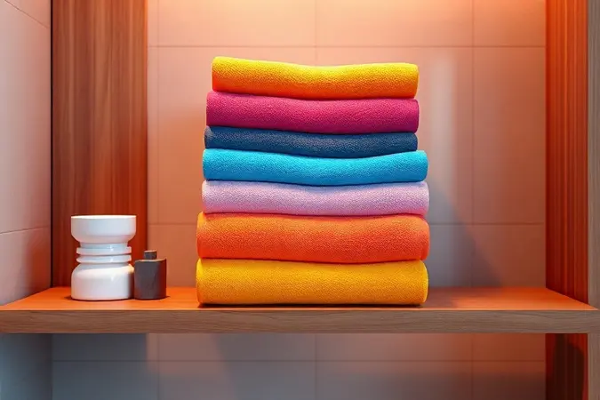

Você provavelmente concorda: não há nada melhor do que afundar o rosto em lençóis frescos que cheiram a limpeza, ou se enrolar em uma toalha macia logo após o banho. Acontece que esses pequenos prazeres diários escondem um segredo.

Enquanto você dorme ou se seca, essas peças estão acumulando células mortas, suor e micro-organismos que, longe de serem inofensivos, podem sabotar sua saúde e a qualidade do seu descanso. Este guia vai além de uma simples lista de regras.

É um mapa para transformar seu quarto e banheiro em verdadeiros santuários de bem-estar, onde cada detalhe contribui para sua paz. Prepare-se para descobrir não apenas a frequência exata de troca, mas o verdadeiro significado por trás de cada lavagem.

<SummaryList products={frontmatter.top_products} />

## Por que a Higiene das Roupas de Cama e Banho é uma Questão de Saúde?

Pense na sua cama como um ecossistema invisível. Durante a noite, você transpira, libera células da pele e cria o ambiente perfeito para convidados indesejados: ácaros e fungos.

As toalhas, por sua vez, guardam a umidade que transforma o tecido em um terreno fértil para bactérias. Não se trata apenas de frescor ou conforto estético.

Manter essas peças limpas é criar uma barreira silenciosa contra irritações na pele, alergias respiratórias que roubam seu sono e aquela sensação de cansaço que persiste mesmo após horas de repouso.

A verdadeira saúde começa nos detalhes mais íntimos do seu dia a dia, onde o cuidado com o que toca sua pele se traduz diretamente em bem-estar mental e físico.

## Qual a Frequência Ideal de Troca? O Veredito dos Especialistas

Especialistas convergem em um conselho que equilibra praticidade e proteção máxima. A régua de ouro é: troque sua roupa de cama a cada uma ou duas semanas, e suas toalhas de banho a cada três ou quatro dias. Esses números não são arbitrários.

Eles representam o ponto ideal onde você interrompe o ciclo de multiplicação de ácaros e bactérias antes que se tornem um problema sensível.

Imagine criar um ritual onde, em vez de uma tarefa doméstica, a troca se transforma em um ato de renovação para seu espaço pessoal.

### Lençóis e Fronhas: O perigo invisível do acúmulo de ácaros

Se pudéssemos ver o que acontece entre seus lençóis durante a noite, faríamos as trocas com muito mais entusiasmo.

Ácaros microscópicos encontram ali um verdadeiro banquete de células mortas da pele, criando colônias que são gatilhos potentes para espirros, coceiras e noites mal dormidas. A frequência ideal? Uma vez por semana.

Lavar em água quente (pelo menos 60°C) é como mandar esses hóspedes indesejados embora de vez. O resultado vai além da higiene. É acordar sem aquela coceira no nariz, respirar profundamente e sentir que seu quarto realmente se tornou um refúgio puro.

### Toalhas de Banho: Quantas vezes usar antes de lavar?

Aquela toalha macia que você usa para se secar guarda um paradoxo. Mesmo limpa, ela retém umidade residual que, em contato com restos de pele, cria o ambiente perfeito para bactérias se multiplicarem. Após três ou quatro usos, esse equilíbrio se rompe.

Você percebe o primeiro sinal no cheiro, um aroma abafado que surge mesmo sem suor aparente. Lavar nesse ponto significa restaurar a capacidade de absorção e, mais importante, garantir que o que toca sua pele após o banho seja genuinamente limpo, não apenas enxuto.

### Toalhas de Rosto: Por que elas precisam de atenção redobrada?

Pense no ritual da sua pele pela manhã. Você limpa, hidrata, cuida. Agora imagine usar uma toalha que, por três dias consecutivos, acumulou resíduos de produtos, células mortas e bactérias. É como sabotar todo o seu cuidado com a pele.

Por isso, as toalhas de rosto pedem trocas mais frequentes. A cada dois ou três dias, especialmente se sua pele é oleosa ou propensa à acne. Essa atenção redobrada não é exagero.

É garantir que o último passo do seu ritual de beleza não se torne o primeiro passo para poros obstruídos e irritações.

## Itens que Você Deve Considerar para Facilitar a Higiene

A facilidade começa na escolha certa. Alguns tecidos e produtos foram feitos para transformar a manutenção da higiene de uma batalha em um processo quase intuitivo.

A pergunta certa não é apenas 'o que é mais bonito', mas 'o que vai me ajudar a manter o frescor com menos esforço no dia a dia'.

### Jogos de Lençol 100% Algodão: Respirabilidade e Conforto

<ProductBox 
  title={frontmatter.top_products[0].title} 
  image={frontmatter.top_products[0].image} 
  link={frontmatter.top_products[0].link} 
/>

Imagine deitar em lençóis que respiram com você. É exatamente essa a experiência que o algodão 100% puro oferece. Em noites quentes, ele permite que o ar circule, prevenindo aquela sensação abafada que te faz virar a noite inteira.

Em noites frias, ele aquece sem sufocar. Mas há um benefício menos óbvio, especialmente importante para nossa conversa sobre higiene.

Tecidos naturais como o algodão tendem a liberar sujeira com mais facilidade na lavagem e secam de forma mais uniforme, tornando o ciclo de limpeza mais eficiente.

O investimento inicial compensa com juros: menos trocas por desgaste e um conforto que perdura lavagem após lavagem.

### Toalhas de Banho de Alta Gramatura: Absorção e Durabilidade

<ProductBox 
  title={frontmatter.top_products[1].title} 
  image={frontmatter.top_products[1].image} 
  link={frontmatter.top_products[1].link} 
/>

Há uma diferença abissal entre se secar e se envolver em um abraço acolhedor. Toalhas com gramatura acima de 500 g/m² realizam essa magia.

Sua densidade extraordinária significa que cada fio trabalha para remover a umidade do seu corpo em segundos, deixando aquela sensação de limpeza absoluta. Sim, elas podem levar um pouco mais para secar, mas pense nisso como um compromisso pela qualidade.

O que você ganha em troca é uma experiência de spa dentro de casa e uma durabilidade que desafia o tempo. Cada vez que você pega uma toalha assim, percebe como pequenos luxos transformam rotinas simples em momentos de prazer.

### Protetores de Colchão Impermeáveis: A primeira barreira de proteção

<ProductBox 
  title={frontmatter.top_products[2].title} 
  image={frontmatter.top_products[2].image} 
  link={frontmatter.top_products[2].link} 
/>

Seu colchão é o maior investimento do seu quarto, e um protetor impermeável é seu seguro mais inteligente. Pense nele como um guardião silencioso que trabalha enquanto você dorme. Derramou água? Umidade do suor? Manchas inesperadas?

Ele absorve o impacto, protegendo o núcleo do seu colchão contra mofo, ácaros e odores. Os modelos atuais são feitos para serem imperceptíveis. Respirabilidade avançada significa que você não troca conforto por proteção.

A manutenção é simples, sendo que a maioria pode ser lavada junto com seus lençóis, criando um sistema completo de defesa para seu sono.

## Situações que Exigem Trocas mais Frequentes: Verão, Pets e Alergias

A vida real raramente segue um calendário perfeito. No verão, quando o calor transforma cada noite em uma batalha contra a transpiração, adiantar a troca para a cada cinco ou seis dias pode ser a diferença entre acordar revigorado ou exausto.

Se você divide a cama com pets, seus companheiros de quatro patas trazem amor, mas também pelos e partículas que demandam atenção extra. Nestes casos, encurtar o ciclo é um ato de cuidado mútuo. Para quem vive com alergias, essa atenção se torna ainda mais pessoal.

Trocar lençóis a cada três ou quatro dias não é exagero. É criar uma zona de segurança onde você pode descansar sem medo de reações alérgicas roubarem seu sono precioso.

## Guia de Lavagem: Como Higienizar Corretamente para Eliminar Bactérias

Lavar não é apenas jogar as peças na máquina. É um ritual de renovação. Sempre comece dando uma olhada nas etiquetas, que são como o manual de instruções de cada tecido. Quando possível, opte por água quente (acima de 60°C).

Essa temperatura é como um botão de reset que elimina a maior parte das bactérias e ácaros que resistem a ciclos mais frios. Use detergente de qualidade, mas sem exageros. Sabão em excesso pode deixar resíduos que, ironicamente, atraem mais sujeira.

O segredo final está na secagem. Seque completamente ao sol sempre que possível. A luz ultravioleta é um desinfetante natural e gratuito que deixa um cheiro de frescor impossível de reproduzir em máquinas.

## 5 Erros Comuns que Destroem a Vida Útil das suas Peças

Alguns hábitos parecem inofensivos, mas agem como pequenos sabotadores da durabilidade das suas peças preferidas. O primeiro é a temperatura extrema. Lavar em água fervendo pode danificar fibras, especialmente em tecidos delicados.

O segundo é a overdose de sabão, que não lava mais, apenas cria uma película pegajosa. O terceiro pecado é a secagem brutal. Secadoras em temperatura máxima podem encolher tecidos naturalmente, transformando sua toalha favorita em um paninho.

O quarto erro é a rotina previsível. Usar sempre o mesmo jogo de lençóis desgasta ele de forma desigual. Por fim, o maior inimigo: armazenar ainda úmido. É a receita perfeita para aquele cheiro de mofo que nunca mais sai completamente.

## Quando é Hora de Comprar Novos? Sinais de que a Vida Útil Acabou

As peças falam. Você só precisa aprender a ouvir. Manchas que resistem a múltiplas lavagens não são apenas máculas estéticas. São sinais de que o tecido perdeu sua capacidade de liberar sujeira.

Um desgaste visível nas bordas, fios puxando ou áreas ralas são como rugas do tecido, mostrando que a estrutura está comprometida. O cheiro é o mais revelador.

Se após lavar e secar completamente você ainda sente aquele odor abafado, as fibras provavelmente estão saturadas de resíduos impossíveis de remover. Para quem tem alergias, preste atenção ao seu corpo.

Se suas reações pioram mesmo com lavagem frequente, suas peças podem ter se tornado reservatórios de alérgenos. Trocar não é desperdício. É reconhecer que cuidar de você também significa renovar o que te envolve.

## Conclusão

Transformar a higiene das suas roupas de cama e banho de uma obrigação para um ritual de autocuidado é uma das mudanças mais poderosas que você pode fazer na sua rotina doméstica.

Não se trata apenas de seguir um calendário, mas de criar uma relação diferente com os objetos que tocam sua pele todos os dias. Cada troca semanal de lençóis se torna um momento de renovar seu compromisso com um sono de qualidade.

Cada toalha fresca é uma promessa de começar o dia com sensação de pureza. Os benefícios se multiplicam.

Você dorme melhor, acorda mais descansado, sua pele respira mais fácil e, quase sem perceber, sua casa se transforma em um ambiente que verdadeiramente nutre seu bem-estar. Comece pequeno. Escolha um item deste guia para implementar esta semana. Sinta a diferença.

Depois, deixe esse cuidado se espalhar naturalmente para todos os cantos do seu lar.

## Perguntas Frequentes (FAQ)

Com que frequência devo trocar minha roupa de cama?
O ideal é a cada uma ou duas semanas. Se você transpira muito, tem alergias ou pets que dormem na cama, reduza para a cada cinco a sete dias.

E as toalhas de banho?
Após três a quatro usos. Uma dica prática: tenha pelo menos três toalhas em rodízio para nunca precisar usar uma que não esteja completamente seca e fresca.

Preciso trocar tudo quando estiver resfriado?
Absolutamente. Durante doenças, seu sistema imunidade está comprometido e os germes se multiplicam rapidamente nos tecidos. Trocar lençóis e toalhas diariamente durante um resfriado forte pode acelerar sua recuperação.

Água quente realmente faz diferença?
Faz toda a diferença. Temperaturas acima de 60°C eliminam a maioria dos ácaros e bactérias que resistem a lavagens frias. Reserve essa temperatura para lençóis e toalhas brancas ou de cores muito resistentes.

Por que minhas toalhas ainda cheiram mesmo depois de lavadas?
Provavelmente por excesso de sabão que não foi completamente removido ou por secagem inadequada. Experimente um ciclo extra de enxágue na lavagem e sempre seque completamente ao sol quando possível.