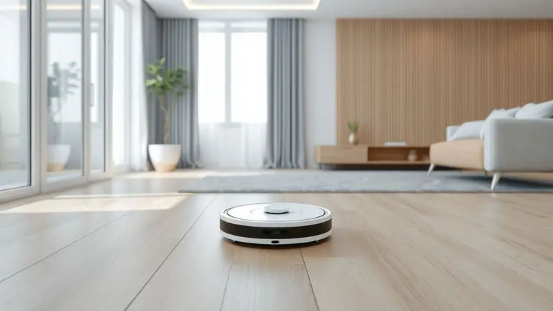
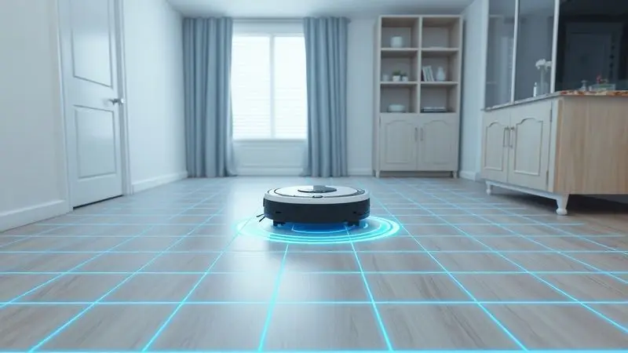
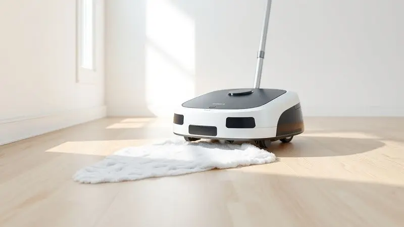
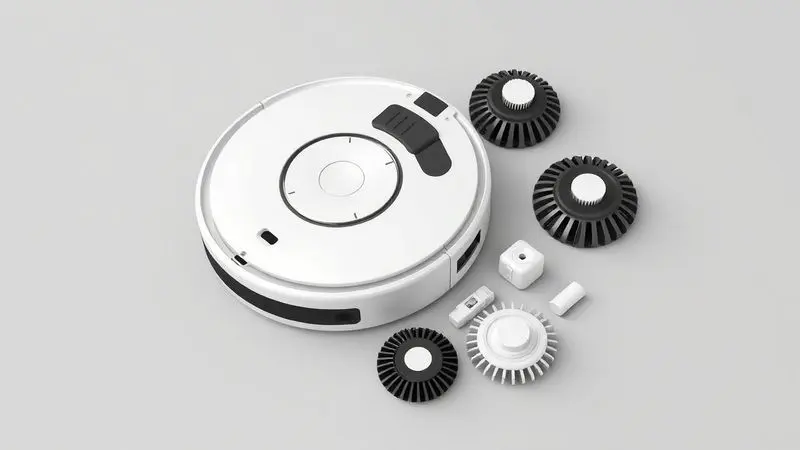

Imagina acordar em uma casa que parece ter sido limpa por uma fada madrinha, sem você ter levantado um dedo? Essa fantasia tornou-se realidade com os robôs aspiradores 3 em 1, que combinam varrer, aspirar e passar pano em uma única passada autônoma.

Mas com tantas opções no mercado, desde modelos básicos até os mais tecnológicos, como escolher o parceiro perfeito para sua rotina?

Preparamos um guia completo com os melhores modelos de 2025, analisando não apenas números e especificações, mas como cada um se encaixa no seu dia a dia real, ajudando você a transformar a limpeza de um trabalho cansativo em uma tarefa que simplesmente acontece por conta própria.

<SummaryList products={frontmatter.top_products} />

## Melhores robôs aspiradores multiuso para comprar agora

De modelos de entrada perfeitos para quem está começando sua jornada na automação doméstica, até opções premium que aprendem cada centímetro da sua casa, conheça os robôs que estão revolucionando a forma como cuidamos dos nossos lares.

### 1. Robô aspirador Multilaser Eclipse HO410

<ProductBox 
  title={frontmatter.top_products[0].title} 
  image={frontmatter.top_products[0].image} 
  link={frontmatter.top_products[0].link} 
/>

Para quem está dando os primeiros passos no mundo da limpeza automatizada e busca um equilíbrio entre funcionalidade e investimento inicial, o Eclipse HO410 é como ter um ajudante discreto e eficiente.

Com 1h30 de autonomia, ele permite que sua casa fique limpa enquanto você trabalha ou relaxa, alcançando até mesmo os espaços mais apertados sob os móveis, graças ao seu design compacto.

Seu sistema anti-queda oferece paz de espírito em lares com desníveis, e a função 3 em 1 significa que você não precisa alternar entre diferentes aparelhos. A limpeza é contínua e sem interrupções.

Apenas lembre-se de que sua função de passar pano funciona mais como um complemento para a poeira fina, e que a recarga é manual, conectando o cabo diretamente no robô.

<CaixaProsContras>

**Prós:**

- Funcionalidade 3 em 1: varre, aspira e passa pano.

- Bivolt e adequado para diferentes voltagens.

- Eficiente na remoção de pelos de animais.

- Design compacto que alcança áreas difíceis.

**Contras:**

- Mop funciona como um reforço, sem limpeza profunda.

- Não possui base de recarga automática.

</CaixaProsContras>

### 2. Robô aspirador WAP Robot W90

<ProductBox 
  title={frontmatter.top_products[1].title} 
  image={frontmatter.top_products[1].image} 
  link={frontmatter.top_products[1].link} 
/>

Com apenas 8cm de altura, o WAP Robot W90 é o especialista em entrar onde outros não conseguem. Imagine ele trabalhando silenciosamente sob seu sofá ou cama, removendo a poeira que acumula há meses e que você jamais alcançaria com um aspirador tradicional.

Sua autonomia de 1h40 permite que ele limpe ambientes médios de forma completa, e o filtro HEPA lavável é uma bênção para quem sofre com alergias.

Os diferentes modos de limpeza, como aleatório e espiral, fazem com que ele se adapte à disposição dos seus móveis, cobrindo cada canto sem que você precise guiá-lo manualmente.

Apenas considere que ele pode ter dificuldades em tapetes muito grossos ou fofos, preferindo pisos frios e madeira onde seu desempenho realmente brilha.

<CaixaProsContras>

**Prós:**

- Várias funções em um único aparelho: varre, aspira e passa pano.

- Compacto e acessível para locais difíceis.

- Filtro lavável com tecnologia HEPA, ótimo para alérgicos.

- Diferentes modos de limpeza para se adaptar ao ambiente.

**Contras:**

- Dificuldades em locomoção sobre tapetes altos.

- Não aspira água, limitado a sujeiras secas.

</CaixaProsContras>

### 3. Robô aspirador WAP Robot W100

<ProductBox 
  title={frontmatter.top_products[2].title} 
  image={frontmatter.top_products[2].image} 
  link={frontmatter.top_products[2].link} 
/>

Ainda mais compacto com seus 7,5cm, o W100 é como ter um ajudante minúsculo que conhece cada centímetro do seu chão.

Suas escovas giratórias são projetadas para alcançar os cantos onde a poeira adora se acumular, enquanto os sensores infravermelhos garantem que ele não vá cair de escadas ou bater nos seus móveis favoritos.

Com a mesma autonomia robusta do irmão W90, ele oferece a mesma liberdade de limpar enquanto você cuida de outras coisas.

A ausência de base de carregamento automático significa que você precisará lembrar de conectá-lo após o uso, mas para muitos, essa pequena tarefa é um preço justo por um equipamento tão eficiente a um custo acessível.

<CaixaProsContras>

**Prós:**

- Design compacto que facilita o acesso a locais difíceis.

- Função 3 em 1: varre, aspira e passa pano.

- Sensores que evitam quedas e colisões.

- Escovas giratórias para limpeza eficaz dos cantos.

**Contras:**

- Não possui base de carregamento automático.

- Sem inteligência artificial ou mapeamento.

</CaixaProsContras>

### 4. Robô aspirador Positivo PRA100

<ProductBox 
  title={frontmatter.top_products[3].title} 
  image={frontmatter.top_products[3].image} 
  link={frontmatter.top_products[3].link} 
/>

O que acontece quando você combina a praticidade de um robô com a inteligência da sua casa? O Positivo PRA100 responde essa pergunta, conectando-se ao Wi-Fi para que você o controle via aplicativo ou simplesmente diga "Alexa, limpa a sala" e veja a mágica acontecer.

É a conveniência que você nem sabia que precisava.

Com filtro HEPA que captura 99,9% das partículas alérgicas, ele não apenas limpa o chão, mas melhora a qualidade do ar que você respira.

A única ressalva é que para usar a função de passar pano, você precisará adquirir um reservatório de água separadamente, o que permite personalizar a experiência conforme suas necessidades específicas.

<CaixaProsContras>

**Prós:**

- Função 3 em 1: varre, aspira e passa pano.

- Controle por aplicativo e comandos de voz.

- Sensores inteligentes para navegação segura.

- Filtro HEPA que ajuda na remoção de alérgenos.

**Contras:**

- A função de passar pano exige um tanque híbrido adquirido separadamente.

- Não possui mapeamento de área ou barreiras virtuais.

</CaixaProsContras>

### 5. Robô aspirador Karcher RCV 1

<ProductBox 
  title={frontmatter.top_products[4].title} 
  image={frontmatter.top_products[4].image} 
  link={frontmatter.top_products[4].link} 
/>

Quando o sobrenome é sinônimo de limpeza profissional, as expectativas são altas. O Karcher RCV 1 entrega essa herança em um formato compacto de 7cm que não apenas limpa, mas consegue subir degraus de até 10mm, algo que poucos concorrentes conseguem.

É como ter um alpinista profissional para os desafios do seu piso.

Com três modos de limpeza diferentes, você pode pedir para ele focar nos cantos, trabalhar de forma automática ou concentrar-se em áreas específicas. O retorno automático à base quando a bateria está baixa é um detalhe que demonstra a atenção ao usuário.

A desvantagem é que sem mapeamento, ele pode acabar passando duas vezes em algumas áreas, mas nunca deixará nenhuma esquecida.

<CaixaProsContras>

**Prós:**

- Versatilidade com funções 3 em 1: varre, aspira e passa pano.

- Design compacto que permite acesso a locais difíceis.

- Autonomia de 90 minutos com retorno automático à base.

- Sensores anti-queda para proteger o robô e os móveis.

**Contras:**

- Não possui mapeamento do ambiente, podendo repetir áreas.

- Pode ser menos eficiente em carpetes muito grossos.

</CaixaProsContras>

### 6. Robô aspirador Liectroux XR500

<ProductBox 
  title={frontmatter.top_products[5].title} 
  image={frontmatter.top_products[5].image} 
  link={frontmatter.top_products[5].link} 
/>

Se você procura o que há de mais avançado em tecnologia de limpeza, o Liectroux XR500 é como dar ao seu robô um doutorado em navegação.

Com tecnologia a laser que mapeia cada detalhe da sua casa, ele não apenas limpa, mas aprende o layout do seu espaço, criando rotas perfeitas e evitando repetições desnecessárias.

Sua potência de sucção de 6500 Pa é a equivalente a um aspirador tradicional de alta performance, garantindo que até os detritos mais teimosos desapareçam. As 2 horas de autonomia combinadas com a recarga automática significam que nem mesmo casas grandes são um desafio.

O investimento é maior, mas para quem valoriza eficiência máxima, cada centavo vale a pena.

<CaixaProsContras>

**Prós:**

- Tecnologia 3 em 1 (varre, aspira e passa pano)

- Navegação a laser com mapeamento da casa

- Alta potência de sucção (6500 Pa)

- Controle via aplicativo e compatibilidade com assistentes virtuais

**Contras:**

- Pode ter um preço elevado

- A configuração inicial pode ser complexa para alguns usuários

</CaixaProsContras>

### 7. Xiaomi Vacuum S10

<ProductBox 
  title={frontmatter.top_products[6].title} 
  image={frontmatter.top_products[6].image} 
  link={frontmatter.top_products[6].link} 
/>

Misturando o design minimalista que a Xiaomi domina com uma performance sólida, o Vacuum S10 é para quem quer tecnologia de ponta sem pagar fortunas.

Sua navegação a laser LDS faz com que ele conheça sua casa melhor do que alguns visitantes, e os 4000 Pa de sucção garantem que nenhuma partícula de poeira escape.

Com 130 minutos de autonomia, ele pode limpar sua casa do térreo enquanto você trabalha no home office, tudo controlável pelo smartphone.

A função de passar pano com três níveis de água permite ajustar conforme a necessidade, embora em áreas muito grandes você precise ficar de olho no reservatório.

<CaixaProsContras>

**Prós:**

- Excelente capacidade de sucção.

- Navegação eficiente com tecnologia a laser.

- Integração com app para controle remoto.

- Boa autonomia de bateria.

**Contras:**

- Pode ser barulhento em modos altos.

- Necessita de manutenção regular para desempenho ideal.

</CaixaProsContras>

### 8. Neatsvor X600

<ProductBox 
  title={frontmatter.top_products[7].title} 
  image={frontmatter.top_products[7].image} 
  link={frontmatter.top_products[7].link} 
/>

Imagine um robô que não apenas limpa seu piso, mas decide exatamente quanto de água usar em cada área, graças ao tanque controlado eletronicamente.

O Neatsvor X600 oferece essa precisão cirúrgica combinada com navegação LiDAR que cria mapas tão detalhados que você poderia usá-los para decorar.

Com autonomia impressionante de 2h30, ele é o parceiro ideal para casas grandes ou quem simplesmente não quer se preocupar com recargas frequentes.

A potência de sucção ajustável entre 3000Pa e 6000Pa significa que você pode ter uma limpeza suave nos dias normais ou ligar o modo turbo quando as crianças fazem uma festa.

<CaixaProsContras>

**Prós:**

- Eficiência na limpeza multipla (varre, aspira e passa pano)

- Tecnologia de navegação LiDAR

- Boa potência de sucção

- Controle através de aplicativo e por voz

**Contras:**

- Capacidade do reservatório de água pode ser limitada

- Nível de ruído pode ser notável em ambientes muito silenciosos

</CaixaProsContras>

### 9. Ropo Glass 3

<ProductBox 
  title={frontmatter.top_products[8].title} 
  image={frontmatter.top_products[8].image} 
  link={frontmatter.top_products[8].link} 
/>

O que diferencia o Ropo Glass 3 não é apenas o que ele remove, mas o que ele deixa para trás: um ambiente não apenas limpo, mas sanitizado. A tecnologia UV integrada age como um escudo invisível contra vírus e bactérias, destruindo seu DNA enquanto o robô trabalha.

É a paz de espírito em formato tecnológico.

Com três níveis de sucção e controle por aplicativo que permite monitorar tudo em tempo real, ele oferece controle total sobre o processo de limpeza.

O fato de não salvar mapeamentos pode ser uma desvantagem para alguns, mas seu peso mais robusto reflete a qualidade e durabilidade das peças internas.

<CaixaProsContras>

**Prós:**

- Tecnologia UV para esterilização eficaz.

- Potente sistema de sucção com três níveis.

- Controle por aplicativo para monitoramento em tempo real.

- Design que se integra bem à decoração.

**Contras:**

- O peso pode dificultar o manuseio.

- Não salva o mapeamento do ambiente.

</CaixaProsContras>

## Qual Comprar?

Depois de conhecer essas opções incríveis, como decidir qual robô é o seu parceiro ideal? Pense na sua rotina real: você tem animais que soltam muitos pelos? Prefere programar limpezas pelo smartphone? Seu piso é principalmente de madeira ou tem muitos tapetes?

A verdadeira escolha não está apenas nas especificações técnicas, mas em como essas características se traduzem no seu dia a dia.

Para a maioria das pessoas, a combinação ideal envolve potência de sucção suficiente para seu tipo de piso, autonomia que cubra sua casa sem interrupções, e tecnologias que simplifiquem ao invés de complicar.

Modelos com mapeamento são transformadores para espaços maiores ou com layouts complexos, enquanto funções extras como controle por voz são o tempero que torna a experiência ainda mais mágica.

## O que é robô aspirador com mapeamento?

Imagine dar ao seu robô um mapa da sua casa e explicar exatamente quais áreas priorizar e quais evitar.

Isso é exatamente o que a tecnologia de mapeamento faz: usando sensores, câmeras ou lasers, o aparelho cria um modelo virtual do seu espaço, memorizando onde estão os móveis, as paredes e até mesmo onde você não quer que ele vá.

Essa inteligência significa que ele não trabalha aleatoriamente, mas segue uma rota lógica que cobre cada centímetro uma única vez, economizando tempo e bateria.

Alguns modelos mais avançados permitem que você desenhe virtualmente no mapa da casa, criando zonas de exclusão ou priorizando áreas específicas para limpeza extra.

## Como escolher o melhor robô aspirador e passa pano em 2025?

Escolher o robô certo vai além de comparar números numa tabela. É sobre entender como cada característica se transforma em benefícios reais para sua vida.

### Potência de Sucção

Os números em Pascal (Pa) podem parecer técnicos, mas traduzem-se diretamente na sensação de passar o pé descalzo em um piso realmente limpo.

Potências mais altas significam que o robô consegue remover a areia do parquinho que seus filhos trouxeram, os pelos do seu pet que se entranham nos tapetes, e até mesmo os grãos de açúcar que caíram na cozinha.

Não é apenas sobre força bruta, mas sobre alcançar uma limpeza que você notará imediatamente.

### Eficiência do MOP

A função de passar pano transforma um robô de bom para excepcional. Mas atenção: nem todos os mops são criados iguais. Alguns são apenas um complemento para a poeira fina, enquanto outros oferecem limpeza profunda com água controlada.

Considere quanto você realmente precisa dessa função: se você já passa pano regularmente manualmente, um robô com mop eficiente pode reduzir significativamente essa tarefa. Se você raramente passa pano, talvez essa função seja menos decisiva na sua escolha.

### Bateria

A autonomia define a quantidade de liberdade que você terá. Uma bateria que dura 60 minutos pode ser suficiente para um apartamento pequeno, enquanto casas maiores exigem 120 minutos ou mais.

O verdadeiro diferencial, porém, está na recarga automática: modelos que retornam sozinhos à base quando a bateria está fraca e depois retomam a limpeza de onde pararam são como ter um trabalhador que nunca tira férias.

### Recursos adicionais

Wi-Fi e controle por aplicativo parecem luxos até você experimentar programar uma limpeza enquanto está no trabalho e chegar em casa com os pisos impecáveis.

Compatibilidade com assistentes de voz adiciona uma camada de magia ao processo, onde um simples comando verbal inicia a limpeza.

Funcionalidades como agendamento inteligente, que considera seus horários e rotinas, transformam o robô de um eletrodoméstico em um membro da família que conhece seus hábitos.

## Como funciona o mapeamento do robô aspirador?

O processo começa com a primeira limpeza, onde o robô age como um explorador mapeando cada canto do território. Sensores identificam paredes, móveis, degraus e mudanças no piso.

Essas informações se transformam em um mapa digital que o robô consulta em todas as limpezas subsequentes, otimizando suas rotas e evitando áreas já limpas.

A beleza dessa tecnologia está na adaptabilidade: se você muda a disposição dos móveis, o robô atualiza seu mapa, aprendendo com as mudanças no ambiente.

É essa capacidade de aprender e se adaptar que diferencia fundamentalmente um robô com mapeamento de um que apenas anda aleatoriamente.

## Robô aspirador com mapeamento vale a pena?

A resposta depende do que você valoriza: tempo ou dinheiro inicial? Robôs com mapeamento custam mais, mas oferecem eficiência que se traduz em horas economizadas a cada semana.

Em vez de passar várias vezes no mesmo lugar ou ignorar cantos difíceis, eles limpam de forma sistemática e completa.

Se você tem uma casa com vários cômodos, muitos móveis ou áreas que não quer que sejam limpas (como a área do cachorro ou um tapete especial), o mapeamento transforma a experiência.

Para apartamentos pequenos e simples, um modelo básico pode ser suficiente, mas para quem busca automação verdadeira, o mapeamento é o divisor de águas entre um brinquedo tecnológico e um assistente doméstico sério.

## Dicas para usar seu robô aspirador que passa pano

Para extrair o máximo do seu novo parceiro de limpeza, comece preparando o terreno: retire objetos pequenos do chão e certifique-se de que os cabos estão organizados.

Programe as limpezas para horários em que você normalmente está fora ou ocupado, transformando a tarefa em algo que acontece naturalmente no fundo da sua rotina.

Mantenha os compartimentos de água e sujeira limpos, e verifique periodicamente os sensores e escovas para garantir que nada esteja obstruindo seu desempenho.

Lembre-se de que mesmo os robôs mais inteligentes precisam de uma ajudinha ocasional, como remover um obstáculo inesperado ou esvaziar o reservatório após uma limpeza particularmente intensa.

## Quais produtos usar no pano do robô aspirador?

A regra de ouro é simplicidade. Use soluções específicas para robôs ou detergentes neutros diluídos adequadamente. Evite produtos químicos agressivos que podem danificar o mecanismo interno ou deixar resíduos nos seus pisos.

Panos de microfibra são ideais por sua capacidade de reter sujeira sem deixar fiapos, e mantê-los limpos e trocados regularmente garante que cada limpeza seja tão eficiente quanto a primeira.

## Perguntas frequentes

### O que acontece se o robô aspirador ficar sem bateria no meio da limpeza?

A maioria dos modelos modernos é projetada para essa situação. Eles param de funcionar e automaticamente retornam à sua base de carregamento seguindo o caminho mais curto possível.

Uma vez recarregados, muitos conseguem retomar a limpeza exatamente de onde pararam, garantindo que nenhuma área fique esquecida. É como ter um trabalhador responsável que nunca deixa um serviço pela metade.

### Posso controlar meu robô aspirador remotamente?

Absolutamente. A maioria dos modelos oferece controle via aplicativo que permite iniciar, pausar ou programar limpezas de qualquer lugar com internet. Alguns vão além, permitindo que você monitore em tempo real onde o robô está e quanto do trabalho já foi concluído.

Compatibilidade com assistentes de voz como Alexa e Google Assistant adiciona conveniência para comandos rápidos no dia a dia.

### Como faço a manutenção do meu robô aspirador?

Pense na manutenção como cuidar de um bom parceiro de trabalho. Limpe os filtros regularmente para manter a sucção potente, remova pelos e fios das escovas após cada uso, e esvazie o reservatório de sujeira antes que esteja completamente cheio.

Manter os sensores limpos garante que o robô navegue com precisão, e atualizações de software podem trazer melhorias de performance que você nem sabia que eram possíveis.

### Os robôs aspiradores são barulhentos?

São significativamente mais silenciosos do que aspiradores tradicionais, geralmente produzindo um ruído comparável a uma conversa normal (60-70 decibéis).

Em modos mais potentes podem ser mais audíveis, mas a maioria oferece um modo silencioso para horários em que o som seria inconveniente. A verdadeira vantagem é programá-los para limpar quando você não está em casa, tornando o ruído irrelevante.

### Quanto tempo dura a bateria de um robô aspirador?

A duração varia de 60 a 180 minutos dependendo do modelo e configurações. Fatores como tipo de piso (carpetes exigem mais energia), potência da sucção selecionada e até mesmo a idade da bateria influenciam no resultado.

A boa notícia é que a maioria oferece recarga automática, então mesmo que a bateria acabe no meio da limpeza, o robô se encarrega de recarregar e retomar o trabalho.

### O robô aspirador pode limpar tapetes e pisos duros?

Sim, os modelos modernos são especialistas em ambas as superfícies. Sensores detectam automaticamente quando passam de um piso duro para um tapete, ajustando a potência da sucção para ser mais potente nos tapetes e mais suave nos pisos delicados.

Muitos também ajustam a função de passar pano, desativando-a automaticamente sobre tapetes para evitar umidade indesejada.

### Como funcionam as zonas de exclusão?

Através do aplicativo, você pode desenhar virtualmente áreas que deseja que o robô evite. Essas zonas podem ser permanentes (como a área do vaso do seu gato) ou temporárias (como uma caixa que ficará no chão por alguns dias).

O robô memoriza essas áreas e simplesmente as contorna durante a limpeza, demonstrando uma compreensão contextual do seu espaço que vai muito além de uma simples limpeza automatizada.

## Conclusão

Escolher o robô aspirador 3 em 1 ideal é menos sobre comparar especificações técnicas e mais sobre encontrar o parceiro que melhor se adapta ao ritmo da sua vida.

Cada modelo que apresentamos oferece uma proposta única: desde opções acessíveis para quem está começando sua jornada na automação doméstica, até tecnologias de ponta que aprendem e se adaptam ao seu espaço como um membro da família.

O verdadeiro valor desses dispositivos vai além de limpar pisos; está na liberdade que eles oferecem. Liberdade para dedicar seu tempo ao que realmente importa, sabendo que sua casa está sendo cuidadosamente mantida.

Liberdade para chegar em um ambiente que não apenas parece limpo, mas que sente-se limpo sob seus pés. É uma pequena revolução doméstica que começa com um simples toque no smartphone e termina com mais horas no seu dia e menos preocupações na sua mente.

Qual será o primeiro canto da sua casa que seu novo parceiro de limpeza irá explorar?