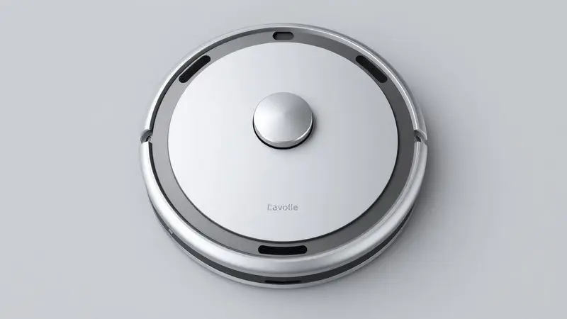
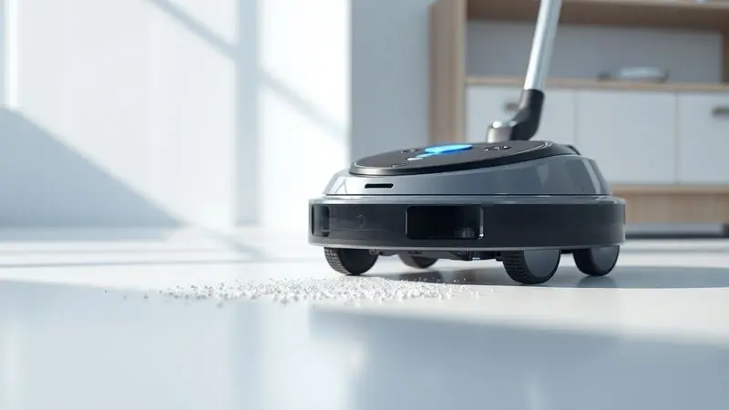
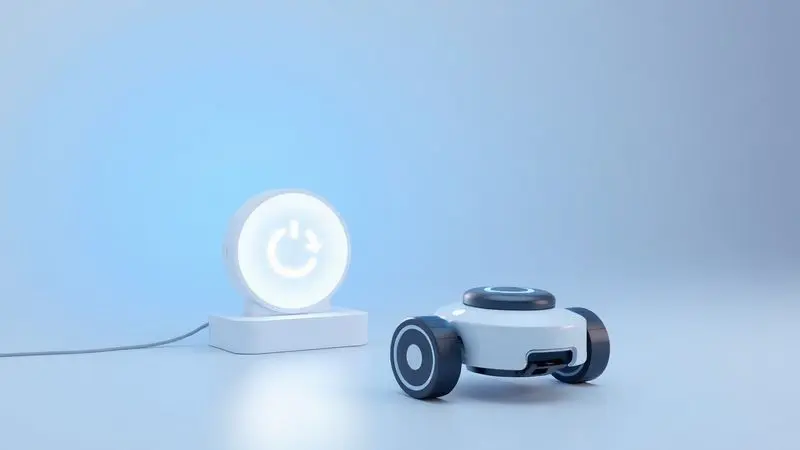
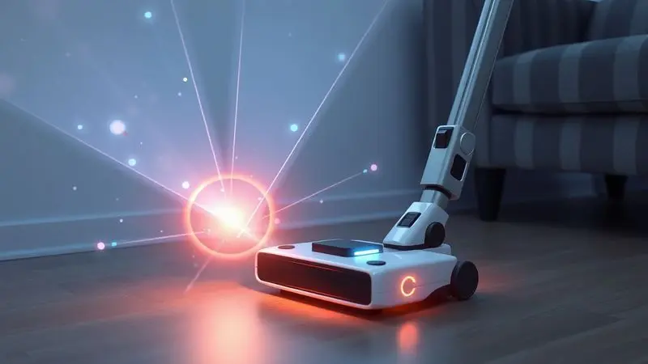

A busca por praticidade na limpeza doméstica nos leva a considerar soluções que parecem quase mágicas. Imagine acordar e encontrar sua sala limpa sem ter levantado um dedo.

O Robô Aspirador BowAI OB12 promete exatamente isso, com um preço que não assusta quem está entrando no universo smart home. Mas será que um produto tão acessível consegue mesmo substituir a vassoura tradicional?

Mais que especificações técnicas, queremos saber se ele se torna seu aliado silencioso na guerra contra a poeira.

<SummaryList products={frontmatter.top_products} />

## Especificações Técnicas do BowAI OB12

<ProductBox 
  title={frontmatter.top_products[0].title} 
  image={frontmatter.top_products[0].image} 
  link={frontmatter.top_products[0].link} 
/>

Antes de imaginar ele trabalhando na sua casa, vamos entender o que está sob o capô. O OB12 é um verdadeiro multitarefa: varre, aspira e até passa pano, tudo com uma força de sucção de 1500Pa que pega desde migalhas até poeira fina. O melhor?

Ele faz isso conversando em voz baixa, abaixo dos 55 decibéis, quase um sussurro que não compete com sua música ou série favorita.

Seu coração é uma bateria que promete até 70 minutos de trabalho, tempo suficiente para dar a volta em apartamentos médios. Para recarregar, basta uma porta USB comum, embora as 4 horas de espera peçam um pouco de planejamento.

Nas dimensões, ele é compacto como deve ser, deslizando sob sofás e camas onde a vassoura nem sonha em chegar.

Duas caixinhas acompanham: uma de 150ml para o pó seco e outra de 300ml para a função pano molhado. Esta última função, entretanto, merece temperança nas expectativas, pois funciona mais como um auxiliar do que como substituição da faxina tradicional.

<CaixaProsContras>

**Prós:**

- Função 3 em 1 (varre, aspira e passa pano).

- Baixo nível de ruído, ideal para o uso em casa.

- Compacto e leve, fácil de manobrar.

- Tempo razoável de funcionamento sem precisar recarregar.

**Contras:**

- A função de passar pano pode não ser muito eficaz.

- A disponibilidade de peças de reposição no Brasil pode ser limitada.

</CaixaProsContras>

## Design e Construção

Esqueça aqueles robôs quadrados que ficam presos em todo canto. O OB12 tem um formato arredondado que parece ter sido desenhado para dançar entre os pés da sua mesa e as pernas das cadeiras.

Esse não é apenas um capricho estético, mas uma decisão inteligente que ajuda nas manobras mais apertadas.

Seu perfil baixo é quase uma habilidade secreta, permitindo que ele explore territórios inacessíveis, como o espaço sob seu armário ou aquele vão entre o sofá e a parede que sempre acumula poeira.

As escovas laterais são como braços estendidos, alcançando a sujeira que se esconde junto aos rodapés.

Na mão, você sente que não está segurando um brinquedo, mas uma ferramenta pensada para durar. O material resistente dá confiança de que ele aguentará anos de encontros (leves) com móveis e portas.

## Funcionalidades e Recursos Disponíveis

Aqui a engenharia mostra seu valor. O sistema de navegação funciona como um GPS doméstico, mapeando sua casa e calculando a rota mais eficiente. Você não precisa ficar recolocando ele no lugar como um carrinho de controle remoto, ele aprende o caminho.

Os sensores são seus olhos e ouvidos, detectando quando um móvel surge no horizonte ou quando o chão desaparece (nas escadas). Essa consciência espacial transforma o medo de deixá-lo sozinho em confiança.

Através do aplicativo, você agenda a faxina para quando estiver no trabalho ou define zonas proibidas, como o tapete fino da sala de estar. A potência ajustável significa que ele sabe quando ser gentil no piso de madeira e quando ser firme no carpete do quarto.

## Desempenho na Limpeza Diária

É na rotina que o OB12 prova seu valor. Acordar com o chão já varrido não tem preço, especialmente quando você tem pouco tempo pela manhã.

Ele lida bem com os desafios comuns: migalhas da cozinha, areia trazida da rua, até aqueles fiapos de pelo que cachorros e gatos espalham como confete.

Superfícies diferentes não o intimidam. Do piso frio da cozinha ao carpete do quarto, ele ajusta a estratégia. A navegação inteligente garante que ele não fique rodando em círculos na mesma área, mas cubra sistematicamente cada metro quadrado.

Para dias de faxina mais intensa, os modos programáveis permitem focar em áreas específicas ou aumentar a potência. É como ter um funcionário dedicado que nunca reclama do serviço.

## Compartimento de Sujeira e Manutenção

A parte menos glamorosa da limpeza automática é, felizmente, bem simplificada. O compartimento de sujeira sai com um clique, sem necessidade de desmontar metade do robô. É rápido como trocar um saco de aspirador tradicional, mas sem o contato direto com a poeira.

Para quem convive com pets ou tem cabelos longos em casa, a limpeza regular do filtro evita que o desempenho caia com o tempo. São minutos de manutenção que garantem meses de funcionamento suave.

A simplicidade aqui é um acerto, pois transforma o que poderia ser uma tarefa chata em uma rápida verificação semanal. Nada que interrompa seu dia ou exija ferramentas especiais.

## Bateria e Autonomia de Uso

A autonomia é onde a promessa de praticidade se concretiza ou desmorona. O OB12 oferece uma janela generosa de trabalho, capaz de limpar apartamentos de até 70m² em uma única carga.

Imagine ele trabalhando enquanto você prepara o jantar, assiste a um filme ou faz uma videochamada, sem pedir pausas.

Quando a bateria começa a fraquejar, ele inteligentemente retorna à base para recarregar, prontinho para continuar onde parou. Essa independência é libertadora, especialmente se você tem uma rotina agitada.

A recarga via USB comum significa que você não precisa de um espaço dedicado com tomada especial, podendo deixá-lo carregando no escritório, quarto ou qualquer canto com uma entrada USB disponível.

## Segurança e Sensores de Obstáculos

Deixar um robô autônomo circulando pela sua casa exige confiança. Os sensores do OB12 funcionam como um sistema de prevenção de acidentes, detectando obstáculos antes do contato.

Ele não é aquele convidado desastrado que derruba vasos, mas sim alguém que olha antes de dar o passo.

A proteção contra quedas é especialmente valiosa em casas com desníveis ou escadas. Você pode programá-lo para limpar o andar superior sem ficar com o coração na mão, sabendo que ele reconhecerá quando o chão desaparecer.

Essa combinação de cuidados torna possível integrá-lo verdadeiramente na sua rotina, sem precisar supervisionar cada movimento. Ele se torna parte da casa, não um intruso que requer atenção constante.

## Pós-Venda e Suporte do Fabricante

Comprar tecnologia pode gerar aquela ansiedade sobre o que acontece se algo der errado. A BowAI oferece canais de suporte que funcionam como uma rede de segurança.

Manuais detalhados, tutoriais em vídeo e FAQs respondem à maioria das dúvidas antes mesmo de precisar contatar alguém.

Quando necessário, o atendimento por e-mail e telefone está disponível, com reputação de ser responsivo. Saber que há suporte caso precise dá aquela tranquilidade extra para investir em um produto que, afinal, tem partes móveis e eletrônicas.

Essa estrutura pós-venda transforma a compra de um gadget em uma relação de longo prazo, onde você não está sozinho depois que a caixa chega.

## Conclusão

O Robô Aspirador BowAI OB12 não é uma varinha mágica que elimina completamente a faxina manual, mas sim um aliado inteligente que transforma a limpeza de manutenção em algo que acontece quase sozinho.

Para quem valoriza tempo e quer reduzir a carga mental de manter a casa em ordem, ele entrega exatamente o que promete: praticidade acessível.

Sua força está em fazer bem o básico, aspirando e varrendo com eficiência, enquanto a função pano serve como complemento ocasional.

A navegação inteligente e os sensores de segurança permitem que você confie nele trabalhando sozinho, algo que não tem preço para dias corridos.

Se suas expectativas estão alinhadas com um assistente para a limpeza diária, e não com um substituto completo da faxina profunda mensal, o OB12 se revela um investimento sensato.

Ele não vai reorganizar seus armários, mas vai garantir que você pise em um chão limpo todos os dias, sem que isso consuma seu tempo ou energia. Para entrar no mundo da automação doméstica sem comprometer o orçamento, ele é uma porta que vale a pena abrir.

---

Ainda em dúvida sobre qual robô aspirador escolher? Confira nosso ranking dos [melhores robô-aspirador custo-benefício de 2025](/robo-aspirador-qual-o-melhor/) e encontre a opção ideal para o seu orçamento e necessidades!
