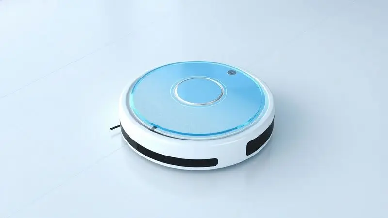
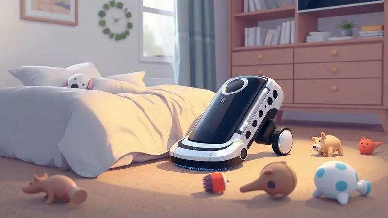
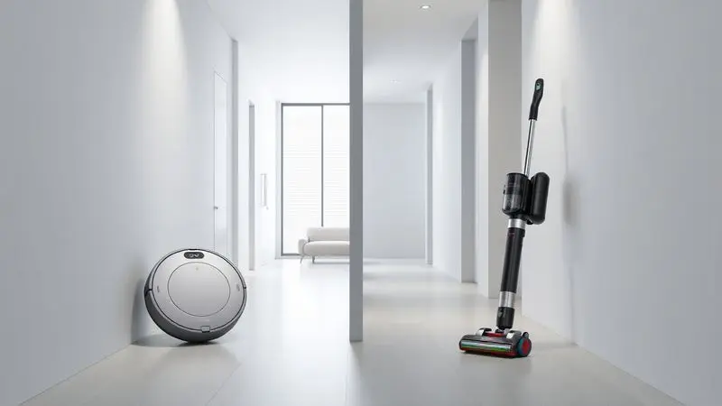

Imagine acordar com o piso já limpo, sem precisar se preocupar em passar o aspirador antes de receber visitas. Essa é a promessa dos robôs aspiradores, dispositivos que conquistaram seu espaço nos lares modernos.

Mas com preços que variam de algumas centenas a milhares de reais, e funcionalidades que vão do básico ao autolimpante, surge a dúvida central: um robô aspirador realmente vale a pena para o seu dia a dia?

Neste guia, vamos além das especificações técnicas para explorar como essa tecnologia pode se encaixar na sua rotina.

Se você tem pets, sofre com alergias ou simplesmente deseja recuperar horas preciosas da semana, vamos analisar desde os modelos mais acessíveis até os mais avançados, ajudando você a encontrar o equilíbrio perfeito entre investimento e benefício real em 2025.

<SummaryList products={frontmatter.top_products} />

## Afinal, robô aspirador vale a pena?

A resposta não é um simples sim ou não, mas sim: depende do que você busca. Se a sua expectativa é ter um ajudante para a manutenção diária, que controle a poeira, os pelos de animais e as migalhas entre uma faxina mais profunda, então sim, vale cada centavo.

A praticidade de programar uma limpeza enquanto você trabalha, estuda ou simplesmente relaxa transforma uma tarefa repetitiva em algo que acontece quase por magia.

No entanto, é importante ajustar as expectativas. Um robô aspirador não substitui completamente uma limpeza manual minuciosa, especialmente em cantos muito apertados ou para remover sujeiras muito pesadas e incrustadas.

Ele é o excelente auxiliar que mantém a casa apresentável no dia a dia, reduzindo drasticamente a frequência com que você precisa pegar no aspirador tradicional. A decisão final se resume a uma pergunta simples: quanto você valoriza seu tempo e sua tranquilidade?

## O que é um aspirador de pó robô 3 em 1?

Pense em um assistente que não apenas aspira o pó, mas também varre resíduos soltos e passa um pano úmido, tudo numa única passagem. Esse é o conceito do aspirador robô 3 em 1, uma evolução significativa em relação aos primeiros modelos.

Esses dispositivos multifuncionais são programáveis e equipados com sensores que mapeiam o ambiente, desviando de obstáculos como móveis e evitando quedas em escadas.

Muitos ainda oferecem conectividade com seu smartphone via Wi-Fi, permitindo que você controle e monitore a limpeza de qualquer lugar.

Essa convergência de funções é especialmente valiosa para quem busca máxima eficiência, eliminando a necessidade de múltiplas etapas na limpeza de pisos frios, como porcelanato, cerâmica ou madeira.

## Como escolher o melhor robô aspirador?

Encontrar o modelo ideal vai além de comparar preços. É sobre casar tecnologia com seu estilo de vida. Comece observando o tamanho do seu espaço, os tipos de piso predominantes e suas necessidades específicas, como a presença de pets ou a sensibilidade a alérgenos.

Com essas informações em mãos, você pode focar nos aspectos que realmente importam.

### Verifique a autonomia da bateria do robô

Nada mais frustrante do que seu robô desistir no meio da sala porque a bateria acabou. Por isso, a autonomia é seu primeiro critério prático. Modelos de qualidade geralmente oferecem entre 60 e 120 minutos de funcionamento contínuo.

Para apartamentos ou casas pequenas, 60 a 90 minutos podem ser suficientes. Já para ambientes maiores, busque autonomias próximas ou acima de 120 minutos.

A tecnologia de recarga e retomada é um diferencial valioso em lares amplos. Com ela, o robô volta sozinho à base quando a bateria está baixa, recarrega e, inteligentemente, retorna exatamente de onde parou para completar a missão.

É a garantia de que nenhum cômodo ficará para trás.

### Poder de vácuo e nível de ruído

A potência de sucção, medida em Pascal (Pa), define o que seu robô consegue capturar. Para uma limpeza eficaz de poeira diária e pelos de animais, busque modelos a partir de 2000Pa.

Se você tem tapetes ou crianças que espalham migalhas, considere opções acima de 3000Pa para uma aspiração mais vigorosa.

Paralelamente, avalie o nível de ruído. A maioria opera entre 55 e 65 decibéis, volume comparável a uma conversa normal. Se você trabalha em home office ou prefere silêncio absoluto, priorize modelos com modos silenciosos, geralmente abaixo de 60dB.

O equilíbrio aqui é claro: potência suficiente para limpar bem, mas silêncio suficiente para não perturbar sua paz.

### Mapeamento inteligente e sensores de obstáculo

É aqui que a mágica da automação realmente acontece. Robôs com mapeamento a laser (LDS) ou câmera criam um mapa preciso da sua casa em seu primeiro ciclo.

Isso permite rotas sistemáticas em zigue-zague, muito mais eficientes que a navegação aleatória, que deixa áreas sem limpar e perde tempo em locais já aspirados.

Com o mapa salvo no aplicativo, você pode definir zonas proibidas (como o entorno do pote de água do pet), áreas específicas para limpeza extra (a cozinha após o jantar) e até programar a sequência de cômodos.

Sensores de obstáculo e antiqueda completam o pacote, protegendo seu robô e seus móveis de colisões e acidentes. É a diferença entre ter uma máquina e ter um parceiro inteligente para a limpeza.

### Como escolher o robô aspirador ideal para quem tem pets?

Para donos de pets, alguns critérios sobem no topo da lista. A potência de sucção precisa ser robusta (acima de 2500Pa) para lidar com pelos, que tendem a se acumular rapidamente, especialmente em carpetes e cantos.

O filtro HEPA é não apenas recomendado, mas essencial, pois retém até 99,97% das partículas microscópicas, incluindo alérgenos, pele morta e ácaros, melhorando significativamente a qualidade do ar.

Escolha modelos com escovas principais projetadas para não emaranhar pelos, evitando paradas constantes para manutenção. A navegação inteligente também é crucial para que o robô consiga transitar entre os brinquedos, camas e potes espalhados pela casa sem ficar preso.

Por fim, a função de limpeza programada via aplicativo se torna sua melhor amiga, permitindo que você mantenha os pelos sob controle diariamente, mesmo quando está fora.

## Melhores robôs aspiradores para comprar em 2025

O mercado oferece opções para todos os perfis e orçamentos. De modelos básicos e eficientes para apartamentos compactos a verdadeiras centrais de limpeza autônoma para casas grandes, a tecnologia evoluiu para atender demandas reais.

Abaixo, destacamos os modelos que se sobressaem em diferentes categorias, equilibrando desempenho, recursos e valor.

### Xiaomi Vacuum S10 – Melhor robô aspirador geral

<ProductBox 
  title={frontmatter.top_products[0].title} 
  image={frontmatter.top_products[0].image} 
  link={frontmatter.top_products[0].link} 
/>

O Xiaomi Vacuum S10 é aquele equilíbrio raro entre tecnologia avançada e usabilidade intuitiva. Sua navegação a laser LDS escaneia o ambiente com precisão, criando mapas detalhados que possibilitam limpezas metódicas e personalizáveis.

Com 4000Pa de sucção, ele lida com a maioria dos desafios domésticos, desde poeira fina até restos de alimentos, enquanto seus 130 minutos de autonomia cobrem áreas generosas sem interrupções.

O controle pelo aplicativo Mi Home é um exemplo de simplicidade inteligente, permitindo agendar limpezas, definir zonas e monitorar o progresso em tempo real.

A função de passar pano simultânea agrega valor, embora o reservatório de água compacto exija reabastecimento em sessões muito longas. É a escolha segura para quem busca um desempenho completo sem complicações.

<CaixaProsContras>

**Prós:**

- Potência de sucção forte (4000Pa).

- Boa autonomia de até 130 minutos.

- Controle via aplicativo Mi Home para personalização.

- Design compacto e navegação eficiente.

**Contras:**

- Reservatório de água pequeno pode exigir reabastecimento frequente.

- Pode ser barulhento em modos altos.

</CaixaProsContras>

### WAP Robot W90 – Melhor robô aspirador custo-benefício

<ProductBox 
  title={frontmatter.top_products[1].title} 
  image={frontmatter.top_products[1].image} 
  link={frontmatter.top_products[1].link} 
/>

Para quem está dando os primeiros passos no mundo da automação doméstica, o WAP Robot W90 é uma porta de entrada convincente. Ele entrega a multifuncionalidade básica que mais importa: varre, aspira e passa pano em uma única operação, tudo por um investimento acessível.

Sua autonomia de 100 minutos é suficiente para apartamentos e casas pequenas, e seu design compacto alcança facilmente os espaços sob sofás e camas.

É importante entender seu perfil: com 30W de potência, ele brilha na manutenção diária de pisos lisos, mantendo a poeira e os pelos sob controle. Para sujeiras mais pesadas ou incrustadas, pode ser necessário um complemento manual ocasional.

Se o seu objetivo é simplificar a rotina sem comprometer o orçamento, ele cumpre sua missão com louvor.

<CaixaProsContras>

**Prós:**

- Excelente custo-benefício, ideal para iniciantes.

- Função 3 em 1 que otimiza a limpeza.

- Boa autonomia para limpezas rápidas.

- Design compacto que alcança lugares difíceis.

**Contras:**

- Potência pode ser insuficiente para sujeiras mais pesadas.

- Reservatório pequeno exige esvaziamentos frequentes.

</CaixaProsContras>

### Liectroux XR500 – Modelo com mapeamento inteligente

<ProductBox 
  title={frontmatter.top_products[2].title} 
  image={frontmatter.top_products[2].image} 
  link={frontmatter.top_products[2].link} 
/>

O Liectroux XR500 é para quem não abre mão de uma navegação precisa e de um controle total sobre a limpeza. Seu sistema de mapeamento a laser em 360º é seu grande trunfo, criando mapas da sua casa que você pode editar diretamente no aplicativo.

Quer que ele limpe apenas o corredor e a cozinha hoje? Basta selecionar as salas no mapa. Precisa que ele evite o tapete novo? É só desenhar uma zona proibida.

A função 3 em 1 (varre, aspira e passa pano) é executada com eficiência, e a compatibilidade com Alexa e Google Assistant permite o controle por comando de voz.

Em casas com mais de um andar, o processo de mapeamento precisa ser refeito em cada nível, o que é uma consideração prática para quem busca máxima automação em ambientes complexos.

<CaixaProsContras>

**Prós:**

- Mapeamento inteligente com navegação a laser.

- Função 3 em 1 (varre, aspira e passa pano).

- Controle via aplicativo e compatível com assistentes virtuais.

- Bom custo-benefício para casas amplas.

**Contras:**

- Pode precisar de cuidados especiais em casas com muitos andares.

- Requer uso de peças originais para manutenção adequada.

</CaixaProsContras>

### Ropo Glass 3 – Robô aspirador com esterilizador

<ProductBox 
  title={frontmatter.top_products[3].title} 
  image={frontmatter.top_products[3].image} 
  link={frontmatter.top_products[3].link} 
/>

Em um mundo com maior consciência sobre higiene, o Ropo Glass 3 traz um diferencial notável: além de varrer, aspirar e passar pano, ele esteriliza as superfícies com uma lâmpada UV.

Essa função extra pode ser especialmente significativa para famílias com bebês, idosos ou qualquer pessoa que busca um nível adicional de proteção contra vírus e bactérias no chão.

Sua navegação inteligente garante uma cobertura completa do ambiente, e o controle via aplicativo mantém a conveniência de sempre.

Alguns usuários relataram que a autonomia pode variar dependendo do modo utilizado e que o sistema de mapeamento, em versões específicas do firmware, pode ocasionalmente não salvar os mapas. Ainda assim, para quem prioriza a desinfecção, ele oferece uma proposta única.

<CaixaProsContras>

**Prós:**

- Multifuncionalidade: realiza várias tarefas em um só aparelho.

- Esterilização UV, garantindo ambientes mais higiênicos.

- Navegação inteligente com mapeamento eficiente.

- Controle por aplicativo, facilitando o agendamento das limpezas.

**Contras:**

- A autonomia da bateria pode ser limitada em algumas situações.

- Pode haver dificuldades em salvar mapeamento em alguns modelos.

</CaixaProsContras>

### Xiaomi Robot Vacuum X20+ – Melhor robô aspirador auto limpante

<ProductBox 
  title={frontmatter.top_products[4].title} 
  image={frontmatter.top_products[4].image} 
  link={frontmatter.top_products[4].link} 
/>

Se o seu objetivo é minimizar ao máximo o contato com a sujeira, o Xiaomi X20+ representa o estado da arte. Sua estação de base não é apenas um carregador, é uma central de automanutenção.

Após cada limpeza, o robô retorna à base, onde seu reservatório de pó é esvaziado automaticamente em um saco selado que pode armazenar detritos por até 75 dias. Em seguida, os panos do mop são lavados e secados, prontos para a próxima missão.

Com uma sucção avassaladora de 6000Pa e mops rotativos que esfregam ativamente, a limpeza é profunda. A navegação LDS é precisa e o aplicativo Mi Home oferece controles avançados. A única concessão é o espaço: a estação de auto limpeza é um componente considerável.

Mas para quem deseja verdadeiramente delegar a tarefa, é um investimento que se paga em tempo e comodidade recuperados.

<CaixaProsContras>

**Prós:**

- Potência de sucção impressionante de 6000Pa.

- Estação de auto limpeza que minimiza a necessidade de manutenção.

- Navegação precisa e inteligente que evita obstáculos.

- Controle remoto fácil pelo aplicativo Mi Home.

**Contras:**

- Design da estação pode ser considerado volumoso.

- Tempo de carregamento leva cerca de 6 horas.

</CaixaProsContras>

### Roborock Q7 Max – Eficiente e robusto

<ProductBox 
  title={frontmatter.top_products[5].title} 
  image={frontmatter.top_products[5].image} 
  link={frontmatter.top_products[5].link} 
/>

O Roborock Q7 Max é sinônimo de potência confiável aliada a um sistema de limpeza úmida versátil.

Seus 4200Pa de sucção garantem uma captura eficiente de sujeira em qualquer superfície, enquanto seu tanque de água de 350ml e 30 níveis de fluxo ajustáveis permitem que você customize a quantidade de umidade para diferentes tipos de piso, do porcelanato à madeira envernizada.

A navegação LiDAR é um padrão de precisão no setor, criando mapas 3D detalhados e permitindo rotinas de limpeza personalizadas.

Embora seu sistema de esfregar não use vibração (como em modelos topo de linha da marca), a combinação de potência de aspiração e pano úmido resulta numa manutenção diária mais que satisfatória para a maioria dos lares.

A integração com assistentes de voz completa o pacote de conveniência.

<CaixaProsContras>

**Prós:**

- Potência de sucção impressionante (4200 Pa)

- Função de esfregamento com ajustes personalizáveis

- Navegação precisa com mapeamento 3D

- Integração com assistentes virtuais

**Contras:**

- Pode deixar resíduos em carpetes

- Sistema de esfregamento sem vibração ou escovação

</CaixaProsContras>

### Philco 3 em 1 Com MOP PAS23 – Aspirador que passa pano barato

<ProductBox 
  title={frontmatter.top_products[6].title} 
  image={frontmatter.top_products[6].image} 
  link={frontmatter.top_products[6].link} 
/>

O Philco PAS23 prova que a multifuncionalidade pode ser acessível. Este modelo é a definição de "simples e eficaz" para ambientes compactos.

Ele realiza as três funções básicas (varre, aspira e passa pano seco) de forma totalmente autônoma, guiado por sensores que previnem quedas e colisões. Com 90 minutos de autonomia, é perfeito para apartamentos de um ou dois quartos.

Sua potência de 35W é direcionada para a manutenção leve e constante.

Não espere que ele lide com sujeiras grandes ou muito incrustadas, mas para controlar a poeira diária, os pelos soltos e dar uma passada de pano para remover marcas de pegadas em pisos frios, ele desempenha um papel valioso.

É a automação básica funcionando muito bem dentro de suas limitações projetadas.

<CaixaProsContras>

**Prós:**

- Funcionalidade 3 em 1: varre, aspira e passa pano.

- Sensores antiqueda e anti-colisão garantem segurança.

- Design compacto que alcança espaços pequenos.

- Bom para manutenção diária em ambientes pequenos a médios.

**Contras:**

- Potência de 35W pode não ser ideal para sujeiras pesadas.

- Autonomia limitada a 90 minutos.

</CaixaProsContras>

### Xiaomi S20 – Robô aspirador leve e compacto

<ProductBox 
  title={frontmatter.top_products[7].title} 
  image={frontmatter.top_products[7].image} 
  link={frontmatter.top_products[7].link} 
/>

Para quem mora em espaços reduzidos, como kitnets ou apartamentos pequenos, o Xiaomi S20 é uma opção estrategicamente projetada. Seu diâmetro de 325mm e peso de 3,5kg lhe conferem uma agilidade notável para navegar entre móveis justapostos e limpar sob camas baixas.

Não deixe o tamanho enganar: sua sucção de 5000Pa é robusta e sua navegação a laser LDS é a mesma tecnologia usada em modelos maiores, garantindo eficiência, não aleatoriedade.

A função de passar pano complementa a aspiração, ideal para manter pisos lisos impecáveis. A principal limitação é prática: seu reservatório de água de 270ml foi dimensionado para espaços menores, então em áreas amplas será necessário reabastecê-lo durante a limpeza.

Para o nicho que atende, porém, é um desempenho excelente em um pacote compacto.

<CaixaProsContras>

**Prós:**

- Compacto e leve, ideal para áreas pequenas.

- Navegação inteligente com laser para eficiência.

- Boa potência de sucção para diferentes superfícies.

- Função de passar pano que complementa a limpeza.

**Contras:**

- Reservatório de água pequeno para grandes áreas.

- Alguns usuários relataram problemas no carregamento.

</CaixaProsContras>

### WAP W400 – Simples e eficiente

<ProductBox 
  title={frontmatter.top_products[8].title} 
  image={frontmatter.top_products[8].image} 
  link={frontmatter.top_products[8].link} 
/>

O WAP W400 é um trabalho sólido no segmento de entrada. Ele oferece a conveniência do 3 em 1 com uma sucção de 1400Pa adequada para limpeza de rotina em pisos lisos e carpetes de pelo baixo.

Seus sensores de proteção funcionam bem, e a conectividade Wi-Fi com controle via aplicativo e compatibilidade com assistentes de voz é um diferencial significativo nesta faixa de preço.

A ressalva está na estratégia de navegação.

Sem mapeamento sistemático, ele opera de forma aleatória, o que pode resultar em algumas áreas sendo limpas mais de uma vez e outras sendo parcialmente negligenciadas, especialmente em ambientes com layout complexo ou muitos móveis.

É uma troca consciente: você ganha conectividade e funções, mas abdica da eficiência máxima de rota. Para apartamentos de planta aberta, essa limitação é menos crítica.

<CaixaProsContras>

**Prós:**

- Design 3 em 1 que facilita a limpeza.

- Sucção potente de 1400 Pa.

- Sensores antiqueda e anticolisão para segurança.

- Controle via aplicativo e compatibilidade com assistentes de voz.

**Contras:**

- Navegação aleatória pode deixar áreas não limpas em casas grandes.

- Custo-benefício pode ser questionável em comparação a modelos mais avançados.

</CaixaProsContras>

### Electrolux ERB10 – Modelo bom da Electrolux

<ProductBox 
  title={frontmatter.top_products[9].title} 
  image={frontmatter.top_products[9].image} 
  link={frontmatter.top_products[9].link} 
/>

O Electrolux ERB10 é a prova de que uma marca tradicional pode entregar um robô aspirador competente e focado no essencial.

Seu grande trunfo é o design slim, com apenas 5,7cm de altura, que lhe permite acessar espaços sob móveis baixos onde a maioria dos modelos não chega.

A funcionalidade 3 em 1 é presente, e o filtro HEPA é um acréscimo valioso para quem se preocupa com a qualidade do ar, capturando alérgenos com eficácia.

Com uma autonomia de até 132 minutos, ele cobre bem áreas médias. A navegação, contudo, é do tipo aleatória. Isso significa que, embora ele eventualmente cubra toda a área, não o faça da maneira mais rápida ou sistemática possível.

É a escolha para quem prioriza o acesso a espaços baixos e a confiança da marca acima de uma navegação inteligente mapeada.

<CaixaProsContras>

**Prós:**

- Funcionalidade 3 em 1 (varre, aspira e passa pano)

- Design slim para acesso a espaços baixos

- Filtro HEPA que melhora a qualidade do ar

- Boa autonomia de bateria

**Contras:**

- Navegação aleatória sem mapeamento

- Função "passa pano" pode ser limitada

</CaixaProsContras>

### WAP ROBOT WCONNECT – Conectividade e controle por voz

<ProductBox 
  title={frontmatter.top_products[10].title} 
  image={frontmatter.top_products[10].image} 
  link={frontmatter.top_products[10].link} 
/>

Para o usuário que vive conectado e adora comandar sua casa por voz, o WAP ROBOT WCONNECT é feito sob medida. Sua integração nativa com Alexa e Google Assistant é fluida, permitindo que você inicie, pause ou direcione o robô para um cômodo específico apenas falando.

O aplicativo complementa o controle com todas as funções de agendamento e monitoramento.

Os 120 minutos de autonomia, combinados com o retorno automático para recarga, são adequados para a maioria dos lares. O filtro HEPA agrega valor para ambientes com alergias.

O ponto de atenção é o tempo de recarga, que pode levar de 5 a 6 horas para uma carga completa, um período considerável se você precisar do robô para mais de um ciclo no mesmo dia. A conectividade, nesse caso, é sua principal razão de ser.

<CaixaProsContras>

**Prós:**

- Controle por voz via Alexa e Google Assistente.

- Filtro HEPA que ajuda a combater alergias.

- Sensores antiqueda e anticolisão para segurança.

- Autonomia de até 120 minutos com recarga automática.

**Contras:**

- Tempo de carregamento de 5 a 6 horas.

- Pode ter dificuldade em limpar áreas muito empoeiradas se não for usado regularmente.

</CaixaProsContras>

## Tipos de robôs aspiradores: do básico ao autolimpante

Entender as categorias ajuda a filtrar suas opções. No início da escala estão os modelos básicos, que geralmente só aspiram com navegação aleatória, ideais para orçamentos muito apertados ou ambientes extremamente simples.

Em seguida, vêm os aspiradores com mapeamento, que adicionam inteligência de rota e controle via aplicativo, um salto significativo em eficiência.

Os robôs 3 em 1 incorporam a função de passar pano (mop), eliminando uma etapa manual.

No topo da pirâmide estão os modelos autolimpantes, como o Xiaomi X20+, que representam o ápice da conveniência ao minimizar a interação humana até para esvaziar o pó e lavar os panos.

Sua escolha deve seguir uma lógica simples: qual o nível de intervenção que você está disposto a ter após configurar o dispositivo?

### Robô aspirador que passa pano (Mop)

A função mop transforma um robô aspirador de um coletor de pó seco em um limpador de superfícies completo. Geralmente, um reservatório de água acoplado libera uma umidade controlada sobre um pano de microfibra que esfrega o chão.

Os melhores modelos permitem regular a quantidade de água (para não encharcar madeira) e alguns, como o Roborock Q7 Max, até possuem mops que vibram para uma ação de esfregar mais ativa.

Essa função é revolucionária para quem tem pisos frios que mostram marcas de pegadas ou para a cozinha, onde respingos são comuns.

Não é uma lavagem profunda com esfregão, mas sim uma manutenção diária que mantém os pisos visualmente limpos e com menos aderência de sujeira, reduzindo drasticamente a necessidade de passar o pano manualmente.

## Robô aspirador ou aspirador vertical: qual escolher?

Essa é uma das dúvidas mais comuns, e a resposta está no tipo de ajuda que você precisa. Pense no robô aspirador como seu *preventivo*: ele age constantemente, sozinho, para que a sujeira nunca se acumule. É sobre conveniência e manutenção contínua.

Ele é perfeito para pisos lisos, áreas de tráfego intenso e para quem detesta a tarefa de aspirar.

O aspirador vertical, por outro lado, é seu *corretivo*: mais potente, versátil para aspirar sofás, escadas e cantos, e essencial para limpezas profundas semanais ou mensais, especialmente em carpetes grossos.

Muitas famílias descobrem que a combinação ideal é ter os dois: o robô trabalhando silenciosamente no dia a dia e o vertical para a faxina pesada de final de semana.

## Qual a melhor marca de robô aspirador hoje?

Marcas se destacam em diferentes frentes. A iRobot (Roomba) é a pioneira, sinônimo de confiabilidade e suporte robusto, com modelos que evoluíram por décadas.

A Roborock conquistou o mercado com seu excepcional custo-benefício, oferecingo navegação LiDAR de ponta e funções de mop vibratório a preços competitivos.

A Xiaomi e suas submarcas (como Roborock, inicialmente) dominam a inovação acessível, trazendo tecnologia premium para faixas de preço intermediárias.

Marcas como Eufy focam em simplicidade e valor, enquanto as nacionais como WAP e Philco atendem bem o segmento de entrada com funcionalidades básicas e preços atraentes.

Não existe "a melhor" universal, mas sim a melhor para seu orçamento e suas expectativas específicas de desempenho e recursos.

## Dúvidas frequentes sobre aspirador de pó robô

Ele realmente limpa? Sim, mas com nuances. Para poeira, pelos, cabelos e migalhas em pisos lisos, a limpeza é muito eficaz. Para sujeira pesada incrustada ou cantos muito apertados, a eficácia diminui. Ele é um especialista em manutenção, não em resgate.

Quanto tempo dura a bateria? Em uso contínuo, de 60 a 180 minutos, dependendo do modelo e do modo de potência. A maioria consegue limpar um apartamento de 70m² em um ciclo.

É muito barulhento? Geralmente não. A operação é similar ao ruído de uma conversa (55-65dB). Em modos "silencioso" ou "suave", pode ser ainda mais discreto.

Funciona em todos os pisos? Sim, mas com adaptações. Em carpetes muito altos ou fofos, pode ter dificuldade de locomoção. Em pisos de madeira envernizada, use a função mop com moderação de água ou apenas o modo seco.

Precisa de muita manutenção? Básica e semanal: esvaziar o reservatório de pó, limpar o filtro (batendo a poeira) e ocasionalmente limpar os sensores e as rodas para evitar emaranhados de cabelo.

## Conclusão

Investir em um robô aspirador é, em essência, investir em tempo e tranquilidade. Mais do que um eletrodoméstico, ele é um parceiro silencioso que assume uma das tarefas mais repetitivas do lar, liberando você para focar no que realmente importa.

A chave para uma escolha satisfatória está em alinhar suas expectativas: veja-o não como um substituto mágico para toda a limpeza, mas como um aliado estratégico para a manutenção diária.

Se você valoriza acordar com os pisos limpos, chegar em casa sem encontrar pelos espalhados ou simplesmente deseja eliminar a obrigação de passar o aspirador manualmente várias vezes por semana, então sim, um robô aspirador vale muito a pena.

Comece definindo seu orçamento, avalie o tamanho do seu espaço e priorize os recursos que dialogam com sua rotina, seja a potência para pets, a navegação inteligente para ambientes complexos ou a função mop para pisos frios.

A automação doméstica, nesse caso, não é um luxo distante, mas uma conveniência tangível que já cabe no seu dia a dia.

---

Ainda indeciso sobre qual robô aspirador comprar? Confira nosso [ranking completo dos melhores de 2025](/melhores-robo-aspirador-2024/) e encontre o ideal para sua casa!
