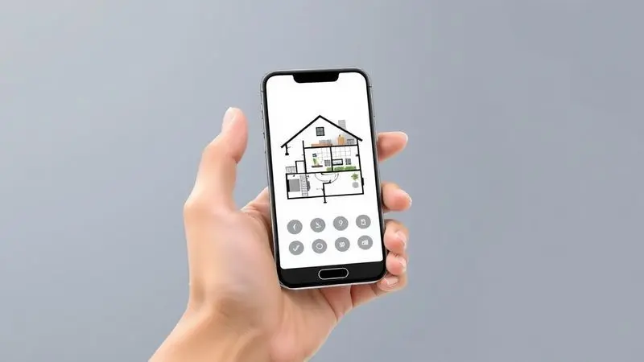
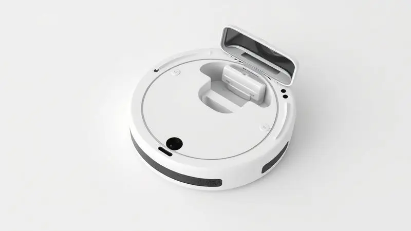

Procurando um aspirador robô custo-benefício? O KaBuM! Smart 500 ganhou destaque no mercado por oferecer funcionalidades interessantes, como controle por aplicativo e boa potência de sucção, mantendo um preço muitas vezes abaixo dos mil reais.

Mas, com tantas opções competitivas, a dúvida permanece: o Aspirador robô Kabum Smart 500 é bom de verdade?

Nesta análise completa, mergulhamos nos detalhes de construção, eficiência da limpeza, mapeamento e usabilidade do app para descobrir se este modelo realmente entrega o que promete ou se existem pontos de atenção que você precisa conhecer antes de comprar.

<SummaryList products={frontmatter.top_products} />

## Design e construção

<ProductBox 
  title={frontmatter.top_products[0].title} 
  image={frontmatter.top_products[0].image} 
  link={frontmatter.top_products[0].link} 
/>

Imagine um ajudante silencioso que se move pela sua casa sem pedir permissão, identificando cada obstáculo e limpando discretamente. É essa experiência que o design do Kabum Smart 500 promete entregar.

Com um perfil compacto que desliza sob os móveis mais baixos, ele se integra ao ambiente sem chamar atenção, como um eletrodoméstico que faz seu trabalho sem alarde.

A construção prioriza a eficiência prática: sensores antiqueda e anticolisão funcionam como pequenos guardiões, protegendo o robô (e seus móveis) de acidentes.

Com capacidade de superar obstáculos de até 15mm, ele navega pelos desafios domésticos com a confiança de quem conhece o terreno.

E quando você quer algo além da aspiração básica, ele oferece a funcionalidade de passagem de pano, completando o ciclo de limpeza com um toque final.

O que realmente surpreende, considerando o preço, é a integração ao ecossistema inteligente. Compatível com Alexa e Google Assistant, ele responde à sua voz como um membro obediente da família tecnológica.

Você pode simplesmente pedir para limpar a sala enquanto prepara o jantar, e ele atende sem questionar.

<CaixaProsContras>

**Prós:**

- Design compacto e moderno que se integra bem ao ambiente.

- Controle prático via aplicativo e compatibilidade com assistentes de voz.

- Múltiplos modos de limpeza que atendem diferentes necessidades.

- Sensores eficazes que evitam quedas e colisões.

**Contras:**

- Mapeamento simples que não armazena permanentemente a planta da casa.

- Não indicado para residências muito grandes devido à sua limitação de mapeamento.

</CaixaProsContras>

## Controle e aplicativo

A verdadeira magia acontece quando você abre o aplicativo KaBuM! Smart pela primeira vez. Não se trata apenas de um controle remoto sofisticado, mas de um centro de comando que coloca toda a sua casa na palma da mão.

Imagine programar limpezas para acontecerem enquanto você trabalha, selecionar áreas específicas para atenção extra (aquela parte do tapete onde o cachorro sempre deita) ou simplesmente verificar se o trabalho foi concluído.

A interface é intuitiva o suficiente para que até os menos tecnológicos consigam dominá-la rapidamente.

E as notificações inteligentes fazem toda a diferença no dia a dia: eles lembram você quando é hora de esvaziar o reservatório, limpar os filtros ou quando a bateria está baixa.

É como ter um assistente pessoal que cuida da manutenção para você, garantindo que o robô sempre trabalhe no seu máximo potencial.

Isso transforma a limpeza de uma tarefa ativa em algo que acontece nos bastidores, criando uma rotina onde você só precisa se lembrar de que a casa deve estar limpa, não de como fazer isso acontecer.

## Mapeamento de ambiente

O mapeamento giroscópico/infravermelho 360° funciona como o cérebro do Smart 500, criando um plano de ataque inteligente para cada limpeza. Enquanto navega, ele constrói um entendimento espacial do ambiente, identificando paredes, móveis e aberturas.

Esta tecnologia não apenas evita colisões desnecessárias, mas otimiza o trajeto para cobrir cada centímetro do chão sem repetições inúteis.

Cinco modos de limpeza permitem adaptação em tempo real: o modo cantos ataca áreas problemáticas, enquanto o automático equilibra eficiência e cobertura.

Para pisos que precisam de atenção especial, o modo água controlada oferece aquele toque final que diferencia uma passagem rápida de uma limpeza verdadeira.

Importante notar que a limitação está na memória: o robô mapeia durante a operação, mas não guarda esse mapa permanentemente. Para apartamentos e casas pequenas, isso raramente será um problema.

O planejamento em tempo real é suficiente para espaços onde os obstáculos são familiares. Mas em ambientes maiores ou com layout constantemente mutável, essa falta de memória pode significar uma eficiência levemente reduzida em limpezas subsequentes.

## Poder de limpeza e experiência de uso

O verdadeiro teste de qualquer aspirador robô acontece no silêncio da manhã, quando ele inicia seu trabalho sozinho.

O Smart 500 oferece uma capacidade de limpeza que surpreende pelo preço, lidando competentemente com poeira diária, migalhas de alimentos e pelos de animais em pisos lisos e carpetes de baixa densidade.

O segredo está na combinação: boa sucção para coletar a sujeira visível e a passagem de pano para remover aquela poeira fina que insiste em pousar nas superfícies. É um sistema de dois passos que entrega resultados visíveis sem exigir intervenção constante.

### Ruído e consumo

Imagine poder assistir um filme ou participar de uma reunião online enquanto o robô trabalha. Com um nível de ruído moderado (cerca de 65dB), o Smart 500 opera como um zumbido discreto de fundo, não como uma construção em andamento.

É suficientemente quieto para não interromper conversas ou concentração.

No aspecto energético, a eficiência é notável. Consumindo significativamente menos que aspiradores verticais tradicionais, ele representa uma economia mensal na conta de luz que, ao longo do tempo, compensa parte do investimento inicial.

É tecnologia inteligente que poupa não apenas seu tempo, mas também seus recursos.

## Limpeza e cuidados

Manter o Smart 500 funcionando perfeitamente exige uma rotina simples mas consistente. Após cada uso, esvaziar o reservatório leva 30 segundos que fazem toda a diferença na sucção constante.

Os filtros, geralmente de espuma e HEPA, precisam de uma batida rápida contra a lixeira semanalmente e uma lavagem mensal.

A escovinha lateral, magneto para fios de cabelo e pelos, merece atenção frequente. Uma rápida inspeção e limpeza garantem que continue girando livremente, coletando sujeira das beiradas onde outras escovas não alcançam.

E não se esqueça das rodas e sensores: manter essas áreas livres de acúmulo é o segredo para uma navegação precisa e sem falhas.

Esta manutenção, que parece trabalho extra no início, rapidamente se torna parte da rotina. Em troca, você garante que seu investimento tenha longevidade e continue entregando resultados consistentes.

## Concorrentes diretos

No universo dos aspiradores robô, o Smart 500 ocupa um nicho interessante: mais capaz que os modelos ultra-básicos, mas sem o preço exorbitante dos premium. Seus concorrentes diretos revelam escolhas importantes.

O Roborock S5, por exemplo, oferece mapeamento a laser e planejamento de rotas com precisão cirúrgica, mas custa quase o dobro. Para quem tem uma casa grande e valoriza otimização máxima, essa diferença pode fazer sentido.

Já o iRobot Roomba 675 compete no mesmo patamar de preço, com uma herança de marca consolidada, mas pode não oferecer o mesmo controle por aplicativo e funcionalidades do Smart 500.

A decisão, então, se concentra no que você mais valoriza: economia imediata versus tecnologia mais avançada, ou tradição da marca versus inovação em custo-benefício.

O Smart 500 brilha quando o orçamento é uma consideração primária, mas você ainda quer os benefícios fundamentais da automação.

## Conclusão

O Aspirador Robô Kabum Smart 500 entrega exatamente o que promete: automação acessível para espaços moderados.

Ele é o companheiro ideal para quem deseja transformar a limpeza diária de uma tarefa ativa em um processo automático, mas não exige as funcionalidades topo de linha que elevam o preço para patamares premium.

A combinação de mapeamento em tempo real, múltiplos modos de operação e controle inteligente via aplicativo cria uma experiência que supera expectativas para o preço.

As limitações existem, o mapeamento não é permanente, e casas muito grandes podem desafiar sua eficiência, mas dentro do contexto para o qual foi projetado, ele brilha.

Se você mora em um apartamento ou casa pequena a média, valoriza praticidade sobre tecnologia de ponta e busca uma entrada acessível no mundo da limpeza automatizada, o Smart 500 não apenas vale a pena, mas se estabelece como uma das melhores opções na relação capacidade-investimento do mercado atual.

Ele prova que você não precisa gastar uma fortuna para delegar as tarefas mais mundanas à tecnologia, recuperando tempo precioso para o que realmente importa.

---

Ainda em dúvida sobre qual aspirador robô escolher? Confira nosso guia com os [10 melhores robô aspirador até R$ 1.000 em 2025](/melhor-robo-aspirador-ate-1000-reais/) e encontre a opção perfeita para o seu orçamento!
