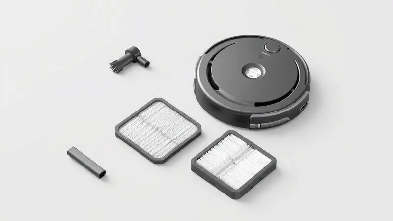
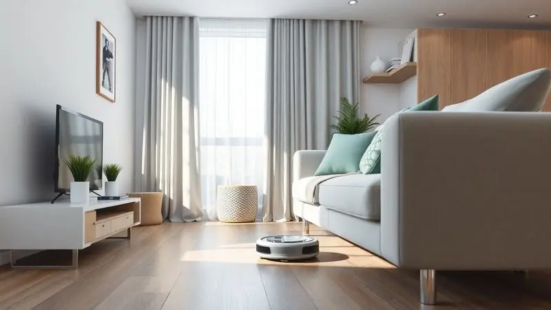
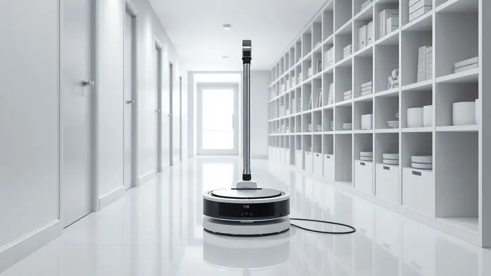

Você já teve a sensação de que sua casa nunca está realmente limpa por completo? Entre trabalho, compromissos e aqueles pelos de pet que parecem se multiplicar magicamente, manter os pisos impecáveis pode parecer uma missão impossível.

Quando um aspirador robô promete ser a solução, surgem dúvidas: será que funciona de verdade ou é apenas mais um gadget para a prateleira?

Decidimos testar o Kärcher RCV 1 em cenários reais, especialmente para quem convive com pets, e trouxemos uma análise franca do que realmente pode mudar na sua rotina.

<SummaryList products={frontmatter.top_products} />

## Aspirador robô Kärcher RCV 1: Visão Geral e Performance

<ProductBox 
  title={frontmatter.top_products[0].title} 
  image={frontmatter.top_products[0].image} 
  link={frontmatter.top_products[0].link} 
/>

Imagine poder limpar áreas que normalmente você ignora por serem difíceis de alcançar. Com apenas 7 cm de altura, o RCV 1 consegue deslizar sob a maioria dos móveis, garantindo que você não deixe ninhos de poeira e pêlos escondidos nos cantos mais baixos da casa.

Essa característica vai além da praticidade: traz a tranquilidade de saber que realmente nenhum espaço está sendo negligenciado.

Quando está funcionando, o robô demonstra uma inteligência prática. Ele analisa o ambiente com sensores que evitam quedas e colisões, navegando de forma autônoma pelos cômodos.

Conta com três modos distintos: um modo geral para a limpeza completa, outro especialmente para cantos e um terceiro focado em áreas específicas que precisam de mais atenção.

A bateria mantém o funcionamento por 90 minutos a 2 horas, dependendo do modo selecionado, e quando a energia está baixa, ele encontra o caminho de volta até a base de recarga sozinho.

Muitos imaginam que robôs aspiradores são barulhentos, mas o RCV 1 opera em cerca de 66 dB, um nível que permite conversar ou assistir TV sem grandes incômodos.

A ausência de controle por aplicativo ou comando de voz pode parecer uma limitação, mas na prática, isso se traduz em simplicidade: você programa e ele funciona, sem necessidade de sincronizações complexas ou preocupações com conectividade.

<CaixaProsContras>

**Prós:**

- Design slim que permite acesso fácil a locais baixos.

- Múltiplos modos de limpeza para diferentes necessidades.

- Sensores que evitam acidentes durante o funcionamento.

- Considerado silencioso em comparação a outros modelos.

**Contras:**

- Não tem controle por aplicativo ou comando de voz.

- A autonomia pode não ser suficiente para espaços muito grandes.

</CaixaProsContras>

## Peças de reposição para o Kärcher RCV 1

Um investimento em um eletrodoméstico não termina no momento da compra: pensa na longevidade. Com o RCV 1, a Kärcher mantém uma estrutura de suporte que facilita a manutenção a longo prazo.

Filtros, escovas laterais e, eventualmente, a própria bateria são peças que você pode precisar substituir após meses ou anos de uso constante.

A marca alemã disponibiliza esses componentes originais tanto em lojas autorizadas quanto diretamente em seu site, garantindo que a reposição não se torne uma busca frustrante por peças compatíveis.

Manter o estoque de itens essenciais significa que seu robô continuará funcionando com a mesma eficiência do primeiro dia, transformando-o de um simples aparelho em um verdadeiro parceiro de limpeza doméstica.

## Experiência de Uso: O que mudou no dia a dia com o robô

É na rotina diária que se revela o verdadeiro valor de uma ferramenta como o RCV 1. Imagine programá-lo para trabalhar enquanto você está no escritório ou aproveitando um tempo de lazer: ao voltar para casa, encontra os pisos limpos sem que tenha levantado um dedo.

Essa automação libera horas da sua semana que antes eram dedicadas a arrastar um aspirador tradicional pelos cômodos.

A navegação inteligente faz com que ele se mova pelos ambientes de forma metódica, alcançando cantos e espaços sob sofás e camas que muitas vezes são esquecidos na limpeza manual.

O armazenamento é outro ponto positivo: seu formato compacto permite guardá-lo facilmente em um armário ou cantinho discreto quando não está em uso.

Para sujeiras leves e manutenção diária, ele é extremamente eficiente (especialmente contra pelos de animais). No entanto, em situações de sujeira mais pesada ou acumulada, talvez seja necessário um complemento com aspiradores tradicionais ou uma passada extra do robô.

Essa compreensão realista das capacidades evita frustrações e permite que você aproveite ao máximo o que o aparelho realmente oferece.

## Veredito: Para quem indicamos o Kärcher RCV 1?

Este modelo é um aliado perfeito para famílias com animais de estimação, pessoas com agendas apertadas ou qualquer um que queira reduzir o tempo gasto com tarefas domésticas repetitivas.

Ele brilha em ambientes com pisos lisos e carpetes de baixa densidade, mantendo a limpeza básica sob controle quase que automaticamente.

Se você precisa de uma solução para sujeiras muito pesadas ou tem tapetes altos que exigem poder adicional de sucção, pode considerar complementar com outros equipamentos.

Mas para a grande maioria das residências brasileiras, onde a rotina diária produz mais pó, pêlos e migalhas do que sujeiras profundas, o RCV 1 cumpre seu papel com excelência.

## Conclusão

O Kärcher RCV 1 não promete revolucionar a limpeza doméstica, mas sim otimizá-la de forma inteligente e prática. Ele é aquele parceiro discreto que trabalha nos bastidores, garantindo que você não precise escolher entre tempo de qualidade e uma casa limpa.

Ao invés de pensar em horas perdidas passando o aspirador, você ganha momentos para si mesmo ou para a família, enquanto um sistema eficiente cuida da manutenção dos pisos.

Para investir nele com confiança, tenha em mente que está adquirindo uma ferramenta de manutenção diária, não uma solução mágica para todos os tipos de sujeira.

Considerando sua durabilidade, facilidade de manutenção e o suporte da marca Kärcher, o RCV 1 representa um equilíbrio inteligente entre custo e benefício para quem busca automação na limpeza sem complicações tecnológicas excessivas.

Ele transforma uma tarefa cansativa em um processo quase invisível, devolvendo à sua rotina aquilo que realmente importa: tempo.

---

Ainda na dúvida sobre o ideal para sua casa com pets? Confira nosso [Ranking dos Melhores Robôs Aspiradores para Quem Tem Pet](/melhor-robo-aspirador-para-quem-tem-pet/).
