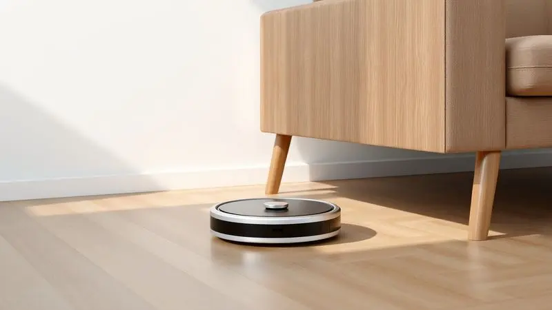
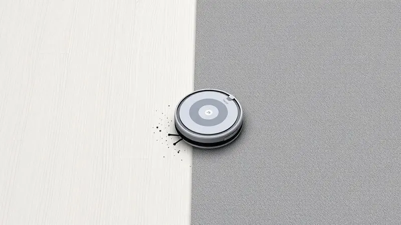
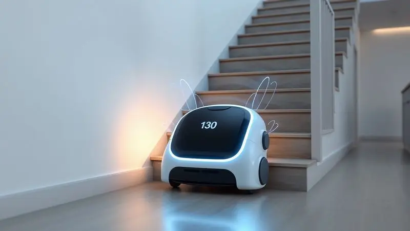
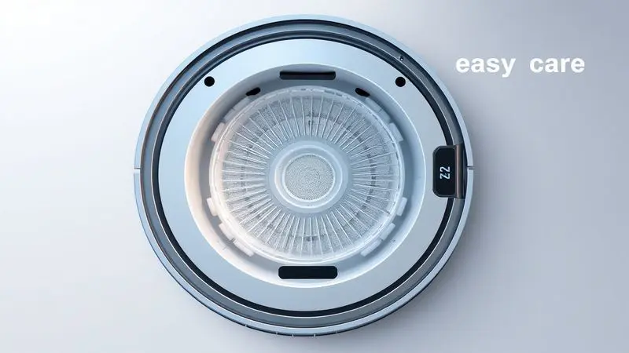

Manter a casa limpa todos os dias parece uma tarefa interminável, especialmente para quem tem uma rotina agitada ou animais de estimação. Você já deve ter se perguntado se um robô aspirador de entrada realmente funciona ou se é apenas um 'brinquedo' caro.

O Electrolux ERB10 promete acabar com essa dúvida, oferecendo uma solução 3 em 1 que varre, aspira e passa pano por um preço acessível.

Neste guia completo, analisamos todos os detalhes técnicos, o desempenho real no dia a dia e comparamos este modelo com seus principais rivais para que você descubra se o Electrolux ERB10 é o investimento certo para o seu lar.

<SummaryList products={frontmatter.top_products} />

## Robô Aspirador Electrolux ERB10: O Equilíbrio entre Preço e Praticidade

Imagine chegar em casa e encontrar o chão limpo sem ter levantado um dedo. Esse é o tipo de magia que o Electrolux ERB10 entrega.

Ele foi pensado para quem quer eficiência sem complicação, com um design que chega nos cantinhos mais difíceis e uma navegação inteligente que desvia de obstáculos sozinha.

A bateria dura o suficiente para cobrir áreas amplas, e embora ele não tenha mapeamento de ambientes complexo, essa simplicidade pode ser exatamente o que você precisa. É para quem valoriza tempo livre mais do que configurações complicadas.

## Ficha Técnica do Electrolux Home-e ERB10

Compacto e potente, o Electrolux Home-e ERB10 une tecnologia e praticidade em um pacote completo. Ele conta com sucção ajustável, modos de limpeza programáveis e se adapta a diferentes superfícies, desde cerâmicas brilhantes até tapetes baixos.

O sistema de navegação inteligente mapeia ambientes, evitando obstáculos e detectando escadas para não cair. A autonomia da bateria cobre sessões de limpeza extensas, e a função de retorno automático à base completa o pacote de conveniência.

## Design e Dimensões: Ele alcança os cantos e passa sob os móveis?

Seu formato arredondado e medidas compactas são a chave para acessar lugares que normalmente ficariam esquecidos. Ele desliza sob sofás, camas e armários baixos sem esforço, trazendo aquela sensação de limpeza completa que só acontece quando alguém mexe tudo.

Os cantos e bordas são alcançados com eficiência, garantindo que poeira e sujeira em áreas de difícil acesso não fiquem para trás. Para ambientes cheios de móveis e obstáculos, essa combinação de tamanho e forma faz toda a diferença.

## Poder de Sucção e Desempenho em Diferentes Pisos

Mas de nada adianta um design inteligente se o poder de limpeza não acompanha. Aqui o ERB10 brilha: sua sucção lida com cerâmica, laminado e tapetes baixos com naturalidade, adaptando-se conforme a superfície.

Os sensores anti-queda e anti-colisão trabalham em segundo plano, proporcionando segurança enquanto ele faz seu trabalho.

Em tapetes muito espessos, a eficiência pode diminuir um pouco, mas para a maioria dos lares brasileiros, essa versatilidade é mais do que suficiente para manter tudo impecável.

## Função 3 em 1: Como funciona o sistema de passar pano (MOP)?

A verdadeira revolução está aqui: além de aspirar, ele também [passa pano](/como-passar-pano-com-robo-aspirador-wap/). Um tanque de água acoplado permite que, enquanto remove a sujeira seca, ele também umedeça e limpe superfícies duras.

O pano acoplado faz o trabalho suave de manutenção, ideal para aquela limpeza rápida entre faxinas mais profundas. É como ter um assistente silencioso que não só varre e aspira, mas também deixa um brilho agradável no chão.

## Sensores Inteligentes: Ele cai da escada ou bate nos móveis?

Essa é uma preocupação comum, e felizmente o ERB10 tem a resposta. Equipado com sensores avançados, ele detecta desníveis e para antes de cair de escadas. Sensores de proximidade identificam móveis e obstáculos, ajustando a trajetória para contorná-los sem danos.

Essa tecnologia não só protege seu investimento, como otimiza a limpeza, permitindo que o robô foque nas áreas que realmente precisam de atenção.

## Autonomia da Bateria: Quanto tempo ele aguenta limpar?

Tempo suficiente para ele dar voltas completas na sua casa enquanto você trabalha, assiste a um filme ou prepara o jantar. Entre 90 e 120 minutos de funcionamento contínuo, dependendo do piso e da sujeira.

Para ambientes de tamanho médio, isso significa que ele completa a tarefa sem precisar parar para recarregar. E quando a bateria fica baixa, o sistema de recarga automática cuida de tudo, trazendo-o de volta à base sem que você precise se preocupar.

## Pontos Positivos e Negativos do Electrolux ERB10

Vamos ao que realmente importa: o que ele faz bem e onde pode melhorar. A [programação](/como-programar-aspirador-robo-oster/) fácil é um destaque, permitindo que você defina horários e esqueça da limpeza. Ele lida com sujeira cotidiana como [pelos de animais](/como-limpar-robo-aspirador-xiaomi-s20/) e poeira com naturalidade.

Porém, em [tapetes muito altos ou superfícies muito irregulares](/robo-aspirador-liectroux-l200-e-bom/), seu desempenho pode não ser ideal. Se sua casa tem predominantemente pisos planos, ele se torna um aliado indispensável no dia a dia.

## Onde comprar o Robô Aspirador Electrolux ERB10 pelo melhor preço

<ProductBox 
  title={frontmatter.top_products[0].title} 
  image={frontmatter.top_products[0].image} 
  link={frontmatter.top_products[0].link} 
/>

Encontrar o melhor negócio é parte importante da experiência. Plataformas como Amazon, Buscapé e Zoom costumam oferecer os preços mais competitivos, a partir de R$ 522,40.

Lojas como Casa Bahia e Magazine Luiza também têm o produto, embora geralmente com valores um pouco mais altos. A dica é comparar, pois ofertas podem aparecer em momentos diferentes.

A capacidade [3 em 1](/robo-aspirador-3-em-1-qual-o-melhor/) e o design ultrafino que facilita o acesso a áreas difíceis fazem do investimento algo que vale a pena buscar com atenção.

## Comparativo: Electrolux ERB10 vs WAP W100 - Qual o melhor?

<ProductBox 
  title={frontmatter.top_products[1].title} 
  image={frontmatter.top_products[1].image} 
  link={frontmatter.top_products[1].link} 
/>

Dois candidatos, duas filosofias diferentes. O Electrolux ERB10 brilha com sua potência de sucção (800 a 1000 Pa) e autonomia estendida de até 140 minutos, perfeito para quem tem rotinas de limpema mais intensas.

O filtro HEPA é um trunfo para famílias com alergias ou pets. Já o [WAP W100](/aspirador-de-po-robo-wap-robot-w100-e-bom/) oferece um reservatório maior (250 ml) e também acessa locais baixos, mas com autonomia de 1h40min e sucção menos potente.

A escolha resume-se a prioridades: se você quer eficiência máxima e filtragem avançada, o Electrolux é sua melhor opção. Se um preço mais convidativo e manutenção simplificada são mais importantes, o WAP pode ser a alternativa certa.

## Alternativa de Baixo Custo: Robô Aspirador Mondial RB-01

<ProductBox 
  title={frontmatter.top_products[2].title} 
  image={frontmatter.top_products[2].image} 
  link={frontmatter.top_products[2].link} 
/>

Para quem busca eficiência com orçamento apertado, o [Mondial RB-01](/aspirador-robo-mondial-e-bom/) (Fast Clean) é uma opção que surpreende. Com apenas 8 cm de altura, ele desliza sob móveis com facilidade.

O sistema 3 em 1 varre, aspira e passa pano, e as duas escovas laterais garantem cobertura em cantos e frestas. A autonomia de até 2 horas é generosa, embora o reservatório de 140 ml possa exigir esvaziamentos mais frequentes em áreas grandes.

Operação silenciosa e filtro HEPA completam o pacote, especialmente útil para quem tem pets.

## Dicas de Manutenção para aumentar a vida útil do seu robô

Um pouco de cuidado faz seu companheiro de limpeza durar muito mais. Comece limpando filtros e escovas regularmente, isso mantém a sucção potente. Verifique rodas e sensores periodicamente para evitar obstruções que atrapalhem a navegação.

Mantenha o ambiente livre de fios e pequenos objetos que possam causar danos. E sempre que houver atualizações de software disponíveis, aproveite, elas trazem melhorias que mantêm seu robô atualizado.

## Perguntas Frequentes (FAQ) sobre o Electrolux ERB10

Algumas dúvidas são comuns, e aqui estão as respostas. O sistema de navegação realmente mapeia ambientes para limpeza eficiente, e a adaptação a diferentes pisos (madeira, cerâmica) aumenta sua versatilidade.

Sobre a bateria, a autonomia cobre áreas médias bem, mas espaços maiores podem exigir recargas intermediárias. E não esqueça: a manutenção dos filtros é crucial para manter o desempenho ao longo do tempo.

## Conclusão

Em 2024, o Electrolux ERB10 continua sendo uma escolha inteligente para quem quer simplificar a rotina de limpeza sem complicações. Ele entrega exatamente o que promete: praticidade, eficiência e um design que se adapta à maioria dos lares brasileiros.

Embora não tenha funcionalidades super avançadas como mapeamento por aplicativo, essa simplicidade pode ser sua maior virtude.

Para quem busca mais tempo livre e menos preocupação com a limpeza diária, ele se apresenta como um investimento que paga a si mesmo em qualidade de vida.

A decisão final depende das suas prioridades, mas para a maioria das pessoas que querem um aliado confiável na manutenção da casa, o ERB10 é um companheiro que vale cada centavo.