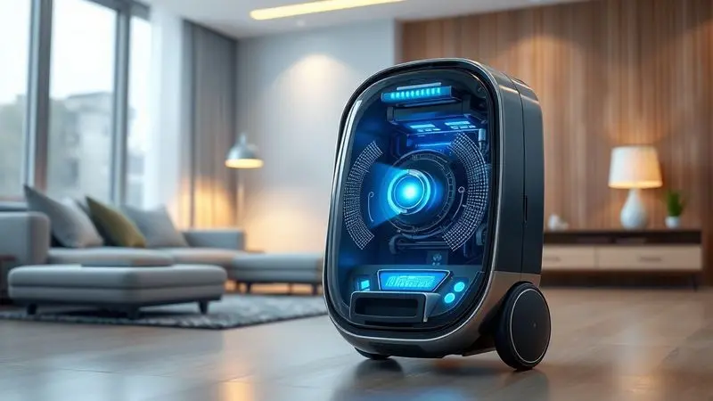
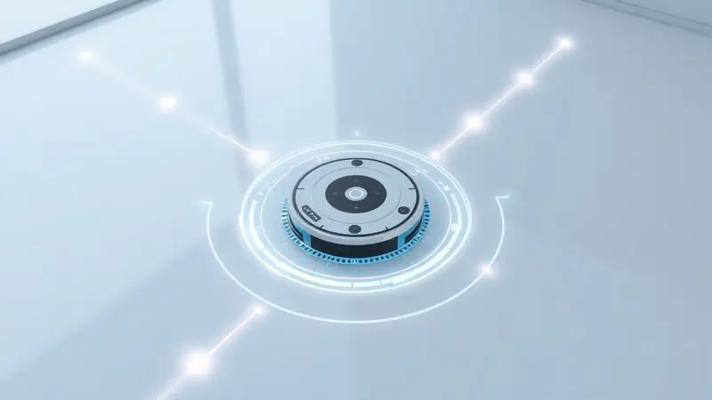
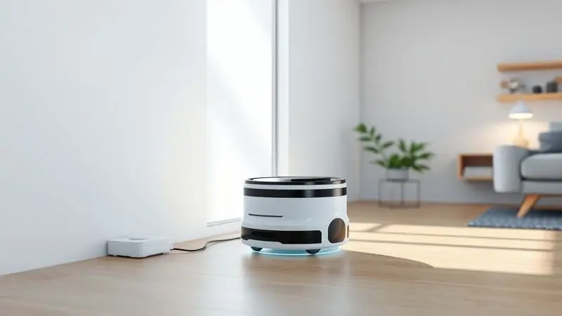
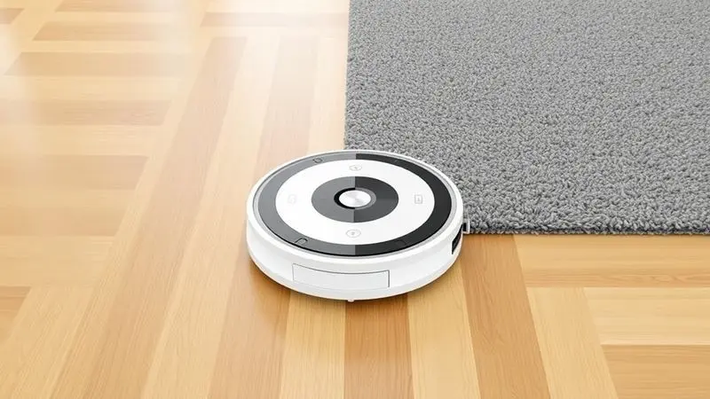

Imagine não precisar se preocupar com pelos de animais no sofá ou migalhas na cozinha. É exatamente essa promessa que o Electrolux ERB10 traz para a sua rotina.

Como uma das opções mais acessíveis do mercado, ele combina três funções (varrer, aspirar e passar pano) em um único aparelho compacto. Mas será que esse modelo de entrada entrega resultados satisfatórios no dia a dia, ou o baixo custo reflete em limitações frustrantes?

Nesta análise, vamos além das especificações técnicas para explorar como ele realmente se comporta na sua casa, ajudando você a decidir se vale a pena investir na automatização da sua limpeza.

<SummaryList products={frontmatter.top_products} />

## Visão Geral do Electrolux ERB10

A primeira impressão é de surpresa positiva. Com um design tão compacto que desaparece sob móveis baixos, ele demonstra desde o início que entende uma verdade básica: o que mais suja na casa são justamente os lugares difíceis de alcançar.

Ele navega pelo ambiente como se tivesse um mapa mental do espaço, otimizando cada movimento para não desperdiçar energia. E quando detecta uma escada ou degrau, simplesmente recua com elegância, eliminando aquela tensão constante de "será que ele vai cair?"

O verdadeiro charme está na autonomia. A bateria dura tempo suficiente para ele limpar apartamentos inteiros sem pedir ajuda, retornando sozinho para a base quando precisa recarregar. Você programa uma vez e esquece.

## Ficha Técnica do Electrolux ERB10

<ProductBox 
  title={frontmatter.top_products[0].title} 
  image={frontmatter.top_products[0].image} 
  link={frontmatter.top_products[0].link} 
/>

Vamos aos números que sustentam essa praticidade. Este é um robô bivolt que opera com 70 dB de ruído, comparável a uma conversa animada.

Sua bateria de lítio oferece impressionantes 2 horas e 20 minutos de uso contínuo, mas precisa de 3 a 5 horas para recarregar completamente.

O reservatório de pó comporta 220 ml, e aqui está um detalhe que faz diferença para quem sofre com alergias: o filtro HEPA Allergy Protect não só captura poeira, mas purifica o ar enquanto trabalha.

O design ultra slim não é apenas estético, permitindo que ele alcance aqueles cantos atrás do vaso sanitário ou embaixo da cama.

<CaixaProsContras>

**Prós:**

- Três funções em um único aparelho (varre, aspira e passa pano).

- Tecnologia antiqueda para maior segurança.

- Filtro HEPA que melhora a qualidade do ar.

- Design ultra slim para limpeza em locais difíceis.

**Contras:**

- Pode ser mais barulhento que outros modelos, com nível de 70 dB.

- A capacidade do reservatório pode ser insuficiente para grandes áreas.

</CaixaProsContras>

### Especificações de potência e capacidade

Você quer saber se ele realmente remove aquela areia fina que fica no corredor ou os pelos de gato que grudam no carpete? A potência é suficiente para superfícies comuns, mas não espere milagres em carpetes muito altos ou fofos.

A sucção é inteligente: ele aumenta a potência quando detecta áreas mais sujas.

O reservatório de 220 ml significa que, em um apartamento de 80m², você precisará esvaziá-lo a cada duas ou três sessões. Para casas maiores, isso vira uma rotina mais frequente.

Mas pense assim: você está trocando 15 minutos do seu dia por horas de limpeza automatizada.

### Tipo de filtragem e bateria

Respirar melhor enquanto sua casa fica limpa não é exagero. O sistema de filtragem multinível do ERB10 retém de grãos de areia a microscópicos ácaros, e para famílias com alergias, isso significa menos espirros e olhos lacrimejantes matinais.

Quanto à bateria, os 2h20 transformam a limpeza em algo que acontece no fundo, sem interrupções. Ele pode cobrir áreas extensas em uma única carga, e quando finalmente precisa de energia, encontra sozinho o caminho de volta para a base.

Você só percebe que o trabalho foi feito quando chega em casa e encontra os pisos impecáveis.

## Design e Usabilidade do Aspirador

Pegá-lo nas mãos pela primeira vez revela uma construção surpreendentemente sólida. O plástico resistente transmite durabilidade, mas o peso leve significa que até crianças ou idosos conseguem movê-lo se necessário.

Os botões são intuitivos, sem necessidade de manual, e as escovas laterais se destacam como braços que "abraçam" a sujeira das beiradas.

### Aparência e materiais

Ele se integra tão naturalmente à decoração que você quase esquece que é um eletrodoméstico. O design minimalista em preto ou branco não chama atenção, mas quando você o vê deslizando silenciosamente pela sala, há uma sensação de "futuro presente".

As curvas arredondadas não são apenas estéticas, evitam que ele fique preso em cantos ou enrosque em fios.

Mas o que realmente impressiona é como esse design inteligente se traduz em funcionalidade. As rodas superam pequenos degraus entre cômodos, e a baixa altura permite que ele limpe sob móveis que normalmente acumulariam meses de poeira esquecida.

## Funcionamento e Modos de Limpeza

Aqui está onde a mágica acontece. Programar o ERB10 é como treinar um assistente pessoal de limpeza. Você define horários via aplicativo ("toda segunda, quarta e sexta às 10h") e passa semanas sem precisar tocá-lo.

Ele começa a trabalhar enquanto você está no escritório, e quando volta, a casa está arrumada.

Os modos são inteligentes: o automático adapta a potência ao que encontra, o Spot foca em áreas problemáticas (como ao redor da mesa de jantar), e há até um modo silencioso para não atrapalhar reuniões online.

Os sensores anticolisão são tão precisos que ele para milímetros antes de bater em uma perna de cadeira, como se tivesse visão.

## Cobertura, Bateria e Autonomia

Para apartamentos de até 80m², ele é um companheiro perfeito. Navega por todos os cômodos em uma única sessão, calculando rotas eficientes que economizam bateria.

A autonomia real varia com o tipo de piso e sujeira, mas mesmo em cenários intensivos, raramente precisa de recarga intermediária.

Em casas maiores ou com muitos obstáculos, ele pode precisar retornar à base antes de terminar, mas sempre retoma exatamente de onde parou. É como ter um limpador persistente que nunca desiste do trabalho.

## Recursos e Acessórios do Electrolux ERB10

Além do básico, pequenos detalhes fazem diferença. A programação permite criar rotinas complexas ("limpar a cozinha após o café da manhã, a sala após o almoço").

Os sensores não apenas evitam quedas, mas detectam áreas especialmente sujas, aumentando o tempo de limpeza ali.

O sistema de filtragem tem manutenção simples: o reservatório sai com um clique, e o filtro é lavável. Para famílias com pets, as escovas são projetadas para não enroscar em pelos longos, reduzindo a necessidade de limpeza manual.

## Aplicativo e Conectividade do Electrolux ERB10

O aplicativo transforma o celular em um controle remoto universal da limpeza. Interface intuitiva mostra em tempo real onde o robô está, quanto da bateria resta, e até quais áreas já foram cobertas.

As notificações são discretas mas úteis: "Reservatório cheio" ou "Escova precisa de limpeza".

Você pode iniciar uma limpeza extra do trabalho quando lembra que deixou migalhas na sala, ou programar uma sessão especial antes da visita dos sogros. A sensação é de ter domínio total sobre a limpeza, mesmo estando a quilômetros de distância.

## Desempenho e Eficiência na Limpeza em Diferentes Superfícies

Aqui está o teste decisivo. Em pisos lisos (cerâmica, madeira, vinílico), ele é excepcional, removendo até poeira fina que vassouras comuns deixariam. Em carpetes baixos, performa bem, mas em carpetes altos ou fofos, algumas partículas podem resistir.

O verdadeiro trunfo é a consistência. Como ele passa todos os dias pelos mesmos lugares, não dá chance para a sujeira se acumular. Em uma semana, você percebe que precisa varrer manualmente com muito menos frequência.

A passagem de pano é básica, mas remove manchas superficiais e dá brilho aos pisos.

## Preço e Custo-Benefício do Electrolux ERB10

Quando você para para calcular, o valor não é apenas o preço na nota fiscal. É a hora extra de descanso no sofá que você ganha toda semana. É a redução de discussões sobre quem vai varrer hoje.

É a sensação de chegar em uma casa sempre apresentável, mesmo após uma semana corrida.

Comparado com modelos premium, ele não tem mapeamento a laser ou estação de esvaziamento automático. Mas faz 80% do trabalho por 50% do preço.

Para quem está entrando no mundo da automação doméstica ou busca uma solução prática sem extravagâncias, essa proporção é quase perfeita.

A durabilidade da marca Electrolux oferece tranquilidade adicional. Não é um dispositivo descartável, mas um investimento que se paga em qualidade de vida ao longo de anos.

## Avaliações de Consumidores: O que os usuários dizem?

As opiniões formam um retrato coerente. Quem tem apartamentos ou casas pequenas o ama. "Não lembro a última vez que peguei uma vassoura", diz um usuário. Outro comenta: "Para quem tem gato, mudou minha vida.

Pelo menos 30 minutos por dia que eu gastava removendo pelos agora são livres".

As críticas geralmente vêm de quem esperava milagres. "Em carpetes muito grossos, deixa passar algumas coisas", relata uma usuária. Outro nota: "O barulho existe, mas é menos irritante que o som do aspirador tradicional".

O consenso? Ele excede expectativas para seu preço, mas estabelece limites realistas sobre o que robôs de entrada podem fazer.

## Principais Concorrentes do Electrolux ERB10

No mundo dos robôs aspiradores acessíveis, ele compete em um espaço interessante. O iRobot Roomba oferece navegação superior, mas custa significativamente mais. O Xiaomi Mi Robot Vacuum tem aplicativo mais elaborado, mas menos disponibilidade de peças no Brasil.

A Philips tem modelos similares, muitas vezes com preços parecidos.

A vantagem do ERB10 está no equilíbrio. Não é o melhor em nenhuma categoria individual, mas combina desempenho suficiente, preço justo e suporte de uma marca estabelecida de uma forma que poucos conseguem.

## Conclusão

O Electrolux ERB10 é como aquele funcionário confiável que nunca falta, faz seu trabalho bem e não pede aumento.

Ele não vai impressionar com tecnologias futuristas ou resolver problemas de limpeza extremos, mas transforma uma tarefa diária em algo que simplesmente acontece no fundo da sua vida.

Para apartamentos e casas pequenas a médias, com pisos predominantemente lisos, ele é uma das melhores relações custo-benefício do mercado.

A economia de tempo é real e mensurável, e a sensação de acordar com a casa já arrumada tem um valor emocional que números não capturam.

Se você está hesitante em automatizar sua limpeza por medo de investir muito, o ERB10 oferece um ponto de entrada perfeito. Ele prova que tecnologia doméstica útil não precisa ser luxuosa, apenas precisa funcionar consistentemente enquanto você vive sua vida.

E nisso, ele é excepcional.

Vale cada minuto que você não passa segurando uma vassoura.

---

Ainda indeciso sobre o Electrolux ERB10? Descubra os melhores robôs aspiradores 3 em 1 no nosso [ranking completo de 2025](/robo-aspirador-3-em-1-qual-o-melhor/).
