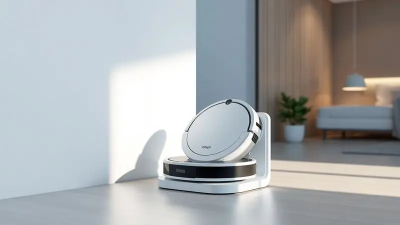
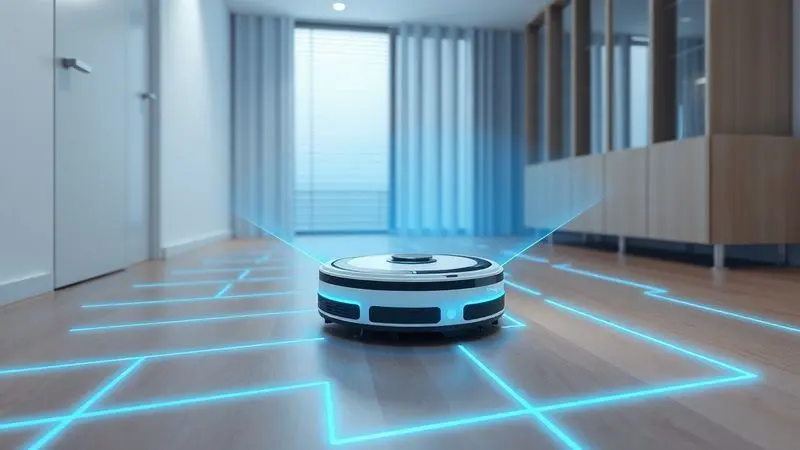
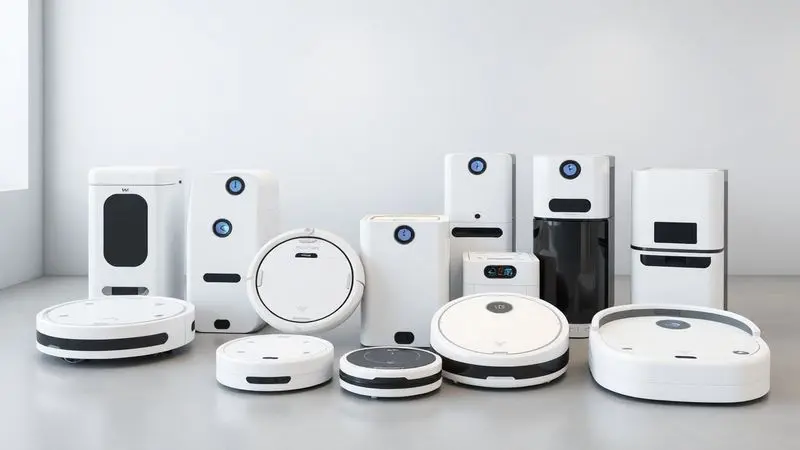

Procurando pelo melhor robô-aspirador Electrolux para automatizar a limpeza da sua casa? Com tantas opções no mercado, como as linhas ERB e Pure i9, é comum surgir a dúvida: esses aparelhos são realmente eficientes?

A Electrolux é uma marca consolidada, mas cada modelo oferece funcionalidades distintas, desde o básico que apenas varre até os mais avançados que passam pano e possuem mapeamento inteligente.

Neste artigo, analisamos os principais modelos da marca, comparamos suas fichas técnicas e ajudamos você a decidir qual o investimento certo para o seu lar. Descubra agora se o robô aspirador Electrolux é bom e qual modelo atende às suas necessidades.

<SummaryList products={frontmatter.top_products} />

## Robôs-aspiradores da Electrolux são bons?

Imagine acordar e já encontrar a casa limpa, sem precisar tirar a vassoura do armário. É essa conveniência que os robôs-aspiradores da Electrolux trazem para o seu dia a dia.

Avaliados positivamente por sua eficiência e tecnologia prática, eles vão além de simples aparelhos eletrônicos, se tornando pequenos assistentes que cuidam do seu espaço enquanto você se dedica ao que realmente importa.

A verdade é que eles são feitos para pessoas que valorizam tempo e qualidade de vida, oferecendo soluções inteligentes para a limpeza rotineira.

### Electrolux ERB10

<ProductBox 
  title={frontmatter.top_products[0].title} 
  image={frontmatter.top_products[0].image} 
  link={frontmatter.top_products[0].link} 
/>

Pense naquele robô que faz três trabalhos num só: varre, aspira e passa pano. O ERB10 chega como esse multitarefa, usando a tecnologia Autonomous Technology para navegar pela casa com autonomia impressionante de até 2h20min.

Os sensores antiqueda são seus olhos digitais, prevenindo quedas em escadas e protegendo tanto o aparelho quanto seus móveis.

O que realmente diferencia este modelo é o filtro HEPA Allergy Protect. Ele não apenas recolhe a sujeira visível, mas purifica o ar enquanto trabalha, capturando partículas microscópicas que pioram alergias.

Claro, você perceberá que ele emite cerca de 70 dB de ruído durante a operação, mas muitos usuários relatam que a eficiência compensa esse pequeno barulho, especialmente considerando como ele desliza sem esforço sob móveis baixos.

<CaixaProsContras>

**Prós:**

- Funcionalidade 3 em 1 (varre, aspira e passa pano)

- Sensores antiqueda para maior segurança

- Filtro HEPA que purifica o ar

- Boa autonomia de bateria

**Contras:**

- Nível de ruído elevado durante a operação

- Pode ser difícil de encontrar em alguns varejistas

</CaixaProsContras>

### Electrolux ERB11

<ProductBox 
  title={frontmatter.top_products[1].title} 
  image={frontmatter.top_products[1].image} 
  link={frontmatter.top_products[1].link} 
/>

Se o acesso a espaços apertados é sua prioridade, o ERB11 impressiona com seus meros 7 cm de altura. Esse design ultra slim é feito para deslizar sob sofás, camas e qualquer móvel baixo que normalmente acumula poeira esquecida.

Ele mantém a tríade de funções (varrer, aspirar e passar pano), mas oferece três personalidades diferentes através dos modos Focus, Random e Zig-Zag.

Aqui também encontramos o filtro HEPA Allergy Protect trabalhando a favor da sua saúde respiratória, retendo ácaros e impurezas enquanto o robô faz sua ronda.

A mesma autonomia de 2h20min garante cobertura para ambientes médios, mas é honesto mencionar que a função de passar pano serve mais para manutenção diária do que para limpeza profunda de sujeiras incrustadas.

<CaixaProsContras>

**Prós:**

- Limpeza 3 em 1 com várias funcionalidades.

- Design ultra slim que alcança áreas difíceis.

- Filtro HEPA que melhora a qualidade do ar.

- Vários modos de limpeza adaptáveis.

**Contras:**

- A função MOP não substitui uma limpeza profunda.

- O tempo de carregamento pode ser longo para a primeira utilização.

</CaixaProsContras>

### Electrolux ERB20 Home-e Speed

<ProductBox 
  title={frontmatter.top_products[2].title} 
  image={frontmatter.top_products[2].image} 
  link={frontmatter.top_products[2].link} 
/>

Para lares com animais de estimação, o ERB20 Home-e Speed se apresenta como um aliado especializado.

Ele executa as três tarefas fundamentais simultaneamente, mas com um filtro HEPA que captura impressionantes 99,9% de impurezas, ácaros e fungos, uma benção para quem sofre com alergias desencadeadas pelos pelos dos pets.

Compartilhando o design slim de 7 cm dos seus irmãos, ele navega facilmente pelo chão da sua casa durante 2h20min de autonomia.

A ausência de mapeamento avançado é compensada pela eficiência prática, especialmente para quem não se importa em conectar manualmente ao carregador. É a escolha para quem busca resultado sólido sem complicações tecnológicas excessivas.

<CaixaProsContras>

**Prós:**

- Realiza varrição, aspiração e esfregação simultaneamente.

- Filtro HEPA eficiente para capturar alérgenos.

- Design slim para acesso em áreas difíceis.

- Boa autonomia de bateria.

**Contras:**

- Requer conexão manual ao carregador.

- Não possui funcionalidades avançadas de mapeamento.

</CaixaProsContras>

### Electrolux ERB30

<ProductBox 
  title={frontmatter.top_products[3].title} 
  image={frontmatter.top_products[3].image} 
  link={frontmatter.top_products[3].link} 
/>

A conveniência ganha novo significado com o ERB30. Além do trio de funções clássicas, ele traz uma inteligência prática: a tecnologia Autonomous Technology que o faz retornar automaticamente à base quando a bateria está fraca.

Você não precisa se preocupar em encontrá-lo parado em algum canto, ele toma a iniciativa de se recarregar.

Com sensores antiqueda e anticolisão, controle remoto com programas pré-definidos e escova dupla para cantos complicados, ele é feito para quem quer automação sem a complexidade de aplicativos.

A limitação está justamente nessa simplicidade: não espere mapeamento inteligente ou controle via smartphone, apenas eficiência direta que funciona com o apertar de botões.

<CaixaProsContras>

**Prós:**

- Funcionalidade 3 em 1: varre, aspira e passa pano.

- Tecnologia de retorno automático à base.

- Design slim que alcança espaços reduzidos.

- Filtro HEPA que melhora a qualidade do ar.

**Contras:**

- Falta de mapeamento inteligente.

- Controle limitado ao remoto, sem aplicativo.

</CaixaProsContras>

### Electrolux ERB40

<ProductBox 
  title={frontmatter.top_products[4].title} 
  image={frontmatter.top_products[4].image} 
  link={frontmatter.top_products[4].link} 
/>

O ERB40 eleva o conceito de multifuncionalidade para um patamar 4 em 1, adicionando o pano úmido às opções já conhecidas.

A tecnologia Autonomous Technology aqui se mostra ainda mais versátil, adaptando-se inteligentemente a diferentes pisos, transitando entre madeira e carpete como se soubesse exatamente o que cada superfície precisa.

Os sensores de segurança continuam presentes, assim como o retorno automático para carregamento e a autonomia consistente de 2h20.

O diferencial é que ele oferece duas maneiras de passar pano, mas é importante entender que essa função permanece focada em manutenção diária.

Se você busca um companheiro que mantenha a casa sempre apresentável entre limpezas mais profundas, ele se encaixa perfeitamente nesse papel.

<CaixaProsContras>

**Prós:**

- Limpeza 4 em 1 para eficiência na tarefa.

- Sensores antiqueda garantem segurança durante o uso.

- Filtro HEPA captura alérgenos, melhorando a qualidade do ar.

- Design ultra slim permite acesso a locais difíceis.

**Contras:**

- O modo de passar pano é mais para manutenção do que limpeza profunda.

- Nível de ruído pode ser um pouco alto para alguns usuários.

</CaixaProsContras>

### Electrolux Pure i9.2

<ProductBox 
  title={frontmatter.top_products[5].title} 
  image={frontmatter.top_products[5].image} 
  link={frontmatter.top_products[5].link} 
/>

Quando tecnologia de ponta é não negociável, o Pure i9.2 entra em cena com sua navegação de precisão. Seu design triangular não é apenas estético, é funcional, alcançando cantos e bordas onde modelos convencionais deixam sujeira acumular.

A visão 3D combina câmera e laser para mapear seu ambiente com detalhe cirúrgico, evitando obstáculos com inteligência que parece quase humana.

Através do aplicativo Electrolux Wellbeing, você assume o controle total: agenda horários, define áreas específicas, personaliza rotinas. Ele ajusta automaticamente a sucção conforme o piso, lidando eficientemente com pelos de animais e detritos cotidianos.

Embora sua pressão de sucção possa parecer modesta em comparação com alguns concorrentes, isso raramente compromete sua efetividade na realidade do dia a dia, especialmente considerando a precisão de sua navegação.

<CaixaProsContras>

**Prós:**

- Navegação avançada com tecnologia de visão 3D

- Design triangular que chega a cantos

- Controle via aplicativo com personalização das rotinas

- Adaptação da sucção conforme o tipo de piso

**Contras:**

- Pressão de sucção pode ser baixa para sujeiras pesadas

- Custo relativamente elevado em comparação a outros modelos

</CaixaProsContras>

## Ficha técnica e destaques dos modelos

Olhar para esses modelos lado a lado revela um DNA familiar claro: autonomia consistente em torno de 2h20min, design slim que respeita seus móveis e filtros HEPA que transformam limpeza em cuidado com a saúde.

Mas as diferenças são onde suas preferências pessoais entram em jogo.

Enquanto os modelos ERB focam em multifuncionalidade prática (3 ou 4 em 1) com sensores de segurança robustos, o Pure i9.2 investe em inteligência de navegação e controle via aplicativo. Alguns retornam sozinhos para carregar, outros precisam de sua ajuda.

Alguns se contentam com um controle remoto, outros oferecem personalização completa pelo smartphone. Essa variação proposital permite que você escolha não apenas um aparelho, mas uma filosofia de automação que combine com seu estilo de vida.

## Soluções alternativas de robôs aspiradores

Às vezes, a resposta não está em um robô, mas em outro tipo de companheiro de limpeza. Aspiradores manuais oferecem controle cirúrgico sobre cada centímetro, ideais para quem gosta de ver o resultado imediato de seu esforço.

Os aspiradores verticais conquistam com leveza e facilidade de manobra, perfeitos para apartamentos compactos onde espaço é precioso.

Se potência bruta é sua prioridade, os aspiradores com fio entregam sucção ininterrupta sem preocupações com bateria. E não subestime as vassouras elétricas, essas soluções rápidas que resolvem pequenos desastres cotidianos em minutos.

Cada alternativa tem seu lugar, dependendo se você valoriza controle total, praticidade instantânea ou poder de limpeza absoluto.

## Conclusão

Escolher o robô aspirador Electrolux certo é menos sobre especificações técnicas e mais sobre encontrar um parceiro que entenda sua rotina.

Se seu dia a dia pede praticidade básica e você não se importa em dar uma ajudinha ocasional aos modelos ERB10 ou ERB20, terá um assistente confiável que mantém a casa apresentável com esforço mínimo de sua parte.

Para quem vive em espaços com muitos cantos difíceis ou móveis baixos, o design slim dos ERB11 e ERB30 faz diferença real no resultado final.

Já se tecnologia avançada e controle via aplicativo são prioridades, o Pure i9.2 oferece uma experiência quase futurista, mapeando sua casa com precisão que impressiona.

A verdade é que todos compartilham o mesmo propósito: devolver horas do seu dia que antes eram gastas com tarefas domésticas.

Seja optando pela multifuncionalidade prática dos modelos ERB ou pela navegação inteligente do Pure i9, você está escolhendo mais do que um eletrodoméstico, está investindo em qualidade de vida. Qual deles será o novo membro da sua família?

---

Ainda em dúvida sobre qual robô aspirador escolher? Confira nosso [ranking completo dos melhores de 2025](/melhores-robo-aspirador-2024/) e encontre a opção perfeita para sua casa.
