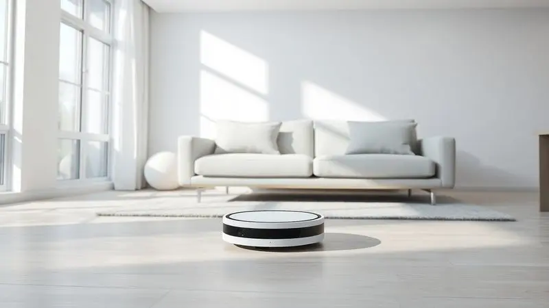
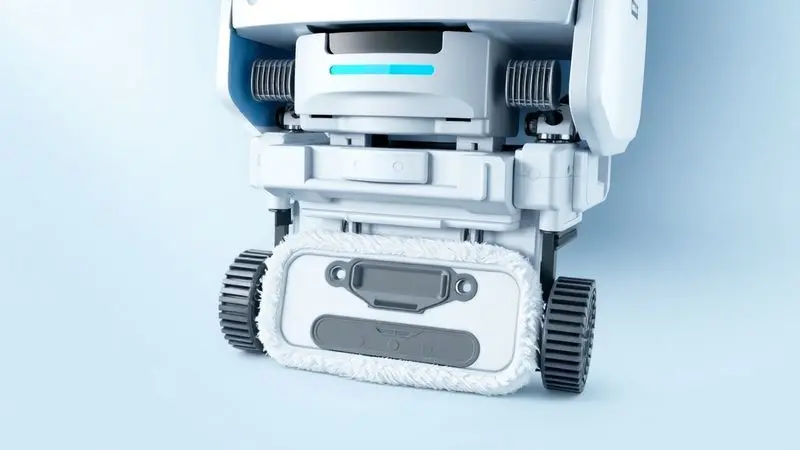
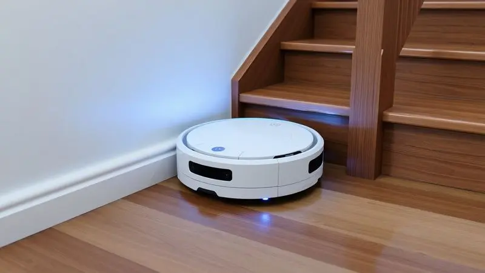
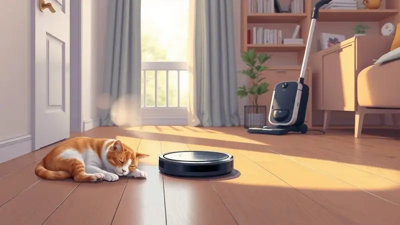

Manter a casa limpa diariamente pode ser um desafio exaustivo, que consome tempo precioso que você poderia estar investindo em você mesmo.

Os robôs aspiradores surgiram como a promessa de liberdade dessa rotina doméstica, mas com tantas opções no mercado, como saber qual realmente entrega o que promete?

Você já se pegou perguntando se o robô aspirador Electrolux ERB30 é bom o suficiente para a sua casa? Aquele sentimento de dúvida quando se está prestes a investir em algo que deve simplificar sua vida.

Este modelo se apresenta como um aliado completo, capaz de varrer, aspirar e passar pano, mas será que ele realmente tem autonomia para sua rotina e eficiência nas diferentes superfícies da sua casa?

Neste guia, vamos além da ficha técnica para analisar como ele se comporta no dia a dia, para que você tenha clareza se ele merece entrar na sua casa e na sua rotina.

<SummaryList products={frontmatter.top_products} />

## Visão Geral e Ficha Técnica do Robô Aspirador Electrolux ERB30

<ProductBox 
  title={frontmatter.top_products[0].title} 
  image={frontmatter.top_products[0].image} 
  link={frontmatter.top_products[0].link} 
/>

Imagine um aliado silencioso que trabalha enquanto você cuida do que realmente importa.

O Electrolux ERB30 chega com essa promessa, reunindo três funções essenciais de limpeza em um único aparelho com apenas 7 cm de altura - dimensão que lhe permite deslizar sob seus móveis favoritos sem esforço.

Com sensores que garantem que ele nunca vai dar um passo em falso (literalmente), você pode confiar que vai operar com segurança em qualquer ambiente.

Sua bateria oferece impressionantes 2 horas e 20 minutos de autonomia, tempo suficiente para cobrir toda a sua casa antes de retornar sozinho para a base quando precisar recarregar.

A ausência de mapeamento inteligente ou aplicativo significa simplicidade de uso, ideal para quem busca praticidade sem complicações tecnológicas.

E para quem convive com alergias, o filtro HEPA faz toda a diferença, capturando partículas microscópicas que você não vê, mas que seu corpo sente.

<CaixaProsContras>

**Prós:**

- Design ultra-slim que alcança áreas difíceis.

- Função 3 em 1: varre, aspira e passa pano seco.

- Boa autonomia de bateria.

- Filtro HEPA que melhora a qualidade do ar.

**Contras:**

- Não possui mapeamento inteligente, podendo demorar em áreas maiores.

- Controle apenas via controle remoto, sem aplicação móvel.

</CaixaProsContras>

## Design Ultra Slim e Facilidade de Acesso sob Móveis

Esqueça aquela poeira acumulada sob o sofá ou a cama que você sempre ignora porque é difícil alcançar.

A magia dos 7 centímetros de altura do ERB30 está justamente em chegar onde você não chega, transformando esses espaços esquecidos em áreas que se mantêm limpas com zero esforço seu.

Móveis baixos deixam de ser obstáculos e se tornam apenas mais uma área a ser limpa, garantindo que a sujeira não se acumule nesses cantos e volte a circular pela sua casa.

E quando ele não está trabalhando, seu formato compacto desaparece facilmente em qualquer armário ou até mesmo em um cantinho discreto da sala, sem ocupar o espaço que você tanto valoriza.

## Funcionamento 3 em 1: Varre, Aspira e Passa Pano

Três tarefas, um único aparelho, e mais tempo livre para você. Essa é a essência da funcionalidade 3 em 1 do ERB30.

Ele não apenas aspira: varre os resíduos maiores antes de aspirar, e ainda passa um pano seco para dar aquele acabamento que faz diferença no brilho do seu piso.

Sensores inteligentes detectam quando há mais sujeira em determinada área e automaticamente ajustam seu padrão de limpeza para garantir que nada fique para trás. Combinado com sua capacidade de acessar lugares difíceis, você tem cobertura completa em toda a casa.

O sistema de filtragem vai além da limpeza visível: retém partículas microscópicas de poeira e alérgenos que afetam sua saúde respiratória, transformando a limpeza da casa em um investimento no seu bem-estar.

## Autonomia e Bateria de Lithium Turbo Power

A ansiedade de ver o aparelho parar no meio da limpeza não precisa fazer parte da sua experiência.

Com a bateria Lithium Turbo Power, o ERB30 oferece uma autonomia que permite cuidar de toda a sua casa em uma única carga, chegando a impressionantes 90 minutos de operação contínua.

Mesmo que ele encontre superfícies mais desafiadoras ou precise do modo turbo para áreas especialmente sujas, a tecnologia da bateria se adapta para maximizar o tempo de limpeza.

E quando precisa recarregar, o processo é rápido, para que ele possa retornar ao trabalho o mais breve possível.

Imagine programá-lo pela manhã e voltar para casa à noite com todos os cômodos limpos, sem se preocupar se a bateria foi suficiente. Essa é a tranquilidade que essa autonomia proporciona.

## Sensores Anti-Queda e de Proximidade Inteligentes

A segurança do seu robô aspirador e da sua mobília merece igual atenção. É aqui que os sensores do ERB30 entram em cena, trabalhando como um sexto sentido que previne acidentes antes que aconteçam.

Sensores anti-queda detectam desníveis como escadas ou degraus, fazendo com que o aparelho mude de direção instantaneamente, sem nunca colocar em risco sua integridade.

Enquanto isso, sensores de proximidade identificam obstáculos - sejam móveis, paredes ou objetos deixados no chão - permitindo uma navegação suave que evita colisões desnecessárias.

O resultado? Você pode deixá-lo trabalhar sozinho com a certeza de que não vai causar danos à sua decoração nem a si mesmo, transformando a limpeza automática em uma experiência verdadeiramente tranquila.

## Controle Remoto e Limpeza Programada

Quem disse que você precisa estar em casa para ter uma casa limpa? Com o controle remoto do ERB30, você comanda a limpeza de qualquer cômodo sem precisar se levantar do sofá. Inicie, pause ou direcione para áreas específicas com um simples clique.

Mas a verdadeira revolução vem com a função de programação. Imagine acordar todos os dias com o piso já limpo, ou voltar do trabalho para um ambiente que parece ter sido arrumado por uma força invisível.

Programe horários específicos para diferentes dias da semana e transforme a limpeza em um hábito automático que acontece enquanto você vive sua vida.

Essa combinação de controle e automação libera você da constante necessidade de pensar na limpeza, criando um sistema que mantém sua casa impecável sem exigir sua atenção constante.

## Resultados de Desempenho em Testes Reais e Uso Diário

Teoria é importante, mas como ele realmente se comporta na sua casa? Em uso diário, o ERB30 demonstra sua força onde mais importa: capturando sujeira e pelos de animais em pisos duros como cerâmica e laminado, superfícies onde sua eficiência é notável.

Seu sistema de navegação inteligente permite que ele percorra diferentes ambientes com uma lógica que minimiza repetições e garante cobertura completa.

A autonomia da bateria se sustenta mesmo em casas maiores, garantindo que ele complete o trabalho antes de retornar para recarregar.

Uma consideração importante: em carpetes de fio mais longo, a sucção pode não ter a mesma eficiência que em superfícies duras. Mas para a maioria das famílias, que possuem uma combinação de pisos, seu desempenho atende consistentemente às expectativas do dia a dia.

## Comparação: Diferenças entre Electrolux ERB30 e ERB40

Na hora de escolher, entender as diferenças entre irmãos de linha faz toda a diferença. O ERB30 é o especialista em simplicidade eficiente: faz o trabalho essencial muito bem, com uma sucção poderosa para suas tarefas diárias.

O ERB40, por sua vez, traz o mundo da conectividade para sua limpeza. Com Wi-Fi e controle via aplicativo, ele oferece um nível de automação mais sofisticado, permitindo que você programe e monitore a limpeza através do smartphone, onde quer que esteja.

Além da conectividade, o ERB40 geralmente apresenta uma bateria com duração estendida, pensada para residências mais amplas. A escolha, então, se resume ao que você valoriza mais: a simplicidade robusta do ERB30 ou a automação conectada do ERB40.

## Principais Concorrentes no Mercado

O mercado de robôs aspiradores é um campo de batalha tecnológico onde cada modelo tenta conquistar seu espaço. O ERB30 destaca-se pela sua relação custo-benefício e simplicidade funcional, mas vale conhecer quem está na mesma arena.

O Roborock S6, por exemplo, impressiona com tecnologia de mapeamento a laser que cria mapas precisos da sua casa. Já o iRobot Roomba 980 é quase uma lenda quando o assunto é eficiência em diferentes texturas de piso, com uma reputação construída ao longo de anos.

Marcas como a Xiaomi oferecem alternativas interessantes com excelente custo-benefício e recursos inteligentes.

A verdade é que cada um desses concorrentes tem seu superpoder particular, e o ERB30 encontra seu nicho naqueles que buscam eficiência sem complicação excessiva.

## Para Quem o Electrolux ERB30 é Indicado?

Se sua rotina é uma corrida contra o tempo e a limpeza da casa frequentemente fica para depois, o ERB30 pode ser o parceiro que você estava esperando. Ele é para quem valoriza a praticidade mais do que recursos tecnológicos complexos.

Quem convive com animais de estimação vai apreciar sua eficiência em lidar com pelos persistentes. Se você tem uma mistura de pisos pela casa, desde cerâmicas brilhantes até carpetes moderados, sua versatilidade se adapta perfeitamente.

Mais do que um aparelho, o ERB30 é uma filosofia: a crença de que a tecnologia deve simplificar, não complicar. Para quem quer uma casa limpa sem transformar a limpeza em mais uma tarefa mental na lista, ele representa uma solução elegante e eficiente.

## Dicas de Uso para Melhor Aproveitamento do Robô

Para transformar seu ERB30 de um aparelho útil em um parceiro indispensável, alguns ajustes na rotina fazem toda a diferença.

Comece estabelecendo horários regulares de limpeza - de manhã cedo ou enquanto você está no trabalho - criando um hábito automático que mantém sua casa sempre pronta para receber você.

Antes de cada sessão, dedique um minuto para preparar o terreno: retire objetos pequenos do chão que possam ser engolidos ou obstruir seu caminho. Essa pequena ação previne contratempos e garante que cada limpeza seja otimizada.

Mantenha os sensores limpos com um pano seco regularmente, e esvazie a bandeja de sujeira após cada uso completo. Esses cuidados simples são como check-ups de saúde para seu robô, garantindo que ele opere no pico de sua capacidade por muito mais tempo.

Quando perceber áreas que acumulam mais sujeira - como perto da porta de entrada ou ao redor da mesa de jantar - use o controle remoto para direcionar atenção extra a esses pontos.

Com essas dipes, seu ERB30 não apenas limpa, mas se torna uma extensão inteligente da sua forma de cuidar da casa.

## Perguntas Frequentes (FAQ)

Na jornada de escolher o robô aspirador ideal, algumas dúvidas surgem repetidamente. Reunimos as perguntas mais comuns sobre o Electrolux ERB30 para dar clareza justamente nos pontos que mais importam na sua decisão.

### O Robô Aspirador Electrolux ERB30 é eficaz com pelos de animais?

Sim, o ERB30 foi desenhado com casas reais em mente, e isso inclui a realidade de quem divide o lar com pets. Suas escovas são especialmente eficientes para capturar pelos de animais, mesmo quando eles se entrelaçam em carpetes ou se acumulam nos cantos.

O sistema de sucção trabalha em conjunto com as escovas para garantir que os pelos não apenas sejam recolhidos, mas transportados eficientemente para o depósito.

Se você convive com gatos, cachorros ou qualquer animal que deixe sua marca pelo chão, encontrará no ERB30 um aliado que reduz significativamente a necessidade de aspirar manualmente.

O melhor: você pode programá-lo para limpar enquanto está no trabalho, voltando para casa com os pisos livres dos pelos que tanto incomodam quem tem alergias ou simplesmente aprecia um ambiente mais nítido.

### O Robô Aspirador Electrolux ERB30 possui controle por aplicativo?

Não, o ERB30 opta por uma abordagem mais simples e direta. Em vez de aplicativo móvel, ele oferece um controle remoto físico que permite todos os comandos essenciais: iniciar, pausar, direcionar e programar limpezas.

Para algumas pessoas, essa simplicidade é uma vantagem - não há necessidade de baixar apps, criar contas ou se preocupar com atualizações de software. Todo o controle está em suas mãos através de um dispositivo intuitivo que qualquer pessoa pode usar imediatamente.

Se você é do tipo que valoriza a conveniência do controle pelo celular, essa é uma consideração importante. Mas se prefere tecnologia que "apenas funciona" sem camadas de complexidade digital, a abordagem do ERB30 pode ser exatamente o que você busca.

## Conclusão

No final desta análise, o Electrolux ERB30 se revela não apenas como um aparelho de limpeza, mas como uma proposta de valor para quem busca mais tempo e menos trabalho doméstico. Sua promessa é simples: fazer bem o essencial, sem complicações desnecessárias.

Para quem tem uma rotina intensa, sua capacidade de operar autonomamente por até 2h20min significa que você pode programar a limpeza e realmente se esquecer dela. Seus 7cm de altura garantem que nenhum canto da sua casa fique esquecido, mesmo sob os móveis mais baixos.

E a combinação de funções permite que ele cuide de diferentes tipos de limpeza em uma única passagem.

É importante entender que ele não tem as funcionalidades mais avançadas de mapeamento inteligente ou controle por aplicativo que alguns concorrentes oferecem. Mas para muitas pessoas, essa simplicidade é uma virtude, não uma limitação.

O verdadeiro teste de valor de qualquer eletrodoméstico é perguntar: ele me dá mais tempo para viver minha vida? No caso do ERB30, a resposta é clara.

Se você busca um aliado confiável para a limpeza diária, que funciona consistentemente sem exigir que você se torne um especialista em tecnologia, ele merece seu espaço no seu lar.

A casa limpa que você sempre quis, com o tempo livre que você sempre desejou - esse é o equilíbrio que o Electrolux ERB30 pode ajudar a criar na sua rotina.

---

Ainda em dúvida se o Electrolux ERB30 é o ideal para você? Descubra as melhores opções no nosso [ranking de robôs aspiradores custo-benefício](/robo-aspirador-qual-o-melhor/).
