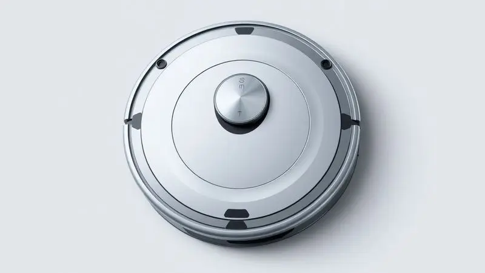
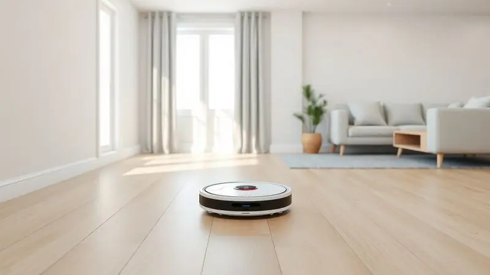
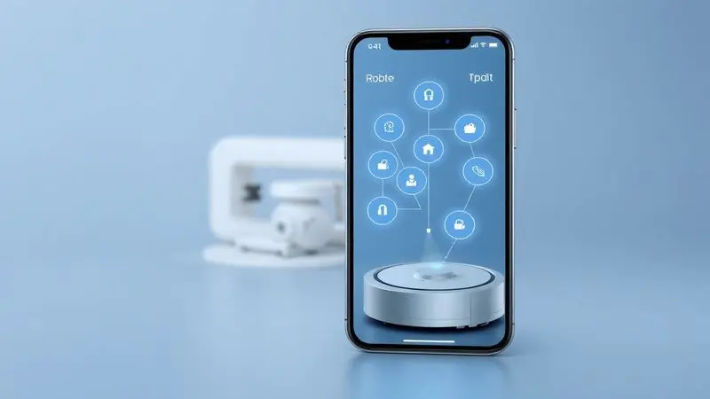

Imagine acordar num sábado e, em vez de passar horas varrendo e limpando, poder relaxar sabendo que seu piso está impecável. É essa promessa de liberdade que o Electrolux ERB40 traz, mas será que ele entrega na prática?

Com a oferta de três funções num único aparelho, varrer, aspirar e passar pano,  esse robô se posiciona como um aliado inteligente para o dia a dia corrido.

Nesta análise, vamos além das especificações técnicas para descobrir como ele realmente se comporta na sua casa, desde a primeira conexão até a rotina de manutenção, e se o investimento realmente compensa frente às alternativas do mercado.

<SummaryList products={frontmatter.top_products} />

## Ficha técnica do Electrolux ERB40

<ProductBox 
  title={frontmatter.top_products[0].title} 
  image={frontmatter.top_products[0].image} 
  link={frontmatter.top_products[0].link} 
/>

Pense no ERB40 como um multitarefas doméstico: ele não apenas aspira, mas também varre e pode passar pano seco ou úmido em uma única passada.

Com apenas 8 centímetros de altura, ele alcança aqueles cantos sob os móveis onde a vassoura tradicional nunca chega, eliminando a poeira esquecida que acumula alergias.

Sua inteligência vem dos sensores que previnem quedas de escadas e colisões com seus móveis favoritos, enquanto o filtro HEPA Allergy Protect garante que 99,9% das impurezas não voltem para o ar que sua família respira.

Programável via controle remoto ou aplicativo, ele oferece até 2 horas e 20 minutos de trabalho contínuo, retornando sozinho à base quando a bateria está baixa.

<CaixaProsContras>

**Prós:**

- Funcionalidade 4 em 1 que otimiza a limpeza

- Sensores que prevenem quedas e colisões

- Filtro HEPA que melhora a qualidade do ar

- Design compacto para limpar embaixo de móveis

**Contras:**

- Autonomia pode ser limitada em ambientes muito grandes

- Nível de ruído relativamente alto (72 dB)

</CaixaProsContras>

## Design e construção do robô aspirador

A beleza do ERB40 está na sua discrição. Seu design arredondado e moderno se integra à sua decoração como mais um eletrodoméstico sofisticado, não como um robô intrusivo.

Mas não se engane pela aparência: por trás das curvas elegantes há uma construção robusta preparada para anos de serviço.

As escovas laterais trabalham como mãos extras, alcançando poeira em cantos que o corpo principal não toca, enquanto o perfil baixo desliza sob camas, sofás e armários sem esforço.

É essa combinação entre estética e funcionalidade que transforma o aparelho de um simples aspirador em um verdadeiro componente da sua casa.

## Funcionamento e experiência de uso na limpeza

Ligar o ERB40 pela primeira vez é como dar as boas-vindas a um novo membro da família que entende suas necessidades. Ele mapeia o ambiente com uma curiosidade meticulosa, identificando onde a sujeira se esconde e ajustando sua estratégia conforme o tipo de piso.

Você pode programá-lo para trabalhar enquanto você está no trabalho, chegando em casa com os pisos já impecáveis, ou usar o controle remoto para guiá-lo até aquele derramamento de café na cozinha.

A experiência é de parceria: você define as regras, ele executa com precisão.

### Nível de ruído e consumo de energia

Ao contrário do zumbido constante dos aspiradores tradicionais, o ERB40 trabalha com uma discrição quase imperceptível. A 72 dB, ele é mais silencioso que uma conversa normal, permitindo que você assista TV, trabalhe ou simplesmente relaxe sem interrupções.

E enquanto limpa sua casa, ele também poupa sua conta de luz. O consumo eficiente significa que você pode mantê-lo na rotina diária sem preocupações com o gasto energético, algo que se soma às economias de tempo que ele já proporciona.

### Cobertura e autonomia da bateria

Com autonomia para até 140 minutos (confirmação da ficha técnica), o ERB40 cobre espaços de até 120m² em um único ciclo, ideal para apartamentos e casas médias.

Quando a energia está acabando, ele encontra sozinho o caminho de volta à base, como se tivesse memória fotográfica do seu espaço.

Essa inteligência significa que você nunca precisará resgatá-lo de um canto esquecido com a bateria morta. Ele simplesmente reaparece carregado e pronto para a próxima missão, criando um ciclo de limpeza que funciona no piloto automático.

## Recursos, aplicativo e conectividade

O verdadeiro poder do ERB40 se revela quando você conecta ele ao seu smartphone. Através do aplicativo, você agenda limpezas semanais, cria zonas proibidas (como onde o bebê está brincando) e recebe relatórios de quais áreas foram mais sujas.

E para quem já conversa com assistentes em casa, a compatibilidade com comandos de voz significa que você pode pedir uma limpeza extra na sala enquanto prepara o jantar, sem tirar as mãos da massa.

### Acessórios inclusos e rotina de manutenção

Da caixa já saem todos os parceiros necessários: a estação de carregamento discreta, escovas laterais de reposição e o filtro HEPA que será seu aliado contra alergias.

A manutenção é tão simples quanto esvaziar o compartimento de poeira a cada poucos usos e dar uma rápida escovada nas rodinhas.

São apenas minutos por semana que garantem anos de serviço eficiente, uma troca mais que justa pelas horas que ele economiza na sua rotina.

## Principais concorrentes e comparativos de mercado

No universo dos robôs aspiradores, o ERB40 encontra rivais ilustres. O Roomba da iRobot brilha na navegação inteligente, enquanto os Roborock da Xiaomi impressionam pelo custo-benefício e potência bruta.

Mas o que diferencia o Electrolux é o equilíbrio. Ele não é o mais poderoso, nem o mais tecnológico, mas entrega uma experiência completa e confiável por um preço que não exige um empréstimo.

Para quem busca um parceiro diário que simplesmente funciona, sem complicações excessivas, ele ocupa um espaço único.

## Conclusão

O Electrolux ERB40 não é um robô revolucionário, e talvez essa seja sua maior virtude. Ele é o assistente confiável que você sempre quis: aparece, faz seu trabalho com competência e some até ser necessário novamente.

Sua tripla função elimina a necessidade de múltiplos aparelhos, enquanto os sensores inteligentes oferecem a tranquilidade de deixá-lo trabalhar sozinho.

Para residências de tamanho médio, com pisos mistos e rotinas ocupadas, ele entrega exatamente o que promete: uma casa mais limpa com menos esforço.

Se você está cansado de dedicar suas manhãs de sábado à limpeza, mas não quer investir em tecnologia complexa demais para suas necessidades, o ERB40 representa aquele ponto ideal entre funcionalidade e simplicidade.

Ele limpa sua casa para que você possa limpar sua agenda para o que realmente importa.

---

Ainda em dúvida se o Electrolux ERB40 é ideal para você? Veja nosso ranking completo dos [melhores robôs aspiradores 3 em 1](/robo-aspirador-3-em-1-qual-o-melhor/) e encontre o perfeito para sua casa.
