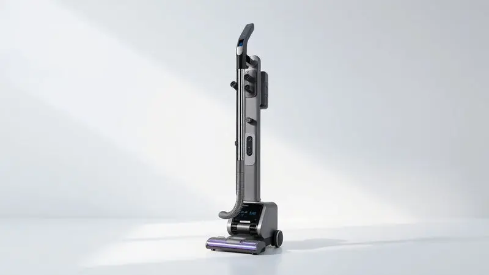
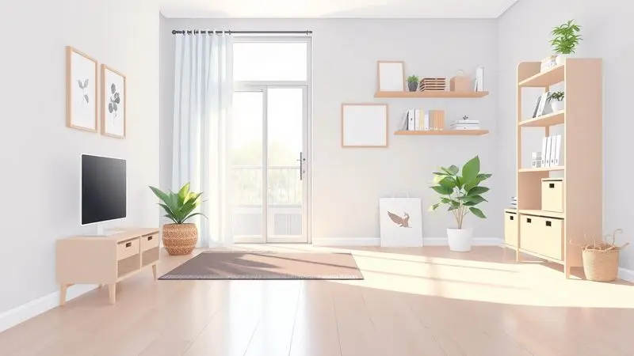

Manter a casa limpa exige praticidade, e o Aspirador Vertical Portátil Elgin Perfect Clean ASP1001 surge como uma opção versátil para quem busca eficiência no dia a dia.

Mas, com tantas opções no mercado, será que esse modelo 2 em 1 da Elgin é realmente bom e potente o suficiente para a sua rotina? Muitas pessoas têm dúvidas se a marca é confiável em eletroportáteis e se o filtro HEPA realmente entrega o que promete.

Vamos às respostas, começando pelo que esse aspirador traz de fábrica.

<SummaryList products={frontmatter.top_products} />

## Ficha Técnica Detalhada do Elgin Perfect Clean ASP1001

<ProductBox 
  title={frontmatter.top_products[0].title} 
  image={frontmatter.top_products[0].image} 
  link={frontmatter.top_products[0].link} 
/>

Para responder à questão da potência, vamos direto aos números: o ASP1001 conta com um motor de 1200W. Essa força se traduz em sucção eficiente, mas a verdadeira magia está na sua versatilidade.

Ele é um 2 em 1 genuíno, funcionando perfeitamente como aspirador vertical para pisos e como portátil para sofás, escadas e até o interior do carro. Seu reservatório transparente tem capacidade de 1 litro, então você vê exatamente quando é hora de esvaziá-lo.

O componente que mais chama a atenção, porém, é o filtro HEPA, projetado para reter partículas microscópicas que outros aspiradores devolveriam ao ar.

Com cerca de 1,85 kg e um cabo que gira em torno de 4,5 metros, o design prioriza a leveza e uma mobilidade decente dentro do raio de uma tomada.

<CaixaProsContras>

**Prós:**

- Potência de 1200W que garante eficiência na limpeza.

- Funcionalidade 2 em 1: vertical e portátil.

- Filtro HEPA que retém alérgenos e partículas finas.

- Design compacto e leve facilita o manuseio.

**Contras:**

- Cabo pode ser um ponto frágil.

- Funciona apenas conectado à corrente elétrica.

</CaixaProsContras>

## Análise Detalhada: O Aspirador Vertical Portátil Elgin Perfect é bom?

Especificações no papel são uma coisa. A pergunta que vale é: na correria do dia a dia, ele se torna um aliado ou mais um trambolho no armário? A análise prática revela um aparelho que entende a missão de simplificar a limpeza rápida.

### Potência, Capacidade de Armazenamento e Sistema de Filtragem (Filtro HEPA)

Os 1200W não são um número vazio. Você percebe a diferença na primeira passada sobre um tapete: a sucção é firme e resolve rapidamente migalhas e sujeira solta.

O reservatório de 1 litro é o ponto ideal para limpezas ágeis em apartamentos ou para manutenção diária em casas maiores, evitando aquela parada constante para esvaziar. O verdadeiro trunfo, no entanto, está no filtro HEPA.

Para quem espirra só de pensar em poeira, ou para famílias com crianças pequenas que brincam no chão, essa tecnologia faz toda a diferença. Ele não apenas recolhe a sujeira, mas a prende, dando aquela sensação de limpeza que vai além do visível.

### Design, Tipo de Uso e Ergonomia (Aspirador Vertical 2 em 1)

Aqui é onde o conceito 2 em 1 ganha vida. Na posição vertical, ele desliza facilmente pela sala.

Quando você avista pelos de pet no sofá ou farelos no assento do carro, um simples clique libera o corpo principal, transformando-o num aspirador de mão surpreendentemente potente.

O peso leve é uma bênção para os ombros e punhos, permitindo que você alcance prateleiras altas ou cantos atrás dos móveis sem se sentir como se estivesse levantando peso.

E, por ser compacto, ele some facilmente num cantinho do armário ou atrás da porta, sem demandar um espaço especial.

## Destaques e Principais Recursos

Mais do que a soma de suas partes, o grande apelo do Perfect Clean ASP1001 é a simplicidade integrada. Ele não promete revoluções, mas sim uma execução competente e sem complicações.

Imagine um único aparelho que resolve a limpeza rápida do piso, dá conta de um derramamento na cozinha, refresca os estofados antes da visita e ainda ajuda a limpar o carro no fim de semana. Ele tira da sua cabeça a necessidade de múltiplas ferramentas.

A manutenção é direta: esvazie o reservatório transparente, lave o filtro conforme a necessidade, e guarde. É essa combinação de eficácia sem firulas e facilidade de uso que o torna um companheiro diário discreto e eficiente.

## O que os consumidores dizem sobre o Elgin Perfect? (Opinião de quem comprou)

Quem já levou o ASP1001 para casa tende a validar exatamente essa proposta de praticidade. A leveza é um elogio quase unânime, frequentemente citada por pessoas que sofriam com a fadiga de usar aspiradores mais pesados.

A potência da sucção também é destacada, com muitos relatando surpresa positiva ao ver como ele lida bem com tapetes e pisos lisos.

Um ponto de atenção que aparece regularmente é, como indicado na ficha técnica, a atenção necessária com o cabo durante o uso e o armazenamento, para evitar danos.

No balanço geral, para quem busca um eletroportátil funcional, versátil e de manutenção simples, os relatos apontam para uma experiência bastante satisfatória.

## A marca Elgin é boa e confiável no segmento de eletroportáteis?

Comprou, gostou, mas e se der problema? Aí entra a importância de conhecer a marca por trás do produto. A Elgin não é uma novata no mercado brasileiro.

Com uma trajetória longa no segmento de eletroportáteis, ela construiu uma reputação baseada na oferta de produtos com uma relação custo-benefício equilibrada.

Não é a marca do luxo inacessível, mas sim da durabilidade e funcionalidade pensada para a realidade doméstica brasileira. Isso se reflete em uma rede de assistência técnica acessível espalhada pelo país, o que traz uma tranquilidade importante pós-compra.

Ao escolher um aspirador Elgin, você está optando por uma fabricante consolidada, com know-how e suporte estabelecidos.

## Aspiradores Similares para Considerar

Se o perfil do Perfect Clean fez sentido, mas você quer garantir que fez uma pesquisa completa, vale dar uma olhada em outros nomes do segmento. O Electrolux Ergorapido é um concorrente direto muito popular, também na categoria 2 em 1 com fio.

O Black+Decker oferece opções interessantes na linha Lithium. E, é claro, se o orçamento permitir uma incursão no segmento premium, o Dyson V8 é uma referência absoluta em potência e design inovador, ainda que opere numa faixa de preço completamente diferente.

A dica final é simples: defina sua prioridade máxima. É o menor peso possível? A potência bruta? A presença de um filtro HEPA de verdade? A resposta vai direcionar você para o modelo ideal.

## Conclusão

O Aspirador Vertical Portátil Elgin Perfect Clean ASP1001 cumpre com honestidade a proposta que anuncia. Ele é, de fato, um aliado prático para a limpeza do dia a dia, respondendo positivamente às dúvidas iniciais sobre potência e eficiência.

Sua força de 1200W é suficiente para a maioria das tarefas domésticas, a versatilidade 2 em 1 entrega uma conveniência real, e o filtro HEPA agrega um valor importante em termos de qualidade do ar.

A leveza e o design funcional fazem dele um aparelho fácil de usar e guardar. A dependência da tomada e a atenção com o cabo são compromissos inerentes ao seu perfil e preço.

Se você busca um eletroportátil confiável, de uma marca estabelecida, para resolver limpezas rápidas e multifuncionais sem complicação, o Perfect Clean se apresenta como uma escolha muito sólida.

Ele não é o aspirador revolucionário sem fio, mas é, com certeza, uma ferramenta competente e que entrega exatamente o que promete.

---

Ainda na dúvida sobre o melhor aspirador para sua casa? Confira nosso ranking completo dos [melhores robô aspiradores de 2025](/melhores-robo-aspirador-2024/).
