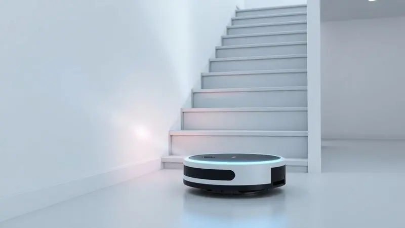
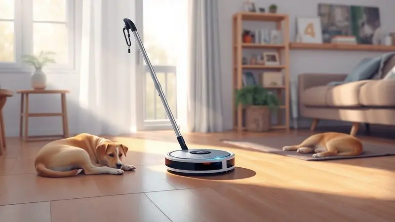
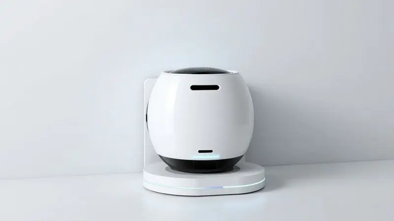

Com o mercado de robôs aspiradores de entrada aquecido, o Aspirador de Pó Robô EOS Smart Clean Ear01T surge como uma opção acessível da renomada marca brasileira.

Mas a pergunta que fica é: será que um modelo mais econômico realmente entrega uma limpeza eficiente ou é apenas um acessório básico? Ele promete lidar com pelos de pets e diferentes superfícies, mas será que cumpre?

Exploramos a fundo o desempenho real, a autonomia e o custo-benefício para descobrir se o EOS Smart Clean é um bom investimento para sua rotina.

<SummaryList products={frontmatter.top_products} />

## Ficha Técnica do EOS Smart Clean EAR01T

<ProductBox 
  title={frontmatter.top_products[0].title} 
  image={frontmatter.top_products[0].image} 
  link={frontmatter.top_products[0].link} 
/>

Imagine ter um ajudante silencioso de apenas 1kg que desliza por baixo dos seus móveis.

É esse o perfil do EOS Smart Clean EAR01T: compacto (26cm de diâmetro por 8cm de altura), ele oferece uma funcionalidade 3 em 1 que aspira, varre e passa pano através de quatro modos de limpeza adaptáveis.

O segredo para sua independência é a bateria de lítio, que dá até 100 minutos de trabalho antes de pedir uma recarga de 4 a 5 horas. Com um reservatório de 250ml, você evita o transtorno de esvaziar o robô a toda hora.

E, operando a cerca de 65dB (volume similar a uma conversa tranquila), ele não atrapalha seu home office ou seu momento de descanso.

Embora não substitua a faxina pesada do fim de semana, ele é um aliado excepcional para manter o chão sempre apresentável, especialmente em lares com pets ou crianças.

<CaixaProsContras>

**Prós:**

- Design compacto que acessa facilmente áreas difíceis.

- Funcionalidade 3 em 1 (aspira, varre e passa pano).

- Sensores que evitam quedas e obstáculos durante a navegação.

- Bom custo-benefício para ajuda na limpeza diária.

**Contras:**

- Não substitui uma limpeza profunda; é mais indicado para manutenção.

- O modo "passa pano" é mais eficaz em poeira fina do que na lavagem pesada do chão.

</CaixaProsContras>

## Principais Características e Destaques

Mas como essas especificações técnicas se traduzem para o seu dia a dia? A combinação de sensores anti-queda e navegação inteligente significa que você pode ligar o robô e esquecer dele.

Sua mente fica livre, sabendo que ele não vai despencar da escada ou ficar preso atrás do sofá.

A autonomia robusta permite que ele cubra áreas médias sem pedir socorro à tomada, enquanto o controle via aplicativo transforma a limpeza em um ato que você programa uma vez e ele executa religiosamente, adaptando-se à sua rotina, não o contrário.

## Design e Construção

Essa inteligência de navegação só é possível graças a um design pensado para a mobilidade. Com um corpo robusto mas leve, e rodas que transpiram confiança em qualquer tipo de piso, o EOS Smart Clean é construído para ser durável.

Sua estrutura compacta não é apenas estética, é funcional: é o que permite que ele alcance os cantos onde a poeira mais gosta de se esconder.

### Reservatório e Sensores Anti-Queda

Você sabe aquela frustração de ter que parar o que está fazendo para esvaziar o robô no meio da tarefa? Com 250ml de capacidade, o reservatório do EOS Smart Clean foi dimensionado para sessões completas em ambientes médios.

Isso significa menos interrupções e mais tempo livre para você. Já os sensores anti-queda são o seu seguro. Eles não protegem apenas o próprio robô de tombar de uma altura, eles protegem você da preocupação.

Podem programá-lo e sair de casa tranquilo, sabendo que sua casa está sendo limpa sem precisar de supervisão constante.

## Desempenho e Programas de Limpeza

E na prática, como ele se sai? A grande vantagem está na personalização. Com múltiplos programas, você pode escolher entre uma limpeza rápida no meio da semana ou uma mais intensa no sábado de manhã.

A tecnologia permite que ele ataque a sujeira de formas diferentes, garantindo que cada canto receba a atenção adequada, mesmo aqueles detrás do vaso sanitário ou embaixo da cama.

### Eficiência e Uso com Pets

Para quem convive com amigos peludos, a eficiência de um robô aspirador é posta à prova pelos temidos pelos. O EOS Smart Clean enfrenta esse desafio de frente.

Sua sucção potente e o design preciso das escovas são especialistas em capturar fios de cabelo e pelos de animais que uma vassoura comum apenas espalharia.

A combinação de autonomia suficiente e capacidade de chegar embaixo dos móveis significa que, mesmo nos dias de maior queda de pelo, você acorda (ou chega em casa) com os pisos visivelmente mais limpos, sem ter passado um minuto se curvando com a vassoura na mão.

## Autonomia da Bateria

Talvez um dos maiores medos ao comprar um robô seja o de ele "morrer" no meio da sala. Com o EOS Smart Clean, essa ansiedade fica de fora da equação.

Em modo contínuo, ele trabalha por impressionantes 120 minutos, o que é mais do que suficiente para uma limpeza completa em um apartamento de tamanho médio. E o melhor: quando a energia está no fim, ele tem a inteligência de retornar sozinho à base de carregamento.

Você não precisa caçá-lo pela casa ou carregá-lo manualmente. Ele faz o trabalho e volta para casa, deixando você livre para focar no que realmente importa.

## Peças de Reposição e Assistência Técnica

Um produto só é realmente bom se for fácil de manter no longo prazo. Aqui, a experiência pós-compra conta muito.

Partes como escovas e filtros são itens de desgaste natural, e a disponibilidade de peças de reposção originais é crucial para prolongar a vida do seu investimento. Antes de decidir, vale a pena verificar a reputação da marca no suporte técnico.

Ter a garantia de que, se algo acontecer, você terá um canal ágil para resolver o problema, é o que transforma uma compra inteligente em uma compra tranquila.

## Modelos Similares

É natural se perguntar como o EOS Smart Clean se posiciona diante de gigantes do mercado. O iRobot Roomba é a referência em tecnologia e eficácia, enquanto o Roborock S6 brilha no mapeamento inteligente e potência.

O Ecovacs Deebot também é forte concorrente, especialmente com funções de limpeza úmida.

A escolha entre eles depende muito do que você prioriza: o EOS Smart Clean se destaca justamente pelo equilíbrio entre funcionalidades inteligentes (navegação, sensores, app) e um preço de entrada mais amigável, oferecendo o essencial para transformar sua rotina sem pesar no orçamento.

## Conclusão

Afinal, o Robô Aspirador EOS Smart Clean EAR01T vale a pena? Para quem busca liberdade da faxina diária sem fazer um investimento exorbitante, a resposta é um ressonante sim. Ele não é uma ferramenta de limpeza profunda, mas sim um mantenedor incansável e inteligente.

A combinação de navegação que evita desastres, autonomia que inspira confiança e um aplicativo que coloca você no controle, cria uma experiência que vai muito além de apenas aspirar pó: ele te devolve tempo.

Se sua necessidade é ter um aliado para lidar com a poeira, migalhas e pelos do dia a dia, mantendo a ordem entre uma limpeza mais pesada e outra, o EOS Smart Clean se apresenta como uma das escolhas mais inteligentes e acessíveis do mercado brasileiro.

Ele transforma a manutenção da casa de uma tarefa cansativa em um processo automático e quase invisível, para que você possa focar no que realmente ama fazer.

---

Ainda na dúvida sobre o melhor robô aspirador para o seu dia a dia? Confira nosso [Ranking Completo dos Melhores Robôs Aspiradores de 2025](/melhores-robo-aspirador-2024/) e encontre a opção ideal!
