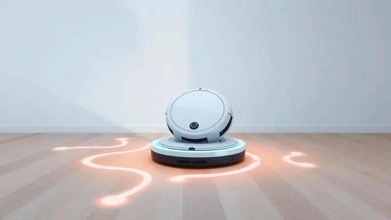
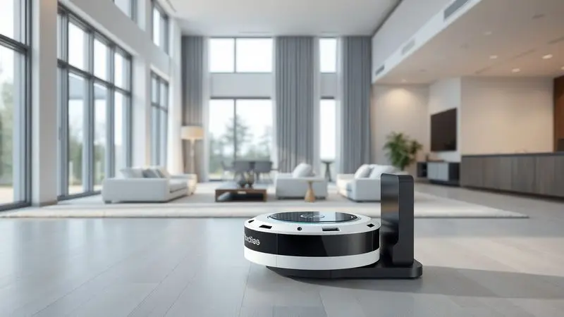
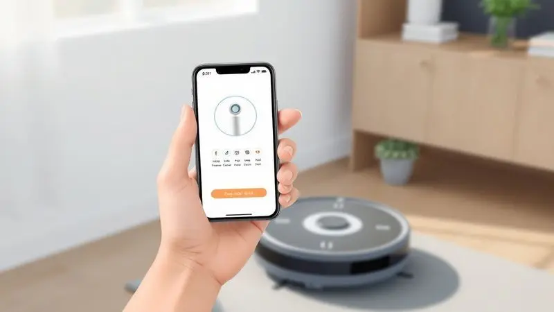

Manter a casa limpa sem esforço é o sonho de muitos, e o robô aspirador Housekeeper, da Polishop, surge como uma das opções mais conhecidas do mercado nacional.

No entanto, com tantas alternativas disponíveis e o avanço da tecnologia robótica, surge a dúvida: ele realmente entrega o que promete?

Neste artigo, vamos mergulhar nos detalhes técnicos, analisar o desempenho de limpeza em diferentes superfícies, a duração real da bateria e os diferenciais dos modelos da linha.

Se você está em dúvida se o robô aspirador Housekeeper é bom e se vale o investimento para a sua rotina, continue lendo para conferir nossa análise completa e o veredito final.

<SummaryList products={frontmatter.top_products} />

## Conheça a linha de robôs aspiradores Housekeeper da Polishop

Imagine chegar em casa e encontrar os pisos impecáveis, sem que você precise sequer pensar em pegar a vassoura. Essa é a proposta da linha Housekeeper, que une praticidade com tecnologia inteligente para transformar sua rotina de limpeza.

Com modelos que vão desde opções básicas até versões mais completas, há um Housekeeper para cada realidade doméstica.

A verdadeira magia está na autonomia: programe horários, controle pelo aplicativo e deixe que o robô cuide dos detalhes enquanto você se dedica ao que realmente importa.

## Design e Construção do Aparelho

<ProductBox 
  title={frontmatter.top_products[0].title} 
  image={frontmatter.top_products[0].image} 
  link={frontmatter.top_products[0].link} 
/>

À primeira vista, o Housekeeper conquista pela estética moderna e compacta. Disponível em cores como branco, vermelho e preto, ele se integra discretamente à sua decoração como um acessório high-tech, não como um eletrodoméstico intrusivo.

Com cerca de 15 cm de altura, navega pela maioria dos espaços, embora possa ter dificuldade para chegar debaixo de móveis muito baixos, uma consideração importante se sua cama ou sofá tiver vãos reduzidos.

A construção inteligente inclui sensores que monitoram o ambiente continuamente, evitando quedas de escadas e colisões com obstáculos.

O coletor de pó vem equipado com filtro HEPA lavável, uma vantagem prática que significa menos gastos com refil e mais ar puro circulando pelo ambiente.

Já a potência de 24W pode parecer básica em números, mas na prática é suficiente para lidar com a sujeira cotidiana, especialmente quando combinada com os diferentes modos de limpeza e o recurso de auto-carregamento.

<CaixaProsContras>

**Prós:**

- Design moderno e compacto.

- Diversas opções de cores para adaptação ao ambiente.

- Sensores para evitar quedas e obstáculos.

- Coletor de pó com filtro HEPA lavável.

**Contras:**

- Altura pode dificultar acesso a locais baixos.

- Potência considerada básica por alguns usuários.

</CaixaProsContras>

## Funções e modos de limpeza disponíveis

Essa construção inteligente ganha vida através dos diferentes modos operacionais.

Você não está limitado a uma única forma de limpeza: para áreas mais críticas, como a cozinha após o preparo de uma refeição, o modo espiral concentra a ação do robô onde é mais necessário.

A limpeza programada é onde a mágica acontece de verdade, definindo horários para que o Housekeeper trabalhe enquanto você está fora ou dormindo.

Alguns modelos ainda trazem o mapeamento inteligente, que otimiza as rotas para cobrir todo o ambiente sem repetições desnecessárias.

Sensores de detecção de sujeira garantem que áreas mais contaminadas recebam atenção extra, enquanto os sensores de obstáculos mantêm seus móveis protegidos.

A combinação dessas funcionalidades transforma o aparelho de um simples aspirador para um assistente doméstico verdadeiramente autônomo.

## Desempenho na limpeza e poder de sucção

Na hora da verdade, como ele se sai na remoção da sujeira? O Housekeeper demonstra ser um parceiro confiável para a limpeza diária, lidando eficientemente com diferentes tipos de piso.

Em superfícies lisas como porcelanato ou madeira, recolhe poeira e fiapos com facilidade. Nos carpetes, a sucção penetra o suficiente para remover a sujeira superficial, embora para tapetes mais grossos ou alto tráfego possa necessitar de passadas adicionais.

### Filtro de alta qualidade e vantagem de ser lavável

Um dos diferenciais mais práticos do Housekeeper é seu sistema de filtragem. Não se trata apenas de um filtro comum, mas de uma barreira HEPA que retém 99,97% das partículas de até 0,3 micrômetros.

Para quem tem alergias ou convive com pets, essa é uma característica transformadora: menos poeira, pelos de animais e ácaros circulando pelo ar que sua família respira.

A natureza lavável do filtro adiciona outra camada de conveniência. Imagine não precisar ficar comprando refis constantemente: basta enxaguar o filtro, deixar secar e reinstalar.

Essa não é apenas uma economia financeira, mas também uma atitude mais sustentável, reduzindo o descarte de componentes plásticos. Para manutenção de rotina, essa facilidade faz toda diferença na experiência de uso contínuo.

## Bateria e autonomia para grandes ambientes

Quantos metros quadrados ele realmente consegue limpar antes de precisar recarregar? A autonomia varia conforme o modelo e as configurações de uso, mas em média você pode esperar entre 60 e 120 minutos de operação contínua.

Na prática, isso significa tempo suficiente para limpar uma área de aproximadamente 80 a 150 m² em modo normal.

O verdadeiro diferencial para quem mora em espaços maiores é o sistema de auto-carregamento. Quando a bateria atinge cerca de 15%, o robô automaticamente retorna à base, se reconecta e recarrega completamente.

Se a limpeza não foi concluída, ele retoma exatamente de onde parou. Essa inteligência opera de forma tão discreta que você nem precisa acompanhar o processo.

Alguns modelos ainda oferecem modos de economia de energia que estendem a autonomia para superfícies menos sujas.

## Nível de ruído durante o funcionamento

O barulho é uma preocupação legítima, especialmente se você trabalha em home office, tem crianças pequenas ou animais sensíveis. O Housekeeper opera em um volume comparável ao de uma televisão em volume baixo ou uma conversa normal, geralmente entre 50 e 70 decibéis.

Em termos práticos, isso significa que você pode mantê-lo funcionando enquanto conversa ao telefone, assiste um programa ou simplesmente relaxa sem grandes distrações.

Modelos mais avançados da linha ainda oferecem modos silenciosos que reduzem ainda mais o ruído. Essa característica permite que você programe limpezas noturnas sem perturbar o sono, acordando com ambientes limpos e prontos para começar o dia.

A diferença em relação a um aspirador vertical tradicional é notável: em vez do ruído alto e constante, você tem um zumbido discreto que rapidamente se torna parte do ambiente.

## Controle e praticidade no dia a dia

É na rotina que o Housekeeper realmente brilha. Esqueça a necessidade de interromper o que está fazendo para aspirar a sala: com alguns toques no aplicativo, você programa a limpeza completa enquanto está no trabalho, na academia ou simplesmente relaxando.

Chegar em casa e encontrar os pisos impecáveis sem ter levantado um dedo é uma sensação que redefini sua relação com as tarefas domésticas.

O aplicativo oferece controle preciso: defina zonas específicas para limpeza extra, crie rotinas semanais diferentes para cada dia ou simplesmente ative o modo manual quando preferir. Para quem tem uma rotina irregular, a flexibilidade é total.

E se você prefere simplicidade, os controles físicos no próprio robô permitem operação básica sem necessidade de smartphone.

## Características técnicas e dimensões do produto

Por trás da simplicidade aparente, há tecnologia sofisticada trabalhando. A navegação por sensores cria um mapa mental do ambiente, permitindo que o robô se movimente de forma lógica e eficiente.

A potência de sucção ajustável automaticamente conforme o tipo de piso detectado garante desempenho otimizado tanto em cerâmica quanto em carpete.

Com aproximadamente 33 cm de diâmetro e 15 cm de altura, o formato compacto permite acesso a espaços que normalmente seriam negligenciados, como embaixo de camas, sofás e armários.

As escovas laterais estendem o alcance eficaz, varrendo sujeira de cantos e rodapés para a área central de sucção. Essa combinação de tamanho reduzido com alcance ampliado maximiza a cobertura em cada sessão de limpeza.

## Acessórios inclusos na embalagem

Ao abrir a caixa, você encontra tudo necessário para iniciar a operação imediatamente. Além do robô em si, vem um carregador, manual do usuário completo e, na maioria dos modelos, um par de escovas laterais extras.

Essas escovas são peças-chave para manter a eficiência em cantos e áreas de difícil acesso, e ter reservas significa prolongar o intervalo entre reposições.

Algumas versões incluem filtros HEPA adicionais, garantindo que você tenha sempre um disponível enquanto o outro seca após a lavagem. Modelos mais premium podem trazer também um suporte de parede para carregamento e armazenamento organizado.

Esses acessórios não são apenas complementos, mas peças que elevam a experiência de uso de bom para excelente, eliminando preocupações com manutenção imediata.

## Preço, garantia e disponibilidade no mercado

Encontrar o Housekeeper é fácil graça à ampla distribuição da Polishop, disponível tanto em lojas físicas quanto nas principais plataformas online. A garantia padrão de um ano oferece tranquilidade, com assistência técnica acessível em caso de necessidade.

Comparado a modelos internacionais de renome, o preço do Housekeeper se posiciona de forma competitiva, especialmente considerando sua disponibilidade nacional e suporte local.

A variação de preço entre os diferentes modelos reflete diretamente as funcionalidades inclusas. Investir em versões com mapeamento inteligente ou controle por aplicativo pode valer a pena se sua rotina demanda automação avançada.

Para necessidades mais básicas, as opções de entrada oferecem excelente custo-benefício.

Independente do modelo escolhido, a recomendação é clara: pesquise, compare e considere não apenas o preço inicial, mas o valor que cada funcionalidade traz para seu dia a dia específico.

## Principais concorrentes do Housekeeper

No universo dos robôs aspiradores, o Housekeeper disputa espaço com nomes consagrados. O iRobot Roomba é talvez o concorrente mais conhecido, com tecnologia de navegação avançada e potência de sucção robusta, porém com preço significativamente mais elevado.

O Roborock oferece um equilíbrio interessante entre performance e custo, com alguns modelos incluindo até limpeza molhada.

A Xiaomi se posiciona com opções acessíveis e conectividade inteligente, enquanto a Neato Robotics chama atenção com seu design em formato D, otimizado para cantos e áreas de difícil acesso.

Cada alternativa traz características únicas: o desafio é identificar qual combinação de funcionalidades, desempenho e investimento melhor se alinha com suas necessidades específicas e realidade doméstica.

## Conclusão

O robô aspirador Housekeeper representa mais do que um simples eletrodoméstico: ele é um investimento em tempo, tranquilidade e qualidade de vida.

Para quem busca transformar a obrigação da limpeza em uma rotina automática e discreta, ele entrega exatamente o que promete.

Os modelos variam de opções básicas e acessíveis a versões completas com todas as funcionalidades inteligentes, permitindo que você escolha conforme seu orçamento e necessidades.

Considerando desempenho, ruído, autonomia e facilidade de uso, o Housekeeper se consolida como uma escolha sólida no mercado nacional.

Não espere que ele substitua completamente uma limpeza profunda manual em situações específicas, mas para a manutenção diária que consome tempo precioso, ele é um aliado transformador.

Se você está cansado de perder minutos valiosos com vassouras e panos, e deseja recuperar esse tempo para o que realmente importa, o Housekeeper pode ser o primeiro passo para uma casa mais inteligente e uma rotina mais leve.

A decisão final, claro, depende de suas prioridades específicas, mas como solução de automação doméstica acessível e eficaz, ele certamente merece sua consideração.

---

Ainda na dúvida sobre qual robô aspirador escolher? Confira nosso [ranking completo dos melhores de 2025](/melhores-robo-aspirador-2024/) e encontre a opção ideal para sua casa.
