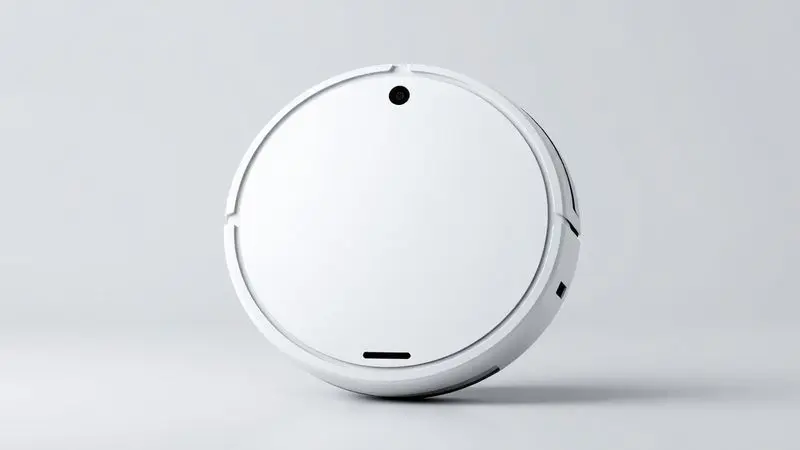
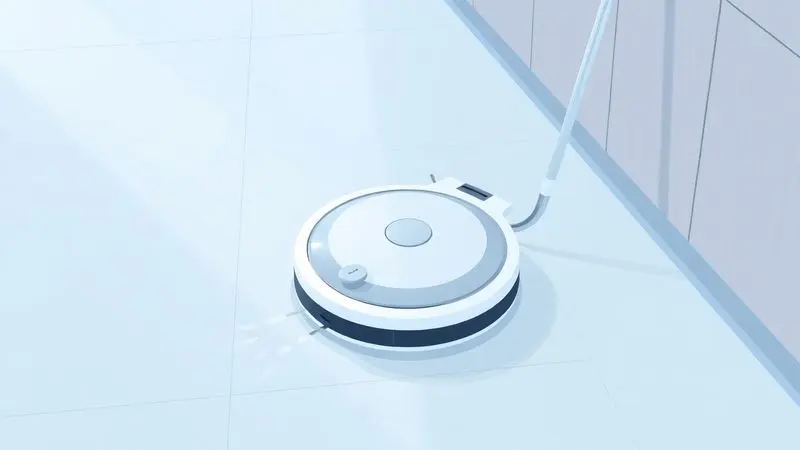
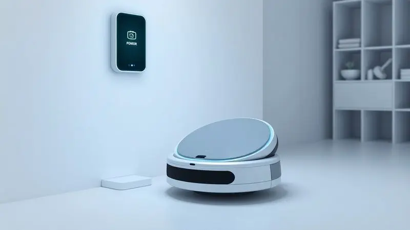

Ter um robô aspirador em casa deixou de ser um luxo para se tornar uma necessidade de praticidade e economia de tempo.

No entanto, com tantas opções no mercado nacional, a dúvida "robô aspirador Multilaser é bom?" é extremamente comum entre os consumidores que buscam custo-benefício.

A marca brasileira oferece uma linha diversificada, desde modelos de entrada até opções mais avançadas que passam pano úmido, como o popular Hydra.

Neste artigo, vamos analisar detalhadamente o desempenho, a bateria e as especificações dos principais modelos para descobrir se eles realmente valem o investimento para a sua rotina.

<SummaryList products={frontmatter.top_products} />

## Afinal, robô aspirador Multilaser é bom?

Imagine chegar em casa após um dia cansativo e encontrar os pisos limpos, sem precisar sequer pensar em pegar a vassoura. É essa promessa que os robôs aspiradores da Multilaser trazem para a sua rotina.

Eles conquistaram espaço por combinarem funcionalidades práticas com um preço que cabe no orçamento da maioria das famílias brasileiras.

O diferencial está na abordagem: enquanto marcas premium investem em mapeamento a laser e inteligência artificial avançada, a Multilaser foca no essencial.

Seus modelos geralmente oferecem os três modos de limpeza que realmente importam no dia a dia: varre, aspira e passa pano. Eles vêm equipados com sensores que evitam quedas e colisões, controles por aplicativo e, em alguns casos, até interação por voz.

É claro que há trade-offs. A eficácia pode variar dependendo do tipo de piso e da quantidade de sujeira. Se você tem uma casa grande com muitos móveis baixos, talvez precise considerar modelos com maior autonomia.

Mas para apartamentos e casas de tamanho médio, essas máquinas entregam exatamente o que prometem: uma limpeza automática que economiza horas preciosas da sua semana.

## Robô Multilaser Hydra

<ProductBox 
  title={frontmatter.top_products[0].title} 
  image={frontmatter.top_products[0].image} 
  link={frontmatter.top_products[0].link} 
/>

Quando o assunto é versatilidade, o Hydra se apresenta como um verdadeiro multitarefas doméstico.

Pense nele como o assistente ideal para quem quer resolver três problemas com uma única solução: pó acumulado, pelos de animais e aquela sujeira leve que fica grudada no piso.

A potência de aspiração deste modelo surpreende especialmente quem convive com pets. Em vez de passar o dia recolhendo fios de pelo que parecem se multiplicar magicamente, você programa o Hydra para fazer esse trabalho enquanto se concentra em outras coisas.

Sua bateria dura entre 1h30 e 2 horas, tempo suficiente para cobrir áreas consideráveis sem necessidade de intervenção.

Os sensores de obstáculos e antiquedas funcionam como um sistema de navegação básico mas eficiente. É verdade que versões mais simples podem não oferecer mapeamento interno ou conexão Wi-Fi.

Se você busca controle total através do smartphone e a capacidade de definir áreas específicas para limpeza, talvez prefira investir em opções mais tecnológicas. Mas se o objetivo é automatizar a limpeza geral com simplicidade, o Hydra cumpre muito bem seu papel.

<CaixaProsContras>

**Prós:**

- Funcionalidade 3 em 1 (varre, aspira e passa pano).

- Potência de aspiração impressionante para pelos de animais.

- Boa autonomia de bateria.

- Sensores de obstáculos e antiquedas para navegação segura.

**Contras:**

- Pode não incluir mapeamento interno em algumas versões.

- Falta de conectividade Wi-Fi nas versões mais simples.

</CaixaProsContras>

### Visual e Especificações do Hydra

O design do Hydra combina praticidade com estética moderna. Com formato circular e altura reduzida, ele desliza sob a maioria dos móveis sem dificuldade. As bordas arredondadas não são apenas uma questão de estilo, elas ajudam na manobra em cantos e espaços apertados.

Quanto às especificações técnicas, o destaque fica para os múltiplos modos de limpeza. Você pode escolher entre opções mais suaves para manutenção diária ou aumentar a potência quando a sujeira exigir mais atenção.

Os sensores funcionam como olhos digitais, detectando degraus e objetos antes do impacto, o que protege tanto o aparelho quanto seus móveis.

### Usabilidade e Desempenho de Limpeza

A verdadeira prova de um robô aspirador acontece na prática: ele realmente alivia sua carga de trabalho? Nos testes com modelos da Multilaser, a resposta tende a ser positiva para a maioria dos cenários domésticos.

A programação de horários transforma a limpeza em um hábito invisível. Imagine acordar com os pisos já limpos porque o robô trabalhou às 6 da manhã, enquanto você ainda dormia. Ou voltar do trabalho e encontrar a casa arrumada sem ter gasto energia física.

Essa é a magia da automação que esses aparelhos oferecem.

Para lares com crianças ou animais, o modo turbo faz diferença. Ele aumenta a sucção justamente onde mais precisa: nos cantos onde migalhas se acumulam, ao redor dos comedouros dos pets, nos corredores mais movimentados.

Já o modo silencioso permite que o robô trabalhe sem interferir em reuniões online ou momentos de descanso.

### Diferencial: Ele fala

Alguns modelos da linha trazem um toque de personalidade através da funcionalidade de voz. Mais do que um simples recurso tecnológico, essa característica cria uma relação diferente com o aparelho.

Em vez de ser apenas uma máquina silenciosa que percorre a casa, o robô se comunica. Ele avisa quando está começando a limpeza, informa se detectou uma área especialmente suja, notifica sobre a necessidade de voltar à base para recarga.

Essa comunicação em tempo real elimina a necessidade de ficar checando o aplicativo a todo momento.

Para quem não é tão familiarizado com tecnologia, os comandos de voz simplificam a interação. Basta falar instruções básicas para programar limpezas ou alterar modos, sem precisar navegar por menus complexos no smartphone.

### Bateria e Autonomia

A autonomia define os limites do que seu robô pode realizar em uma única sessão. Nos modelos Multilaser, as baterias variam entre 2.000 e 3.000 mAh, resultando em tempos de operação que vão de 60 a 120 minutos.

Traduzindo para a realidade da sua casa: uma bateria de 2.000 mAh geralmente é suficiente para apartamentos de até 70m², considerando que o robô não precisará limpar todos os cômodos simultaneamente.

Já as opções com 3.000 mAh atendem bem casas maiores ou situações onde você quer que o aparelho cubra toda a área de uma vez.

O segredo está no gerenciamento inteligente. Mesmo modelos com menor capacidade costumam retornar automaticamente à base quando a carga está baixa, recarregar parcialmente e retomar a limpeza do ponto onde pararam.

Essa funcionalidade garante que nenhum canto fique sem atenção apenas porque a bateria acabou no meio do processo.

## Robô ObaDuster

<ProductBox 
  title={frontmatter.top_products[1].title} 
  image={frontmatter.top_products[1].image} 
  link={frontmatter.top_products[1].link} 
/>

Se o Hydra é versátil para espaços médios, o que fazer quando você mora em um apartamento compacto ou precisa de um robô para áreas específicas? Conheça o ObaDuster, da Obabox, uma opção que prioriza agilidade em espaços reduzidos.

Com apenas 45 minutos de autonomia, ele pode parecer limitado à primeira vista. Mas essa característica se transforma em vantagem quando você precisa de limpezas rápidas e focadas.

Ideal para quem quer manter a cozinha limpa após as refeições ou o quarto arrumado antes de receber visitas.

A eficiência na remoção de pelos de animais mantém-se impressionante, considerando o tamanho compacto. Os sensores evitam colisões com móveis e detectam degraus, mesmo em espaços apertados.

O aplicativo intuitivo complementa a experiência, permitindo controlar o robô mesmo quando você não está em casa.

É verdade que o reservatório de 35 mL pede esvaziamento mais frequente em áreas maiores. E em locais com móveis muito baixos, sua performance pode encontrar limitações.

Mas para quem valoriza praticidade em dimensões reduzidas, o ObaDuster entrega exatamente o necessário.

<CaixaProsContras>

**Prós:**

- Função 3 em 1 (varre, aspira e passa pano)

- Eficaz na remoção de pelos de animais

- Design compacto e fácil de manusear

- Bom custo-benefício

**Contras:**

- Capacidade do reservatório pode exigir esvaziamento frequente

- Desempenho limitado em locais apertados

</CaixaProsContras>

## Robô Mars

<ProductBox 
  title={frontmatter.top_products[2].title} 
  image={frontmatter.top_products[2].image} 
  link={frontmatter.top_products[2].link} 
/>

Às vezes, simplicidade é a sofisticação mais inteligente. É nessa filosofia que o robô Mars da Multilaser se baseia: oferecer o básico bem feito, sem complicações desnecessárias.

Com peso de apenas 1,5 kg e dimensões compactas, ele é fácil de guardar em qualquer armário ou até mesmo sob a cama. A autonomia de até 2 horas surpreende para um modelo tão leve, cobrindo ambientes menores com folga.

Para famílias com pets, o Mars continua eficiente na coleta de pelos, mantendo os pisos apresentáveis entre limpezas mais profundas.

A função de passar pano funciona como um complemento útil para manutenção diária, embora não substitua uma limpeza manual quando a sujeira está mais impregnada.

A navegação aleatória é o ponto que exige ajuste de expectativas. Em vez de seguir padrões sistemáticos como modelos mais caros, o Mars explora o ambiente de forma orgânica.

Isso pode resultar em algumas áreas sendo limpas mais de uma vez enquanto outras recebem menos atenção. A solução? Programá-lo para trabalhar por períodos mais longos, garantindo que eventualmente toda a área seja coberta.

<CaixaProsContras>

**Prós:**

- Varre, aspira e passa pano em um único aparelho.

- Bateria com até 2 horas de autonomia.

- Ideal para lares com animais de estimação.

- Compacto e fácil de armazenar.

**Contras:**

- Função de passar pano é básica.

- Navegação aleatória pode deixar áreas não limpas.

</CaixaProsContras>

## Robô Orion

<ProductBox 
  title={frontmatter.top_products[3].title} 
  image={frontmatter.top_products[3].image} 
  link={frontmatter.top_products[3].link} 
/>

Quando a preocupação vai além da sujeira visível e atinge a qualidade do ar que sua família respira, o robô aspirador Multilaser Orion HO042 entra em cena. Seu diferencial mais significativo é o filtro HEPA, que retém até 99,9% das partículas microscópicas.

Para quem sofre com alergias ou tem crianças pequenas que brincam no chão, essa característica transforma o robô de um simples limpador em um aliado da saúde doméstica.

A cada passada, ele não apenas remove a sujeira aparente, mas também reduz ácaros, pólen e outras impurezas que ficariam suspensas no ar.

A autonomia de 2 horas permite sessões extensas de limpeza, com o bônus do retorno automático à base quando a bateria está baixa.

Os múltiplos modos de operação adaptam-se a diferentes necessidades: desde uma passada rápida para manutenção até uma limpeza mais profunda nos finais de semana.

Algumas ressalvas aparecem nas avaliações de usuários de longo prazo. A durabilidade da bateria pode diminuir com o tempo, um fenômeno comum em dispositivos com células de íon-lítio. A construção, embora funcional, não tem a robustez de marcas premium.

Mas considerando o investimento significativamente menor, o Orion oferece um equilíbrio interessante entre performance e acessibilidade.

<CaixaProsContras>

**Prós:**

- Eficiência na remoção de pelos de animais.

- Múltiplos modos de limpeza.

- Sensores que evitam quedas e colisões.

- Silencioso em comparação aos aspiradores convencionais.

**Contras:**

- A durabilidade da bateria pode diminuir com o uso.

- Qualidade de construção considerada baixa por alguns usuários.

</CaixaProsContras>

## Concorrentes Diretos no Mercado

Colocar os modelos Multilaser em perspectiva exige olhar para o que outras marcas oferecem. No universo dos robôs aspiradores, cada fabricante escolhe um caminho diferente.

A Roborock, por exemplo, investe pesado em tecnologia de navegação. Seus modelos com mapeamento a laser criam mapas precisos do ambiente, limpando de forma sistemática e eficiente.

São ideais para quem tem casas grandes com layout complexo e valoriza cobertura completa em cada sessão.

iRobot, com sua linha Roomba, é sinônimo de potência de sucção. A marca americana foca em remover sujeira incrustada e funciona particularmente bem em carpetes. Seu aplicativo é considerado um dos mais intuitivos do mercado.

Já a Ecovacs equilibra desempenho e recursos intermediários. Modelos como o Deebot oferecem limpeza úmida eficaz com preços mais acessíveis que as opções premium, criando uma ponte entre a simplicidade das marcas de entrada e a sofisticação das topo de linha.

Comparar essas opções com a Multilaser revela uma estratégia clara: enquanto concorrentes competem em tecnologia avançada, a marca brasileira disputa no território do essencial bem executado a preços que fazem sentido para a realidade econômica local.

## Conclusão

Escolher um robô aspirador Multilaser é como optar por um carro popular confiável em vez de um sedan de luxo cheio de tecnologias que você talvez nunca use. A decisão depende menos de especificações técnicas e mais do que realmente importa para sua rotina.

Se você busca um assistente doméstico que automatize a limpeza básica sem exigir um investimento exorbitante, os modelos da marca entregam exatamente isso.

O Hydra se destaca pela versatilidade, o Mars pela simplicidade, o Orion pela preocupação com a qualidade do ar e o ObaDuster pela agilidade em espaços reduzidos.

Cada um tem suas compensações. Autonomia limitada em alguns casos, navegação menos precisa em outros, construção mais simples. Mas todos compartilham uma característica fundamental: transformam horas de trabalho doméstico em minutos de configuração.

No final, a pergunta não é se os robôs aspiradores Multilaser são bons em termos absolutos, mas se são bons para você.

Para quem valoriza praticidade acessível, economia de tempo e uma limpeza consistente que mantém a casa apresentável entre faxinas mais profundas, a resposta tende a ser positiva.

Basta identificar qual modelo se encaixa no seu espaço, no seu orçamento e, principalmente, no seu estilo de vida.

---

Ainda na dúvida sobre qual robô aspirador escolher? Confira nosso [ranking completo dos melhores robôs aspiradores de 2025](/melhores-robo-aspirador-2024/) e encontre a opção perfeita para sua casa.
