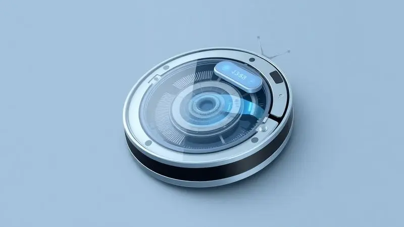
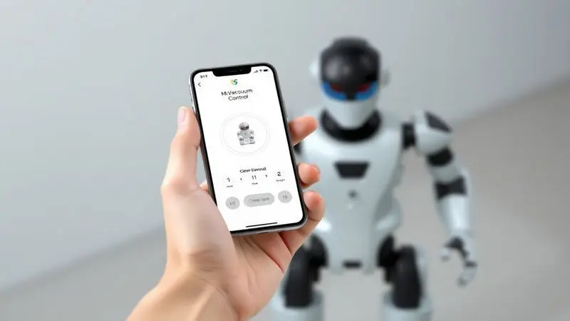
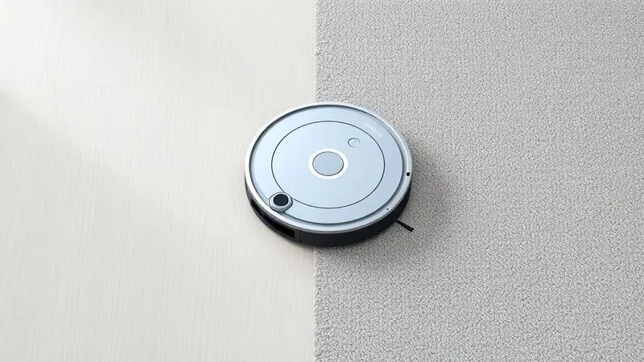
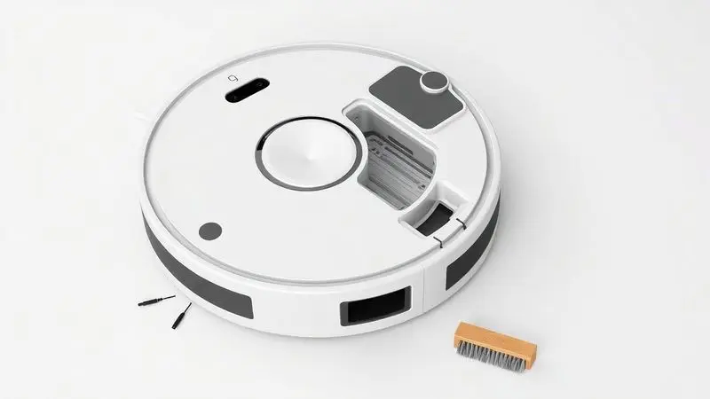

Ter um chão sempre limpo sem esforço é o sonho de muitos, e o Robô Aspirador Idali Life surge como uma opção acessível no mercado brasileiro. No entanto, com tantas marcas competindo, surge a dúvida: ele realmente entrega o que promete ou é apenas mais um gadget básico?

Nesta análise completa, mergulhamos nas especificações técnicas, desempenho real em diferentes superfícies e avaliações de quem já comprou. Se você busca praticidade no dia a dia, continue lendo para descobrir se o Idali Life é a escolha certa para sua residência.

<SummaryList products={frontmatter.top_products} />

## O Que Você Precisa Saber Sobre o Idali Life

<ProductBox 
  title={frontmatter.top_products[0].title} 
  image={frontmatter.top_products[0].image} 
  link={frontmatter.top_products[0].link} 
/>

Quer o principal filtrado em poucos parágrafos? O Robô Aspirador Idali Life entrega praticidade acima de tudo.

Você dorme tranquilo sabendo que seus sensores antiqueda evitam acidentes em escadas, algo que transforma uma simples compra em um investimento que cuida da sua casa mesmo quando você não está presente.

Mas as vantagens não param por aí. Com compatibilidade com Alexa e controle via aplicativo, imagine chegar da rua e, com um comando de voz simples, ter seu chão limpo sem precisar encostar em um cabo.

Para completar, alguns modelos trazem aquela função extra que faz toda diferença: passar pano. Você sente não apenas o piso limpo, mas aquele frescor no ar, como se tivesse acabado de fazer aquela faxina completa.

Já a manutenção? Mais simples do que parece. Os filtros duram cerca de um ano, e as escovas laterais têm um segredo interessante: podem ser revitalizadas em água fervente. Isso significa menos gastos recorrentes e mais tempo livre.

Agora, vamos ser sinceros. Como qualquer tecnologia, ele tem seus limites. Em tapetes muito altos ou em situações de sujeira realmente pesada, você ainda precisará da sua velha conhecida vassoura ou aspirador tradicional.

Mas para aquela limpeza de manutenção diária, que mantém sua casa sempre apresentável sem exigir horas da sua semana, o Idali Life se mostra uma escolha inteligente.

<CaixaProsContras>

**Prós:**

- Sensores antiqueda garantem segurança.

- Controle via aplicativo e compatibilidade com Alexa.

- Possui função de passar pano.

- Filtros duráveis e escovas renováveis.

**Contras:**

- Pode não ser tão eficaz em tapetes.

- Não é a melhor opção para sujeira pesada.

</CaixaProsContras>

### Visão Geral do Produto

Detalhando mais o que acabamos de resumir, o Idali Life se adapta como um camaleão para diferentes pisos.

De azulejos frios a carpetes aconchegantes, seus sensores não apenas navegam entre obstáculos, mas também ajustam a potência automaticamente conforme a necessidade do momento. É como ter um limpador personalizado para cada ambiente da sua casa.

E o ar que você respira? Aqui entra o sistema de filtragem, capturando não apenas poeira visível, mas também alérgenos que você nem percebe. Enquanto isso, a função de agendamento trabalha por você.

Programe para limpar enquanto você está no trabalho, na academia ou simplesmente aproveitando seus momentos de descanso.

### Modelos Disponíveis

Escolher o modelo certo é como encontrar o sapato que cabe perfeitamente. A linha Idali Life oferece variações que atendem desde quem mora sozinho em um apartamento compacto até famílias com casas mais espaçosas.

A diferença está nos detalhes: potência de sucção ajustada, capacidade do compartimento de sujeira e, em alguns casos, funcionalidades premium como lavagem de pisos e mapeamento inteligente da casa.

Pense na bateria como o combustível da autonomia. Alguns modelos duram mais, outros se concentram em potência. O segredo está em avaliar sua rotina e espaço. Uma casa grande exige mais autonomia, já um apartamento menor pode priorizar outras funcionalidades.

O mapeamento, por exemplo, transforma o robô de um limpador aleatório em um estrategista meticuloso.

## Funcionalidades e Recursos Essenciais

O que realmente faz o Idali Life valer seu espaço debaixo do sofá? Vamos além do básico e exploramos como cada recurso se traduz em benefícios tangíveis para seu dia a dia.

### Poder de Sucção e Modos de Limpeza

Sua casa tem poeira fina da janela, migalhas da cozinha, pelos de pet no sofá? O poder de sucção do Idali Life é como ter varredores especializados para cada tipo de sujeira. Mas a verdadeira mágica está nos modos de limpeza.

Precisa de uma passada rápida antes da visita chegar? Modo Turbo. Quer uma limpeza profunda no final de semana? Modo Intenso está disponível.

Os sensores funcionam como os olhos do robô, navegando pela sua sala, detectando degraus e ajustando a rota em tempo real. Você nunca mais precisa se preocupar em encontrá-lo preso embaixo do sofá ou tombado na escada.

### Conectividade e Controle por Aplicativo

O aplicativo transforma seu smartphone em um controle remoto da limpeza. Agende limpezas para horários específicos, ajuste configurações de áreas específicas ou simplesmente acompanhe o progresso em tempo real.

Receba uma notificação quando a limpeza terminar e outra quando for hora de esvaziar o compartimento.

E a interface? Projetada para quem não é técnico. Botões intuitivos, menus claros e personalização que realmente funciona. Para quem tem uma rotina corrida, isso significa otimizar cada minuto livre, transformando tarefas obrigatórias em processos automatizados.

### Bateria e Autonomia

Imagina seu robô parando no meio da sala por falta de bateria? Com cerca de 90 minutos em modo padrão, o Idali Life cobre áreas como salas e corredores sem interrupções desnecessárias.

Quando a energia está acabando, ele faz a parte mais inteligente: encontra sozinho o caminho de volta para a base de carregamento.

A autonomia varia, é verdade. Em piso duro, ele rende mais. Em carpetes grossos, um pouco menos. Mas para a rotina diária, os 90 minutos são mais do que suficientes, especialmente considerando que ele completa sua missão e volta para casa sozinho.

### Capacidade do Compartimento de Sujeira

Quem tem pets sabe: a quantidade de pelos surpreende a cada limpeza. A capacidade do compartimento, geralmente entre 300 e 600 ml, determina quantas sessões de limpeza você pode fazer antes de precisar esvaziar.

Um compartimento maior significa menos interrupções, ideal para casas grandes ou famílias com animais.

Mas atenção: capacidade extra pode significar volume extra. O equilíbrio está em encontrar o ponto ideal para seu espaço. Para um apartamento compacto, 300 ml pode ser mais do que suficiente.

Para uma casa com dois cachorros, talvez valha considerar os modelos com maior capacidade.

## Desempenho de Limpeza na Prática

Especificações são importantes, mas o que realmente importa é como ele se sai na sua casa. Vamos ao que realmente faz diferença quando você liga o aparelho.

### Eficiência em Diferentes Tipos de Piso

Cerâmica, madeira, carpete baixo ou alto - o Idali Life se adapta. A tecnologia de sensoriamento detecta a superfície e ajusta a potência automaticamente. Em piso duro, aumenta a eficiência para capturar poeira fina.

Em carpete, intensifica para chegar mais fundo, sempre com cuidado para não danificar o material.

O design compacto é outro trunfo. Ele alcança lugares que seu aspirador tradicional nunca chegaria: embaixo da cama, do sofá baixo, entre os móveis. É como ter uma limpeza completa sem precisar mover cada peça de mobília.

### Limpeza de Cantos e Obstáculos

Aqueles cantos próximos às paredes onde a poeira sempre se acumula? As escovas laterais do Idali Life são projetadas especificamente para isso. Elas giram para direcionar a sujeira para o centro do caminho, onde a sucção principal faz o trabalho.

Quanto aos obstáculos, os sensores funcionam como um radar preventivo. Eles detectam móveis, paredes e objetos antes do impacto, ajustando a rota de forma suave. Seu sofá não vira um campo de batalha, mas sim parte de um percurso calculado.

### Nível de Ruído

Quer assistir sua série favorita enquanto o robô trabalha? Com um nível sonoro entre 60 e 70 decibéis - comparável a uma conversa normal - ele permite que a vida continue normalmente.

Muitos usuários relatam que o ruído se torna quase imperceptível depois de alguns minutos, especialmente em ambientes maiores.

Para quem trabalha em casa, isso significa poder programar a limpeza durante reuniões online sem interromper a concentração. Para famílias com crianças pequenas, significa não precisar esperar o horário da soneca para limpar a casa.

## Experiência do Usuário e Avaliações Reais

O que dizem as pessoas que realmente usam o Idali Life no dia a dia? Vamos além dos manuais e mergulhamos nos relatos práticos.

### O Que Dizem os Consumidores

Os elogios mais comuns giram em torno da autonomia e da programação. 'Chego em casa e a sala está limpa, como mágica', comenta um usuário. Outros destacam a eficiência em pisos duros e a surpresa com o desempenho em carpetes baixos.

As críticas, quando existem, são pontuais. Alguns mencionam que em tapetes muito felpudos ou em situações de sujeira muito concentrada (como terra de vaso derrubada), a limpeza não é completa.

No entanto, mesmo entre os que apontam limitações, a maioria concorda: para a manutenção diária, ele é imbatível em praticidade.

### Dicas de Uso e Manutenção

Quer fazer seu Idali Life durar anos? Comece pelo filtro. Mantenha-o limpo e troque conforme indicado - isso não apenas melhora a sucção, mas protege o motor.

Objetos pequenos como fios ou cabelos muito longos podem entupir as escovas, então uma rápida limpeza após cada uso evita surpresas.

A programação regular é seu aliado. Em vez de esperar a poeira acumular, programe limpezas curtas e frequentes. Uma passada rápida diária mantém sua casa sempre apresentável, sem grandes esforços.

Por fim, aquela limpeza mensal geral: retire as rodinhas, limpe os sensores com um pano seco e verifique se não há pelos acumulados nos eixos. Cinco minutos por mês que garantem anos de funcionamento perfeito.

## Preço e Custo-Benefício

Quanto custa a praticidade? Vamos analisar não apenas o preço na etiqueta, mas o retorno em tempo e qualidade de vida.

### Onde Encontrar e Variações de Preço

Amazon, Mercado Livre, lojas especializadas - o Idali Life está disponível em múltiplos canais. O segredo para uma compra inteligente? Comparar não apenas preços, mas condições.

Algumas plataformas oferecem garantia estendida, outras têm políticas de devolução mais flexíveis.

Fique atento às promoções sazonais, mas cuidado com ofertas muito abaixo da média. Pesquise o histórico de preços, veja avaliações do vendedor e, sempre que possível, opte por canais oficiais ou revendedores autorizados.

### Comparativo de Valor no Mercado

Em um mercado com opções de todas as faixas de preço, o Idali Life se posiciona no sweet spot: nem o mais básico (que frustra pelas limitações), nem o mais caro (que tem funções que você talvez nunca use).

Enquanto concorrentes focam em números técnicos isolados, o Idali Life equilibra potência com inteligência. A conectividade via aplicativo, que em marcas premium é comum, aqui se torna um diferencial acessível.

A durabilidade da bateria e a facilidade de manutenção também pesam na balança - são benefícios que reduzem custos a longo prazo.

## Veredito Final: Robô Aspirador Idali Life é Bom?

Chegamos ao cruzamento entre expectativa e realidade. O Idali Life cumpre o que promete?

### Análise Conclusiva e Recomendação

Se você busca um aliado para a limpeza de manutenção diária, o Idali Life entrega consistentemente. Sua programação flexível, sensores inteligentes e capacidade de limpar diferentes pisos o tornam uma solução prática para quem valoriza tempo livre.

As limitações existem, sim. Em tapetes muito altos ou em situações de sujeira concentrada e pesada, ele não substitui um aspirador tradicional. Mas essa não é sua proposta.

A proposta é manter sua casa sempre apresentável, reduzir aquele pó que se acumula silenciosamente e permitir que você chegue em casa com o chão limpo, mesmo após um dia corrido.

Sua autonomia de aproximadamente 90 minutos atende bem a maioria dos apartamentos e casas médias. Para espaços muito amplos, talvez seja necessário dividir a limpeza por áreas.

### Para Quem Este Modelo é Ideal

Imagine uma família com duas crianças pequenas, onde o tempo é escasso e o chão parece acumular brinquedos e migalhas por magia. Para eles, o Idali Life é um salvador. Ou pense em quem trabalha em casa e quer manter o ambiente limpo sem interromper o fluxo de trabalho.

Ou ainda, quem tem pets e quer controle diário dos pelos sem precisar varrer todos os dias.

Também é perfeito para apartamentos compactos, onde cada centímetro conta e a movimentação entre cômodos precisa ser eficiente. Para idosos que desejam autonomia sem esforço físico excessivo. Para solteiros ocupados que chegam em casa cansados e só querem descansar.

## Conclusão

O Robô Aspirador Idali Life não promete milagres, mas entrega uma transformação silenciosa na sua rotina doméstica.

Ele é aquele parceiro que trabalha nos bastidores, garantindo que sua casa esteja sempre pronta para receber visitas inesperadas, que seus pés encontrem o chão limpo ao acordar, que o pó não se acumule nos cantos enquanto sua vida acontece em primeiro plano.

Investir nele é investir em qualidade de vida. É trocar horas de faxina por momentos com a família, por hobbies negligenciados, por simplesmente não fazer nada.

É ter a garantia de que, mesmo nos dias mais corridos, sua casa mantém aquele padrão de limpeza que faz diferença no seu bem-estar.

Se você reconhece seu perfil nas situações que descrevemos - se busca praticidade sem comprometer eficiência, tecnologia acessível sem complicações -, o Idali Life pode ser exatamente o que falta para otimizar sua rotina.

Dê o primeiro passo para transformar a limpeza de uma obrigação cansativa em uma tarefa automatizada que funciona por você, não contra você.

---

Ainda em dúvida se o Idali Life é o ideal para você? Confira nosso [ranking dos melhores robô-aspiradores custo-benefício de 2025](/robo-aspirador-qual-o-melhor/) e encontre a opção perfeita para sua casa.
