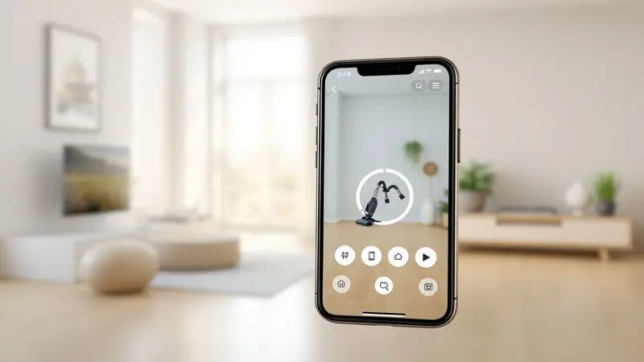
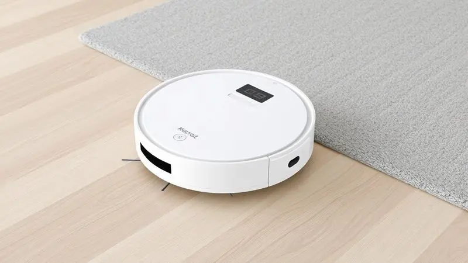
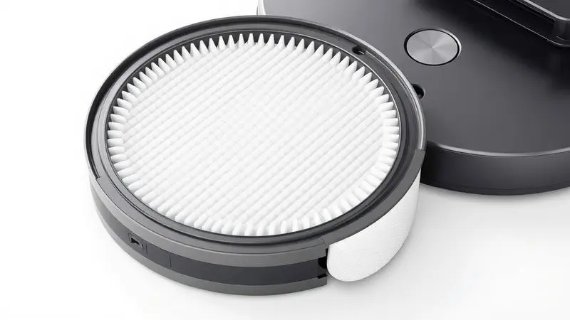

Os robôs aspiradores da iLife conquistaram o mercado por oferecerem uma solução prática e acessível para a limpeza doméstica.

No entanto, com a diversidade de modelos disponíveis, como o multifuncional ILIFE V3x, que aspira e passa pano, e o clássico iLife V3s Pro, focado em pelos de animais, surge a dúvida: qual deles é o melhor investimento?

Será que a tecnologia de sucção e os recursos inteligentes realmente valem a pena na rotina do dia a dia?

Neste guia completo, analisamos detalhadamente o desempenho, as especificações técnicas e o custo-benefício de cada modelo para ajudar você a decidir qual robô aspirador iLife é o ideal para sua casa.

<SummaryList products={frontmatter.top_products} />

## Visão Geral do ILIFE V3x Aspirador e Esfregão Robótico

<ProductBox 
  title={frontmatter.top_products[0].title} 
  image={frontmatter.top_products[0].image} 
  link={frontmatter.top_products[0].link} 
/>

Imagine um assistente que não só aspira, mas também esfrega seus pisos enquanto você cuida de outras tarefas. É exatamente isso que o ILIFE V3x oferece: um verdadeiro 2 em 1 que combina aspiração e esfregação em uma única solução prática para seu dia a dia.

Seu motor inteligente percebe quando encontra um carpete e aumenta automaticamente a potência para lidar com a sujeira mais teimosa.

A navegação organizada garante que ele cubra sua casa de maneira eficiente, evitando aquela sensação frustrante de áreas esquecidas. Controle tudo pelo aplicativo no seu smartphone ou simplesmente peça para a Alexa ou Google Home iniciar a limpeza.

Com até 120 minutos de autonomia, ele é um parceiro confiável para a maioria dos lares, embora espaços muito extensos possam exigir uma pausa para recarregar.

<CaixaProsContras>

**Prós:**

- Funcionalidade 2 em 1 (aspiração e esfregação)

- Potência de sucção ajustável para carpetes

- Navegação inteligente que evita limpezas repetitivas

- Controle via aplicativo e comandos de voz

**Contras:**

- A autonomia pode ser insuficiente para casas grandes

- O reservatório pode precisar ser esvaziado frequentemente em lares com animais

</CaixaProsContras>

### Sucção Potente para Limpeza Profunda

O que realmente diferencia esses robôs é como eles transformam especificações técnicas em resultados práticos. Aquela potência de sucção não é apenas um número no manual: é a garantia de que pelos de animais, migalhas e poeira não terão chance.

O motor adaptativo do V3x aumenta a força automaticamente em carpetes, enquanto o V3s Pro foi otimizado especificamente para a guerra contra os pelos dos pets.

A tecnologia vai além da simples aspiração. Sensores inteligentes guiam esses assistentes até os cantos mais difíceis, aqueles lugares embaixo dos móveis onde a vassoura tradicional nunca chega. O resultado?

Uma limpeza que você pode realmente confiar, não apenas uma passada superficial.

### Função 2 em 1: Aspirador e Esfregão

Enquanto o V3s Pro foca na especialidade, o V3x brilha na versatilidade. Ter um dispositivo que tanto aspira quanto esfrega significa menos tempo gasto com limpeza e mais tempo para o que realmente importa.

Imagine lidar com um derramamento no piso da cozinha: em vez de pegar primeiro o aspirador e depois o pano, você simplesmente programa o V3x e ele cuida de tudo.

Essa multifuncionalidade é especialmente valiosa para famílias com crianças ou animais, onde acidentes são parte da rotina.

A praticidade de manter seus pisos impecáveis sem precisar trocar de equipamentos transforma a tarefa mais tediosa do lar em algo que acontece quase magicamente no fundo da sua rotina.

### Controle Inteligente: App, Alexa e Google Home

A verdadeira revolução desses robôs está na forma como você interage com eles. Programar uma limpeza enquanto está no trabalho, ajustar configurações pelo celular ou simplesmente dizer "Alexa, limpe a sala" transforma a experiência doméstica.

O V3x leva vantagem aqui com sua conectividade completa, permitindo que você gerencie tudo remotamente.

Já o V3s Pro oferece uma abordagem mais direta: controle remoto físico e simplicidade de operação. Para quem prefere tecnologia descomplicada, essa pode ser a escolha ideal.

Ambos, no entanto, compartilham o mesmo objetivo: dar a você controle sobre quando e como sua casa fica limpa.

### Desempenho de Limpeza em Diferentes Tipos de Piso e Pelos de Animais

A verdadeira prova desses robôs vem quando eles encontram os desafios reais da sua casa. Madeira, cerâmica, laminado ou carpete: cada superfície exige uma abordagem diferente, e é aqui que a inteligência dos sensores faz a diferença.

O V3x ajusta sua estratégia conforme o piso, enquanto o V3s Pro demonstra sua especialidade ao lidar com pelos de animais em qualquer superfície.

Se você tem pets, sabe como os pelos parecem se multiplicar misteriosamente. O V3s Pro foi literalmente projetado para essa batalha, com um sistema de escovas que evita enrolamentos e uma sucção otimizada para capturar até os pelos mais teimosos.

A tranquilidade de chegar em casa e encontrar pisos limpos, mesmo depois de um dia inteiro com seus animais de estimação, é o verdadeiro benefício que essas máquinas oferecem.

## Análise Detalhada do Robô Aspirador iLife V3s Pro

<ProductBox 
  title={frontmatter.top_products[1].title} 
  image={frontmatter.top_products[1].image} 
  link={frontmatter.top_products[1].link} 
/>

Às vezes, a especialização supera a versatilidade. O iLife V3s Pro é a prova disso: um robô que sabe exatamente qual é sua missão e a executa com maestria.

Focado principalmente em pisos duros e na remoção de pelos de animais, ele é como um especialista contratado para uma tarefa específica.

Seu design livre de escovas principais é uma bênção para donos de pets: sem fios para os pelos se enrolarem, a manutenção se torna simples e rápida.

Operando por até 2 horas com níveis de ruído que não interferem em conversas ou concentração, ele trabalha discretamente no fundo da sua rotina.

A navegação aleatória tem seu charme: enquanto modelos mais avançados seguem padrões metódicos, o V3s Pro explora seu território como um verdadeiro aventureiro, eventualmente cobrindo toda a área.

O reservatório pode precisar de atenção frequente em casas muito movimentadas, mas para quem busca eficiência focada sem complicações tecnológicas, ele é uma escolha que entrega exatamente o que promete.

<CaixaProsContras>

**Prós:**

- Eficiente na remoção de pelos de animais.

- Ótimo desempenho em pisos duros.

- Custo-benefício atrativo.

- Design compacto que facilita acesso sob móveis.

**Contras:**

- Navegação aleatória pode deixar algumas áreas sem limpeza.

- Reservatório de pó pequeno requer esvaziamento frequente.

</CaixaProsContras>

### Desempenho na Limpeza e Eficiência do Filtro HEPA

A limpeza vai além do que os olhos veem. Enquanto esses robôs removem a sujeira visível, é o filtro HEPA que faz o trabalho invisível mas crucial: capturar alérgenos, ácaros e partículas microscópicas que afetam a qualidade do ar que sua família respira.

Essa característica transforma uma simples tarefa de limpeza em um investimento na saúde do seu lar.

A facilidade de manutenção do filtro significa que você não precisa ser um especialista para mantê-lo funcionando perfeitamente.

Remover, limpar ou substituir são processos intuitivos que garantem que o robô continue operando no seu potencial máximo, ciclo após ciclo de limpeza.

### Modos de Funcionamento e Uso do Controle Remoto

Flexibilidade na palma da sua mão: é assim que o controle remoto transforma a experiência com esses robôs.

Seja direcionando o V3s Pro para uma área específica que precisa de atenção extra ou alternando entre modos de limpeza no V3x, você tem o controle literalmente na ponta dos dedos.

Do modo automático para cobertura geral ao modo spot para lidar com acidentes localizados, essa personalização garante que seu robô se adapte às necessidades do momento, não apenas a uma programação genérica.

Para quem valoriza intervenção direta quando necessário, esse nível de controle faz toda a diferença.

### Praticidade e Agendamento de Limpeza no Dia a Dia

A verdadeira magia acontece quando você programa seu robô e esquece que ele existe.

Acordar com os pisos já limpos, chegar do trabalho encontrando a casa arrumada, ou simplesmente saber que a limpeza está acontecendo enquanto você se concentra em outras coisas: essa é a praticidade que redefine sua relação com as tarefas domésticas.

A tecnologia de navegação que evita obstáculos significa que você pode confiar que seu assistente robótico não vai ficar preso ou causar acidentes. É como ter um funcionário dedicado que nunca tira férias, nunca reclama e sempre cumpre seu horário com precisão.

## Comparativo Técnico: ILIFE V3x vs iLife V3s Pro

Escolher entre o V3x e o V3s Pro é como decidir entre um canivete suíço e uma ferramenta especializada. O primeiro oferece múltiplas funções em um pacote integrado, perfeito para quem busca conveniência abrangente.

O segundo foca em fazer uma coisa excepcionalmente bem, ideal para quem tem necessidades específicas.

### Autonomia da Bateria e Tempo de Carregamento

Com autonomia que varia de 80 a 120 minutos, esses robôs são projetados para a realidade da maioria dos lares. Imagine: tempo suficiente para limpar um apartamento de dois quartos completamente, ou manter áreas comuns de uma casa maior impecáveis.

O tempo de carregamento, embora não seja instantâneo, permite que você programe ciclos que se encaixem perfeitamente na sua rotina.

A chave está no planejamento inteligente. Programar limpezas durante a noite ou quando você está fora garante que a bateria tenha tempo suficiente para recarregar entre as sessões, criando um ciclo contínuo de limpeza que se adapta ao seu estilo de vida.

### Características Técnicas e Acessórios Inclusos

Desde o primeiro momento que você abre a caixa, tudo o que precisa está lá. Escovas laterais que alcançam cantos, filtro HEPA pronto para proteger sua família, carregador e até acessórios de reposição em alguns casos.

Essa completude significa que você pode começar a usar seu novo assistente imediatamente, sem surpresas ou compras adicionais.

Os sensores anti-queda são particularmente notáveis: mais do que um recurso técnico, são uma garantia de paz de mente.

Saber que seu robô não vai despencar escadas abaixo enquanto você está ocupado é o tipo de detalhe que transforma um dispositivo em um verdadeiro parceiro doméstico.

## Dicas para Maximizar o Desempenho do seu Robô Aspirador

Um pouco de cuidado transforma um bom robô em um excelente companheiro de limpeza. Comece mantendo seus sensores limpos: uma rápida passagem com um pano seco garante que ele "veja" seu ambiente com clareza, evitando colisões desnecessárias e limpezas incompletas.

Esvaziar o compartimento de pó regularmente não é apenas uma questão de higiene, é sobre manter a sucção potente. Pense nisso como dar ao seu robô uma respiração profunda antes de cada tarefa.

Verificar as escovas por fios ou cabelos enrolados também faz diferença: são esses pequenos obstáculos que gradualmente reduzem a eficiência.

Finalmente, programe sessões estratégicas. Se sua casa tem áreas mais movimentadas durante o dia, agende a limpeza para quando esses espaços estiverem vazios.

Essa sincronização simples entre sua rotina e a do robô maximiza os resultados enquanto minimiza as interferências.

## Metodologia e Experiência de Teste

Nossa avaliação foi além das especificações no papel. Colocamos esses robôs em ambientes reais: apartamentos com pisos mistos, casas com animais, áreas com móveis complexos.

Observamos como eles lidavam não apenas com a sujeira planejada, mas com os desafios imprevistos do dia a dia doméstico.

A duração da bateria foi testada em ciclos completos de limpeza, não em condições ideais de laboratório. A facilidade de uso foi avaliada por pessoas com diferentes níveis de familiaridade com tecnologia.

O resultado é uma visão que combina desempenho técnico com usabilidade prática, exatamente o que você precisa para tomar uma decisão informada.

## Conclusão

Escolher entre o ILIFE V3x e o V3s Pro se resume a uma questão simples: o que você valoriza mais na sua rotina de limpeza? Se busca versatilidade completa, controle remoto avançado e a conveniência de um dispositivo 2 em 1, o V3x é seu parceiro ideal.

Ele transforma a limpeza doméstica em um processo quase autônomo, perfeito para quem quer cobrir todas as bases com um único investimento.

Por outro lado, se sua principal batalha é contra pelos de animais, se você prefere simplicidade de operação e um custo-benefício direcionado, o V3s Pro é a escolha inteligente.

Ele faz exatamente o que promete, com uma eficiência focada que poucos concorrentes conseguem igualar no mesmo patamar de preço.

Ambos compartilham o mesmo objetivo fundamental: devolver seu tempo.

Seja através da multifuncionalidade do V3x ou da especialização do V3s Pro, o resultado final é o mesmo: mais horas no seu dia para o que realmente importa, menos preocupação com a limpeza que acontece automaticamente nos bastidores da sua vida.

Avalie suas necessidades específicas, considere o tamanho do seu espaço e o tipo de superfícies que precisa manter, e você encontrará no iLife um aliado que transforma uma tarefa necessária em uma experiência quase imperceptível.

---

Ainda na dúvida sobre qual robô aspirador iLife escolher? Confira nosso [ranking completo dos melhores robôs aspiradores de 2025](/melhores-robo-aspirador-2024/) e encontre a opção ideal para sua casa.
