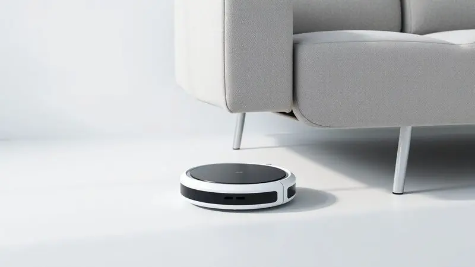
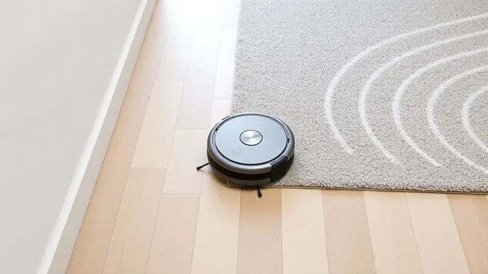
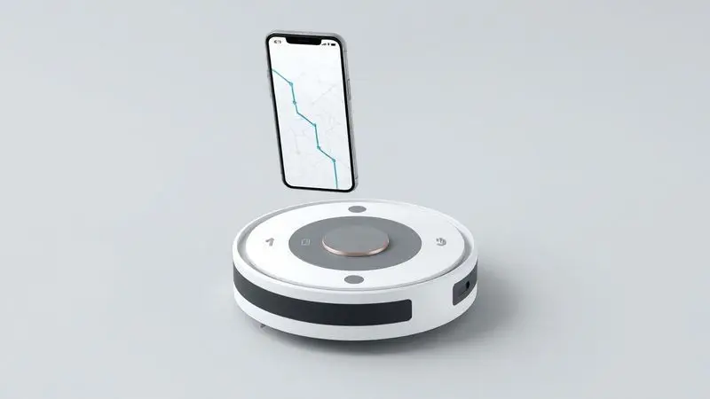
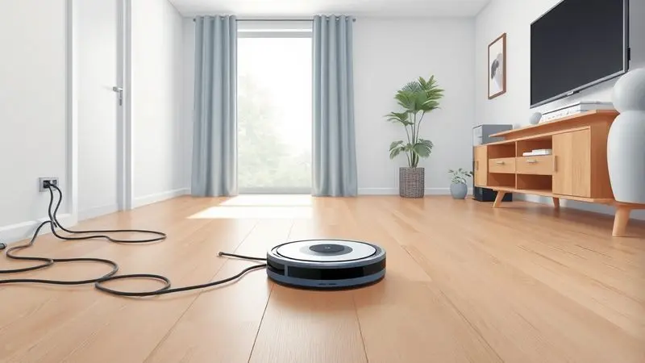

Imagine acordar sabendo que seu chão já está limpo, sem que você tenha precisado mover um dedo. O Xiaomi Robot Vacuum E10 promete exatamente essa transformação na sua rotina, combinando três funções essenciais em um corpo compacto: varrer, aspirar e passar pano.

Mas será que essa promessa de automação realmente se sustenta no dia a dia de uma casa brasileira, com nossos tapetes, azulejos e o caos doméstico típico?

Nesta análise, vamos além das especificações técnicas para descobrir como esse robô se comporta na vida real, desde o primeiro mapeamento até a manutenção mensal.

<SummaryList products={frontmatter.top_products} />

## Xiaomi Robot Vacuum E10: Principais Características e Ficha Técnica

<ProductBox 
  title={frontmatter.top_products[0].title} 
  image={frontmatter.top_products[0].image} 
  link={frontmatter.top_products[0].link} 
/>

Mais do que números em uma tabela, as especificações do E10 contam a história de um assistente doméstico inteligente. Com 4.000 Pa de sucção, ele tem força suficiente para engolir desde partículas de poeira até migalhas de biscoito que caíram debaixo da mesa.

Esse poder, combinado com um sistema de navegação que aprende o layout da sua casa, permite que ele limpe de forma metódica, evitando cadeiras e mesas como um verdadeiro mestre da evasão.

O verdadeiro diferencial, porém, está na função MOP integrada. Um depósito de água eletrônico oferece três níveis de fluxo ajustáveis, dando a você o controle sobre o quanto de umidade quer no piso.

Para completar o pacote, seu corpo slim de apenas 8cm de altura se torna a chave secreta para alcançar espaços sob móveis onde a poeira adora se esconder, enquanto os 110 minutos de autonomia garantem que ele não vai desistir no meio do caminho.

<CaixaProsContras>

**Prós:**

- Alta potência de sucção para diferentes tipos de sujeira.

- Navegação inteligente que evita obstáculos.

- Função MOP com controle de fluxo d'água.

- Controle via app e compatibilidade com assistentes de voz.

**Contras:**

- Pode não ser ideal para superfícies muito irregulares.

- O depósito combinado pode exigir esvaziamento mais frequente em casas grandes.

</CaixaProsContras>

## Design e Construção: O Diferencial Slim da Xiaomi

Essa altura reduzida não é apenas um número no papel, é a diferença entre ter um canto embaixo do guarda-roupa sempre imaculado ou esquecido.

O design slim do E10 funciona como um passe de mágica: ele desliza sob camas, sofás e armários que outros robôs mais altos simplesmente ignorariam.

A construção sólida mantém tudo no lugar durante essas manobras, enquanto a operação discreta significa que você pode programá-lo para trabalhar durante uma reunião online sem que ninguém perceba.

## Funcionamento e Desempenho em Testes Reais

Como esse aprendizado técnico se traduz na prática? Nos testes, o E10 demonstrou uma inteligência prática impressionante. Em vez de apenas bater nas paredes, ele mapeia o ambiente e traça rotas lógicas, como se tivesse memorizado o plano da sua casa.

Essa estratégia resulta em uma cobertura mais completa, menos tempo gasto e, principalmente, menos desgaste para o aparelho.

A adaptação automática entre pisos duros e carpetes acontece de forma natural, ele aumenta a sucção quando sente a resistência do tapete, garantindo que os pelos do seu pet não tenham chance de escapar.

A limpeza combinada (varrer + aspirar + passar pano) em uma única passada economiza tempo, embora, como qualquer robô, ele ainda precise de sua ajuda para cantos muito específicos ou móveis extremamente baixos.

## Cobertura e Autonomia de Bateria

E quanto a casa ele realmente limpa antes de precisar recarregar? Os 120 minutos de autonomia são suficientes para uma residência de tamanho médio, o equivalente a limpar sua sala, cozinha, corredor e dois quartos sem parar.

Quando a bateria começa a fraquejar, ele não simplesmente desliga, retorna inteligentemente à base, recarrega e, se programado, retoma exatamente de onde parou.

Esse ciclo contínuo elimina aquela ansiedade de ter que "vigiar" o robô ou interromper tarefas. Você programa pela manhã e, ao voltar do trabalho, encontra não apenas um piso limpo, mas um assistente pronto para a próxima missão.

## Recursos e Acessórios Inclusos

Ao abrir a caixa, você encontra mais do que apenas um robô, encontra um sistema completo. O reservatório de água para a função MOP já vem acoplado, eliminando a necessidade de compras adicionais.

As escovas laterais são projetadas para "abraçar" rodapés e cantos, enquanto o filtro HEPA faz um trabalho silencioso mas crucial: prender alérgenos que, de outra forma, ficariam circulando no ar que sua família respira.

Essa atenção aos detalhes transforma o E10 de um simples eletrodoméstico em um parceiro de limpeza que pensa nos aspectos invisíveis da higiene doméstica.

## Aplicativo e Conectividade: Controle Inteligente na Palma da Mão

O verdadeiro poder do E10 se revela quando você abre o aplicativo Mi Home.

A interface intuitiva transforma seu smartphone em um controle remoto para sua casa: com alguns toques, você define zonas de exclusão ("não limpe perto do vaso da planta"), programa horários específicos ("toda terça e quinta às 10h") ou inicia uma limpeza rápida enquanto está no mercado.

A integração com assistentes de voz como Alexa e Google Assistant adiciona uma camada de magia: "Alexa, pedir para o robô limpar a cozinha" se torna um comando tão natural quanto pedir a previsão do tempo.

Essa conectividade não é apenas um recurso técnico, é a liberdade de gerenciar sua limpeza de qualquer lugar, transformando obrigação em conveniência.

## Diferenciais Frente à Concorrência Direta

O que faz o E10 se destacar em um mercado cheio de opções? Primeiro, sua abordagem integrada: enquanto muitos concorrentes oferecem apenas aspiração ou exigem a compra separada do módulo MOP, o E10 já nasce completo.

Segundo, a inteligência de navegação que equilibra eficiência e preço, não é o sistema mais avançado do mercado, mas é surpreendentemente competente pelo custo.

Finalmente, há o fator ecossistema Xiaomi: se você já possui outros dispositivos da marca, a integração é tão fluida que parece que todos conversam entre si, criando uma experiência doméstica coesa que vai além da limpeza.

## Comparação entre Modelos Semelhantes e Principais Concorrentes

Colocado lado a lado com concorrentes como o Roomba 692 da iRobot ou o Roborock S4 Max, o E10 encontra seu nicho através do equilíbrio. O Roomba oferece reconhecimento de sujeira mais avançado, mas custa consideravelmente mais.

O Roborock S4 Max compete diretamente em potência, mas muitas vezes sacrifica a função MOP integrada.

O E10, portanto, ocupa um espaço interessante: não é o mais barato, nem o mais avançado tecnologicamente, mas oferece o pacote mais completo pelo investimento.

Para quem quer aspiração potente, função MOP e navegação inteligente sem ultrapassar determinado orçamento, ele se torna uma proposta difícil de ignorar.

## Dicas de Uso para Melhor Aproveitamento do Seu Robô Aspirador

Para extrair o máximo desse parceiro de limpeza, pense nele como um membro da família que precisa de um ambiente organizado para trabalhar bem.

Antes de programar a limpeza, faça uma "varredura visual": retire brinquedos do chão, levante cabos soltos e, se possível, feche portas de ambientes que não devem ser acessados.

Aproveite a programação inteligente: configure horários em que você normalmente está fora, transformando o retorno para casa em uma agradável surpresa de limpeza concluída.

A manutenção regular, limpar as escovas a cada semana, o filtro a cada mês, não é apenas uma recomendação técnica; é o que garante que, daqui a um ano, ele ainda terá o mesmo vigor do primeiro dia.

## Garantia e Pós-venda da Xiaomi no Brasil

Investir em um robô aspirador é uma relação de longo prazo, e a Xiaomi entende isso. A garantia padrão de um ano cobre defeitos de fabricação, com uma rede de assistência técnica que tem crescido consistentemente no Brasil.

O canal de atendimento ao cliente, disponível via aplicativo e telefone, responde dúvidas com uma eficiência que surpreende para quem está acostumado com serviços pós-venda burocráticos.

É sempre recomendável registrar seu produto no site da fabricante e guardar a nota fiscal, esses pequenos passos garantem que, se algo inesperado acontecer, você terá suporte rápido e sem complicações.

## Preço e Onde Comprar Mais Barato

O valor do E10 flutua entre os principais marketplaces, mas uma estratégia inteligente pode fazer uma diferença significativa no investimento.

Além de comparar preços entre Amazon, Mercado Livre e lojas especializadas, fique atento a padrões: muitas vezes, sites menores oferecem preços ligeiramente melhores, mas com prazos de entrega mais longos.

Períodos como Black Friday, Natal e volta às aulas frequentemente trazem descontos reais, não apenas aumentos fictícios.

Aproveite ferramentas de comparação de preços e, principalmente, leia avaliações de outros compradores, elas revelam não apenas a qualidade do produto, mas a confiabilidade do vendedor.

## Perguntas Frequentes (FAQ) sobre o Xiaomi E10

"Ele realmente funciona em todos os tipos de piso?" Sim, com uma ressalva: enquanto em pisos lisos e carpetes de pelo baixo ele é um campeão, superfícies muito irregulares ou tapetes de fios longos podem desafiar seu sistema de rodas.

"Preciso ficar em casa enquanto ele limpa?" Absolutamente não. A programação remota permite que você inicie a limpeza do escritório, e os sensores de obstáculos são eficientes o suficiente para evitar acidentes domésticos.

"A função MOP deixa o piso encharcado?" Com os três níveis de controle, você define exatamente o quanto de umidade quer. No nível mínimo, ele deixa apenas um leve brilho, perfeito para pisos que não toleram água parada.

## Conclusão

O Xiaomi Robot Vacuum E10 não é apenas um eletrodoméstico, é um convite para redefinir sua relação com a limpeza doméstica.

Ele transforma horas semanais de trabalho manual em minutos de programação inteligente, substituindo o esforço físico pela satisfação de chegar em casa e encontrar tudo impecável.

Para famílias com animais de estimação, para quem sofre com alergias, ou simplesmente para quem valoriza seu tempo livre, o E10 oferece um retorno sobre o investimento que vai além do financeiro: é tempo recuperado, estresse reduzido e a tranquilidade de saber que sua casa está sendo cuidada, mesmo quando você está ocupado cuidando de outras coisas.

Se você busca um equilíbrio realista entre tecnologia acessível e funcionalidade completa, sem precisar escolher entre aspirar ou passar pano, o E10 se apresenta não como uma opção, mas como uma solução.

A pergunta deixa de ser "vale a pena?" e se torna "por que você ainda está fazendo isso manualmente?"

---

Ainda indeciso sobre o Xiaomi E10? Confira nosso [ranking dos 11 melhores robôs aspiradores Xiaomi de 2025](/melhor-robo-aspirador-xiaomi/) para encontrar a opção ideal para sua casa.
