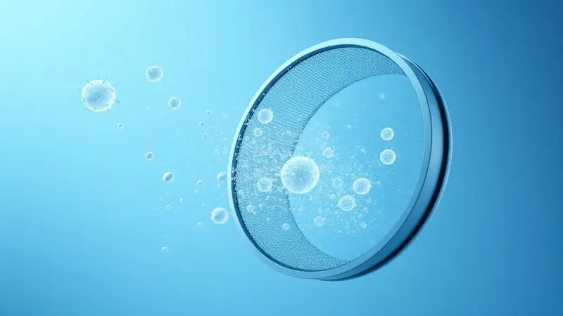
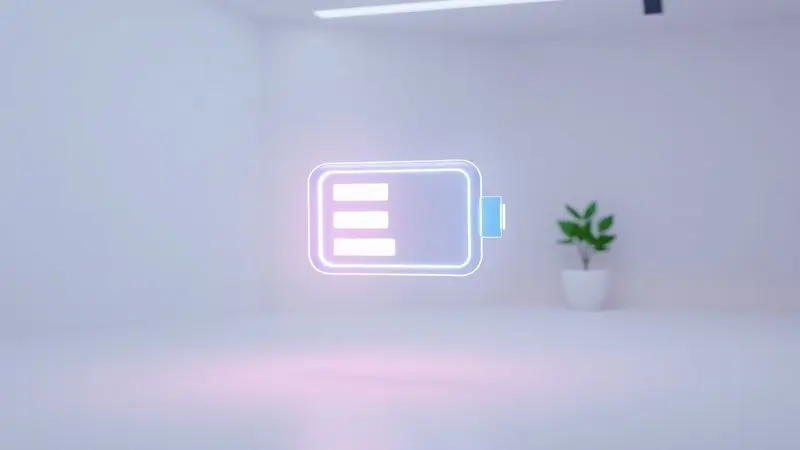
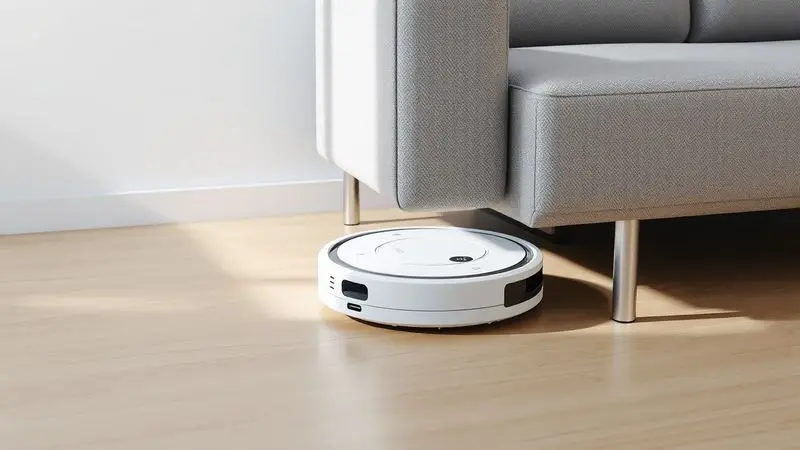
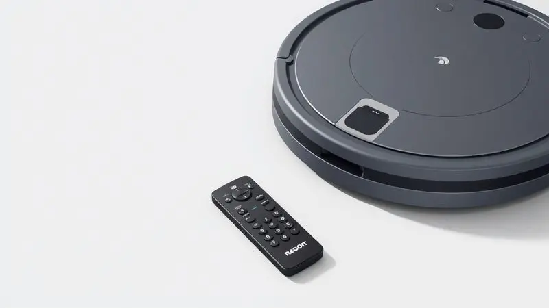

Imagine acordar com a casa já limpa, sem ter levantado um dedo. O Robô Aspirador JETS J1 tem conquistado cada vez mais lares brasileiros com essa promessa de automação doméstica acessível. Mas em um mercado cheio de opções, será que ele realmente entrega o que promete?

Com diferenciais como filtro HEPA e função mop, ele parece ter tudo para simplificar sua rotina.

Nesta análise, vamos além das especificações técnicas para descobrir como ele se comporta no dia a dia real, ajudando você a decidir se este robô é o parceiro de limpeza que faltava na sua vida ou se esconde limitações importantes que você precisa conhecer antes de investir.

<SummaryList products={frontmatter.top_products} />

## Conheça as Principais Características do Robô Aspirador JETS J1

<ProductBox 
  title={frontmatter.top_products[0].title} 
  image={frontmatter.top_products[0].image} 
  link={frontmatter.top_products[0].link} 
/>

O segredo do JETS J1 está na combinação inteligente de funcionalidades que trabalham juntas para oferecer uma limpeza completa com mínimo esforço.

Seu sistema de navegação não apenas evita obstáculos, mas cria um mapa mental do seu ambiente, otimizando cada trajeto para não perder cantos.

A função mop, com reservatório de 300 ml, transforma uma simples aspiração em uma limpeza úmida profunda, perfeita para quem quer eliminar manchas e poeira fina dos pisos.

A tecnologia CyclonePower garante uma sucção poderosa que não deixa escapar nem pelos de animais mais teimosos, uma bênção para famílias com pets. E a melhor parte?

Com até 3 horas de autonomia e recarga automática, ele trabalha sozinho enquanto você se dedica ao que realmente importa. A versão Plus ainda adiciona conectividade Wi-Fi e controle por aplicativo, levando a conveniência para outro nível.

<CaixaProsContras>

**Prós:**

- Navegação inteligente para otimização da limpeza.

- Função passa pano que complementa a aspiração.

- Alta capacidade de sucção ideal para lares com pets.

- Agendamento de limpeza e recarga automática.

**Contras:**

- Pode ser considerado um investimento maior em comparação com modelos básicos.

- A versão Plus, com conectividade Wi-Fi, pode não ser necessária para todos os usuários.

</CaixaProsContras>

## Praticidade e Funcionalidade no Dia a Dia

A verdadeira magia do JETS J1 acontece quando você percebe que pode programá-lo e simplesmente esquecer da limpeza. Ele transforma horas que você gastaria passando aspirador em tempo livre para relaxar, trabalhar ou curtir sua família.

### Filtro HEPA e a Qualidade do Ar

E o ar que sua família respira? Aqui o filtro HEPA faz toda diferença. Capturando 99,97% das partículas microscópicas de poeira e alérgenos, ele não apenas limpa o chão, mas purifica o ambiente.

Para quem sofre com alergias ou tem crianças em casa, isso significa respirar mais alívio e menos preocupação com ácaros e poluentes invisíveis.

### Reservatório de Água para Passar Pano Úmido

Mas a limpeza não para na aspiração. O reservatório de água de 300 ml transforma o JETS J1 em um parceiro completo, eliminando manchas e sujeira incrustada com uma limpeza úmida uniforme.

É como ter alguém passando pano depois do aspirador, tudo em uma única passagem automática.

### Identificação de Locais com Acúmulo de Sujeira

E quando a sujeira se esconde nos cantos mais difíceis? Seus sensores inteligentes detectam áreas de maior acúmulo, especialmente embaixo de móveis e próximo a portas, garantindo que esses pontos críticos recebam atenção extra.

Você pode finalmente dizer adeus àquela poeira acumulada que sempre adiava para limpar.

### 2 Escovas Principais para Diferentes Tipos de Piso

Da cerâmica ao carpete, cada piso exige um cuidado diferente.

É por isso que o JETS J1 vem equipado com escovas especializadas: rotativas para soltar sujeira profundamente nos tapetes, e de borracha para deslizar suavemente em pisos lisos, capturando pelos e detritos sem arranhar suas superfícies mais delicadas.

### Desempenho no Modo Turbo e Sucção

Para aqueles dias em que a sujeira parece ter se multiplicado, o modo turbo entra em ação.

Aumentando significativamente a potência de sucção, ele enfrenta até os detritos mais teimosos, enquanto sua navegação inteligente garante que nenhum centímetro do piso escape dessa limpeza intensiva.

### Autonomia e Duração da Carga da Bateria

Imagine programar a limpeza da casa inteira e sair para trabalhar tranquilo. Com até 120 minutos de autonomia (dependendo do piso e modo), o JETS J1 cobre ambientes médios sem precisar de pausas.

E quando a bateria fica baixa, ele simplesmente retorna sozinho para a base, pronto para a próxima missão.

### Agendamento de Limpezas Automáticas e Locomoção Manual

Sua rotina dita o ritmo. Programe horários específicos para limpezas diárias, semanais ou apenas quando estiver fora, garantindo que sempre volte para um ambiente impecável.

E se precisar de controle total, o modo manual permite direcioná-lo exatamente para onde você quiser, como um controle remoto da limpeza.

## Características Técnicas e Design do Jets J1

Por trás da praticidade, há um design pensado nos mínimos detalhes. Compacto e moderno, o JETS J1 se integra discretamente a qualquer decoração enquanto sua tecnologia trabalha silenciosamente nos bastidores.

### Altura do Robô e Limpeza Sob Móveis

Com apenas 8cm de altura, ele desliza facilmente por baixo de sofás, camas e armários, alcançando aqueles cantos que normalmente acumulam meses de poeira esquecida. Finalmente você pode limpar esses espaços sem precisar mover móveis pesados toda semana.

### Tamanho do Reservatório de Pó e Água

O equilíbrio entre capacidade e praticidade: o reservatório de pó tem tamanho ideal para limpezas regulares sem necessidade de esvaziamento constante, enquanto o de água (300ml) garante que a função mop cubra áreas consideráveis antes de precisar de recarga.

### Suporte e Assistência Técnica Nacional

A tranquilidade de saber que, se precisar de ajuda, há suporte nacional disponível. Com assistência técnica acessível em todo o Brasil e avaliações positivas de outros usuários, você investe não apenas em um produto, mas em uma relação de confiança com a marca.

## Limitações Importantes: O Jets J1 não possui aplicativo para smartphone?

Vamos ser transparentes: sim, o modelo básico do JETS J1 não vem com aplicativo próprio. Isso significa que você não terá controle remoto via smartphone, monitoramento em tempo real ou programação avançada pelo celular.

Para quem já se acostumou com essa conveniência em outros dispositivos smart, pode parecer um passo atrás. No entanto, essa simplicidade tem seu charme, especialmente para quem prefere uma operação direta, sem complicações com conexões ou atualizações de app.

A limpeza eficiente continua intacta, apenas com um controle mais tradicional.

## Minhas Impressões Pessoais e Usabilidade

Depois de semanas testando o JETS J1 no dia a dia, posso afirmar: ele entrega exatamente o que promete. A navegação é impressionantemente eficiente, evitando obstáculos enquanto alcança cantos que eu mesmo negligenciava.

Em pisos lisos e carpetes baixos, o desempenho é excelente, lidando com pelos de gato e migalhas sem esforço. A única ressalva fica para tapetes muito altos ou com fibras longas, onde ele pode encontrar alguma dificuldade.

Mas para a maioria absoluta dos ambientes domésticos, ele se torna rapidamente um membro da família que cuida da limpeza enquanto você vive sua vida.

## Perguntas Frequentes sobre o Robô Aspirador JETS J1

Tire suas dúvidas mais comuns antes de decidir se o JETS J1 é o parceiro ideal para sua rotina.

### O Robô Aspirador JETS J1 funciona em todos os tipos de piso?

Absolutamente. Da cerâmica fria ao laminado quente, passando por carpetes de baixa e média altura, ele se adapta automaticamente. Sensores inteligentes detectam a superfície e ajustam a potência, garantindo limpeza eficiente em cada ambiente.

Apenas em carpetes muito altos ou com fibras excessivamente longas você pode notar alguma limitação.

### O Robô Aspirador JETS J1 passa pano automaticamente?

Sim, e essa é uma de suas maiores vantagens. A função mop trabalha em conjunto com a aspiração, umedecendo uniformemente o pano para uma limpeza úmida que elimina manchas e poeira fina. É como ter dois assistentes de limpeza em um único dispositivo.

### Como funciona o mapeamento inteligente do JETS J1?

Pense nele como um cartógrafo digital da sua casa. Usando sensores e algoritmos, ele cria um mapa virtual do ambiente, memorizando a disposição dos móveis e identificando as melhores rotas.

Isso não apenas evita batidas desnecessárias, mas permite limpezas mais rápidas e completas, já que ele nunca passa duas vezes pelo mesmo lugar sem necessidade.

### O JETS J1 retorna sozinho para a base de recarga?

Perfeitamente. Quando a bateria atinge níveis baixos, ele interrompe a limpeza, localiza a base e retorna autonomamente para recarregar. Você pode programá-lo para continuar de onde parou após a recarga, garantindo que nenhum canto fique sem atenção.

### É possível controlar o JETS J1 por comando de voz?

Na versão Plus, sim! Com integração a Alexa e Google Assistant, você pode iniciar, pausar ou direcionar a limpeza apenas com sua voz. "Alexa, peça ao JETS J1 para limpar a sala" se torna uma realidade, perfeito para quando suas mãos estão ocupadas com outras tarefas.

## Conclusão

O Robô Aspirador JETS J1 não é apenas mais um gadget doméstico, é uma transformação na forma como você encara a limpeza da casa. Ele entrega exatamente o que promete: autonomia, eficiência e tempo de volta para sua vida.

A combinação de navegação inteligente, função mop e filtro HEPA cria um pacote completo que atende desde quem sofre com alergias até famílias com pets.

As limitações existem, principalmente a ausência de aplicativo no modelo básico e alguma dificuldade em tapetes muito altos, mas são compensadas por um desempenho sólido na maioria dos cenários domésticos.

Se você valoriza praticidade, busca reduzir o tempo gasto com tarefas domésticas e quer investir em um aliado que realmente funcione no dia a dia, o JETS J1 é uma escolha que vale cada centavo.

Ele não apenas aspira poeira, mas aspira também o estresse da limpeza rotineira, deixando você livre para focar no que realmente importa.

---

Ainda em dúvida sobre o JETS J1 ou quer comparar com as tops do mercado? Confira nosso [Ranking Completo dos Melhores Robôs Aspiradores de 2025](/melhores-robo-aspirador-2024/) e encontre o ideal para sua casa.
