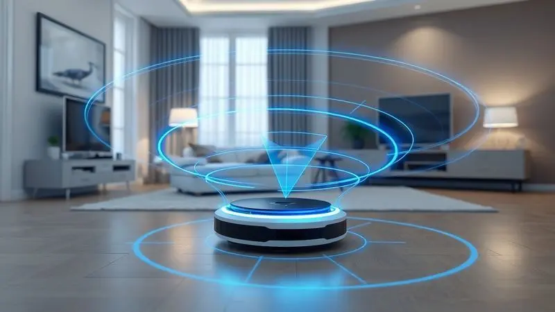
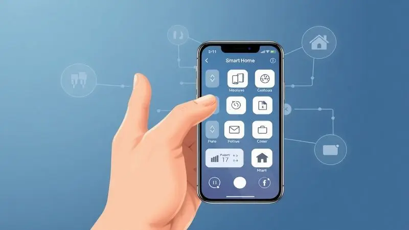
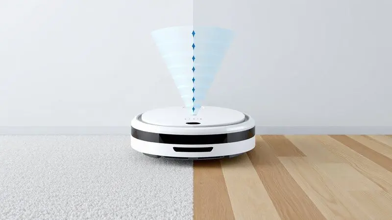

Imagine ter um ajudante silencioso que limpa sua casa enquanto você faz o que realmente importa. É exatamente essa promessa que faz você olhar para um robô aspirador, mas quando surge uma marca como a JETS, ganhando espaço no mercado, as dúvidas são naturais.

Será que esse 'novato' é confiável? O mapeamento realmente funciona? Ou é apenas mais um gadget que vai acabar esquecido em um canto?

Neste artigo, vamos além das especificações técnicas para explorar como os modelos JETS Platinum e J1 podem (ou não) transformar sua rotina.

Vamos analisar se a tecnologia justifica o investimento e, principalmente, se esses robôs entregam aquilo que todo mundo busca: tempo livre e menos preocupações com a limpeza diária.

<SummaryList products={frontmatter.top_products} />

## Visão Geral do Robô Aspirador JETS Platinum

<ProductBox 
  title={frontmatter.top_products[0].title} 
  image={frontmatter.top_products[0].image} 
  link={frontmatter.top_products[0].link} 
/>

Pense em acordar com a casa limpa, sem ter levantado do sofá. É essa sensação que o JETS Platinum quer proporcionar.

Seu segredo está no olhar tecnológico: um sistema de navegação LIDAR que funciona como os olhos do robô, mapeando cada centímetro do seu ambiente para criar rotas inteligentes que evitam obstáculos e otimizam cada minuto de limpeza.

Mas ele não apenas enxerga melhor - trabalha de forma mais completa. Enquanto aspira profundamente, varre simultaneamente, capturando desde partículas de poeira até os persistentes pelos de animais que grudam nos tapetes.

E para dar aquele acabamento perfeito, um sistema de passar pano vibratório que deixa o piso não apenas limpo, mas realmente brilhante.

O controle fica nas suas mãos (ou na sua voz). Conectado ao Wi-Fi, você programa horários, monitora o progresso e ajusta configurações pelo aplicativo JETS Home, ou simplesmente pede para Alexa ou Google Home dar o comando.

Com autonomia para cobrir até 150m², ele trabalha sozinho enquanto você aproveita seu tempo.

<CaixaProsContras>

**Prós:**

- Navegação inteligente a laser (LIDAR) para mapeamento preciso

- Função 2 em 1: varre e aspira simultaneamente

- Controle via aplicativo e integração com assistentes virtuais

- Filtros HEPA que ajudam na retenção de alérgenos

**Contras:**

- Dificuldades ocasional na remoção de sujeiras em superfícies específicas

- Desempenho pode variar dependendo do tipo de piso

</CaixaProsContras>

## Mapeamento à Laser e Sistema de Navegação

Você já teve a frustração de ver seu robô antigo bater repetidamente no mesmo móvel ou limpar duas vezes o mesmo lugar enquanto deixa um canto inteiro sujo? O sistema de mapeamento a laser dos modelos JETS elimina esses problemas de uma vez por todas.

Funciona assim: enquanto limpa, o robô cria um mapa 3D do seu ambiente, memorizando a localização de cada móvel, porta e parede. Na próxima limpeza, ele não precisa reaprender - já sabe exatamente onde ir e o que evitar.

O resultado é uma eficiência que você sente no dia a dia: menos tempo de trabalho, mais área coberta e a certeza de que nenhum cantinho ficou esquecido.

E quando a bateria começa a fraquejar? Ele simplesmente calcula a rota mais rápida até a base, recarrega e retoma exatamente de onde parou. É como ter um ajudante que nunca se perde e sempre cumpre a missão.

## Design e Usabilidade do Aparelho

E todo esse mapeamento inteligente precisa de um corpo que consiga executar. É aqui que o design slim faz toda diferença: com apenas 8cm de altura, ele desliza sob sofás, camas e armários, alcançando aqueles lugares que você nem lembrava que precisavam de limpeza.

As rodas robustas não são apenas estéticas - são feitas para transitar sem esforço entre pisos frios, carpetes grossos e pequenos desníveis.

E enquanto trabalha silenciosamente, seu acabamento moderno se mistura tão bem à decoração que você quase esquece que ele está lá.

A usabilidade? Tão simples que até quem não é fã de tecnologia consegue dominar em minutos.

O painel físico oferece controles básicos, mas o verdadeiro poder está no aplicativo: programe limpezas diárias enquanto está no trabalho, ajuste a potência para diferentes cômodos ou apenas acompanhe o progresso em tempo real.

É praticidade que se adapta ao seu ritmo, não o contrário.

## Compatibilidade com Aplicativos e Assistentes de Voz (Alexa e Google Home)

Imagine estar no meio do preparo do jantar quando percebe que caíram migalhas no chão. Em vez de parar tudo para buscar o aspirador, você simplesmente diz: "Alexa, peça para o JETS limpar a cozinha".

Em segundos, ele está a caminho, enquanto você continua seu ritual culinário.

Essa é a magia da integração com assistentes de voz. Mas vai além dos comandos simples: pelo aplicativo JETS Home, você cria rotinas personalizadas. Que tal programar uma limpeza rápida toda manhã às 8h, logo depois que todos saem?

Ou uma limpeza profunda nas sextas-feiras, para receber o fim de semana com a casa impecável?

O monitoramento remoto transforma a experiência: receba notificações quando a limpeza terminar, verifique se precisa esvaziar o reservatório ou apenas admire como ele mapeou sua casa com precisão cirúrgica.

Claro, tudo isso depende de uma conexão Wi-Fi estável - mas quando funciona, você sente que finalmente entrou na era da casa verdadeiramente inteligente.

## Funcionalidades Especiais e Modos de Limpeza

Cada dia tem suas necessidades, e seu robô entende isso.

Os modos de limpeza dos JETS são como ter diferentes ajudantes em um único aparelho: selecione o modo silencioso para uma passada rápida durante uma reunião online, ou acione o modo turbo quando os pets fizeram uma festa no sofá.

Os sensores fazem mais do que evitar obstáculos - eles preveem problemas. Uma borda de degrau? Ele se aproxima com cuidado, detecta a altura e decide se pode descer com segurança ou se deve recuar. Um tapete mais fofo?

Aumenta automaticamente a sucção para uma limpeza mais profunda.

E para quem tem alergias, os filtros HEPA são um respiro literal: capturam 99,97% das partículas microscópicas, mantendo o ar limpo enquanto o chão brilha. São detalhes que transformam um eletrodoméstico em um parceiro de bem-estar.

## Robô Aspirador de Pó JETS J1: Análise do Modelo de Entrada

<ProductBox 
  title={frontmatter.top_products[1].title} 
  image={frontmatter.top_products[1].image} 
  link={frontmatter.top_products[1].link} 
/>

Nem todo mundo precisa de todos os controles e conectividades. Se você busca essencialmente um ajudante que limpe bem, sem complicações de aplicativos ou integrações, o J1 é como aquele amigo confiável que sempre cumpre sua parte.

Ele compartilha o mesmo DNA inteligente: navegação que mapeia o ambiente, sistema CyclonePower de 3ª geração que cria um redemoinho de sucção para capturar até a poeira mais fina, e a dupla função de varrer e passar pano simultaneamente.

O reservatório de 300ml é generoso o suficiente para várias limpezas sem reabastecimento.

A ausência de Wi-Fi pode parecer uma limitação, mas para muitos é uma simplificação bem-vinda. Sem necessidade de senhas, configurações de rede ou atualizações de software, ele é plug-and-play na forma mais pura: ligue, programe os botões físicos e deixe-o trabalhar.

A bateria de 3 horas garante que mesmo casas maiores recebam atenção completa.

<CaixaProsContras>

**Prós:**

- Boa eficiência na limpeza diária, especialmente para pelos de animais.

- Capacidade de passar pano e varrer ao mesmo tempo.

- Navegação inteligente que otimiza o processo de limpeza.

- Bateria com autonomia de até 3 horas.

**Contras:**

- Não possui conectividade Wi-Fi ou controle via aplicativo.

- Menos recursos se comparado ao modelo J1 Plus.

</CaixaProsContras>

## Vale a Pena Comprar um Robô JETS?

Essa pergunta tem menos a ver com especificações técnicas e mais com estilo de vida.

Se sua rotina é corrida, se você valoriza cada minuto livre, ou se simplesmente cansou da constante batalha contra poeira e pelos, um robô JETS não é um gasto - é um investimento em qualidade de vida.

O Platinum é para quem quer o máximo em tecnologia: controle total, integração com outros dispositivos inteligentes e a precisão de quem conhece cada centímetro da casa. O J1 é para quem busca praticidade sem complicação, eficiência sem curvas de aprendizado.

Ambos compartilham o que realmente importa: a capacidade de transformar a limpeza de uma tarefa diária em algo que acontece nos bastidores, enquanto você vive sua vida. E no final das contas, não é disso que se trata?

## Perguntas Frequentes (FAQ)

### Quais são as principais funcionalidades do JETS Platinum na comparação com modelos concorrentes?

O Platinum joga em outra liga quando o assunto é navegação inteligente. Enquanto muitos concorrentes ainda dependem de batidas aleatórias para mapear o ambiente, seu sistema LIDAR cria um mapa preciso desde a primeira limpeza.

Essa diferença técnica se traduz em praticidade: ele não perde tempo refazendo áreas já limpas ou se perdendo em cômodos complexos.

A personalização é outro diferencial. Através do aplicativo, você pode criar zonas proibidas (mantenha-o longe do tapete persa), definir limpezas específicas por cômodo ou ajustar a potência conforme o piso.

São camadas de controle que transformam um robô genérico em um ajudante personalizado para suas necessidades exatas.

### Como a autonomia da bateria do JETS Platinum se compara com outras marcas como Roomba e Xiaomi?

Com cerca de 120 minutos de trabalho contínuo, o Platinum está no pelotão da frente.

Para ter uma ideia prática: enquanto um Roomba básico pode pedir recarga após 90 minutos (deixando talvez um cômodo pela metade), e um Xiaomi intermediário pode chegar a 150 minutos (mas com navegação menos precisa), o Platinum encontra um equilíbrio inteligente.

Ele dura o suficiente para limpar um apartamento de 150m² sem interrupções, mas o verdadeiro diferencial está na eficiência. Como não perde tempo em rotas desorganizadas, cada minuto de bateria é usado de forma otimizada.

E quando precisa recarregar, retoma exatamente de onde parou - sem repetições, sem áreas esquecidas.

### O JETS Platinum é eficaz na remoção de pelos de animais de estimação?

Como dono de pet, você conhece a luta diária contra pelos que grudam em tudo. O Platinum foi projetado pensando nisso. Suas escovas laterais giram em direção oposta, criando um redemoinho que levanta os pelos presos nas bordas dos tapetes e rodapés antes de aspirá-los.

O sistema de sucção ajustável automaticamente aumenta a potência quando detecta superfícies mais fofas, onde os pelos costumam se esconder. E os filtros HEPA garantem que o que foi aspirado fique retido, não retornando ao ar.

É um ciclo completo de limpeza que entende as particularidades de uma casa com animais.

### Quais são as vantagens do sistema de mapeamento do JETS Platinum sobre o Roomba j7+?

Imagine a diferença entre enxergar com uma lanterna (tecnologia de câmera do j7+) versus ter visão 360 graus com luz própria (LIDAR do Platinum). O sistema a laser não depende da iluminação ambiente - funciona igualmente bem à meia-luz da manhã ou no escuro total.

Essa independência significa consistência: enquanto o j7+ pode ter dificuldades em corredores escuros ou sob móveis, o Platinum mantém a mesma precisão em qualquer condição.

Além disso, o mapeamento por laser é menos invasivo à privacidade (sem câmeras capturando imagens do seu lar) e mais rápido na criação do mapa inicial.

### Como o JETS Platinum lida com diferentes tipos de superfícies e obstáculos?

Da suavidade da madeira ao desafio dos carpetes de fio alto, o Platinum se adapta como um camaleão. Sensores de altura detectam automaticamente a transição entre pisos, ajustando não apenas a sucção mas também a velocidade e a pressão das escovas.

Obstáculos cotidianos - fios soltos, brinquedos esquecidos, os pés da mesa - são detectados antes do contato. Ele diminui a velocidade, contorna com cuidado e continua seu trabalho.

Bordas de tapetes são interpretadas como desafios topográficos, não como barreiras: ele sobe com determinação, limpando profundamente antes de descer com segurança.

### Há atualizações frequentes de software para o JETS Platinum e como elas melhoram a experiência do usuário?

Comprar um Platinum é como adquirir um produto que melhora com o tempo. Atualizações regulares de software não apenas corrigem pequenos bugs, mas frequentemente trazem novos recursos que você nem imaginava no momento da compra.

Uma atualização pode otimizar os algoritmos de navegação, tornando as rotas 15% mais eficientes. Outra pode adicionar um modo de limpeza especial para dias de muito pólen. Integrações com novos assistentes de voz ou funções do aplicativo surgem sem custo adicional.

Essa evolução contínua significa que seu investimento se valoriza: o robô que você compra hoje será mais inteligente amanhã, adaptando-se às mudanças da sua casa e às novas tecnologias do mercado.

## Conclusão

No final da análise, a pergunta "O robô aspirador JETS é bom?" se transforma em outra questão: "Qual versão do tempo livre você quer ter?"

Se você busca o estado da arte em automação residencial, controle total e a precisão de quem realmente conhece sua casa, o Platinum é mais do que um aspirador - é um sistema de gestão de limpeza que opera nos bastidores da sua vida.

Cada recurso tecnológico se traduz em minutos recuperados do seu dia, em menos preocupações com tarefas domésticas, na satisfação de voltar para um ambiente sempre impecável.

Se sua necessidade é mais direta - um ajudante confiável que limpe bem, sem complicações digitais - o J1 entrega essencialidade com eficiência. É a prova de que tecnologia inteligente não precisa ser complexa para ser transformadora.

Ambos compartilham o mesmo propósito final: devolver a você o bem mais precioso que temos - tempo. Tempo para trabalhar, para relaxar, para estar com quem importa, enquanto a limpeza acontece silenciosamente, como mágica moderna.

A decisão, agora, não é mais sobre especificações técnicas. É sobre qual dessas realidades faz mais sentido para o seu dia a dia.

E qualquer que seja sua escolha, você estará investindo não apenas em um eletrodoméstico, mas em uma mudança de qualidade de vida que, uma vez experimentada, dificilmente você vai querer abrir mão.

---

Ainda em dúvida sobre qual robô aspirador escolher? Confira nosso [Ranking Completo dos Melhores Robôs Aspiradores de 2025](/melhores-robo-aspirador-2024/) e encontre a opção ideal para sua casa.
