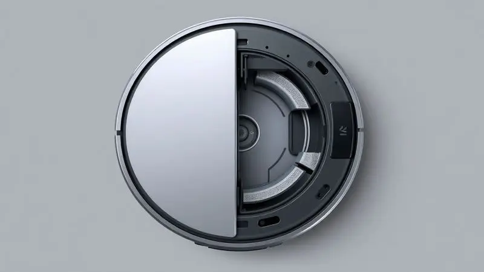
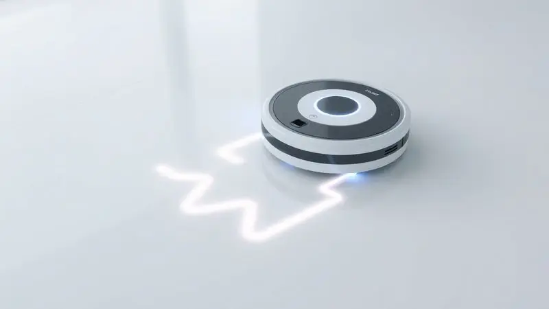
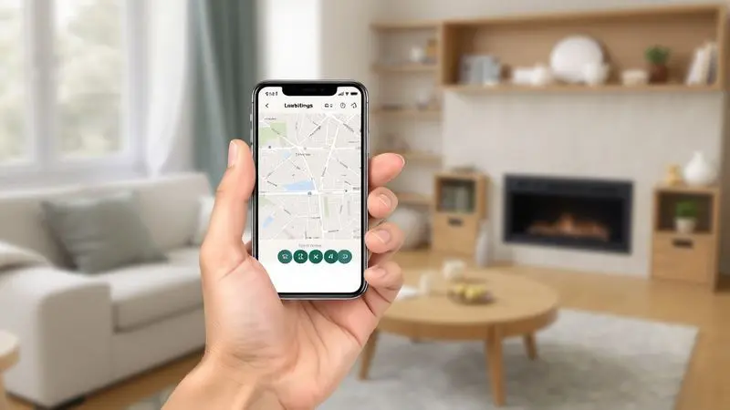
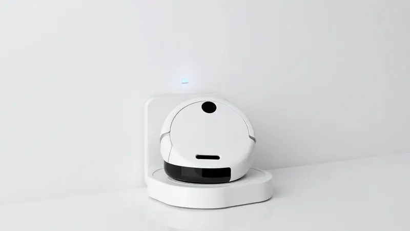

Com a rotina cada vez mais corrida, os robôs aspiradores tornaram-se aliados indispensáveis na limpeza doméstica. O KaBuM! Smart 100 surge como uma das opções mais acessíveis do mercado, prometendo praticidade para quem tem pouco tempo ou mora em locais menores.

Mas será que esse modelo de entrada realmente entrega o que promete? Neste review completo, analisamos desde a construção e autonomia de bateria até o desempenho prático em diferentes superfícies. Se você está em dúvida se o KaBuM!

Smart 100 é bom ou se vale a pena investir em modelos superiores da marca, continue lendo para descobrir a nossa avaliação sincera.

<SummaryList products={frontmatter.top_products} />

## Ficha Técnica e Destaques do KaBuM! Smart 100

<ProductBox 
  title={frontmatter.top_products[0].title} 
  image={frontmatter.top_products[0].image} 
  link={frontmatter.top_products[0].link} 
/>

Imagine ter um ajudante silencioso que trabalha enquanto você se dedica a outras coisas. É exatamente isso que o KaBuM! Smart 100 promete ser.

Este robô aspirador combina eficiência na limpeza com uma praticidade que transforma tarefas domésticas em algo quase automático, perfeito para quem busca praticidade sem complicação.

Entre seus principais atrativos está a função de aspirar e passar pano em um único dispositivo, simplificando sua rotina de limpeza. Controle fácil via aplicativo ou comandos de voz com Alexa e Google Assistant significa que você pode acioná-lo mesmo de outro cômodo.

A autonomia de aproximadamente 90 minutos, com retorno automático à base quando a bateria está baixa, oferece aquela tranquilidade de saber que o trabalho será concluído sem sua intervenção.

Com modos de limpeza versáteis que incluem Zigue-Zague e foco em cantos, ele se adapta inteligentemente aos diferentes tipos de piso da sua casa.

E para completar, o sistema de filtragem HEPA trabalha nos bastidores para capturar alérgenos e manter o ar mais saudável, enquanto você simplesmente aproveita o resultado.

<CaixaProsContras>

**Prós:**

- Função de aspirar e passar pano em um só dispositivo.

- Controle fácil pelo app ou assistentes de voz.

- Múltiplos modos de limpeza para diferentes superfícies.

- Sistema antiqueda e anticolisão para maior segurança.

**Contras:**

- A capacidade do reservatório pode ser pequena para espaços maiores.

- O tempo de carga é relativamente longo (4 a 5 horas).

</CaixaProsContras>

## Design e Construção do Aparelho

Ao primeiro contato, o KaBuM! Smart 100 impressiona pelo tamanho compacto, projetado para navegar facilmente entre móveis e em áreas mais apertadas.

Sua construção leve não significa fragilidade, com uma carcaça resistente a impactos do dia a dia que protege a tecnologia dentro dele.

### Reservatórios de Poeira e Filtro HEPA

A limpeza eficiente começa com a captura adequada da sujeira. O Smart 100 vem equipado com um reservatório de poeira de fácil remoção, tornando o descarte da sujeira uma tarefa rápida e sem sujeira nas mãos.

Mas o verdadeiro diferencial está no filtro HEPA que acompanha o sistema, trabalhando silenciosamente para reter alérgenos e partículas finas que podem afetar sua respiração.

Para quem convive com alergias ou tem crianças e animais em casa, essa atenção à qualidade do ar faz toda a diferença.

### Reservatório de Água e Função Passa Pano

E quando a limpeza seca não basta? É aqui que a função passa pano entra em ação. O reservatório de água acoplado permite que você mantenha os pisos não apenas livres de poeira, mas também de manchas e marcas de pegadas.

O sistema é inteligente o suficiente para distribuir a quantidade certa de água, evitando poças enquanto garante uma limpeza eficaz. Acordar com pisos limpos e secos, prontos para pisar descalço, é uma das pequenas alegrias que esse robô pode proporcionar.

## Desempenho e Qualidade da Limpeza no Dia a Dia

Mas de que adianta ter todos esses recursos se na prática o resultado não convence? Felizmente, o Smart 100 entrega exatamente o que promete para residências compactas.

Sensores inteligentes evitam obstáculos enquanto navega pelo ambiente, garantindo que cada canto receba a atenção necessária.

### Rotinas de Limpeza: Modos Zig-Zag, Cantos e Espiral

Diferentes cômodos, diferentes necessidades de limpeza. É por isso que o Smart 100 oferece três modos distintos. O Zig-Zag cobre áreas abertas de forma sistemática e rápida, como sua sala de estar.

Já o modo Cantos se especializa justamente naqueles espaços onde a sujeira mais gosta de se acumular, mas que são mais difíceis de alcançar.

Por fim, o modo Espiral concentra seu poder em pontos específicos que precisam de atenção extra, como embaixo da mesa de jantar após as refeições. É como ter um limpador personalizado que entende o que cada área da sua casa precisa.

## Experiência de Uso: Aplicativo e Controle Remoto

A tecnologia só vale quando é acessível, certo? Com o aplicativo do Smart 100, você programa limpezas para horários específicos, ajusta configurações e acompanha o progresso do robô em tempo real, tudo sem precisar levantar do sofá.

A conexão estável garante que seus comandos sejam executados sem falhas.

Para momentos em que o celular não está à mão, o controle remoto físico oferece uma alternativa prática e direta. Seja qual for sua preferência, a experiência é pensada para se adaptar ao seu ritmo, não o contrário.

## Autonomia de Bateria, Carregamento e Nível de Ruído

Imagine colocar o robô para trabalhar e poder esquecer que ele está lá. Com até 90 minutos de autonomia, o Smart 100 consegue limpar a maioria dos apartamentos sem precisar de pausas.

Quando a bateria começa a ficar baixa, ele encontra sozinho o caminho de volta à base, como um animal de estimação bem treinado.

O carregamento é automático e simples, e o melhor: ele opera com um nível de ruído tão discreto que você pode continuar trabalhando, assistindo TV ou conversando sem interferências. É a praticidade que não atrapalha sua rotina, apenas a facilita.

## Manutenção, Segurança e Pós-venda

Manter o Smart 100 em pleno funcionamento é tão simples quanto usá-lo. A limpeza regular de filtros e escovas garante que ele continue desempenhando seu papel com eficiência.

Em termos de segurança, os sensores anticolisão e antiqueda oferecem aquela paz de espírito de saber que seu investimento está protegido, mesmo quando você não está olhando.

E se algo der errado? A KaBuM! oferece suporte técnico e garantia, com uma equipe acessível para resolver eventuais problemas. É a segurança de investir em um produto com respaldo, sabendo que não ficará abandonado após a compra.

## Quem fabrica o robô aspirador KaBuM?

Por trás do Smart 100 está a KaBuM!, uma das lojas online mais conhecidas do Brasil no segmento de tecnologia e eletrônicos.

A marca desenvolve seus próprios produtos em parceria com fabricantes especializados, garantindo que cada item atenda a padrões rigorosos de qualidade e desempenho. Mais do que apenas vender, a KaBuM!

coloca seu nome em produtos que pretende que sejam duradouros e confiáveis.

## Melhores robôs aspiradores KaBuM: Comparativo de Modelos

Se o Smart 100 despertou seu interesse mas você se pergunta se há opções mais robustas na linha KaBuM!, a boa notícia é que existem alternativas para diferentes necessidades e orçamentos.

Cada modelo traz características específicas que podem se encaixar melhor na sua realidade.

### Robô Aspirador e Passa Pano KaBuM! Smart 700 – KBSF003

<ProductBox 
  title={frontmatter.top_products[1].title} 
  image={frontmatter.top_products[1].image} 
  link={frontmatter.top_products[1].link} 
/>

Para quem busca um upgrade significativo sem ir ao topo da linha, o Smart 700 oferece navegação a Laser 3D combinada com giroscópio, mapeando seu ambiente com precisão cirúrgica.

Imagine um robô que conhece sua casa tão bem quanto você, evitando obstáculos com inteligência.

Com cerca de 140 minutos de autonomia, ele cobre áreas maiores sem pressa. O controle via aplicativo permite programar rotinas detalhadas, e a compatibilidade com assistentes de voz mantém a conveniência.

Apenas lembre-se: o reservatório de água deve ser removido durante o carregamento para evitar problemas.

<CaixaProsContras>

**Prós:**

- Navegação inteligente e eficiente

- Controle remoto via aplicativo

- Boa autonomia de bateria

- Design que se adapta bem a diferentes ambientes

**Contras:**

- Não deve ser carregado com o reservatório de água acoplado

- Função passar pano pode não atender a todas as expectativas

</CaixaProsContras>

### Robô Aspirador e Passa Pano KaBuM! Smart 900 – KBSF011

<ProductBox 
  title={frontmatter.top_products[2].title} 
  image={frontmatter.top_products[2].image} 
  link={frontmatter.top_products[2].link} 
/>

No topo da linha KaBuM!, o Smart 900 representa o que há de mais avançado em robôs aspiradores acessíveis. Aspirar e passar pano simultaneamente não é apenas uma função, mas uma experiência integrada que transforma a limpeza em algo verdadeiramente automático.

Com até 180 minutos de autonomia, ele cobre áreas de até 200m² sem precisar recarregar. A navegação inteligente evita colisões com uma precisão impressionante, enquanto o filtro HEPA trabalha para manter o ar limpo.

A única ressalva: para aproveitar todo o potencial via aplicativo, sua rede Wi-Fi precisa operar na frequência de 2.4 GHz.

<CaixaProsContras>

**Prós:**

- Funcionalidade 2 em 1: aspira e passa pano simultaneamente

- Navegação inteligente que evita colisões

- Autonomia prolongada com recarga automática

- Equipado com filtro HEPA para melhor qualidade do ar

**Contras:**

- Requer conexão Wi-Fi de 2.4 GHz para uso completo

- O tamanho da base pode exigir espaço extra na sua casa

</CaixaProsContras>

## Qual a diferença entre o Robô KaBuM Smart 700 e Smart 900?

Simplificando: o Smart 900 é o irmão mais velho e experiente.

Enquanto o 700 já oferece navegação avançada e boa autonomia, o 900 eleva o jogo com mapeamento ainda mais preciso, maior potência de sucção (ideal para quem tem animais de estimação) e a capacidade de limpar áreas maiores sem interrupções.

O 700 continua sendo uma excelente opção para residências compactas, mas o 900 é para quem quer o máximo em tecnologia e eficiência.

## Conclusão

O KaBuM! Smart 100 não é apenas um robô aspirador, é uma declaração de que a tecnologia acessível pode de fato transformar sua rotina. Para apartamentos e residências compactas, ele oferece exatamente o equilíbrio entre funcionalidade e simplicidade que muitos buscam.

Embora não tenha todos os recursos avançados de seus irmãos mais caros da linha, o Smart 100 cumpre com excelência o básico que realmente importa: limpar bem, ser fácil de usar e oferecer aquela praticidade que recupera tempo na sua semana.

A ausência de programação por aplicativo é compensada pela eficiência prática que ele entrega dia após dia.

Se você está dando seus primeiros passos no mundo dos robôs aspiradores ou busca uma solução direta e eficaz para espaços menores, o Smart 100 representa um investimento inteligente.

Ele prova que você não precisa gastar muito para ter um ajudante silencioso trabalhando por você, enquanto você dedica seu tempo ao que realmente importa.

---

Ainda na dúvida sobre qual robô aspirador escolher? Confira nosso [Ranking Completo dos Melhores Robôs Aspiradores de 2025](/melhores-robo-aspirador-2024/) e encontre a opção perfeita para o seu espaço.
