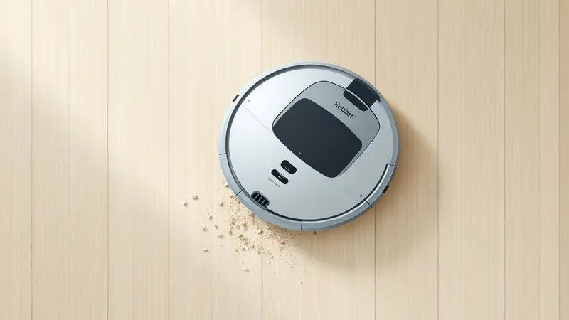
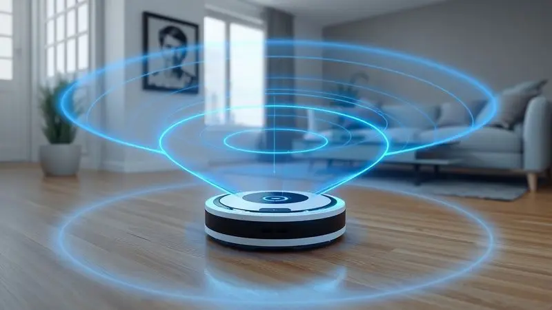
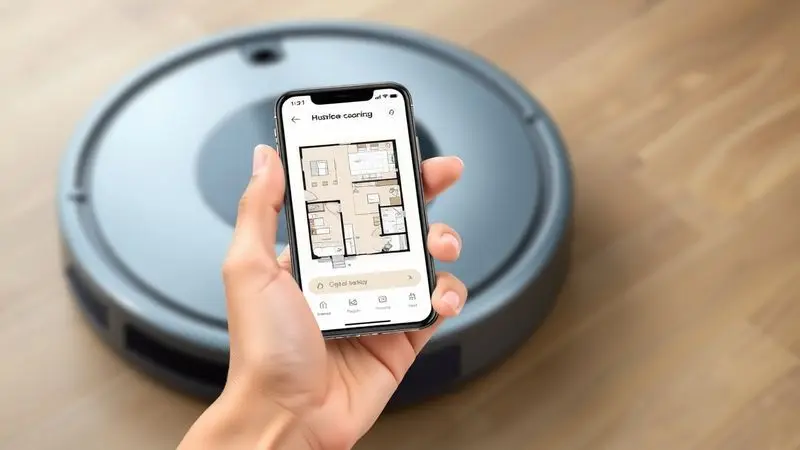
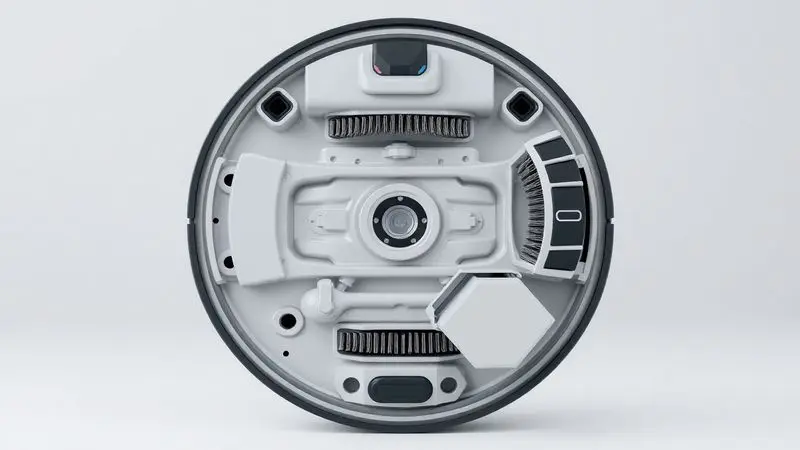

Com a crescente busca por praticidade na limpeza doméstica, os robôs aspiradores se tornaram os queridinhos do momento. Diante de tantas opções, surge a dúvida que todo mundo tem na hora de comprar: o aspirador robô Kabum Smart 700 é bom mesmo?

Este modelo promete mapeamento inteligente 360º e funcionalidades avançadas por um preço mais acessível que os concorrentes premium.

Nesta análise completa, vamos explorar cada detalhe para descobrir se este dispositivo realmente vale o investimento ou se existem opções melhores no mercado.

<SummaryList products={frontmatter.top_products} />

## Design e construção

<ProductBox 
  title={frontmatter.top_products[0].title} 
  image={frontmatter.top_products[0].image} 
  link={frontmatter.top_products[0].link} 
/>

Ao tirar o Kabum Smart 700 da caixa, você encontra aquele design clássico de disco que se tornou quase um padrão no mundo dos robôs aspiradores.

Disponível nas cores preta e branca, ele mescla plástico brilhante no topo com acabamento fosco nas laterais, o que dá aquele visual elegante que não fica deslocado na sua sala.

O que realmente importa, porém, está na construção robusta e nos sensores anticolisão e antiqueda que garantem uma navegação segura, sem aqueles sustos de ver o robô quase caindo da escada.

Ele utiliza mapeamento a laser 3D combinado com um giroscópio para traçar o ambiente com precisão, sendo capaz até de criar barreiras virtuais quando necessário.

Mas a versatilidade vai além: além de aspirar, ele oferece a funcionalidade de passar pano úmido, e seu reservatório de sujeira de 600 ml é generoso para uma casa média.

O filtro HEPA é a cereja do bolo, especialmente para quem sofre com alergias, pois retém alérgenos e melhora a qualidade do ar dos ambientes fechados.

<CaixaProsContras>

**Prós:**

- Design elegante e funcional

- Equipado com sensores anticolisão e antiqueda

- Oferece mapeamento a laser 3D para navegação precisa

- Filtro HEPA para retenção de alérgenos

**Contras:**

- Nível de ruído um pouco elevado (65 dB)

- Limitações no aplicativo, como salvamento de apenas 5 mapas

</CaixaProsContras>

## Ficha Técnica

O que realmente impressiona no Kabum Smart 700 é como ele entrega tecnologia avançada em um pacote acessível.

Seu sistema de navegação inteligente não apenas mapea diferentes espaços, mas aprende com cada limpeza, otimizando rotas para evitar obstáculos que antes o incomodavam.

A potência de sucção ajustável significa que ele sabe quando aumentar o poder nos carpetes e diminuir nos pisos frios, economizando energia sem comprometer o resultado.

Com um design compacto que parece feito sob medida, ele desliza embaixo de móveis que você nem lembrava que existiam, alcançando aqueles cantos esquecidos onde a poeira adora se acumular.

A bateria oferece autonomia suficiente para limpezas prolongadas, mas o verdadeiro diferencial é o filtro HEPA que transforma a tarefa de aspirar em um cuidado com a saúde da sua família, capturando partículas finas que os aspiradores comuns deixam escapar.

## Capacidade de limpeza

Imagine chegar em casa depois de um dia cansativo e encontrar os pisos imaculados, sem você ter feito nenhum esforço. É isso que o Kabum Smart 700 promete, e ele entrega.

Projetado para trabalhar em diversos tipos de superfície, ele utiliza uma combinação inteligente de escovas rotativas e sucção potente que captura desde partículas de poeira até pelos de animais com a mesma eficiência.

Seu sistema de navegação não apenas evita obstáculos, mas cria um mapa mental do seu ambiente, garantindo que cada centímetro quadrado receba a atenção necessária.

A possibilidade de programar horários transforma a limpeza em um hábito automático, como acordar com o café pronto. Você define os horários que preferir e esquece da poeira, sabendo que seu robô está cuidando de tudo nos bastidores.

## Mapeamento 360º

O mapeamento 360º é a tecnologia que transforma um simples robô aspirador em um parceiro inteligente que conhece sua casa quase melhor que você.

No Kabum Smart 700, essa função cria um mapa detalhado do ambiente em tempo real, identificando não apenas obstáculos, mas também as áreas que precisam de atenção extra.

Essa inteligência faz com que o robô navegue com uma eficiência impressionante, evitando aquelas colisões desnecessárias com móveis e garantindo que nenhum canto fique sem ser limpo.

Mas o verdadeiro benefício vai além da navegação: o mapeamento permite que você programe rotinas personalizadas, escolhendo áreas específicas para limpeza em horários específicos. Quer que ele limpe apenas a cozinha após o almoço? É só configurar.

Precisa que evite o quarto do bebê durante a soneca? Basta criar uma barreira virtual. É praticidade que se adapta ao seu ritmo de vida.

## Aplicativo e Conectividade

Em um mundo onde controlamos quase tudo pelo smartphone, por que a limpeza da casa seria diferente? O aplicativo do Kabum Smart 700, disponível para Android e iOS, coloca o controle total na palma da sua mão.

Iniciar limpezas, agendar horários ou monitorar o desempenho do aparelho se torna tão simples quanto enviar uma mensagem.

A integração com Alexa e Google Assistente adiciona uma camada de conveniência que parece saída de um filme de ficção científica. Imagine estar cozinhando e dizer "Alexa, limpe a sala" sem precisar largar a panela.

Ou programar uma limpeza enquanto está no trânsito, chegando em casa com os pisos já impecáveis.

Essa conectividade não apenas facilita o dia a dia, mas cria uma experiência de uso tão intuitiva que você rapidamente se acostuma a ter um ajudante silencioso cuidando dos detalhes.

## Experiência de uso

Usar o Kabum Smart 700 pela primeira vez é como ganhar horas extras no dia. A programação de horários via aplicativo significa que você nunca mais precisa se lembrar de aspirar a casa.

Mas a experiência vai além da conveniência básica: é sobre recuperar tempo para fazer o que realmente importa.

### Nível de ruído

Quando ligamos um eletrodoméstico, sempre tememos aquele barulho invasivo que atrapalha uma conversa ou nosso momento de relaxamento. O Kabum Smart 700 opera em torno de 65 decibéis, o que equivale ao som de uma conversa normal entre duas pessoas.

Na prática, isso significa que você pode assistir sua série favorita, trabalhar de home office ou simplesmente descansar no sofá enquanto ele trabalha discretamente nos bastidores.

Para famílias com crianças pequenas ou pets sensíveis a barulhos, essa característica é um diferencial importante. O ruído está lá, mas não é intrusivo o suficiente para exigir que você aumente o volume da TV ou interrompa uma ligação importante.

Ele encontra o equilíbrio entre potência de limpeza e discrição, mostrando que eficiência não precisa ser barulhenta.

### Consumo de energia

Em tempos de preocupação com sustentabilidade e contas de luz cada vez mais altas, a eficiência energética deixou de ser um detalhe para se tornar uma prioridade.

O Kabum Smart 700 foi projetado pensando nisso, com motores que consomem significativamente menos eletricidade do que os aspiradores tradicionais.

O segredo está no sistema de otimização que ajusta a potência de sucção inteligentemente conforme o tipo de superfície. Em pisos lisos, ele trabalha com menos força, economizando energia sem comprometer o resultado.

Nos carpetes, aumenta a potência apenas o necessário para uma limpeza eficaz. Essa inteligência não apenas reduz sua conta de luz, mas também estende a vida útil da bateria, criando um ciclo virtuoso de eficiência que beneficia tanto seu bolso quanto o meio ambiente.

## Limpeza e cuidados com o aparelho

Manter seu Kabum Smart 700 em perfeito estado é mais simples do que cuidar de um aspirador tradicional, mas exige alguns minutos de atenção periódica.

A primeira regra é o filtro: limpá-lo a cada duas semanas evita obstruções e garante que ele continue capturando alérgenos com a mesma eficiência do primeiro dia.

A escova rotativa, especialmente se você tem animais de estimação, precisa de atenção semanal para remover pelos e fios que possam se enrolar. Um minuto com a tesoura de unha resolve o problema.

A parte externa é a mais fácil: um pano úmido remove poeira e manchas, mantendo aquele visual de novo.

E não se esqueça do compartimento de sujeira: esvaziá-lo quando estiver cheio não apenas melhora o desempenho, mas evita aqueles odores desagradáveis que surgem quando a sujeira fica acumulada por muito tempo. São cuidados mínimos que garantem anos de serviço fiel.

## Quem fabrica o robô KaBuM?

Por trás do robô aspirador KaBuM está a Kabum!, uma empresa brasileira que começou como marketplace de eletrônicos e cresceu para se tornar uma referência em tecnologia no país.

Com mais de 20 anos de mercado, a empresa construiu uma reputação sólida ao oferecer desde componentes de informática até eletrodomésticos inteligentes.

O interessante é como a Kabum! usou seu conhecimento do consumidor brasileiro para desenvolver produtos sob sua própria marca.

Eles entenderam que precisávamos de soluções de limpeza que combinassem tecnologia avançada com preços acessíveis, e o robô aspirador foi uma das respostas.

É a prova de que empresas nacionais podem não apenas importar tecnologia, mas adaptá-la e até mesmo inovar para atender às particularidades do nosso dia a dia.

## Qual o melhor robô KaBuM?

Escolher o melhor robô aspirador da KaBuM é como encontrar o par de sapatos perfeito: depende completamente do formato do seu pé, ou nesse caso, das necessidades da sua casa.

A linha oferece modelos variados, cada um com seu equilíbrio entre potência, inteligência e preço.

Para apartamentos compactos ou quem busca uma solução básica e eficiente, modelos como o Smart 700 são ideais. Já para casas maiores com diferentes tipos de piso e muitos obstáculos, vale a pena considerar opções com mapeamento mais avançado e bateria de maior duração.

A verdade é que o "melhor" é aquele que resolve seus problemas específicos sem complicar sua vida ou seu orçamento.

Analisar como você realmente vive, quais são suas dores na limpeza e quanto está disposto a investir é mais importante do que correr atrás do modelo mais caro.

## Qual a diferença entre o Robô KaBuM Smart 700 e Smart 900?

A escolha entre o Smart 700 e o Smart 900 se resume a um trade-off clássico: quanta tecnologia extra você realmente precisa e está disposto a pagar?

O Smart 900 vem com uma potência de sucção maior, o que faz diferença visível em carpetes grossos ou superfícies que acumulam mais sujeira. Se você tem animais grandes ou crianças que espalham migalhas por todo lado, essa potência extra pode valer o investimento.

Além disso, o Smart 900 possui tecnologia de mapeamento ainda mais avançada, navegando por ambientes complexos com uma precisão que parece quase humana.

Já o Smart 700 é a escolha inteligente para quem busca o essencial bem feito: limpeza eficiente em pisos duros, navegação segura e todos os benefícios do controle por aplicativo, mas em um pacote mais acessível.

Ambos são excelentes robôs, mas atendem a perfis diferentes de usuários e orçamentos.

## Concorrentes diretos e similares

O mercado de robôs aspiradores é um verdadeiro campo de batalha tecnológico, com cada marca tentando superar a outra em recursos e preços.

O Roborock E4 se destaca pela autonomia impressionante da bateria, perfeito para quem tem casa grande e não quer ficar recarregando o aparelho a cada cômodo.

Já o iRobot Roomba 675 traz o peso de uma marca consagrada e uma reputação de limpeza profunda que conquistou usuários ao redor do mundo.

Não podemos esquecer da Xiaomi, que entrou no mercado com a estratégia de oferecer tecnologia premium a preços que fazem os concorrentes suarem frio.

Cada uma dessas alternativas tem seu charme: algumas focam em durabilidade, outras em inteligência artificial avançada, outras no custo-benefício. O importante é entender que, mais do que nunca, temos opções.

O desafio é descobrir qual combina com seu estilo de vida, seu espaço e, claro, sua carteira.

## Conclusão

Depois de analisar cada aspecto do Kabum Smart 700, fica claro que ele não é apenas mais um robô aspirador no mercado lotado. Ele representa um ponto de equilíbrio interessante entre tecnologia acessível e funcionalidades que realmente fazem diferença no dia a dia.

Para quem está cansado de perder horas preciosas com a vassoura e o pano, ele oferece uma solução prática que devolve tempo para o que realmente importa.

O mapeamento 360º funciona como prometido, criando rotas eficientes que cobrem cada canto sem repetições desnecessárias.

O aplicativo transforma o controle em algo intuitivo e quase divertido, enquanto a integração com assistentes de voz adiciona aquela pitada de futuro que todo apaixonado por tecnologia adora.

Sim, o ruído de 65dB pode incomodar os mais sensíveis, e a limitação de 5 mapas no aplicativo é uma restrição real para casas muito grandes ou com muitos cômodos.

Mas considerando o preço mais acessível que os concorrentes premium, o Kabum Smart 700 entrega exatamente o que promete: autonomia na limpeza doméstica sem exigir um investimento exorbitante.

Ele é especialmente indicado para apartamentos e casas médias com pisos predominantemente duros, famílias com alergias (graças ao filtro HEPA) e quem valoriza a praticidade do controle remoto via smartphone.

Se você busca entrar no mundo da automação doméstica sem comprometer o orçamento, este robô merece sua atenção. A questão não é mais se vale a pena ter um robô aspirador, mas qual se encaixa melhor na sua rotina e no seu bolso.

---

Ainda na dúvida sobre o Kabum Smart 700? Veja nosso [ranking dos Melhores Robôs Aspiradores com Mapeamento de 2025](/melhor-robo-aspirador-com-mapeamento/) e encontre a opção perfeita para sua casa!
