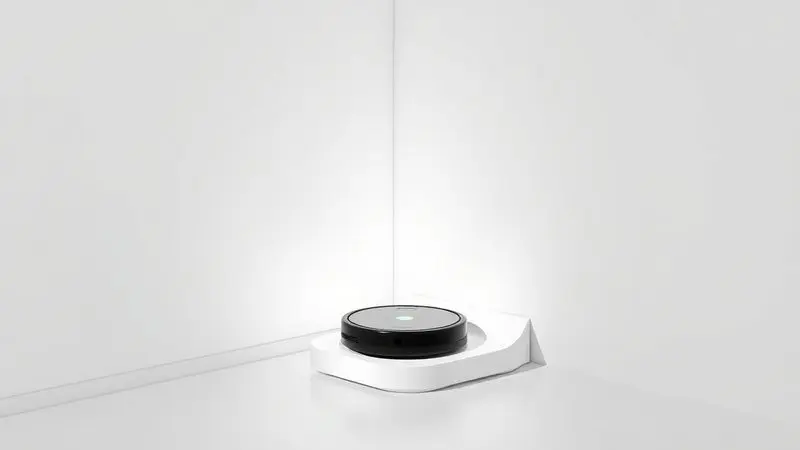
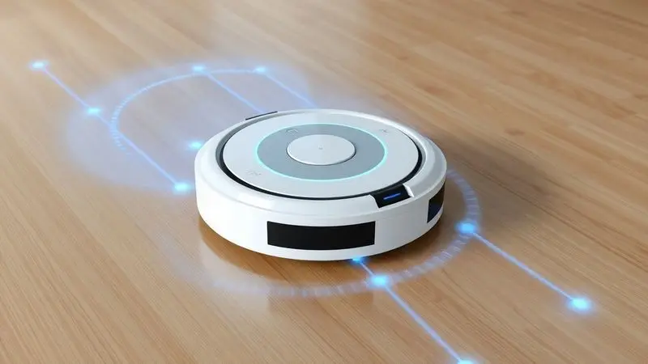
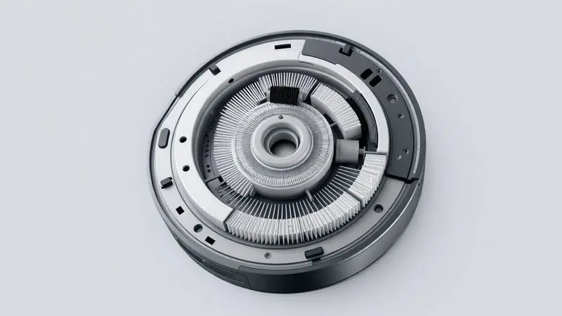

A busca por praticidade na limpeza doméstica levou muitos brasileiros a considerar a marca própria da gigante do e-commerce. Mas será que o robô aspirador KaBuM! é bom mesmo ou é apenas um produto básico com etiqueta famosa?

Com modelos que variam desde o essencial Smart 100 até o avançado Smart 900, que conta com mapeamento a laser e estação de limpeza, a dúvida sobre qual investir é comum.

Neste artigo, mergulhamos nas especificações técnicas, desempenho real em diferentes pisos e comparativos diretos para responder se vale a pena ter um robô aspirador da KaBuM! na sua rotina.

<SummaryList products={frontmatter.top_products} />

## Melhores modelos de robô aspirador KaBuM!

Os robôs aspiradores KaBuM! são conhecidos pela praticidade e eficiência. Entre os modelos, os mais destacados incluem o Smart 100, 700 e 900, cada um oferecendo recursos adaptados às diferentes necessidades de limpeza.

### Robô Aspirador e Passa Pano KaBuM! Smart 100 – KBSF007

<ProductBox 
  title={frontmatter.top_products[0].title} 
  image={frontmatter.top_products[0].image} 
  link={frontmatter.top_products[0].link} 
/>

Ideal para quem está começando no mundo da automação residencial, o Smart 100 entrega o básico bem feito. Imagine sair de casa enquanto ele trabalha sozinho, controlado pelo seu smartphone ou até pela voz através da Alexa e Google Assistant.

Com 90 minutos de autonomia, ele dá conta de apartamentos menores e, quando a bateria está no fim, encontra sozinho o caminho de volta à base.

Os sensores anticolisão garantem que ele não vai derrubar aquele vaso da avó, enquanto o sistema antiqueda evita surpresas desagradáveis nas escadas. A função de passar pano?

É aquela ajudinha extra para dar brilho no piso após a aspiração, perfeita para a manutenção diária entre faxinas mais profundas.

<CaixaProsContras>

**Prós:**

- Funcionalidades de aspiração e passar pano em um único dispositivo.

- Controle via aplicativo e assistentes de voz.

- Design compacto que alcança áreas difíceis.

- Boa autonomia com retorno automático à base.

**Contras:**

- Modelagem básica, faltando acessórios adicionais.

- A função de passar pano oferece apenas um brilho superficial.

</CaixaProsContras>

### Robô Aspirador e Passa Pano KaBuM! Smart 700 – KBSF003

<ProductBox 
  title={frontmatter.top_products[1].title} 
  image={frontmatter.top_products[1].image} 
  link={frontmatter.top_products[1].link} 
/>

O ponto de equilíbrio perfeito entre tecnologia e investimento. Aqui você encontra o filtro HEPA que faz diferença real na qualidade do ar da sua casa, especialmente se há crianças, idosos ou pets que soltam pelos.

São 140 minutos de trabalho contínuo, tempo suficiente para limpar áreas maiores sem interrupções.

O giroscópio faz dele um navegador mais inteligente, evitando aquela sensação frustrante de ver o robô passar três vezes no mesmo lugar enquanto ignora um canto importante.

Compatível com os mesmos assistentes de voz e aplicativo, ele traz uma potência que lida bem com a sujeira do dia a dia, ainda que talvez precise de uma ajudinha sua para aquelas migalhas de biscoito mais teimosas.

<CaixaProsContras>

**Prós:**

- Aspira, varre e passa pano eficientemente.

- Filtro HEPA melhora a qualidade do ar.

- Navegação inteligente evita colidir com obstáculos.

- Controle via aplicativo e compatibilidade com assistentes virtuais.

**Contras:**

- Potência para sujeiras pesadas pode ser limitada.

- O reservatório de água poderia ser maior.

</CaixaProsContras>

### Robô Aspirador e Passa Pano KaBuM! Smart 900 – KBSF011

<ProductBox 
  title={frontmatter.top_products[2].title} 
  image={frontmatter.top_products[2].image} 
  link={frontmatter.top_products[2].link} 
/>

A experiência premium que transforma a limpeza em algo quase mágico. O mapeamento ToF 360° significa que ele não apenas limpa, mas aprende a sua casa. Ele armazena até cinco plantas diferentes, perfeito para quem divide apartamento ou tem uma casa com vários andares.

E o melhor: você pode delimitar áreas restritas no aplicativo, como aquela parte do tapete que sempre fica presa nas escovas.

A base autolimpante é o verdadeiro diferencial. Enquanto você trabalha ou assiste a uma série, o Smart 900 não só limpa sua casa como também se limpa sozinho, reduzindo a manutenção ao mínimo.

Com 180 minutos de autonomia e 4000Pa de sucção, ele encara até pelos de pets mais persistentes, embora a função de passar pano ainda seja mais para manutenção do que para limpeza pesada.

<CaixaProsContras>

**Prós:**

- Mapeamento preciso com até 5 mapas armazenados.

- Base autolimpante que reduz a manutenção.

- Diversos modos de limpeza para diferentes necessidades.

- Potência de sucção robusta e capacidade de reconhecimento de tapetes.

**Contras:**

- A função de passar pano pode ser menos eficaz para sujeiras difíceis.

- O aplicativo pode apresentar instabilidade em alguns casos.

</CaixaProsContras>

Agora que você conhece os principais modelos, talvez se pergunte: quem está por trás dessa tecnologia?

## Quem fabrica o robô aspirador KaBuM!?

Essa é uma marca 100% brasileira que nasceu em 2003 como uma loja de informática e cresceu para se tornar uma gigante do e-commerce. A KaBuM!

entende como ninguém as necessidades do consumidor brasileiro: produtos com boa relação custo-benefício, que realmente facilitam o dia a dia.

Essa filosofia está presente nos robôs aspiradores, que não são apenas importados com uma etiqueta local, mas sim desenvolvidos pensando em como as famílias brasileiras realmente vivem e limpam suas casas.

## Qual o melhor robô KaBuM! para cada necessidade?

Escolher entre os modelos é como encontrar o parceiro de limpeza perfeito para o seu estilo de vida. O Smart 100 é a porta de entrada ideal: compacto, eficiente e acessível, perfeito para apartamentos de solteiro ou casais sem pets.

Já o Smart 700 é o companheiro das famílias: com filtro HEPA para quem se preocupa com qualidade do ar e autonomia suficiente para casas maiores.

O Smart 900, por sua vez, é para quem não quer apenas automatizar, mas transformar a experiência: com mapeamento inteligente e base autolimpante, ele praticamente opera sozinho enquanto você vive sua vida.

## Qual a diferença entre o Robô KaBuM Smart 700 e o Smart 900?

Imagine que o Smart 700 é o carro completo, com ar condicionado e vidros elétricos. Já o Smart 900 é a versão com piloto automático e estacionamento assistido.

A diferença está no nível de autonomia: enquanto o 700 navega bem e limpa eficientemente, o 900 aprende a sua casa, evita áreas problemáticas e ainda se limpa sozinho.

A potência também aumenta consideravelmente, dos 2500Pa do 700 para os 4000Pa do 900, fazendo diferença em tapetes mais grossos ou casas com pets. A escolha depende do quanto você valoriza essa inteligência extra versus o investimento adicional.

## Análise técnica: Design e construção

Os robôs KaBuM! foram pensados para se integrar à sua casa, não chamar atenção. O design arredondado e as cores neutras fazem com que eles pareçam mais um eletrônico discreto do que um robô industrial.

A construção é robusta o suficiente para enfrentar pequenos obstáculos do dia a dia, mas leve para você mover de um cômodo a outro quando necessário. É aquele equilíbrio raro entre durabilidade e elegância.

### Estação de carregamento e limpeza automática

Esta é a função que realmente muda o jogo. Ter um robô que não só retorna para carregar sozinho como também se esvazia automaticamente significa que você pode passar semanas sem sequer tocar nele.

Imagine programar limpezas diárias no aplicativo e simplesmente esquecer que existe sujeira no chão. A base do Smart 900 faz exatamente isso: enquanto você dorme, trabalha ou se diverte, ela mantém o ciclo de limpeza funcionando praticamente sem intervenção humana.

## Experiência de uso: Sucção e Navegação

É aqui que a teoria encontra a prática. A sucção varia do suficiente para manter a casa apresentável (Smart 100) até potência que rivaliza com aspiradores manuais (Smart 900).

A navegação evolui de sensores básicos que evitam acidentes para um sistema que mapeia cada centímetro da sua casa. O resultado? Menos tempo assistindo o robô trabalhar e mais confiança de que ele está fazendo um trabalho completo.

### Nível de ruído e consumo de energia

Eles trabalham no volume de uma conversa animada, entre 55 e 70 decibéis. Suficiente para você notar que estão trabalhando, mas não a ponto de atrapalhar uma reunião online ou o sono da soneca da tarde.

O consumo de energia é tão baixo que você mal vai perceber na conta de luz, especialmente comparado com o esforço físico que economiza.

## Limpeza e cuidados fundamentais com o aparelho

Manter seu robô funcionando bem é mais simples do que parece. Uma vez por semana, tire um minuto para limpar as escovas principais e laterais, removendo cabelos e fiapos que naturalmente se acumulam.

O compartimento de sujeira deve ser esvaziado após cada ciclo importante de limpeza, e os filtros merecem uma batidinha para remover o pó mais fino. Os sensores? Uma passada com um pano seco a cada quinze dias evita que ele fique 'cego' e comece a bater nos móveis.

São pequenos rituais que garantem anos de serviço fiel.

## Concorrentes diretos no mercado nacional

No Brasil, você encontra desde os veteranos como iRobot Roomba, com reputação consolidada mas preços que fazem pensar duas vezes, até os chineses Roborock que chegam com tecnologia de ponta.

As nacionais como Multilaser oferecem opções econômicas para quem quer testar a automação sem comprometer o orçamento. Os KaBuM!

se posicionam justamente no meio deste espectro: mais tecnologia que as marcas básicas, mais acessíveis que as importadas premium, com o suporte e garantia de uma empresa que os brasileiros já conhecem e confiam.

## Conclusão

Vale a pena investir em um robô aspirador KaBuM? A resposta depende do que você busca. Se você quer apenas testar as águas da automação doméstica, o Smart 100 é um excelente começo.

Se precisa de um ajudante sério para uma casa com família e pets, o Smart 700 entrega tecnologia que faz diferença real no dia a dia.

Mas se você quer esquecer que limpar o chão é uma tarefa, o Smart 900 com sua base autolimpante e mapeamento inteligente transforma completamente sua relação com a limpeza.

O mais importante é entender que você não está comprando apenas um eletrônico, mas sim tempo. Tempo que pode ser investido no trabalho, no lazer, na família. Cada minuto que o robô trabalha é um minuto que você recupera para viver melhor.

E nesse aspecto, seja qual for o modelo escolhido, os KaBuM! cumprem sua promessa com competência, qualidade e aquele jeitinho brasileiro de entender o que realmente importa no nosso dia a dia.

---

Ainda na dúvida sobre o robô aspirador ideal? Confira nosso [Ranking Completo dos Melhores Robôs Aspiradores de 2025](/melhores-robo-aspirador-2024/) e encontre a opção perfeita para sua casa!
