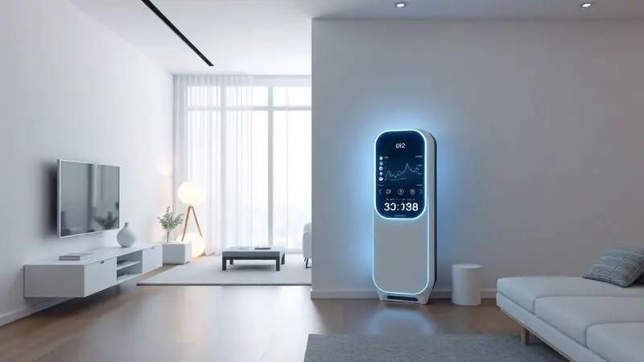
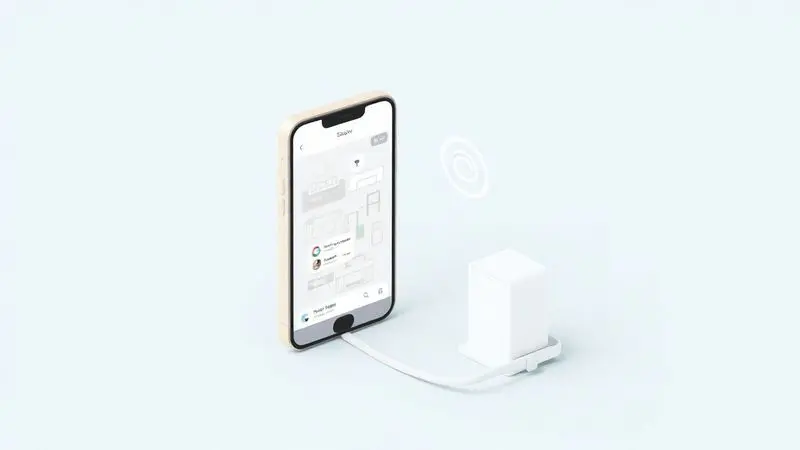

O mercado de robôs aspiradores evoluiu drasticamente, e o Liectroux G7 surge como um forte concorrente para quem busca automação total.

Com a promessa de varrer, aspirar, passar pano e ainda se esvaziar sozinho graças à sua base autolimpante, o modelo desperta a curiosidade de muitos consumidores. Mas será que o Liectroux G7 é bom de verdade?

Nesta análise completa, exploramos desde o design até o funcionamento inteligente via aplicativo para descobrir se este robô aspirador entrega a eficiência prometida e se ele é a escolha certa para facilitar a limpeza da sua casa.

<SummaryList products={frontmatter.top_products} />

## O que é o Liectroux G7?

Imagine um assistente doméstico que não apenas aspira sua casa, mas também mapeia cada canto, planeja rotas inteligentes e se mantém limpo sozinho. O Liectroux G7 foi projetado para transformar a limpeza de uma tarefa manual em um processo autônomo e eficiente.

Ele observa seus ambientes, aprende o caminho mais rápido e evita obstáculos sozinho, tudo enquanto você cuida de outras coisas.

O controle via aplicativo é apenas a cereja do bolo: você pode programar limpezas, monitorar o progresso e até esquecer que ele existe até o trabalho estar feito.

## Especificações do Liectroux G7

<ProductBox 
  title={frontmatter.top_products[0].title} 
  image={frontmatter.top_products[0].image} 
  link={frontmatter.top_products[0].link} 
/>

Para entender como ele entrega essa autonomia, vamos aos números que realmente importam no seu dia a dia. A potência de 6500 Pa se traduz em uma sucção capaz de tirar não só poeira, mas pelos de animais que se alojam nos tapetes, sem você precisar se preocupar.

A bateria dura até 150 minutos, tempo suficiente para cobrir áreas amplas em uma única corrida.

A verdadeira revolução, porém, está na base autolimpante. O G7 volta para a estação e esvazia sozinho seu reservatório de pó, eliminando aquela tarefa desagradável que ninguém gosta de fazer.

Ele ainda armazena até cinco mapas diferentes, perfeito para quem tem casa em mais de um andar ou quer personalizar a limpeza de cada ambiente.

<CaixaProsContras>

**Prós:**

- Multifuncionalidade: varre, aspira e passa pano ao mesmo tempo.

- Base autolimpante que facilita a manutenção.

- Armazenamento de múltiplos mapas para diferentes andares.

- Potência de sucção e autonomia adequadas para diversos tipos de piso.

**Contras:**

- O preço pode ser mais elevado em comparação com modelos básicos.

- Requer um cuidado inicial no setup e configuração do mapeamento.

</CaixaProsContras>

## Design do Liectroux G7

Olhando para ele, você não vê apenas um robô, mas um acessório que se integra à decoração. Suas linhas suaves e acabamento elegante parecem mais um gadget de luxo do que um eletrodoméstico de limpeza.

E há inteligência nesse design: a altura reduzida permite que ele escorregue sob sofás e camas, alcançando aqueles cantos onde a poeira adora se esconder. As rodas robustas não são apenas estéticas, elas garantem que ele transite de piso frio para carpete sem hesitação.

A base de carregamento, minimalista, pode ficar em qualquer canto discreto da sua casa, sem chamar atenção desnecessária.

## Funcionamento do Liectroux G7

Aqui é onde a mágica acontece. Ligá-lo pela primeira vez é como apresentá-lo ao seu lar. Ele sai da base e começa a explorar, usando sensores e câmeras para construir um mapa digital do seu espaço.

Não é só aleatoriedade; ele calcula rotas eficientes, evitando repetições desnecessárias. Quando encontra um tapete, ativa automaticamente o modo 'carpet boost', aumentando a sucção para uma limpeza mais profunda.

Diferentes modos se adaptam a cada situação, desde uma limpeza rápida depois do jantar até uma faxina completa no final de semana. E o melhor: depois de configurado, você quase não precisa mais intervir.

## Cobertura e Bateria do Liectroux G7

O verdadeiro teste para qualquer robô aspirador é: ele consegue limpar sua casa inteira sem ajuda? Com o G7, a resposta passa pelo equilíbrio entre mapeamento inteligente e autonomia energética.

O sistema de navegação evita aquela andança errante que desperdiça bateria, cobrindo mais área em menos tempo. Em casas maiores, os 120 a 150 minutos de bateria significam que ele pode completar a limpeza principal e ainda ter carga para uma área extra ou dois.

Quando a energia está baixa, ele retorna sozinho para a base, recarrega e, em alguns modelos, até continua de onde parou. É como ter uma rotina de limpeza que nunca falha, independentemente do tamanho do seu espaço.

## Recursos e Acessórios do Liectroux G7

Além do básico que já mencionamos, o G7 traz diferenciais que transformam a experiência de limpeza. O conjunto de escovas é otimizado para diferentes tipos de sujeira: uma para pelos longos de animais, outra para poeira fina.

Filtros HEPA garantem que o ar que volta para sua casa está limpo, essencial para quem tem alergias. Os acessórios incluídos, como tanques de água independentes para a função de pano úmido, permitem que você escolha entre limpeza a seco ou úmida sem complicação.

E tudo se encaixa de forma intuitiva, sem a necessidade de manuais complicados.

## Aplicativo e Conectividade do Liectroux G7

Se você já quis controlar sua limpeza do sofá, aqui está sua chance. O aplicativo do Liectroux G7 transforma seu smartphone em um centro de comando.

Você pode programar horários específicos (como limpar a sala toda terça e quinta às 10h), definir áreas de exclusão (não passe perto do vaso da avó!) e até receber relatórios de conclusão.

A compatibilidade com assistentes de voz adiciona uma camada de conveniência: basta dizer 'Alexa, inicia a limpeza na cozinha' enquanto prepara o café. A interface é tão intuitiva que até quem não se considera tecnológico vai navegar sem esforço.

## Preço do Liectroux G7 e Veredito

Quando falamos de investimento em automação doméstica, a pergunta sempre é: vale o custo? Cada detalhe do G7, da base autolimpante ao mapeamento inteligente, foi pensado para reduzir sua intervenção ao mínimo.

Comparado com modelos básicos, você está pagando pelo tempo que vai recuperar, horas que antes gastava com vassoura e espanador. A economia vai além do óbvio: menos tempo limpando significa mais tempo para o que realmente importa.

A durabilidade da construção e a qualidade dos materiais sugerem que este não é um aparelho descartável, mas um parceiro de longo prazo para sua casa.

## Conclusão

O Liectroux G7 representa mais do que um simples robô aspirador; ele é uma mudança na forma como pensamos sobre limpeza doméstica.

Das manhãs em que você acorda com o chão já aspirado aos dias em que chega em casa e encontra tudo impecável, ele transforma uma rotina cansativa em algo que simplesmente acontece nos bastidores.

Para quem valoriza tempo, praticidade e aquele sentimento incomparável de pisar em um piso limpo sem ter levantado um dedo, o investimento faz sentido.

Ele não substitui totalmente a limpeza humana profunda, mas elimina 80% do trabalho diário, permitindo que você foque na parte que realmente importa.

Se sua maior dor é perder horas preciosas com tarefas repetitivas, ou se você simplesmente quer experimentar como é ter uma casa que se mantém limpa sozinha, o Liectroux G7 merece sua atenção.

A tecnologia está aqui não para complicar, mas para libertar, e este robô entende perfeitamente essa missão.

---

Ainda em dúvida sobre o Liectroux G7? Confira nosso ranking atualizado dos [Melhores Robôs Aspiradores com Mapeamento de 2025](/melhor-robo-aspirador-com-mapeamento/) e encontre a opção ideal para sua casa.
