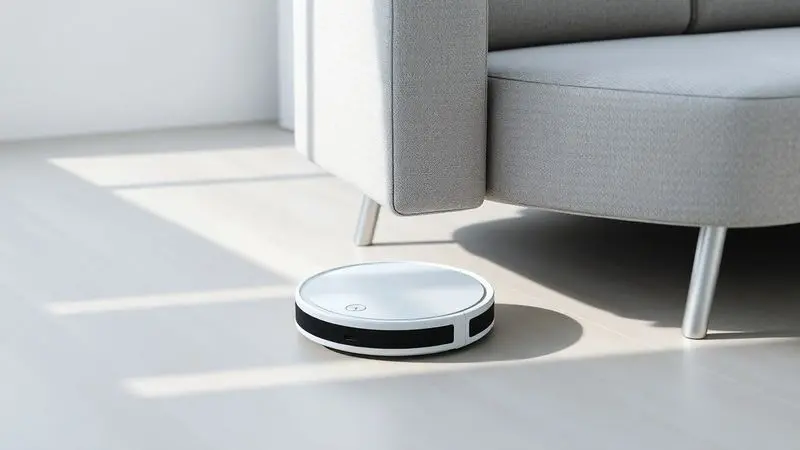
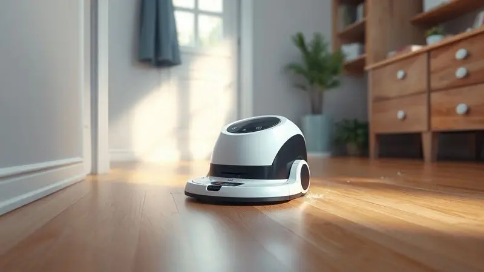
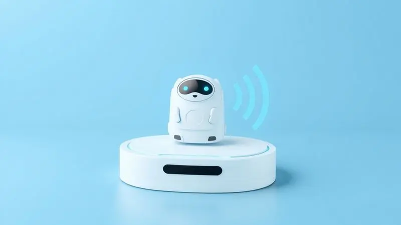
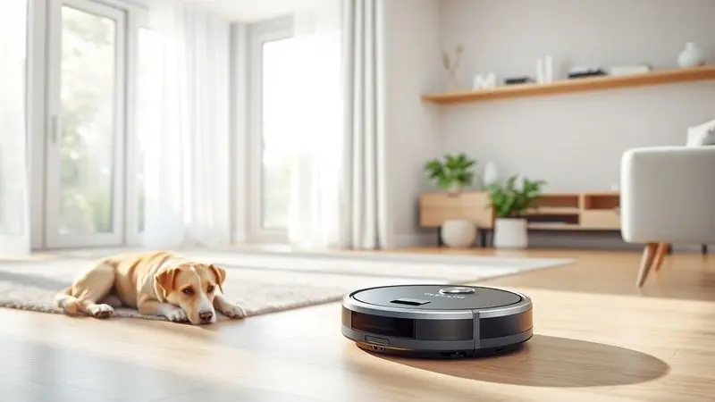

A busca por praticidade na limpeza doméstica levou ao crescimento explosivo dos robôs aspiradores no Brasil, e o Liectroux L200 surge como um forte concorrente no segmento de entrada e intermediário.

Imagine acordar com os raios de sol entrando pela janela e, em vez de pensar na vassoura, simplesmente pedir ao seu assistente de voz para iniciar a limpeza.

É essa promessa de automação inteligente, combinada com um design compacto e preço acessível, que faz tantos consumidores se perguntarem se este modelo é o investimento ideal para sua rotina.

Neste review, vamos além das especificações técnicas para mergulhar na experiência real de uso e responder à pergunta que realmente importa: o L200 vai transformar seu dia a dia ou será apenas mais um gadget esquecido no canto da sala?

<SummaryList products={frontmatter.top_products} />

## Visão Geral do Robô Aspirador Liectroux L200

<ProductBox 
  title={frontmatter.top_products[0].title} 
  image={frontmatter.top_products[0].image} 
  link={frontmatter.top_products[0].link} 
/>

Se você já cansou de dedicar seu fim de semana a varrer, aspirar e passar pano, a proposta do L200 soa como música para seus ouvidos. Este robô de limpeza 3 em 1 promete justamente isso: unir três tarefas em um único movimento silencioso pelo seu piso.

Com uma sucção de 4000Pa, ele é projetado para lidar não apenas com a poeira cotidiana, mas com os verdadeiros vilões da limpeza doméstica: os pelos de animais que insistem em se alojar nos carpetes.

A inteligência por trás da operação vem de um mapeamento que, mesmo sendo temporário, permite que o dispositivo trace rotas eficientes, evitando perder tempo em áreas já limpas.

A sensação de voltar para casa e encontrar o chão impecável, sem ter levantado um dedo, é o verdadeiro produto que ele vende.

<CaixaProsContras>

**Prós:**

- Limpeza integrada (varre, aspira e passa pano)

- Sucção potente de até 4000Pa

- Controle via aplicativo e compatibilidade com assistentes de voz

- Design slim que alcança embaixo dos móveis

**Contras:**

- Não salva mapas permanentes

- A capacidade do tanque de água poderia ser maior

</CaixaProsContras>

## Especificações Técnicas do Robô Aspirador Liectroux L200

O que realmente significa ter 4000Pa de potência de sucção? Visualize aquele grão de areia que sempre escapa da vassoura ou os fragmentos de biscoito que as crianças espalham pelo sofá.

É contra essas pequenas batalhas diárias que o L200 entra em ação com seu motor otimizado. A bateria, que dura entre 100 e 120 minutos, é suficiente para cobrir apartamentos médios em uma única sessão, retornando sozinha à base quando a energia está no fim.

E enquanto ele trabalha, você pode monitorar tudo através do aplicativo no smartphone, ajustando a potência para pisos delicados ou programando a próxima limpeza. São números que, no papel, garantem eficiência, mas é na prática que eles ganham vida.

## Design Inteligente e Compacto

O verdadeiro teste para qualquer robô aspirador não está nos metros quadrados abertos da sala, mas no espaço de 10 centímetros entre o sofá e o chão, onde a poeira adora se esconder.

É aí que o design slim do L200 se transforma de uma característica técnica em uma solução emocional. Você finalmente consegue acessar aqueles cantos esquecidos sem precisar arrastar móveis pesados ou se contorcer com um aspirador de mão.

Seu formato arredondado navega por rodapés e cantos de paredes com uma elegância que quase parece intencional, enquanto o perfil baixo desliza sob camas e armários como um mágico limpando o palco.

E quando ele não está trabalhando, seu visual discreto se integra à decoração, longe da estética industrial de alguns eletrodomésticos.

## Limpeza Automatizada e Completa

Graças ao seu formato compacto e sensores inteligentes, o L200 navega pelo seu ambiente de forma metódica, aprendendo a evitar os pés da mesa e os brinquedos deixados no chão.

A limpeza tripla acontece em tempo real: as cerdas varrem a sujeira solta, o sistema de aspiração captura a poeira mais fina e, se você optar, o pano úmido preso na parte de trás dá aquele acabamento que faz o piso brilhar.

Para pisos frios, como porcelanato ou madeira, a combinação é especialmente satisfatória.

A autonomia é pensada para a rotina real: ele consegue limpar um apartamento de dois quartos antes de precisar recarregar, e o melhor, faz isso enquanto você está no trabalho ou cuidando de outras coisas.

## Compatibilidade com Assistentes Virtuais

Aqui está onde a mágica da automação ganha um toque pessoal. Conectar o L200 ao seu Wi-Fi não é apenas sobre tecnologia, é sobre conquistar tempo. Imagine estar cozinhando e perceber que caiu farinha no chão.

Em vez de interromper o que está fazendo, você simplesmente diz: "Ok Google, ligue o robô aspirador da cozinha". Em segundos, o L200 parte do seu dock e resolve o problema enquanto você continua preparando o jantar.

A integração com Alexa e Google Assistant transforma a limpeza de uma tarefa ativa em um comando casual, algo que você delega naturalmente, como ajustar a iluminação ou tocar uma música.

É o tipo de conveniência que, uma vez experimentada, faz você se perguntar como viveu tanto tempo sem.

## Recursos Adicionais do Robô Aspirador

Além do controle por voz, o aplicativo dedicado funciona como o centro de comando do seu pequeno ajudante digital.

Você pode definir zonas proibidas virtualmente (mesmo sem mapas permanentes, pode marcar áreas para evitar durante uma sessão específica), agendar limpezas recorrentes para sempre acordar com a casa arrumada, ou iniciar uma sessão rápida quando receber aquela visita inesperada.

Os sensores anti-queda são seu seguro invisível: eles evitam que o robô encare uma escada como um novo desafio, garantindo que ele trabalhe com segurança em apartamentos com varanda ou mezanino. São detalhes que, juntos, criam uma experiência coesa e confiável.

## Análise das Avaliações dos Clientes

O que as pessoas que realmente levaram o L200 para casa têm a dizer? A maioria celebra a libertação da rotina de varrer todos os dias, especialmente quem convive com pets.

"Pela primeira vez em anos, consigo usar meia preta sem elas ficarem cheias de pelos do gato", compartilha uma usuária.

O funcionamento silencioso é outro ponto frequentemente elogiado, permitindo que a limpeza aconteça durante reuniões online ou enquanto a família dorme.

Algumas ressalvas aparecem em relação a objetos muito pequenos, como pedaços de papel ou fios, que podem exigir uma rápida inspeção antes de ligar o robô.

No Reclame Aqui, as reclamações mais comuns giram em torno do suporte pós-venda em casos específicos, um alerta importante para considerar a reputação do vendedor no momento da compra.

## Vale a Pena Comprar o Robô Aspirador Liectroux L200?

A resposta depende do que você busca. Se você procura um aliado para manter a limpeza básica entre uma faxina mais profunda, o L200 é um investimento que se paga em tempo e tranquilidade.

Ele é excepcional para controle diário de pelos de animais, poeira e sujeira superficial em pisos lisos.

Para quem tem uma casa com muitos obstáculos, tapetes muito grossos ou deseja um mapeamento permanente com divisão de cômodos, modelos mais avançados podem se adequar melhor.

Mas considerando a relação custo-benefício na faixa intermediária, ele entrega exatamente o que promete: praticidade sem complicação.

## Perguntas Frequentes (FAQ)

### Quais são os principais recursos do Robô Aspirador Liectroux L200?

Além da limpeza 3 em 1 e da potente sucção de 4000Pa, seus diferenciais são o controle integral por aplicativo, compatibilidade com comandos de voz e a habilidade de agendar horários de funcionamento.

O design slim é um recurso prático frequentemente subestimado até você ver o robô acessando espaços que seu aspirador tradicional nunca alcançaria.

### O Robô Aspirador Liectroux L200 é uma boa escolha para lares com animais de estimação?

Sim, é uma das melhores aplicações para ele. A potência de sucção é suficiente para capturar pelos de cães e gatos em pisos e carpetes de baixo a médio pile.

Programar limpezas diárias enquanto você está fora evita o acúmulo de pelos, reduzindo alergias e mantendo o ambiente mais saudável para todos.

### Qual é a autonomia de bateria e o tempo de carregamento do Liectroux L200?

A bateria dura entre 90 e 120 minutos em uso contínuo, dependendo do tipo de piso e potência selecionada. O tempo de carregamento completo é de aproximadamente 5 horas.

Na prática, isso significa que para a maioria dos apartamentos, uma sessão por dia é suficiente, e ele recarrega durante a noite, pronto para o próximo dia.

### Existem reclamações comuns dos usuários sobre o Robô Aspirador Liectroux L200 no Reclame Aqui?

Além de questões pontuais de suporte técnico, algumas reclamações mencionam que o robô pode precisar de assistência em pisos muito irregulares ou com transições abruptas de altura.

Isso é comum na categoria e geralmente é resolvido com uma rápida preparação do ambiente, retirando fios soltos e objetos pequenos do caminho.

## Conclusão

O Robô Aspirador Liectroux L200 representa mais do que uma simples automação doméstica, ele simboliza a reconquista do seu tempo.

Em um mundo onde cada minuto conta, ter um aliado que cuida da limpeza básica diária enquanto você se dedica ao que realmente importa não tem preço.

Ele não promete milagres nem substitui completamente a faxina manual, mas entrega consistentemente a praticidade que famílias ocupadas e donos de pets tanto buscam.

Se você está cansado de dedicar suas tardes de sábado à guerra contra a poeira e os pelos, o L200 oferece um caminho viável para uma vida mais leve e uma casa visivelmente mais limpa com muito menos esforço.

A decisão final não é sobre comprar um eletrônico, mas sobre investir em qualidade de vida. E nesse aspecto, ele cumpre sua missão com louvor.

---

Ainda em dúvida sobre o Liectroux L200? Confira nosso [ranking dos Melhores Robôs Aspiradores com Mapeamento de 2025](/melhor-robo-aspirador-com-mapeamento/) e encontre o ideal para sua casa.
