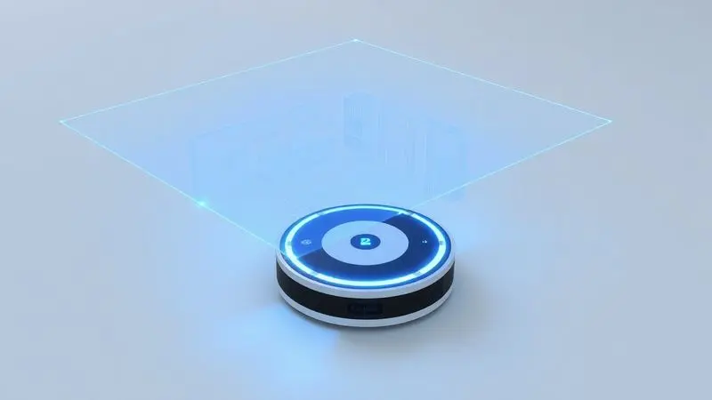
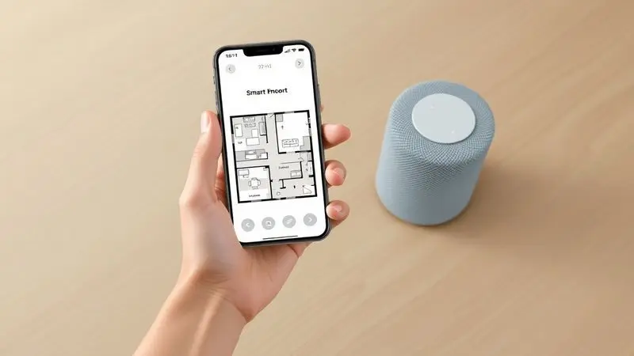
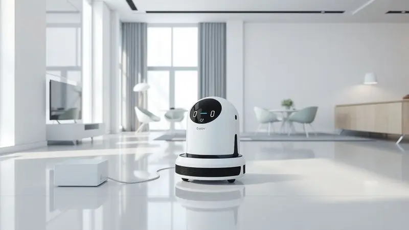
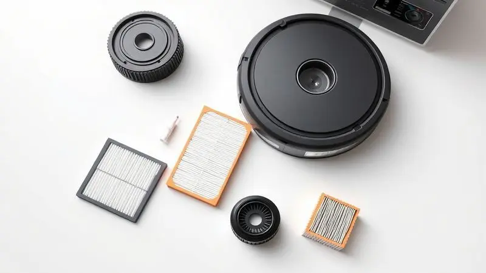

O mercado de robôs aspiradores cresceu exponencialmente, e modelos com mapeamento a laser como o Liectroux XR500 ganharam destaque pelo equilíbrio entre tecnologia e preço. Mas será que o Liectroux XR500 é bom mesmo?

Com a promessa de varrer, aspirar e passar pano de forma inteligente, ele atrai quem busca automação doméstica de alto nível. Aqui, vamos além das especificações técnicas para descobrir como esse robô realmente se comporta na sua rotina diária.

Você vai entender se vale a pena abrir mão do cabo do aspirador tradicional ou se ainda é melhor olhar outras opções.

<SummaryList products={frontmatter.top_products} />

## O que é o Liectroux XR500?

<ProductBox 
  title={frontmatter.top_products[0].title} 
  image={frontmatter.top_products[0].image} 
  link={frontmatter.top_products[0].link} 
/>

Imagine um ajudante doméstico que não cansa, não reclama e sabe exatamente onde precisa limpar. Assim é o Liectroux XR500, um robô que combina três funções essenciais em um único dispositivo: varre, aspira e passa pano.

A grande diferença está no cérebro por trás das rodas, um sistema de navegação a laser que cria um mapa inteligente do seu ambiente.

Em vez de bater aleatoriamente nos móveis, ele traça rotas precisas, aprende a evitar obstáculos e até permite criar áreas proibidas virtuais, como aquela zona de brinquedos das crianças que sempre acumula pecinhas.

Com potência que varia entre 4000 e 6500 Pa, ele se adapta desde pisos frios até tapetes mais grossos. Os reservatórios são generosos: 600 mL para a sujeira seca e 350 mL para água no modo mop.

Não é o modelo mais barato da prateleira, mas representa um salto tecnológico significativo em relação aos robôs mais básicos, oferecendo a comodidade que realmente faz diferença na correria do dia a dia.

<CaixaProsContras>

**Prós:**

- Funcionalidade 3 em 1: varre, aspira e passa pano

- Mapeamento inteligente com navegação a laser

- Compatível com assistentes virtuais como Alexa e Google Assistente

- Retorno automático à base quando a bateria está baixa

**Contras:**

- Não é o modelo mais barato disponível

- O tempo de carregamento pode ser maior do que em alguns modelos concorrentes

</CaixaProsContras>

## Especificações e Ficha Técnica do Liectroux XR500

Por dentro da carcaça compacta, o XR500 esconde bastante tecnologia. Além do já mencionado mapeamento por laser, ele oferece conectividade Wi-Fi 2.4GHz para controle total pelo smartphone.

A altura de 9.5 cm permite acesso sob a maioria dos móveis, enquanto o peso de 3.8 kg facilita o transporte entre andares quando necessário.

### Design e Construção do Robô

À primeira vista, ele parece mais um gadget futurista do que um simples eletrodoméstico. O formato arredondado não é apenas estético, serve para navegar entre pernas de cadeira e rodapés sem ficar preso.

Os materiais têm um acabamento que resiste a arranhões e respingos ocasionais, mantendo a aparência de novo mesmo após meses de uso. Percebe-se a atenção aos detalhes, como as borrachas que amortecem pequenos impactos e protegem tanto o robô quanto seus móveis.

### Potência de Sucção e Performance em Diferentes Tipos de Piso

É aqui que a teoria vira realidade. Os 6500 Pa de potência máxima não são apenas números no papel: eles significam que o XR500 remove até aquela poeira fina que fica grudada nos poros do piso porcelanato.

Em carpete, ele automaticamente aumenta a força, alcançando a camada mais profunda de sujeira. A transição entre superfícies é suave, sem aquela pausa desconcertante que alguns modelos mais simples apresentam.

Para quem tem animais de estimação, essa versatilidade é um alívio, pois lida igualmente bem com pelos no sofá e areia na entrada da casa.

### Dimensões e Capacidade do Reservatório de Resíduos e Água

Com 35 cm de diâmetro, ele cabe até em espaços apertados entre armários. O tanque de 600 mL pode parecer modesto, mas na prática significa limpar um apartamento de 80 m² inteiro sem precisar esvaziar.

Já o compartimento de água de 350 mL é suficiente para umedecer adequadamente o pano sem deixar poças. A beleza está na praticidade: ambos são removíveis com um simples clique, fáceis de limpar na pia e retornam ao lugar com encaixe magnético que evita vazamentos.

## Tecnologia de Mapeamento Laser e Sensores Inteligentes

O verdadeiro diferencial começa quando você liga o aparelho pela primeira vez. Enquanto robôs mais básicos parecem perdidos, o XR500 sai da base como um explorador determinado.

Seus sensores a 360° varrem o ambiente 300 vezes por segundo, construindo gradualmente um mapa que identifica não apenas paredes, mas também móveis baixos, degraus e até cabos soltos.

Essa inteligência se traduz em eficiência: ele nunca passa duas vezes no mesmo lugar desnecessariamente, economizando bateria e desgaste.

Você pode dividir sua casa em zonas no aplicativo, pedindo para limpar apenas a cozinha após o jantar ou evitar completamente o escritório durante reuniões importantes. É como ter controle remoto sobre a limpeza, só que muito mais inteligente.

## Aplicativo, Conectividade Wi-Fi e Integração com Alexa e Google Home

Baixar o aplicativo é descobrir um painel de controle que transforma tarefas domésticas em algo quase divertido. A interface mostra em tempo real onde o robô está, quais áreas já foram limpas e quanto tempo falta para terminar.

Agendar limpezas é intuitivo: programe para segunda, quarta e sexta às 10h, exatamente quando você sai para trabalhar, e volte para casa com os pisos impecáveis.

A integração com assistentes de voz leva a conveniência a outro nível. "Alexa, pedir para o robô limpar a sala" se torna parte natural da rotina, especialmente útil quando as mãos estão ocupadas na cozinha ou segurando um bebê.

O Wi-Fi mantém tudo sincronizado, permitindo iniciar uma limpeza do trabalho se souber que visitas estão a caminho. Não é apenas tecnologia: é tempo recuperado para o que realmente importa.

## Bateria, Autonomia e Área de Cobertura

Com 120 minutos de autonomia, o XR500 cobre confortavelmente apartamentos de até 200 m² em uma única carga. Na prática, isso significa limpar toda a sua casa sem interrupções, incluindo idas e vindas sob móveis que consomem mais energia.

A bateria de íon-lítio mantém performance consistente ao longo do tempo, sem aquela perda drástica de capacidade que alguns modelos mais antigos apresentam após alguns meses.

### Tempo de Recarga e Sistema de Retorno Automático à Base

Aqui está a magia que elimina completamente a preocupação. Quando os sensores detectam que resta apenas 15% de bateria, o XR500 interrompe a limpeza, calcula a rota mais rápida até a base e vai recarregar sozinho.

Em 3 a 4 horas está pronto para continuar de onde parou, retomando automaticamente se você assim configurar. É o fim daquela frustração de encontrar o robô morto no meio da sala, com o trabalho pela metade.

Para famílias com rotina irregular, essa inteligência é um divisor de águas.

## O que vem na caixa do Liectroux XR500?

Abrir a embalagem é uma experiência bem pensada. Além do robô propriamente dito, você encontra:

- Base de carregamento compacta que se encaixa em cantos discretos

- Dois filtros HEPA extras (já tem um instalado), essenciais para quem sofre com alergias

- Conjunto de escovas laterais de reposição

- Controle remoto para operações básicas sem smartphone

- Manual em português com instruções claras

- Pano de limpeza reutilizável para a função mop

Tudo organizado de forma que em 10 minutos você tem o sistema funcionando, sem precisar procurar peças ou decifrar diagramas complexos.

## Opiniões de Usuários e Avaliações sobre o Modelo

Nas principais plataformas de venda, o XR500 mantém uma média de 4.5 estrelas, com elogios recorrentes à navegação precisa. "Finalmente um robô que não preciso resgatar debaixo da cama toda semana", comenta uma usuária com dois gatos.

Outros destacam como o mapeamento transformou a limpeza: "Consigo ver no app exatamente onde ele já passou, perfeito para áreas com mais tráfego".

As críticas geralmente giram em torno do preço, mas muitos acrescentam que após alguns meses o investimento se justifica pela economia de tempo.

Alguns usuários de casas muito grandes (acima de 250 m²) sugerem esvaziar o reservatório intermediariamente, mas reconhecem que para a maioria dos lares a capacidade é mais que suficiente.

O consenso é claro: para quem busca tecnologia robusta sem pagar fortuna por marcas premium, ele é uma das melhores escolhas no segmento médio-alto.

## Preço, Custo-Benefício e Onde Comprar o XR500

Encontrado entre R$ 1.800 e R$ 2.500 dependendo da época e loja, o XR500 ocupa uma posição interessante: custa mais que os robôs aleatórios básicos, mas menos que os topo de linha com recursos similares.

Quando você calcula o custo por função (aspiração + mop + navegação inteligente), o valor por recurso se torna mais atraente.

As melhores ofertas geralmente aparecem em marketplaces como Amazon, Mercado Livre e Market, especialmente durante promoções como Black Friday. Fique atento a kits que incluem filtros extras ou extensão de garantia.

Comparar preços vale a pena, mas desconfie de valores absurdamente baixos, que podem indicar produtos de procedência duvidosa ou sem garantia nacional.

## Cuidados, Limpeza e Manutenção para Prolongar a Vida Útil

Manter o XR500 em pleno funcionamento é mais simples do que parece. A cada duas semanas, retire e bata o filtro HEPA para remover poeira fina. Mensalmente, lave-o com água corrente (sem sabão) e deixe secar completamente por 24 horas antes de recolocar.

As escovas principais precisam de atenção a cada 4-5 limpezas: corte fios de cabelo enrolados com tesoura, evitando puxar que pode danificar o eixo.

O reservatório de pó deve ser esvaziado após cada uso completo, enquanto o de água precisa de enxágue para evitar mofo. Os sensores a laser se beneficiam de uma passagem com pano seco semanalmente para remover poeira que pode afetar a precisão.

Atualizações de software chegam pelo aplicativo e são essenciais para melhorias de navegação: mantenha o Wi-Fi ativo e aceite as atualizações quando notificadas.

## Perguntas Frequentes sobre o XR500 (FAQ)

### Substituição de Peças, Acessórios e Garantia

Todas as peças de desgaste estão disponíveis separadamente. Filtros HEPA duram aproximadamente 6 meses com uso regular, enquanto escovas laterais resistem um ano. Encontre peças originais no site do fabricante ou revendedores autorizados.

A garantia padrão é de 12 meses contra defeitos de fabricação, cobrindo componentes eletrônicos e motor. Registre seu produto online após a compra para facilitar eventuais atendimentos. Em caso de problemas, o suporte responde em português via e-mail em até 48h úteis.

## Conclusão: O Liectroux XR500 vale a pena?

Se você está cansado de robôs que parecem bêbados navegando pela casa ou de modelos básicos que apenas movem poeira de um canto para outro, o XR500 representa um avanço real.

Sua tecnologia de mapeamento não é apenas um jargão de marketing: muda completamente a experiência, transformando a limpeza automática de uma loteria para um processo confiável e previsível.

Para famílias com animais, crianças ou simplesmente pouco tempo para tarefas domésticas, ele se paga não apenas em minutos economizados, mas na tranquilidade de saber que sua casa está verdadeiramente limpa, não apenas "arrumada".

A integração com assistentes de voz e o aplicativo intuitivo removem as últimas barreiras de uso, tornando a automação acessível mesmo para quem não é tão tecnológico.

Claro, existem modelos mais baratos para quem tem expectativas menores, e opções mais caras com recursos extras como auto-esvaziamento. Mas no equilíbrio entre tecnologia, performance e preço, o Liectroux XR500 oferece um pacote difícil de superar.

Ele não substitui uma limpeza profunda ocasional, mas para a manutenção diária que consome tanto do seu tempo, pode ser o aliado doméstico que você não sabia que precisava.

---

Ainda em dúvida sobre qual robô aspirador escolher? Confira nosso [ranking completo dos Melhores Robôs Aspiradores com Mapeamento de 2025](/melhor-robo-aspirador-com-mapeamento/) e encontre a opção ideal para sua casa.
