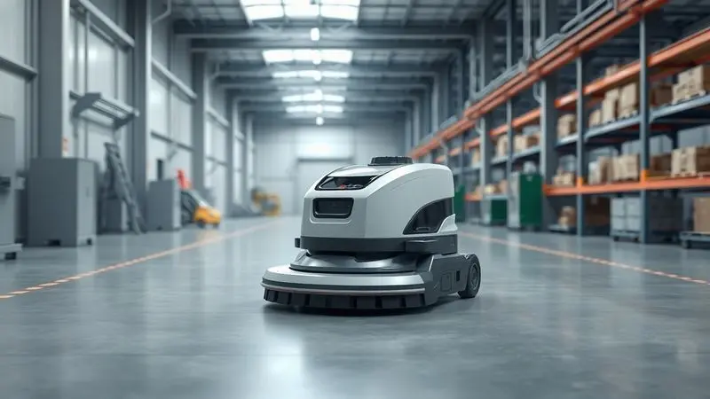
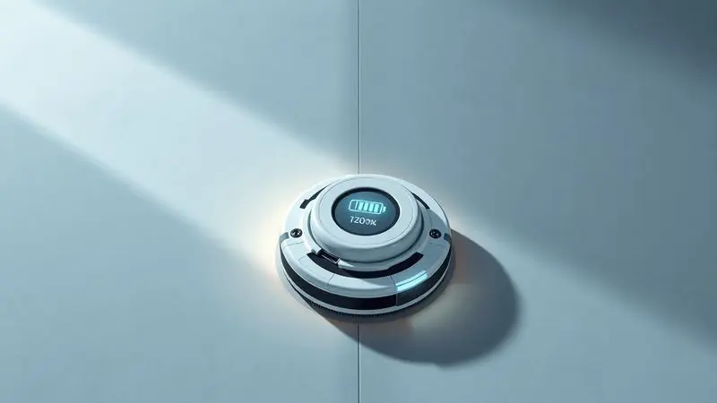
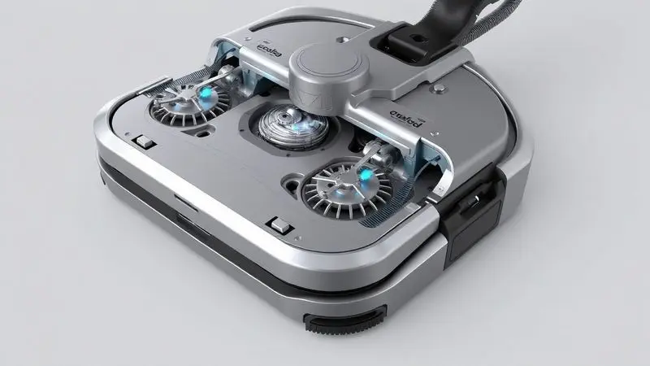
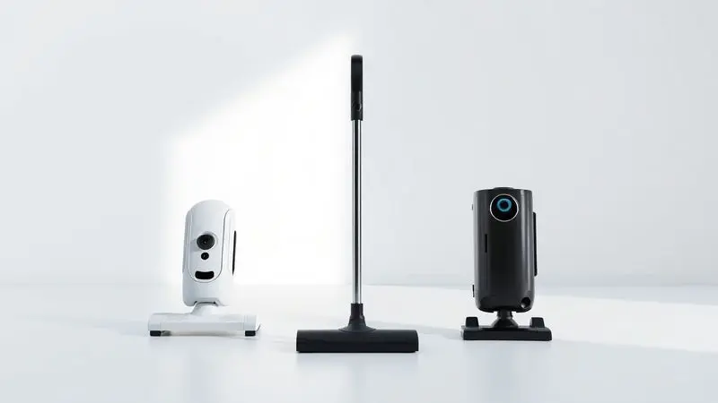

Imagine um robô que não apenas limpa sua casa, mas encara o desafio de manter galpões industriais impecáveis.

Esse é o Makita DRC200: uma solução robusta que entrega o dobro da potência graças às suas duas baterias de 18V, prometendo uma autonomia e capacidade de sucção que deixam os modelos domésticos para trás.

Mas como todo investimento profissional mais elevado, você merece saber se ele realmente entrega a eficiência que seu negócio precisa. Analisamos cada detalhe do design até o desempenho real para ajudá-lo nessa decisão.

<SummaryList products={frontmatter.top_products} />

## Design e especificações técnicas do Makita DRC200

<ProductBox 
  title={frontmatter.top_products[0].title} 
  image={frontmatter.top_products[0].image} 
  link={frontmatter.top_products[0].link} 
/>

O primeiro impacto vem com um design que fala a linguagem do trabalho pesado: acabamento em plástico reforçado nas cores ciano e preto que você já associa à durabilidade Makita.

Com 460 x 460 x 180 mm, ele mantém um perfil compacto o suficiente para navegar por corredores apertados, mas com os 7,8 kg de peso que garantem estabilidade em qualquer superfície.

O segredo da longevidade está nas duas baterias Li-ion de 18V, que oferecem de 120 a 230 minutos de autonomia, dependendo do seu escolha de energia.

Aqui, números técnicos se traduzem em benefícios práticos: o motor brushless mantém a potência constante enquanto economiza energia, e o tanque de pó de 2,5 litros significa menos interrupções para esvaziamento, cobrindo áreas entre 300 e 500 m² sem pausas.

Os sensores de detecção de obstáculos e antiqueda trabalham como um copiloto atento, enquanto os modos de limpeza variados dão flexibilidade para diferentes tipos de sujeira.

Apenas considere que os 64 dB(A) de ruído podem se fazer notar em ambientes que valorizam o silêncio.

<CaixaProsContras>

**Prós:**

- Design robusto e durável.

- Alta eficiência em áreas amplas.

- Diversos modos de operação para flexibilidade.

- Sensores avançados para evitar acidentes.

**Contras:**

- O nível de ruído pode ser um incômodo em ambientes silenciosos.

- Dependência das baterias para funcionamento contínuo.

</CaixaProsContras>

### Controles, botões e comandos do painel

Após perceber a robustez externa, você encontra uma interface que respeita seu tempo.

O painel de controle transforma operações complexas em gestos simples: botões claramente identificados para selecionar modos de limpeza específicos, ajustar a potência de sucção conforme a necessidade do momento e programar horários de operação para que o trabalho comece antes mesmo de você chegar.

Luzes indicadoras conversam com você, mostrando o status da bateria em tempo real e alertando sobre qualquer necessidade de manutenção.

E quando precisar de controle total à distância, o aplicativo móvel oferece configurações personalizadas e monitoramento remoto, dando flexibilidade para gerenciar a limpeza de qualquer lugar.

## Usabilidade e funcionamento no dia a dia

Como essa tecnologia se traduz na rotina de um ambiente de trabalho? A resposta vem na forma como o DRC200 entrega consistência. Desenvolvido para ambientes industriais, ele lida igualmente bem com pisos lisos de concreto e carpetes mais espessos sem perder eficiência.

A programação inteligente permite que ele assuma tarefas de forma completamente independente, liberando sua equipe para focar em atividades mais estratégicas.

Os sensores de navegação não apenas evitam colisões, mas mapeiam o espaço de forma eficiente, garantindo que cada centímetro quadrado receba a atenção necessária.

E quando chega a hora da manutenção, o design funcional facilita a limpeza do próprio robô, mantendo o ciclo de produtividade sem interrupções desnecessárias.

## Desempenho de limpeza e autonomia da bateria

É aqui que o investimento realmente se justifica. A potente capacidade de sucção do DRC200 enfrenta sujeira pesada e detritos que fariam outros robôs recuarem, transformando galpões e armazéns em espaços impecáveis.

Mas a verdadeira revolução está na autonomia: imagine limpar áreas extensas sem aquela parada no meio do trabalho que quebra todo o ritmo.

O sistema de navegação inteligente garante que cada movimento seja calculado para máxima cobertura, evitando redundâncias e otimizando cada minuto de operação.

Para quem busca eficiência em limpeza industrial, essa combinação de potência e independência representa uma mudança real na produtividade.

## Destaques e principais diferenciais do produto

O que realmente separa o DRC200 dos concorrentes? Não é apenas uma característica, mas uma filosofia de construção. A robustez não é um acidente, mas uma escolha deliberada para suportar condições que destruiriam equipamentos convencionais.

O motor não apenas tem potência, mas mantém essa potência constante mesmo após horas de uso contínuo. A autonomia da bateria vai além de números no papel, significando a liberdade de programar limpezas completas sem supervisão constante.

E os sensores avançados funcionam como um sistema nervoso que antecipa obstáculos, criando um ambiente mais seguro mesmo em locais com intensa movimentação.

É essa combinação entre tecnologia inteligente e durabilidade comprovada que transforma um equipamento em um parceiro de trabalho confiável.

## Comparação entre modelos e concorrentes diretos

Na hora de escolher, como o DRC200 se posiciona frente a alternativas como o iRobot Roomba ou Dyson 360 Eye? A diferença fundamental está na vocação.

Enquanto concorrentes domésticos oferecem tecnologias avançadas de navegação e filtros HEPA perfeitos para ambientes residenciais, o Makita foi construído com um DNA industrial. Pense assim: você está comprando um caminhão de trabalho, não um sedan de luxo.

A durabilidade frente a condições adversas, a potência para sujeira industrial e a autonomia para grandes áreas são prioridades que outros modelos simplesmente não endereçam com a mesma intensidade.

Sua escolha, então, depende menos de especificações técnicas isoladas e mais do ambiente que precisa ser transformado.

## Avaliação dos clientes e impressões reais de uso

O que dizem aqueles que já confiaram seu dia a dia ao DRC200? A palavra que mais se repete é "confiança". Usuários destacam como a potência se traduz em resultados visíveis, limpando profundamente áreas que antes exigiam esforço humano significativo.

A facilidade de uso e programação se torna um aliado na rotina, reduzindo a curva de aprendizado para equipes menos familiarizadas com tecnologia.

O ruído durante operação, mencionado por alguns, aparece como uma troca consciente: em ambientes industriais, a eficiência muitas vezes supera a necessidade de silêncio absoluto.

E quando falam de durabilidade, é quase unânime: esse robô foi feito para durar, tornando-se um investimento que se paga não apenas em limpeza, mas em anos de serviço confiável.

## Perguntas Frequentes (FAQ) sobre o DRC200

Algumas dúvidas persistem mesmo após tantas especificações. A mais comum: ele realmente lida com diferentes tipos de superfície? A resposta vem da combinação entre potência ajustável e sensores que adaptam o comportamento a cada piso.

Outra preocupação frequente é a durabilidade em ambientes desafiadores. A construção robusta e componentes industriais foram selecionados exatamente para essas condições.

Quanto à operação, mesmo quem nunca usou um robô aspirador encontra na interface intuitiva um guia natural para todas as funções. E a manutenção?

Projetada para ser prática, garantindo que o equipamento mantenha seu desempenho máximo sem exigir conhecimentos técnicos especializados.

## Conclusão

O Makita DRC200 representa mais que um equipamento de limpeza, ele é uma redefinição do que é possível em eficiência industrial.

Para ambientes que demandam robustez, autonomia e resultados consistentes, esse robô oferece uma solução que transforma horas de trabalho manual em processos automatizados e confiáveis.

O investimento inicial, ainda que significativo, se dilui ao longo do tempo através da economia de mão de obra, da redução de interrupções e da qualidade da limpeza entregue dia após dia.

Se seu negócio precisa de um parceiro que encare o desafio da limpeza industrial com a mesma seriedade que você encara seu trabalho, o DRC200 não é apenas uma opção a considerar, mas um padrão a ser seguido.

---

Ainda em dúvida sobre o ideal para o seu ambiente? Confira nosso [Ranking Completo dos Melhores Robôs Aspiradores de 2025](/melhores-robo-aspirador-2024/).
