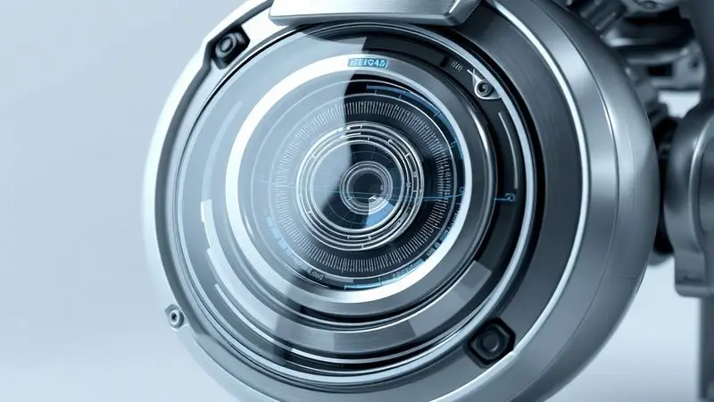
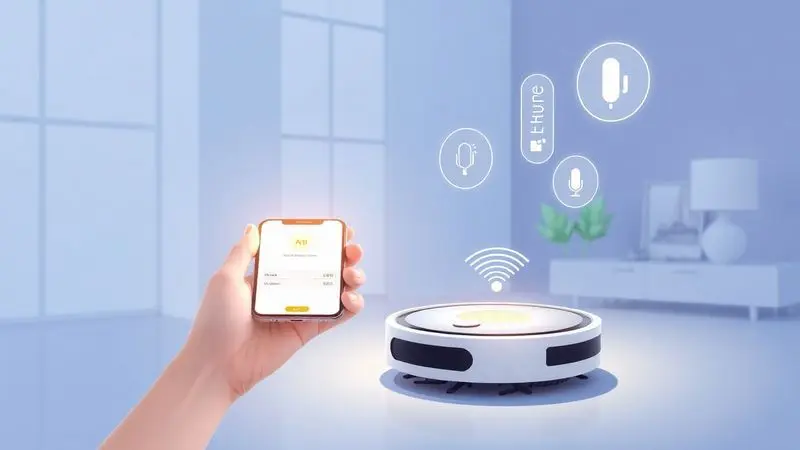

Imagine recuperar horas da sua semana, aquelas que você gasta se curvando com um aspirador ou arrastando um pano pelo chão. É essa promessa de liberdade que faz os robôs aspiradores serem tão tentadores.

No meio de tantas marcas, surge a dúvida: o robô aspirador Midea realmente entrega essa praticidade sem custar uma fortuna? Como uma gigante dos eletrodomésticos, a Midea traz sua experiência para a automação residencial, com modelos que vão do básico ao high-tech.

Este guia vai além das especificações técnicas; vamos dissecar o que cada modelo da Midea significa para a sua rotina, ajudando você a descobrir se um deles é o parceiro de limpeza que a sua casa está esperando.

<SummaryList products={frontmatter.top_products} />

## A marca Midea é boa?

Quando você pensa em confiança para um eletrodoméstico, procura por uma marca com história e presença. A Midea se encaixa nesse perfil.

Não é uma novata no mercado, mas uma fabricante consolidada globalmente, conhecida por levar tecnologia inteligente a preços mais acessíveis. O que isso significa na prática?

Que você não está comprando um gadget experimental, mas um produto com engenharia testada, suporte ao cliente estruturado e garantia que varia normalmente de 1 a 2 anos.

A proposta da Midea é clara: oferecer inovação, como mapeamento a laser e conectividade total, sem que você precise fazer um investimento exorbitante.

Para quem busca eficiência e durabilidade sem fugir do orçamento, ela se apresenta como uma opção notavelmente sólida e confiável.

## Conheça os principais modelos de robô aspirador de pó Midea

O portfólio da Midea é diverso, criado para atender desde quem quer uma ajudinha básica até quem deseja uma central de limpeza automatizada. Conhecer os modelos é entender qual deles fala a língua da sua casa e da sua rotina.

### Robô aspirador Midea Connectlaser M7

<ProductBox 
  title={frontmatter.top_products[0].title} 
  image={frontmatter.top_products[0].image} 
  link={frontmatter.top_products[0].link} 
/>

Este é o topo de linha para quem não abre mão de precisão. O Connectlaser M7 funciona com um sistema de navegação a laser (LDS) que age como o cérebro do robô.

Ele literalmente mapeia cada canto do seu ambiente na primeira limpeza, criando um plano de rota inteligente que evita zigue-zagues desnecessários e garante que nenhum centímetro quadrado fique de fora.

Combinado com uma sucção poderosa de 4000Pa, ele não só cobre toda a área de forma metódica como também remove sujeira incrustada.

A função 2-em-1 é outro destaque: além de aspirar, ele passa um pano úmido, com três níveis de umidade que você controla pelo app para evitar o excesso de água no piso.

É a automação completa: controle por aplicativo, agendamento, comando por voz (Alexa/Google) e a certeza de uma limpeza meticulosa.

<CaixaProsContras>

**Prós:**

- Navegação a laser que otimiza o percurso de limpeza.

- Alta potência de sucção (4000Pa).

- Função de passar pano com controle eletrônico de umidade.

- Controle remoto via aplicativo e compatibilidade com assistentes de voz.

**Contras:**

- Pode ser necessário realizar limpezas manuais periódicas.

- Tamanho do reservatório pode ser pequeno para áreas muito grandes.

</CaixaProsContras>

### Robô aspirador Midea SmartBrush 1200

<ProductBox 
  title={frontmatter.top_products[1].title} 
  image={frontmatter.top_products[1].image} 
  link={frontmatter.top_products[1].link} 
/>

Para lares com pets ou quem busca uma solução descomplicada e eficaz, o SmartBrush 1200 é um candidato forte.

Sua especialidade é lidar com pelos: o sistema de escovas foi pensado para capturá-los sem enrolar, enquanto o filtro HEPA retém 99,9% das partículas alergênicas, melhorando a qualidade do ar.

Com 100 minutos de autonomia, ele dá conta de apartamentos médios e retorna sozinho para a base quando a bateria está no fim. É silencioso (cerca de 65 dB) e compacto, alcançando fácilmente debaixo dos sofás e camas.

A principal troca aqui é a falta da função passa-pano, focando toda a sua energia em ser um excelente aspirador autônomo a um custo mais convidativo.

<CaixaProsContras>

**Prós:**

- Boa autonomia com retorno automático à base.

- Eficiente na remoção de pelos de animais.

- Filtro HEPA que melhora a qualidade do ar.

- Design compacto que alcança lugares difíceis.

**Contras:**

- Não possui função de passar pano.

- Capacidade do reservatório pode ser pequena para limpadores de grandes áreas.

</CaixaProsContras>

### Robô aspirador Midea SmartMop VRA31BB

<ProductBox 
  title={frontmatter.top_products[2].title} 
  image={frontmatter.top_products[2].image} 
  link={frontmatter.top_products[2].link} 
/>

Se a sua maior dor é ter que aspirar E passar pano, o SmartMop VRA31BB oferece a solução duas-em-uma em um pacote prático. Ele aspira com potência e, na mesma passada, um pano úmido acoplado dá aquele acabamento no piso.

A tecnologia Easy Climbing é um trunfo, permitindo que ele supere pequenos degraus e obstáculos de até 20mm, transicionando sem problemas entre tapetes e pisos frios. Assim como outros modelos, traz o filtro HEPA para um ar mais limpo.

A contrapartida é a simplicidade no controle: ele funciona via controle remoto físico, sem aplicativo ou integração com assistentes de voz. Para quem prefere uma automação mais direta, sem a complexidade dos apps, ele entrega muita praticidade.

<CaixaProsContras>

**Prós:**

- Função 2 em 1 (aspira e passa pano).

- Tecnologia Easy Climbing para superar obstáculos.

- Filtro HEPA eficaz para alérgicos.

- Boa autonomia de bateria (até 120 minutos).

**Contras:**

- Não possui controle por aplicativo ou assistentes virtuais.

- O reservatório pode encher rapidamente em locais com muitos pelos.

</CaixaProsContras>

### Robô aspirador Midea SmartMop VRB81B

<ProductBox 
  title={frontmatter.top_products[3].title} 
  image={frontmatter.top_products[3].image} 
  link={frontmatter.top_products[3].link} 
/>

Pense no VRB81B como um ajudante versátil para a limpeza de manutenção diária. Ele também executa as tarefas de aspirar e esfregar simultaneamente, com sensores que o protegem de quedas. Oferece modos de limpeza diferentes e a autonomia é adaptável.

Duas observações importantes dos usuários: a duração real da bateria pode variar em relação ao anunciado, e a navegação de retorno à base de carga às vezes pode exigir uma ajudinha manual.

Ainda assim, para quem prioriza a função dupla em um modelo de entrada, ele representa um bom ponto de partida no mundo da limpeza robótica.

<CaixaProsContras>

**Prós:**

- Função 2 em 1: varre e esfrega simultaneamente.

- Sensores de obstáculos que evitam quedas.

- Autonomia ajustável com retorno automático à base.

- Filtro HEPA que retém partículas alérgenas.

**Contras:**

- Duração da bateria pode ser inferior ao prometido.

- Controle exclusivo via controle remoto, sem aplicativo.

</CaixaProsContras>

### Robô aspirador Midea ConnectGyro i5C

<ProductBox 
  title={frontmatter.top_products[4].title} 
  image={frontmatter.top_products[4].image} 
  link={frontmatter.top_products[4].link} 
/>

Equilíbrio é a palavra para o ConnectGyro i5C. Ele une a navegação inteligente do sistema Gyro (que garante uma limpeza organizada e sem repetições) com a conveniência total do controle via app e comandos de voz.

Com 4000Pa de sucção e até 140 minutos de trabalho, ele tem fôlego para casas maiores. A função passa-pano com reservatório eletrônico é presente, mas tem uma limitação prática: não é recomendada para sujeiras muito úmidas ou grudadas.

Para a limpeza geral do dia a dia, onde o objetivo é remover poeira, pelos e dar um brilho leve ao piso, ele é extremamente competente e conectado.

<CaixaProsContras>

**Prós:**

- Navegação inteligente com sistema Gyro para cobertura eficiente.

- Controle via aplicativo e compatibilidade com assistentes de voz.

- Potência de sucção ajustável com até 4000Pa.

- Função passapano com reservatório eletrônico.

**Contras:**

- A função de passar pano pode não ser eficaz em sujeiras molhadas.

- Acúmulo de umidade no coletor de pó pode ser um ponto a considerar.

</CaixaProsContras>

## Design e especificações técnicas

A experiência com um robô aspirador começa antes mesmo de ele ligar. Os modelos Midea seguem um design limpo e funcional: baixos o suficiente para deslizar sob a maioria dos móveis, com bordas arredondadas para proteger seus móveis e paredes.

Tecnicamente, são equipados com sensores de obstáculos e anti-queda que funcionam de forma consistente. A potência de sucção costuma ser ajustável, permitindo que você escolha um modo silencioso para limpezas rápidas ou máximo para um sábado de faxina pesada.

As baterias de íon-lítio garantem autonomia suficiente para a maioria dos ambientes, e os compartimentos de pó e água são pensados para facilitar a remoção e a limpeza, nada de engenhocas complicadas para você desmontar toda semana.

## Usabilidade e funcionamento: como os robôs se comportam no dia a dia?

Na prática, a promessa se concretiza na simplicidade. Você programa um horário no aplicativo (ou usa o controle remoto) e deixa o robô trabalhar.

A navegação, seja por sensores giroscópios ou a laser, faz com que eles cubram o ambiente de forma lógica, evitando colisões brutais e quedas. Em pisos lisos, o desempenho é excelente.

Em tapetes de pelos médios, os modelos mais potentes seguram bem a onda, mas tapetes muito altos ou fios soltos ainda podem ser um desafio. A verdadeira usabilidade está na redução drástica da frequência com que você precisa do aspirador tradicional.

Eles são ótimos para a manutenção diária, mantendo a poeira e os pelos sob controle entre uma faxina mais profunda sua.

### Conectividade com Google Assistente e Alexa

E a praticidade pode ir além de programar horários. Nos modelos compatíveis, como o Connectlaser M7 e o ConnectGyro i5C, a integração com Alexa e Google Assistente transforma a limpeza em um comando de voz.

Imagine terminar de jantar e, sem levantar do sofá, dizer: "Alexa, pedir para o robô limpar a cozinha".

É essa camada extra de automação e conveniência que integra o robô à sua casa inteligente, tornando a tarefa de manter a limpeza algo quase mágico e completamente sem esforço.

## Comparativo entre modelos semelhantes da Midea

Com tantas opções, como escolher? Tudo se resume a prioridades. Busca o máximo de tecnologia e precisão para uma casa grande? O Connectlaser M7 com seu mapeamento a laser é sua escolha. Quer conectividade total (app e voz) e uma ótima relação custo-benefício?

O ConnectGyro i5C é um caminho excelente. Precisa focar em pelos de pet e tem um orçamento mais apertado? O SmartBrush 1200 resolve. Para a função 2-em-1 no modo simples e direto (sem app), o SmartMop VRA31BB atende bem.

Entender essa hierarquia de recursos e preços é a chave para não pagar por tecnologia que você não usará ou para não ficar frustrado por faltar um recurso essencial.

## Diferenciais frente à concorrência

O que faz um robô Midea se destacar em um mar de opções? A resposta está na combinação equilibrada que a marca oferece: tecnologia robusta a um preço acessível.

Enquanto algumas marcas cobram um grande ágio pela navegação a laser, a Midea a oferece em modelos de preço médio. Seus sistemas de navegação (giro e laser) são eficientes, o suporte pós-venda é uma realidade e a construção é sólida.

Ela não compete necessariamente com os ultra-premium em todos os aspectos, mas entrega, de forma consistente, mais do que o esperado para sua faixa de preço. Para o consumidor que quer automação séria sem o preço de um gadget de luxo, essa é uma vantagem decisiva.

## Garantia e pós-venda da marca Midea

Compra tranquila também é um diferencial. A Midea oferece garantia de fábrica que geralmente cobre de 1 a 2 anos para seus robôs aspiradores, dependendo do modelo e da região.

A marca possui uma rede de assistência técnica autorizada com boa cobertura, o que facilita muito caso você precise de suporte técnico ou de uma peça de reposição.

Relatos de consumidores geralmente apontam um atendimento ao cliente funcional e resolutivo, um detalhe importantíssimo quando se investe em um eletrônico com mais tecnologia. Você está comprando de uma empresa com estrutura, não de uma startup que pode sumir amanhã.

## O robô aspirador Midea vale a pena?

A resposta é um convincente "depende", mas no melhor sentido.

Se o seu perfil é de alguém que busca uma automação real para a limpeza de manutenção, deseja tecnologia como mapeamento e app sem gastar uma pequena fortuna, e valoriza a segurança de uma marca consolidada, então sim, um robô aspirador Midea vale muito a pena.

Modelos como o ConnectGyro i5C e o Connectlaser M7 rivalizam com opções mais caras de outras marcas.

No entanto, se a sua casa tem predominantemente tapetes altíssimos ou você espera que o robô substitua completamente uma faxina manual pesada semanal, talvez suas expectativas precisem ser ajustadas.

Eles são auxiliares incríveis, não substitutos mágicos para toda e qualquer situação.

## Perguntas Frequentes (FAQ)

Ele funciona bem em todos os pisos?
Sim, em pisos lisos (cerâmica, madeira, laminado) o desempenho é excelente. Em tapetes de pelo baixo e médio, os modelos com maior sucção (4000Pa) se saem bem. Tapetes muito felpudos podem dificultar a locomoção e a limpeza profunda.

Quanto tempo a bateria dura realmente?
A autonomia varia conforme o modelo e o modo de limpeza usado. Em modo padrão, espere algo entre 60 minutos (modelos mais básicos) e 160 minutos (como o M7) em uma carga. Em pisos muito sujos ou no modo turbo, esse tempo diminui.

A manutenção é complicada? Não. A rotina básica é simples: esvaziar o reservatório de pó a cada 2-3 limpezas (ou conforme a necessidade), limpar as escovas eventuais pelos enrolados e, nos modelos com passa-pano, lavar o pano.

Os filtros HEPA são laváveis na maioria dos modelos.

Preciso ficar em casa supervisionando?
Não é necessário. A grande vantagem é programar para ele limpar enquanto você está fora ou dormindo. Os sensores anti-queda e de obstáculos garantem a segurança dele pela casa.

## Conclusão

Escolher um robô aspirador é, no fundo, investir em tempo e tranquilidade. A Midea se posiciona de forma inteligente nesse mercado, oferecendo uma porta de entrada segura e tecnológica para a automação doméstica.

Seja com a navegação cirúrgica a laser do M7, o equilíbrio perfeito do ConnectGyro i5C ou a eficiência descomplicada do SmartBrush 1200, há um modelo que conversa com sua realidade e seu orçamento.

Eles cumprem com mérito a promessa de reduzir drasticamente a frequência das suas faxinas manuais, dando a você aquelas horas preciosas de volta. Antes de decidir, reflita: qual é a sua maior dor na limpeza? São os pelos do pet? A poeira diária?

Ou a preguiça de ter que aspirar E passar pano?

A resposta vai apontar diretamente para o modelo Midea que não apenas vale a pena, mas que tem o potencial de se tornar um aliado silencioso e eficiente na sua rotina, trabalhando nos bastidores para que você possa simplesmente aproveitar o seu lar.

---

Ainda na dúvida sobre o melhor robô aspirador para sua casa? Confira nosso [Ranking Completo dos Melhores Robôs Aspiradores de 2025](/melhores-robo-aspirador-2024/).
