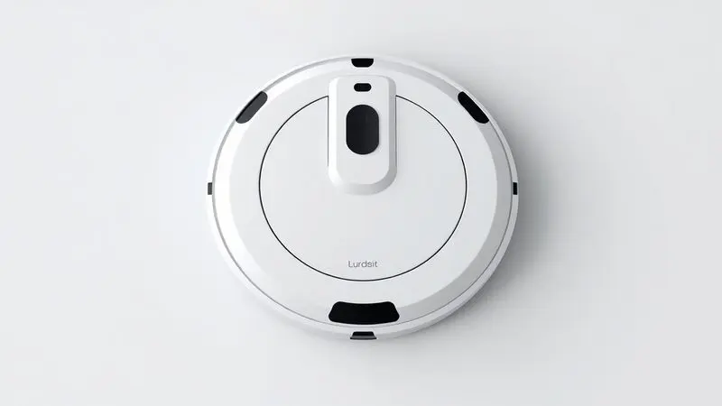
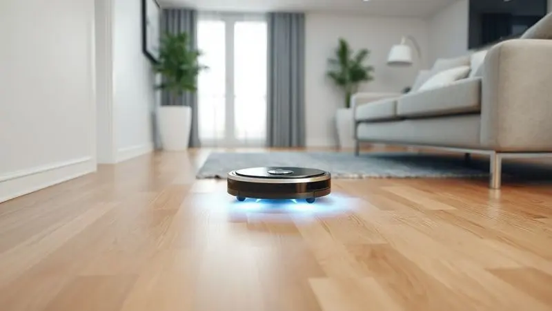
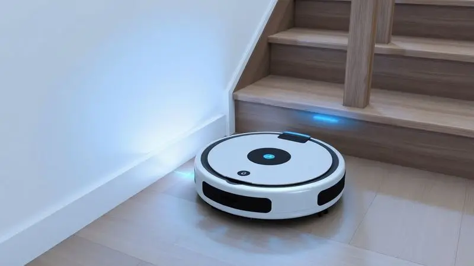

Imagine chegar em casa após um dia cansativo e encontrar seus cômodos já limpos, sem você ter levantado um dedo. Essa é a promessa que o robô aspirador Midea Smart traz para o mercado brasileiro: eficiência, autonomia e um preço que não assusta.

Seja na versão VRA81B ou na SmartMop VRB81B, a questão que fica é: ele realmente entrega o que promete e compensa o investimento?

Com diferenciais como filtro hospitalar, múltiplos modos de limpeza e controle remoto, esses aparelhos buscam transformar uma tarefa chata em algo que simplesmente acontece no piloto automático.

Vamos explorar cada detalhe técnico, funcional e, principalmente, o desempenho real para descobrir se o Midea é o parceiro de limpeza ideal para seu lar.

<SummaryList products={frontmatter.top_products} />

## Ficha Técnica e Especificações do Robô Aspirador Midea Smart

<ProductBox 
  title={frontmatter.top_products[0].title} 
  image={frontmatter.top_products[0].image} 
  link={frontmatter.top_products[0].link} 
/>

Por fora, parece um disco voador. Por dentro, há tecnologia suficiente para revolucionar sua rotina.

O Midea Smart VRA81B foi pensado para quem quer unir aspiração e passagem de pano em um único movimento, oferecendo cinco modos distintos: você pode escolher entre varrer, esfregar, aspirar, passar pano ou fazer tudo ao mesmo tempo.

Seus sensores de obstáculos funcionam como olhos eletrônicos, garantindo que ele faça um percurso eficiente sem bater nos móveis ou, pior, despencar de uma escada.

A autonomia vem de uma bateria recarregável de 1500mAh inteligente o suficiente para, quando a energia acaba, ele voltar sozinho para a base.

Funciona em qualquer tomada brasileira (bivolt) e carrega um segredo poderoso: um filtro HEPA capaz de reter 99,9% das partículas alergênicas. Isso significa que enquanto limpa o chão, ele também purifica o ar que você respira.

Com um reservatório de 300ml e medidas compactas (30 cm de diâmetro por 7,8 cm de altura), ele desliza sob sofás e camas sem dificuldade, provando que eficiência não precisa ocupar meio armário.

<CaixaProsContras>

**Prós:**

- Trabalho autônomo com várias funções de limpeza.

- Sensor de obstáculos para evitar quedas.

- Bateria recarregável com sistema de auto recarga.

- Filtro HEPA que melhora a qualidade do ar.

**Contras:**

- O reservatório de 300ml pode exigir esvaziamento frequente em áreas maiores.

- A potência de 18W pode não ser suficiente para sujeiras muito pesadas.

</CaixaProsContras>

## Design e Construção

Mais do que bonito, ele é funcional. O design circular não é apenas estético, maximiza a coleta de sujeira em cantos que modelos quadrados deixariam para trás.

Suas dimensões compactas são uma vantagem estratégica, permitindo que ele acesse aqueles espaços embaixo do sofá onde a poeira adora se esconder.

A construção em materiais duráveis transmite a sensação de um produto que foi feito para durar, não apenas para impressionar na primeira semana.

E aqueles sensores que mencionamos não ficam só por dentro, a navegação inteligente é parte integral de como ele foi concebido, evitando obstáculos com uma elegância que faz parecer que ele realmente pensa por onde vai.

## Funcionalidades e Modos de Limpeza

Aqui está onde a mágica acontece. O modo automático é como colocar o robô no piloto automático: ele ajusta a potência e o trajeto conforme detecta a sujeira no ambiente.

Já o modo spot é perfeito para quando o café derrama na cozinha ou o pet deixa seus pelos concentrados em um cantinho.

A tecnologia de mapeamento faz com que ele lembre do layout da sua casa, planejando rotas eficientes que garantem que nenhum centímetro quadrado fique esquecido. E o melhor: você pode controlar tudo pelo aplicativo.

Quer que ele limpe às 14h toda terça e quinta enquanto você está no trabalho? Basta programar. Essa personalização transforma o robô de um eletrodoméstico em um assistente pessoal da limpeza.

## Desempenho na Limpeza Diária

Na prática, como ele se sai? Muito bem, especialmente para a sujeira do dia a dia. A potência de sucção é suficiente para capturar poeira, migalhas e, um ponto crucial, pelos de animais.

Se você tem pets, sabe como eles são especialistas em espalhar pelos por todos os cantos. O Midea lida com isso de forma competente, mantendo os ambientes visivelmente mais limpos.

A programação é seu maior aliado, imagine acordar com a sala já aspirada ou chegar do trabalho com os quartos limpos. Ele otimiza sua rotina de uma forma que você nem percebe o esforço, porque não há esforço algum.

## Limpeza e Manutenção do Aparelho

Toda essa facilidade tem um pequeno preço: a manutenção periódica. Mas calma, é mais simples do que parece. O compartimento de poeira precisa ser esvaziado regularmente, idealmente após cada uso para manter o desempenho no pico.

As escovas e, especialmente, o filtro HEPA, merecem uma limpeza frequente, principalmente se você tem animais em casa. O manual do usuário explica cada passo de forma clara, tornando o processo rápido e sem mistérios.

Manter o robô limpo é como cuidar de um parceiro de trabalho, garantindo que ele continue funcionando com a mesma eficiência por muito tempo.

## Segurança e Sensores Anti-Queda

E se você tem uma casa com escada ou diferentes níveis? Aí é que os sensores anti-queda brilham. Eles funcionam como um sistema de proteção que detecta bordas e desníveis, impedindo que o robô tenha a péssima ideia de dar um mergulho.

Isso significa que você pode programá-lo para limpar sem supervisão e sair de casa tranquilo, sabendo que não vai voltar para encontrar um acidente.

Essa segurança não é apenas sobre proteger o aparelho, é sobre dar a você a paz de espírito para aproveitar a automação sem preocupações.

## Pós Venda e Suporte da Marca

Investir em tecnologia traz uma pergunta natural: e se der problema? A Midea oferece um suporte ao cliente que pode ser decisivo na sua experiência. A assistência técnica é acessível e o atendimento inclui desde a instalação até dúvidas de manutenção.

Canais online como chat e e-mail facilitam a resolução rápida de questões, e os relatos de usuários geralmente apontam para uma experiência positiva.

Num mercado onde produtos eletrônicos podem gerar ansiedade, saber que há suporte sólido por trás é como ter um seguro de tranquilidade.

## Modelos Similares no Mercado

Claro, o Midea não está sozinho nesse universo. Se você busca uma sucção ainda mais potente e um mapeamento ultra avançado, o Roborock S7 pode chamar sua atenção. O Ecovacs Deebot T8 brilha na função de esfregação e tem um aplicativo particularmente intuitivo.

Já o iRobot Roomba i7 é famoso pela eficiência pura e pela possibilidade de personalizar rotas de limpeza com precisão cirúrgica. Cada um desses modelos traz características únicas que podem se alinhar melhor a necessidades ou orçamentos específicos.

Conhecer as alternativas ajuda a ter certeza de que sua escolha é a mais acertada para seu estilo de vida.

## Conclusão

Então, o robô aspirador Midea Smart VRA81B vale a pena? Se você busca um equilíbrio inteligente entre tecnologia acessível e resultados concretos, a resposta é um sim convincente.

Ele não é o mais potente do mercado, mas entrega exatamente o que promete: transformar a limpeza da casa de uma tarefa entediante em um processo automatizado e confiável.

O mapeamento inteligente, o controle pelo aplicativo e a segurança dos sensores anti-queda criam uma experiência que realmente facilita o dia a dia. Para apartamentos, casas de um só andar ou ambientes com pouca sujeira pesada, ele se torna um aliado eficiente.

Se sua necessidade vai além disso, os modelos similares oferecem opções especializadas.

Mas para quem quer começar no mundo da automação doméstica sem gastar uma fortuna, o Midea prova que é possível ter tecnologia inteligente funcionando a seu favor, todos os dias, com um simples toque no celular.

---

Ainda na dúvida sobre o robô aspirador ideal para sua casa? Confira nosso [ranking completo dos melhores robôs aspiradores de 2025](/melhores-robo-aspirador-2024/).
