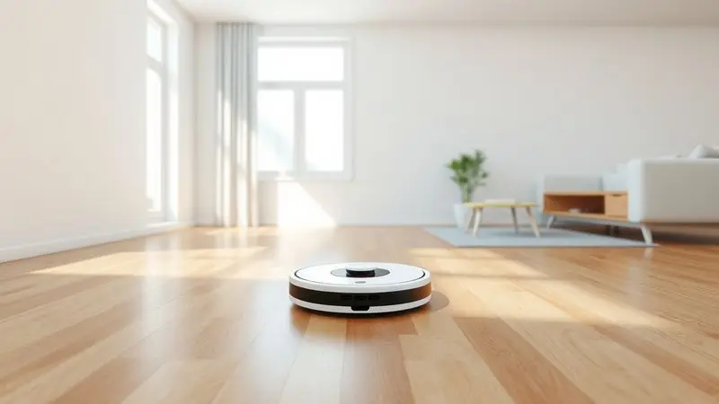
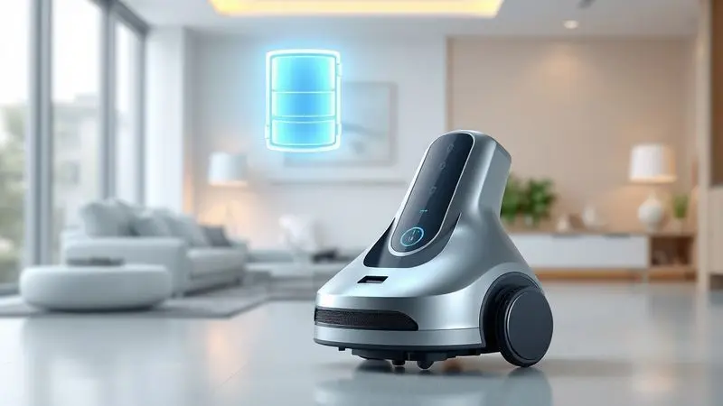
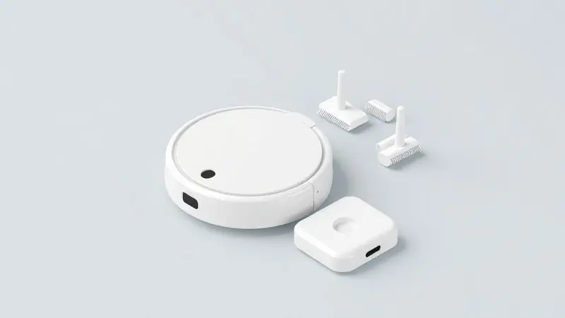
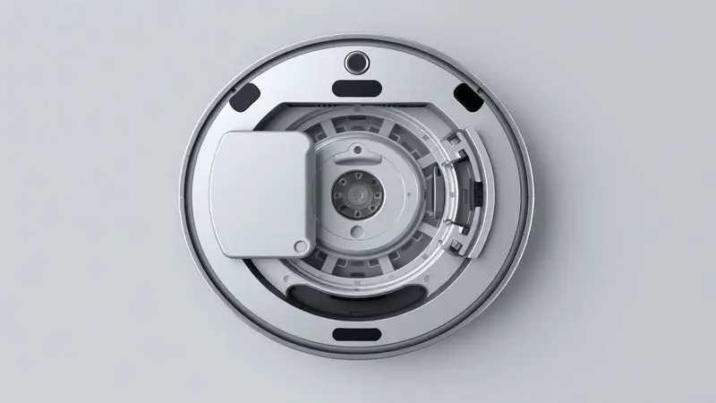

Aquele momento em que você olha para o chão e pensa 'já limpei isso ontem'. O pó que insiste em aparecer, os pelos do pet que se espalham como confetes invisíveis, a migalha do café da manhã que escapou do prato.

É quando a ideia de um robô aspirador começa a fazer sentido. Mas com tantas opções tecnológicas e caras no mercado, será que um modelo básico como o Mondial Fast Clean Plus realmente alivia sua rotina ou só cria outro eletrodoméstico para você cuidar?

Decodificamos cada detalhe dessa promessa de limpeza automática para descobrir se ele é o aliado que sua casa precisa ou apenas mais um enfeite inteligente.

<SummaryList products={frontmatter.top_products} />

## Design e construção do Mondial Fast Clean Plus

<ProductBox 
  title={frontmatter.top_products[0].title} 
  image={frontmatter.top_products[0].image} 
  link={frontmatter.top_products[0].link} 
/>

Segure na sua mão a ideia de um disco voador doméstico.

O Mondial Fast Clean Plus RB-03 tem exatamente essa sensação: um design circular e ultrafino, com apenas 7,6 cm de altura, que parece deslizar magicamente sob sua cama, sofá ou aquele móvel baixo que nunca consegue limpar direito.

Imagine ele alcançando até aquele brinco perdido que você jurou que tinha sumido para sempre.

Sua construção em plástico leve é revestida por uma proteção de borracha na frente, um cuidado simples contra arranhões nos móveis, mas que mostra que a Mondial pensou na convivência pacífica entre robô e decoração.

As escovas laterais se estendem como braços delicados, varrendo a poeira de cantos que seu aspirador tradicional nem enxerga. E aqui está um detalhe que faz diferença no ar que você respira: o filtro HEPA lavável retém 99,5% de ácaros e bactérias.

Pense nisso como respirar um ar que parece ter acabado de passar por uma floresta, mesmo enquanto ele trabalha.

Essa combinação de varre, aspiração e opção de passar pano leve (com o acessório de pano úmido) cria o que chamamos de 'limpeza de manutenção', aquela que mantém seu chão apresentável entre faxinas pesadas.

Contudo, essa simplicidade tem seu preço: sem sensores anti-colisão sofisticados, ele pode dar pequenos toques em móveis como uma criança aprendendo a andar. E seu reservatório de poeira pede atenção frequente, especialmente se você tem pets ou crianças pequenas.

<CaixaProsContras>

**Prós:**

- Design super slim que permite acesso a áreas difíceis.

- Equipada com filtro HEPA, contribuindo para um ar mais limpo.

- Função 3 em 1: varre, aspira e passa pano simultaneamente.

- Escovas laterais para limpeza eficaz em cantos.

**Contras:**

- Falta de sensores anti-colisão avançados pode resultar em pequenos impactos.

- Capacidade do reservário de poeira é limitada.

</CaixaProsContras>

## Experiência de uso e funcionamento no dia a dia

Coloque o Mondial Fast Clean Plus no chão, aperte o botão e observe. Ele começa a vagar pela sala com uma determinada aleatoriedade, como um inseto persistente.

Não espere mapeamento inteligente ou rotas otimizadas, essa é a beleza da simplicidade: ele cobre o terreno através de tentativa e erro, ricocheteando suavemente em obstáculos até que, estatisticamente, tenha passado pela maioria dos lugares.

Para tarefas diárias, ele é suficiente. Os grãos de areia da praia que seus filhos trouxeram, os fiapos do carpete, a poeira que se acumula embaixo da mesa, tudo isso desaparece com sua passagem metódica.

Mas entenda seu limite: manchas mais persistentes ou sujeiras muito embutidas exigirão seu aspirador tradicional. Ele é o jardineiro que mantém o gramado aparado, não o pedreiro que refaz o muro.

### Nível de ruído durante a operação

Essa simplicidade de operação traz uma preocupação comum: vai perturbar meu silêncio? O Mondial Fast Clean Plus opera entre 55 e 70 decibéis, o equivalente ao som de uma conversa animada na mesa ao lado no restaurante.

Você consegue assistir TV ou fazer uma chamada de vídeo sem precisar aumentar muito o volume, mas perceberá sua presença. É um zumbido constante, não um rugido.

Para quem trabalha em casa, programá-lo para limpar enquanto está em reuniões pode não ser ideal, mas para os momentos em que você está fora ou em outro cômodo, ele se torna quase invisível.

### Consumo de energia e eficiência energética

E quanto à conta de luz? Aqui ele brilha discretamente. Consumindo menos que uma lâmpada LED potente, o Mondial Fast Clean Plus opera com uma eficiência que quase o coloca na categoria de 'gasto imperceptível'.

Sua programação via controle remoto permite que você o coloque para trabalhar durante a madrugada, aproveitando tarifas mais baixas se sua concessionária oferecer esse benefício. É como ter um funcionário noturno que custa menos que um cafezinho por dia.

## Cobertura de limpeza e autonomia da bateria

Quanto chão ele realmente limpa antes de pedir ajuda? O Mondial Fast Clean Plus navega por áreas abertas e desobstruídas com certa eficácia, mas em ambientes com muitos móveis ou divisórias, seu padrão aleatório pode deixar alguns pontos sem atenção.

É como jogar dardos: com tempo suficiente, ele acerta a maior parte do alvo.

Sua bateria dura o suficiente para cobrir um apartamento médio antes de retornar automaticamente à base, quando ela está incluída. O tempo exato varia com a quantidade de sujeira e tipo de piso, mas pense em algo entre 90 e 120 minutos de trabalho contínuo.

Para casas maiores, pode ser necessário dividir a limpeza por cômodos ou aceitar que ele não terminará tudo de uma vez. Não é o maratonista dos robôs aspiradores, mas cumpre bem uma corrida de 5km doméstica.

## Recursos, acessórios e uso do controle remoto

O controle remoto que acompanha o Mondial Fast Clean Plus é sua central de comando. Com ele, você programa horários específicos (todos os dias às 10h, por exemplo), escolhe modos de limpeza (padrão, bordas, pontual) e direciona manualmente o robô para áreas específicas.

É a diferença entre ter um animal de estimação que faz o que quer e um que obedece comandos básicos.

Os acessórios incluídos são minimalistas, mas funcionais: escovas laterais extras, o pano úmido para limpeza leve e um pequeno kit de limpeza para manutenção do próprio robô.

Não espere escovas especializadas para tapetes de pelos longos ou acessórios de limpeza profunda, ele mantém a filosofia do 'feito é melhor que perfeito'.

## Aplicativo e conectividade: o que o modelo oferece?

Aqui está uma surpresa positiva: o Mondial Fast Clean Plus oferece conectividade Wi-Fi e um aplicativo próprio. Embora não tenha a sofisticação dos apps de marcas como Xiaomi, ele cumpre o básico com dignidade.

Você consegue programar limpezas, ver o status da bateria, controlar o robô remotamente e receber notificações quando algo dá errado (como ele ficar preso atrás do vaso).

A interface é intuitiva o suficiente para que seus pais ou avós consigam usar sem ajuda.

É menos um aplicativo de controle total e mais um botão de liga/desliga remoto com esteroides, exatamente o que a maioria das pessoas realmente precisa, sem a complexidade de mapas interativos e zonas de exclusão virtuais.

## Manutenção, limpeza e cuidados com o aparelho

Cuidar do Mondial Fast Clean Plus é mais fácil que regar uma planta resistente. Após cada uso (ou a cada dois, se sua casa for pouco movimentada), basta abrir o compartimento, esvaziar o pó no lixo, dar uma batidinha no filtro HEPA e colocar de volta.

O filtro é lavável, então a cada quinze dias você pode deixá-lo de molho em água morna.

As escovas rotativas exigem atenção especial se você tem cabelos longos ou pets: fios tendem a se enrolar nos eixos. Uma tesoura sem ponta e dois minutos de paciência resolvem o problema. Os sensores na parte inferior precisam de uma passada de pano seco ocasionalmente.

E a bateria? Deixe-o na base carregadora quando não estiver em uso, ela agradecerá com mais anos de serviço.

## Preço e disponibilidade no varejo online

O Mondial Fast Clean Plus flutua entre R$ 600 e R$ 900 nas principais lojas online, dependendo de promoções e estoques.

Ele é frequentemente encontrado na Amazon, Magazine Luiza, Mercado Livre e Casas Bahia, especialmente durante datas comerciais como Black Friday e Natal.

Sua popularidade como 'robô aspirador de entrada' significa que esgota rápido quando há uma boa oferta. A dica é colocar alertas de preço nos sites de comparação e acompanhar as redes sociais das lojas.

Vale notar que muitas vezes o preço com frete incluso em uma loja pode ser melhor que o preço aparentemente menor em outra com frete caro.

## Principal concorrente direto do Fast Clean Plus

Quando você pesquisa robôs aspiradores acessíveis, um nome inevitavelmente aparece: o Xiaomi Mi Robot Vacuum (ou modelos similares da linha). Essa é a comparação mais justa e reveladora.

O Xiaomi geralmente custa entre 30% a 50% a mais, mas traz mapeamento a laser, rotas sistemáticas, maior potência de sucção e um aplicativo muito mais refinado.

A escolha aqui é filosófica. O Mondial Fast Clean Plus é como um carro manual básico: faz o que promete, sem firulas, custa menos e você entende exatamente como funciona.

O Xiaomi é o carro automático com GPS: mais conforto, mais tecnologia, mas também mais complexidade e preço. Se você valoriza simplicidade acima de otimização, o Mondial se sai bem.

Se quer a tecnologia mais recente e não se importa em pagar por ela, o concorrente chinês é o caminho.

## Conclusão

O Mondial Fast Clean Plus existe naquele espaço confortável entre 'fazer tudo sozinho' e 'contratar um serviço profissional'. Ele não vai transformar sua casa em um showroom impecável, mas vai mantê-la consistentemente mais limpa com quase zero esforço da sua parte.

É o equivalente doméstico de escovar os dentes todos os dias: preventivo, rotineiro, e que evita problemas maiores no futuro.

Para quem tem apartamentos ou casas pequenas a médias, poucos móveis baixos, e busca uma solução para aquela poeira diária que insiste em voltar, ele é uma compra que se paga em tempo e sanidade mental economizados.

Para quem tem animais que soltam muitos pelos, casas muito grandes ou quer uma limpeza profunda automatizada, ele pode parecer insuficiente.

A verdadeira pergunta é: quanto vale para você não precisar passar o aspirador manualmente três vezes por semana? Se essa tarefa pesa na sua rotina, o Mondial Fast Clean Plus oferece uma saída acessível e funcional.

Não é revolução tecnológica, é praticidade com preço consciente, e às vezes, isso é exatamente o que precisamos.

---

Ainda em dúvida sobre o Mondial Fast Clean Plus? Confira nosso ranking dos [melhores robô aspirador até R$ 1.000](/melhor-robo-aspirador-ate-1000-reais/) para encontrar a opção ideal para sua casa.
