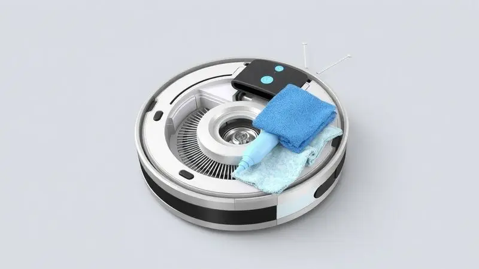
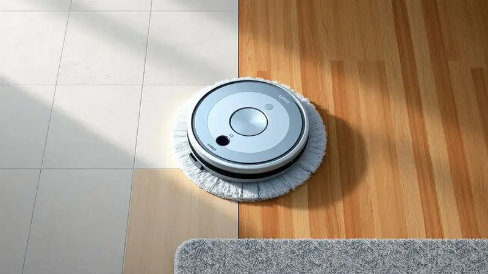
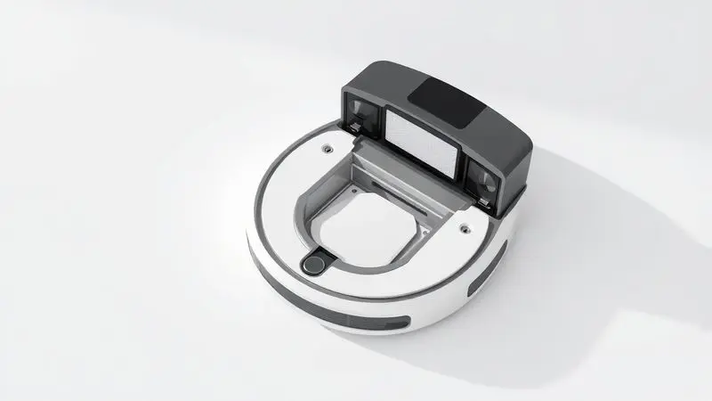

Ter a casa limpa sem esforço é o sonho de muitos, e o robô aspirador Mondial Pratic Clean RB-11 surge como uma das opções mais acessíveis do mercado brasileiro.

Mas será que um modelo de entrada realmente consegue dar conta do recado ou acaba trazendo mais dor de cabeça do que praticidade?

Nesta análise completa, mergulhamos nos detalhes técnicos, exploramos as funções de limpeza e avaliamos o desempenho real desse dispositivo para responder se o Mondial RB-11 é bom e se vale o investimento para a sua rotina doméstica.

<SummaryList products={frontmatter.top_products} />

## O que é o Robô Aspirador Mondial Pratic Clean RB-11?

<ProductBox 
  title={frontmatter.top_products[0].title} 
  image={frontmatter.top_products[0].image} 
  link={frontmatter.top_products[0].link} 
/>

Imagine chegar em casa e encontrar os pisos já limpos, sem que você tenha levantado um dedo. Essa é a promessa que o Mondial Pratic Clean RB-11 traz para o seu dia a dia.

Com apenas 7,5cm de altura, ele desliza tranquilamente sob seu sofá favorito, alcançando aqueles cantos esquecidos que seu aspirador tradicional nunca alcançaria. Mais do que apenas aspirar, ele também passa pano, oferecendo uma limpeza completa em uma única passada.

Os sensores inteligentes garantem que ele navegue pela sua casa sem bater nos móveis ou cair de degraus, trabalhando de forma tão silenciosa que você quase esquece que está lá.

Com autonomia de cerca de 90 minutos, ele tem tempo suficiente para limpar seu apartamento inteiro enquanto você toma café e checa o e-mail.

É verdade que ele não é um super-herroe da limpeza. Quando encontra sujeiras mais pesadas ou detritos grandes, pode precisar de uma pequena ajuda sua.

Mas para a poeira do dia a dia, pelos de animais e aquela sujeirinha que se acumula nos cantos, ele se sai surpreendentemente bem.

<CaixaProsContras>

**Prós:**

- Design compacto que alcança áreas difíceis.

- Função MOP para uma limpeza mais completa.

- Boa eficiência na remoção de pelos de animais.

- Operação silenciosa.

**Contras:**

- Limitações com sujeiras pesadas ou detritos grandes.

- Ausência de conectividade Wi-Fi para controle remoto.

</CaixaProsContras>

## Ficha Técnica e Especificações Principais

Por dentro dessa máquina compacta, há tecnologia pensada para funcionar quase sem intervenção. A navegação inteligente permite que ele mapeie o ambiente enquanto limpa, evitando passar duas vezes pelo mesmo lugar sem necessidade.

Com potência de 30W, o sistema de sucção é eficiente tanto em pisos duros quanto em carpetes leves.

Uma das características mais valiosas é o filtro HEPA, que retém até 99,5% dos alérgenos, fazendo dele um aliado para quem sofre com alergias ou quer simplesmente respirar um ar mais puro em casa.

A bateria de íon-lítio oferece cerca de 80 minutos de uso contínuo, e quando precisa recarregar, ele encontra sozinho o caminho de volta para a base.

## Unboxing e Detalhes do Robô Aspirador

Abrir a caixa do RB-11 é uma experiência direta ao ponto. Você encontra o robô pronto para uso, acompanhado de seu carregador e um manual de instruções claro. A simplicidade é proposital: em poucos minutos, ele está configurado e começa a trabalhar.

### Acessórios e Itens Inclusos

Além do robô em si, você recebe tudo o que precisa para manter a limpeza funcionando sem complicações. O suporte de carregador mantém o dispositivo sempre pronto para a próxima tarefa.

Os filtros são laváveis, o que significa economia a longo prazo, e as escovas extras garantem que mesmo os cantos mais difíceis recebam atenção adequada.

### Funções e Modos de Limpeza (Varrer, Aspirar e Passar Pano)

Essa versatilidade é onde o RB-11 realmente brilha. No modo varrer, ele captura detritos maiores que ficaram pelo chão. Quando muda para aspirar, foca em partículas menores como poeira e pelos de animais que se escondem nos carpetes. E a função MOP?

Ela dá aquele toque final que deixa os pisos frios não apenas limpos, mas com aspecto de recém-lavados.

A transição entre essas funções é automática, adaptando-se ao tipo de piso que encontra no caminho. Para você, significa acordar com o chão já brilhando, sem ter que se ajoelhar com balde e pano nas mãos.

## Teste e Experiência Real de Uso

Colocamos o RB-11 para trabalhar em condições reais, e os resultados mostram exatamente para quem ele foi feito. Em apartamentos e casas menores, ele é um parceiro quase perfeito, mantendo a limpeza básica sem exigir sua atenção constante.

### Resultados de Desempenho em Diferentes Pisos

Em cerâmica, laminado e outros pisos duros, o RB-11 tem desempenho excelente. Os sensores detectam a mudança de superfície e ajustam automaticamente a potência para otimizar a limpeza.

Em carpetes de pelo baixo, ele ainda se sai bem, embora em carpetes mais altos ou fofos possa perder um pouco da eficiência.

O que mais impressiona é como ele lida com transições entre diferentes tipos de piso. De uma área de cerâmica para um tapete fino, a adaptação é quase imperceptível, mantendo um fluxo de trabalho contínuo que deixa todas as áreas igualmente limpas.

## Comparação entre Modelos Semelhantes e Concorrentes

Enquanto o RB-11 faz seu trabalho bem, como ele se compara a outros modelos disponíveis?

O mercado oferece opções como o Xiaomi Roborock e iRobot Roomba, que trazem tecnologia mais avançada de navegação e funcionalidades extras, mas também vêm com preços significativamente mais altos e maior complexidade de uso.

### Mondial Fast Clean Advanced RB-04

<ProductBox 
  title={frontmatter.top_products[1].title} 
  image={frontmatter.top_products[1].image} 
  link={frontmatter.top_products[1].link} 
/>

Se você busca mais controle sobre a limpeza, o RB-04 da mesma marca oferece um diferencial importante: controle remoto. Com ele, você seleciona entre três modos de limpeza sem precisar se levantar do sofá.

O retorno automático à base garante que a bateria nunca falhe no meio do serviço.

O filtro HEPA lavável mantém a qualidade do ar, embora alguns usuários notem que a função de passar pano pode ser menos eficaz devido à espessura limitada do pano utilizado. Ainda assim, para quem prioriza comodidade acima de tudo, é uma evolução interessante.

<CaixaProsContras>

**Prós:**

- Possui funções de varre, aspira e passa pano.

- Controle remoto com modos de limpeza variados.

- Design super slim para acesso fácil embaixo dos móveis.

- Filtro HEPA lavável que melhora a qualidade do ar.

**Contras:**

- A funcionalidade de passar pano pode ser limitada.

- A manutenção do filtro HEPA requer atenção frequente.

</CaixaProsContras>

### Robô Aspirador de Pó WAP W100

<ProductBox 
  title={frontmatter.top_products[2].title} 
  image={frontmatter.top_products[2].image} 
  link={frontmatter.top_products[2].link} 
/>

Com impressionante autonomia de 1 hora e 40 minutos, o WAP W100 leva a limpeza para outro patamar de duração. Seus três modos específicos (cantos, aleatória e espiral) permitem que ele se adapte estrategicamente a diferentes layouts de ambiente.

Os sensores anticolisão e antiqueda funcionam de forma exemplar, oferecendo paz de mente enquanto ele trabalha sozinho. O reservatório coletor removível e lavável facilita a manutenção, embora em áreas muito grandes possa precisar de esvaziamento mais frequente.

<CaixaProsContras>

**Prós:**

- Função 3 em 1: aspira, varre e passa pano.

- Baixa altura que permite acessar locais apertados.

- Sensores que evitam quedas e colisões.

- Boa autonomia de bateria.

**Contras:**

- Pode ter dificuldade em carpetes altos.

- A capacidade do reservatório pode ser insuficiente para grandes áreas.

</CaixaProsContras>

### Robô Aspirador de Pó Electrolux ERB30

<ProductBox 
  title={frontmatter.top_products[3].title} 
  image={frontmatter.top_products[3].image} 
  link={frontmatter.top_products[3].link} 
/>

A tecnologia "Autonomous Technology" do Electrolux ERB30 representa um salto em inteligência. Ele não apenas limpa, mas calcula o percurso mais eficiente para cobrir toda a área disponível.

Com autonomia que chega a 2h20, é capaz de lidar com espaços maiores sem interrupções.

O design "Ultra Slim" mantém a capacidade de alcançar espaços apertados, enquanto o filtro HEPA oferece proteção premium contra alérgenos. O único ponto de atenção é o reservatório de 310ml, que em residências maiores pode exigir esvaziamento diário.

<CaixaProsContras>

**Prós:**

- Tecnologia autônoma que otimiza o percurso de limpeza.

- Filtro HEPA que melhora a qualidade do ar.

- Design compacto que alcança lugares difíceis.

- Autonomia prolongada de uso.

**Contras:**

- Reservatório de pó menor, necessitando esvaziamento frequente.

- Pode não ser tão eficaz em sujeiras muito pesadas.

</CaixaProsContras>

## Outras Opções de Robô Aspirador Mondial para Conhecer

A Mondial oferece uma linha completa que vai além do RB-11, com modelos que atendem necessidades e orçamentos variados. Dois exemplos destacam como a marca evoluiu suas opções.

### Mondial RB-08

<ProductBox 
  title={frontmatter.top_products[4].title} 
  image={frontmatter.top_products[4].image} 
  link={frontmatter.top_products[4].link} 
/>

Para quem busca ainda mais simplicidade, o RB-08 opera com um único toque para iniciar todas as funções. Seus 30W de potência e 90 minutos de autonomia cobrem bem espaços menores, especialmente em pisos duros onde seu desempenho é mais consistente.

A limitação principal aparece em tapetes mais altos, onde a eficiência pode cair para cerca de 60% na captura de pó.

Também não é a melhor escolha para lares com muitos animais de estimação, mas para apartamentos urbanos com pisos predominantemente frios, funciona de maneira adequada.

<CaixaProsContras>

**Prós:**

- Varre, aspira e passa pano em uma só função.

- Design compacto que alcança lugares apertados.

- Autonomia de 90 minutos para limpezas prolongadas.

- Baixo nível de ruído durante o funcionamento.

**Contras:**

- Desempenho reduzido em tapetes altos.

- Não é muito eficiente na coleta de pelos de animais.

</CaixaProsContras>

### Mondial RB-07

<ProductBox 
  title={frontmatter.top_products[5].title} 
  image={frontmatter.top_products[5].image} 
  link={frontmatter.top_products[5].link} 
/>

Mantendo o design super slim de 7,5cm, o RB-07 compartilha muitas características com seu irmão mais novo, mas otimiza a experiência para uso em cerâmicas e pisos frios.

Sua performance nesses materiais é particularmente notável, oferecendo limpeza completa sem complicações.

Assim como outros modelos da linha, enfrenta desafios em tapetes altos e não é a solução ideal para lares com múltiplos animais.

A ausência de conectividade Wi-Fi mantém o foco na simplicidade de operação, ideal para quem não quer se preocupar com aplicativos ou configurações complexas.

<CaixaProsContras>

**Prós:**

- Design compacto e slim para fácil acesso a locais difíceis.

- Boa autonomia de até 90 minutos.

- Ideal para pisos frios e cerâmicas.

- Função que varre, aspira e passa pano.

**Contras:**

- Desempenho limitado em tapetes altos e pelos de animais.

- Sem conectividade Wi-Fi ou controle remoto.

</CaixaProsContras>

## Dicas de Uso para Melhor Aproveitamento do RB-11

Para extrair o máximo desse pequeno ajudante, alguns cuidados fazem toda diferença. Mantenha os sensores sempre limpos, pois são os olhos do robô.

Programe a limpeza para horários em que a casa está mais vazia, evitando que ele fique preso em sapatos ou brinquedos esquecidos no chão.

Esvaziar o reservatório após cada uso mantém a sucção no seu melhor. Dê preferência para superfícies onde ele brilha, como pisos duros, e reserve os tapetes mais altos para uma passada rápida com o aspirador tradicional.

Essas pequenas adaptações na rotina garantem que o RB-11 trabalhe com eficiência máxima todos os dias.

## Veredito: O Mondial Pratic Clean RB-11 ainda vale o custo?

Diante de tantas opções, a pergunta central permanece: esse investimento faz sentido para você? A resposta depende do que você espera de um robô aspirador.

Se procura uma solução acessível para manter a limpeza básica em apartamentos ou casas menores, com pisos predominantemente duros, o RB-11 entrega exatamente o que promete.

Ele não vai substituir uma limpeza profunda manual, mas vai manter sua casa apresentável entre uma faxina e outra, libertando você da necessidade de passar o aspirador todo dia.

Para quem vive sozinho, tem uma rotina corrida ou simplesmente quer reduzir o tempo gasto com tarefas domésticas, ele é um aliado valioso.

## Perguntas Frequentes (FAQ)

Quanto tempo dura a bateria do RB-11?
Em condições normais de uso, ele opera por 60 a 90 minutos, tempo suficiente para limpar a maioria dos apartamentos de dois quartos.

Ele funciona bem em carpetes?
Em carpetes de pelo baixo, sim. Em modelos mais altos ou fofos, a eficiência diminui consideravelmente.

Precisa de muita manutenção?
Apenas o básico: limpar os sensores periodicamente, esvaziar o reservatório após cada uso e lavar o filtro conforme necessário.

Vale a pena para quem tem animais?
Para um ou dois animais de pelo curto, funciona bem. Para múltiplos pets ou animais de pelo longo, pode ser necessário complementar com um aspirador tradicional.

## Conclusão

O Mondial Pratic Clean RB-11 é a prova de que tecnologia útil não precisa custar uma fortuna. Ele transforma a tediosa tarefa de aspirar o chão em algo que acontece quase magicamente enquanto você vive sua vida.

Suas limitações são claras e honestas: não espere que ele lide com sujeiras pesadas ou substitua completamente uma faxina manual.

Mas para o que se propõe, manter sua casa razoavelmente limpa com o mínimo de esforço da sua parte, ele é uma pequena maravilha.

Se você cansou de arrastar o aspirador tradicional pelos cômodos ou simplesmente quer recuperar alguns minutos preciosos do seu dia, o RB-11 oferece uma solução inteligente e acessível.

A pergunta final não é se ele faz um trabalho perfeito, mas sim: esses minutos extras de liberdade valem o investimento para você?

---

Ainda na dúvida sobre qual robô aspirador escolher? Confira nosso [Ranking Completo dos Melhores Robôs Aspiradores de 2025](/melhores-robo-aspirador-2024/).
