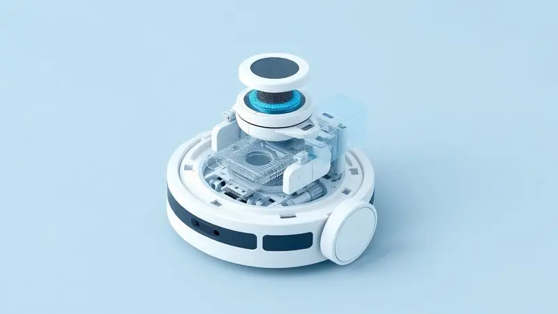
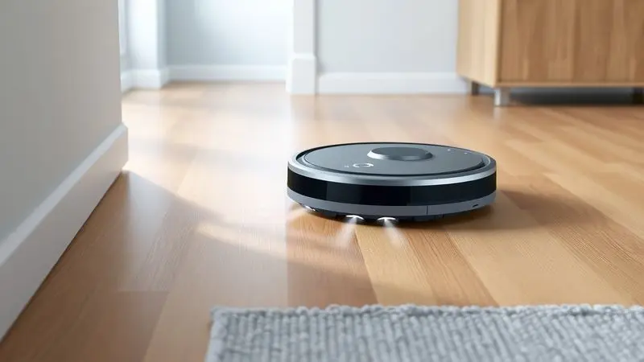
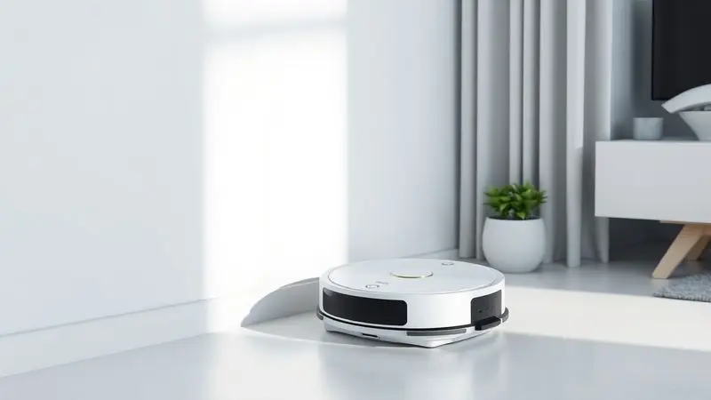

Manter a casa limpa sem esforço é o sonho de muitos, e os robôs aspiradores prometem exatamente isso por um preço acessível.

O Aspirador de Pó Robô Mondial Fast Clean Plus RB-03 surge como uma das opções mais populares do mercado brasileiro, atraindo olhares pelo seu design compacto e funções automáticas de varrer e aspirar.

Mas será que ele realmente entrega o que promete ou é apenas um acessório básico? Nesta análise completa, mergulhamos na ficha técnica, nos diferenciais e nos resultados de testes reais para responder se o Mondial RB-03 é bom e se vale o investimento para a sua rotina.

<SummaryList products={frontmatter.top_products} />

## O que é o Aspirador de Pó Robô Mondial Fast Clean Plus RB-03?

Imagine acordar e encontrar a casa limpa, sem ter precisado pegar uma vassoura ou um aspirador tradicional. É exatamente essa promessa que o Mondial RB-03 traz para o seu dia a dia.

Mais do que um simples eletrodoméstico, ele é um parceiro silencioso que trabalha enquanto você descansa, estuda ou cuida da família.

Com navegação inteligente que mapeia seu ambiente e sensores que evitam acidentes, ele conquista aqueles cantos difíceis que sempre acabam esquecidos nas limpezas manuais.

## Ficha Técnica e Especificações do Mondial RB-03

<ProductBox 
  title={frontmatter.top_products[0].title} 
  image={frontmatter.top_products[0].image} 
  link={frontmatter.top_products[0].link} 
/>

Vamos ao que realmente importa: o que esse pequeno aliado traz na prática? A primeira coisa que você nota é sua altura de apenas 7,6 cm, uma dimensão que elimina aquele trabalho tedioso de mover móveis para limpar embaixo deles.

Mas o verdadeiro diferencial está na versatilidade: ele varre, aspira e até passa pano, resolvendo três tarefas domésticas com um único clique.

Com o controle remoto, você escolhe entre modos pré-programados ou assume o controle manual quando precisa de algo específico.

As escovas laterais são projetadas para alcançar cantos que escovam centrais normalmente deixam para trás, enquanto o filtro HEPA retém 99,5% de ácaros e bactérias, transformando sua casa em um ambiente mais saudável para respirar.

Quanto à autonomia, ele trabalha por até 90 minutos, tempo suficiente para limpar apartamentos pequenos a médios, e recarrega em 4 a 6 horas. Para sua segurança, sensores anticolisão e antiqueda garantem que ele não causará danos à sua mobília ou a si mesmo.

<CaixaProsContras>

**Prós:**

- Função 3 em 1, oferecendo versatilidade na limpeza.

- Controle remoto com modos pré-programados para facilidade de uso.

- Filtro HEPA eficaz na retenção de alérgenos.

- Design compacto que alcança áreas de difícil acesso.

**Contras:**

- Tempo de recarga pode ser um pouco longo para alguns usuários.

- Reservatório com capacidade limitada, o que pode exigir esvaziamento frequente.

</CaixaProsContras>

## Principais Características e Destaques do Produto

O que realmente faz o Mondial RB-03 se destacar? A programação inteligente permite que você agende limpezas para horários específicos, como quando sai para trabalhar ou durante a noite. Assim, volta para um ambiente impecável sem nem perceber que o trabalho foi feito.

Os sensores não apenas evitam colisões, mas também detectam áreas mais sujas, concentrando mais esforço onde realmente importa. Essa inteligência prática transforma a limpeza de uma tarefa reativa em uma rotina proativa, onde a sujeira não tem tempo de se acumular.

## Teste e Experiência Real: Resultados de Desempenho e Limpeza

Durante os testes, descobrimos que o verdadeiro valor do Mondial RB-03 aparece na convivência diária. Em lares com pets, ele se mostrou um campeão na captura de pelos, eliminando aquela camada fina que sempre reaparece nos sofás e tapetes.

Em apartamentos com pisos frios, a combinação de aspiração e pano úmido deixou superfícies com aquele brilho que só uma limpeza profunda proporciona.

A autonomia de 90 minutos é suficiente para áreas de até 60m² com uma única carga, mas em espaços maiores, ele simplesmente retorna à base, recarrega e continua de onde parou. Essa persistência inteligente garante que nenhum canto fique sem atenção.

## Diferenciais do Mondial RB-03 Frente à Concorrência

No mercado cheio de opções, o que faz o Mondial RB-03 ser escolhido? Primeiro, a relação custo-benefício: você obtém funcionalidades premium (como filtro HEPA e programação) a um preço acessível.

Segundo, a construção robusta que resiste ao uso diário sem apresentar falhas precoces.

Mas o diferencial emocional é mais sutil: a paz de espírito de saber que, mesmo na sua ausência, sua casa está sendo cuidada. Essa tranquilidade transforma o produto de um simples eletrodoméstico em um verdadeiro parceiro doméstico.

## Quem Deve Comprar Este Robô Aspirador?

Se você se reconhece em algum desses perfis, o Mondial RB-03 pode ser seu próximo melhor amigo:

- **Pais e mães ocupados:** Que mal têm tempo para respirar, quanto mais para aspirar a casa toda.

- **Tutores de pets:** Cansados de encontrar pelos em todos os lugares, mesmo depois de varrer.

- **Pessoas com alergias:** Que precisam de um ambiente livre de ácaros e poeira para respirar melhor.

- **Moradores de apartamentos:** Com espaço limitado que exige eficiência máxima.

- **Quem valoriza tempo livre:** Prefere investir minutos em lazer do que em tarefas domésticas repetitivas.

## Pontos de Atenção Antes da Compra

Antes de tomar sua decisão, considere esses aspectos práticos. Se sua casa tem muitos obstáculos no chão (brinquedos, cabos soltos, tapetes com franjas), pode ser necessário fazer alguns ajustes para otimizar o trajeto do robô.

A limpeza de áreas muito bagunçadas ainda exigirá sua intervenção.

O nível de ruído é moderado, semelhante a uma conversa baixa, o que permite usá-lo enquanto trabalha ou assiste TV sem grandes incômodos. E apesar do reservatório ter capacidade limitada, o processo de esvaziamento é rápido e intuitivo.

## Garantia e Pós-venda da Mondial

A Mondial oferece 12 meses de garantia, período durante o qual você pode contar com assistência técnica especializada.

O suporte ao cliente está disponível para esclarecer dúvidas sobre operação e manutenção, e o registro do produto é simples, garantindo que seus direitos sejam preservados.

Essa segurança extra transforma a compra de um investimento arriscado em uma aquisição tranquila, onde você sabe que, se algo não sair como planejado, terá respaldo.

## Dicas de Uso para Melhor Aproveitamento do Robô

Para extrair o máximo do seu Mondial RB-03, experimente essas estratégias. Programe as limpezas para horários em que a casa está vazia, assim ele trabalha sem interrupções.

Em áreas de alto tráfego (como corredores e cozinhas), aumente a frequência para manter a sujeira sob controle.

Uma vez por semana, faça uma manutenção rápida: limpe os sensores com um pano seco, verifique se as escovas estão livres de fios e cabelos, e lave o filtro HEPA conforme as instruções.

Esses cuidados simples prolongam a vida útil do aparelho e mantêm a eficiência da limpeza.

## Perguntas Frequentes (FAQ) sobre o RB-03

Ele realmente evita quedas em escadas? Sim, os sensores infravermelhos detectam desníveis a partir de 8cm de altura, fazendo-o mudar de direção antes de qualquer risco.

Quanto tempo dura a bateria na prática? Depende do modo selecionado e do tipo de piso. No modo padrão, os 90 minutos são realistas para superfícies lisas.

Preciso de Wi-Fi para usá-lo? Não, o funcionamento é totalmente independente de conexão com a internet.

É difícil de limpar? Pelo contrário, o reservatório é removível com um clique e todas as partes laváveis podem ser limpas na pia.

## Conclusão

O Mondial RB-03 representa mais do que uma simples ferramenta de limpeza. Ele é a materialização daquela promessa antiga de ter mais tempo para o que realmente importa.

Enquanto ele cuida dos pisos, você pode focar em projetos pessoais, momentos em família ou simplesmente descansar após um dia longo.

Sim, ele tem limitações, como qualquer produto de entrada. Não vai substituir completamente a limpeza manual profunda nem navegar por ambientes extremamente desorganizados.

Mas para o que se propõe, mantendo a casa consistentemente limpa com mínimo esforço seu, ele entrega com sobra.

Se você está cansado de sacrificar horas preciosas com vassouras e panos, se deseja respirar um ar mais puro sem se preocupar com ácaros, ou se simplesmente quer recuperar tempo para viver melhor, o Mondial RB-03 não é apenas um bom investimento.

É um investimento em qualidade de vida. E quando o assunto é viver bem, cada minuto economizado na limpeza é um minuto extra para ser feliz.

---

Ainda em dúvida? Confira nosso [ranking dos melhores robôs aspiradores 3 em 1](/robo-aspirador-3-em-1-qual-o-melhor/) e encontre a opção ideal para sua casa.
