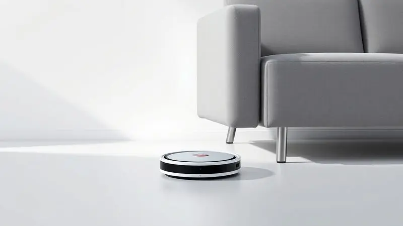
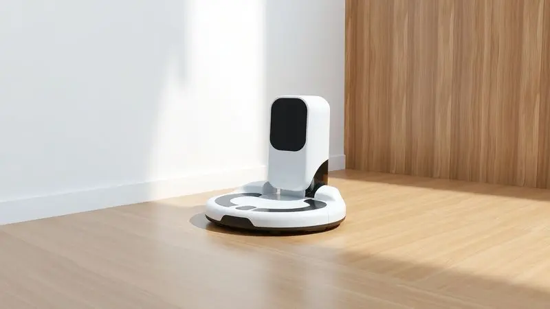
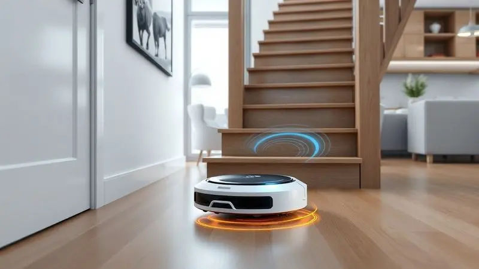
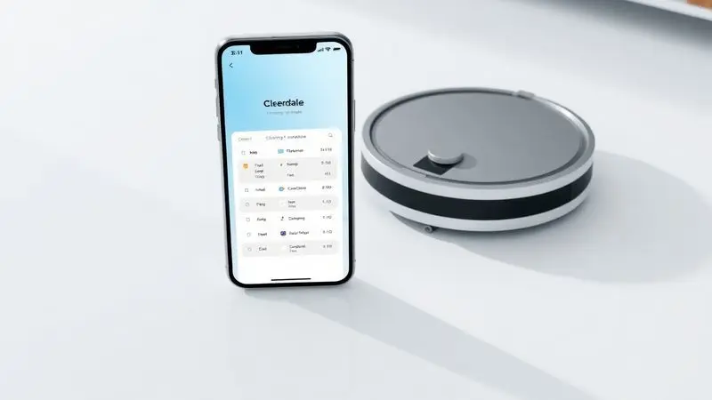

Os robôs aspiradores deixaram de ser itens de luxo para se tornarem aliados essenciais na limpeza doméstica diária.

Entre as opções mais procuradas no mercado brasileiro, destaca-se o Mondial Fast Clean Advanced RB-04, um modelo que promete praticidade com um custo-benefício atraente. Mas será que o robô aspirador Mondial Fast Clean Advanced RB-04 é bom de verdade?

Com funções que variam desde aspirar até passar pano, ele desperta dúvidas sobre sua eficiência real em diferentes tipos de piso e autonomia de bateria.

Nesta análise completa, exploramos cada detalhe técnico e funcional para ajudar você a decidir se este investimento vale a pena para a sua rotina.

<SummaryList products={frontmatter.top_products} />

## O que é o robô aspirador Mondial Fast Clean Advanced RB-04?

O robô aspirador Mondial Fast Clean Advanced RB-04 é um dispositivo autônomo projetado para facilitar a limpeza de ambientes. Equipado com tecnologia de navegação e sensores, ele consegue identificar obstáculos e se deslocar de forma eficiente pelo ambiente.

Seu design compacto permite acessar áreas de difícil alcance, enquanto seu sistema de sucção promete uma limpeza eficaz em diferentes tipos de superfícies, como pisos frios e carpetes.

Além disso, ele geralmente conta com uma bateria recarregável, oferecendo praticidade e autonomia durante o uso. Ideal para quem busca otimizar o tempo de limpeza diária.

## Ficha técnica do Mondial Fast Clean Advanced RB-04

<ProductBox 
  title={frontmatter.top_products[0].title} 
  image={frontmatter.top_products[0].image} 
  link={frontmatter.top_products[0].link} 
/>

Imagine um robô que trabalha enquanto você se concentra no que realmente importa. O Mondial Fast Clean Advanced RB-04 oferece essa liberdade com uma autonomia de até 90 minutos, tempo suficiente para percorrer sua sala, cozinha e até um quarto sem parar.

Com apenas 8,5 cm de altura, ele desliza sob seus móveis como um profissional, alcançando aqueles cantos esquecidos que sua vassoura tradicional nunca vê.

Sua potência de trabalho chega a 40W, combinada com um reservatório removível de 330ml que facilita a limpeza. O segredo por trás da eficiência? Um filtro HEPA que retém impressionantes 99,5% dos ácaros e bactérias, oferecendo mais saúde para sua casa.

Para completar, o carregamento leva de 4 a 6 horas, preparando-o para outra jornada de limpeza.

<CaixaProsContras>

**Prós:**

- Função 3 em 1 que varre, aspira e passa pano.

- Design slim que alcança áreas de difícil acesso.

- Filtro HEPA eficiente na retenção de alérgenos.

- Controle remoto que facilita o manejo.

**Contras:**

- A autonomia pode não ser suficiente para residências maiores.

- Tempo de carregamento pode ser considerado longo.

</CaixaProsContras>

## Design Super Slim e construção do aparelho

Essa baixa altura de 8,5 cm não é apenas um número. É a chave para acessar espaços que você nem lembrava que existiam. Pense na facilidade de limpar sob sua cama, guarda-roupas baixos ou o sofá da sala sem precisar mover um móvel sequer.

Suas bordas arredondadas são calculadas para navegar entre suas cadeiras e mesas sem deixar marcas ou arranhões.

Visualmente, sua aparência moderna se integra discretamente ao seu ambiente, como mais um eletrodoméstico funcional que não pede atenção, apenas faz seu trabalho.

## Funcionamento e modos de movimento do Mondial RB-04

Aqui é onde a inteligência se manifesta. O RB-04 não se move de forma aleatória. Ele segue padrões calculados. Imagine-o trabalhando em espiral em áreas centrais mais sujas e alternando para movimentos em zig-zag quando encontra superfícies maiores.

Essa adaptabilidade inteligente garante que cada centímetro do seu piso frio ou carpete receba atenção adequada, sem deixar áreas sem limpar.

### Função 3 em 1: Varre, aspira e passa pano

Por que usar três equipamentos quando um resolve? A verdadeira magia do RB-04 está nessa combinação que elimina etapas da sua rotina de limpeza. Primeiro, suas cerdas removem partículas maiores. Em seguida, a sucção entra em ação para capturar a poeira mais fina.

Finalmente, se você optar pelo modo pano, um reservatório úmido completa o trabalho deixando seus pisos não apenas limpos, mas verdadeiramente brilhantes. É como ter uma equipe de limpeza em miniatura trabalhando silenciosamente enquanto você faz outras coisas.

## Cobertura de bateria e retorno automático à base carregadora

Nada é mais frustrante do que encontrar seu robô preso embaixo da mesa com a bateria morta. É exatamente aqui que o RB-04 mostra seu diferencial.

Com sua inteligente função de retorno automático, quando os sensores detectam que a bateria está baixa (geralmente após cerca de 90 minutos de trabalho), ele navega de volta até sua base sozinho.

Você pode programar uma limpeza pela manhã e sair tranquilo, sabendo que ele encontrará o caminho de casa quando terminar. É essa independência que transforma um dispositivo em um verdadeiro aliado doméstico.

## Controle remoto e funções pré-programadas

Controle total sem precisar se abaixar. O controle remoto oferece essa comodidade simples mas revolucionária. Pause quando alguém entrar no caminho, mude de modo quando mudar de ambiente ou, melhor ainda, programe horários específicos.

Quer acordar com sua sala já limpa? Programe para 7h da manhã e desfrute do café da manhã em um ambiente renovado. Para quem tem rotinas imprevisíveis, essa flexibilidade significa que a limpeza se adapta à sua vida, não o contrário.

## Sensores antiqueda e anticolisão

Segurança primeiro, sempre. Os múltiplos sensores do RB-04 trabalham como um sistema de vigilância permanente. Quando se aproxima de uma escada ou desnível, os sensores antiqueda impedem uma queda potencialmente danosa.

Simultaneamente, os sensores anticolisão mapeiam objetos no caminho, fazendo ajustes milimétricos para contornar pernas de móveis, vasos ou brinquedos esquecidos. O resultado?

Você pode focar em seus compromissos enquanto ele cuida da limpeza, sem aquele nervosismo constante de ter que resgatá-lo de situações complicadas.

## Filtro HEPA lavável e manutenção do reservatório

A manutenção não precisa ser complicada. O filtro HEPA lavável é uma demonstração de inteligência sustentável. Em vez de comprar filtros descartáveis regularmente, você simplesmente lava, deixa secar e reutiliza. Economiza dinheiro e reduz desperdício.

Quanto ao reservatório de 330ml, sua remoção é tão intuitiva quanto encaixar e desencaixar. A limpeza pós-uso leva segundos, mantendo a eficiência do sistema sempre no máximo.

São esses pequenos detalhes que transformam um produto bom em um investimento inteligente a longo prazo.

## Aplicativo e conectividade do Mondial RB-04

Nos dias atuais, conectividade não é luxo, é necessidade. O aplicativo dedicado do RB-04 expande seu controle para além do físico.

De onde estiver, você pode iniciar uma limpeza extra, verificar o histórico de uso ou ajustar configurações específicas para diferentes dias da semana.

A integração com assistentes de voz adiciona uma camada de conveniência: um simples comando de voz e sua limpeza começa. Para quem valoriza tecnologia integrada ao estilo de vida moderno, essa conectividade faz toda a diferença.

## Comparativo: Mondial RB-04 vs ObaDuster e outros concorrentes

No universo dos robôs aspiradores brasileiros, duas forças se destacam. O Mondial RB-04 se posiciona como o robusto: com sucção potente de 40W e capacidade de lidar tanto com pisos frios quanto com carpetes leves.

Sua programação precisa e bateria de 90 minutos o tornam ideal para residências médias que precisam de performance consistente.

Já o ObaDuster aposta na agilidade: mais compacto e leve, brilha em apartamentos menores onde a manobrabilidade é crucial. Sua principal vantagem está na facilidade de navegação por espaços apertados.

A escolha se resume ao seu cenário específico: potência e duração ou agilidade e compactação. Para uma casa com múltiplos cômodos e diferentes tipos de piso, o RB-04 oferece a versatilidade necessária.

Para ambientes menores e mais simples, outros modelos podem ser igualmente eficientes.

## Conclusão

O Mondial Fast Clean Advanced RB-04 funciona como um assistente silencioso que transforma a limpeza doméstica de uma tarefa árdua em um processo automatizado. Seu verdadeiro valor não está apenas nas especificações técnicas, mas na liberdade que ele oferece.

Imagine ter mais tempo para seus hobbies, família ou simplesmente descansar, enquanto seu piso permanece impecável.

Para quem mora em apartamentos ou casas de tamanho médio, sua autonomia de 90 minutos é mais que suficiente. O filtro HEPA é um diferencial de saúde especialmente importante para famílias com crianças ou pessoas alérgicas.

A função 3 em 1 elimina a necessidade de múltiplos equipamentos, economizando espaço e simplificando a rotina.

No entanto, é importante manter expectativas realistas. Em residências muito grandes ou com sujeira excessiva de animais de estimação, sua potência pode encontrar limites.

A decisão final depende do equilíbrio entre o que você procura: conveniência automática ou potência máxima.

Para a maioria dos brasileiros que buscam uma solução prática e eficiente para a limpeza diária, o Mondial RB-04 representa um investimento que realmente facilita o dia a dia, devolvendo horas preciosas que antes eram gastas com tarefas domésticas.

---

Ainda na dúvida sobre o Mondial RB-04? Confira nosso [ranking dos melhores robôs aspiradores 3 em 1](/robo-aspirador-3-em-1-qual-o-melhor/) e encontre a opção ideal para sua casa.
